# AI/LLM 系统架构理论指南

**学习深度**: ⭐⭐⭐⭐⭐

---

## 第一部分:Agent 架构理论

### 1.1 Agent 基础概念

**什么是 LLM Agent?**

Agent 是能够感知环境、做出决策并采取行动以实现目标的自主系统。在 LLM 领域,Agent 是基于大语言模型构建的智能体,能够使用工具、访问外部信息并完成复杂任务。

**核心组件**:

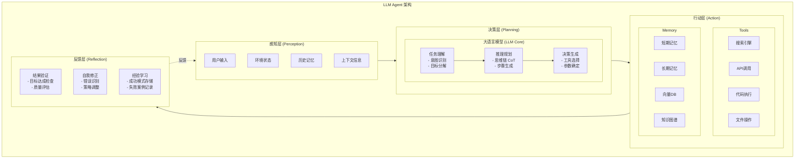

**Agent 能力维度**:

| 能力 | 说明 | 示例 |
|------|------|------|
| 感知 | 理解输入和环境 | 解析用户意图、识别上下文 |
| 推理 | 逻辑推理和规划 | 任务分解、步骤规划 |
| 行动 | 使用工具执行任务 | 调用 API、搜索信息 |
| 学习 | 从经验中改进 | 记忆积累、策略优化 |
| 交互 | 与用户和环境沟通 | 澄清问题、报告进度 |

### 1.2 ReAct (Reasoning + Acting) 架构

**核心思想**:
通过交替进行推理 (Reasoning) 和行动 (Acting) 来解决问题,将思考过程显式化。

**工作流程**:

用户问题: "今天北京的天气如何?明天需要带伞吗?"

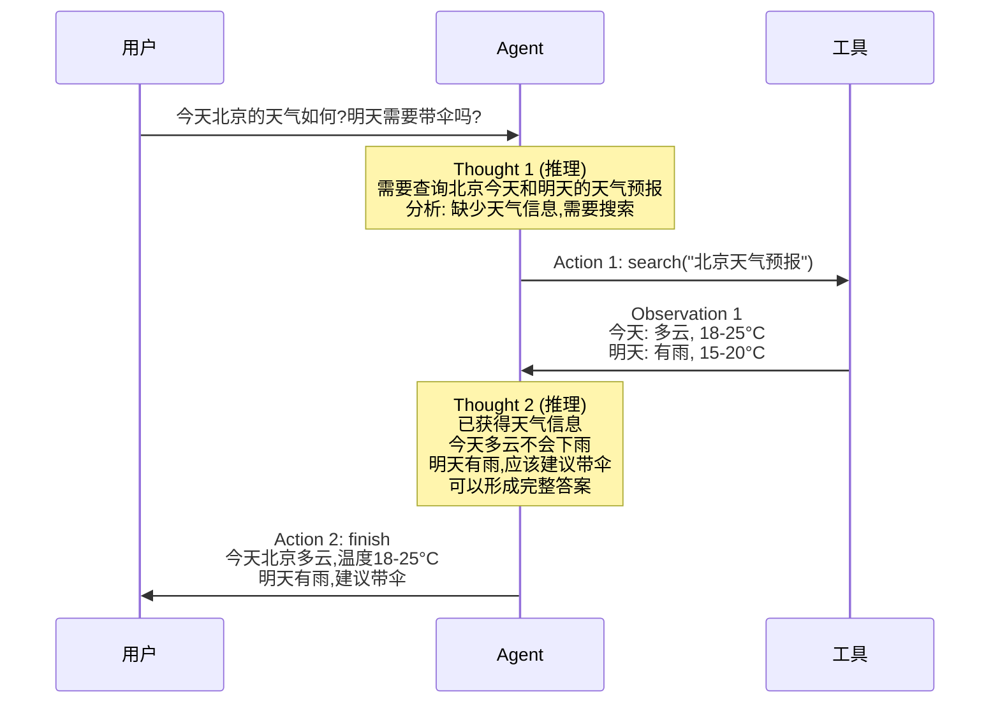

**ReAct vs 标准提示**:

| 方法 | 特点 | 优势 | 劣势 |
|------|------|------|------|
| 标准提示 | 一次性生成答案 | 简单快速 | 无法使用工具、可能幻觉 |
| ReAct | 思考-行动循环 | 可调用工具、过程可解释、错误可修正 | 多次 LLM 调用、成本高、可能循环 |

**ReAct 循环控制**:

```
最大迭代次数: 10

迭代 1: Thought → Action → Observation
迭代 2: Thought → Action → Observation
...
迭代 N: Thought → Final Answer

退出条件:
1. 生成 Final Answer
2. 达到最大迭代次数
3. 检测到无效循环 (重复相同的 Thought/Action)
4. 工具执行失败且无法恢复
```

### 1.3 Plan-and-Execute 架构

**核心思想**:
先制定完整的执行计划,然后按步骤执行,适合结构化任务。

**架构对比**:

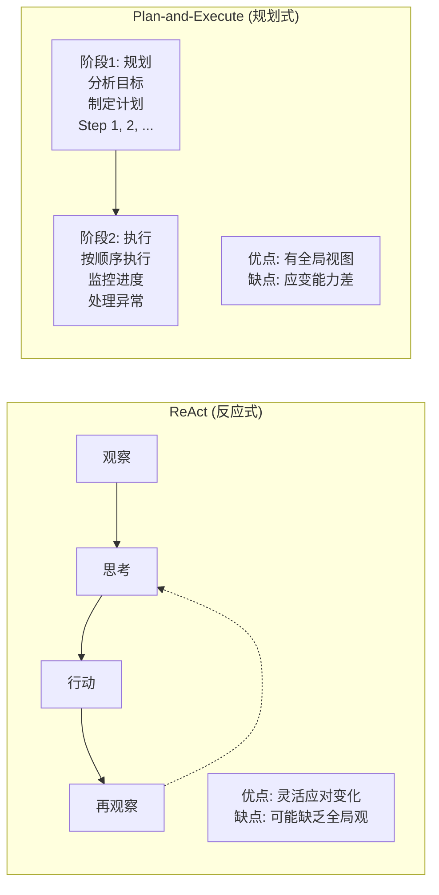

**工作流程**:

用户目标: "分析比特币最近一周的价格走势并预测明天的价格"

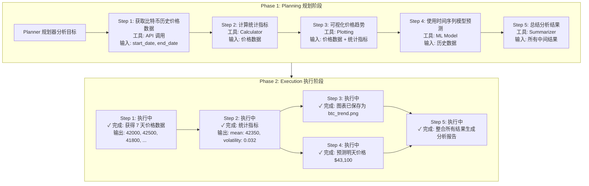

**依赖处理**:

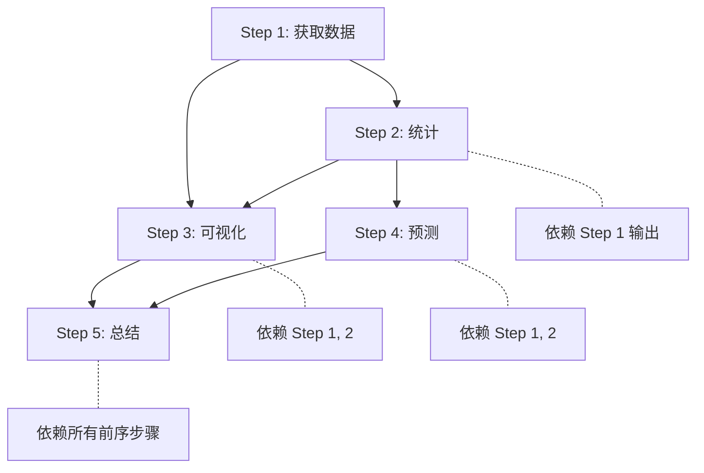

执行顺序: `1 → 2 → (3 || 4) → 5` (3 和 4 可以并行执行)

**异常处理**:

```
Step N 执行失败

策略 1: 重试
   - 最多重试 3 次
   - 指数退避

策略 2: 跳过
   - 标记为失败
   - 继续执行不依赖此步骤的后续步骤

策略 3: 替代方案
   - 使用备用工具或方法
   - 例如: API 失败 → 使用缓存数据

策略 4: 终止
   - 关键步骤失败
   - 报告失败原因
   - 返回部分结果
```

### 1.4 Multi-Agent 协作架构

**核心思想**:
多个专业化的 Agent 协作完成复杂任务,每个 Agent 负责特定领域。

**协作模式**:

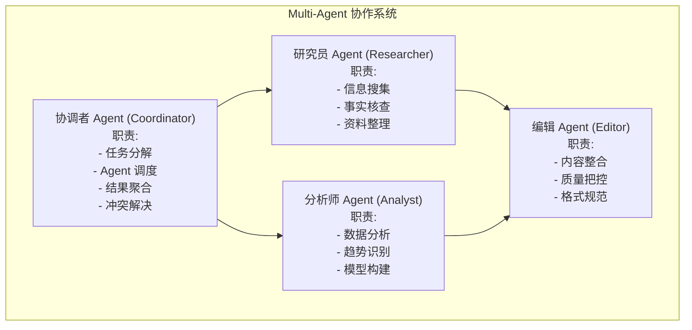

**通信模式**:

**1. 中心化通信 (Hub-and-Spoke)**

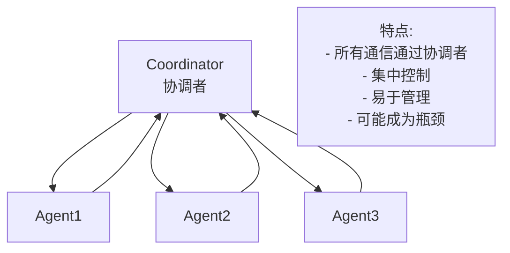

**2. 去中心化通信 (Peer-to-Peer)**

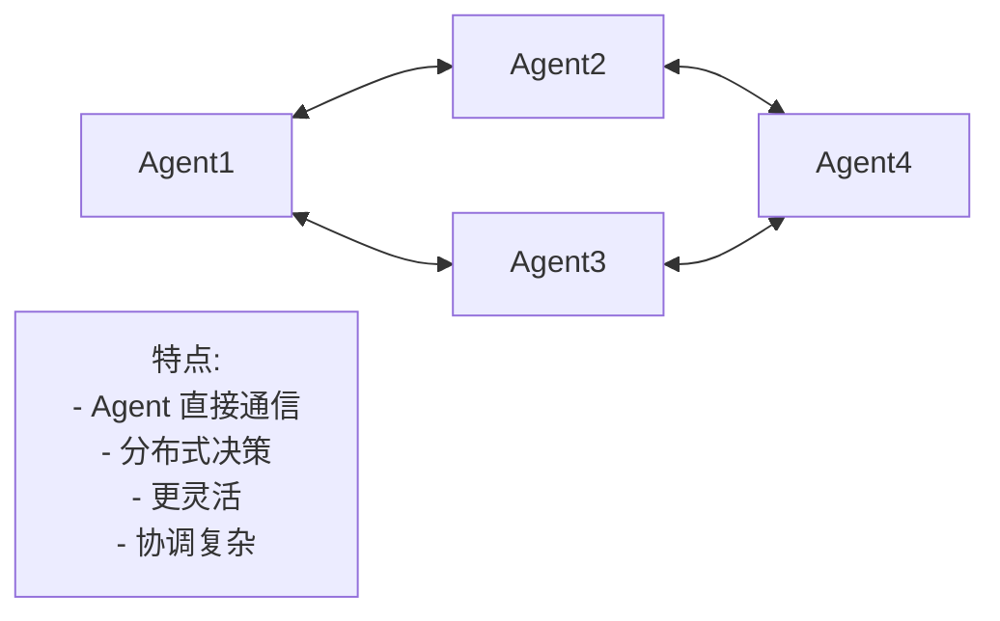

**3. 黑板模式 (Blackboard)**

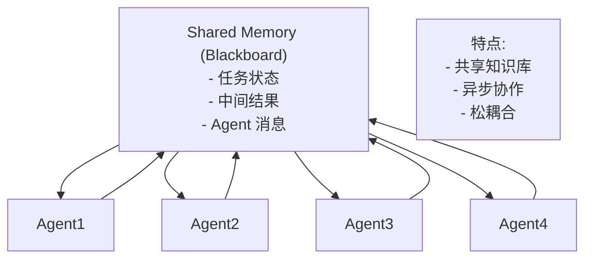

**协作流程示例**:

任务: "分析 AI 在医疗领域的应用现状和未来趋势"

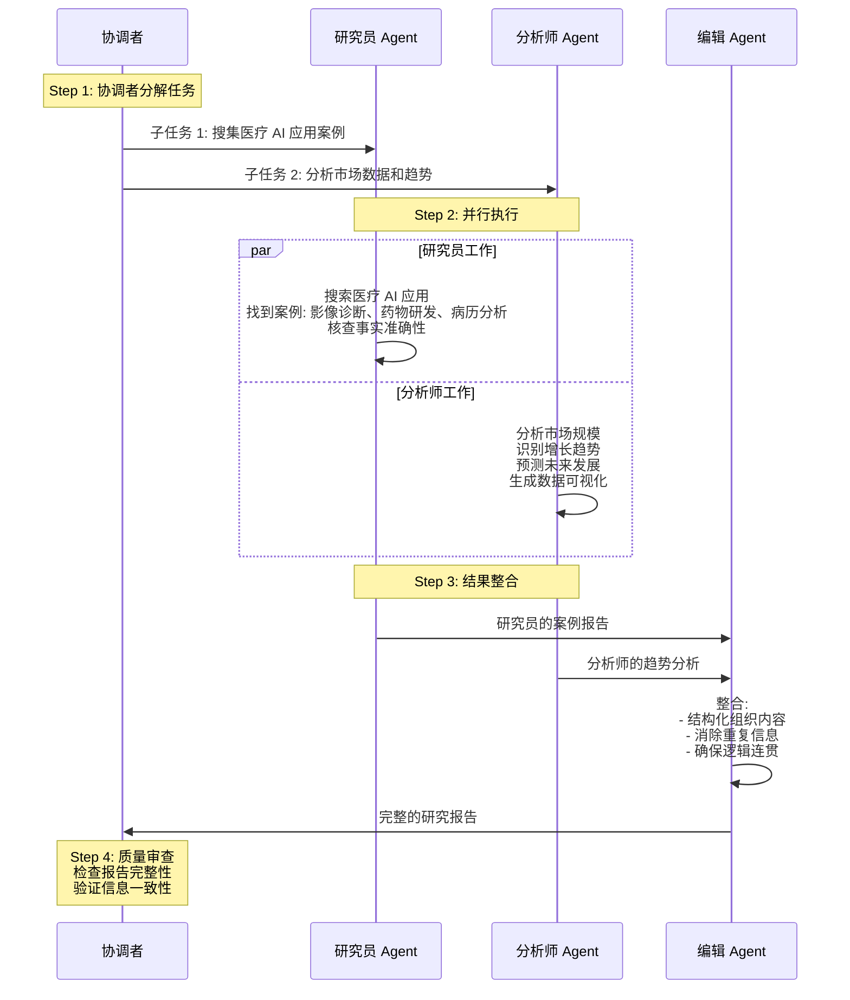

**冲突解决机制**:

场景: 两个 Agent 提供了矛盾的信息

```
研究员: "AI 医疗市场规模 100 亿美元"
分析师: "AI 医疗市场规模 150 亿美元"

解决策略:

1. 投票机制
   - 多个 Agent 投票
   - 多数意见获胜

2. 权威性排序
   - 根据 Agent 专业性
   - 分析师在数据分析上权威性高

3. 证据检查
   - 要求提供信息来源
   - 评估来源可信度

4. 协调者裁决
   - 协调者综合评估
   - 做出最终决定

5. 保留多个版本
   - 标注信息来源
   - 让用户选择
```

---

## 第二部分:LLM 推理优化理论

### 2.1 推理性能基础

**推理流程**:

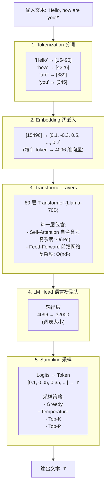

**性能瓶颈分析**:

**1. 内存带宽 (Memory Bandwidth)**

```
问题:
模型参数从 HBM (High Bandwidth Memory) 加载到计算单元

Llama-70B 模型:
- 参数量: 70B
- FP16 精度: 140 GB
- 每次前向传播都要加载权重

计算强度 (Compute Intensity):
= FLOPS / 内存访问量
= 低 (Memory-Bound)

瓶颈在内存带宽,而非计算能力
```

**2. 注意力机制复杂度**

```
Self-Attention 计算:
Query × Key^T → Attention Scores
Scores × Value → Output

复杂度: O(n²d)
n: 序列长度 (如 4096)
d: 模型维度 (如 4096)

序列长度增加时:
n=1000  → 计算量: 1,000²d
n=2000  → 计算量: 4,000²d (4倍)
n=4000  → 计算量: 16,000²d (16倍)

长序列成为性能瓶颈
```

**3. KV Cache**

```
自回归生成特点:
每次生成一个 token

不使用 KV Cache:
Token 1: 计算 Q, K, V
Token 2: 重新计算 Token 1, 2 的 Q, K, V
Token 3: 重新计算 Token 1, 2, 3 的 Q, K, V
...
浪费计算

使用 KV Cache:
Token 1: 计算并缓存 K, V
Token 2: 只计算新的 K, V,重用之前的
Token 3: 只计算新的 K, V,重用之前的
...
节省计算

KV Cache 大小:
每个 token: 2 (K+V) × num_layers × d
例如: 2 × 80 × 4096 = 655,360 字节 ≈ 640 KB
1000 tokens: 640 MB
```

### 2.2 vLLM 架构原理

**核心创新: PagedAttention**

**传统 KV Cache 管理**:

```
问题: 连续内存分配

Sequence 1 (500 tokens, 预分配 2048 tokens):
┌──────────────────────────────────────┐
│ [Used: 500 tokens]                   │
│ [Unused: 1548 tokens] ← 浪费         │
└──────────────────────────────────────┘

Sequence 2 (300 tokens, 预分配 2048 tokens):
┌──────────────────────────────────────┐
│ [Used: 300 tokens]                   │
│ [Unused: 1748 tokens] ← 浪费         │
└──────────────────────────────────────┘

内存利用率: ~20-40%
内存碎片化严重
```

**PagedAttention 方案**:

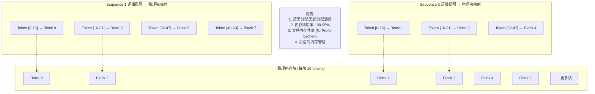

思想: 借鉴操作系统的虚拟内存分页

**内存管理器**:

```
┌─────────────────────────────────┐
│     Block Manager               │
│                                 │
│  Free Blocks Pool:              │
│  [Block 8, 9, 10, 11, ...]     │
│                                 │
│  Allocated Blocks:              │
│  Seq 1: [0, 2, 5, 7]           │
│  Seq 2: [1, 3, 4]              │
│                                 │
│  Block Table:                   │
│  ┌───────────────────────────┐ │
│  │ Seq ID │ Logical │ Physical│ │
│  ├───────────────────────────┤ │
│  │   1    │  [0-15] │    0   │ │
│  │   1    │ [16-31] │    2   │ │
│  │   2    │  [0-15] │    1   │ │
│  └───────────────────────────┘ │
└─────────────────────────────────┘

分配策略:
1. 请求新块: 从 Free Pool 分配
2. 块满: 分配新块
3. 序列完成: 释放块回 Pool
4. 内存不足: 驱逐最久未使用的序列
```

**Prefix Caching (前缀共享)**:

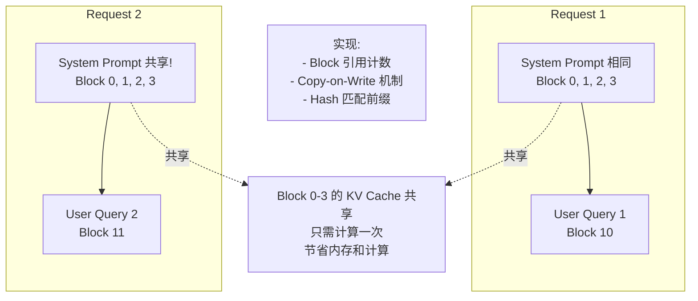

场景: 多个请求共享相同的 system prompt

### 2.3 TensorRT-LLM 优化技术

**优化层次**:

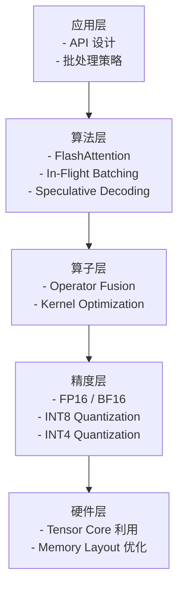

**1. 算子融合 (Operator Fusion)**

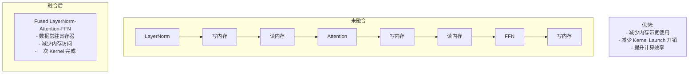

**2. 量化 (Quantization)**

```
FP16 (16-bit 浮点数):
┌──────────────────────────────────┐
│ 符号位(1) | 指数位(5) | 尾数位(10)│
└──────────────────────────────────┘
表示范围: ±65,504
精度: 0.001

INT8 (8-bit 整数):
┌────────────────┐
│ 值: -128 ~ 127 │
└────────────────┘

量化过程:
FP16 值: [0.123, -0.456, 0.789, ...]
    │
    ▼
找到 scale 和 zero_point
scale = (max - min) / 255
    │
    ▼
INT8 值: [31, -116, 201, ...]

反量化:
FP16 = INT8 × scale + zero_point

收益:
- 内存减半 (FP16 → INT8)
- 计算速度 2-4x
- 精度损失 < 1%
```

**INT8 vs INT4 量化**:

```
权重存储:
FP16: 2 bytes/weight
INT8: 1 byte/weight  (2x 压缩)
INT4: 0.5 byte/weight (4x 压缩)

Llama-70B 模型:
FP16:  140 GB
INT8:   70 GB
INT4:   35 GB

加载时间:
FP16: 7 秒
INT8: 3.5 秒
INT4: 1.75 秒

精度对比:
FP16: 基线
INT8: -0.5% ~ -1% 准确率
INT4: -1% ~ -3% 准确率
```

**3. FlashAttention**

```
标准 Attention 内存访问:
┌─────────────────────────────────┐
│ 1. 从 HBM 加载 Q, K, V          │
│ 2. 计算 QK^T → SRAM             │
│ 3. 写回 HBM                     │
│ 4. 从 HBM 读取                  │
│ 5. 计算 Softmax → SRAM          │
│ 6. 写回 HBM                     │
│ 7. 从 HBM 读取                  │
│ 8. 计算 Attention × V           │
└─────────────────────────────────┘
HBM 访问次数: 多次
内存需求: O(n²) (存储 attention matrix)

FlashAttention:
┌─────────────────────────────────┐
│ 分块计算 (Tiling)               │
│                                 │
│ 1. 分块加载 Q, K, V 到 SRAM    │
│ 2. 在 SRAM 内完成所有计算       │
│ 3. 增量更新结果                 │
│ 4. 不需要存储完整 attention    │
└─────────────────────────────────┘
HBM 访问次数: 大幅减少
内存需求: O(n) (只存储最终结果)

加速比:
序列长度 1k:  2x
序列长度 4k:  4x
序列长度 16k: 8x
```

**4. In-Flight Batching (动态批处理)**

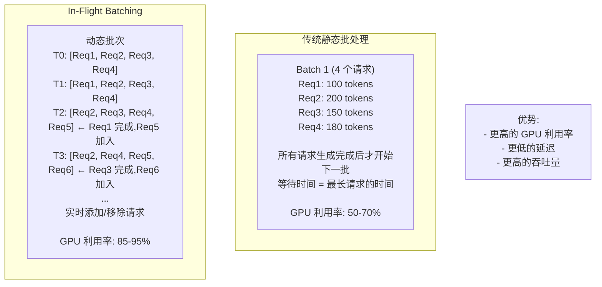

### 2.4 推理优化策略

#### 投机解码 (Speculative Decoding)

**原理**:

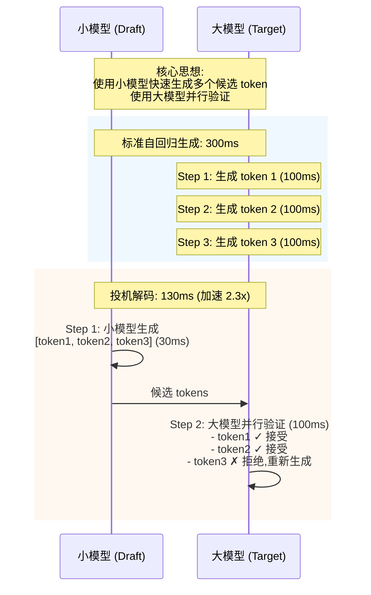

**验证机制**:

```
小模型生成: [A, B, C, D]

大模型验证:
┌─────────────────────────────────┐
│  输入前缀 + A                   │
│  大模型预测: A 的概率 0.8       │
│  小模型预测: A 的概率 0.7       │
│  随机数 r = 0.6                │
│  r < 0.8? ✓ 接受 A             │
├─────────────────────────────────┤
│  输入前缀 + A + B               │
│  大模型预测: B 的概率 0.6       │
│  小模型预测: B 的概率 0.5       │
│  随机数 r = 0.5                │
│  r < 0.6? ✓ 接受 B             │
├─────────────────────────────────┤
│  输入前缀 + A + B + C           │
│  大模型预测: C 的概率 0.3       │
│  小模型预测: C 的概率 0.4       │
│  随机数 r = 0.4                │
│  r < 0.3? ✗ 拒绝 C             │
│  从大模型分布重新采样 → C'     │
└─────────────────────────────────┘

最终输出: [A, B, C']
```

**模型选择**:

```
小模型 (Draft Model):
- 参数量: 1/10 ~ 1/5 大模型
- 延迟: 10-20% 大模型
- 准确率: 70-80%

示例:
大模型: Llama-70B (70B 参数)
小模型: Llama-7B (7B 参数)

加速比:
- 平均接受率 60%: 1.8x 加速
- 平均接受率 70%: 2.3x 加速
- 平均接受率 80%: 3.0x 加速
```

---

## 第三部分:RAG 系统理论

### 3.1 RAG 核心概念

**什么是 RAG?**

RAG (Retrieval-Augmented Generation) 检索增强生成,通过检索外部知识库来增强 LLM 的生成能力。

**为什么需要 RAG?**

```
LLM 固有局限:
1. 知识截止日期
   - 训练数据有时间限制
   - 无法获取最新信息

2. 幻觉问题
   - 生成不存在的事实
   - 编造参考文献

3. 领域知识不足
   - 通用训练,缺少专业深度
   - 企业私有数据无法访问

4. 可解释性差
   - 难以溯源信息来源
   - 无法验证答案准确性

RAG 解决方案:
1. 实时检索最新信息
2. 基于事实回答,减少幻觉
3. 注入专业领域知识
4. 提供信息来源,可追溯
```

**RAG vs Fine-tuning**:

| 维度 | RAG | Fine-tuning |
|------|-----|-------------|
| 知识更新 | 实时,更新文档即可 | 需要重新训练 |
| 成本 | 低,只需存储和检索 | 高,需要 GPU 训练 |
| 准确性 | 高,基于事实文档 | 中,依赖训练质量 |
| 可解释性 | 强,提供文档来源 | 弱,黑盒模型 |
| 适用场景 | 事实性问答、知识密集 | 风格适配、任务特化 |

### 3.2 RAG 架构

**标准 RAG Pipeline**:

```mermaid
graph TB
    Query["用户查询: 'What are the new features in Python 3.12?'"]

    Step1["Step 1: 查询理解与改写<br/><br/>原始查询分析:<br/>- 意图: 查询新功能<br/>- 实体: Python 3.12<br/>- 类型: 技术文档查询<br/><br/>查询扩展:<br/>'new features Python 3.12'<br/>→ 'new features introduced Python 3.12<br/>release notes changelog improvements'<br/><br/>优势: 提高召回率"]

    Step2["Step 2: 向量化检索<br/><br/>A. 查询向量化<br/>Embedding Model 编码查询<br/>'new features...' → [0.1, -0.3, ...]<br/>(768 维或 1536 维向量)<br/><br/>B. 向量数据库搜索<br/>余弦相似度搜索: similarity = dot(q, d) / (|q||d|)<br/><br/>Top-K 结果:<br/>Doc 1: Python 3.12 Release (0.95)<br/>Doc 2: PEP 695 (0.89)<br/>Doc 3: F-String Syntax (0.85)<br/>Doc 4: Performance (0.82)<br/>Doc 5: Type Hints (0.80)"]

    Step3["Step 3: 重排序 (Re-ranking)<br/><br/>为什么需要重排序?<br/>- 向量检索基于语义相似度<br/>- 但不一定是最相关的答案<br/>- 需要更精细的相关性判断<br/><br/>Cross-Encoder 重排序:<br/>- 输入: [查询, 文档] 对<br/>- 输出: 相关性分数 (0-1)<br/><br/>重排序结果:<br/>Doc 2: 0.94 (提升,最相关)<br/>Doc 1: 0.92 (降低)<br/>Doc 3: 0.81 (降低)<br/><br/>最终选择 Top-3: [Doc 2, Doc 1, Doc 3]"]

    Step4["Step 4: 上下文构建<br/><br/>Context = 整合检索到的文档<br/><br/>Document 2 (最相关):<br/>'PEP 695 introduces type parameter syntax<br/>for generic classes and functions...'<br/><br/>Document 1:<br/>'Python 3.12 release notes...'<br/><br/>Document 3:<br/>'Improved f-string syntax...'<br/><br/>添加元数据:<br/>- 文档来源<br/>- 相关性分数<br/>- 时间戳"]

    Step5["Step 5: 生成回答<br/><br/>Prompt 构建:<br/>System: 你是一个技术文档助手<br/>Context: [检索到的文档内容]<br/>Question: [用户问题]<br/>Instructions:<br/>- 只基于提供的文档回答<br/>- 引用文档编号<br/>- 如信息不足,明确说明<br/><br/>LLM 生成:<br/>'根据文档2,Python 3.12 引入了 PEP 695...<br/>此外,文档1提到了性能改进...'"]

    Query --> Step1 --> Step2 --> Step3 --> Step4 --> Step5
```

### 3.3 向量检索原理

**Embedding (嵌入) 概念**:

```
文本 → 向量

"Python 3.12 new features"
         ↓
[0.12, -0.34, 0.56, 0.23, -0.11, ...]
    (768 维度向量)

语义相似的文本 → 向量空间中距离近

示例:
"Python 3.12 features"  → [0.12, -0.34, 0.56, ...]
"新功能 Python 3.12"    → [0.11, -0.32, 0.54, ...] (相近!)
"Apple fruit nutrition" → [0.88, 0.12, -0.67, ...] (很远)
```

**相似度计算**:

```
1. 余弦相似度 (Cosine Similarity)
   最常用

   cos_sim = (A · B) / (||A|| × ||B||)

   示例:
   A = [1, 2, 3]
   B = [2, 4, 6]  (方向相同,大小不同)

   A · B = 1×2 + 2×4 + 3×6 = 28
   ||A|| = √(1² + 2² + 3²) = √14
   ||B|| = √(2² + 4² + 6²) = √56

   cos_sim = 28 / (√14 × √56) = 1.0 (完全相似)

   范围: [-1, 1]
   1: 完全相似
   0: 正交 (无关)
   -1: 完全相反

2. 欧几里得距离 (Euclidean Distance)
   空间距离

   dist = √(Σ(Ai - Bi)²)

   距离越小,越相似

3. 点积 (Dot Product)
   简单但有效

   dot = Σ(Ai × Bi)

   值越大,越相似
```

**向量索引结构**:

**1. 暴力搜索 (Brute Force)**

```
算法:
- 计算查询向量与所有文档向量的相似度
- 排序,返回 Top-K

复杂度: O(N × D)
N: 文档数量
D: 向量维度

优点: 精确结果
缺点: 慢,不适合大规模

适用场景:
- 小规模数据 (< 10,000 文档)
- 需要100%召回率
```

**2. HNSW (Hierarchical Navigable Small World)**

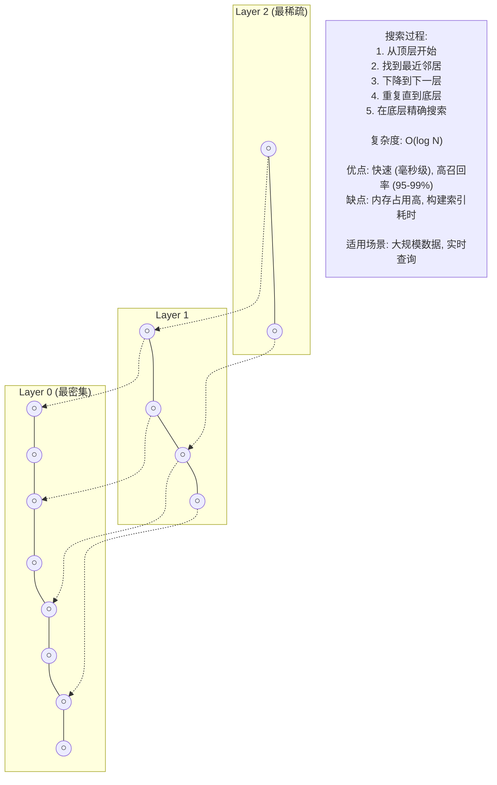

**3. IVF (Inverted File Index)**

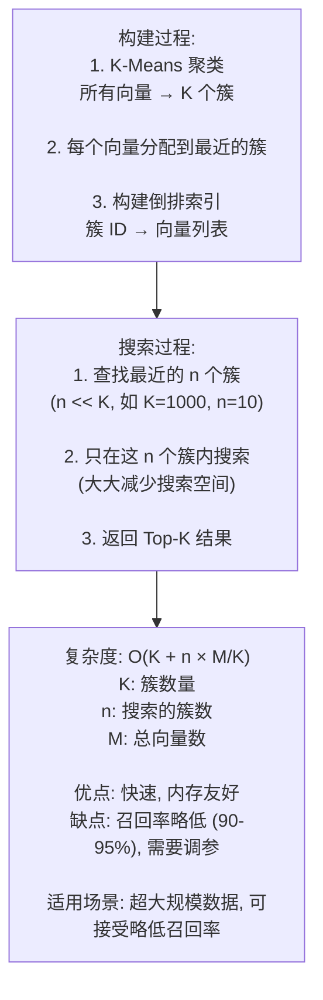

### 3.4 高级 RAG 技术

#### Hybrid Search (混合搜索)

**原理**: 结合向量搜索和关键词搜索

```mermaid
graph TB
    Query["查询: 'Python type hints'"]

    VecSearch["向量搜索 (语义)<br/>优势: 理解语义相似性<br/>劣势: 可能遗漏精确匹配的关键词<br/><br/>结果:<br/>Doc1: 0.9<br/>Doc2: 0.85<br/>Doc4: 0.80"]

    BM25["BM25搜索 (关键词)<br/>优势: 精确匹配关键词<br/>劣势: 无法理解语义<br/><br/>结果:<br/>Doc3: 0.85<br/>Doc1: 0.80<br/>Doc5: 0.75"]

    Fusion["分数融合<br/>RRF / 加权"]

    Final["最终排序:<br/>Doc1: 0.95 (两个方法都高分)<br/>Doc2: 0.78<br/>Doc3: 0.75<br/>Doc4: 0.65<br/>Doc5: 0.60"]

    Query --> VecSearch
    Query --> BM25
    VecSearch --> Fusion
    BM25 --> Fusion
    Fusion --> Final
```

**Reciprocal Rank Fusion (RRF)**:

```
公式:
RRF_score = Σ 1 / (k + rank_i)
k: 常数 (通常=60)
rank_i: 文档在第 i 个排序中的排名

示例:
Doc1:
- 向量搜索排名: 1 → 1/(60+1) = 0.0164
- BM25 搜索排名: 2 → 1/(60+2) = 0.0161
- 总分: 0.0325

Doc2:
- 向量搜索排名: 2 → 0.0161
- BM25 搜索未出现 (视为排名∞) → 0
- 总分: 0.0161

Doc1 排名更高
```

#### Parent-Child Chunking

**问题**: 分块粒度的权衡

```
大块 (1000 tokens):
优点: 上下文完整
缺点: 检索精度低 (无关信息多)

小块 (200 tokens):
优点: 检索精度高
缺点: 上下文不足 (割裂信息)

Parent-Child 方案:
用小块检索,返回大块给 LLM
```

**架构**:

```mermaid
graph TB
    subgraph Parent["Parent Chunk (1000 tokens)"]
        Child1["Child Chunk 1 (200 tokens)<br/>'Python 3.12 introduces...'<br/>← 用于检索 (向量化索引)"]
        Child2["Child Chunk 2<br/>'The new type parameter...'<br/>← 用于检索"]
        Child3["Child Chunk 3<br/>'Performance improvements...'<br/>← 用于检索"]
        Full["完整文档包含更多上下文...<br/>← 用于生成 (返回给LLM)"]

        Child1 -.-> Full
        Child2 -.-> Full
        Child3 -.-> Full
    end

    Flow["检索流程:<br/>1. 查询向量化<br/>2. 搜索 Child Chunks<br/>   匹配: Child Chunk 2 (相似度 0.92)<br/>3. 获取对应的 Parent Chunk<br/>4. 返回 Parent Chunk 给 LLM<br/><br/>优势:<br/>- 检索精度高 (小块)<br/>- 上下文完整 (大块)<br/>- 兼具两者优点"]
```

#### Self-RAG (自我反思)

**概念**: Agent 自主判断是否需要检索

```mermaid
graph TB
    Trad["传统 RAG:<br/>每个查询都检索 → 成本高、延迟大"]

    Self["Self-RAG:<br/>先判断是否需要检索 → 按需检索"]

    subgraph Need["需要检索的情况:"]
        N1["1. 需要最新信息<br/>'今天股市行情'"]
        N2["2. 需要专业知识<br/>'量子纠缠的数学原理'"]
        N3["3. 需要特定事实<br/>'Python 3.12 发布日期'"]
    end

    subgraph NoNeed["不需要检索的情况:"]
        NN1["1. 通用常识<br/>'什么是计算机?'"]
        NN2["2. 推理任务<br/>'2+2=?'"]
        NN3["3. 创意生成<br/>'写一首关于秋天的诗'"]
    end

    Trad -.改进.-> Self
```

**自我评估**:

```mermaid
graph TB
    S1["1. 生成初始答案"]

    S2["2. 自我评估<br/>- 相关性分数: 0.8<br/>- 事实性分数: 0.9<br/>- 完整性分数: 0.6 ← 不足"]

    S3["3. 根据评估决定<br/>✗ 完整性不足<br/>→ 扩展查询,再次检索<br/>→ 补充答案"]

    S4["4. 生成最终答案<br/>- 所有分数 > 0.8<br/>✓ 输出"]

    S1 --> S2 --> S3 --> S4

    Note["迭代上限: 3 次<br/>避免无限循环<br/><br/>评估维度:<br/>1. 相关性 (Relevance)<br/>   答案是否回答了问题?<br/>2. 事实性 (Factuality)<br/>   答案是否基于检索的文档?<br/>3. 完整性 (Completeness)<br/>   答案是否全面?"]
```

---

## 第四部分:模型路由与负载均衡理论

### 4.1 模型路由策略

**为什么需要路由?**

```
问题:
- 不同任务复杂度差异大
- 模型能力和成本差异大
- 如何选择最合适的模型?

简单任务:
"2+2=?"
→ 使用 GPT-3.5 ($0.001/1k tokens)
→ 延迟 200ms

复杂任务:
"分析康德的《纯粹理性批判》核心思想"
→ 使用 GPT-4 ($0.03/1k tokens)
→ 延迟 2000ms

效益:
- 成本降低 70-90%
- 平均延迟降低 50%
- 质量保持不变
```

**路由决策架构**:

```mermaid
graph TB
    User[用户请求]

    subgraph Router["路由决策层 (Router)"]
        R1["1. 任务分类<br/>- 简单问答<br/>- 复杂推理<br/>- 代码生成<br/>- 创意写作"]

        R2["2. 复杂度评估<br/>- Token 数量<br/>- 推理步骤<br/>- 领域专业性"]

        R3["3. 约束条件<br/>- 预算限制<br/>- 延迟要求<br/>- 质量要求"]

        R4["4. 模型选择<br/>基于上述因素决定模型"]

        R1 --> R2 --> R3 --> R4
    end

    M1["GPT-3.5<br/>Fast<br/>$"]
    M2["GPT-4<br/>Power<br/>$$$"]
    M3["Claude<br/>Balance<br/>$$"]
    M4["Llama<br/>Local<br/>Free"]

    User --> Router
    Router --> M1
    Router --> M2
    Router --> M3
    Router --> M4
```

**模型层级 (Tier) 定义**:

```mermaid
graph TB
    subgraph T1["Tier 1: FAST (快速层)"]
        T1D["模型: GPT-3.5, Claude Instant<br/>成本: $0.001/1k tokens<br/>延迟: 200-500ms<br/><br/>场景:<br/>- 简单问答<br/>- 事实查询<br/>- 格式化输出<br/>- 摘要生成"]
    end

    subgraph T2["Tier 2: BALANCED (平衡层)"]
        T2D["模型: GPT-4-turbo, Claude-3<br/>成本: $0.01/1k tokens<br/>延迟: 1-2s<br/><br/>场景:<br/>- 中等推理<br/>- 代码生成<br/>- 数据分析<br/>- 内容创作"]
    end

    subgraph T3["Tier 3: POWERFUL (强大层)"]
        T3D["模型: GPT-4, Claude-3-Opus<br/>成本: $0.03/1k tokens<br/>延迟: 2-5s<br/><br/>场景:<br/>- 复杂推理<br/>- 深度分析<br/>- 创意写作<br/>- 专业翻译"]
    end

    subgraph T4["Tier 4: SPECIALIZED (专用层)"]
        T4D["模型: Code-Llama, Med-PaLM<br/>成本: 变化<br/>延迟: 变化<br/><br/>场景:<br/>- 代码专用<br/>- 医疗专用<br/>- 法律专用"]
    end
```

**任务复杂度分类器**:

```mermaid
graph TB
    Input["输入: 用户查询"]

    F1["1. Token 数量<br/>< 50: SIMPLE<br/>50-200: MEDIUM<br/>> 200: COMPLEX"]

    F2["2. 关键词<br/>'what', 'who' → SIMPLE<br/>'analyze', 'explain' → MEDIUM<br/>'design', 'optimize' → COMPLEX"]

    F3["3. 领域专业性<br/>日常话题 → SIMPLE<br/>技术话题 → MEDIUM<br/>专业领域 → COMPLEX"]

    F4["4. 推理深度<br/>无需推理 → SIMPLE<br/>单步推理 → MEDIUM<br/>多步推理 → COMPLEX"]

    Result["分类结果:<br/>SIMPLE → Tier 1 (FAST)<br/>MEDIUM → Tier 2 (BALANCED)<br/>COMPLEX → Tier 3 (POWERFUL)"]

    Input --> F1 --> F2 --> F3 --> F4 --> Result
```

### 4.2 负载均衡策略

**多实例管理**:

```mermaid
graph TB
    subgraph Pool["Tier 1 (FAST) 实例池"]
        I1["GPT-3.5 实例 1<br/>60 RPM<br/>当前: 45/60 (75%)"]
        I2["GPT-3.5 实例 2<br/>60 RPM<br/>当前: 30/60 (50%)"]
        I3["GPT-3.5 实例 3<br/>60 RPM<br/>当前: 50/60 (83%)"]

        Total["总容量: 180 RPM"]
    end

    NewReq["新请求到达<br/>选择 Inst 2 (负载最低)"]

    NewReq -.-> I2
```

**负载均衡算法**:

**1. Round Robin (轮询)**

```mermaid
graph LR
    R1[请求1] --> I1[Inst 1]
    R2[请求2] --> I2[Inst 2]
    R3[请求3] --> I3[Inst 3]
    R4[请求4] --> I1
    R5[请求5] --> I2

    Note["最简单的策略<br/>Inst 1 → Inst 2 → Inst 3 → Inst 1 → ...<br/><br/>优点: 简单、公平<br/>缺点: 不考虑实例负载、不考虑实例性能差异"]
```

**2. Least Connections (最少连接)**

```
选择当前连接数最少的实例

实例状态:
Inst 1: 15 连接
Inst 2: 8 连接  ← 选择
Inst 3: 12 连接

优点:
- 考虑实例负载
- 动态适应

缺点:
- 需要维护连接状态
```

**3. Weighted Round Robin (加权轮询)**

```mermaid
graph TB
    subgraph Weights["实例权重"]
        W1["Inst 1: weight=3 (强性能)"]
        W2["Inst 2: weight=2"]
        W3["Inst 3: weight=1 (弱性能)"]
    end

    Ratio["分配比例:<br/>Inst 1: 3/6 = 50%<br/>Inst 2: 2/6 = 33%<br/>Inst 3: 1/6 = 17%"]

    Use["适用场景:<br/>- 实例性能不均<br/>- 硬件配置不同"]

    Weights --> Ratio --> Use
```

**4. Least Response Time (最短响应时间)**

```
选择平均响应时间最短的实例

实例性能:
Inst 1: 平均 200ms
Inst 2: 平均 180ms ← 选择
Inst 3: 平均 250ms

优点:
- 优化用户体验
- 自动避开慢实例

缺点:
- 需要持续监控
- 可能导致雪崩 (所有请求到最快实例)
```

**速率限制 (Rate Limiting)**:

```mermaid
graph TB
    subgraph Window["滑动窗口 (1 分钟)"]
        W["[T-60s ←────────────→ T]"]
        Ts["请求时间戳:<br/>[10:00:05, 10:00:12, ...]"]
        Count["当前请求数: 58/60<br/>✓ 可以接受新请求"]
    end

    subgraph Exceed["超限处理"]
        E1["1. 等待 (Backoff)<br/>- 等待到下一个窗口<br/>- 指数退避"]
        E2["2. 降级 (Fallback)<br/>- 切换到其他实例<br/>- 切换到其他模型"]
        E3["3. 拒绝 (Reject)<br/>- 返回 429 错误<br/>- 让客户端重试"]
    end

    Window --> Exceed
```

每个实例都有 RPM (Requests Per Minute) 限制

实例: GPT-3.5-Instance-1
限制: 60 RPM

### 4.3 Anthropic MCP (Model Context Protocol)

**什么是 MCP?**

Model Context Protocol 是一个标准化协议,用于应用程序和 AI 模型之间共享上下文信息。

**为什么需要 MCP?**

```mermaid
graph TB
    subgraph Trad["传统问题: 每个应用都要实现自己的工具集成"]
        A1[App A] --> F1[File Tool]
        A2[App B] --> F2[File Tool<br/>重复实现]
        A3[App C] --> F3[File Tool<br/>重复实现]
    end

    subgraph MCP["MCP 方案: 标准化工具接口"]
        B1[App A]
        B2[App B]
        B3[App C]
        Server["MCP Server<br/>(File Tool)<br/>标准接口"]

        B1 --> Server
        B2 --> Server
        B3 --> Server
    end
```

**MCP 架构**:

```mermaid
graph TB
    subgraph Host["应用程序 (Host)"]
        Client["MCP Client<br/>- 发现 MCP Server<br/>- 调用工具和资源<br/>- 管理连接"]
    end

    Protocol["MCP Protocol<br/>(JSON-RPC over stdio/HTTP)"]

    S1["MCP Server 1<br/>文件系统"]
    S2["MCP Server 2<br/>数据库"]
    S3["MCP Server 3<br/>API调用"]

    Host --> Protocol
    Protocol --> S1
    Protocol --> S2
    Protocol --> S3
```

**MCP 提供的标准接口**:

**1. Tools (工具)**

```
定义: 可调用的函数

示例:
┌───────────────────────────────┐
│  Tool: read_file              │
│  Description: 读取文件内容    │
│  Parameters:                  │
│  - path: string (文件路径)   │
│  Returns:                     │
│  - content: string (文件内容)│
└───────────────────────────────┘

调用流程:
Host → MCP Client → MCP Server
                       ↓
                    执行 read_file
                       ↓
                    返回结果
```

**2. Resources (资源)**

```
定义: 可访问的数据源

示例:
┌───────────────────────────────┐
│  Resource: file:///workspace  │
│  Name: Project Files          │
│  Description: 项目文件访问    │
│  MIME Type: application/dir   │
└───────────────────────────────┘

访问流程:
1. 列出资源 (list_resources)
2. 读取资源 (read_resource)
3. 订阅更新 (subscribe)
```

**3. Prompts (提示词模板)**

```
定义: 预定义的提示词模板

示例:
┌───────────────────────────────┐
│  Prompt: code_review          │
│  Arguments:                   │
│  - file_path: string          │
│  - language: string           │
│  Template:                    │
│  "Review the following        │
│   {language} code:            │
│   {file_content}              │
│   Provide detailed feedback." │
└───────────────────────────────┘
```

**MCP 通信协议**:

```
JSON-RPC 格式

请求:
{
  "jsonrpc": "2.0",
  "id": 1,
  "method": "tools/call",
  "params": {
    "name": "read_file",
    "arguments": {
      "path": "/path/to/file.txt"
    }
  }
}

响应:
{
  "jsonrpc": "2.0",
  "id": 1,
  "result": {
    "content": [
      {
        "type": "text",
        "text": "文件内容..."
      }
    ]
  }
}
```

---

## 总结

### Agent 架构选择

| 架构 | 适用场景 | 优势 | 劣势 |
|------|---------|------|------|
| ReAct | 动态、不确定任务 | 灵活、可调整 | 可能循环、成本高 |
| Plan-and-Execute | 结构化、已知流程 | 可预测、全局优化 | 缺乏灵活性 |
| Multi-Agent | 多领域、复杂任务 | 专业化、可扩展 | 协调复杂 |

### LLM 推理优化

**内存优化**:
- PagedAttention: 90%+ 内存利用率
- KV Cache 重用: 减少重复计算
- 量化: INT8/INT4 节省 50-75% 内存

**计算优化**:
- 算子融合: 减少内存访问
- FlashAttention: 2-8x 加速长序列
- 投机解码: 1.5-3x 加速生成

### RAG 系统设计

**检索优化**:
- 混合搜索: 向量 + 关键词
- 重排序: 提升 15-30% 准确率
- Parent-Child: 平衡精度和上下文

**生成优化**:
- 提示工程: 明确指令和约束
- Self-RAG: 按需检索,降低成本
- 多次迭代: 质量优先时使用

### 模型路由策略

**成本优化**:
- 任务分类: 简单任务用便宜模型
- 降级策略: 高峰期使用快速模型
- 缓存: 相似查询重用结果

**性能优化**:
- 负载均衡: 分散请求到多实例
- 速率限制: 避免超出 API 限制
- 监控告警: 及时发现问题

---

## 参考资源

- **LangChain 架构**: https://python.langchain.com/docs/concepts/architecture
- **OpenAI Agent 最佳实践**: https://platform.openai.com/docs/guides/agents
- **vLLM 文档**: https://docs.vllm.ai/
- **TensorRT-LLM**: https://github.com/NVIDIA/TensorRT-LLM
- **Anthropic MCP**: https://modelcontextprotocol.io/
- **RAG 论文**: https://arxiv.org/abs/2005.11401
- **ReAct 论文**: https://arxiv.org/abs/2210.03629
- **FlashAttention**: https://arxiv.org/abs/2205.14135
