# AI时代创世程序员：第一性原理视角下的五年蓝图

> 用第一性原理解构"造物主权"愿景，构建可验证、可迭代的财富自由与价值创造系统

## 目录

1. [愿景的第一性原理解构](#愿景的第一性原理解构)
2. [认知陷阱识别与优化](#认知陷阱识别与优化)
3. [核心假设验证框架](#核心假设验证框架)
4. [系统化实施路径](#系统化实施路径)
5. [风险对冲与反脆弱设计](#风险对冲与反脆弱设计)
6. [可追踪的里程碑](#可追踪的里程碑)

---

## 愿景的第一性原理解构

### 理论基础：什么是第一性原理思维？

第一性原理（First Principles Thinking）是埃隆·马斯克最常提及的思维方式，源自亚里士多德的哲学思想。它的核心是：

**将问题分解到最基本的真理，然后从这些真理开始重新构建。**

在商业和创业领域，大多数人习惯"类比思维"：
- "别人这样做成功了，我也这样做"
- "行业惯例是这样的"
- "大家都说应该这样"

但第一性原理要求你**抛开所有假设和惯例**，问三个根本问题：
1. **什么是绝对真实的？**（不可否认的事实）
2. **我真正想要达成什么？**（本质目标）
3. **从真实出发，达成目标的最优路径是什么？**（重新构建）

#### 第一性原理在创业中的应用

**传统类比思维**：我想财富自由 → 看到别人做SaaS赚钱 → 我也做SaaS

**第一性原理思维**：
1. **事实**：财富自由 = 被动收入 > 支出 + 时间自主权
2. **拆解**：被动收入需要什么？→ 可规模化的资产
3. **拆解**：可规模化资产有哪些形式？→ 软件、内容、品牌、系统
4. **验证**：我有什么独特优势？→ 编程能力 + AI理解 + 跨界知识
5. **构建**：如何组合这些优势创造可规模化资产？→ AI驱动的数字产品

看到区别了吗？类比思维让你跟随，第一性原理让你创新。

---

### 1.1 目标拆解：什么是真正的"造物主权"？

你的愿景是"5年内获得造物主权：财富自由 + 价值创造"。这听起来很激动人心，但**什么是真正的"造物主权"？**

用第一性原理，我们需要将这个宏大愿景拆解成**可验证的、具体的、可衡量的**要素。

#### 第一性原理拆解法

让我们对愿景的每个部分提出根本性问题：

**问题1：财富自由的本质是什么？**
- 不是账户里的某个数字
- 而是：**被动收入持续大于支出** + **时间自主权 > 80%**
- 可衡量：每月被动收入 vs 生活成本；自主支配时间百分比

**问题2：数字生命体的本质是什么？**
- 不是一个炫酷的概念
- 而是：**无需持续投入即可自我增长的系统**
- 可衡量：每周维护时间 < 5小时，用户和收入仍在增长

**问题3：价值创造的本质是什么？**
- 不是你觉得有价值
- 而是：**解决真实痛点 + 持续有人愿意付费**
- 可衡量：用户留存率 > 50%，NPS > 40，MRR月增长率 > 10%

这个拆解过程揭示了一个关键洞察：**你的愿景不是一个终点，而是一个由多个可验证假设构成的系统。**

#### 现实检验层

拆解之后，我们需要对每个要素进行**现实检验**：

1. **被动收入 = 需要何种资产？**
   - 软件产品（SaaS、工具）
   - 内容资产（课程、书籍、订阅）
   - 品牌资产（咨询、代言）
   - 投资资产（股票、房产、加密货币）

2. **数字生命体 = 具体是什么形态？**
   - AI驱动的自动化系统
   - 社区驱动的内容平台
   - 算法驱动的推荐引擎
   - 生态驱动的开发者平台

3. **付费用户 = 谁会为什么付费？**
   - 程序员为效率工具付费
   - 创业者为解决方案付费
   - 企业为降本增效付费
   - 学习者为知识付费

**关键洞察**：如果你无法清晰回答这三个"现实检验"问题，那么愿景就还停留在**想象阶段**，而非**可执行阶段**。

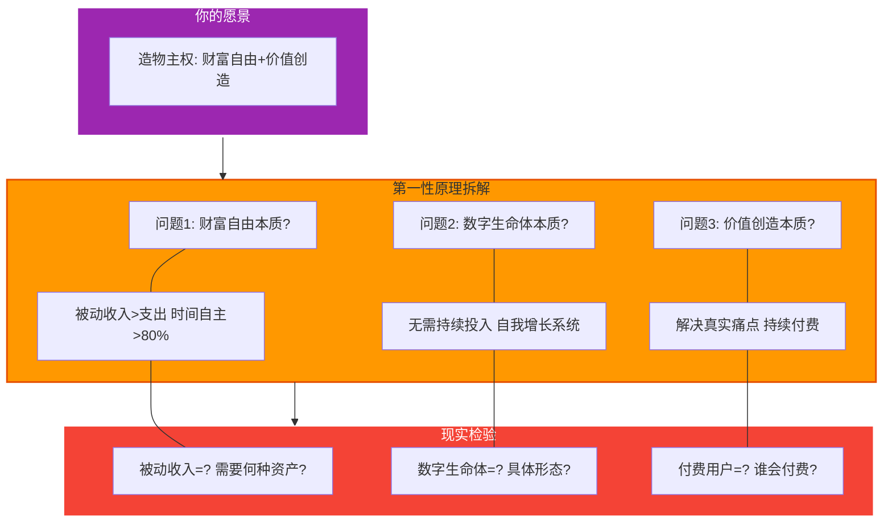

### 1.2 核心假设识别

#### 理论：每个计划都建立在假设之上

在创业和创新领域，**失败的最大原因不是执行力差，而是基于错误的假设**。

大多数人制定计划时会说：
- "我要做一个XX产品，5年内达到XX收入"
- "我相信AI会改变世界，所以我要all in"
- "我跨界学习肯定能产生创新"

但他们很少问：**这些"我相信"背后，有哪些是假设？这些假设是否成立？**

#### 假设识别框架

**第一步：识别隐含假设**

你的计划中包含以下核心假设（很多可能是你没意识到的）：

1. **AI生产力假设**：AI能让我的生产力提升10倍
   - 假设基础：AI工具确实能自动化大部分工作
   - 潜在风险：AI迭代快，学习成本高；AI生成内容质量不可控

2. **跨界创新假设**：跨界融合能产生独特价值
   - 假设基础：组合不同领域的知识能发现新机会
   - 潜在风险：跨界需要深度，浅尝无竞争力；市场可能不认可

3. **被动系统假设**：数字生命体能自我演化
   - 假设基础：一次构建，长期受益
   - 潜在风险：所有系统都需要持续运营和优化

4. **时间分配假设**：70%副业不影响主业
   - 假设基础：我的自控力和精力足够
   - 潜在风险：主业绩效下降，失去稳定收入和心理安全感

5. **时间框架假设**：5年能构建规模化系统
   - 假设基础：其他人做到了，我也可以
   - 潜在风险：低估商业化复杂度和市场不确定性

**第二步：将假设转化为待验证的问题**

对每个假设，我们需要问：
- **如何在最短时间、最小成本下验证这个假设？**
- **如果假设错误，替代方案是什么？**
- **这个假设错误会导致什么后果？**

这就是精益创业（Lean Startup）的核心：**Build-Measure-Learn循环**，先验证假设，再大规模投入。

#### 为什么大多数人失败？

因为他们把**未验证的假设**当作**事实**，然后基于这些"伪事实"制定了庞大的计划，投入大量时间和金钱，最后发现基础假设是错的——这时已经太晚了。

**智者的做法**：
1. 明确列出所有假设
2. 设计最小实验验证每个假设
3. 根据验证结果调整计划
4. 只对已验证的假设加大投入

#### 你的计划中最危险的假设

在你的计划中，**最危险的假设是第4个：70%时间做副业**。

为什么？因为：
- 如果其他假设错了，你可以调整方向
- 但如果这个假设错了（主业绩效下降），你失去的是**稳定收入 + 职业声誉 + 心理安全感**
- 这会形成负向螺旋：副业没成功 → 主业也失败 → 财务压力 → 焦虑 → 执行力下降 → 恶性循环

**建议的验证路径**：
1. 第1年：保持主业80%，副业20%，验证其他假设
2. 只有在副业收入达到主业50%时，才考虑调整时间分配
3. 设置清晰的"回滚机制"：如果3个月内主业绩效下降，立即调整

你的计划基于以下**未经验证的假设**：

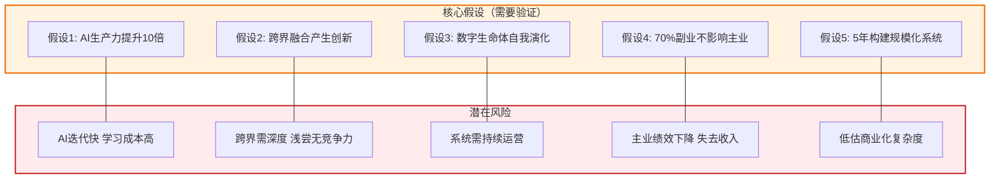

---

## 认知陷阱识别与优化

### 理论基础：为什么聪明人也会做蠢事？

诺贝尔经济学奖得主丹尼尔·卡尼曼在《思考，快与慢》中揭示了一个惊人的事实：

**人类的大脑有两个系统：**
- **系统1（快思考）**：直觉的、情绪化的、自动的
- **系统2（慢思考）**：理性的、逻辑的、需要努力的

大脑的默认模式是**尽量使用系统1**，因为它省力。但在复杂决策（比如创业、投资、职业规划）中，系统1经常犯错，而我们却浑然不觉。

#### 创业者最常见的认知陷阱

在创业和个人发展领域，有四大认知陷阱会毁掉你的计划：

1. **过度乐观偏见（Optimism Bias）**
2. **闪亮物体综合症（Shiny Object Syndrome）**
3. **计划谬误（Planning Fallacy）**
4. **沉没成本谬误（Sunk Cost Fallacy）**

这些陷阱不是"性格缺陷"，而是**人类大脑的设计缺陷**。每个人都会中招，区别在于：**智者知道自己会中招，并提前设计了对策。**

---

### 2.1 你可能陷入的认知偏差

#### 1. 过度乐观偏见

**症状**：
- 高估自己的执行力："我每天肯定能坚持学习2小时！"
- 低估困难和阻力："这个项目3个月肯定能做完！"
- 忽视统计规律："别人失败率90%，但我不一样！"

**在你的计划中的表现**：
- 你计划第1年就要达到$3000 MRR
- 你认为70%时间做副业不会影响主业
- 你相信5年内能构建完整的数字生命体生态

**真相**：
- 根据 Indie Hackers 数据，90%的独立开发者第1年收入 < $1000
- 大多数人在25%副业投入时主业绩效就开始下降
- 平均需要7-10年才能建立成熟的产品生态

**应对策略**：
- **按最坏情况规划**：假设你只有计划中50%的执行力
- **3倍法则**：你认为3个月能完成的，实际需要9个月
- **外部视角**：看统计数据，不要只看成功案例

#### 2. 闪亮物体综合症

**症状**：
- 被新技术持续吸引："哇，新的AI模型出来了，我要学！"
- 项目频繁切换："这个方向不行，换一个！"
- 深度不够："我学了10个技术，但没一个精通"

**在你的计划中的表现**：
- 你计划学习：AI、量子计算、生物科技、区块链、脑科学...
- 你想做：SaaS、课程、咨询、开源、社区...
- 你要跨界：技术×艺术×哲学×商业×...

**真相**：
- 一个人的深度工作时间有限，广度和深度是trade-off
- 市场不为"什么都懂一点"付费，只为"某一点精通"付费
- 专注1个方向5年 > 5年换5个方向

**应对策略**：
- **设定最低验证标准**：每个新方向必须达到X指标才能继续
- **单线程工作**：同一时间只做1个项目
- **季度复盘**：每季度审视是否偏离核心方向

#### 3. 计划谬误

**症状**：
- 认为能快速完成："这个功能1周就能做完！"
- 忽视意外和阻力："应该不会遇到大问题"
- 线性外推："如果1月能赚$500，那么12月就能赚$6000！"

**在你的计划中的表现**：
- Q1就要完成假设验证、构建原型、获得用户
- 你假设每月收入都能增长10%+
- 你认为每个阶段都能顺利过渡

**真相**：
- 90%的任务比预期耗时2-3倍
- 增长曲线是非线性的：3个月零增长 → 突然爆发
- 每个过渡都有"死亡之谷"

**应对策略**：
- **预估×3**：你认为需要1个月，就规划3个月
- **外部参考**：问做过类似事情的人实际花了多久
- **缓冲时间**：每个计划留30%缓冲

#### 4. 沉没成本谬误

**症状**：
- 因为已投入而继续错误："我已经花了3个月，不能放弃！"
- 明知无价值仍坚持："也许再坚持一下就好了"
- 不愿承认错误："放弃就是失败"

**在你的计划中的潜在风险**：
- 当某个方向明显不对时，因为投入了大量时间而不愿转向
- 当主业绩效下降时，因为舍不得副业进展而不调整
- 当市场反馈不好时，因为"相信自己的愿景"而忽视信号

**应对策略**：
- **提前设定退出条件**：如果3个月没有X进展，就止损
- **季度复盘**：每季度问"如果今天重新开始，我还会做这个吗？"
- **敢于止损**：快速失败比缓慢死亡更好

---

### 2.2 《思考，快与慢》的应用

#### 系统1的陷阱

当你看到"5年财富自由"这个愿景时，你的系统1会：

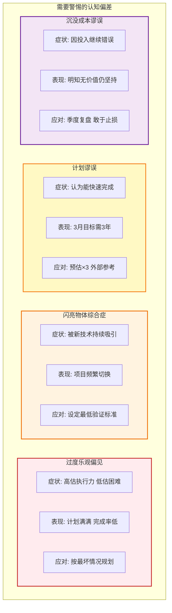

### 2.2 《思考，快与慢》的应用

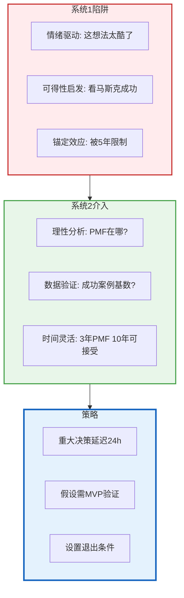

#### 如何激活系统2？

知道陷阱还不够，你需要**设计机制**强制自己使用系统2：

**1. 重大决策延迟24小时**
- 当你兴奋地想开始一个新项目时：等24小时再决定
- 写下为什么想做，24小时后重新评估
- 如果24小时后仍然理性地认为应该做，那就做

**2. 假设需要MVP验证**
- 每个"我相信"都要变成"我验证了"
- 设计最小实验：时间 < 2周，成本 < $100
- 只有验证通过才加大投入

**3. 设置退出条件**
- 在开始前就定义"失败"：什么情况下止损
- 例如："如果3个月没有10个深度用户，就退出"
- 把退出写进日历，到时必须review

**4. 外部问责**
- 找一个"魔鬼代言人"：专门挑战你的假设
- 定期向导师/朋友汇报：他们会问尖锐问题
- 公开承诺：社交压力会增强自律

#### 认知陷阱的自检清单

在做任何重大决策前，问自己：

1. **过度乐观检查**
   - [ ] 我是否查看了统计数据和失败案例？
   - [ ] 我是否按3倍时间预估了工期？
   - [ ] 我是否考虑了最坏情况的应对方案？

2. **闪亮物体检查**
   - [ ] 这是深思熟虑的方向，还是一时冲动？
   - [ ] 我在这个方向上已经投入了多久？
   - [ ] 如果切换方向，之前的投入怎么办？

3. **计划谬误检查**
   - [ ] 我是否询问过做过类似事情的人实际耗时？
   - [ ] 我的计划是否留有30%缓冲时间？
   - [ ] 我是否有应对意外和阻力的预案？

4. **沉没成本检查**
   - [ ] 如果今天重新开始，我还会选择这个方向吗？
   - [ ] 我继续的原因是"已经投入了"还是"确实有价值"？
   - [ ] 我是否设定了清晰的退出条件？

**关键原则：在情绪高涨时做计划，在冷静理性时做决策。**

---

## 核心假设验证框架

### 理论基础：精益创业的核心思想

埃里克·莱斯在《精益创业》中提出了一个颠覆性的观点：

**创业不是执行一个完美的计划，而是通过快速实验不断验证和调整假设。**

传统创业思维：
1. 有一个"伟大的想法"
2. 花6-12个月开发完美的产品
3. 盛大发布
4. 发现没人要... 😢

精益创业思维：
1. 识别核心假设
2. 用2周构建最小可行产品（MVP）
3. 找10个用户测试
4. 根据反馈快速迭代
5. 重复2-4，直到找到Product-Market Fit

**关键区别**：传统创业是"闭门造车然后希望成功"，精益创业是"在真实世界中边学边做"。

#### MVP的本质：学习而非产品

很多人误解MVP：
- ❌ 错误理解："做一个功能不完整的产品"
- ✅ 正确理解："**用最小成本验证最核心假设的实验**"

MVP不是"产品"，而是"实验工具"。它的目标是**学习**，而非完美。

#### 验证金字塔：从假设到规模化的5个层级

大多数创业者的错误是：**跳过验证，直接规模化**。结果是在错误的方向上越走越远。

正确的路径应该是**金字塔式**的：每一层都必须通过验证，才能进入下一层。

---

### 3.1 MVP验证金字塔

#### 金字塔的5个层级

**L1: 假设（Hypothesis）**
- 这是起点：你相信某件事是真的
- 例如："我相信AI能让程序员效率提升10倍"
- 特征：这只是想法，没有任何证据

**L2: 最小验证（Smoke Test）**
- 目标：用最小成本测试假设是否成立
- 例如：改造1个实际工作流程，记录时间节省
- 时间：1-2周
- 成本：< $100（主要是时间成本）
- 质量门：节省 > 50%时间 且 质量不下降

**L3: 扩大验证（Expanded Test）**
- 目标：验证可复用性和持续性
- 例如：改造3-5个流程，持续运行1个月
- 时间：4-8周
- 成本：< $500
- 质量门：总节省 > 20小时/周 且 可持续

**L4: 系统化（Systematization）**
- 目标：构建可复用、可扩展的系统
- 例如：文档化流程，让其他人也能使用
- 时间：2-3个月
- 成本：< $2000
- 质量门：其他人能通过文档复现 且 愿意为此付费

**L5: 商业化（Commercialization）**
- 目标：获得付费用户，验证商业模式
- 例如：5个付费客户 或 10个深度免费用户
- 时间：3-6个月
- 成本：< $5000
- 质量门：MRR > $500 或 10个深度用户NPS > 40

#### 关键原则

1. **严格的质量门**
   - 每层都有明确的"通过标准"
   - 未通过 = 回到L1重新假设
   - 不要自欺欺人："差不多就行"会导致灾难

2. **递进式投入**
   - L1-L2：只投时间，不投钱
   - L3-L4：小额投入，测试方向
   - L5：确认PMF后才大规模投入

3. **快速失败**
   - 在L2失败 = 损失2周时间 ✅
   - 在L5失败 = 损失6个月+$5000 ❌
   - 越早失败，代价越小

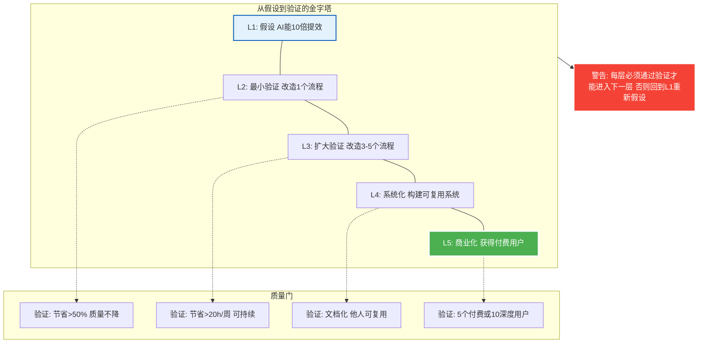

### 3.2 关键假设的验证计划

#### 理论：90天验证法

在创业领域有一个经验法则：**如果90天内看不到任何进展信号，方向可能有问题。**

这不是说90天要成功，而是说90天内应该能看到：
- 用户确实有痛点
- 你的解决方案确实有效
- 有人愿意为此付出（时间/金钱/推荐）

如果90天后这些信号都没有，继续下去是在浪费时间。

#### 如何设计90天验证计划？

**第1个月：最小可行性验证**
- 目标：验证"我能做到"
- 方法：用AI优化自己的工作流程
- 数据：记录时间节省、质量对比
- 判定标准：节省 > 10小时/周

**第2个月：价值验证**
- 目标：验证"别人需要"
- 方法：解决一个真实痛点，做原型
- 数据：找10个用户测试，收集反馈
- 判定标准：5个人明确表示愿意付费

**第3个月：商业化验证**
- 目标：验证"有人愿意付费"
- 方法：设计付费模式，获取首批用户
- 数据：MRR、留存率、NPS
- 判定标准：MRR > $500 且 留存 > 50%

#### 关键决策点：90天后的三个选择

如果通过验证：
- ✅ **ScaleUp**: 投入更多资源，规模化增长
- 具体行动：优化产品，增加营销投入，考虑组建小团队

如果部分通过：
- ⚠️ **Pivot**: 调整方向（换痛点/换方案/换用户群）
- 具体行动：深度复盘，找出根本问题，快速调整

如果完全失败：
- ❌ **Stop**: 止损，尝试新方向
- 具体行动：认真复盘学到的经验，换一个假设重新开始

**注意**：90天验证可以重复，但**最多重复3次**。如果3次90天（共9个月）仍无进展，说明要么方向有重大问题，要么你不适合这个方向。这时需要更根本的反思。

#### 你的具体验证计划

基于你的"造物主权"愿景，这里是定制化的90天验证计划：

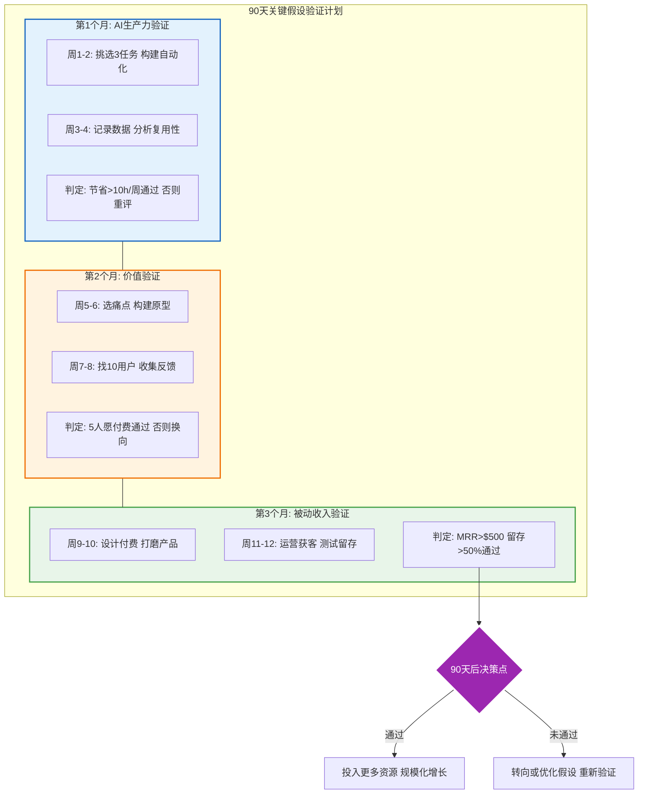

---

## 系统化实施路径

### 理论基础：《原子习惯》的智慧

詹姆斯·克利尔在《原子习惯》中揭示了一个关键洞察：

**你想要达成的目标不是问题，问题是你想要什么样的系统。**

大多数人失败不是因为目标不够宏大，而是因为：
1. **只设目标，不建系统**："我要5年内财富自由"→ 然后呢？每天做什么？
2. **依赖意志力**："我要每天努力工作12小时"→ 坚持3天就崩溃
3. **忽视身份认同**："我想成功"但心里认为"我不是那种人"

#### 目标 vs 系统

**目标导向**：
- 我要在5年内达到年收入$100万
- 问题：达成后怎么办？目标消失，动力也消失
- 结果：溜溜球效应（达成→松懈→失败→再努力→达成→松懈...）

**系统导向**：
- 我要建立一个能持续创造价值的系统
- 好处：系统永远在运行，复利持续积累
- 结果：指数级增长

**关键区别**：
- 目标是**终点思维**："到那里我就成功了"
- 系统是**过程思维**："只要系统在运行，结果自然会来"

#### 原子习惯的核心原理

**1. 身份认同层（Who you are）**
- 不是"我想成为X"，而是"我是X"
- 例如：不是"我想成为程序员"，而是"我是持续创造价值的人"
- 每个小行动都在为新身份投票

**2. 系统层（What you do）**
- 不依赖动力，而是依赖系统
- 例如：每日学习系统、每周创造系统、每月复盘系统
- 系统让行为自动化，不需要意志力

**3. 微习惯层（How you do it）**
- 从超小的习惯开始："每天阅读2页"比"每天读1小时"更可持续
- 习惯堆栈：在现有习惯后添加新习惯
- 环境设计：让好习惯容易，坏习惯困难

#### 为什么这对你很重要？

你的愿景很宏大，但如果没有系统，它只是空想。你需要：

1. **从"造物主权"的身份认同出发**
   - 我是持续创造价值的人（不是想成为）
   - 我是善用AI的人（不是想学AI）
   - 我是敢于实验的人（不是害怕失败）

2. **建立3个核心系统**
   - 学习系统：如何持续吸收新知识？
   - 创造系统：如何持续产出价值？
   - 复盘系统：如何持续优化？

3. **设计微小但可持续的习惯**
   - 不是"每天学习5小时"（会崩溃）
   - 而是"每天早上6:30读20分钟AI论文"（可持续5年）

---

### 4.1 《原子习惯》的应用：从宏大愿景到微小习惯

#### 三层架构：身份→系统→习惯

大多数人失败是因为他们直接跳到习惯层：
- "我要每天工作12小时" → 3天后崩溃

正确的做法是自上而下设计：

**第1层：身份认同（谁）**
- 我是持续创造价值的人
- 我是善用AI提升效率的人
- 我是敢于快速实验和失败的人

**第2层：系统设计（什么）**
- 每日学习系统：如何持续学习AI和跨界知识？
- 每周创造系统：如何持续构建原型和实验？
- 每月复盘系统：如何持续分析数据和调整策略？

**第3层：微习惯（如何）**
- 每天6:30，阅读AI论文20分钟
- 每天20:00，构建原型1小时
- 每周日下午，复盘数据2小时
- 每月最后一天，深度复盘4小时

**关键原则**：
- 身份驱动行为："我是X"比"我想成为X"强100倍
- 系统产生结果：不要追求目标，要建立系统
- 习惯需要小：小到不可能失败

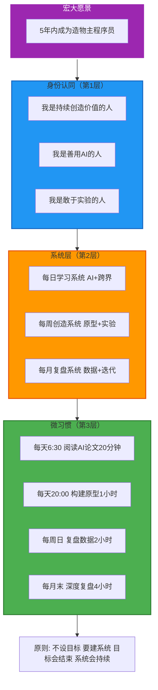

### 4.2 习惯堆栈设计

#### 理论：习惯堆栈的威力

习惯堆栈（Habit Stacking）是《原子习惯》中最实用的技巧之一：

**公式**：在[现有习惯]之后，我会[新习惯]

为什么有效？
- 现有习惯已经形成神经回路，不需要意志力
- 新习惯"搭便车"，降低启动阻力
- 形成流程链，一个习惯触发下一个

#### 设计原则

**1. 按时间顺序串联**
- 早晨堆栈：醒来→喝水→冥想→阅读→规划→工作
- 晚间堆栈：晚饭→散步→创造→记录→反思→规划

**2. 降低摩擦**
- 每个习惯都触发下一个，无需新的决策
- 例如："喝水后我就冥想"（水杯旁边放冥想垫）

**3. 时间现实主义**
- 不要堆太多：早晨堆栈总时长 < 3小时
- 留缓冲：不是每个早晨都完美

**4. 环境设计**
- 前一晚准备好：书放在咖啡机旁，运动服放在床边
- 移除诱惑：手机放在另一个房间

#### 你的具体堆栈

**早晨堆栈（6:00-9:00）**
- 6:00 起床 → 立即喝500ml水（水杯在床头）
- 喝水后 → 冥想10分钟（冥想垫就在水杯旁）
- 冥想后 → 阅读AI论文20分钟（Kindle在冥想垫旁）
- 阅读后 → 记录跨界灵感5分钟（笔记本在Kindle旁）
- 记录后 → 查看今日三件事（Notion模板）
- 查看后 → 深度工作2小时（专注模式）

**晚间堆栈（19:00-22:00）**
- 19:00 晚饭后 → 散步20分钟（运动鞋在门口）
- 散步后 → 构建原型1小时（工作空间已准备好）
- 原型后 → 记录今日数据10分钟（数据表格模板）
- 记录后 → 写反思日记10分钟（Day One app）
- 日记后 → 规划明日三件事5分钟（Notion）

**周末专注时段**
- 周六上午：深度创造4小时（早晨堆栈后直接进入）
- 周六下午：网络扩展2小时（创造结束后立即）
- 周日下午：每周复盘2小时（固定时间15:00-17:00）

```mermaid
graph TB
    subgraph Morning["早晨堆栈（6:00-9:00）"]
        direction LR
        M1[6:00起床 喝500ml水]
        M2[喝水后 冥想10分钟]
        M3[冥想后 阅读AI论文20分钟]
        M4[阅读后 记录跨界灵感]
        M5[记录后 查看今日三件事]
        M6[查看后 深度工作2小时]

        M1 --- M2 --- M3 --- M4 --- M5 --- M6
    end

    subgraph Evening["晚间堆栈（19:00-22:00）"]
        direction LR
        E1[19:00晚饭后 散步20分钟]
        E2[散步后 构建原型1小时]
        E3[原型后 记录今日数据]
        E4[记录后 写反思日记]
        E5[日记后 规划明日]

        E1 --- E2 --- E3 --- E4 --- E5
    end

    subgraph Weekend["周末专注时段"]
        direction LR
        W1[周六上午 深度创造4h]
        W2[周六下午 网络扩展2h]
        W3[周日下午 每周复盘2h]

        W1 --- W2 --- W3
    end

    Key[关键: 每个习惯触发下一个 降低启动阻力]

    Morning --> Key
    Evening --> Key
    Weekend --> Key

    style Morning fill:#fff3e0,stroke:#ef6c00,stroke-width:2px
    style Evening fill:#e3f2fd,stroke:#1565c0,stroke-width:2px
    style Weekend fill:#e8f5e9,stroke:#43a047,stroke-width:2px
```

### 4.3 时间分配的现实方案

#### 理论：渐进式过渡 vs 激进式跳跃

你的原计划是"主业30% + 副业70%"，这是**高风险的激进式跳跃**。

心理学和创业研究都表明：
- **激进式跳跃**：成功率 < 10%，因为风险太大，一旦失败全盘皆输
- **渐进式过渡**：成功率 > 60%，因为保持安全网，可以多次尝试

#### 《原则》的启示：极度求真

Ray Dalio在《原则》中强调：**极度求真**，即使真相让你不舒服。

**不舒服的真相**：
1. 70%时间做副业，主业绩效必然下降
2. 主业绩效下降 → 收入风险 + 职业声誉损失
3. 副业未成功 + 主业已失败 = 灾难
4. 心理压力会形成恶性循环

**真实的数据**（来自Indie Hackers调查）：
- 80%的副业项目在第1年收入 < 主业的10%
- 只有20%的人能在2年内达到主业收入的50%
- 全职创业后，60%的人在1年内收入 < 之前主业的30%

**结论**：在副业收入稳定达到主业50%之前，降低主业投入是**极度危险的**。

#### 渐进式过渡的5年路径

这个路径基于现实数据和风险管理：

**第1年：验证期（主业80% + 副业20%）**
- 目标：验证核心假设
- 时间分配：主业每周32小时，副业每周8小时
- 安全网：主业绩效保持Top 30%，保持稳定收入
- 判定标准：副业 MRR > $3000 或 明确的增长趋势

**第2年：增长期（主业70% + 副业30%）**
- 前提：副业MRR已达到主业月薪的50%
- 目标：规模化验证成功的方向
- 时间分配：主业每周28小时，副业每周12小时
- 判定标准：副业 MRR > $20000 且 稳定增长3个月

**第3年：过渡期（主业50% + 副业50%）**
- 前提：副业MRR已达到主业月薪的100%
- 目标：建立完整的被动收入系统
- 时间分配：主业每周20小时，副业每周20小时
- 判定标准：被动收入 > 生活支出

**第4年：决策期（主业30% + 副业70%）**
- 前提：被动收入持续 > 支出6个月以上
- 目标：为全职创业做准备
- 时间分配：主业每周12小时（顾问/兼职），副业每周28小时

**第5年：自由期（主业0% + 创业100%）**
- 前提：被动收入 > 支出×1.5 且 现金储备 > 12个月支出
- 目标：全职创业或财务自由后的自主选择

#### 安全网设计

无论哪个阶段，都要保持这些安全网：

1. **应急基金**：始终保持6-12个月生活费的现金储备
2. **主业绩效红线**：如果主业绩效跌出Top 50%，立即调整
3. **副业指标红线**：如果副业3个月无增长，重新评估
4. **每季度评估点**：每3个月评估一次，可以加速或延迟过渡

你的计划中"**主业30% + 副业70%**"是**高风险的**。基于《原则》，我们需要**极度求真**：

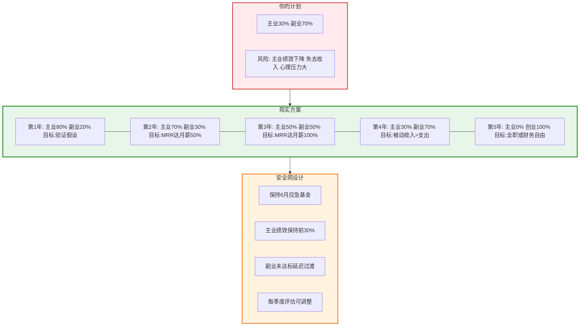

---

## 风险对冲与反脆弱设计

### 理论基础：《反脆弱》与《原则》的智慧

#### 反脆弱（Antifragile）的核心思想

纳西姆·塔勒布在《反脆弱》中提出了一个革命性的概念：

**世界上有三类事物：**
1. **脆弱（Fragile）**：遇到波动就崩溃（例如：玻璃杯）
2. **强韧（Robust）**：能抵抗波动但不变化（例如：钢板）
3. **反脆弱（Antifragile）**：从波动中获益，越挫越强（例如：肌肉、免疫系统）

**在创业和财富创造中的应用**：

**脆弱的策略**：
- 把所有资源押注在一个方向
- "All in"一个想法
- 没有备选方案
- 结果：一旦失败，全盘皆输

**反脆弱的策略**：
- 杠铃策略：90%安全 + 10%高风险
- 多个小赌注，快速验证
- 保留选择权，保持灵活性
- 结果：小的失败让你更强，大的成功改变命运

#### Ray Dalio的风险管理原则

《原则》中，Ray Dalio 分享了桥水基金的核心原则：

**1. 极度求真（Radical Truth）**
- 承认自己不知道
- 不自欺欺人
- 寻找不同意见
- 面对现实，而非期望

**2. 痛苦 + 反思 = 进步**
- 失败不是终点，是学习机会
- 每次失败后48小时内深度复盘
- 找出根本原因，更新原则

**3. 从更高层次俯视问题**
- 不陷入细节
- 看到系统和模式
- 用第三方视角看自己

**4. 可信度加权决策**
- 不是所有意见都平等
- 听取成功者的建议
- 找到导师和反向导师

#### 如何将这些原则应用到你的计划？

1. **极度求真：承认不确定性**
   - 你的每个假设都可能是错的
   - 市场可能不需要你的产品
   - AI趋势可能改变

2. **杠铃策略：分散风险**
   - 不是all in副业，而是保持主业安全网
   - 不是只做一个产品，而是组合投资
   - 高风险只投时间，不投金钱

3. **反脆弱设计：从失败中获益**
   - 快速失败，快速学习
   - 每次失败都升级你的系统
   - 保持选择权，随时调整

---

### 5.1 《原则》中的风险管理

#### Ray Dalio的4大风险原则

**原则1：极度求真 - 承认不知道**

大多数创业者失败是因为**自欺欺人**：
- "我相信这个产品会成功"（但没验证）
- "市场肯定需要这个"（但没问过用户）
- "AI肯定会改变一切"（但不知道怎么改变）

**应用到你的计划**：
- 每个"我相信"都要问："我有什么证据？"
- 每个假设都要设计验证实验
- 主动寻找反对意见："为什么这个可能失败？"

**原则2：痛苦 + 反思 = 进步**

失败不可避免，关键是如何应对：

**错误的应对**：
- 否认："这不是我的错"
- 逃避："我不想谈这个"
- 重复："下次一定行"

**正确的应对**：
- 48小时内深度复盘
- 找出根本原因（5 Whys法）
- 更新决策原则
- 分享学到的教训

**原则3：从更高层次俯视 - 系统思维**

不要陷入细节，要看到整体：

**低层次视角**：
- "这个功能还没做好"
- "今天又没完成任务"
- "这个月收入没增长"

**高层次视角**：
- "我的整体方向对吗？"
- "我的系统在正常运行吗？"
- "我在朝财务自由前进吗？"

**方法**：
- 每周：战术层面（做了什么）
- 每月：战略层面（方向对吗）
- 每季度：系统层面（系统健康吗）

**原则4：可信度加权决策 - 听成功者的话**

不是所有建议都有价值：

**低可信度建议**（忽略）：
- 从未创业的人说"创业很简单"
- 从未用AI的人说"AI没用"
- 从未财务自由的人给财富建议

**高可信度建议**（认真听）：
- 成功独立开发者的实战经验
- 在你的细分领域成功的人
- 数据和案例支持的建议

**行动**：
- 找到3-5个导师（已经做成了你想做的事）
- 每月至少交流一次
- 按他们的建议调整方案

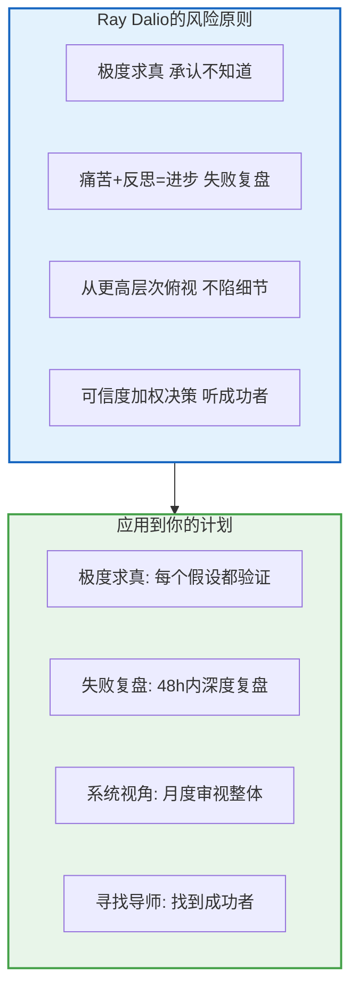

### 5.2 反脆弱的项目组合

#### 理论：杠铃策略（Barbell Strategy）

塔勒布在《反脆弱》中提出了**杠铃策略**：

**传统的"平衡"策略（错误）**：
- 把所有资源平均分配到中等风险项目
- 结果：既没有安全网，也没有改变命运的机会
- 例如：50%主业 + 50%副业 → 两头都做不好

**杠铃策略（正确）**：
- 90%极度安全 + 10%极度冒险
- 安全部分保护你不会被摧毁
- 冒险部分给你改变命运的机会
- 结果：最小的下行风险 + 无限的上行潜力

#### 应用到你的财富创造

**传统错误做法**：
- 辞职创业，all in一个想法
- 或：什么都不敢做，只拿工资

**杠铃策略做法**：

**90%安全资产**（保护下行）：
- 主业保持优秀绩效（60%）
- 应急基金6-12个月（15%）
- 稳健投资（指数基金）（15%）

**10%风险资产**（追求上行）：
- 高风险创业实验（5%）
- 前沿技术学习（3%）
- 跨界创新尝试（2%）

**关键原则**：
1. 安全资产永远不动摇：不能因为副业而损害主业
2. 风险资产可以全损：只投入能承受100%损失的资源
3. 风险资产只投时间，不投大钱：直到验证成功

#### 具体项目分配

基于你的情况，这是推荐的项目组合：

**安全层 60%**（这些不能失败）：
- 主业保持Top 30%：时间投入保证质量
- 稳定咨询/兼职：基于现有技能，低风险收入
- 指数基金定投：每月固定金额，长期复利

**中风险层 30%**（可以失败，但要快速验证）：
- AI工具开发：有明确痛点的SaaS产品
- 技术课程/内容：基于你已验证的能力
- 开源项目商业化：社区驱动的变现

**高风险层 10%**（可能失败，但一旦成功改变命运）：
- 颠覆性实验：完全创新的想法
- 跨界融合创新：组合不同领域的新方向
- 前沿技术押注：量子、AGI等

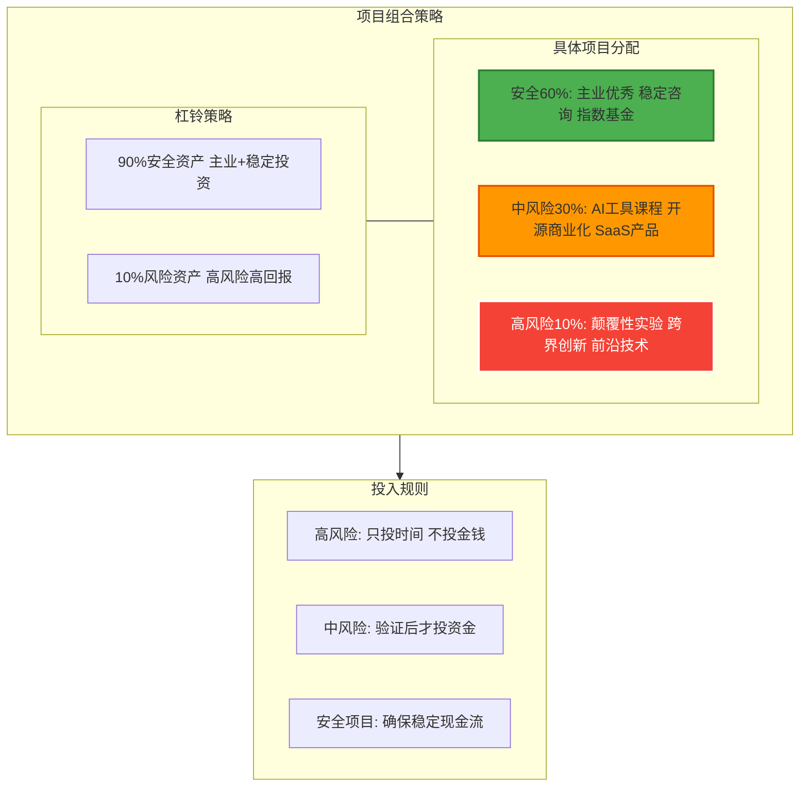

### 5.3 退出条件设计

#### 理论：避免沉没成本谬误的最佳方法

在创业领域，有一个残酷的统计：**90%的失败是因为坚持了太久**。

为什么聪明人会犯这个错误？**沉没成本谬误**：
- "我已经投入了6个月，不能放弃"
- "也许再坚持一下就好了"
- "放弃就意味着失败"

**真相**：
- 过去的投入已经沉没，继续错误只会增加损失
- 机会成本：浪费在错误方向的时间，本可以用在正确方向
- 止损是勇气，不是失败

#### 如何设计退出条件？

**在项目开始前就定义"失败"**：

这听起来很反直觉，但这是最重要的：
- 不是项目进行中才想"要不要退出"
- 而是在开始前就写下："什么情况下我会退出"

**退出条件设计原则**：

1. **基于客观指标，不是主观感觉**
   - ❌ "感觉不太行"
   - ✅ "3个月用户增长 < 10%"

2. **设定时间节点**
   - ❌ "一直做到成功"
   - ✅ "6个月后评估，12个月是最后期限"

3. **写下来并公开**
   - 写进日历
   - 告诉朋友/导师
   - 社交压力确保你遵守

**退出 ≠ 失败**：
- 退出是数据驱动的理性决策
- 快速退出 = 快速学习 = 下一次成功的基础
- 硅谷最欣赏的品质：快速实验，快速失败，快速学习

#### 你的项目退出条件

对于每个你启动的项目，在开始前就设定：

**3个月检查点**：
- 指标：是否有10个深度用户？
- 标准：至少5个人表示强烈需求
- 未通过 → 退出或重大调整

**6个月检查点**：
- 指标：MRR > $500？
- 标准：用户留存 > 50%
- 未通过 → 退出，总结经验

**12个月检查点**：
- 指标：MRR > $2000 且 稳定增长？
- 标准：月增长率 > 5%，连续3个月
- 未通过 → 这是最后的退出点
- 通过 → 继续投入，规模化

**关键规则**：
- 最多给一个方向12个月
- 如果12个月无法达到$2000 MRR，说明PMF有问题
- 总结教训，换方向

**如何处理"差一点就成功"**：
- 如果所有指标都接近（比如MRR $1800）→ 可以延长3个月
- 但只能延长1次
- 如果延长后仍未达标 → 必须退出

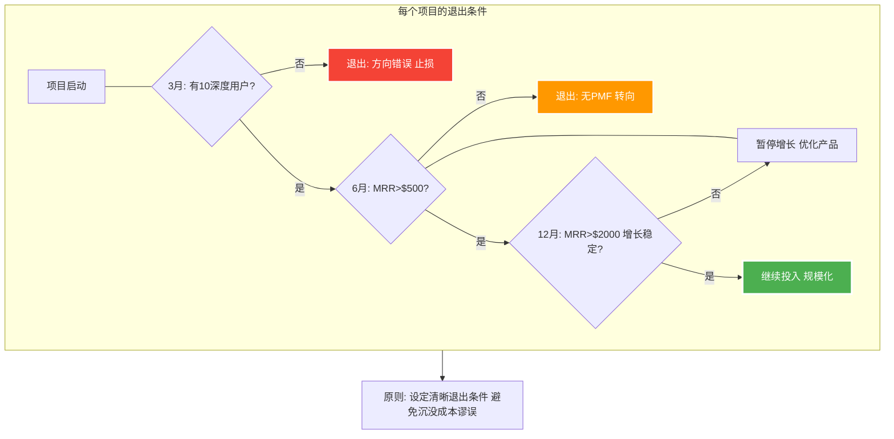

---

## 可追踪的里程碑

### 理论基础：OKR与数据驱动决策

#### 为什么需要里程碑？

彼得·德鲁克说：**"如果你无法衡量它，就无法改进它。"**

大多数人的愿景失败是因为：
1. **目标太模糊**："我要财富自由"→ 什么叫财富自由？
2. **没有中间检查点**：5年太长，中途迷失方向
3. **不追踪数据**：不知道自己是在进步还是退步

#### OKR框架（Objectives and Key Results）

硅谷公司用的目标设定法：

**Objective（目标）**：你想达成什么？
- 要鼓舞人心、有挑战性
- 定性的，描述方向

**Key Results（关键结果）**：如何知道你达成了？
- 要可衡量、有时限
- 定量的，3-5个指标

**例子**：
- ❌ 差的OKR："成为成功的创业者"
- ✅ 好的OKR：
  - O: 验证AI效率工具的产品市场匹配
  - KR1: 获得10个每周使用>3次的深度用户
  - KR2: NPS分数 > 40
  - KR3: MRR达到$500
  - 时限: Q2结束前

#### 数据驱动 vs 直觉驱动

**直觉驱动**（危险）：
- "感觉用户喜欢这个功能"
- "我相信这个方向是对的"
- "应该快成功了吧"

**数据驱动**（正确）：
- "80%的用户每周使用这个功能"
- "MRR过去3个月月增长15%"
- "留存率从30%提升到55%"

**关键**：定期（每周/每月）查看数据，根据数据调整策略。

---

### 6.1 五年路线图（修正版）

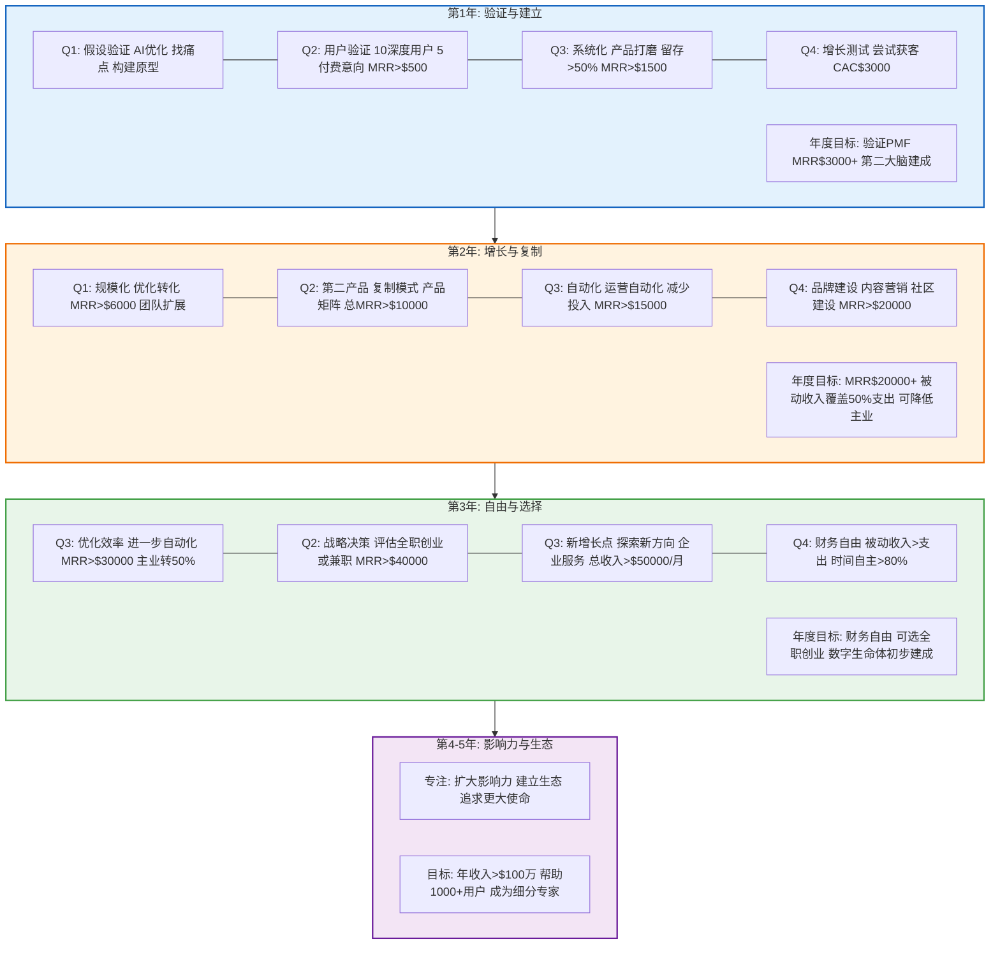

### 6.2 关键指标仪表板

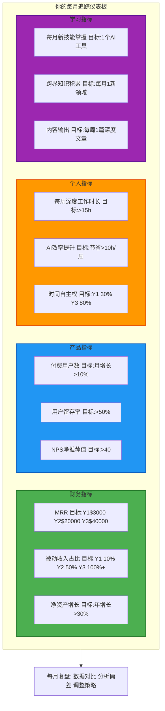

---

## 第一步行动计划

### 理论基础：立即行动的重要性

#### 为什么"现在就开始"这么重要？

拿破仑·希尔说：**"不要等到条件完美，完美的条件永远不会到来。"**

大多数人失败的原因不是计划不好，而是**永远在计划，从不开始**：
- "等我学会了XX再开始"
- "等我有了XX资源再开始"
- "等时机成熟了再开始"

**真相**：
- 你永远不会"准备好"
- 最好的学习方式是边做边学
- 行动产生反馈，反馈带来学习

#### 2分钟法则

《原子习惯》中的关键法则：

**任何习惯都可以分解成一个2分钟的启动版本。**

- 不是"每天阅读30分钟"，而是"每天打开书"
- 不是"构建完整产品"，而是"写下第一行代码"
- 不是"找到完美想法"，而是"列出3个痛点"

**原理**：
- 启动是最难的部分
- 一旦启动，惯性会推动你继续
- 小的开始降低心理阻力

#### 7天冲刺 vs 完美主义

**完美主义者**（失败模式）：
- 花3个月研究最佳方案
- 追求完美的设计和代码
- 产品还没做出来就放弃了

**行动者**（成功模式）：
- 花7天做出能用的原型
- 快速获得真实用户反馈
- 根据反馈快速迭代

**关键差异**：
- 完美主义者在想象中工作
- 行动者在现实中学习

Reid Hoffman说：**"如果你的第一版产品不让你感到尴尬，那说明你发布得太晚了。"**

---

### 7.1 未来7天的具体行动

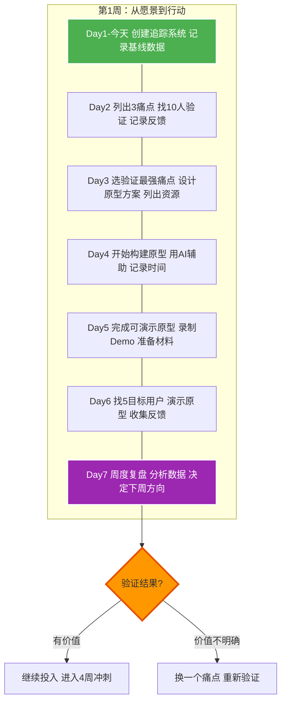

### 7.2 第一个月冲刺

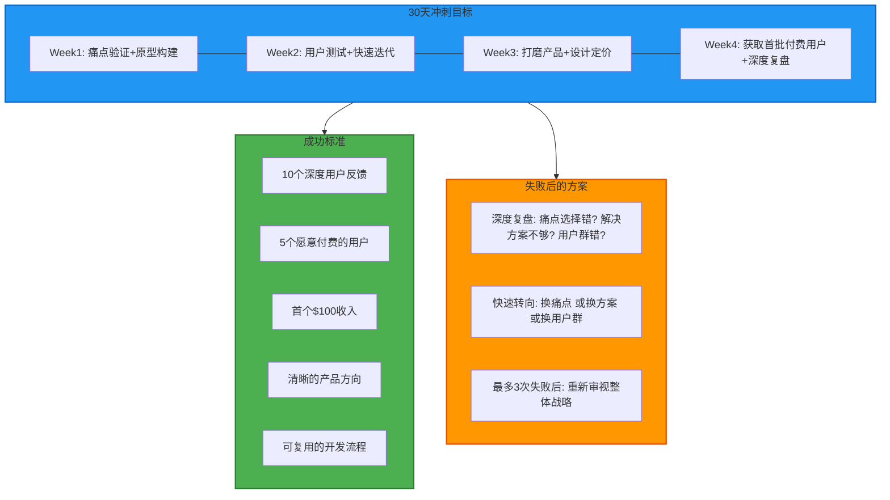

---

## 关键建议与警告

### 理论基础：成功者的共同模式

在研究了数百个成功和失败的创业案例后，有几个模式非常清晰：

#### 成功者的5个共同特征

1. **耐心与长期主义**
   - 杰夫·贝索斯：亚马逊亏损了7年才盈利
   - 巴菲特：99%的财富在50岁后获得
   - 关键：复利需要时间

2. **深度专注**
   - Steve Jobs：说"不"比说"是"更重要
   - Naval Ravikant："专注=力量÷注意力分散"
   - 关键：深度 > 广度

3. **用户第一**
   - Airbnb创始人：亲自去住用户家，拍照片
   - Paul Graham：做不规模化的事情
   - 关键：解决真问题 > 炫技

4. **现金流意识**
   - 每个成功的独立开发者都强调：先有收入，再扩规模
   - Pieter Levels：12个项目才找到PMF
   - 关键：$100收入 > $100万计划

5. **系统思维**
   - 不依赖意志力，建立系统
   - 不追求完美，持续迭代
   - 关键：每天1小时×5年 > 每周70小时×3个月

#### 失败者的5个共同陷阱

1. **过早辞职** → 失去安全网 → 压力 → 失败
2. **为未验证的想法负债** → 财务压力 → 绝望决策
3. **孤军奋战** → 没有反馈 → 陷入误区
4. **忽视健康** → 身体垮掉 → 一切归零
5. **追求完美** → 永远不发布 → 没有反馈 → 失败

---

### 8.1 来自第一性原理的建议

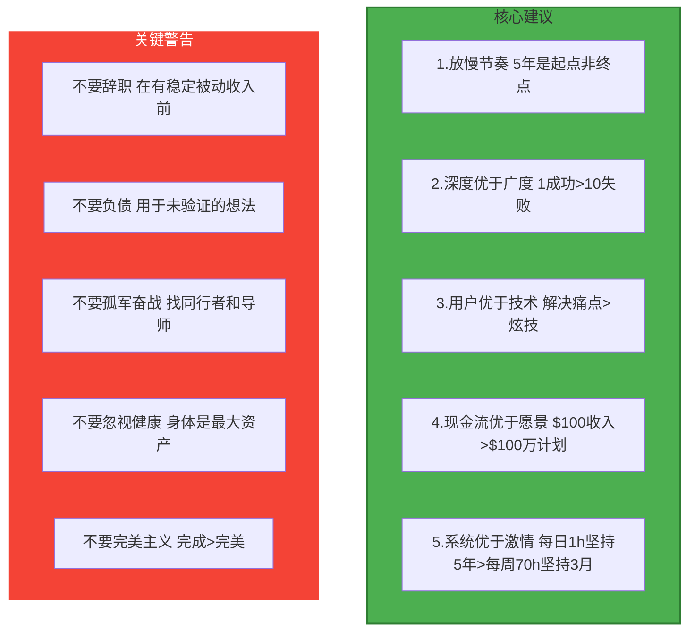

### 8.2 终极问题

在你开始执行前，用第一性原理问自己：

---

## 总结：从"造物主权"到"复利人生"

你的愿景是宏大的、激动人心的。但基于第一性原理，我给你的建议是：

### 核心原则

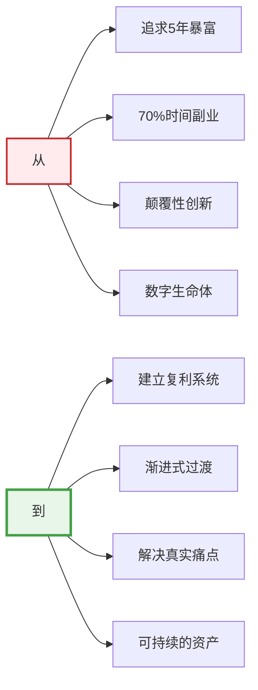

### 最重要的话

**不要追求在5年内完成所有目标。**

**要在5年内建立一个能让你在未来50年持续创造价值的系统。**

这个系统的核心是：
1. **健康的身体**（无健康则无未来）
2. **持续学习的能力**（适应变化）
3. **创造价值的系统**（解决痛点）
4. **稳定的现金流**（财务安全）
5. **可信赖的网络**（人脉资源）

记住巴菲特的话：
> "在正确的道路上慢慢走，也比在错误的道路上快速奔跑要好。"

**立即行动，但要有耐心。**

祝你成功！🚀
