# AI时代创世程序员：终极财富自由蓝图

> 整合《快车道》《纳瓦尔宝典》《芒格之道》《原则》《原子习惯》《思考快与慢》的智慧，构建可执行的财富创造系统

## 目录

1. [慢车道vs快车道：财富思维的革命](#慢车道vs快车道财富思维的革命)
2. [纳瓦尔的4种杠杆：指数级财富创造](#纳瓦尔的4种杠杆指数级财富创造)
3. [芒格的多元思维模型工具箱](#芒格的多元思维模型工具箱)
4. [专长知识堆栈：你的不可复制优势](#专长知识堆栈你的不可复制优势)
5. [快车道5大戒律验证](#快车道5大戒律验证)
6. [从打工者到创造者的路径](#从打工者到创造者的路径)
7. [逆向思维：避免失败的检查清单](#逆向思维避免失败的检查清单)
8. [可执行的90天行动计划](#可执行的90天行动计划)

---

## 慢车道vs快车道：财富思维的革命

### 核心理论：MJ DeMarco的财富路径革命

**为什么大多数程序员走在错误的财富道路上？**

MJ DeMarco在《百万富翁快车道》中揭示了一个残酷的真相：社会给我们灌输的财富观念——"努力工作、存钱、投资、等待40年退休"——是一个巨大的谎言。这条路被称为"慢车道"，它让你用最宝贵的青春年华，换取年老时的自由。

作为程序员，我们特别容易陷入慢车道陷阱：
- **高薪诱惑**：大厂高薪让我们觉得"我已经很成功了"
- **技术信仰**：相信"技术够好就能成功"，忽略商业本质
- **线性思维**：认为"不断学习→升职加薪"是唯一道路
- **安全感幻觉**：稳定的工作让我们不敢冒险

但现实是：
- 35岁以后的职业危机
- 收入增长的天花板
- 技术更新带来的焦虑
- 被动的职业选择

**三条财富之路的本质区别**

**人行道（The Sidewalk）** - 月光族的陷阱
- 公式：财富 = 收入 - 支出 = 0
- 特征：活在当下，及时行乐，存款为零
- 结果：一旦失业或生病，立即陷入危机
- 适用：❌ 不适用于任何阶段

**慢车道（The Slowlane）** - 40年的交易
- 公式：财富 = 工作 + 储蓄 + 投资复利
- 特征：节俭、存钱、买指数基金、等待退休
- 假设：年薪10万，存20%，年化10%，40年后约973万
- 问题：
  - ✗ 牺牲了40年最宝贵的青春
  - ✗ 65岁时，健康可能已无法享受财富
  - ✗ 通货膨胀侵蚀购买力
  - ✗ 收入增长线性，受时间限制
  - ✗ 依赖公司和市场，无法掌控

**快车道（The Fastlane）** - 5-10年的跃迁
- 公式：财富 = 净利润 + 资产价值
- 特征：建立系统，创造资产，规模化价值
- 实例：
  - 年1：开发SaaS，MRR $0→$3K
  - 年2：优化增长，MRR $3K→$20K
  - 年3：规模化，MRR $20K→$50K
  - 年5：MRR $100K，年收入$120万
  - 资产价值：$600万-$1200万（5-10倍年收入）
- 关键：30岁就拥有时间、健康、财富

**为什么快车道是程序员的最佳选择？**

1. **代码是天然的快车道工具**
   - 写一次，复制无限次（零边际成本）
   - 24/7自动运行（时间解耦）
   - 全球分发（无地域限制）
   - 无需许可（随时开始）

2. **AI时代的巨大机会**
   - 技术门槛大幅降低
   - 一个人就能开发复杂产品
   - 市场需求爆发式增长
   - 先发优势明显

3. **程序员的独特优势**
   - 理解技术趋势
   - 快速学习能力
   - 系统化思维
   - 自动化思维

#### 案例分析

**案例1：慢车道的代价 - 小张的故事**

小张，30岁，大厂资深工程师，年薪50万：
- 每年存10万，投资年化10%
- 按计划，55岁时能积累约350万
- 但是：
  - 35岁后收入增长停滞
  - 40岁被裁员，降薪50%
  - 55岁实际只积累了200万
  - 此时健康状况不佳，无法享受

**教训**：慢车道把命运交给了公司和市场，你无法掌控。

**案例2：快车道的胜利 - 小李的转型**

小李，同样30岁，选择了快车道：
- 保持主业30%精力（稳定收入）
- 70%精力开发AI工具
- 年1：业余时间开发MVP，获得100个用户
- 年2：MRR达到$10K，辞职全职
- 年3：MRR达到$50K，月收入超过之前年薪
- 年5：35岁实现财富自由，资产超过500万
- 关键：35岁就拥有时间、健康、财富

**启示**：快车道让你在最好的年纪拥有财富和自由。

#### 反思练习：你在哪条路上？

**练习1：诚实回答以下问题**

请在适用的选项前打✓：

1. **你的主要收入来源是什么？**
   - [ ] 工资/时薪（慢车道）
   - [ ] 自由职业/咨询（慢车道+）
   - [ ] 产品/服务的被动收入（快车道）
   - [ ] 资产增值（快车道）

2. **如果停止工作3个月，会发生什么？**
   - [ ] 立即陷入财务危机（人行道）
   - [ ] 可以支撑，但会焦虑（慢车道）
   - [ ] 收入几乎不受影响（快车道）

3. **你的收入增长模式是？**
   - [ ] 线性增长（每年涨薪5-10%）（慢车道）
   - [ ] 指数增长（系统规模化）（快车道）

4. **你的时间价值是？**
   - [ ] 固定时薪/日薪（慢车道）
   - [ ] 可以无限复制（快车道）

5. **你最近一年做的最大投资是？**
   - [ ] 学习新技术栈（可能是慢车道）
   - [ ] 开发自己的产品（快车道）
   - [ ] 建立个人品牌（快车道）

**诊断结果**：
- 4-5个慢车道标记：你正在用40年青春换退休
- 3个慢车道标记：处于转型期，需要明确方向
- 1-2个慢车道标记：你在正确的道路上
- 0个慢车道标记：恭喜，你是快车道创业者

**练习2：快车道潜力评估**

评估你的快车道潜力（每项1-10分）：

| 维度 | 评分 | 说明 |
|------|------|------|
| **技术能力** | ___ / 10 | 能否独立开发产品？ |
| **专长知识** | ___ / 10 | 有独特的技能组合吗？ |
| **市场敏感度** | ___ / 10 | 能发现用户痛点吗？ |
| **风险承受力** | ___ / 10 | 能接受短期收入下降吗？ |
| **执行力** | ___ / 10 | 能坚持做完一件事吗？ |
| **学习能力** | ___ / 10 | 能快速学习新领域吗？ |
| **时间资源** | ___ / 10 | 有副业时间吗？ |
| **财务储备** | ___ / 10 | 有6个月生活费吗？ |

**总分评估**：
- 60-80分：快车道潜力优秀，立即开始
- 40-60分：有潜力，需要先补短板
- <40分：先积累资源和能力

#### 实践指南：从慢车道转向快车道

**第1步：认知转变（第1-2周）**

- [ ] 阅读《百万富翁快车道》
- [ ] 完成上述反思练习
- [ ] 列出你当前走慢车道的3个表现
- [ ] 写下你的快车道愿景：5年后你想成为什么样的人？

**第2步：资源盘点（第3-4周）**

- [ ] 计算你的净资产和每月开支
- [ ] 评估你可投入副业的时间（每周几小时？）
- [ ] 列出你的技能清单和专长知识
- [ ] 找到3个你可以解决的用户痛点

**第3步：制定转型计划（第5-6周）**

- [ ] 选择一个快车道方向（SaaS/工具/内容/咨询）
- [ ] 设定3个月的小目标（如：获得10个用户）
- [ ] 制定每周行动计划
- [ ] 设置退出条件（什么情况下止损？）

**第4步：开始行动（第7-12周）**

- [ ] 减少主业投入到30%（只做核心工作）
- [ ] 将70%时间投入快车道项目
- [ ] 每周至少与5个目标用户交流
- [ ] 每周复盘进度和调整策略

**第5步：验证与优化（3-6个月）**

- [ ] 是否获得了首个付费用户？
- [ ] MRR是否达到$1K-3K？
- [ ] 用户留存率是否>60%？
- [ ] 是否找到了可复制的增长渠道？

#### 行动清单：立即开始

**今天就做**（30分钟）：
- [ ] 完成"你在哪条路上"的测试
- [ ] 列出你当前的3个慢车道表现
- [ ] 写下你的5年快车道愿景

**本周完成**（5小时）：
- [ ] 阅读《百万富翁快车道》核心章节
- [ ] 完成快车道潜力评估
- [ ] 找到3个你可以解决的痛点

**本月完成**（20小时）：
- [ ] 制定完整的转型计划
- [ ] 开始减少主业投入
- [ ] 访谈20个目标用户
- [ ] 选定你的快车道方向

**记住MJ DeMarco的话**：
> "慢车道让你在65岁时自由，快车道让你在35岁时自由。区别是40年青春。选择哪条路？"

### 1.1 三条财富之路对比

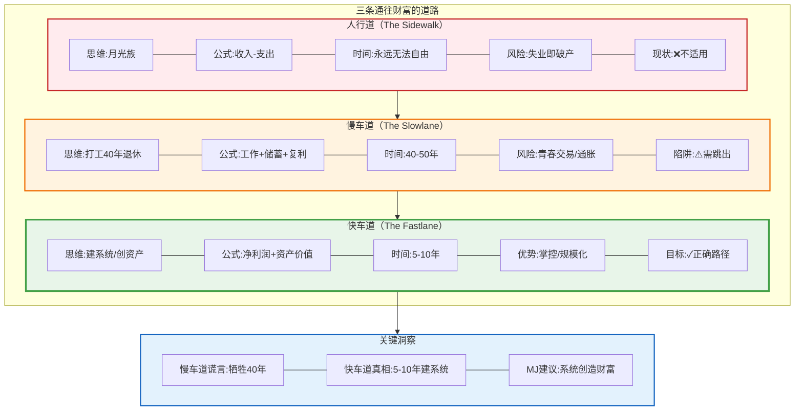

### 1.2 你的愿景：快车道验证

#### 核心理论：愿景的SMART验证

**为什么很多愿景只是空想？**

大多数人的"愿景"其实只是美好的幻想：
- "我要财富自由"——但不知道需要多少钱
- "我要创业成功"——但没有明确的成功标准
- "我要改变世界"——但不知道从哪里开始

真正的愿景需要通过**快车道验证框架**来检验，确保它不是慢车道思维的伪装。

**愿景验证的5个维度**

1. **具体性（Specific）**
   - ❌ 模糊：我要成功
   - ✓ 具体：5年内实现MRR $100K，资产价值$600万

2. **可衡量（Measurable）**
   - ❌ 模糊：我要赚很多钱
   - ✓ 可衡量：月收入从$5K提升到$50K

3. **可达成（Achievable）**
   - ❌ 不切实际：1年内成为亿万富翁
   - ✓ 现实：5年内通过快车道实现财富自由

4. **相关性（Relevant）**
   - ❌ 无关：追求技术完美（技术导向）
   - ✓ 相关：解决用户痛点创造价值（价值导向）

5. **有时限（Time-bound）**
   - ❌ 无期限：总有一天会成功
   - ✓ 有期限：3个月验证PMF，2年达到$20K MRR

**快车道陷阱识别**

即使你认为自己在走快车道，也可能陷入慢车道陷阱：

**陷阱1：主业依赖**（30%时间，70%心理负担）
- 表现：虽然说是30%投入主业，但心理上仍然依赖它
- 问题：不敢降低主业投入，创业项目永远是"业余"
- 解决：设定明确的转型时间点（如MRR达到月薪的50%时全职）

**陷阱2：被动等待**（等AI提效，而非主动创造）
- 表现：等待AI工具变得更好，等待市场变得更成熟
- 问题：机会不会等你，先行者已经占据市场
- 解决：立即开始，用现有工具验证需求

**陷阱3：跨界分散**（什么都想做，什么都不精）
- 表现：AI + 云原生 + 区块链 + ...样样涉猎
- 问题：资源分散，无法形成深度优势
- 解决：找到独特的交叉点（如AI × 云原生安全），深度聚焦

**快车道要素检查**

用以下标准检查你的愿景是否真正符合快车道：

✓ **AI赋能** → 杠杆
- 是否利用AI降低成本、提升效率？
- 是否让AI成为你的"24/7员工"？

✓ **数字生命体** → 时间解耦
- 你的产品能否24/7自动运行？
- 你睡觉时，系统还在创造价值吗？

✓ **创造价值** → 解决痛点
- 你是在解决真实痛点，还是炫技？
- 至少10个人愿意为此付费吗？

✓ **系统思维** → 可规模化
- 你的方案能服务10个用户吗？100个？10000个？
- 边际成本是否接近零？

#### 案例分析

**案例1：伪快车道 - 小王的AI咨询**

小王的愿景："用AI帮助企业提效"
- 路径：提供AI咨询服务
- 收费：$200/小时
- 一年后：
  - 月收入$15K（75小时×$200）
  - 但无法规模化，仍然是时间换钱
  - 停止工作，收入归零
- **问题**：这是"慢车道+"，不是快车道

**教训**：咨询是线性增长，本质上仍是慢车道。

**案例2：真快车道 - 小李的AI自动化工具**

小李的愿景："让开发者节省90%的IAM配置时间"
- 路径：开发AI驱动的自动化IAM配置工具
- 定价：$49/月
- 一年后：
  - 500个付费用户
  - MRR $24.5K
  - 产品24/7自动运行
  - 小李每周只需10小时维护
- **关键**：可规模化，时间解耦

**启示**：产品化才是真正的快车道。

#### 反思练习：验证你的愿景

**练习1：愿景SMART检查**

请填写你的愿景，并用SMART标准验证：

**我的5年愿景**：
_________________________________________

**SMART验证**：

| 标准 | 检查点 | 是否符合 | 具体描述 |
|------|--------|---------|---------|
| **S-具体** | 有明确的数字和标准吗？ | [ ] 是 [ ] 否 | _______ |
| **M-可衡量** | 能用数据追踪进度吗？ | [ ] 是 [ ] 否 | _______ |
| **A-可达成** | 5-10年内能实现吗？ | [ ] 是 [ ] 否 | _______ |
| **R-相关** | 与快车道原则相关吗？ | [ ] 是 [ ] 否 | _______ |
| **T-有期限** | 有明确的时间节点吗？ | [ ] 是 [ ] 否 | _______ |

**练习2：快车道vs慢车道要素对照**

对照你的项目/计划，在适用的列打✓：

| 维度 | 慢车道特征 | 快车道特征 | 你的现状 |
|------|-----------|-----------|---------|
| **收入模式** | 时间换钱 | 系统赚钱 | [ ] 慢 [ ] 快 |
| **价值创造** | 为老板创造 | 为市场创造 | [ ] 慢 [ ] 快 |
| **可控性** | 依赖公司/平台 | 自主掌控 | [ ] 慢 [ ] 快 |
| **规模化** | 线性增长 | 指数增长 | [ ] 慢 [ ] 快 |
| **时间解耦** | 停工停收入 | 睡觉也赚钱 | [ ] 慢 [ ] 快 |

**诊断**：
- 4-5个"快"：真正的快车道，继续推进
- 2-3个"快"：部分快车道，需要优化
- 0-1个"快"：伪快车道，需要重新设计

**练习3：陷阱识别**

检查你是否陷入了以下快车道陷阱：

- [ ] **主业依赖**：我仍然把主业当作安全网，不敢全力创业
- [ ] **被动等待**：我在等待"更好的时机"才开始
- [ ] **跨界分散**：我同时在尝试3个以上不同方向
- [ ] **完美主义**：我的产品已开发6个月但还未发布
- [ ] **技术导向**：我关注技术多于关注用户需求
- [ ] **免费策略**：我计划先免费获得大量用户再考虑变现

**如果你选中了2个以上，需要立即调整策略！**

#### 优化建议：从陷阱到快车道

**优化1：从兼职心态到全力以赴**

- ❌ 错误：主业70% + 副业30%
- ✓ 正确：主业30% + 创业70%
- **行动**：
  - [ ] 与老板协商，转为兼职或弹性工作
  - [ ] 或者提高工作效率，用30%时间完成核心工作
  - [ ] 在日历中把创业时间标记为"不可协商"

**优化2：从工具思维到产品思维**

- ❌ 错误：开发AI工具给自己用
- ✓ 正确：开发AI产品解决他人痛点
- **行动**：
  - [ ] 访谈20个目标用户，验证需求
  - [ ] 找到10个愿意付费的用户
  - [ ] 在产品还很丑陋时就开始收费

**优化3：从跨界到专精**

- ❌ 错误：AI + 云原生 + 区块链 + ...（样样通，样样松）
- ✓ 正确：AI × 云原生 = AI驱动的云原生基础设施（独特定位）
- **行动**：
  - [ ] 选择一个交叉领域，成为前5%
  - [ ] 3个月内不开始新方向
  - [ ] 每天在这个领域投入至少2小时

**优化4：从计划到验证**

- ❌ 错误：花3个月写完美计划
- ✓ 正确：花2周做MVP，立即验证
- **行动**：
  - [ ] 今天列出10个痛点
  - [ ] 明天开始访谈用户
  - [ ] 2周内完成MVP
  - [ ] 第3周获得首个付费用户

#### 你的快车道路线图

基于你的验证结果，制定你的快车道路线图：

**阶段0：准备期（当前-3个月）**
- **目标**：从慢车道思维切换到快车道思维
- **里程碑**：找到1个强痛点，至少5人愿意付费
- **关键任务**：
  - [ ] 完成愿景SMART验证
  - [ ] 列出50个潜在痛点
  - [ ] 访谈30个目标用户
  - [ ] 建立第二大脑系统（Notion/Obsidian）

**阶段1：验证期（3-12个月）**
- **目标**：验证PMF（Product-Market Fit）
- **里程碑**：MRR达到$3K-5K，用户留存率>60%
- **关键任务**：
  - [ ] 2周完成MVP
  - [ ] 获得前10个付费用户
  - [ ] 建立用户反馈循环
  - [ ] 每周至少5个用户访谈

**阶段2：增长期（12-24个月）**
- **目标**：规模化增长
- **里程碑**：MRR达到$20K，被动收入>50%
- **关键任务**：
  - [ ] 优化产品，降低流失率
  - [ ] 找到可复制的获客渠道
  - [ ] 建立内容营销引擎
  - [ ] 考虑辞职全职创业

**阶段3：规模期（24-36个月）**
- **目标**：建立系统，实现自动化
- **里程碑**：MRR达到$50K，实现财富自由
- **关键任务**：
  - [ ] 产品矩阵（多产品/多版本）
  - [ ] 建立小团队（外包/兼职）
  - [ ] 自动化运营
  - [ ] 系统可以无需你也能运行

**阶段4：自由期（36-60个月）**
- **目标**：享受自由，追求意义
- **里程碑**：MRR>$100K，影响1000+人
- **关键任务**：
  - [ ] 优化生活方式
  - [ ] 投资其他项目
  - [ ] 帮助他人（导师/投资人）
  - [ ] 追求更大的使命

#### 行动清单：立即行动

**今天就做**（1小时）：
- [ ] 完成愿景SMART验证
- [ ] 完成快车道vs慢车道要素对照
- [ ] 识别你陷入的陷阱
- [ ] 写下你的优化计划

**本周完成**（5小时）：
- [ ] 制定你的快车道路线图（阶段0-4）
- [ ] 列出你在阶段0需要完成的具体任务
- [ ] 找到3个可以优化的陷阱
- [ ] 设定本周的小目标

**本月完成**（20小时）：
- [ ] 完成阶段0的所有任务
- [ ] 验证至少1个强痛点
- [ ] 找到5个愿意付费的用户
- [ ] 开始设计MVP

**记住Naval的话**：
> "不要追逐金钱，追逐你的专长知识和杠杆。金钱会追着你跑。"

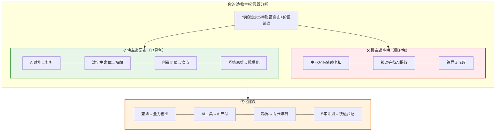

---

## 纳瓦尔的4种杠杆：指数级财富创造

### 核心理论：Naval Ravikant的财富创造革命

**为什么大多数程序员无法实现财富自由？**

Naval Ravikant（AngelList创始人）在《纳瓦尔宝典》中揭示了一个革命性的财富创造公式：

**财富 = 专长知识 × 杠杆 × 判断力**

大多数人只关注"努力工作"和"提升技能"，但这只是公式中的一小部分。**真正的财富来自于用杠杆放大你的判断力**。

**什么是杠杆？**

杠杆是一种工具，让你的单位时间产出可以被无限放大。就像物理学中的杠杆原理：给我一个支点，我可以撬动地球。

**传统社会的两种杠杆**：
1. **劳动力杠杆**：雇佣员工为你工作
   - 优势：立即可用，容易理解
   - 劣势：需要管理能力，成本高，线性扩展

2. **资本杠杆**：用钱生钱
   - 优势：可以产生复利效应
   - 劣势：需要初始资本，需要信任

**问题**：这两种杠杆都需要"许可"——你需要说服别人（员工或投资人）才能使用。

**新时代的革命：无需许可的杠杆**

3. **代码杠杆**：软件和AI
   - 特点：写一次，复制无限次
   - 优势：
     - ✓ 零边际成本
     - ✓ 24/7自动运行
     - ✓ 全球分发
     - ✓ 无需许可
   - 劣势：需要技术能力
   - **这是程序员的天然优势！**

4. **媒体杠杆**：内容和品牌
   - 特点：创作一次，传播无限次
   - 优势：
     - ✓ 零传播成本
     - ✓ 建立信任和影响力
     - ✓ 持续带来流量和客户
     - ✓ 无需许可
   - 劣势：需要时间积累
   - **这是内容创作者的优势！**

**为什么代码和媒体是最强杠杆？**

Naval说：
> "代码和媒体是这个时代最强大的杠杆。它们不需要任何人的许可。你今天就可以开始。"

**案例分析**：

**案例1：劳动力杠杆的局限 - 传统咨询公司**
- 公司：10人的咨询团队
- 收入：$200/小时/人 × 8小时/天 × 20天/月 × 10人 = $320K/月
- 问题：
  - 需要管理10个人（管理成本）
  - 员工生病/离职会影响收入
  - 扩展需要持续招聘
  - 利润率被员工成本侵蚀

**案例2：代码杠杆的威力 - SaaS产品**
- 产品：AI代码审查工具
- 团队：1个人开发
- 用户：1000个
- 收入：$49/月 × 1000 = $49K/月
- 关键：
  - 产品24/7自动运行
  - 服务1000个用户不需要雇人
  - 边际成本接近零
  - 可以扩展到10000个用户

**差异**：
- 咨询公司：10人团队，收入$320K/月
- SaaS产品：1人团队，收入$49K/月（第一年），但可以扩展到$490K/月（第二年），而无需增加团队

**案例3：代码+媒体的复合杠杆 - 技术博主**
- 人物：技术博主
- 博客：每周发布2-3篇深度技术文章
- YouTube：每周发布1-2个教程视频
- 产品：基于博客内容开发的工具/课程
- 一年后：
  - 博客月访问量：50K
  - YouTube订阅者：10K
  - 产品MRR：$10K
  - 关键：内容持续带来流量 → 流量转化为用户 → 用户付费使用产品

**启示**：代码+媒体的组合是最强大的财富创造方式。

#### 四种杠杆的深度对比

| 杠杆类型 | 边际成本 | 需要许可 | 启动门槛 | 规模上限 | 程序员适用度 |
|---------|---------|---------|---------|---------|-------------|
| **劳动力** | 高（工资） | 是（管理能力） | 中（资金） | 中（管理瓶颈） | ⭐⭐ |
| **资本** | 中（利息） | 是（信任/资金） | 高（初始资本） | 高（复利） | ⭐⭐⭐ |
| **代码** | 零 | 否 | 低（技能） | 极高 | ⭐⭐⭐⭐⭐ |
| **媒体** | 零 | 否 | 极低（时间） | 极高 | ⭐⭐⭐⭐⭐ |

**关键洞察**：
- 程序员天生拥有代码杠杆的能力
- 学会内容创作，就能获得媒体杠杆
- 代码+媒体 = 无敌组合
- 你不需要等待资本积累，不需要等待团队建立
- **你可以今天就开始**

#### 反思练习：你的杠杆现状

**练习1：杠杆使用评估**

请诚实评估你当前使用的杠杆（在适用的选项前打✓）：

**1. 你主要使用哪种杠杆？**
- [ ] 劳动力（管理团队）
- [ ] 资本（投资理财）
- [ ] 代码（开发产品）
- [ ] 媒体（内容创作）
- [ ] 无杠杆（纯时间换钱）

**2. 你的代码杠杆使用情况**：
- [ ] 为公司写代码（老板获得杠杆，你获得工资）
- [ ] 为自己写工具（自己使用，无杠杆效应）
- [ ] 开发产品/服务（✓ 正确使用杠杆）
- [ ] 开源项目商业化（✓ 正确使用杠杆）

**3. 你的媒体杠杆使用情况**：
- [ ] 不创作内容（0杠杆）
- [ ] 偶尔写文章/发视频（低杠杆）
- [ ] 持续输出内容（✓ 中杠杆）
- [ ] 建立个人品牌和影响力（✓ 高杠杆）

**4. 你的杠杆组合策略**：
- [ ] 单一杠杆（风险高）
- [ ] 代码+媒体（✓ 最佳组合）
- [ ] 代码+媒体+资本（✓ 理想状态）
- [ ] 四种杠杆全用（✓ 终极状态）

**诊断结果**：
- 如果你主要使用"劳动力"或"无杠杆"：你在慢车道，需要立即转型
- 如果你使用"代码"但为公司工作：你在为老板创造杠杆，需要为自己建立杠杆
- 如果你使用"代码+媒体"：你在正确的道路上，继续优化
- 如果你使用"代码+媒体+资本"：你已经掌握了财富创造的秘密

**练习2：杠杆效率计算**

计算你当前的杠杆效率：

**杠杆效率 = 产出价值 / 时间投入**

填写你的数据：

| 活动 | 每周时间投入 | 每周产出价值 | 杠杆效率 | 可规模化？ |
|------|------------|------------|---------|-----------|
| 主业工作 | ___ 小时 | $_____ | $___/小时 | ❌ 否 |
| 开发产品 | ___ 小时 | $_____ | $___/小时 | ✓ 是 |
| 创作内容 | ___ 小时 | $_____ | $___/小时 | ✓ 是 |
| 投资理财 | ___ 小时 | $_____ | $___/小时 | ✓ 是 |

**分析**：
- 主业工作：通常是固定的$$/小时，无法规模化
- 开发产品：初期可能很低，但随着用户增长，杠杆效率会指数增长
- 创作内容：初期回报低，但有复利效应
- 投资理财：需要初始资本，但一旦建立，杠杆效率很高

**目标**：每季度让你的杠杆效率提升2-3倍

#### 实践指南：建立你的杠杆组合

**阶段1：代码杠杆为主（0-12个月）**

**核心目标**：从"为老板写代码"转变为"为自己建立资产"

**具体策略**：

1. **AI驱动的SaaS产品**
   - 痛点：找到开发者/企业的真实痛点
   - 方案：用AI+代码构建10倍好的解决方案
   - 例子：
     - AI代码审查工具
     - AI文档生成器
     - AI测试自动化工具
     - AI驱动的云成本优化工具
   - 验证：2周MVP，10个付费用户，MRR $3K-5K

2. **开源项目商业化**
   - 策略：核心开源，企业版收费
   - 例子：
     - 云原生工具的企业版
     - AI模型的托管服务
     - 开源框架的商业支持
   - 验证：1000+ GitHub stars，50个企业客户试用

3. **自动化服务**
   - 策略：将你的专长打包成自动化服务
   - 例子：
     - CI/CD自动化
     - 基础设施自动化
     - AI工作流自动化
   - 验证：10个客户，月收入$5K+

**关键指标**（第一年）：
- MRR：$3K-5K
- 用户数：100-500
- 时间投入：主业30% + 创业70%
- 被动收入占比：30%

**阶段2：代码+媒体（12-24个月）**

**核心目标**：建立个人品牌，实现产品和内容的正向循环

**具体策略**：

1. **产品优化+内容营销**
   - 产品：基于用户反馈，持续优化核心功能
   - 内容：每周发布2-3篇深度技术文章/视频
   - 主题：
     - 你的产品解决的问题
     - 技术深度分析
     - 行业洞察和趋势
   - 渠道：
     - 技术博客（Medium/Dev.to/自建博客）
     - YouTube技术频道
     - Twitter/LinkedIn
     - 技术社区（Reddit/Hacker News）

2. **技术博客/视频系列**
   - 格式：
     - 教程（How-to guides）
     - 案例研究（Case studies）
     - 技术深度分析（Deep dives）
   - 频率：每周2-3篇文章 或 1-2个视频
   - SEO：针对高价值关键词优化
   - 目标：每月10K+访问量，转化率3-5%

3. **社区/Newsletter运营**
   - 建立Discord/Slack社区
   - 每周发送Newsletter，提供价值
   - 举办线上Workshop/Webinar
   - 目标：5000+订阅者，10%付费转化

**关键指标**（第二年）：
- MRR：$20K
- 用户数：1000-2000
- 内容输出：每周2-3篇
- 被动收入占比：50%
- 有机流量：60%+

**阶段3：全杠杆组合（24-36个月）**

**核心目标**：财富自由，系统自动化运行

**具体策略**：

1. **产品矩阵**
   - 核心产品：持续优化，占收入70%
   - 第二产品：针对不同细分市场
   - 企业版：高价格，定制化服务
   - 课程/咨询：知识变现

2. **品牌课程/付费社区**
   - 在线课程：$500-2000/人
   - 付费社区：$50-200/月
   - 1对1咨询：$500-1000/小时
   - 企业培训：$5K-20K/次

3. **小团队/外包**
   - 雇佣1-3个兼职/全职
   - 外包非核心工作
   - 你专注于：战略、产品、内容、销售
   - 释放80%时间

4. **盈利再投资（资本杠杆）**
   - 投资其他SaaS产品
   - 投资指数基金（被动收入）
   - 天使投资（帮助他人+财务回报）

**关键指标**（第三年）：
- MRR：$50K-100K
- 用户数：5000-10000
- 团队：2-5人
- 被动收入占比：70%+
- 你的时间投入：每周<20小时

#### 行动清单：立即开始

**今天就做**（2小时）：
- [ ] 完成杠杆使用评估
- [ ] 计算你当前的杠杆效率
- [ ] 确定你的第一个代码杠杆项目
- [ ] 注册一个域名/GitHub组织

**本周完成**（10小时）：
- [ ] 完成MVP的核心功能设计
- [ ] 发布第一篇技术文章/视频
- [ ] 访谈10个潜在用户
- [ ] 制定你的杠杆发展路径（阶段1-3）

**本月完成**（40小时）：
- [ ] 发布MVP
- [ ] 发布8-12篇内容
- [ ] 获得前3个付费用户
- [ ] 建立内容发布系统

**本季度完成**（90天）：
- [ ] MRR达到$1K-3K
- [ ] 建立稳定的内容输出节奏
- [ ] 找到可复制的获客渠道
- [ ] 决定是否调整主业比例

**记住Naval的话**：
> "不靠运气致富的秘诀：找到你的专长知识，用代码和媒体这两个最强大的杠杆放大它。"

### 2.1 Naval的财富杠杆理论

```mermaid
graph TB
    subgraph Leverage["Naval的4种财富杠杆"]
        direction TB

        subgraph Labor["1. 劳动力杠杆（最古老）"]
            direction LR
            L1[雇佣员工] --- L2[优势:立即可用] --- L3[劣势:线性扩展/高成本] --- L4[适用:传统企业]
        end

        subgraph Capital["2. 资本杠杆（传统）"]
            direction LR
            C1[用钱生钱] --- C2[优势:复利/规模化] --- C3[劣势:需初始资本] --- C4[适用:第2-3年]
        end

        subgraph Code["3. 代码杠杆（新时代）★"]
            direction LR
            CO1[软件/AI无限复制] --- CO2[优势:零边际成本/24/7] --- CO3[劣势:需技术能力] --- CO4[适用:✓核心优势]
        end

        subgraph Media["4. 媒体杠杆（新时代）★"]
            direction LR
            M1[内容/品牌持续传播] --- M2[优势:零成本/建信任] --- M3[劣势:需时间积累] --- M4[适用:✓与代码结合]
        end
    end

    subgraph NavalQuote["Naval的核心观点"]
        direction LR
        Q1[致富秘诀:杠杆放大判断力] --- Q2[代码和媒体无需许可] --- Q3[劳动力和资本需要许可] --- Q4[新时代用代码和媒体]
    end

    Labor --> NavalQuote
    Capital --> NavalQuote
    Code --> NavalQuote
    Media --> NavalQuote

    style Code fill:#4caf50,stroke:#2e7d32,stroke-width:3px
    style Media fill:#2196f3,stroke:#1565c0,stroke-width:3px
    style Labor fill:#9e9e9e,stroke:#616161,stroke-width:1px
    style Capital fill:#ff9800,stroke:#e65100,stroke-width:2px
```

### 2.2 你的杠杆策略

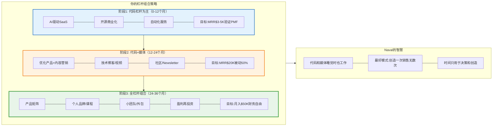

---

## 芒格的多元思维模型工具箱

### 核心理论：查理·芒格的格栅思维

查理·芒格（Charlie Munger）是沃伦·巴菲特的黄金搭档，伯克希尔·哈撒韦的副主席。他最著名的理论是：**多元思维模型**。

**芒格的核心洞察**：
> "在手里拿着铁锤的人看来，每个问题都像钉子。"

这句话揭示了单一思维模型的危险：**如果你只掌握一种思维方式，你会试图用它解决所有问题，即使它不适用**。

#### 什么是多元思维模型？

**定义**：从不同学科（数学、物理、生物、心理、经济）中提取核心原理，形成一个跨学科的思维工具箱。

**为什么需要多元思维模型？**

1. **避免单一视角的盲区**
   - 工程师倾向于技术解决方案
   - 商业人倾向于市场解决方案
   - 真正的解决方案往往需要跨学科思考

2. **找到问题的根本原因**
   - 表面问题：用户流失率高
   - 心理学视角：产品缺乏"习惯钩子"
   - 经济学视角：转换成本太低
   - 生物学视角：缺乏"网络效应"生态

3. **预测二阶、三阶效应**
   - 一阶效应：降价 → 销量增加
   - 二阶效应：销量增加 → 品牌价值下降
   - 三阶效应：品牌价值下降 → 高端客户流失

#### 程序员必须掌握的10大思维模型

**1. 数学模型：复利**
- **原理**：1.01^365 = 37.8，0.99^365 = 0.03
- **应用**：
  - 每天进步1%，一年后你是现在的37.8倍
  - 每天退步1%，一年后你几乎归零
  - 专注于可积累的技能和资产
- **实践**：选择有复利效应的工作（代码、内容、网络）

**2. 物理模型：临界质量**
- **原理**：核反应需要临界质量才能引爆
- **应用**：
  - 产品需要达到临界用户量才能产生网络效应
  - 内容需要达到临界数量才能产生SEO效果
  - 技能需要达到临界深度才能变现
- **实践**：专注一个领域，达到临界质量后再扩展

**3. 生物模型：进化论**
- **原理**：适者生存，物竞天择
- **应用**：
  - 市场会淘汰不适应的产品/公司
  - 快速迭代 > 完美计划
  - 多样性 > 单一押注
- **实践**：快速发布，快速迭代，A/B测试

**4. 心理模型：激励机制**
- **原理**：人们响应激励，而非你的期望
- **应用**：
  - 用户不会因为"应该"而使用产品
  - 员工不会因为"责任"而努力工作
  - 设计正确的激励，行为自然改变
- **实践**：产品设计要有明确的用户激励（奖励、成就、社交认同）

**5. 经济模型：机会成本**
- **原理**：选择A意味着放弃B
- **应用**：
  - 做这个项目的成本 = 放弃的其他项目的价值
  - 在公司工作的成本 = 放弃创业的机会
  - 免费的代价往往最高（时间、注意力）
- **实践**：每个决策都要问："我放弃了什么？"

**6. 数学模型：概率思维**
- **原理**：世界是概率的，不是确定的
- **应用**：
  - 创业成功率<5%，但10次尝试，成功概率40%
  - 不要因为一次失败就放弃
  - 增加"抽奖次数"，而不是寄希望于单次成功
- **实践**：同时尝试多个小项目，找到PMF后all-in

**7. 物理模型：杠杆原理**
- **原理**：给我一个支点，我能撬动地球
- **应用**：
  - 代码是杠杆（1份工作，无限次复制）
  - 媒体是杠杆（1篇文章，无限次阅读）
  - 找到你的支点（专长知识）和杠杆（代码/媒体）
- **实践**：专注于高杠杆活动，外包低杠杆活动

**8. 生物模型：生态位**
- **原理**：每个物种都有独特的生态位
- **应用**：
  - 不要在红海竞争，找到蓝海生态位
  - 交叉领域 = 独特生态位（AI × 云原生）
  - 小市场的第一 > 大市场的第N
- **实践**：找到你的独特定位，成为细分领域第一

**9. 心理模型：损失厌恶**
- **原理**：人们对损失的痛苦 > 获得的快乐（2:1）
- **应用**：
  - 免费试用 + 取消麻烦 = 高转化
  - "不要错过" > "赶紧获得"
  - "保护你的数据" > "提升效率"
- **实践**：产品营销强调"避免损失"而非"获得收益"

**10. 经济模型：规模效应**
- **原理**：规模越大，边际成本越低
- **应用**：
  - SaaS：第1个用户成本$10K，第10000个用户成本$0.1
  - 内容：第1篇文章回报低，第100篇文章回报高
  - 网络：第1个用户价值0，第10000个用户价值巨大
- **实践**：选择有规模效应的业务模型

#### 如何建立你的思维模型工具箱？

**步骤1：学习基础模型**（3个月）
- 阅读《穷查理宝典》
- 学习每个学科的3-5个核心模型
- 建立思维模型清单

**步骤2：刻意应用**（6个月）
- 每周选择1个模型，应用到实际问题
- 记录：问题 → 模型 → 解决方案 → 结果
- 建立你的案例库

**步骤3：组合使用**（持续）
- 遇到复杂问题，从多个角度分析
- 用3-5个模型交叉验证
- 找到最优解决方案

#### 反思练习：用多元思维模型分析你的项目

选择你正在做/计划做的一个项目，用至少5个思维模型分析：

| 思维模型 | 分析角度 | 洞察/发现 | 行动建议 |
|---------|---------|----------|---------|
| 复利 | 这个项目有复利效应吗？ | | |
| 临界质量 | 需要多少用户才能引爆？ | | |
| 进化论 | 如何快速迭代验证？ | | |
| 激励机制 | 用户为什么要用？ | | |
| 生态位 | 我的独特定位是什么？ | | |
| 规模效应 | 边际成本会递减吗？ | | |
| 网络效应 | 用户越多越有价值吗？ | | |

**案例分析**：

假设你要做一个"AI代码审查工具"：

- **复利**：代码库越大，历史数据越多，AI越准确（✓ 有复利）
- **临界质量**：需要100个团队使用才能训练出好模型
- **进化论**：2周MVP，快速迭代，基于用户反馈优化
- **激励机制**：开发者讨厌代码审查，AI自动化 = 节省时间
- **生态位**：专注云原生应用的代码审查（独特定位）
- **规模效应**：第1个客户成本高，第1000个客户成本接近0
- **网络效应**：所有用户的代码数据改进整个系统（✓ 强网络效应）

**结论**：这是一个好项目，具备多个快车道特征！

### 3.1 查理·芒格的思维模型框架

```mermaid
graph TB
    subgraph Munger["芒格的多元思维模型"]
        direction TB

        Core[核心理念:手里拿着铁锤的人看来每个问题都像钉子]

        subgraph Models["跨学科思维模型网格"]
            direction TB

            subgraph Math["数学模型"]
                direction LR
                M1[复利:最强力量] --- M2[排列组合] --- M3[决策树] --- M4[贝叶斯定理]
            end

            subgraph Physics["物理学模型"]
                direction LR
                P1[临界质量] --- P2[杠杆] --- P3[熵] --- P4[能量守恒]
            end

            subgraph Biology["生物学模型"]
                direction LR
                B1[进化] --- B2[生态位] --- B3[红皇后效应] --- B4[复制传播]
            end

            subgraph Psychology["心理学模型"]
                direction LR
                PS1[激励机制] --- PS2[社会认同] --- PS3[互惠] --- PS4[损失厌恶] --- PS5[承诺一致]
            end

            subgraph Economics["经济学模型"]
                direction LR
                E1[供需] --- E2[边际效用] --- E3[机会成本] --- E4[规模效应]
            end
        end

        Core --> Models
    end

    subgraph Application["应用到你的创业"]
        direction LR
        A1[复利:每日1%改进一年37.8倍] --- A2[生态位:独特定位避免红海] --- A3[网络效应:用户增加价值指数增长] --- A4[损失厌恶:免费试用让用户不愿离开] --- A5[规模效应:边际成本递减]
    end

    Munger --> Application

    style Math fill:#e3f2fd,stroke:#1565c0,stroke-width:2px
    style Psychology fill:#ffebee,stroke:#c62828,stroke-width:2px
    style Economics fill:#e8f5e9,stroke:#43a047,stroke-width:2px
    style Application fill:#fff3e0,stroke:#ef6c00,stroke-width:3px
```

### 3.2 芒格的逆向思维：避免失败

#### 逆向思维的威力

芒格最著名的一句话：
> "告诉我我会死在哪里，这样我就永远不去那里。"

这句话来自一个德国数学家的笑话，但芒格将它变成了一个强大的思维工具：**逆向思维（Inversion）**。

**核心原理**：
- **正向思考**：我怎样才能成功？
- **逆向思考**：我怎样才能失败？然后避免它！

**为什么逆向思维更有效？**

1. **失败模式是有限的，成功路径是无限的**
   - 创业失败的原因：10-20种常见模式
   - 创业成功的路径：千万种独特方式
   - 避免失败模式 > 追求成功模式

2. **人类更擅长识别风险**
   - 进化让我们善于识别危险（生存本能）
   - 识别机会需要理性思考（慢思考）
   - 利用本能，而非对抗本能

3. **避免愚蠢比追求聪明更容易**
   - 聪明很难定义和复制
   - 愚蠢很容易识别和避免
   - 不犯大错，自然会有好结果

#### 创业的8大失败模式

基于数千个创业失败案例的总结：

**失败模式1：伪需求（解决不存在的问题）**
- **表现**：产品很酷，但没人愿意付费
- **原因**：自我中心，没有真实用户验证
- **避免**：10人付费验证法则（至少10人愿意预付费）
- **案例**：无数"AI工具"项目，开发者自嗨，用户不买单

**失败模式2：定价错误（价格与价值不匹配）**
- **表现**：定价太低（赚不到钱）或太高（无人问津）
- **原因**：不了解目标市场的支付意愿
- **避免**：访谈用户，测试不同价格点
- **案例**：SaaS定价$9/月，获客成本$100，永远不盈利

**失败模式3：过早扩张（还没PMF就扩张）**
- **表现**：招聘团队、融资、营销，但产品还没验证
- **原因**：被媒体/VC压力驱动，而非用户需求
- **避免**：PMF前只做最小化团队（1-3人）
- **案例**：融资后迅速招聘20人，6个月后裁员，项目夭折

**失败模式4：忽视反馈（闭门造车）**
- **表现**：用户说不需要，但你认为他们"不懂"
- **原因**：确认偏见，只看支持自己的证据
- **避免**：每周至少5个用户访谈，数据驱动决策
- **案例**：花6个月开发完美产品，发布后无人使用

**失败模式5：合伙人冲突（分赃不均/理念不合）**
- **表现**：合伙人因股权/决策权/方向争吵，分道扬镳
- **原因**：没有事先明确责权利
- **避免**：签署合伙人协议，明确决策机制和退出条款
- **案例**：50/50股权，两人意见不合，公司僵局

**失败模式6：无差异化（做me-too产品）**
- **表现**：市场已有10个竞品，你是第11个
- **原因**：看到别人成功就模仿，没有独特优势
- **避免**：找到10倍好的差异化点，或放弃
- **案例**：又一个任务管理工具，与Notion/Asana无差异

**失败模式7：完美主义（永远不发布）**
- **表现**：一直在"优化"，迟迟不发布
- **原因**：害怕失败，追求完美
- **避免**：2周MVP，先发布再优化
- **案例**：开发2年，竞品已占领市场

**失败模式8：过度乐观（低估时间和资源）**
- **表现**：计划3个月完成，实际需要2年
- **原因**：计划谬误，只看最优情况
- **避免**：时间×3法则，资源×2法则
- **案例**：预算10万，实际花费50万，中途资金链断裂

#### 避免失败检查清单

**项目启动前检查清单**：

在开始任何项目前，必须通过所有检查：

- [ ] **伪需求检查**：至少10个人愿意预付费？
- [ ] **LTV/CAC检查**：LTV > 3×CAC？（否则不可持续）
- [ ] **储备检查**：有6-12个月生活费储备？
- [ ] **反馈机制**：建立了每周用户反馈渠道？
- [ ] **合伙协议**：责权利明确，有退出条款？
- [ ] **差异化检查**：比现有方案10倍好？
- [ ] **MVP计划**：2周内能发布MVP？
- [ ] **最坏打算**：失败了能接受吗？学到了什么？

**每月检查清单**：

项目进行中，每月必须检查：

- [ ] **增长检查**：MRR/用户数在增长吗？
- [ ] **留存检查**：用户留存率>50%？
- [ ] **单位经济**：CAC < LTV/3？
- [ ] **推荐检查**：用户主动推荐吗？（NPS>40）
- [ ] **现金检查**：现金储备>6个月？
- [ ] **健康检查**：身体/心理状态良好吗？
- [ ] **激情检查**：还有激情继续吗？

**每季度检查清单**：

每季度进行战略复盘：

- [ ] **方向检查**：方向还正确吗？
- [ ] **目标检查**：达到季度目标了吗？
- [ ] **竞争检查**：有新竞争对手吗？我们还有优势吗？
- [ ] **假设检查**：核心假设被验证了吗？
- [ ] **转向检查**：需要pivot吗？
- [ ] **决策检查**：加倍投入 or 及时止损？

#### 实践练习6：前置验尸（Pre-Mortem）

**什么是前置验尸？**

想象现在是1年后，你的项目彻底失败了。你在项目验尸会上，需要分析失败原因。

**练习步骤**：

1. **设定场景**：假设1年后，你的项目完全失败，MRR为0，你放弃了

2. **头脑风暴失败原因**：列出所有可能的失败原因（至少20个）

3. **概率排序**：给每个原因打分（1-10），按可能性排序

4. **制定预防措施**：针对前5个最可能的失败原因，设计预防措施

**示例**：

| 失败原因 | 概率(1-10) | 预防措施 |
|---------|-----------|---------|
| 没有真实需求 | 9 | 10人付费预验证 |
| 竞品抄袭 | 7 | 快速迭代，建立品牌护城河 |
| 定价太低 | 8 | 测试$50-200价格点 |
| 个人倦怠 | 6 | 每周运动3次，保持健康 |
| 技术债务 | 5 | 代码质量>速度 |

**关键洞察**：

很多人认为"前置验尸"很消极，但芒格说：
> "这是最乐观的做法——因为你在提前解决问题，而不是等问题发生后才应对。"

#### 案例分析

**案例1：成功的逆向思维 - Airbnb的生存之道**

2008年金融危机时，Airbnb濒临倒闭。创始人用逆向思维问：
- "我们怎样才能失败？"答案：现金流断裂
- "怎样避免？"答案：创造现金流

他们决定卖"Obama O's"麦片（奥巴马竞选主题），赚了3万美元，渡过难关。这个逆向思维拯救了公司。

**案例2：失败的正向思维 - Theranos的教训**

Theranos只关注"如何成功"：
- 追求完美产品
- 保密开发（怕竞争）
- 夸大宣传

忽略了"如何失败"的警告信号：
- 技术不可行
- 测试结果不准确
- 监管风险

结果：公司倒闭，创始人入狱。如果用逆向思维，早期就会发现技术路径不可行。

#### 反思练习：识别你的失败模式

**练习7：你最可能犯哪3个错误？**

基于你的性格和历史，你最可能犯哪3个错误？

1. ___________________ (预防措施：_________________)
2. ___________________ (预防措施：_________________)
3. ___________________ (预防措施：_________________)

将预防措施加入你的检查清单。

#### 行动清单：立即开始

**今天就做**（1小时）：
- [ ] 完成前置验尸练习
- [ ] 识别你的3个最可能失败模式
- [ ] 制定预防措施

**本周完成**（5小时）：
- [ ] 建立项目启动前检查清单
- [ ] 建立每月检查清单
- [ ] 建立每季度检查清单
- [ ] 设置自动提醒（日历/Notion）

**本月完成**（20小时）：
- [ ] 对当前项目执行完整检查
- [ ] 如果有重大风险，立即调整
- [ ] 每周复盘，更新检查清单
- [ ] 记录避免的失败案例

**记住芒格的话**：
> "我的成功不是因为我多聪明，而是因为我避免了大部分愚蠢的决策。"

**你的逆向清单**（写下来，贴在墙上）：

**绝不做的事**：
1. 绝不在没有10人付费验证前开发产品
2. 绝不在情绪激动时做重大决策
3. 绝不投入超过10%资产到单一项目
4. 绝不为了创业透支健康
5. 绝不因为沉没成本而继续错误方向
6. _________________________________
7. _________________________________
8. _________________________________

**记住**：
- 避免失败 ≠ 避免冒险
- 避免失败 = 避免**愚蠢的**失败
- 聪明的冒险 = 限制下行 + 保留上行

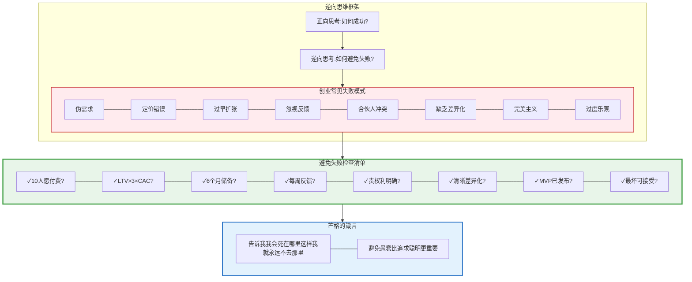

---

## 专长知识堆栈：你的不可复制优势

### 4.1 Naval的Specific Knowledge理论

#### 核心理论：Naval Ravikant的专长知识革命

在《纳瓦尔宝典》中,Naval提出了一个颠覆性的概念：**专长知识(Specific Knowledge)**。这是财富创造公式中最容易被忽视,却最关键的要素。

#### 什么是专长知识？

**Naval的定义**：
> "专长知识是无法通过培训学会的知识。如果社会可以培训你,那么它也可以培训别人来取代你。"

**关键特征**：

1. **无法系统化教授**
   - 只能通过实践、经验、兴趣驱动的探索获得
   - 培训班教不了,大学学不到
   - 例子：审美品味、产品直觉、技术洞察力

2. **高度个性化**
   - 源于你独特的基因、成长背景、兴趣组合
   - 别人无法轻易复制
   - 例子：你对AI应用的独特洞察 + 云原生架构经验

3. **往往"玩"出来的**
   - 对你像玩,对别人像工作
   - 你愿意免费做,因为你享受过程
   - 例子：你周末研究新技术,别人在看剧

4. **在边缘地带产生**
   - 不在热门中心,而在交叉领域
   - A × B > A + B
   - 例子：AI × 云原生 × 开发者工具

#### 为什么专长知识如此重要？

**财富创造公式再解读**：
```
财富 = 专长知识 × 杠杆 × 判断力
```

- **专长知识**：决定你的不可替代性(护城河)
- **杠杆**：决定你的规模化能力(天花板)
- **判断力**：决定你的决策质量(成功率)

**案例分析**：

**案例1：纯技术人(无专长知识)**
- 技能：熟练掌握React、Node.js、AWS
- 杠杆：可以开发产品
- 问题：10万个开发者都会这些
- 结果：时薪$50-100,可替代性高

**案例2：有专长知识的技术人**
- 技能：React + Node.js + AWS(基础)
- 专长：深度理解AI模型部署优化 + 5年云原生架构经验
- 独特洞察：知道如何让AI应用在生产环境中降低90%成本
- 杠杆：将洞察打包成产品/服务
- 结果：时薪$500+,或产品月收入$10K+

**关键差异**：专长知识让你从"可替代的程序员"变成"不可替代的问题解决者"。

#### 如何发现你的专长知识？

**Naval的三个问题**：

1. **什么事情对你像玩,对别人像工作？**
   - 你的回答：_________________
   - 提示：你周末愿意做什么？你无聊时研究什么？

2. **什么事情你做起来毫不费力,别人却觉得很难？**
   - 你的回答：_________________
   - 提示：同事经常向你请教什么？你觉得"显而易见"但别人不懂？

3. **如果你有10个亿,你会研究什么问题？**
   - 你的回答：_________________
   - 提示：去掉金钱压力,你真正好奇什么？

**专长知识的4个来源**：

1. **深度技术技能**(垂直深度)
   - 例子：对Kubernetes网络层的深度理解
   - 如何获得：5年+实战经验,读源码,解决复杂问题

2. **跨领域组合**(水平广度)
   - 例子：云原生 × AI × 开发者工具
   - 如何获得：刻意寻找交叉领域,成为"T型人才"

3. **用户洞察**(同理心)
   - 例子：深度理解开发者的痛点和工作流
   - 如何获得：自己是用户,访谈100+用户,长期观察

4. **审美/直觉**(品味)
   - 例子：知道什么产品设计会让开发者喜欢
   - 如何获得：大量使用优秀产品,培养品味

#### 构建你的专长知识堆栈

**T型人才模型**：

```
           深度(Depth)
              ↓
    云原生架构  ■■■■■■■■■■ (10年深度)
              │
─────────────────────────── ← 广度(Breadth)
AI应用开发    ■■■■■■     (5年经验)
DevOps工具    ■■■■■       (3年经验)
分布式系统    ■■■■■■■    (7年经验)
技术写作      ■■■■         (2年经验)
```

**你的专长知识堆栈设计**：

| 层级 | 知识类型 | 你的具体内容 | 深度(年) | 稀缺性(1-10) | 可变现性 |
|------|---------|------------|-----------|--------------|---------|
| **深度** | 核心技术 | 云原生架构/网关/IAM | ___ | ___ | ___ |
| **广度** | 新兴技术 | AI应用开发/RAG | ___ | ___ | ___ |
| **广度** | 工具能力 | 开发者工具/自动化 | ___ | ___ | ___ |
| **交叉** | 独特组合 | AI×云原生 | ___ | ___ | ___ |
| **软技能** | 沟通/写作 | 技术博客/文档 | ___ | ___ | ___ |

**评分标准**：
- 深度：1-2年=初级,3-5年=中级,5-10年=高级,10年+=专家
- 稀缺性：1=人人都会,10=全球<1000人
- 可变现性：能否直接用来赚钱？

#### 专长知识的三个陷阱

**陷阱1：追逐热点(FOMO驱动)**
- **表现**：今天学Web3,明天学AI,后天学量子计算
- **问题**：样样通,样样松,没有深度优势
- **解决**：选择1-2个领域,深耕5-10年
- **Naval的建议**："不要追逐热点,追逐你的好奇心。"

**陷阱2：只学可培训的技能**
- **表现**：只学框架、工具、语言
- **问题**：这些都可以被培训,替代性高
- **解决**：学习底层原理、领域洞察、系统思维
- **例子**：不只学React,要理解前端架构演进逻辑

**陷阱3：忽视沟通和销售**
- **表现**：技术很强,但不会表达,不会销售
- **问题**：价值无法传递,杠杆无法放大
- **解决**：学会写作、演讲、营销
- **Naval的公式**：建造 + 销售 = 无敌

#### 实践练习7：绘制你的专长知识地图

**第1步：技能盘点**(30分钟)

在Notion/Obsidian中创建"专长知识地图",列出：

1. **硬技能**：
   - 编程语言：_________________(精通程度1-10)
   - 技术框架：_________________(精通程度1-10)
   - 领域知识：_________________(精通程度1-10)
   - 工具平台：_________________(精通程度1-10)

2. **软技能**：
   - 沟通能力：_________________(1-10)
   - 写作能力：_________________(1-10)
   - 销售能力：_________________(1-10)
   - 管理能力：_________________(1-10)

3. **独特经验**：
   - 解决过的独特问题：_________________
   - 踩过的坑(教训)：_________________
   - 获得的洞察：_________________

**第2步：找到交叉点**(30分钟)

用维恩图找到你的独特定位：

```
        [你擅长的]
            ∩
        [市场需要的]
            ∩
        [你热爱的]
        ───────────
         = 你的
         专长知识
         金矿
```

填写：
- 我擅长：_________________
- 市场需要：_________________
- 我热爱：_________________
- 交叉点(你的金矿)：_________________

**第3步：验证稀缺性**(30分钟)

用以下方法验证你的专长知识是否稀缺：

1. **Google搜索测试**：
   - 搜索"[你的技能组合]",结果<10万条 = 稀缺
   - 例："AI驱动的云原生基础设施优化"

2. **竞争对手分析**：
   - 找到5个竞争对手
   - 分析他们的差异化
   - 你的差异化是什么？

3. **付费意愿测试**：
   - 至少5个人愿意为你的专长知识付费？
   - 他们愿意付多少？($50? $500? $5000?)

**第4步：制定深化计划**(30分钟)

基于你的专长知识地图,制定12个月深化计划：

| 季度 | 深化目标 | 具体行动 | 验证标准 |
|------|---------|---------|---------|
| Q1 | 深化核心技术 | 读10篇论文,做5个实验 | 写3篇深度文章 |
| Q2 | 扩展交叉领域 | 学习新工具,结合现有知识 | 开发1个demo产品 |
| Q3 | 建立个人品牌 | 每周发布内容,建立影响力 | 1000+关注者 |
| Q4 | 商业化验证 | 将专长打包成产品/服务 | 首个$1000收入 |

#### 从专长知识到财富的路径

**路径1：咨询/培训**(最快变现)
- 时间：1-3个月
- 方式：提供专业咨询服务
- 收入：$100-500/小时
- 缺点：时间换钱,难以规模化

**路径2：产品化**(中期目标)
- 时间：6-12个月
- 方式：将专长知识打包成SaaS/工具
- 收入：MRR $1K-10K
- 优点：可规模化,被动收入

**路径3：内容/社区**(长期资产)
- 时间：12-24个月
- 方式：建立个人品牌,运营付费社区/课程
- 收入：$5K-50K/月
- 优点：复利效应,影响力资产

**路径4：平台/生态**(终极目标)
- 时间：24-60个月
- 方式：建立平台,让别人在你的生态中创造价值
- 收入：$100K+/月
- 优点：网络效应,指数增长

**你的路径选择**：

基于你当前的专长知识水平,你应该：
- [ ] 先走路径1,快速变现,验证需求
- [ ] 边做路径1,边开发路径2(产品化)
- [ ] 同时建立路径3(内容品牌)
- [ ] 路径4留到第3-5年

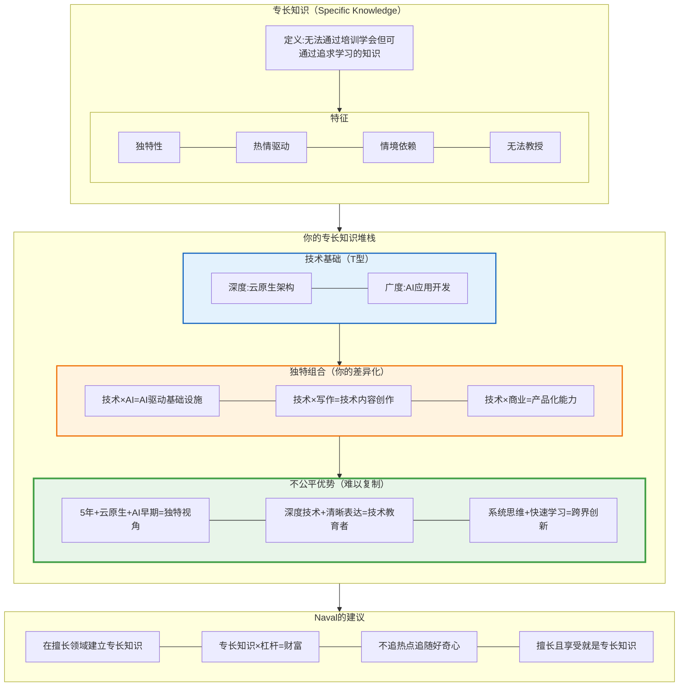

### 4.2 学会销售 + 学会建造 = 无敌

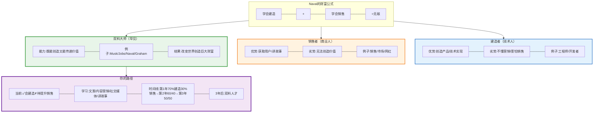

---

## 快车道5大戒律验证

### 5.1 NECST框架：快车道的必要条件

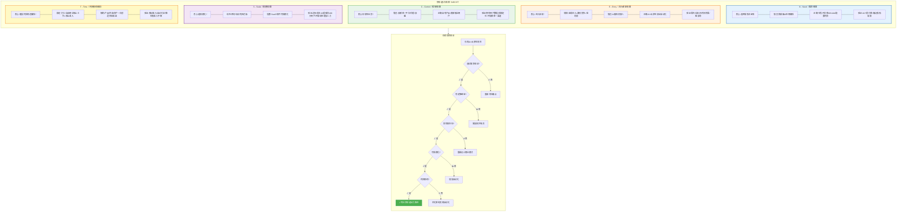

### 5.2 快车道财富方程式

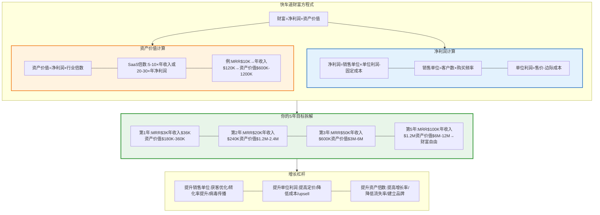

---

## 从打工者到创造者的路径

### 6.1 认知陷阱：《思考，快与慢》的应用

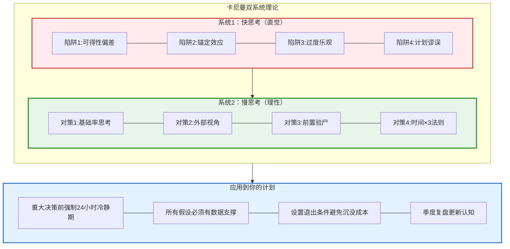

### 6.2 原子习惯：从身份到系统

```mermaid
graph TB
    subgraph AtomicHabits["《原子习惯》三层架构"]
        direction TB

        subgraph Layer1["第1层：身份认同"]
            direction LR
            I1[不是"我要创业"而是"我是创造者"] --- I2[不是"我要学AI"而是"我是AI innovator"] --- I3[不是"我要赚钱"而是"我是价值创造者"] --- IQuote[每个行为都是对身份的投票]
        end

        subgraph Layer2["第2层：系统（非目标）"]
            direction LR
            SY1[目标:赚$100万→系统:每周发布1个功能] --- SY2[目标:10000用户→系统:每日内容营销] --- SY3[目标:财富自由→系统:构建可规模化产品] --- SYQuote[目标会结束系统会持续]
        end

        subgraph Layer3["第3层：微习惯（不可抗拒）"]
            direction LR
            H1[每天早上6:30阅读AI论文20分钟] --- H2[每天晚上8:00编码/写作1小时] --- H3[每周日下午复盘数据2小时] --- H4[每月最后一天战略复盘4小时] --- HQuote[1.01^365=37.8]
        end

        Layer1 --> Layer2
        Layer2 --> Layer3
    end

    subgraph FourLaws["习惯四法则"]
        direction LR
        L1[1.让提示显而易见] --- L2[2.让习惯有吸引力] --- L3[3.让行动轻而易举] --- L4[4.让奖励令人满足]
    end

    AtomicHabits --> FourLaws

    style Layer1 fill:#e3f2fd,stroke:#1565c0,stroke-width:2px
    style Layer2 fill:#fff3e0,stroke:#ef6c00,stroke-width:2px
    style Layer3 fill:#e8f5e9,stroke:#43a047,stroke-width:3px
```

### 6.3 Ray Dalio的原则：极度求真

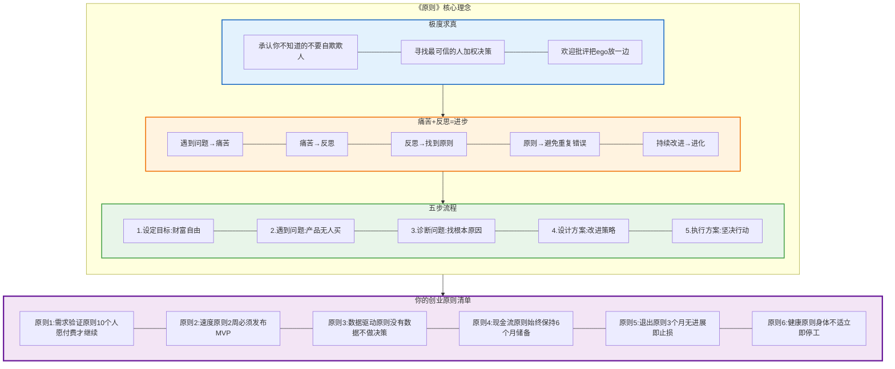

---

## 逆向思维：避免失败的检查清单

### 7.1 芒格式检查清单系统

```mermaid
graph TB
    subgraph ChecklistSystem["决策检查清单系统"]
        direction TB

        subgraph PreLaunch["项目启动前检查清单"]
            direction LR
            PL1[□我是目标用户吗?] --- PL2[□有10人愿预付吗?] --- PL3[□能在2周内做出MVP吗?] --- PL4[□边际成本≈0吗?] --- PL5[□有清晰差异化吗?] --- PL6[□能控制分发渠道吗?] --- PL7[□最坏情况能接受吗?]
        end

        subgraph Monthly["每月检查清单"]
            direction LR
            M1[□MRR增长了吗?] --- M2[□用户留存率>50%吗?] --- M3[□CAC<LTV/3吗?] --- M4[□有用户主动推荐吗?] --- M5[□现金储备>6个月吗?] --- M6[□健康状况良好吗?] --- M7[□还有激情吗?]
        end

        subgraph Quarterly["每季度检查清单"]
            direction LR
            Q1[□方向还正确吗?] --- Q2[□达到季度目标了吗?] --- Q3[□有新竞争对手吗?] --- Q4[□核心假设仍成立吗?] --- Q5[□需要转向吗?] --- Q6[□应该加倍投入还是退出?]
        end
    end

    subgraph FailurePatterns["常见失败模式（避免清单）"]
        direction LR
        F1[❌闭门造车→每周至少5个用户访谈] --- F2[❌完美主义→2周必须发布] --- F3[❌过早优化→有100个付费用户前不优化] --- F4[❌功能过载→只做1个核心功能] --- F5[❌免费策略→第1天就设定价格] --- F6[❌忽视销售→50%时间用于获客] --- F7[❌孤军奋战→加入社群/找导师] --- F8[❌沉没成本→3个月无进展立即止损]
    end

    ChecklistSystem --> FailurePatterns

    style PreLaunch fill:#e3f2fd,stroke:#1565c0,stroke-width:2px
    style Monthly fill:#fff3e0,stroke:#ef6c00,stroke-width:2px
    style Quarterly fill:#e8f5e9,stroke:#43a047,stroke-width:2px
    style FailurePatterns fill:#ffebee,stroke:#c62828,stroke-width:2px
```

### 7.2 反脆弱的项目组合策略

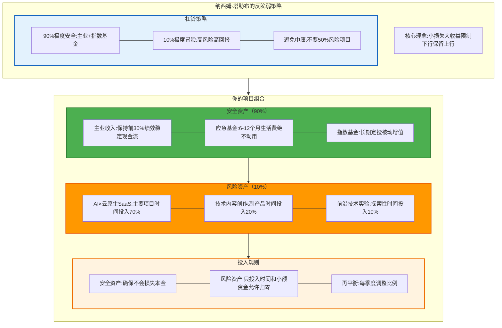

---

## 可执行的90天行动计划

### 8.1 第一个30天：快速验证

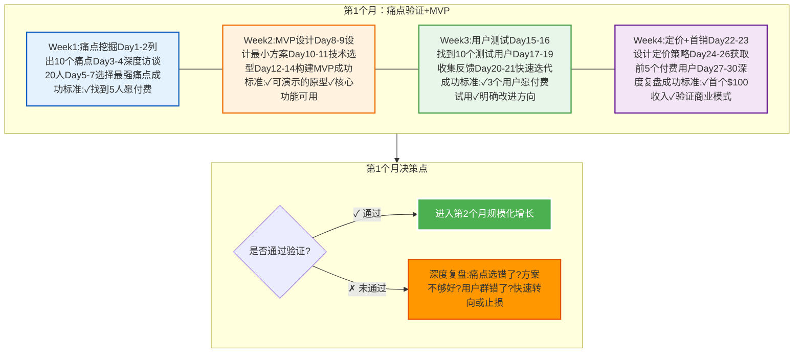

### 8.2 第二个30天：增长引擎

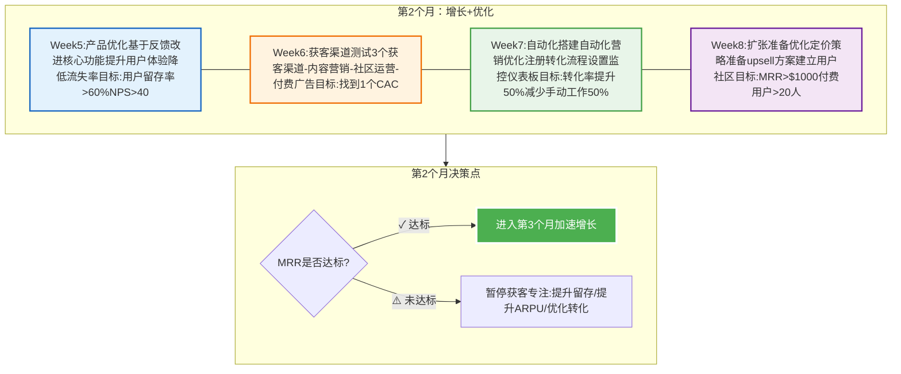

### 8.3 第三个30天：系统化

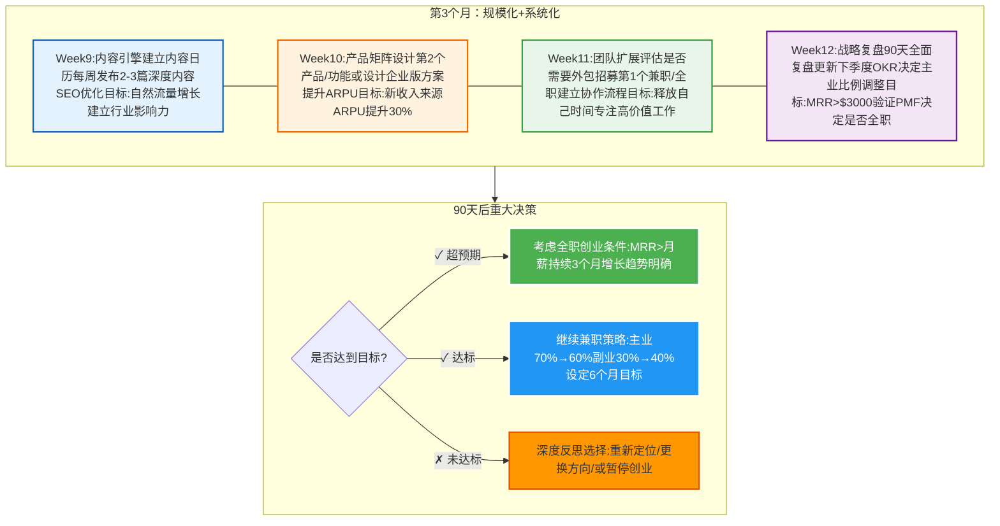

---

## 终极智慧集成

### 9.1 大师们的共识

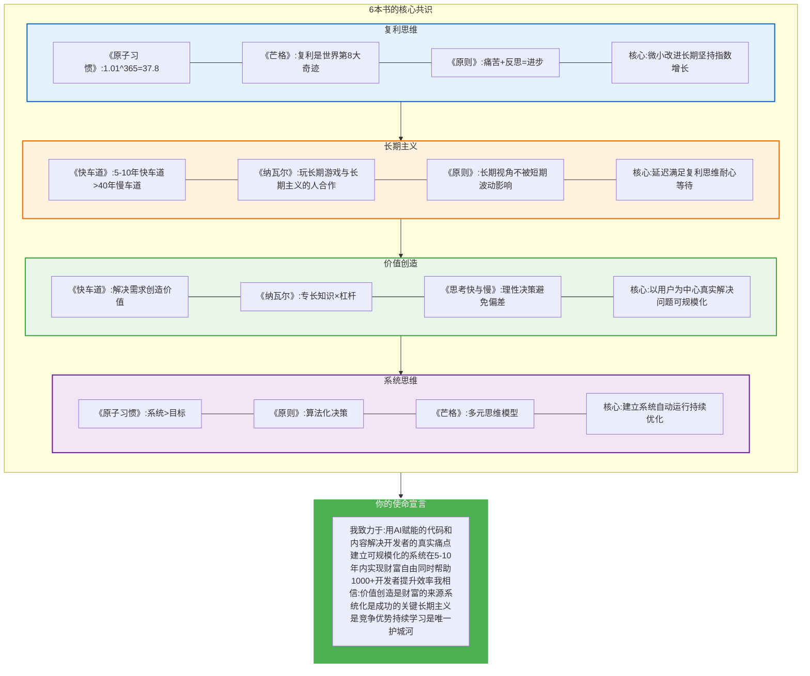

### 9.2 立即行动清单

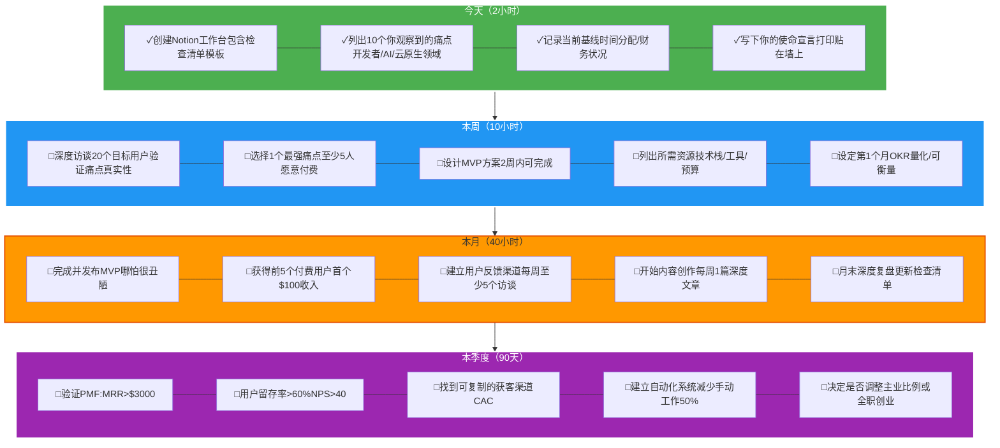

---

## 终极建议

### 10.1 大师们的警告

```mermaid
graph TB
    subgraph Warnings["关键警告"]
        direction LR

        W1[MJ DeMarco:❌不要走慢车道不要用40年青春换退休] --- W2[Naval:❌不要追逐金钱要追逐专长知识和杠杆] --- W3[芒格:❌不要做自己不懂的事待在能力圈内] --- W4[Ray Dalio:❌不要自欺欺人极度求真] --- W5[James Clear:❌不要设定目标而忽略系统系统才会持续] --- W6[Kahneman:❌不要相信直觉启动系统2思考]
    end

    subgraph Advice["关键建议"]
        direction LR

        A1[✓建立快车道系统5-10年财富自由] --- A2[✓用代码+媒体杠杆规模化价值创造] --- A3[✓专注一个领域成为前5%] --- A4[✓每个假设都要验证用数据说话] --- A5[✓建立每日系统1%持续改进] --- A6[✓重大决策前强制24小时冷静]
    end

    Warnings --> Advice

    style Warnings fill:#ffebee,stroke:#c62828,stroke-width:2px
    style Advice fill:#e8f5e9,stroke:#43a047,stroke-width:3px
```

### 10.2 最重要的话

**MJ DeMarco的快车道启示**：
> "慢车道让你在65岁时自由，快车道让你在35岁时自由。区别是40年青春。"

**Naval的财富真相**：
> "不靠运气致富的秘诀：找到你的专长知识，用杠杆放大它，创造可规模化的价值。"

**芒格的智慧**：
> "我只想知道我将来会死在什么地方，这样我就永远不去那里。" （逆向思维）

**Ray Dalio的原则**：
> "痛苦+反思=进步。拥抱痛苦，它是成长的信号。"

**James Clear的系统**：
> "你不会上升到目标的高度，而会下降到系统的水平。"

**Kahneman的警醒**：
> "我们的直觉经常错误，学会不相信第一反应。"

---

## 推荐书单（完整版）

### 必读经典（按阅读顺序）

1. **《思考，快与慢》** - Daniel Kahneman
   - 为什么读：理解你的认知偏差，避免系统1陷阱

2. **《原子习惯》** - James Clear
   - 为什么读：建立每日系统，1%持续改进

3. **《原则》** - Ray Dalio
   - 为什么读：学会极度求真，建立决策原则

4. **《百万富翁快车道》** - MJ DeMarco
   - 为什么读：理解慢车道vs快车道，选择正确的财富路径

5. **《纳瓦尔宝典》** - Eric Jorgenson
   - 为什么读：理解杠杆、专长知识、财富创造

6. **《穷查理宝典》** - 查理·芒格
   - 为什么读：多元思维模型，逆向思维，避免愚蠢

### 补充阅读

7. **《从0到1》** - Peter Thiel
8. **《精益创业》** - Eric Ries
9. **《深度工作》** - Cal Newport
10. **《黑天鹅》** - 纳西姆·塔勒布
11. **《反脆弱》** - 纳西姆·塔勒布
12. **《影响力》** - Robert Cialdini

---

## 最后的话

你的愿景是宏大的，但现在你有了：

✓ **正确的思维模型**（快车道 vs 慢车道）
✓ **强大的杠杆工具**（代码 + 媒体）
✓ **清晰的验证框架**（NECST 5大戒律）
✓ **系统化的习惯**（每日1%改进）
✓ **风险管理策略**（杠铃策略 + 检查清单）
✓ **可执行的90天计划**（立即开始）

记住这些大师的核心智慧：

**不要走慢车道** - 用5-10年而非40年实现自由
**用杠杆放大价值** - 代码和媒体是你的武器
**建立系统而非目标** - 系统会持续，目标会结束
**极度求真** - 每个假设都要验证
**逆向思维** - 避免失败比追求成功更重要
**长期主义** - 与时间做朋友

---

**现在，立即开始你的第一步。**

**今天就列出10个痛点，明天就开始验证。**

**记住：行动治愈一切焦虑。**

**祝你成功！** 🚀
