# API网关与流量管理深度理论知识

> **学习深度**: ⭐⭐⭐⭐
> **文档类型**: 纯理论知识(无代码实践)
> **权威参考**: Kong Gateway、AWS API Gateway、Netflix、Sam Newman

---

## 目录

1. [API网关基础理论](#api网关基础理论)
2. [API网关模式](#api网关模式)
3. [限流与熔断](#限流与熔断)
4. [智能路由](#智能路由)
5. [WebSocket与流式响应](#websocket与流式响应)
6. [API网关架构设计](#api网关架构设计)

---

## API网关基础理论

### 1.1 为什么需要API网关

#### 微服务架构的挑战

**单体应用时代**:
```
客户端 → 单一应用 → 数据库

简单但局限:
• 单点故障
• 难以扩展
• 技术栈锁定
```

**微服务时代**:
```
客户端需要调用多个服务:

移动App → 用户服务 (user-service:8001)
       → 订单服务 (order-service:8002)
       → 支付服务 (payment-service:8003)
       → 库存服务 (inventory-service:8004)
       → 通知服务 (notification-service:8005)

问题爆炸:
❌ 客户端需要知道所有服务地址
❌ 每个服务独立认证(N次认证)
❌ 跨域问题(CORS)
❌ 协议不统一(HTTP/gRPC/WebSocket)
❌ 无法统一监控和日志
❌ 安全暴露(内部服务直接暴露)
```

#### API网关解决方案

**定义**: API网关是微服务架构中的**单一入口点**,封装内部系统架构。

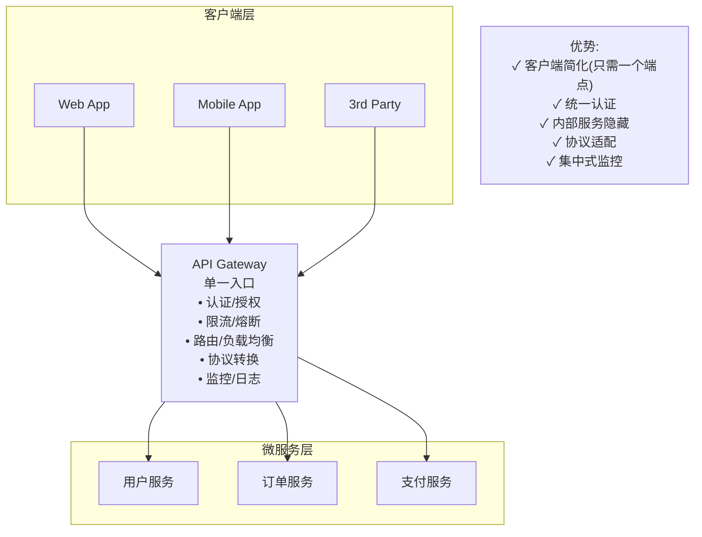
```mermaid
graph TB
    subgraph Clients["客户端层"]
        Web[Web App]
        Mobile[Mobile App]
        Third[3rd Party]
    end

    Gateway["API Gateway<br/>单一入口<br/>• 认证/授权<br/>• 限流/熔断<br/>• 路由/负载均衡<br/>• 协议转换<br/>• 监控/日志"]

    subgraph Services["微服务层"]
        User[用户服务]
        Order[订单服务]
        Payment[支付服务]
    end

    Web --> Gateway
    Mobile --> Gateway
    Third --> Gateway
    Gateway --> User
    Gateway --> Order
    Gateway --> Payment

    Adv["优势:<br/>✓ 客户端简化(只需一个端点)<br/>✓ 统一认证<br/>✓ 内部服务隐藏<br/>✓ 协议适配<br/>✓ 集中式监控"]
```

---

### 1.2 API网关的核心职责

#### 1. 请求路由 (Request Routing)

```
功能: 根据请求路径转发到对应服务

示例:
GET /api/users/123      → 用户服务
GET /api/orders/456     → 订单服务
POST /api/payments      → 支付服务

路由规则:
• 基于路径: /api/users/* → user-service
• 基于方法: GET vs POST
• 基于头部: X-API-Version: v2 → v2-service
• 基于参数: ?region=us → us-cluster
```

#### 2. 认证与授权 (Authentication & Authorization)

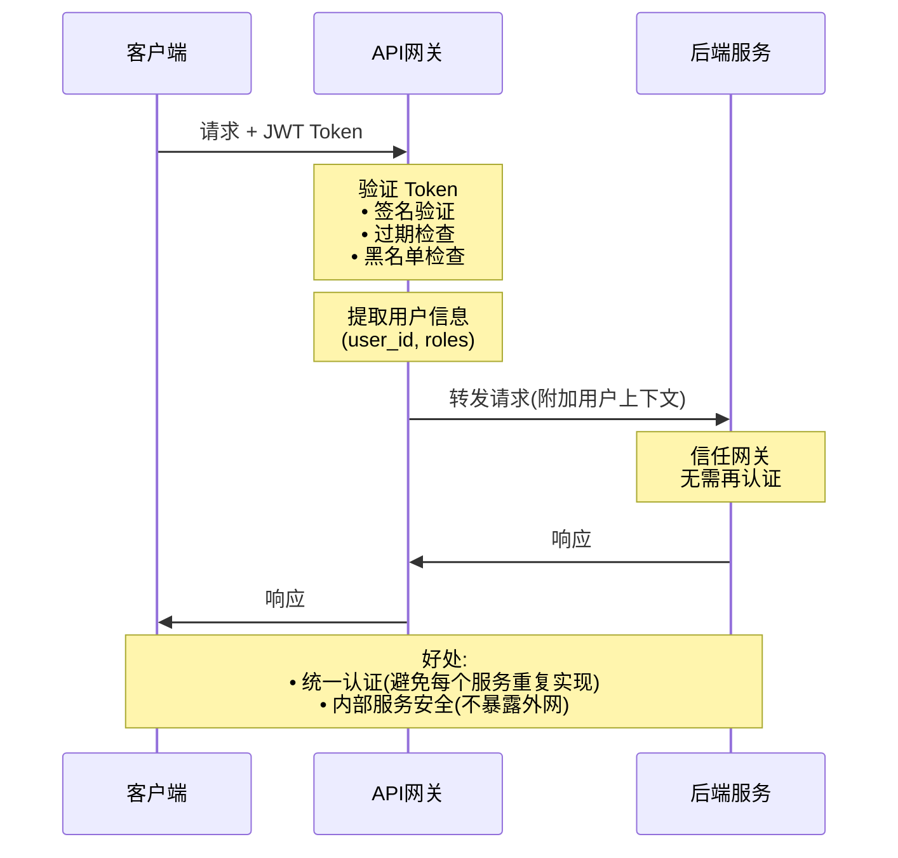
```mermaid
sequenceDiagram
    participant C as 客户端
    participant G as API网关
    participant S as 后端服务

    C->>G: 请求 + JWT Token
    Note over G: 验证 Token<br/>• 签名验证<br/>• 过期检查<br/>• 黑名单检查
    Note over G: 提取用户信息<br/>(user_id, roles)
    G->>S: 转发请求(附加用户上下文)
    Note over S: 信任网关<br/>无需再认证
    S->>G: 响应
    G->>C: 响应

    Note over C,S: 好处:<br/>• 统一认证(避免每个服务重复实现)<br/>• 内部服务安全(不暴露外网)
```

认证 (Authentication): 你是谁?
授权 (Authorization): 你能做什么?

#### 3. 协议转换 (Protocol Translation)

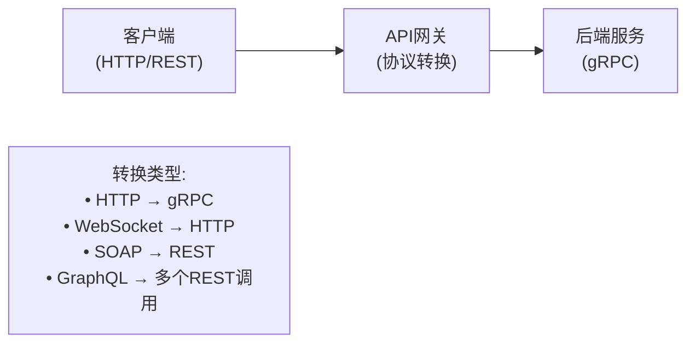
```mermaid
graph LR
    Client["客户端<br/>(HTTP/REST)"]
    Gateway["API网关<br/>(协议转换)"]
    Backend["后端服务<br/>(gRPC)"]

    Client --> Gateway
    Gateway --> Backend

    Note["转换类型:<br/>• HTTP → gRPC<br/>• WebSocket → HTTP<br/>• SOAP → REST<br/>• GraphQL → 多个REST调用"]
```

场景: 客户端和后端使用不同协议

#### 4. 请求聚合 (Request Aggregation)

问题: 客户端需要多个服务的数据

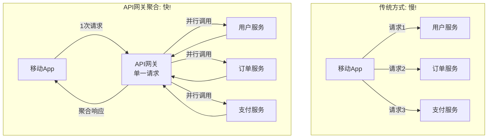
```mermaid
graph TB
    subgraph Traditional["传统方式: 慢!"]
        App1[移动App]
        U1[用户服务]
        O1[订单服务]
        P1[支付服务]

        App1 -->|请求1| U1
        App1 -->|请求2| O1
        App1 -->|请求3| P1
    end

    subgraph Aggregation["API网关聚合: 快!"]
        App2[移动App]
        GW[API网关<br/>单一请求]
        U2[用户服务]
        O2[订单服务]
        P2[支付服务]

        App2 -->|1次请求| GW
        GW -->|并行调用| U2
        GW -->|并行调用| O2
        GW -->|并行调用| P2
        U2 --> GW
        O2 --> GW
        P2 --> GW
        GW -->|聚合响应| App2
    end
```

**GraphQL模式**:
```graphql
query {
  user(id: 123) {
    name
    orders {
      id
      amount
    }
    payments {
      status
    }
  }
}
# → API网关解析查询,调用多个服务,组装结果
```

#### 5. 响应缓存 (Response Caching)

原理: 缓存不常变化的响应

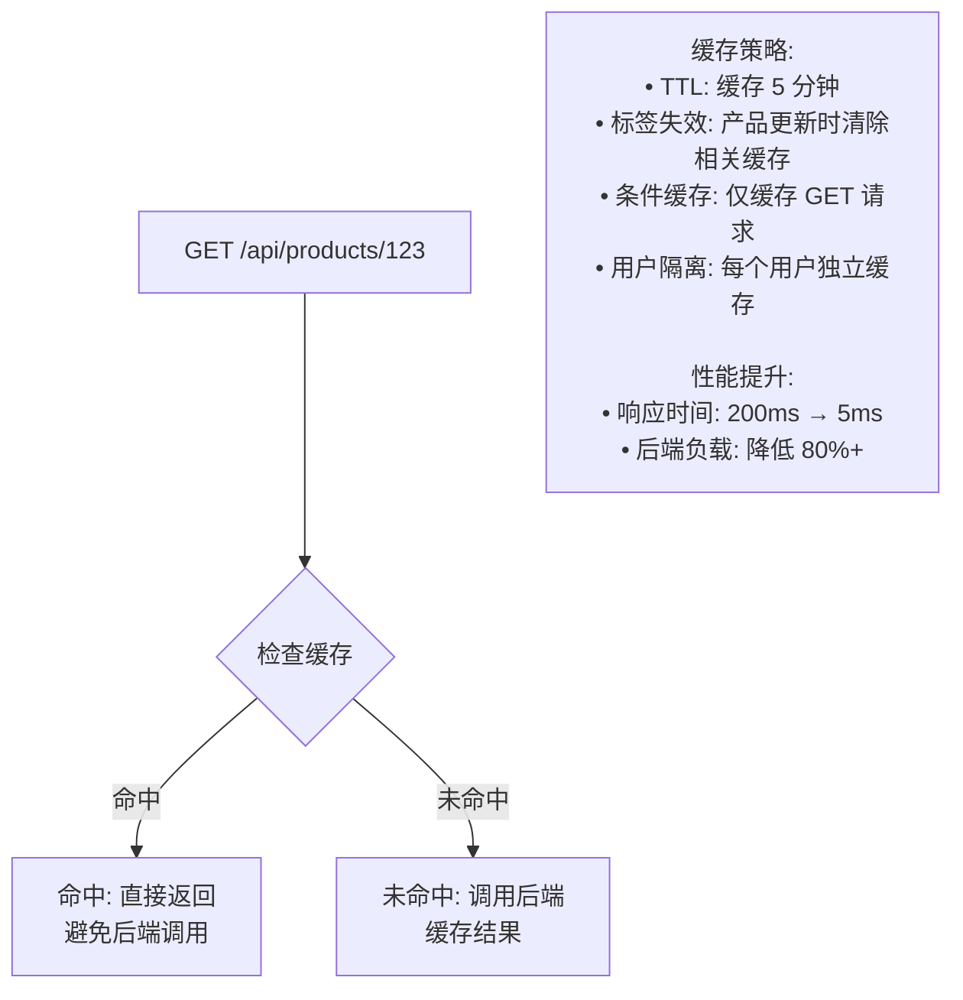
```mermaid
graph TB
    Request[GET /api/products/123]
    Check{检查缓存}
    Hit[命中: 直接返回<br/>避免后端调用]
    Miss[未命中: 调用后端<br/>缓存结果]

    Request --> Check
    Check -->|命中| Hit
    Check -->|未命中| Miss

    Cache["缓存策略:<br/>• TTL: 缓存 5 分钟<br/>• 标签失效: 产品更新时清除相关缓存<br/>• 条件缓存: 仅缓存 GET 请求<br/>• 用户隔离: 每个用户独立缓存<br/><br/>性能提升:<br/>• 响应时间: 200ms → 5ms<br/>• 后端负载: 降低 80%+"]
```

#### 6. 流量管理 (Traffic Management)

```
功能:
• 限流 (Rate Limiting): 防止过载
• 熔断 (Circuit Breaking): 故障隔离
• 负载均衡 (Load Balancing): 流量分发
• 重试 (Retry): 容错
• 超时 (Timeout): 防止长时间阻塞
```

---

### 1.3 API网关 vs 反向代理 vs 服务网格

| 维度 | 反向代理 (Nginx) | API网关 (Kong) | 服务网格 (Istio) |
|-----|-----------------|---------------|-----------------|
| **层次** | L4/L7 负载均衡 | L7 应用层 | L4-L7 全栈 |
| **认证** | 基础 (Basic Auth) | 高级 (OAuth/JWT) | 支持 (通过插件) |
| **路由** | 简单路径匹配 | 复杂规则 (头部/参数/权重) | 动态服务发现 |
| **限流** | 简单 (请求/秒) | 高级 (用户/API/配额) | 分布式限流 |
| **可观测性** | 日志 | 日志+指标 | 全链路追踪 |
| **部署位置** | 边缘 | 边缘 | Sidecar (每服务) |
| **适用场景** | 简单代理 | 微服务API管理 | 服务间通信 |

**架构对比**:

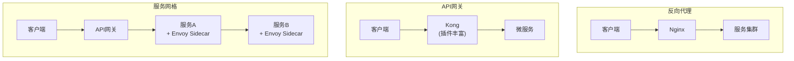
```mermaid
graph TB
    subgraph Proxy["反向代理"]
        C1[客户端] --> N[Nginx] --> SC[服务集群]
    end

    subgraph Gateway["API网关"]
        C2[客户端] --> K["Kong<br/>(插件丰富)"] --> MS[微服务]
    end

    subgraph Mesh["服务网格"]
        C3[客户端] --> AG[API网关]
        AG --> SA["服务A<br/>+ Envoy Sidecar"]
        SA --> SB["服务B<br/>+ Envoy Sidecar"]
    end
```

---

## API网关模式

### 2.1 单一API网关模式 (Single Gateway)

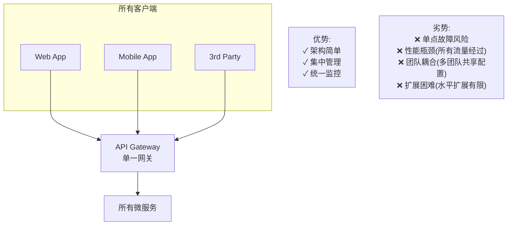
```mermaid
graph TB
    subgraph Clients["所有客户端"]
        Web[Web App]
        Mobile[Mobile App]
        Third[3rd Party]
    end

    Gateway[API Gateway<br/>单一网关]
    Services[所有微服务]

    Web --> Gateway
    Mobile --> Gateway
    Third --> Gateway
    Gateway --> Services

    Pros["优势:<br/>✓ 架构简单<br/>✓ 集中管理<br/>✓ 统一监控"]
    Cons["劣势:<br/>❌ 单点故障风险<br/>❌ 性能瓶颈(所有流量经过)<br/>❌ 团队耦合(多团队共享配置)<br/>❌ 扩展困难(水平扩展有限)"]
```

**适用场景**:
- 小规模应用 (< 10 个微服务)
- 单一团队
- 流量可控 (< 10K RPS)

---

### 2.2 BFF模式 (Backend For Frontend)

#### 核心思想

**问题**: 不同客户端需求差异大

```
Web端:
  • 需要完整数据
  • 大屏幕,可展示详细信息
  • 高带宽

移动端:
  • 需要精简数据(省流量)
  • 小屏幕,简化界面
  • 弱网络环境

IoT设备:
  • 极简数据
  • 低功耗
  • 间歇性连接
```

**解决方案**: 为每种客户端定制专属API网关

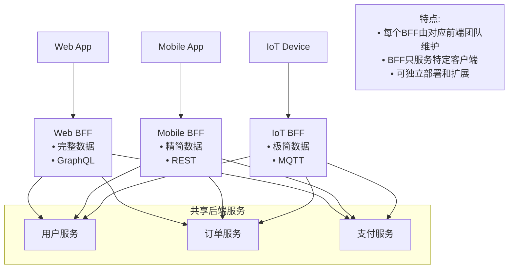
```mermaid
graph TB
    Web[Web App]
    Mobile[Mobile App]
    IoT[IoT Device]

    WebBFF["Web BFF<br/>• 完整数据<br/>• GraphQL"]
    MobileBFF["Mobile BFF<br/>• 精简数据<br/>• REST"]
    IoTBFF["IoT BFF<br/>• 极简数据<br/>• MQTT"]

    subgraph Backend["共享后端服务"]
        User[用户服务]
        Order[订单服务]
        Payment[支付服务]
    end

    Web --> WebBFF
    Mobile --> MobileBFF
    IoT --> IoTBFF

    WebBFF --> User
    WebBFF --> Order
    WebBFF --> Payment

    MobileBFF --> User
    MobileBFF --> Order
    MobileBFF --> Payment

    IoTBFF --> User
    IoTBFF --> Order
    IoTBFF --> Payment

    Note["特点:<br/>• 每个BFF由对应前端团队维护<br/>• BFF只服务特定客户端<br/>• 可独立部署和扩展"]
```

#### BFF 优势与劣势

**优势**:
```
✓ 客户端定制化:
  • Web BFF 返回完整HTML友好数据
  • Mobile BFF 压缩数据,减少字段

✓ 团队自治:
  • 移动团队控制 Mobile BFF
  • 无需等待后端团队

✓ 协议灵活:
  • Web BFF 使用 GraphQL
  • IoT BFF 使用 MQTT

✓ 独立演进:
  • 移动端新版本不影响Web端
```

**劣势**:
```
❌ 重复逻辑:
  • 多个BFF可能重复实现相同功能(如认证)

❌ 维护成本:
  • N个客户端 = N个BFF

❌ 数据不一致风险:
  • 不同BFF可能返回不同的业务规则

解决方案:
• 共享库: 认证、限流等通用逻辑抽象为库
• 后端聚合: 复杂业务逻辑下沉到后端服务
```

---

### 2.3 微网关模式 (Micro Gateway)

思想: 每个服务有自己的网关

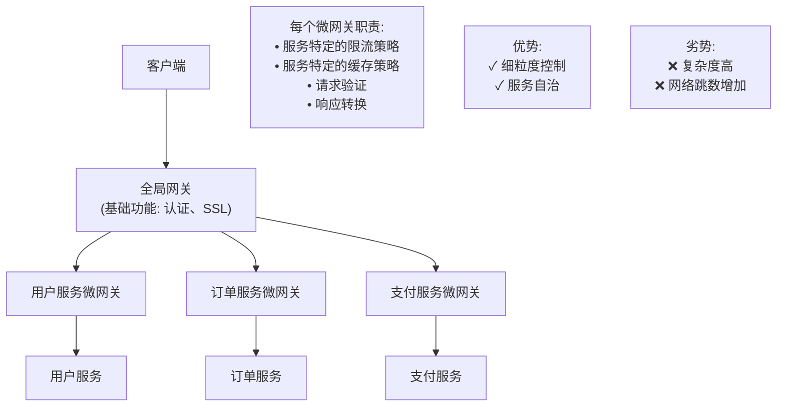
```mermaid
graph TB
    Client[客户端]
    Global["全局网关<br/>(基础功能: 认证、SSL)"]

    UMG[用户服务微网关]
    OMG[订单服务微网关]
    PMG[支付服务微网关]

    US[用户服务]
    OS[订单服务]
    PS[支付服务]

    Client --> Global
    Global --> UMG
    Global --> OMG
    Global --> PMG

    UMG --> US
    OMG --> OS
    PMG --> PS

    Resp["每个微网关职责:<br/>• 服务特定的限流策略<br/>• 服务特定的缓存策略<br/>• 请求验证<br/>• 响应转换"]

    Pros["优势:<br/>✓ 细粒度控制<br/>✓ 服务自治"]
    Cons["劣势:<br/>❌ 复杂度高<br/>❌ 网络跳数增加"]
```

---

### 2.4 网关分层模式 (Layered Gateway)

多层网关架构:

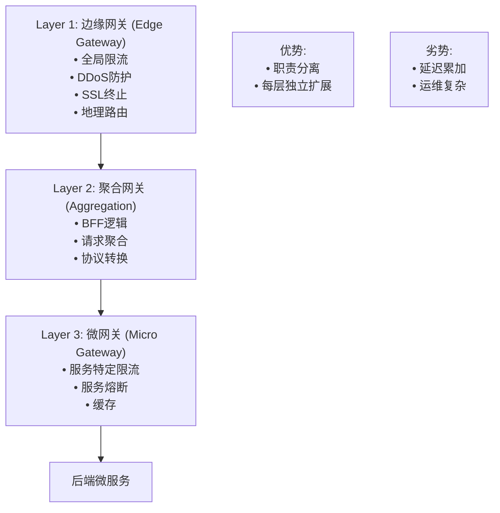
```mermaid
graph TB
    L1["Layer 1: 边缘网关 (Edge Gateway)<br/>• 全局限流<br/>• DDoS防护<br/>• SSL终止<br/>• 地理路由"]

    L2["Layer 2: 聚合网关 (Aggregation)<br/>• BFF逻辑<br/>• 请求聚合<br/>• 协议转换"]

    L3["Layer 3: 微网关 (Micro Gateway)<br/>• 服务特定限流<br/>• 服务熔断<br/>• 缓存"]

    Services[后端微服务]

    L1 --> L2 --> L3 --> Services

    Pros["优势:<br/>• 职责分离<br/>• 每层独立扩展"]
    Cons["劣势:<br/>• 延迟累加<br/>• 运维复杂"]
```

---

### 2.5 网关模式选型

| 模式 | 复杂度 | 延迟 | 灵活性 | 适用场景 |
|-----|-------|------|-------|---------|
| **单一网关** | 低 | 低 | 低 | 小型应用、MVP |
| **BFF** | 中 | 中 | 高 | 多客户端、不同需求 |
| **微网关** | 高 | 高 | 极高 | 大规模、服务自治 |
| **分层网关** | 极高 | 高 | 极高 | 企业级、复杂安全需求 |

**决策树**:

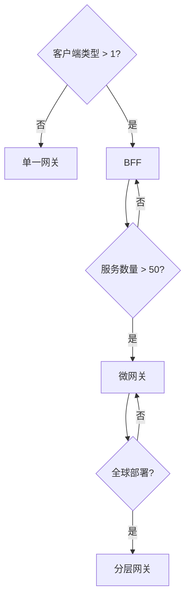
```mermaid
graph TB
    Start{客户端类型 > 1?}
    Q2{服务数量 > 50?}
    Q3{全球部署?}

    Single[单一网关]
    BFF[BFF]
    Micro[微网关]
    Layered[分层网关]

    Start -->|否| Single
    Start -->|是| BFF
    BFF --> Q2
    Q2 -->|否| BFF
    Q2 -->|是| Micro
    Micro --> Q3
    Q3 -->|否| Micro
    Q3 -->|是| Layered
```

---

## 限流与熔断

### 3.1 限流原理 (Rate Limiting)

#### 为什么需要限流

```
问题场景:
• 恶意攻击: 爬虫、DDoS
• 流量突发: 营销活动、热点事件
• 资源保护: 防止数据库过载
• 公平性: 防止单用户占用过多资源

后果:
❌ 服务过载 → 响应慢 → 更多请求积压 → 雪崩
```

---

### 3.2 限流算法

#### 1. 固定窗口计数器 (Fixed Window Counter)

原理: 每个时间窗口内限制请求数量

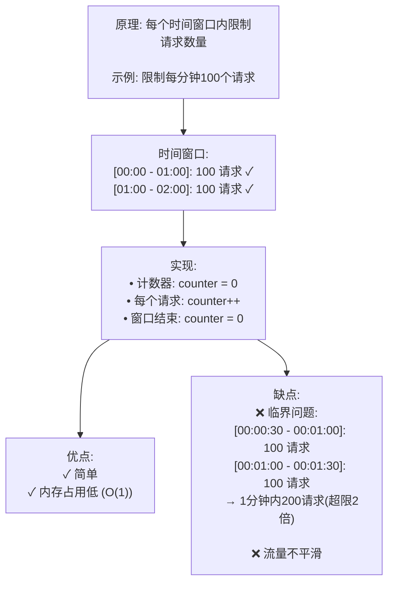
```mermaid
graph TB
    Principle["原理: 每个时间窗口内限制请求数量<br/><br/>示例: 限制每分钟100个请求"]

    Window["时间窗口:<br/>[00:00 - 01:00]: 100 请求 ✓<br/>[01:00 - 02:00]: 100 请求 ✓"]

    Impl["实现:<br/>• 计数器: counter = 0<br/>• 每个请求: counter++<br/>• 窗口结束: counter = 0"]

    Pros["优点:<br/>✓ 简单<br/>✓ 内存占用低 (O(1))"]

    Cons["缺点:<br/>❌ 临界问题:<br/>   [00:00:30 - 00:01:00]: 100 请求<br/>   [00:01:00 - 00:01:30]: 100 请求<br/>   → 1分钟内200请求(超限2倍)<br/><br/>❌ 流量不平滑"]

    Principle --> Window --> Impl
    Impl --> Pros
    Impl --> Cons
```

#### 2. 滑动窗口计数器 (Sliding Window Counter)

原理: 窗口随时间滑动

```
实现:
• 将窗口分为多个小格子
• 每个格子记录请求数
• 计算当前时间往前N秒的请求总数

示例: 限制每分钟100请求,分6个格子(每格10秒)

时间: 00:00:35
窗口: [23:59:35 - 00:00:35]
格子: [35-45s][45-55s][55-05s][05-15s][15-25s][25-35s]
请求:   10      15      20      25      15      10  = 95 ✓

时间: 00:00:36
窗口滑动 1 秒...

优点:
✓ 解决临界问题
✓ 流量平滑

缺点:
❌ 内存占用增加 (O(n))
❌ 实现复杂
```

#### 3. 漏桶算法 (Leaky Bucket)

原理: 请求像水滴入桶,以恒定速率流出

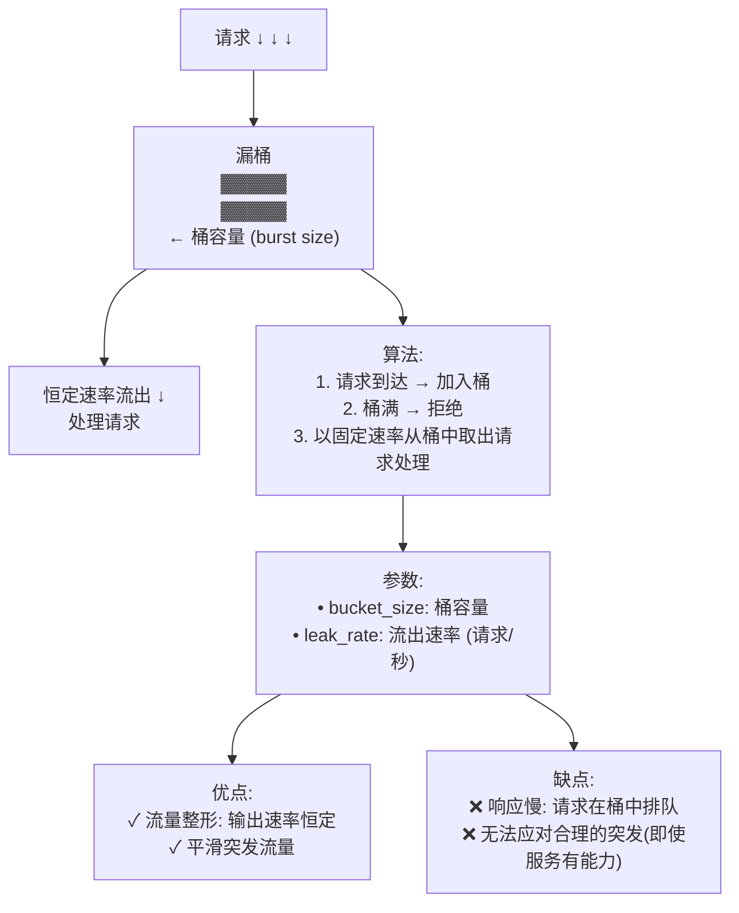
```mermaid
graph TB
    Requests["请求 ↓ ↓ ↓"]
    Bucket["漏桶<br/>▓▓▓▓▓<br/>▓▓▓▓▓<br/>← 桶容量 (burst size)"]
    Process["恒定速率流出 ↓<br/>处理请求"]

    Requests --> Bucket --> Process

    Algorithm["算法:<br/>1. 请求到达 → 加入桶<br/>2. 桶满 → 拒绝<br/>3. 以固定速率从桶中取出请求处理"]

    Params["参数:<br/>• bucket_size: 桶容量<br/>• leak_rate: 流出速率 (请求/秒)"]

    Pros["优点:<br/>✓ 流量整形: 输出速率恒定<br/>✓ 平滑突发流量"]

    Cons["缺点:<br/>❌ 响应慢: 请求在桶中排队<br/>❌ 无法应对合理的突发(即使服务有能力)"]

    Bucket --> Algorithm
    Algorithm --> Params
    Params --> Pros
    Params --> Cons
```

#### 4. 令牌桶算法 (Token Bucket)

原理: 以恒定速率生成令牌,请求消耗令牌

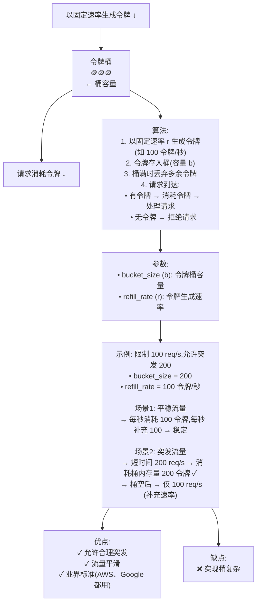
```mermaid
graph TB
    Generate["以固定速率生成令牌 ↓"]
    Bucket["令牌桶<br/>🪙🪙🪙<br/>← 桶容量"]
    Consume["请求消耗令牌 ↓"]

    Generate --> Bucket --> Consume

    Algorithm["算法:<br/>1. 以固定速率 r 生成令牌(如 100 令牌/秒)<br/>2. 令牌存入桶(容量 b)<br/>3. 桶满时丢弃多余令牌<br/>4. 请求到达:<br/>   • 有令牌 → 消耗令牌 → 处理请求<br/>   • 无令牌 → 拒绝请求"]

    Params["参数:<br/>• bucket_size (b): 令牌桶容量<br/>• refill_rate (r): 令牌生成速率"]

    Example["示例: 限制 100 req/s,允许突发 200<br/>• bucket_size = 200<br/>• refill_rate = 100 令牌/秒<br/><br/>场景1: 平稳流量<br/>  → 每秒消耗 100 令牌,每秒补充 100 → 稳定<br/><br/>场景2: 突发流量<br/>  → 短时间 200 req/s → 消耗桶内存量 200 令牌 ✓<br/>  → 桶空后 → 仅 100 req/s (补充速率)"]

    Pros["优点:<br/>✓ 允许合理突发<br/>✓ 流量平滑<br/>✓ 业界标准(AWS、Google 都用)"]

    Cons["缺点:<br/>❌ 实现稍复杂"]

    Bucket --> Algorithm
    Algorithm --> Params
    Params --> Example
    Example --> Pros
    Example --> Cons
```

#### 限流算法对比

| 算法 | 突发流量 | 流量平滑 | 实现复杂度 | 内存占用 | 推荐指数 |
|-----|---------|---------|-----------|---------|---------|
| **固定窗口** | 无限制(临界问题) | 差 | 低 | O(1) | ⭐⭐ |
| **滑动窗口** | 限制 | 好 | 中 | O(n) | ⭐⭐⭐⭐ |
| **漏桶** | 完全禁止 | 极好 | 中 | O(1) | ⭐⭐⭐ |
| **令牌桶** | 允许合理突发 | 好 | 中 | O(1) | ⭐⭐⭐⭐⭐ |

**推荐**: 令牌桶(AWS API Gateway、Kong 默认)

---

### 3.3 限流维度

#### 1. 全局限流 (Global Rate Limit)

```
限制: 整个API网关的总流量

示例: 10,000 req/s

场景: 保护后端总体资源
```

#### 2. 用户级限流 (User-level)

```
限制: 每个用户的请求频率

示例: 每用户 100 req/min

实现:
• 键: user_id
• 值: 令牌桶

场景: 防止单用户滥用
```

#### 3. API级限流 (API-level)

```
限制: 每个API端点的频率

示例:
• /api/search: 10 req/s (昂贵查询)
• /api/users: 100 req/s (简单查询)

场景: 保护特定资源
```

#### 4. 组合限流

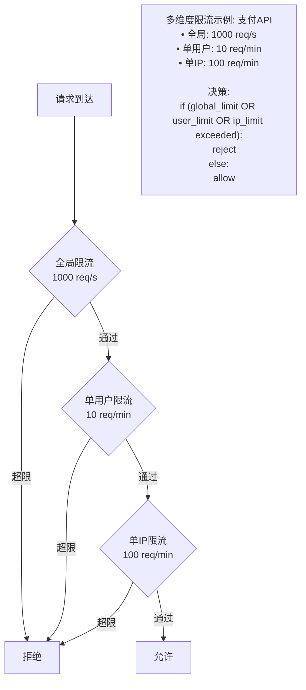
```mermaid
graph TB
    Request[请求到达]
    Global{全局限流<br/>1000 req/s}
    User{单用户限流<br/>10 req/min}
    IP{单IP限流<br/>100 req/min}
    Reject[拒绝]
    Allow[允许]

    Request --> Global
    Global -->|超限| Reject
    Global -->|通过| User
    User -->|超限| Reject
    User -->|通过| IP
    IP -->|超限| Reject
    IP -->|通过| Allow

    Note["多维度限流示例: 支付API<br/>• 全局: 1000 req/s<br/>• 单用户: 10 req/min<br/>• 单IP: 100 req/min<br/><br/>决策:<br/>if (global_limit OR user_limit OR ip_limit exceeded):<br/>    reject<br/>else:<br/>    allow"]
```

---

### 3.4 分布式限流

#### 问题

```
单机限流局限:

场景: 3个API网关实例
限制: 每用户 100 req/min

单机限流:
• 网关1: 用户A 100 req/min ✓
• 网关2: 用户A 100 req/min ✓
• 网关3: 用户A 100 req/min ✓
→ 总计 300 req/min ❌ (超限3倍)
```

#### 解决方案

**1. 集中式限流 (Centralized)**:

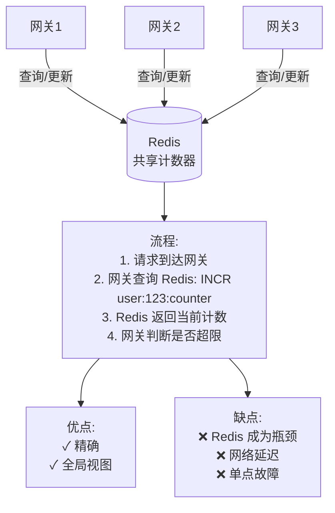
```mermaid
graph TB
    G1[网关1]
    G2[网关2]
    G3[网关3]
    Redis[(Redis<br/>共享计数器)]

    G1 -->|查询/更新| Redis
    G2 -->|查询/更新| Redis
    G3 -->|查询/更新| Redis

    Flow["流程:<br/>1. 请求到达网关<br/>2. 网关查询 Redis: INCR user:123:counter<br/>3. Redis 返回当前计数<br/>4. 网关判断是否超限"]

    Pros["优点:<br/>✓ 精确<br/>✓ 全局视图"]

    Cons["缺点:<br/>❌ Redis 成为瓶颈<br/>❌ 网络延迟<br/>❌ 单点故障"]

    Redis --> Flow
    Flow --> Pros
    Flow --> Cons
```

**2. 分布式令牌桶**:
```
改进: 每个网关本地令牌桶,定期同步

算法:
1. 全局限制 1000 req/s
2. 3个网关,每个分配 333 req/s
3. 定期(如每秒)重新分配配额

优点:
✓ 本地判断,低延迟
✓ Redis 负载低

缺点:
❌ 不完全精确(可能超限 10-20%)
```

**3. Gossip 协议同步**:
```
思想: 网关间互相同步状态

流程:
1. 网关1 处理请求 → 本地计数
2. 定期与其他网关交换计数信息
3. 收敛到一致状态

优点:
✓ 去中心化
✓ 容错

缺点:
❌ 延迟高
❌ 实现复杂
```

---

### 3.5 熔断器原理 (Circuit Breaker)

#### 为什么需要熔断

问题: 级联故障

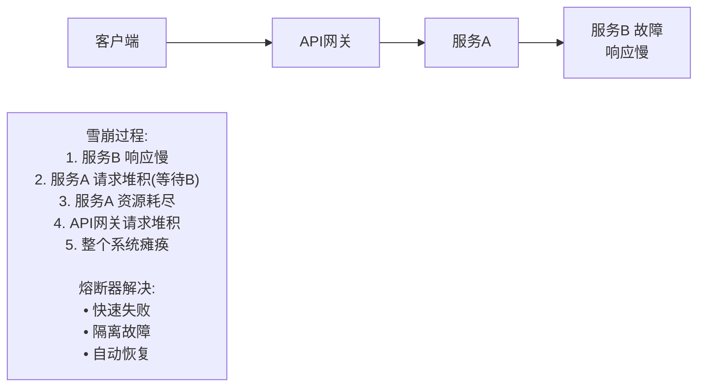
```mermaid
graph LR
    Client[客户端]
    Gateway[API网关]
    SA[服务A]
    SB[服务B 故障<br/>响应慢]

    Client --> Gateway
    Gateway --> SA
    SA --> SB

    Cascade["雪崩过程:<br/>1. 服务B 响应慢<br/>2. 服务A 请求堆积(等待B)<br/>3. 服务A 资源耗尽<br/>4. API网关请求堆积<br/>5. 整个系统瘫痪<br/><br/>熔断器解决:<br/>• 快速失败<br/>• 隔离故障<br/>• 自动恢复"]
```

#### 熔断器状态机

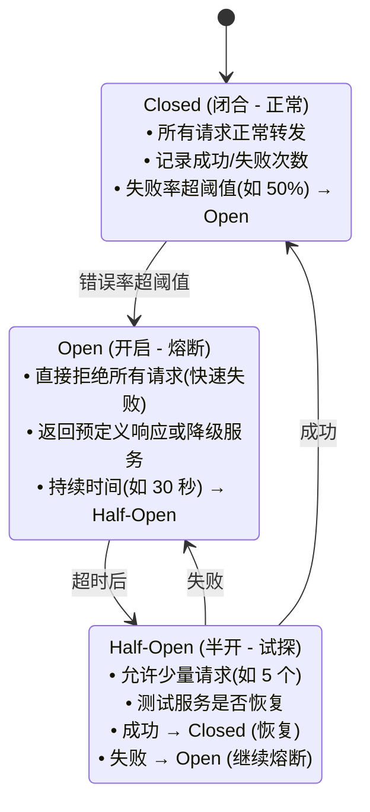
```mermaid
stateDiagram-v2
    [*] --> Closed
    Closed --> Open: 错误率超阈值
    Open --> HalfOpen: 超时后
    HalfOpen --> Closed: 成功
    HalfOpen --> Open: 失败

    Closed: Closed (闭合 - 正常)<br/>• 所有请求正常转发<br/>• 记录成功/失败次数<br/>• 失败率超阈值(如 50%) → Open

    Open: Open (开启 - 熔断)<br/>• 直接拒绝所有请求(快速失败)<br/>• 返回预定义响应或降级服务<br/>• 持续时间(如 30 秒) → Half-Open

    HalfOpen: Half-Open (半开 - 试探)<br/>• 允许少量请求(如 5 个)<br/>• 测试服务是否恢复<br/>• 成功 → Closed (恢复)<br/>• 失败 → Open (继续熔断)
```

#### 熔断参数

```
关键参数:

1. 失败阈值 (Failure Threshold):
   • 错误率 > 50% → 熔断
   • 或: 连续失败 10 次 → 熔断

2. 时间窗口 (Time Window):
   • 统计窗口: 最近 10 秒
   • 熔断时长: 30 秒

3. 半开请求数 (Half-Open Requests):
   • 试探请求数: 5 个

4. 成功阈值 (Success Threshold):
   • 半开状态下成功 3/5 → Closed

示例配置:
failure_rate: 50%
window_size: 10s
open_duration: 30s
half_open_requests: 5
success_threshold: 60%
```

---

### 3.6 熔断 vs 限流 vs 降级

| 维度 | 限流 (Rate Limiting) | 熔断 (Circuit Breaking) | 降级 (Fallback) |
|-----|---------------------|------------------------|----------------|
| **目的** | 保护服务不过载 | 快速失败,隔离故障 | 保证核心功能 |
| **触发条件** | 请求频率过高 | 错误率过高 | 依赖服务不可用 |
| **响应** | 拒绝请求 (429) | 快速失败 (503) | 返回降级数据 |
| **恢复** | 窗口结束 | 自动试探 | 依赖恢复 |
| **示例** | 每秒最多 100 请求 | 错误率 > 50% 停止调用 | 返回缓存数据 |

**组合使用**:

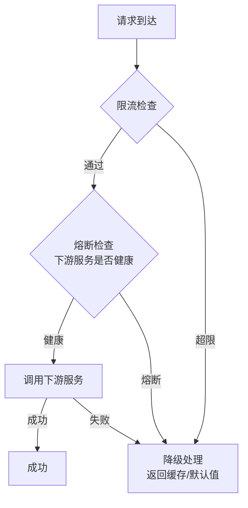
```mermaid
graph TB
    Request[请求到达]
    RateLimit{限流检查}
    Circuit{熔断检查<br/>下游服务是否健康}
    Call[调用下游服务]
    Fallback[降级处理<br/>返回缓存/默认值]
    Success[成功]

    Request --> RateLimit
    RateLimit -->|通过| Circuit
    RateLimit -->|超限| Fallback
    Circuit -->|健康| Call
    Circuit -->|熔断| Fallback
    Call -->|成功| Success
    Call -->|失败| Fallback
```

---

## 智能路由

### 4.1 负载均衡算法

#### 1. 轮询 (Round Robin)

原理: 依次分配请求

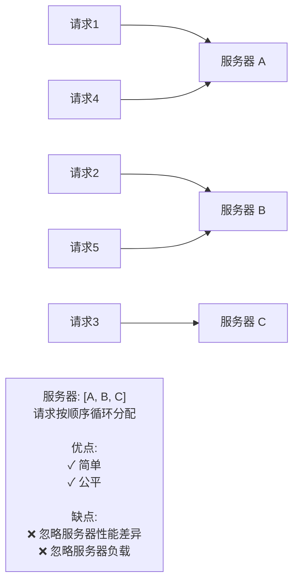
```mermaid
graph LR
    Req1[请求1] --> A[服务器 A]
    Req2[请求2] --> B[服务器 B]
    Req3[请求3] --> C[服务器 C]
    Req4[请求4] --> A
    Req5[请求5] --> B

    Note["服务器: [A, B, C]<br/>请求按顺序循环分配<br/><br/>优点:<br/>✓ 简单<br/>✓ 公平<br/><br/>缺点:<br/>❌ 忽略服务器性能差异<br/>❌ 忽略服务器负载"]
```

#### 2. 加权轮询 (Weighted Round Robin)

原理: 根据权重分配

```
示例:
服务器: A(权重3), B(权重2), C(权重1)
请求分配: A, A, A, B, B, C (循环)

应用:
• 新服务器预热: 权重从低到高
• 异构服务器: 性能强的权重高
```

#### 3. 最少连接 (Least Connections)

```mermaid
graph TB
    Request[新请求]
    Check{选择连接数最少的服务器}
    A["服务器 A<br/>5 连接"]
    B["服务器 B<br/>3 连接 ← 最少"]
    C["服务器 C<br/>7 连接"]

    Request --> Check
    Check --> B

    Pros["优点:<br/>✓ 动态均衡<br/>✓ 适应长连接"]

    Cons["缺点:<br/>❌ 需要维护连接数<br/>❌ 不考虑请求处理时间"]

    Check --> Pros
    Check --> Cons
```

#### 4. 最快响应 (Least Response Time)

原理: 选择响应时间最短的服务器

```
实现:
1. 记录每个服务器的平均响应时间
2. 选择最快的

示例:
服务器: A(50ms), B(200ms), C(30ms)
新请求 → C

优点:
✓ 用户体验最佳
✓ 自适应性能

缺点:
❌ 需要持续测量
❌ 响应时间波动大
```

#### 5. 一致性哈希 (Consistent Hashing)

```mermaid
graph TB
    User[用户请求]
    Hash{hash(user_id) % 3}
    A[服务器 A]
    B[服务器 B]
    C[服务器 C]

    User --> Hash
    Hash -->|0| A
    Hash -->|1| B
    Hash -->|2| C

    Purpose["用途: 保证同一用户请求路由到同一服务器"]

    Pros["优点:<br/>✓ 会话亲和性<br/>✓ 缓存命中率高"]

    Cons["缺点:<br/>❌ 负载可能不均<br/>❌ 服务器变化影响大<br/><br/>改进: 虚拟节点<br/>• 每个物理服务器对应多个虚拟节点<br/>• 减少服务器变化影响"]

    Hash --> Purpose
    Purpose --> Pros
    Purpose --> Cons
```

---

### 4.2 基于内容的路由 (Content-Based Routing)

#### 路由规则类型

**1. 基于路径 (Path-based)**:
```
规则:
/api/v1/*     → 服务 v1
/api/v2/*     → 服务 v2
/api/admin/*  → 管理服务
```

**2. 基于头部 (Header-based)**:
```
规则:
X-API-Version: v1  → 服务 v1
X-API-Version: v2  → 服务 v2
X-Region: US       → 美国集群
X-Region: EU       → 欧洲集群
```

**3. 基于参数 (Query-based)**:
```
规则:
?version=beta  → Beta 环境
?region=asia   → 亚洲服务器
```

**4. 基于权重 (Weight-based)**:

```mermaid
graph TB
    Traffic[100% 流量]
    V1["旧版本<br/>90% 流量"]
    V2["新版本<br/>10% 流量"]

    Traffic -->|90%| V1
    Traffic -->|10%| V2

    Config["灰度发布配置:<br/>upstream v1 weight=90;<br/>upstream v2 weight=10;"]
```

**5. 基于用户 (User-based)**:
```
规则:
if user_id in [beta_users]:
    route to v2
else:
    route to v1

应用: 内测、VIP 用户
```

---

### 4.3 金丝雀发布 (Canary Deployment)

#### 原理

目标: 渐进式发布,降低风险

```mermaid
graph TB
    Start[开始部署新版本]
    Deploy5["部署到 5% 服务器<br/>(金丝雀)"]
    Monitor["观察指标<br/>• 错误率<br/>• 延迟<br/>• 吞吐量<br/>• 业务指标(转化率)"]
    Check{指标正常?}
    Increase["增加流量<br/>5% → 25% → 50% → 100%"]
    Rollback[回滚]
    Complete[部署完成]

    Start --> Deploy5
    Deploy5 --> Monitor
    Monitor --> Check
    Check -->|是| Increase
    Check -->|否| Rollback
    Increase --> Monitor
    Increase --> Complete

    Traffic["流量分配:<br/>┌──────────────────────────────────┐<br/>│  100% 流量                        │<br/>├──────────────────────────────────┤<br/>│  5%  → v2 (金丝雀)                │<br/>│  95% → v1 (稳定版)                │<br/>└──────────────────────────────────┘"]

    Decision["决策:<br/>if (v2_error_rate < v1_error_rate + 1%):<br/>    增加流量到 v2<br/>else:<br/>    回滚"]
```

#### 金丝雀策略

**策略1: 基于用户**
```
• 内部员工先使用 v2
• Beta 用户群
• 地理区域(先上美国西部)
```

**策略2: 基于流量**
```
• 流量镜像: v2 不处理请求,仅记录日志
• 影子流量: 复制流量到 v2,不返回响应
```

---

### 4.4 A/B 测试路由

目标: 测试不同版本的效果

```mermaid
graph TB
    User[用户]
    Hash{hash(user_id) % 2}
    AlgoA[算法A]
    AlgoB[算法B]
    Collect[数据收集]
    Analysis["分析结果:<br/>• 算法A: 点击率 15%<br/>• 算法B: 点击率 18%<br/>→ 选择算法B"]

    User --> Hash
    Hash -->|0| AlgoA
    Hash -->|1| AlgoB
    AlgoA --> Collect
    AlgoB --> Collect
    Collect --> Analysis

    Key["关键:<br/>• 随机分配(避免偏差)<br/>• 用户一致性(同一用户始终看到同一版本)<br/>• 统计显著性(样本量足够)"]
```

示例: 测试两种推荐算法

---

### 4.5 智能流量分配

#### 自适应路由

原理: 根据实时性能动态调整流量

```mermaid
graph TB
    Monitor["监控每个服务实例的性能:<br/>• 响应时间<br/>• CPU 使用率<br/>• 错误率"]

    Score["计算健康分数:<br/>health_score = f(latency, cpu, error_rate)"]

    Weight["分配流量比例:<br/>weight = health_score / Σ(all_health_scores)"]

    Example["示例:<br/>实例A: health=90 → 权重 45%<br/>实例B: health=80 → 权重 40%<br/>实例C: health=30 → 权重 15% (性能差,少分配)"]

    Monitor --> Score --> Weight --> Example
```

#### 地理路由 (Geo-Routing)

原理: 根据用户位置路由到最近数据中心

```mermaid
graph TB
    User[用户请求]
    IP[识别用户IP地址]
    Geo[查询GeoIP数据库<br/>→ 地理位置]
    Route{路由决策}

    US[美国东部数据中心]
    EU[欧洲数据中心]
    Asia[亚洲数据中心]

    User --> IP --> Geo --> Route
    Route -->|美国用户| US
    Route -->|欧洲用户| EU
    Route -->|亚洲用户| Asia

    Adv["优势:<br/>✓ 降低延迟<br/>✓ 数据合规(GDPR)"]
```

---

## WebSocket与流式响应

### 5.1 WebSocket协议基础

#### HTTP vs WebSocket

```mermaid
graph TB
    subgraph HTTP["HTTP (请求-响应模型)"]
        C1[客户端]
        S1[服务器]
        C1 -->|请求| S1
        S1 -->|响应| C1
        Note1["[连接关闭]<br/><br/>问题:<br/>• 单向通信<br/>• 服务器无法主动推送<br/>• 每次请求都有 HTTP 头开销"]
    end

    subgraph WS["WebSocket (全双工通信)"]
        C2[客户端]
        S2[服务器]
        C2 <-->|双向通信| S2
        Note2["[连接保持]<br/><br/>优势:<br/>• 实时通信<br/>• 低延迟<br/>• 低开销(无重复头)"]
    end
```

#### WebSocket 握手过程

```mermaid
sequenceDiagram
    participant C as 客户端
    participant S as 服务器

    Note over C,S: 1. HTTP 升级请求
    C->>S: GET /chat HTTP/1.1<br/>Host: example.com<br/>Upgrade: websocket<br/>Connection: Upgrade<br/>Sec-WebSocket-Key: dGhlIHNhbXBsZSBub25jZQ==<br/>Sec-WebSocket-Version: 13

    Note over C,S: 2. 服务器响应
    S->>C: HTTP/1.1 101 Switching Protocols<br/>Upgrade: websocket<br/>Connection: Upgrade<br/>Sec-WebSocket-Accept: s3pPLMBiTxaQ9kYGzzhZRbK+xOo=

    Note over C,S: 3. 协议切换成功 → WebSocket 连接建立

    Note over C,S: 4. 双向数据帧传输...
    C<<->>S: WebSocket 数据帧
```

---

### 5.2 API网关处理WebSocket

#### 挑战

```
问题:
1. 长连接管理:
   • HTTP 请求秒级,WebSocket 可能持续数小时
   • 连接数爆炸

2. 状态保持:
   • 传统负载均衡基于请求
   • WebSocket 需要会话亲和性

3. 超时设置:
   • HTTP 超时 30秒
   • WebSocket 需要更长(或无限)
```

#### 解决方案

**1. 会话亲和性 (Session Affinity)**:

```mermaid
graph TB
    Client[客户端]
    Hash{hash(client_id)}
    SA[服务器A]
    SB[服务器B]
    SC[服务器C]

    Client -->|握手| Hash
    Hash --> SA
    Client -.后续消息<br/>始终路由到.-> SA

    Note["原理: 同一客户端的所有消息路由到同一后端<br/><br/>实现:<br/>• 一致性哈希: hash(client_id) → 服务器<br/>• Sticky Sessions: 基于 Cookie"]
```

**2. 连接池管理**:
```
限制:
• 单个网关最大 WebSocket 连接数: 10,000
• 超过 → 拒绝新连接

监控:
• 当前连接数
• 连接建立/断开速率
• 每个用户连接数(防滥用)
```

**3. 心跳检测 (Heartbeat)**:

```mermaid
sequenceDiagram
    participant S as 服务器
    participant C as 客户端

    Note over S,C: 目的: 检测僵尸连接

    S->>C: Ping (每 30 秒)
    C->>S: Pong
    S->>C: Ping (30秒后)
    C->>S: Pong
    S->>C: Ping (30秒后)
    Note over S,C: 超时 60 秒无响应
    S->>C: 关闭连接

    Note over S,C: 好处:<br/>✓ 及时释放资源<br/>✓ 检测网络断开
```

---

### 5.3 流式响应 (Streaming Response)

#### Server-Sent Events (SSE)

```
特点:
• 单向: 服务器 → 客户端
• 基于 HTTP
• 文本格式(EventStream)

示例:
GET /events HTTP/1.1
Host: example.com
Accept: text/event-stream

响应:
HTTP/1.1 200 OK
Content-Type: text/event-stream

data: 第一条消息

data: 第二条消息

event: custom
data: {"msg": "自定义事件"}

应用场景:
• 实时日志
• 进度更新
• 通知推送
```

#### Chunked Transfer Encoding

```
原理: HTTP 响应分块传输

示例:
HTTP/1.1 200 OK
Transfer-Encoding: chunked

5\r\n
Hello\r\n
6\r\n
 World\r\n
0\r\n
\r\n

应用:
• 大文件下载
• 流式生成内容(LLM 响应)
```

#### gRPC Streaming

```mermaid
graph TB
    subgraph Types["gRPC 流式类型"]
        T1["1. 服务器流式 (Server Streaming):<br/>客户端 → 请求 → 服务器<br/>客户端 ← 流式响应 ← 服务器"]

        T2["2. 客户端流式 (Client Streaming):<br/>客户端 → 流式请求 → 服务器<br/>客户端 ← 响应 ← 服务器"]

        T3["3. 双向流式 (Bidirectional):<br/>客户端 ↔ 流式通信 ↔ 服务器"]
    end

    Example["示例: 实时翻译<br/>• 客户端流式发送音频<br/>• 服务器流式返回翻译文本"]

    Types --> Example
```

---

### 5.4 流式响应在 LLM 中的应用

#### 传统 vs 流式

```mermaid
graph TB
    subgraph Traditional["传统 (非流式)"]
        U1["用户: '写一篇文章'"]
        W1[等待... 30秒]
        R1[返回完整文章<br/>5000字]

        U1 --> W1 --> R1
        UX1["用户体验: ❌ 长时间空白等待"]
    end

    subgraph Streaming["流式 (Streaming)"]
        U2["用户: '写一篇文章'"]
        O1["'标题: xxx' (1秒)"]
        O2["'第一段...' (2秒)"]
        O3["'第二段...' (3秒)"]
        O4["...<br/>完成 (30秒)"]

        U2 --> O1 --> O2 --> O3 --> O4
        UX2["用户体验: ✓ 即时反馈,类似打字效果"]
    end
```

#### 实现流式响应

```
OpenAI API 流式:
POST /v1/chat/completions
{
  "model": "gpt-4",
  "messages": [...],
  "stream": true  ← 开启流式
}

响应 (SSE 格式):
data: {"choices":[{"delta":{"content":"你"}}]}

data: {"choices":[{"delta":{"content":"好"}}]}

data: {"choices":[{"delta":{"content":"!"}}]}

data: [DONE]

API网关处理:
1. 保持长连接
2. 逐块转发响应
3. 监控超时(如 5 分钟无数据 → 断开)
```

---

## API网关架构设计

### 6.1 高可用架构

#### 1. 多实例部署

```mermaid
graph TB
    LB[负载均衡器 L4/L7]
    G1[网关实例1]
    G2[网关实例2]
    G3[网关实例3]
    Services[后端服务集群]

    LB --> G1
    LB --> G2
    LB --> G3

    G1 --> Services
    G2 --> Services
    G3 --> Services

    Key["要点:<br/>• 无状态设计(状态存 Redis)<br/>• 水平扩展<br/>• 故障自动切换"]
```

#### 2. 多区域部署

全球架构:

```mermaid
graph TB
    subgraph US["美国区域"]
        USG[网关集群]
        USDC[美国数据中心]
        USG --> USDC
    end

    subgraph EU["欧洲区域"]
        EUG[网关集群]
        EUDC[欧洲数据中心]
        EUG --> EUDC
    end

    Route["路由:<br/>• DNS 地理路由<br/>• Anycast IP"]
```

---

### 6.2 性能优化

#### 1. 连接复用 (Connection Pooling)

问题: 每次请求都建立 TCP 连接 → 慢

```mermaid
graph TB
    subgraph Traditional["传统方式"]
        R1[请求1] --> Conn1[建立连接] --> Proc1[处理] --> Close1[关闭]
        R2[请求2] --> Conn2[建立连接] --> Proc2[处理] --> Close2[关闭]
    end

    subgraph Pool["连接池方式"]
        P[预建立 100 个连接]
        Req1[请求1] --> Get1[从池中获取] --> Process1[处理] --> Return1[归还]
        Req2[请求2] --> Get2[复用连接] --> Process2[处理] --> Return2[归还]
    end

    Perf["性能提升:<br/>• 延迟: -50ms (省去 TCP 握手)<br/>• 吞吐: +200%"]
```

#### 2. 响应缓存

```mermaid
graph TB
    Request["GET /api/products?category=electronics"]
    Key["key = hash(method + path + query + headers)<br/>= md5('GET:/api/products:category=electronics')"]

    Strategy["策略:<br/>• 静态内容: 缓存 1 小时<br/>• 用户数据: 缓存 5 分钟<br/>• 动态内容: 不缓存"]

    Invalidation["失效策略:<br/>• TTL: 时间过期<br/>• LRU: 空间不足时淘汰最久未用<br/>• 主动失效: 数据更新时清除"]

    Request --> Key --> Strategy --> Invalidation
```

#### 3. 协议优化

```
HTTP/2 优势:
• 多路复用: 单连接并发多个请求
• 头部压缩: HPACK 算法
• 服务器推送: 主动推送资源

HTTP/3 (QUIC):
• 基于 UDP(而非 TCP)
• 0-RTT 连接建立
• 更好的拥塞控制
```

---

### 6.3 安全架构

#### 1. DDoS 防护

层次化防护:

```mermaid
graph TB
    L1["Layer 1: 网络层 (L3/L4)<br/>• 流量清洗<br/>• IP 黑名单<br/>• SYN Flood 防护"]

    L2["Layer 2: 应用层 (L7)<br/>• 速率限制<br/>• 行为分析(区分人/机器人)<br/>• CAPTCHA 挑战"]

    L3["Layer 3: 业务层<br/>• 业务逻辑限流<br/>• 降级非关键功能"]

    L1 --> L2 --> L3
```

#### 2. 身份验证

```mermaid
graph TB
    MFA["多因素认证 (MFA)"]
    F1["1. 你知道的: 密码"]
    F2["2. 你拥有的: 手机 (OTP)"]
    F3["3. 你是的: 生物特征"]

    MFA --> F1
    MFA --> F2
    MFA --> F3

    Gateway["API网关集成:<br/>• JWT 验证<br/>• OAuth 2.0 / OIDC<br/>• mTLS (双向 TLS)"]
```

#### 3. 数据加密

```
传输加密:
• TLS 1.3
• 强加密套件 (AES-256)

字段级加密:
• 敏感字段单独加密
• 网关解密后转发
• 后端无需处理加密
```

---

### 6.4 可观测性

#### 1. 指标 (Metrics)

```mermaid
graph TB
    subgraph Golden["黄金信号 (RED)"]
        Rate[Rate: 请求速率]
        Errors[Errors: 错误率]
        Duration[Duration: 延迟]
    end

    subgraph Infra["基础设施"]
        CPU[CPU/内存使用率]
        Conn[连接数]
        Queue[队列深度]
    end

    subgraph Business["业务指标"]
        API[API 调用量 Top 10]
        Active[用户活跃度]
        Revenue[收入相关 API]
    end

    Metrics[关键指标] --> Golden
    Metrics --> Infra
    Metrics --> Business
```

#### 2. 日志 (Logging)

结构化日志:
```json
{
  "timestamp": "2024-01-21T10:00:00Z",
  "trace_id": "abc123",
  "method": "GET",
  "path": "/api/users/123",
  "status": 200,
  "duration_ms": 45,
  "user_id": "u-456",
  "ip": "1.2.3.4",
  "user_agent": "...",
  "upstream": "user-service-v2"
}
```

用途:
• 调试
• 审计
• 安全分析

#### 3. 分布式追踪

追踪链路:

```mermaid
graph LR
    Client[客户端]
    Gateway[API网关]
    SA[服务A]
    SB[服务B]

    Client --> Gateway
    Gateway --> SA
    SA --> SB

    Trace["Trace:<br/>├─ Span: API网关 (50ms)<br/>   ├─ Span: 认证 (5ms)<br/>   ├─ Span: 限流检查 (1ms)<br/>   └─ Span: 路由到服务A (44ms)<br/>      └─ Span: 服务A调用服务B (40ms)<br/><br/>分析: 瓶颈在服务B"]
```

---

### 6.5 API网关产品对比

| 产品 | 类型 | 优势 | 劣势 | 推荐场景 |
|-----|------|------|------|---------|
| **Kong** | 开源 | 插件丰富、社区活跃 | 复杂配置 | 通用推荐 |
| **AWS API Gateway** | 云服务 | 无服务器、自动扩展 | 厂商锁定 | AWS 生态 |
| **Nginx** | 反向代理 | 高性能、稳定 | 功能有限 | 简单场景 |
| **Envoy** | 服务网格 | L7 代理、可观测性强 | 学习曲线陡 | Kubernetes |
| **Traefik** | 云原生 | 自动发现、配置简单 | 性能一般 | 容器化环境 |
| **Apigee** | 企业级 | 全功能、开发者门户 | 昂贵 | 大型企业 |

---

## 最佳实践总结

### API网关设计清单

```
✅ 架构设计:
  □ 选择合适的网关模式(单一/BFF/分层)
  □ 无状态设计
  □ 多实例部署(至少 3 个)

✅ 流量管理:
  □ 限流配置(全局+用户+API)
  □ 熔断器(保护后端)
  □ 超时设置(防止长时间阻塞)

✅ 安全:
  □ TLS 1.3
  □ JWT 验证
  □ IP 白名单/黑名单
  □ DDoS 防护

✅ 性能:
  □ 连接池
  □ 响应缓存
  □ HTTP/2 或 HTTP/3

✅ 可观测性:
  □ 结构化日志
  □ 分布式追踪
  □ 实时监控告警

✅ 容错:
  □ 重试机制
  □ 降级策略
  □ 健康检查
```

---

## 权威资源索引

### 官方文档
- **Kong Gateway 文档**
  https://docs.konghq.com/

- **AWS API Gateway 最佳实践**
  https://docs.aws.amazon.com/apigateway/latest/developerguide/best-practices.html

- **Envoy Proxy 文档**
  https://www.envoyproxy.io/docs/

### 书籍
- **《Building Microservices》- Sam Newman**
  微服务架构经典,包含 API 网关模式

- **《Release It!》- Michael Nygard**
  生产稳定性模式,包含熔断器等

### 论文与博客
- **Netflix 技术博客**
  https://netflixtechblog.com/
  限流、熔断实践

- **Martin Fowler - Circuit Breaker**
  https://martinfowler.com/bliki/CircuitBreaker.html

- **Rate Limiting Strategies**
  https://www.nginx.com/blog/rate-limiting-nginx/

### 工具
- **Apache APISIX**
  https://apisix.apache.org/

- **Tyk**
  https://tyk.io/

- **KrakenD**
  https://www.krakend.io/

---

**文档版本**: v1.0
**最后更新**: 2025-01-21
**适用深度**: ⭐⭐⭐⭐ (高级理论知识)
