# Agent 系统手册：从概念到工程实践

> 学 Agent 最容易走偏的地方，是把 Agent 当成“模型加工具”“ReAct 提示词”“某个框架的用法”来学。这样能做 demo，但很难形成可上线、可审计、可持续演进的系统判断。
>
> **本文用途**：这不是面向入门读者的名词教程，而是一份用于个人系统化梳理的 Agent 工程手册。重点不是覆盖所有新概念，而是把 Agent 放回真实系统建设中：如何设计边界、如何接入能力、如何治理风险、如何验证效果、如何从失败中改进。
>
> **本文的核心判断**：Agent 不是模型能力本身，而是一个**受控行动系统**。模型负责提出下一步动作，运行时负责推进和停止，工具负责改变外部世界，治理层负责边界和责任，评估层负责证明系统有没有变好。

---

## 目录与系统总图

这份手册按两条线组织：第一条是 Agent 的执行链路，从目标进入系统到工具执行、结果回写、评估复盘；第二条是企业级落地链路，从业务能力隔离、知识资产治理、人机协作边界到文档和经验的长期维护。

```text
目标 / 事件 / 用户输入
        │
        ▼
入口与会话层
  - Web / IM / API / CLI / Webhook
  - 身份、线程、会话、渠道能力
        │
        ▼
Capability Router
  - 判断任务属于哪类能力
  - 选择主 Agent、子 Agent 或能力模块
        │
        ▼
Agent Runtime
  - 状态机
  - 行动协议
  - 预算和停止条件
  - 持久化与恢复
        │
        ▼
上下文与知识层
  - System Prompt 分层
  - 结构化知识资产
  - 显式引用 / 多层索引 / 必要时 RAG
  - 记忆与压缩
        │
        ▼
模型决策
  - final / ask_user / tool_call / delegate / approval_plan
        │
        ▼
工具与治理层
  - Tool Registry
  - 工具反馈层
  - Permission Engine
  - Hook / Approval / Audit
        │
        ▼
执行结果
  - ToolResult
  - Evidence
  - Artifact
  - Trace
        │
        ▼
评估与飞轮
  - Mission 测试
  - Trace Replay
  - 人工复核
  - 知识补全 / 工具改进 / Skill 固化
```

推荐阅读顺序：

| 目标 | 优先章节 |
|---|---|
| 建立 Agent 基础框架 | 一、二、三、四 |
| 设计 Agent Runtime | 四、五、六、七 |
| 做企业级落地判断 | 三、七、九、十 |
| 做知识系统和 RAG 决策 | 六、九 |
| 做多 Agent 和经验固化 | 八、九 |
| 做选型和路线规划 | 十、十一 |
| 维护个人知识体系 | 十二、总结 |

---

## 一、先纠正学习路径

### 1.1 三种错误学法

很多人学 Agent 的路径是从名词开始的：ReAct、Function Calling、Tools、MCP、LangGraph、CrewAI、AutoGen、RAG、多 Agent、Memory、Workflow。名词越学越多，系统反而越来越模糊。

这条路的问题在于：它默认“组件相加就是系统”。但 Agent 的难点不在于能不能调用工具，而在于**系统如何决定该不该调用、调用后如何验证、失败后如何恢复、越权时如何阻断、长期运行后如何回归测试**。

| 错误学法 | 表面收获 | 真正缺口 |
|---|---|---|
| 从提示词学 | 会写 ReAct、Plan-and-Execute | 不知道状态、预算、停止条件怎么落地 |
| 从框架学 | 会跑 LangGraph / CrewAI demo | 不知道企业权限、审计、租户隔离怎么接 |
| 从工具调用学 | 会把函数暴露给模型 | 不知道工具边界、风险分级、审批链路怎么设计 |

正确学法不是“先把所有框架学一遍”，而是先建立系统骨架：目标如何进入系统，模型如何产生动作，运行时如何约束动作，工具如何执行动作，结果如何回到上下文，治理如何裁决风险，评估如何防止回归。

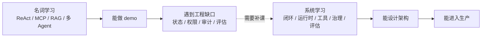

### 1.2 Agent 的一句话定义

Agent 是一个由模型驱动、由运行时约束、通过工具对外行动、并被治理和评估体系持续约束的闭环任务执行系统。

这句话里每个词都不能省：

| 关键词 | 含义 |
|---|---|
| **模型驱动** | 模型负责理解目标、构造计划、选择下一步动作 |
| **运行时约束** | 状态机、预算、停止条件、动作协议由确定性代码控制 |
| **通过工具行动** | Agent 的外部影响必须经过工具边界，而不是直接任意执行 |
| **治理体系约束** | 权限、审批、审计、身份代理、风险分级不能靠模型自觉 |
| **评估体系约束** | 每次改 prompt、工具、模型、RAG、策略，都要能回归 |

一个系统是不是 Agent，不看它是否用了某个框架，也不看它是否支持 Function Calling，而看它是否具备五个闭环：目标闭环、工具闭环、权限闭环、反馈闭环和评估闭环。

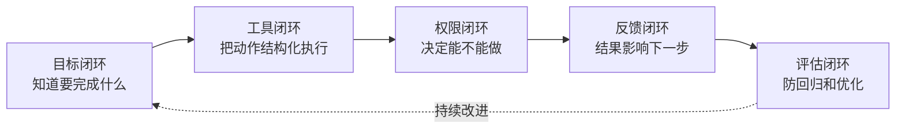

### 1.3 从公开产品学习架构：事实、推断、启发要分开

学习 Claude Code 这类成熟 Agent 产品时，最重要的不是复述产品功能，而是把三类内容分清楚：公开事实、架构推断和设计启发。公开事实来自官方文档、公开仓库和可复现行为；架构推断是从公开行为倒推可能的系统边界；设计启发是把这些边界抽象成自己的工程原则。

这三层不能混在一起。把推断写成事实，会让文章变成伪架构分析；把产品功能照搬成设计原则，会让系统变成别人的影子；只看事实不做抽象，又学不到真正的工程能力。

```text
公开产品学习法

┌────────────────────┐
│  公开事实           │  官方文档 / 公开仓库 / 可复现行为
└─────────┬──────────┘
          │ 只描述能确认的能力
          ▼
┌────────────────────┐
│  架构推断           │  从行为推导运行时、权限、上下文、工具边界
└─────────┬──────────┘
          │ 明确标注“推断”或“可能的设计”
          ▼
┌────────────────────┐
│  设计启发           │  抽象成自己的 Agent 工程原则
└────────────────────┘
```

以 Claude Code 为例，可以确认的是：它是终端里的 agentic coding tool，支持工具调用、权限配置、Hooks、MCP、memory、subagents、SDK 和监控等公开能力。不能直接断言的是内部 Hook 数量固定、某个隐藏调度器存在、某个版本带来具体性能收益、某个社区插件代表官方架构。真正值得学习的是：它把 Agent 循环放进真实工程环境，同时用权限、Hooks、上下文分层、外部工具协议和可观测性约束风险。

---

## 二、Agent 的最小闭环

### 2.1 从 Chatbot 到 Agent 的边界

Chatbot 的主路径是“用户输入、模型生成、用户阅读”。Agent 的主路径是“用户表达目标、系统构造上下文、模型提出动作、运行时校验动作、权限引擎裁决、工具执行、结果回写、模型继续决策或结束”。

这个差异决定了两类系统的工程重点完全不同。

| 维度 | Chatbot | Agent |
|---|---|---|
| 输出对象 | 文本回答 | 文本、工具动作、审批请求、状态变更、制品 |
| 正确性标准 | 回答是否有用 | 目标是否完成，过程是否合规，结果是否可验证 |
| 主要风险 | 幻觉、答非所问 | 误操作、越权、数据泄露、成本失控、错误记忆 |
| 核心工程 | prompt、知识库、响应质量 | 状态机、工具治理、权限、审计、评估 |
| 产品边界 | 信息服务 | 业务执行系统或业务控制面 |

Agent 最小闭环如下：

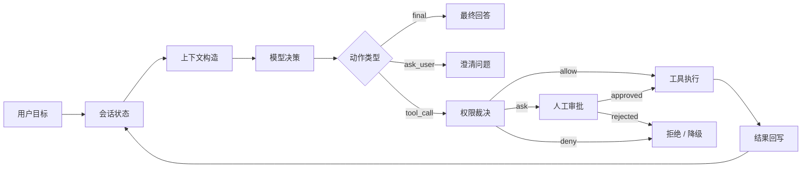

### 2.2 学习 Agent 要抓住四条主线

Agent 的学习顺序应该从“系统为什么可靠”开始，而不是从“哪个框架最火”开始。

| 主线 | 要回答的问题 | 对应工程模块 |
|---|---|---|
| **行动主线** | 目标如何变成动作，动作如何执行 | Action Protocol、ToolExecutor |
| **状态主线** | 系统如何推进、暂停、恢复、结束 | AgentRuntime、StateMachine |
| **边界主线** | 哪些动作能自动执行，哪些必须审批 | PermissionEngine、ApprovalService、AuditLog |
| **改进主线** | 怎么知道系统变好了还是变坏了 | Trace、Metrics、Evaluation、Golden Cases |

学完一个 Agent 概念后，都应该能把它放回这四条主线里。放不进去的概念，要么是外围能力，要么是被营销放大的局部模式。

### 2.3 Claude Code 样板：从聊天窗口到工程行动链路

Claude Code 的启发在于：它不是把聊天窗口搬进终端，而是把模型接进真实工程行动链路。传统补全工具的执行单位是“下一段代码”，Claude Code 这类 coding agent 的执行单位是“工程任务中的下一步行动”：读文件、改文件、运行命令、调用 MCP 工具、等待确认、回收结果、继续判断。

```text
传统补全 / 聊天式开发工具

人编辑代码
  └─> 模型补全 / 解释
        └─> 人接受或拒绝


Claude Code 式工程 Agent

人描述目标
  └─> Agent 构造项目上下文
        └─> 模型选择下一步动作
              ├─> 读文件 / 搜索 / 查看 Git 状态
              ├─> 编辑文件 / 运行命令 / 调用 MCP 工具
              ├─> 触发权限确认或 Hook 拦截
              └─> 工具结果回到上下文，继续循环或结束
```

这说明 Agent 产品的关键不是“模型能不能写代码”，而是行动链路是否可控。一个成熟的工程 Agent 至少要处理四件事：第一，模型如何获得项目规则和文件上下文；第二，模型提出的动作如何进入工具协议；第三，工具执行前如何被权限、策略和 Hook 拦截；第四，执行结果如何被观测、恢复和回归测试。

把这个样板迁移到企业 Agent 时，终端可以换成业务控制台，文件系统可以换成业务 API，Git 和测试可以换成审批、审计和验证工具，但主链路不变：**模型提出行动，系统控制行动，结果反馈给模型**。

---

## 三、架构全景

### 3.1 十个责任域

完整 Agent 平台不是一个巨大的 `AgentService`。它至少要拆成十个责任域：入口域、会话域、能力域、运行时域、上下文域、工具域、知识域、治理域、观测域、评估域。

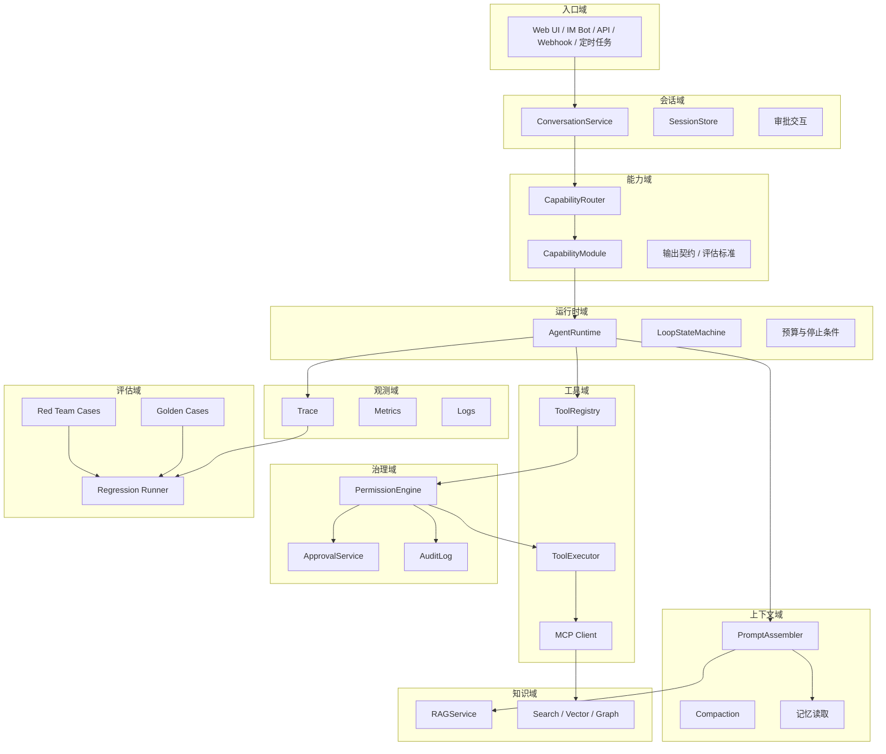

| 责任域 | 核心问题 | 典型模块 |
|---|---|---|
| 入口域 | 用户、系统、IM、Webhook、定时任务如何进入 Agent | Web UI、IM Bot、API Gateway、Webhook Handler |
| 会话域 | 多轮对话、流式输出、审批交互、会话恢复如何管理 | ConversationService、SessionStore |
| 能力域 | 用户目标如何路由到具体能力、主 Agent 或子 Agent | CapabilityRouter、CapabilityModule、AgentDefinition |
| 运行时域 | Agent 循环如何推进，如何停止，如何预算 | AgentRuntime、LoopStateMachine |
| 上下文域 | 哪些信息进入模型，如何压缩、引用、隔离 | ContextManager、PromptAssembler |
| 工具域 | 工具如何注册、发现、校验、执行和限流 | ToolRegistry、ToolExecutor、MCP Client |
| 知识域 | 外部知识如何检索、重排、引用和权限过滤 | RAGService、SearchService、GraphService |
| 治理域 | 谁能做什么，哪些动作要审批，如何审计 | PermissionEngine、ApprovalService、AuditLog |
| 观测域 | 如何追踪模型、工具、审批、成本、失败 | TraceService、Metrics、Logs |
| 评估域 | 如何证明系统变好了，如何防回归 | EvaluationService、Golden Cases、Red Team Cases |

### 3.2 依赖方向

顶层设计的关键是明确依赖方向。入口域不直接调用工具；会话域不直接判断权限；运行时不直接访问业务数据库；工具执行前必须经过治理域；知识检索必须带用户和租户上下文；观测域只记录事实，不参与业务决策；评估域读取历史和测试集，不影响在线执行。

这些依赖方向决定系统后续能否演进。没有边界的 Agent 项目，早期会写得很快，后期会被审计、权限、上下文污染和评估回归拖死。

一个最小可落地版本只需要六个模块：`AgentRuntime`、`ContextManager`、`ToolRegistry`、`PermissionEngine`、`ToolExecutor`、`TraceService`。有了这六个模块，就能实现一个可审计的只读 Agent，并逐步加入审批、记忆、RAG 和子 Agent。

### 3.3 企业级落地边界：把 Agent 能力工程化

企业级 Agent 的关键不是把某个业务流程写进 prompt，而是把 demo 中隐含的边界显式工程化。本节讨论的是通用工程边界，不绑定任何具体行业、组织结构或业务系统。文中的工具名、API 名和流程名只是中性示例。

从 demo 到企业系统，至少有六个边界会从“可选优化”变成“上线前提”。

| 边界 | demo 常见做法 | 企业级要求 |
|---|---|---|
| **执行边界** | 模型直接决定下一步 | 运行时状态机推进，每一轮可暂停、恢复、失败、终止 |
| **能力边界** | 把现有 API 直接暴露给模型 | Tool Registry 管理契约，Agent 专属 API 聚合推理所需上下文 |
| **权限边界** | prompt 提醒模型不要乱做 | PermissionEngine 强制裁决，L2/L3 进入审批或拒绝 |
| **上下文边界** | 把历史、工具、规则拼成大 prompt | 分层组装、按需加载、压缩、引用、大输出外溢 |
| **制品边界** | 让模型自由生成规则或流程 | Schema Registry 限制生成空间，经过校验、审批、灰度和回滚 |
| **运维边界** | 看最终回答是否有用 | trace、metrics、audit、eval、配置分层和会话恢复成为基础设施 |

```text
企业级 Agent 的通用落地面

入口 / 会话
  │
  ▼
Agent Runtime
  ├─ 状态机：推进、暂停、恢复、失败、停止
  ├─ Prompt Assembler：系统约束、规范、工具、任务、记忆分层注入
  ├─ Tool Registry：工具契约、风险等级、scope、版本、输出限制
  ├─ Permission Engine：用户身份 + Agent 身份 + 租户策略 + 工具风险
  ├─ Artifact System：Schema、候选制品、验证、审批、灰度
  └─ Observability：trace、audit、metrics、eval、成本归因
```

这里最容易走偏的是把企业级落地理解成“为某个现有业务系统做一套 AI 操作入口”。这会让文章被业务模块、页面动作和具体 API 拖住。更稳的抽象是：企业级 Agent 要解决的是**自然语言目标如何在组织权限、数据边界、审计要求和长期运维中被受控执行**。业务系统只是被 Agent 调用的领域能力，不应该反过来定义 Agent 平台的架构。

### 3.4 交互与呈现边界

Agent 的输出不只是一段文本。进入企业场景后，它还会输出审批请求、工具进度、结构化结果、图表、表格、时间线、变更摘要和最终制品。交互层要做的不是让模型生成前端代码，而是给模型一组受 schema 约束的呈现原语。

| 呈现原语 | 适合场景 | 必要约束 |
|---|---|---|
| **文本流** | 解释、总结、澄清、最终结论 | 支持引用证据和工具结果 |
| **表格** | 列表、对比、筛选结果 | 列定义、分页、排序、数据来源 |
| **图表** | 趋势、分布、基线对比 | 数据源、时间范围、聚合粒度 |
| **时间线** | 事件链、操作轨迹、审批过程 | 时间戳、事件类型、关联证据 |
| **审批卡片** | L2/L3 高风险动作确认 | 操作摘要、影响范围、回滚方式、同意/拒绝 |
| **制品预览** | 工作流、规则、Agent 定义、报告 | schema 校验结果、版本、状态 |

交互协议可以是事件流：`text.delta` 表示文本输出，`tool.call.start` 表示工具开始执行，`tool.call.result` 表示工具结果，`approval.request` 表示请求审批，`render.component` 表示渲染受控组件。重点是所有结构化呈现都来自白名单组件和 schema，而不是模型自由拼 HTML 或脚本。

### 3.5 Capability Layer：业务能力要和 Runtime 隔离

企业 Agent 平台很容易在早期把某个成功场景直接写进 Runtime：看到某类关键词就走某条流程，某个工具返回特殊字段就走特殊分支，某个页面给某类任务加专用按钮。这样短期很快，长期会让 Agent Runtime 变成业务逻辑泥潭。

更稳的边界是在入口和 Runtime 之间增加 **Capability Layer**。Runtime 只负责通用执行机制；Capability Layer 负责领域能力的识别、组织和实例化。

```text
用户目标
  │
  ▼
Capability Router
  - 识别任务类型
  - 选择能力模块或主 Agent
  - 记录路由依据和置信度
  │
  ▼
Capability Module
  - 领域 prompt
  - 领域工具组合
  - 领域知识范围
  - 输出契约和评估标准
  │
  ▼
Agent Runtime
  - 状态机
  - 工具执行
  - 权限裁决
  - trace / audit / eval
```

Capability Module 可以理解为“某类真实任务的封装”，但它不应该污染 Runtime Core。它可以拥有领域术语、任务模板、工具编排偏好、输出格式、评估规则和子 Agent 定义；Runtime 只通过通用契约调用它。

| 层 | 应该知道什么 | 不应该知道什么 |
|---|---|---|
| Runtime Core | 状态、动作、工具、权限、Hook、上下文、trace | 某个领域任务的专有流程和判断口径 |
| Capability Router | 任务类型、能力列表、路由证据、置信度 | 工具内部实现和业务系统细节 |
| Capability Module | 领域规则、工具组合、知识范围、输出契约 | 其他能力模块的内部逻辑 |
| Tool Registry | 工具契约、schema、风险等级、执行入口 | 用户界面流程和领域决策树 |

一个专业域 Agent 也应该按 Capability 的方式定义，而不是只写一个角色 prompt。

```text
Agent 名称：
所属领域：
角色定位：
服务对象：

核心任务：
输入：
输出：

可用工具：
权限等级：
知识范围：
记忆类型：

协作对象：
升级路径：
质量指标：
闭环信号：
```

这个模板的价值是防止“多 Agent”退化成角色扮演。一个 Agent 不是一个名字，也不是一段 prompt，而是角色、工具、知识、权限、输出契约和评估指标的组合。

### 3.6 IM 控制面：Agent Bridge 的价值

长任务 Agent 不一定总在 IDE、网页控制台或终端里运行。对很多真实使用场景来说，IM 反而是天然控制面：随时可达、跨设备、异步通知、适合审批、适合把后台进展推给用户。MetaBot 这类系统的价值，就在于把 IM 平台变成 AI Agent 的远程控制总线。

它和 Agent 框架本体不是同一个层次。MetaBot 不重写模型推理循环，而是做 Agent Bridge：把飞书、Telegram、微信、Web 等入口接到 Claude Code、Codex CLI、Kimi Code 等不同 Agent 引擎上，并把输入、输出、流式消息、卡片渲染、后台通知和跨 Bot 协作收敛到统一调度层。

```text
IM 到 Agent 的远程控制链路

IM / Web 消息
  │
  ▼
Message Bridge
  - 命令解析
  - 会话路由
  - 队列与限流
  - 输出聚合
  - 审计与成本记录
  │
  ▼
Engine Interface
  - createExecutor()
  - createStreamProcessor()
  │
  ├─ Claude Code SDK
  ├─ Codex CLI JSONL
  └─ 其他 Agent 引擎
  │
  ▼
Sender / Renderer
  - IM 消息
  - 交互卡片
  - WebSocket 更新
  - 审批与通知
```

这种设计给 Agent 架构带来三个启发。

| 启发 | 工程含义 |
|---|---|
| **IM 不是低级入口** | 对长任务、后台任务、审批和通知来说，IM 是比网页聊天框更自然的控制面 |
| **Bridge 要和 Agent Runtime 解耦** | IM 层不应该绑定某一个模型或 SDK；它应该通过 Engine Interface 适配不同 Agent 引擎 |
| **后台活动要聚合** | 子 Agent、后台任务、长时间执行会产生大量消息，需要合并窗口、长度限制和优先级，避免通知风暴 |

OpenClaw 和 MetaBot 都在讲“控制面”，但侧重点不同。OpenClaw 更像自托管个人 Agent 控制面，把入口、工具、技能、插件和节点能力放进一个常驻 Gateway；MetaBot 更像 Agent Bridge，把已有 Agent 引擎接到 IM 和 Web 入口，解决远程调度、跨平台通信和长任务通知问题。两者都说明了一点：Agent 的产品形态不应该被限制在聊天窗口。

### 3.7 Gateway 型自主 Agent：OpenClaw 的理念价值

OpenClaw 值得单独看，不是因为它已经证明了生产级自治，而是因为它代表了早期自主型 Agent 产品的一个重要方向：以自托管 Gateway 为控制面，把聊天入口、Web 控制台、CLI、桌面应用、移动节点、工具、技能、插件、模型 provider、记忆和多 Agent 路由收敛到一个长期运行的个人 Agent 系统里。

这类系统和普通 chatbot 的差异很大。chatbot 通常围绕一次对话请求展开；Gateway 型 Agent 则更像一个常驻控制面，持续管理入口、连接、会话、身份、工具可见性和执行节点。即使产品成熟度还停留在技术 demo 或早期阶段，这个架构方向仍然值得学习。

```text
Gateway 型自主 Agent 的抽象形态

多入口
  - 聊天应用 / Web UI / CLI / 桌面端 / 移动节点 / Webhook
        │
        ▼
Gateway 控制面
  - 连接管理
  - 身份与配对
  - 会话与路由
  - 事件流
  - 工具策略过滤
        │
        ▼
Agent Runtime
  - 上下文组装
  - 模型调用
  - 工具选择
  - 权限裁决
  - 结果回写
        │
        ▼
能力层
  - Tools / Skills / Plugins / Model Providers / Nodes
```

OpenClaw 给系统设计的启发至少有四点。

| 启发 | 工程含义 |
|---|---|
| **入口要收敛** | 多聊天渠道、多客户端、多自动化入口不能各自实现一套 Agent loop，应该收敛到统一控制面 |
| **控制面要常驻** | 会话、连接、配对、路由、节点能力和事件流需要长期状态，不适合只靠一次性请求处理 |
| **能力要分层** | 工具、技能、插件、模型 provider、节点能力是不同扩展面，不能混成一个“插件”概念 |
| **自托管是控制权，不是免风险** | 用户拿回运行边界，同时也承担凭据、插件、网络暴露、渠道接入和本机权限风险 |

这类架构也有清晰边界。它更适合作为个人自主 Agent、本地优先助手、多入口控制面和 Agent 产品原型的样板；不能直接等同于企业多租户 Agent 平台。要迁移到企业场景，还需要重新设计租户隔离、集中 IAM、审计留存、任务队列、可恢复执行、运维高可用和合规治理。

---

## 四、运行时设计

### 4.1 状态机比 prompt 更重要

Agent Runtime 是整个系统的内核。它不负责业务逻辑，不负责具体工具实现，不负责知识库索引，也不负责 UI；它负责推进循环：准备上下文、请求模型、解析动作、校验动作、请求权限裁决、执行动作、写回结果、判断是否继续。

Claude Code 这类产品给运行时设计的最大启发，是把“工程环境”视为 Agent Runtime 的一部分。终端、文件系统、Git、测试命令、项目规则、MCP 连接、会话恢复，都不是外围功能，而是运行时每一轮决策要感知和约束的环境。

```text
工程 Agent Runtime 的执行剖面

┌─────────────────────────────────────────────────────────────┐
│ 用户目标：修复 bug / 增加功能 / 分析代码 / 运行测试             │
└──────────────────────────┬──────────────────────────────────┘
                           ▼
┌─────────────────────────────────────────────────────────────┐
│ Agent Runtime                                                │
│  1. 组装上下文：项目规则、会话状态、文件引用、可见工具          │
│  2. 请求模型：返回 final / ask_user / tool_call / delegate     │
│  3. 校验动作：schema、预算、重复工具、停止条件                 │
│  4. 权限裁决：allow / ask / deny                              │
│  5. 执行工具：文件、Shell、搜索、MCP、内部 API                 │
│  6. 回写结果：摘要、证据、错误、审计、trace                    │
└──────────────────────────┬──────────────────────────────────┘
                           ▼
┌─────────────────────────────────────────────────────────────┐
│ 环境反馈：diff / 测试结果 / 命令输出 / 工具结果 / 审批状态       │
└─────────────────────────────────────────────────────────────┘
```

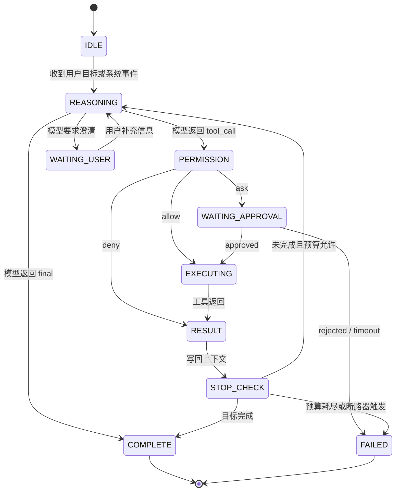

| 状态 | 进入条件 | 退出条件 | 关键风险 |
|---|---|---|---|
| IDLE | 新会话或任务等待 | 收到用户输入、事件或定时触发 | 入口鉴权错误 |
| REASONING | 上下文准备完成 | 模型返回结构化动作 | 输出不可解析、工具幻觉 |
| PERMISSION | 动作为工具调用 | allow、ask、deny | L2 误放行为 L0 |
| WAITING_APPROVAL | 权限决策为 ask | 用户批准、拒绝或超时 | 审批状态丢失 |
| EXECUTING | 权限 allow 或审批通过 | 工具返回结果或异常 | 工具超时、重复执行 |
| RESULT | 工具结果回写 | 继续推理或进入停止检查 | 大输出污染上下文 |
| STOP_CHECK | 模型尝试结束 | 完成、继续或失败 | 过早结束、无限自检 |
| COMPLETE / FAILED | 达到终态 | 会话归档 | 结论不可追溯 |

### 4.2 行动协议

模型输出必须结构化。不要让模型自由写“我将调用某工具”。运行时应该要求模型返回明确动作类型：最终回答、工具调用、澄清问题、子 Agent 委托、审批方案。动作结构越明确，系统越容易做权限、测试和回归。

最小动作协议可以这样设计：

```json
{
  "type": "tool_call",
  "tool": "policy.update_threshold",
  "arguments": {
    "policy_id": "p-1001",
    "threshold": 90
  },
  "reason": "当前错误率超过基线，用户要求调整策略阈值",
  "risk_acknowledgement": "该操作会改变线上策略，需要审批",
  "expected_result": "策略阈值更新为 90，并返回新版本号",
  "fallback": "如果审批拒绝，只给出变更建议和影响分析"
}
```

一次工具调用的协议路径如下：

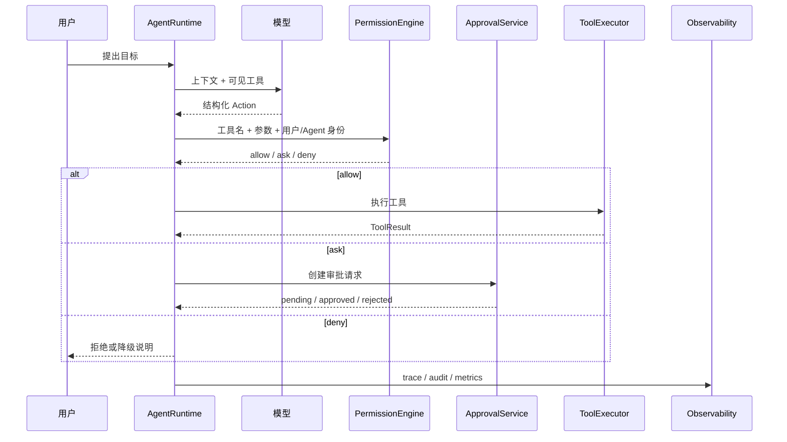

动作协议的字段要服务治理，而不只是服务执行。`tool` 和 `arguments` 用于执行；`reason` 用于审批和审计；`risk_acknowledgement` 用于检查模型是否识别风险；`expected_result` 用于停止检查；`fallback` 用于工具失败后的降级。

### 4.3 预算和停止条件

没有预算的 Agent 不是智能，而是不受控。预算至少包括推理轮次、工具调用次数、同一工具连续调用次数、单工具超时、总会话超时、上下文压缩次数、token 成本、子 Agent 并发数。

Hermes Agent 的主循环给出另一个有价值的参照：一个能长期运行的 Agent 循环，不能只有“模型调用 + 工具执行”，还要有缓存、压缩、预算和打断四类保护机制。Prompt Cache 控制系统提示和稳定上下文的重复成本；Context Compression 控制窗口溢出；Iteration Budget 防止死循环；Interrupt Signal 保留用户对长任务的控制权。

```text
Agent 主循环的四类保护机制

┌─────────────────────────────────────────────────────────────┐
│ System Prompt / 规则 / 工具描述                              │
│   └─ Prompt Cache：稳定上下文不要每轮重新构造                 │
└──────────────────────────┬──────────────────────────────────┘
                           ▼
┌─────────────────────────────────────────────────────────────┐
│ 推理循环                                                     │
│   LLM Call -> tool_calls -> ToolResult -> 下一轮 LLM Call     │
│                                                             │
│   · Context Compression：长会话压缩但保留目标和证据           │
│   · Iteration Budget：限制最大轮次、工具次数、成本             │
│   · Interrupt Signal：用户可随时打断并安全退出                │
└─────────────────────────────────────────────────────────────┘
```

| 预算项 | 控制什么 | 典型失败 |
|---|---|---|
| 最大推理轮次 | 防止无限循环 | 一直“再检查一下” |
| 最大工具调用次数 | 控制成本和副作用 | 反复检索、反复写入 |
| 同一工具连续调用上限 | 防止卡死在局部 | 同一个 search 调十几次 |
| 单工具超时 | 防止执行层拖垮运行时 | 外部 API 无响应 |
| 总会话超时 | 防止任务长期占用资源 | 用户离开后仍在跑 |
| token 成本上限 | 控制推理成本 | 大上下文无限膨胀 |
| 子 Agent 并发上限 | 控制扇出 | 一次任务派生几十个子任务 |

停止条件不能只靠模型说“完成了”。更稳的做法是把停止检查做成一个独立阶段：目标是否满足，必要证据是否存在，待审批项是否处理，工具错误是否已解释，最终回答是否引用结果，预算是否耗尽。

### 4.4 System Prompt 分层组装

企业级 Agent 的 System Prompt 不应该是一段固定长文本，而应该是运行时按任务状态动态组装的分层结构。分层的目的不是让 prompt 更复杂，而是把不同生命周期、不同权限级别、不同压缩策略的信息分开管理。

```text
System Prompt 分层结构

Layer 1：不可变系统约束
  - Agent 的身份边界
  - 安全原则、权限原则、禁止事项
  - 不能被用户输入、外部文档或记忆覆盖

Layer 2：组织 / 项目规范
  - 企业策略、项目规则、输出风格、合规要求
  - 可由配置系统管理，按租户、项目、角色加载

Layer 3：可见工具与行动协议
  - 本轮允许使用的工具列表
  - 工具 schema、信任层级、输出限制
  - action protocol 和错误处理约定

Layer 4：当前任务状态
  - 用户目标、计划、待办、审批状态
  - 已执行动作、工具结果摘要、活跃子 Agent 结论

Layer 5：记忆与历史索引
  - 用户偏好、长期事实、历史决策引用
  - 只注入相关摘要，不注入未筛选的历史全文
```

这五层的治理方式不同。Layer 1 应该由代码或受控配置固定，不进入普通记忆；Layer 2 可以按组织和项目加载，但要有版本；Layer 3 必须来自 Tool Registry 和策略过滤后的结果；Layer 4 属于会话状态，压缩时必须保留目标、证据和审批；Layer 5 必须可查看、可纠错、可删除。

子 Agent 也不应该继承主 Agent 的完整 prompt。更稳的做法是只给它任务说明、允许工具、信任上限、必要证据和输出 schema。这样子 Agent 获得的是完成子任务所需的最小上下文，而不是主会话的完整权限和历史包袱。

### 4.5 持久化与恢复

长任务 Agent 不能只活在一次请求的内存里。只要任务可能跨多轮推理、审批等待、外部工具执行或子 Agent 并发，就必须设计持久化和恢复机制。

| 持久化对象 | 保存什么 | 主要用途 |
|---|---|---|
| **Transcript** | 用户消息、模型动作、工具调用、工具结果 | 会话回放、问题复盘、训练评估样本 |
| **Session State** | 当前状态、预算、待办、待审批项、压缩摘要 | 中断恢复、审批后续跑、长任务续接 |
| **Action Trace** | 每次行动的工具、参数摘要、权限决策、结果摘要、耗时 | 审计、成本归因、行为分析、经验固化 |
| **Subtask State** | 子 Agent 任务、进度、结论、证据、错误 | 并发任务恢复、主 Agent 聚合 |
| **Memory Index** | 长期记忆索引、来源、置信度、过期时间 | 跨会话连续性、冲突检测 |

恢复不是简单地“把历史对话塞回模型”。恢复时要先重建确定性状态：任务是否已完成，哪些工具已经执行，哪些审批仍在等待，哪些副作用已经发生，哪些子任务可重试。只有确定性状态重建完成后，才把必要摘要注入模型继续推理。

### 4.6 跨轮次执行与后台活动

IM 控制面会暴露一个普通网页对话不明显的问题：用户发完消息可能离开，但 Agent 任务还在跑；子 Agent、后台任务和长目标可能在用户不在线时继续产生结果。运行时如果每条消息都启动一次全新的模型调用，就很难支持这种长任务体验。

MetaBot 的 Persistent Executor 模式提供了一个有价值的抽象：把一次性的模型或 Agent 引擎调用，提升为可跨用户消息轮次存活的执行会话。用户第一条消息启动执行，Agent 可以继续工作；后续用户补充信息时，不是重新创建任务，而是把新输入注入同一个执行会话。

```text
普通请求模式

用户消息 1 -> 新建执行 -> 返回结果 -> 进程结束
用户消息 2 -> 新建执行 -> 返回结果 -> 进程结束

跨轮次执行模式

用户消息 1 -> 启动 Execution Session
              -> Agent 继续工作 / 等待输入 / 后台运行
用户消息 2 -> sendAnswer() / resume() 注入同一个会话
              -> 继续执行 / 完成 / 失败 / 归档
```

这类能力不能只靠“进程一直不退出”。它至少需要四个边界：

| 边界 | 要解决的问题 |
|---|---|
| **生命周期** | 会话什么时候启动、空闲多久回收、崩溃后如何恢复 |
| **输入注入** | 后续用户消息、审批结果、工具回调如何进入同一个执行会话 |
| **中断控制** | 用户取消、预算耗尽、风险升级、权限拒绝时如何安全停止 |
| **后台通知** | Agent 不在用户轮次中产生的消息如何聚合、限流、去重和归档 |

后台活动尤其需要治理。子 Agent 和长任务可能持续输出进展，如果每条都推送给用户，会很快形成通知风暴。更好的做法是设置短时间合并窗口，把多个后台事件聚合成一条摘要，保留关键状态、错误、待审批项和最终结果；普通进展可以合并，风险升级和审批请求则要立即通知。

---

## 五、工具与能力接入

### 5.1 工具不是 API 列表

工具系统决定 Agent 能做什么，也决定 Agent 不能做什么。一个工具不是简单的函数名加参数，它至少包含名称、描述、输入 Schema、输出 Schema、副作用声明、信任层级、所需 scope、超时、幂等策略、输出大小限制、审计策略和错误语义。

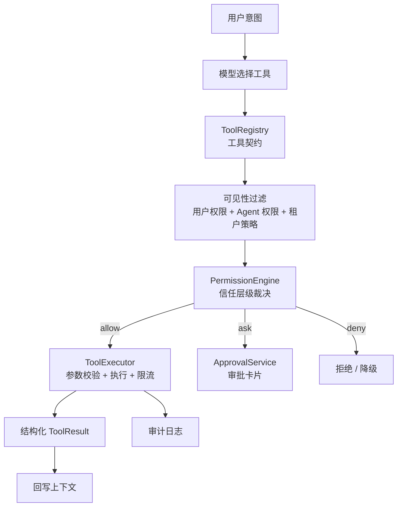

工具可以分成五类：

| 类型 | 副作用 | 信任默认值 | 示例 |
|---|---|---|---|
| 感知工具 | 无 | L0 | 查询列表、读详情、检索日志、读取文档 |
| 分析工具 | 无或低 | L0 / L1 | 影响范围分析、风险评分、趋势计算 |
| 执行工具 | 有 | L1 / L2 / L3 | 修改配置、创建资源、发送消息、删除数据 |
| 记忆工具 | 有 | L1 / L2 | 保存偏好、写长期记忆、固化流程 |
| 呈现工具 | 无 | L0 | 生成表格、图表配置、报告片段 |

### 5.2 工具注册中心与 Toolset

Hermes 的中央工具注册中心很值得吸收。工具数量少时，可以手动维护工具列表；工具增长到几十个、上百个时，系统需要一个明确的 Tool Registry 来管理工具发现、分组、可见性、版本和风险边界。否则工具选择压力会全部转移给模型，模型越看越多，误选概率也会升高。

```text
工具注册与按需组合

tools/*.py / MCP servers / internal APIs
       │
       ▼
┌─────────────────────────────────────────────────────────────┐
│ Tool Registry                                                │
│  · 注册工具契约：name / schema / trust_level / scopes         │
│  · 记录工具元数据：版本 / owner / 输出限制 / 审计策略          │
│  · 支持工具分组：core / platform / domain / experimental      │
└──────────────────────────┬──────────────────────────────────┘
                           ▼
┌─────────────────────────────────────────────────────────────┐
│ Toolset 按需组合                                             │
│  · 入口 Toolset：CLI / IM / API / Webhook                     │
│  · 任务 Toolset：只读分析 / 配置变更 / 报告生成                │
│  · 风险 Toolset：L0 自动 / L2 审批 / L3 禁止或多人审批         │
└──────────────────────────┬──────────────────────────────────┘
                           ▼
                  本轮模型可见工具集合
```

Toolset 的意义不是做一个漂亮分组，而是降低上下文成本和治理复杂度。本轮可见工具应该来自用户权限、Agent 权限、租户策略、任务类型、入口环境和风险等级的交集。Claude Code 的“工程环境工具集”和 Hermes 的“跨平台工具集”都说明了一点：工具注册可以统一，但工具暴露必须按场景收敛。

### 5.3 工具契约应该怎么写

工具描述要写给模型看，而不是写给人类 API 调用者看。坏描述是“更新配置”；好描述是“修改指定策略的阈值，会改变线上决策结果。仅当用户明确要求变更并已确认影响范围时使用，信任层级 L2，执行前必须展示变更摘要、影响范围和回滚方式”。

一个工具契约至少应该包含这些字段：

```yaml
name: policy.update_threshold
description: >
  修改指定策略的阈值，会改变线上决策结果。
  仅当用户明确要求变更，并且已经展示影响范围与回滚方式时使用。
input_schema:
  type: object
  required: [policy_id, threshold]
  properties:
    policy_id:
      type: string
    threshold:
      type: integer
side_effect: true
trust_level: L2
scopes_required:
  - policy:write
timeout_seconds: 30
idempotency_key: policy_id
max_output_chars: 12000
audit:
  redact_fields: []
  record_arguments: true
  record_result_summary: true
```

### 5.4 工具反馈层：让模型知道下一步该做什么

工具契约不仅要告诉模型“这个工具怎么调用”，还要让模型在调用后知道“下一步该怎么判断”。真实 Agent 失败经常不是因为没有工具，而是工具输出太薄：模型拿到一组结果后不知道命中是否足够、不知道该读哪条详情、不知道参数失败后如何修正，于是反复搜索、改写 query、幻觉 ID，最后耗尽预算。

因此，ToolResult 不应该只是业务数据，还应该包含决策信号。

```json
{
  "status": "success",
  "summary": "找到 3 条高相关结果，第一条为精确命中。",
  "data": {
    "hits": [
      {
        "id": "doc-001",
        "title": "示例文档",
        "match_kind": "exact_alias",
        "score": 0.92
      }
    ]
  },
  "evidence_refs": ["doc-001"],
  "next_action_hint": "命中已经足够，下一步应读取 doc-001 的正文，不要继续改写 query。",
  "retry_hint": null,
  "attempted_inputs": ["example query"],
  "remaining_options": ["read_document"],
  "recoverable": true
}
```

工具失败时也要给出可执行的修复方向，而不是只返回 “not found”。

```json
{
  "status": "error",
  "error_code": "invalid_document_id",
  "summary": "文档 ID 不存在。",
  "retry_hint": "请使用上一次 index_lookup 返回的 id 字段，不要自行把标题改写成 ID。",
  "last_valid_values": {
    "document_id": "doc-001"
  },
  "recoverable": true
}
```

这些字段的作用不是替模型思考，而是把工具侧确定性事实交给模型，减少无意义试探。

| 字段 | 解决的问题 |
|---|---|
| `summary` | 用短文本说明工具结果，不让模型从大 JSON 里猜重点 |
| `evidence_refs` | 明确哪些证据可以支撑后续回答 |
| `next_action_hint` | 告诉模型当前结果足够时应该进入下一步 |
| `retry_hint` | 告诉模型失败后如何修正，而不是随机重试 |
| `attempted_inputs` | 防止同义重复调用 |
| `remaining_options` | 暴露可走路径，减少无目的探索 |
| `last_valid_values` | 防止模型把合法参数改坏 |
| `recoverable` | 区分可恢复错误和必须升级人工的错误 |

对于检索类、索引类、读取类工具，还应该暴露能力边界。模型需要知道当前工具能查哪些 domain、有哪些索引、哪些结果是 verified、哪些只是候选。否则“自主搜索”会退化成在未知空间里盲试。

```text
工具反馈的基本原则

1. 命中后告诉模型是否足够
2. 失败后告诉模型怎么修
3. 重试前告诉模型已经试过什么
4. 高风险或无证据时告诉模型应该停止、追问或升级
5. 大输出只给摘要和引用，正文按需读取
```

信息不足下的自主性不是真自主性。Agent 自主决策的前提，是每个决策点都有足够清晰的状态、工具反馈、错误语义和下一步提示。

### 5.5 Agent 专属 API：面向推理步骤设计

企业存量 API 通常围绕“人在 UI 上点按钮”设计：一个页面、一个按钮、一个接口。Agent 的消费方式不同。它需要在一次推理步骤里拿到足够完整的决策上下文，而不是像人一样在多个页面之间切换、比较、补全信息。

所以，企业级 Agent 不应该把所有已有 API 原样包装成工具。更稳的方式是在已有 Service 层之上增加一层 Agent 专属 API，再由 Tool Registry 把这些 API 暴露成工具。

```text
Agent Runtime
    │
    ▼
Tool / MCP 层
    │
    ▼
Agent API 层
  - 聚合推理所需上下文
  - 精简 UI 字段
  - 增加影响范围、基线对比、风险摘要
    │
    ▼
已有 Service 层
    │
    ▼
数据库 / 外部系统
```

Agent API 常见有三类：

| 类型 | 作用 | 中性示例 |
|---|---|---|
| **聚合型** | 把多个原子查询组合成一个决策上下文 | `resource.full_context` |
| **增强型** | 在原始数据上补充影响范围、风险、基线或解释 | `policy.change_impact` |
| **同步化型** | 把创建任务、轮询、取结果封装成一次可控调用 | `search.logs_sync` |

Agent API 的设计原则是：一个工具调用应该尽量对应 Agent 的一个推理步骤。返回值要减少纯 UI 字段，保留语义字段、来源、版本、权限、风险和引用 ID。高风险写操作还要返回变更摘要、预计影响、回滚方式和幂等键，供审批和审计使用。

反过来，不要为了 Agent 重写业务内核。已有业务逻辑应该继续沉在 Service 层；Agent API 只是为模型消费重新组织输入输出。这样既能保护存量系统，也能避免把 UI API 的碎片化复杂度转嫁给模型。

### 5.6 MCP 的位置

MCP 的价值是把外部工具、资源和提示词用统一协议暴露给模型应用。它解决的是“如何接入能力”，不是“如何治理能力”。支持 MCP 的系统不等于生产级 Agent 系统，因为 MCP 不替你解决状态机、权限、审批、审计、租户隔离、成本预算、工具质量和评估回归。

更稳的边界是：MCP Server 提供能力，ToolRegistry 读取能力，策略层过滤能力，运行时只把本轮允许的工具暴露给模型，PermissionEngine 在每次执行前统一裁决。

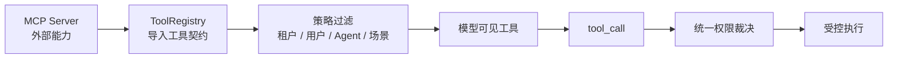

Claude Code 对 MCP 的启发不是“接越多 MCP Server 越强”，而是“外部能力协议化以后，工具治理会变得更重要”。MCP Server 既可能暴露 tools，也可能暴露 resources 和 prompts；它能让 Agent 接入 Jira、Sentry、Figma、数据库、文档系统，也会把认证、输出大小、速率限制、敏感数据和审计问题带进运行时。

接入 MCP 或类似外部工具协议时，至少要检查这些边界：

| 检查项 | 要问的问题 |
|---|---|
| 工具范围 | 这个 server 暴露了哪些 tools / resources / prompts，是否超出当前任务需要 |
| 认证方式 | 使用用户授权、服务账号、OAuth，还是长期静态凭据 |
| 权限裁决 | 工具执行前由谁判断 allow / ask / deny |
| 输出大小 | 工具输出是否可能把上下文撑爆，是否有摘要和引用机制 |
| 租户隔离 | server 是否按用户、租户、项目过滤数据 |
| 错误语义 | 失败、超时、部分成功、权限拒绝是否可区分 |
| 审计能力 | 是否能记录调用者、参数摘要、结果摘要和 trace id |

### 5.7 Tool、Skill、Plugin 要分清

OpenClaw 这类系统给能力扩展的一个重要启发，是把 Tool、Skill、Plugin 拆成不同层次。很多 Agent 项目后期失控，正是因为把“模型能调用的函数”“模型应该遵循的流程经验”“运行时安装的扩展包”都叫插件。

| 层次 | 本质 | 谁消费 | 典型内容 | 主要治理 |
|---|---|---|---|---|
| **Tool** | typed function 或外部能力接口 | 模型通过 tool call 调用 | 读文件、搜文档、查数据、发消息、执行命令 | schema、scope、信任层级、审批、审计、限流 |
| **Skill** | 程序性记忆或任务手册 | 模型阅读并按流程执行 | 排障步骤、写作规范、代码审查流程、报告模板 | 适用范围、版本、评审、测试、退役 |
| **Plugin** | 运行时扩展包 | 系统加载后提供能力 | 新工具、新渠道、新模型 provider、新 hook、新技能包 | manifest、来源、权限请求、依赖、供应链审查 |

这三个概念的风险不同。Tool 的风险在于副作用和越权；Skill 的风险在于错误经验被长期复用；Plugin 的风险在于供应链、运行时权限和凭据访问。治理也必须分开：不能用 prompt 评审替代工具权限，不能用工具 schema 替代 Skill 质量评审，也不能因为插件声明了权限就默认它是安全沙箱。

```text
能力扩展的正确边界

Plugin 安装后提供运行时能力
        │
        ├─ 注册 Tools：进入 Tool Registry，受权限和审计治理
        ├─ 注册 Skills：进入 Skill Registry，受评审和版本治理
        ├─ 注册 Hooks：进入生命周期拦截点，受超时和权限治理
        └─ 注册 Channels / Providers：进入入口或模型层，受认证和配置治理
```

对于自托管 Agent，Plugin 尤其要谨慎。它可能带来浏览器、文件系统、Shell、消息渠道、外部网络和长期凭据访问能力。用户拥有更多控制权，并不代表风险消失；风险只是从平台运营方转移到用户自己的机器、网络、凭据、配置和插件来源上。

---

## 六、上下文、索引、RAG 与记忆

### 6.1 上下文不是越多越好

Agent 的上下文不是一个大字符串，而是一组有来源、权限、生命周期和压缩策略的信息。常见上下文包括系统指令、企业规范、用户偏好、会话历史、任务状态、工具 Schema、工具结果、显式引用、长期记忆、待审批项、子 Agent 结果和外部状态摘要。

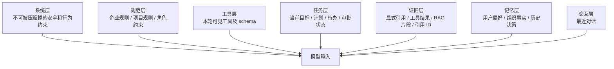

上下文压缩不是“把历史总结一下”。压缩要保留任务目标、用户硬约束、已执行动作、工具结果摘要、证据引用、待办步骤、审批结果、错误和阻塞点。压缩可以丢掉重复寒暄、冗长原始输出、失败的中间推理和已归档细节。

Claude Code 这类工程 Agent 的上下文管理给出一个很好的参照：项目规则、用户记忆、文件引用、MCP resources、会话历史、工具结果、压缩摘要不应该混成一团。`CLAUDE.md` 这类项目记忆文件的价值，不在文件名本身，而在于它把长期项目规则从短期对话里分离出来。

```text
Claude Code 式上下文分层抽象

┌─────────────────────────────────────────────────────────────┐
│ 稳定规则层                                                   │
│  企业策略 / 项目规范 / 角色约束 / 安全边界                    │
├─────────────────────────────────────────────────────────────┤
│ 项目上下文层                                                 │
│  仓库结构 / 关键文件 / CLAUDE.md 类规则 / 常用命令             │
├─────────────────────────────────────────────────────────────┤
│ 任务状态层                                                   │
│  当前目标 / 计划 / 已执行动作 / 待办 / 待审批                  │
├─────────────────────────────────────────────────────────────┤
│ 显式引用层                                                   │
│  用户 @ 的文件 / MCP resource / 搜索结果 / 外部证据            │
├─────────────────────────────────────────────────────────────┤
│ 工具结果层                                                   │
│  diff / 测试结果 / 命令输出摘要 / 结构化 ToolResult            │
├─────────────────────────────────────────────────────────────┤
│ 会话交互层                                                   │
│  最近对话 / 澄清问题 / 用户确认                               │
└─────────────────────────────────────────────────────────────┘
```

这个分层对企业 Agent 同样成立。长期规则应该进配置或规范库，临时任务状态应该进会话状态，工具大输出应该外溢成引用，用户显式指定的资源应该优先进入上下文，压缩只处理可压缩的交互历史，不能吞掉审批状态和关键证据。

### 6.2 RAG 是证据增强层，不是默认底座

理解 RAG 很重要，但理解一项技术不等于要把它放进架构主路径。Agent 系统早期真正决定成败的，通常不是向量召回算法，而是上下文分层、工具边界、权限、审计、评估和恢复。

RAG 在 Agent 系统中更适合作为证据增强层，而不是默认底座。它适合处理大规模、非结构化、跨库语义检索的知识场景；不适合替代清晰的 Markdown 规范、显式文件引用、结构化索引和工具读取。

Claude Code 这类工程 Agent 的公开形态更接近“结构化上下文 + Markdown 记忆 + 文件/资源按需读取”。`CLAUDE.md`、路径范围规则、显式 `@file` / MCP resource 引用和文件搜索，往往比一开始建设向量库更直接、更可控、更容易维护。

```text
Agent 知识系统的推荐优先级

1. 明确写下来的稳定规则：Markdown / 配置 / 项目规范
2. 范围限定的规则文件：按目录、文件类型、任务类型加载
3. 显式引用：用户指定的文件、issue、schema、resource
4. 工具读取：文件搜索、符号搜索、数据库 schema、MCP resource
5. 轻量索引：目录索引、标题索引、metadata、全文搜索
6. RAG：向量检索、混合检索、重排序、chunk 引用
```

这个顺序的核心判断是：**先结构化知识，再向量化知识**。如果知识可以被整理成清晰的 Markdown、表格、schema、索引目录或工具资源，就不要急着做复杂 RAG 管线。RAG 一旦进入主路径，就会带来清洗、分块、embedding、索引更新、召回、重排、权限过滤、引用校验和评估集维护等一整套工程成本。

RAG 真正进入架构主路径，通常需要满足几个条件：

| 条件 | 说明 |
|---|---|
| **知识规模超过人工组织能力** | 文档数量大、来源多、更新频繁，靠目录和 Markdown 索引维护成本过高 |
| **查询以语义召回为主** | 用户问题无法稳定映射到明确文件、标题、schema 或工具 |
| **非结构化内容占比高** | PDF、长文档、历史记录、客服问答、邮件、会议纪要等难以手工结构化 |
| **需要跨库证据合成** | 一个结论依赖多个来源的片段，而不是读取单个明确资源 |
| **已有评估能力** | 能测试召回、引用、忠实度、权限过滤和更新后回归 |

如果这些条件不满足，RAG 很可能不是增强，而是拖慢 Agent 体系演进的复杂度来源。

### 6.3 多层索引优先于重 RAG

更适合 Agent 的知识底座，是多层索引加可读文档，而不是一开始就构建重 RAG。多层索引的目标是让模型能快速知道“有哪些知识、在哪里、什么时候该读、读完如何引用”。

| 层级 | 机制 | 适合内容 | 工程收益 |
|---|---|---|---|
| **规则层** | Markdown 规范、项目记忆、组织策略 | 架构原则、编码规范、安全要求、常用命令 | 可读、可审查、可版本管理 |
| **范围层** | 按目录、文件类型、任务类型加载规则 | 前端规则、后端规则、测试规则、部署规则 | 减少上下文噪音 |
| **目录层** | 文档目录、标题索引、README、索引页 | 大量 Markdown 文档、内部手册、API 文档 | 帮助模型先找入口 |
| **元数据层** | tags、owner、version、updated_at、scope | 规范库、工具库、决策记录、知识卡片 | 支持过滤和权限裁决 |
| **搜索层** | 全文搜索、文件搜索、符号搜索、MCP resource list | 代码库、文档库、数据库 schema | 简单、可解释、易调试 |
| **RAG 层** | hybrid search、rerank、chunk 引用 | 非结构化大规模知识库 | 作为增强层处理语义召回 |

这种设计和 Agent 的行动链路更匹配。Agent 不是每次都要“问知识库一个问题”，而是经常需要先读规则、查目录、打开文件、看 schema、调用工具，再把证据组织成下一步行动。多层索引保留了知识的结构，也让错误更容易定位：是目录错了、规则过期、工具读错，还是模型理解错。

RAG 如果被使用，也应该输出证据，而不是直接输出答案。一个合格的 RAG 结果至少要带来源、版本、权限、时间戳、片段 ID、相关性分数和引用文本摘要。运行时再决定这些证据是否进入上下文、是否需要二次读取原文、是否足以支持最终结论。

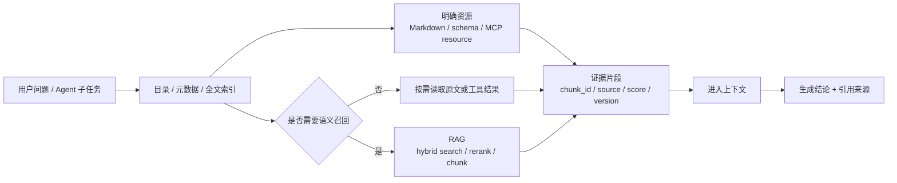

因此，RAG 在手册里的位置应该是“必要时引入的证据增强机制”，不是 Agent 系统的入门门槛。会用 RAG 是能力；知道什么时候不用 RAG，是架构判断。

### 6.4 结构化知识资产治理

企业 Agent 的知识系统不应该只问“怎么召回”，还要问“召回的东西能不能用”。知识资产需要有来源、状态、索引、证据、测试和生命周期。否则知识库越大，污染面越大。

更稳的知识资产链路如下：

```text
Knowledge Source
  - 原始文档
  - 规范
  - 工单
  - 代码
  - 历史案例
        │
        ▼
Knowledge Document
  - 可读 Markdown / 结构化文档
  - 保留来源路径和版本
        │
        ▼
Knowledge Item
  - FAQ
  - procedure
  - spec
  - api
  - troubleshooting
  - decision record
        │
        ▼
Knowledge Index
  - topic
  - product / module / version / error_code
  - owner / status / updated_at
        │
        ▼
Evidence Record
  - source_ref
  - claim_status
  - derived_locator
  - confidence
        │
        ▼
Agent Reading Test
  - 指定问题
  - 期望读取路径
  - 期望证据
  - 不允许回答的边界
```

知识状态要和文档类型分开。`workflow`、`faq`、`troubleshooting` 是类型，不是可信度。可信度至少要有三档：

| 状态 | 含义 | Agent 使用策略 |
|---|---|---|
| `verified` | 有清楚来源，已被复核，可作为主要依据 | 可以支撑结论，但仍要引用来源 |
| `needs_review` | 有证据线索，但还需要版本、适用范围或人工复核 | 必须标注不确定性，不做强承诺 |
| `experience_only` | 来自经验、聊天、历史处理线索或未复核案例 | 只能作为追问、排查方向或候选假设 |

最容易出错的是把派生产物当成正式事实。例如模型清洗后的文本、chunk、embedding 命中结果、自动摘要，都只能作为定位线索，不能替代原始证据。它们可以进入 `derived_locator`，但不能成为最终结论的唯一来源。

```text
知识证据表推荐字段

primary_source_path:
  原始资料、已验证抽取结果或权威系统记录

evidence_index:
  对应证据索引文档或证据记录 ID

derived_locator:
  可选，记录 chunk、清洗文本、抽取行号等派生定位

claim_status:
  verified / needs_review / experience_only

applicability:
  适用版本、场景、时间范围和限制条件
```

结构化知识资产的目标不是让所有知识都变成数据库字段，而是让 Agent 在回答前知道：哪些事实可靠，哪些只是线索，哪些已经过期，哪些互相冲突，哪些必须转人工或追问。

### 6.5 记忆是资产，也是污染源

记忆不是把聊天历史长期保存。真正有价值的记忆包括用户偏好、业务事实、历史决策、常用流程、错误教训、审批偏好、实体关系和长期目标。记忆让 Agent 有连续性，但错误记忆会在后续任务中反复放大。

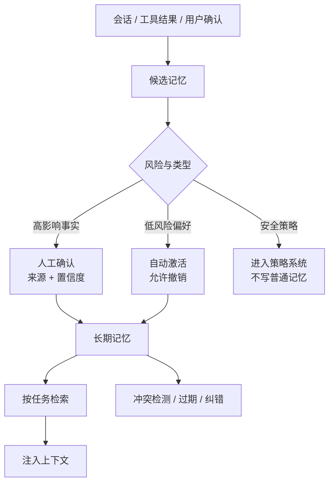

记忆写入要遵循“候选、确认、激活”的流程。模型可以提出候选记忆，但不能把任意内容直接写成永久事实。安全相关偏好不能由模型自作主张，比如“以后总是允许修改生产策略”必须进入审批和策略系统，而不是写入普通记忆。

### 6.6 成长型 Agent 的四类记忆

Hermes 的学习闭环说明，长期 Agent 的记忆不应该只等同于“向量库里搜历史聊天”。一个真正会成长的 Agent，至少要区分四类记忆：片段记忆、用户画像、会话搜索和程序性技能。

| 记忆类型 | 保存什么 | 典型载体 | 主要风险 |
|---|---|---|---|
| **片段记忆** | 用户明确偏好、重要事实、长期目标、历史结论 | MEMORY 类文件、数据库记录、记忆服务 | 误写、遗漏、过期、冲突 |
| **用户画像** | 对用户习惯、表达方式、目标偏好的持续建模 | USER 类文件、profile service、用户模型 | 过度推断、刻板化、难纠错 |
| **会话搜索** | 历史对话、历史工具结果、历史决策依据 | FTS / 向量索引 / 结构化转录 | 召回错误、越权召回、引用不准 |
| **程序性技能** | “怎么做某类任务”的流程经验 | Skill 文档、工作流、规则、模板 | 低质量技能污染后续任务 |

```text
成长型 Agent 的记忆系统

用户对话 / 工具结果 / 审批结论 / 任务轨迹
        │
        ├─> 片段记忆：我知道哪些事实
        ├─> 用户画像：我如何理解这个用户
        ├─> 会话搜索：我能召回哪些历史上下文
        └─> 程序性技能：我知道怎么做这类任务
                         │
                         ▼
                 下一次任务的上下文与行动策略
```

这四类记忆的治理方式不同。片段记忆要有来源、置信度、过期和冲突检测；用户画像要允许用户查看和纠正；会话搜索要做权限过滤和引用；技能要有适用范围、版本、测试和评审。把它们都塞进一个“memory”概念里，会让系统既难解释，也难治理。

---

## 七、治理与安全

### 7.1 信任层级必须绑定工具

Agent 权限必须分层。最实用的分法是 L0 到 L3。L0 是无副作用读取，Agent 可以自主执行；L1 是低风险副作用，可以执行但要事后记录；L2 是高风险变更，必须事前审批；L3 是极高风险动作，需要多人审批、冷静期、二次确认，甚至禁止 Agent 执行，只允许提供建议。

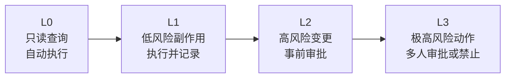

| 层级 | 典型动作 | 系统行为 | 失败代价 |
|---|---|---|---|
| L0 | 查询、读取、检索、分析 | 自动执行 | 低，主要是信息泄露风险 |
| L1 | 标记、草稿、低风险通知、低风险记忆 | 自动执行并记录 | 中，可能造成轻微扰动 |
| L2 | 修改配置、创建资源、代表用户发送正式消息 | 生成方案，等待审批 | 高，会改变业务状态 |
| L3 | 批量删除、注销身份、资金转移、敏感数据导出 | 多人审批或禁止执行 | 极高，可能不可逆 |

模型没有权力把 L2 自行降成 L0。真正的强约束要在 PermissionEngine 中执行：工具注册时声明 trust level，模型提出工具调用，权限引擎读取用户、Agent、租户策略和工具风险，决定 allow、ask 或 deny。

Claude Code 的公开产品形态给了一个很好的参考：工具能力越强，权限链路越不能靠一个弹窗解决。更稳的做法是把模型动作、Hook、settings / 策略、用户确认和审计串成一条确定性链路。

```text
工具调用前的治理链路

模型提出 tool_call
  │
  ▼
动作协议校验
  - tool 是否存在
  - arguments 是否符合 schema
  - 是否超过预算 / 重复调用限制
  │
  ▼
工具可见性与策略过滤
  - 用户 scope
  - Agent scope
  - 租户策略
  - 企业 deny list
  │
  ▼
PreToolUse Hook
  - 参数检查
  - 敏感路径 / 敏感资源拦截
  - 风险升级
  │
  ▼
PermissionEngine
  - L0 / L1: 自动执行并记录
  - L2: 事前审批
  - L3: 多人审批或禁止
  │
  ▼
ToolExecutor
  - 超时 / 限流 / 幂等 / 输出截断
  │
  ▼
PostToolUse Hook + Audit + Trace
```

这个链路的重点是：模型只负责提出动作，不负责决定动作是否安全。Prompt 可以提醒模型识别风险，但真正的放行、拦截、审批和审计必须在运行时和治理层完成。

### 7.2 人机协作自动化等级

工具信任层级解决“这个动作有多危险”，但企业落地还需要另一个维度：Agent 在这类任务里应该自动化到什么程度。一个低风险工具也可能处在高责任场景里；一个高风险任务也可能允许 Agent 做只读分析。

可以把人机协作分成 A0 到 A4：

| 等级 | Agent 行为 | 人的角色 | 典型动作 |
|---|---|---|---|
| **A0：只读观察** | 读取信息、汇总状态、整理证据 | 无需实时参与 | 查文档、查状态、汇总历史 |
| **A1：建议生成** | 生成建议、草稿、风险提示，不执行外部动作 | 判断者 | 诊断建议、报告草稿、方案对比 |
| **A2：低风险执行** | 执行可逆、低影响动作，并记录 | 事后审阅 | 创建草稿、补充标签、生成内部记录 |
| **A3：审批后执行** | 生成方案，审批后执行 | 审批者 | 发送正式消息、修改配置、提交变更 |
| **A4：专家裁决** | 只做辅助分析和证据整理 | 专家或责任人决策 | 责任判定、重大承诺、不可逆处置 |

这套等级要和 L0-L3 工具风险交叉使用。

```text
L0-L3：工具或动作本身的风险等级
A0-A4：某类任务的人机协作自动化等级
```

例如，同一个“读取历史记录”工具可能是 L0，但在高责任任务中只能支持 A1 建议生成；同一个“发送消息”工具可能是 L2，在低风险内部场景中可以审批后执行，在高责任外部场景中只能生成草稿。

升级人工或专家的条件应该写进能力模块和治理策略，而不是交给模型临场发挥：

| 升级条件 | 处理方式 |
|---|---|
| 证据来源冲突 | 停止自动结论，输出冲突点和需要裁决的问题 |
| 缺少关键上下文 | 追问，不用猜测补全 |
| 涉及不可逆动作 | 降级为建议或进入 A3/A4 |
| 涉及正式承诺 | 生成草稿和风险点，由责任人确认 |
| 超出知识覆盖范围 | 明确说明缺口，转人工或创建知识补全任务 |

### 7.3 IAM：Agent 既是主体，也是代理

Agent 的身份管理比普通服务复杂，因为 Agent 可能以自身身份行动，也可能代表用户行动。最终权限应该取交集：用户权限、用户授权范围、Agent 自身权限、企业策略、工具信任层级、当前会话约束。

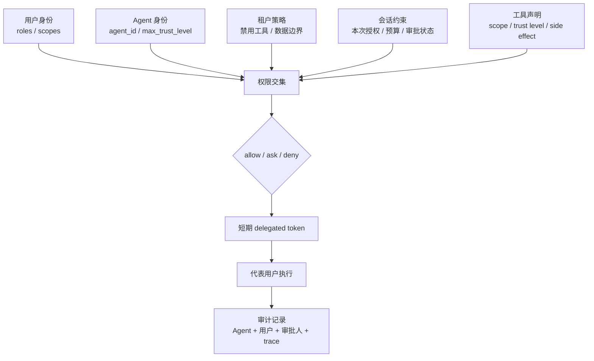

常见错误是让 Agent 使用一个长期静态 API Key 调所有后端服务。这会让审计失去意义：你只能看到“Agent 调用了接口”，看不到它代表谁、基于什么授权、是否超过用户权限。

### 7.4 Prompt Injection 的防线

Agent 安全的特殊性在于模型输出可能变成真实动作。Prompt Injection 在问答系统里可能导致错误回答，在 Agent 系统里可能导致邮件发送、文件删除、配置修改、数据导出。

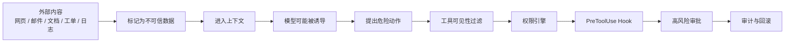

防御 Prompt Injection 的关键不是“告诉模型不要被注入”，而是指令和数据分离、外部内容不可信标记、工具最小权限、高风险审批、输出审计和执行前确定性校验。即使模型被诱导提出危险动作，权限引擎也必须拦截。

### 7.5 Hooks：把 Agent 生命周期暴露成工程接口

Hooks 是 Claude Code 最值得学习的设计之一。它的价值不在于事件名字本身，而在于把 Agent 生命周期中的关键时刻暴露给确定性系统，让团队可以把安全规则、质量门禁、审计、通知和上下文保护接进去。

| Hook 类别 | 代表时机 | 适合做什么 |
|---|---|---|
| 会话开始 / 结束 | `SessionStart`、`SessionEnd` | 初始化项目上下文、记录统计、清理临时状态 |
| 用户输入前 | `UserPromptSubmit` | 输入校验、补充 issue / 分支 / 环境信息、拦截违规请求 |
| 工具执行前 | `PreToolUse` | 参数校验、敏感路径拦截、风险升级、策略检查 |
| 工具执行后 | `PostToolUse` | 格式化、lint、结果脱敏、审计、指标记录 |
| 上下文压缩前 | `PreCompact` | 保存硬约束、审批状态、关键证据和待办 |
| Agent 尝试停止 | `Stop`、`SubagentStop` | 完成度检查、测试结果检查、阻止过早结束 |
| 通知 | `Notification` | 等待审批、长任务空闲、后台任务完成提醒 |

```text
Agent 生命周期中的 Hook 插入点

SessionStart
  │
  ▼
UserPromptSubmit ──> 构造上下文 ──> 模型推理
                                      │
                                      ▼
                               PreToolUse
                                      │
                                      ▼
                                工具执行
                                      │
                                      ▼
                               PostToolUse
                                      │
                                      ▼
                              结果回写上下文
                                      │
                     ┌────────────────┴────────────────┐
                     ▼                                 ▼
                PreCompact                         Stop
                     │                                 │
                     ▼                                 ▼
                压缩上下文                    完成 / 继续 / 阻断
```

Hooks 的工程价值是“把概率系统接上确定性规则”。模型擅长理解语义，但组织安全、合规、发布流程、代码质量、成本限制更适合用确定性脚本或策略表达。不要把所有控制都写进 prompt；prompt 适合表达偏好和意图，Hook 适合执行可测试、可审计、可复用的规则。

Hook 也不能被神化。Stop Hook 不能变成无限自我改进循环，模型 Hook 不能替代确定性安全检查，Hook 数量也不应该写成固定架构事实。一个成熟系统要给 Hook 设置超时、失败语义、重试策略、观测字段和权限边界，否则 Hook 本身会成为新的不稳定点。

### 7.6 高风险行业 Agent：先定义责任边界

医疗、金融、法律、运维、生产控制、身份管理这类高风险行业不能按普通助手设计。这里的核心问题不是模型能不能给出“看起来专业”的建议，而是错误输出或错误行动会不会造成现实损害：延误就医、错误交易、错误合同判断、误删生产资源、泄露敏感数据、代表用户做出不可逆决定。

以医疗 Agent 为例，最重要的不是创业赛道、模型选型或知识库规模，而是角色边界。系统应该明确自己是信息工具、文档辅助、证据整理、分诊建议或医生工作流助手，而不是替代医生做诊断和治疗决策。类似原则也适用于法律、金融和运维：Agent 可以辅助分析、汇总证据、生成草稿和提出风险提示，但不能绕过专业人员、组织流程和法定责任主体。

| 边界 | 高风险行业要求 | 医疗场景示例 |
|---|---|---|
| **角色边界** | 明确 Agent 是辅助系统，不是最终责任主体 | 不声称“诊断疾病”或“替代医生” |
| **输出边界** | 输出建议、证据、风险分层和下一步建议，而不是最终裁决 | “可能情况 + 建议就医”优于“你患有某病” |
| **升级边界** | 高风险信号必须触发人工接管或紧急指引 | 胸痛、呼吸困难、高危症状直接建议急诊 |
| **证据边界** | 结论必须引用来源、时间、版本和适用范围 | 医学指南、药物说明、患者提供信息要区分 |
| **数据边界** | 最小化采集、敏感数据加密、访问审计、可删除 | 健康数据、病历、影像、用药记录不能随意进入长期记忆 |
| **复核边界** | 专业人员审核高风险输出，持续抽检质量 | 医生审核症状分诊、药物相互作用、影像辅助结果 |
| **合规边界** | 法律文本是配套，不是安全机制 | 免责声明不能替代权限、审计、人工接管和质量评估 |

高风险行业的治理链路应该比普通 Agent 更保守：

```text
用户输入
  │
  ▼
风险识别
  - 是否涉及生命健康、资金、法律责任、生产系统或敏感身份
  │
  ▼
能力降级
  - 只读分析 / 信息参考 / 草稿生成 / 建议下一步
  │
  ▼
证据要求
  - 来源、版本、时间、适用范围、置信度、缺失信息
  │
  ▼
人工接管
  - 专业人员复核 / 审批 / 紧急升级
  │
  ▼
审计与回归
  - 记录输入、证据、模型动作、人工决策和最终输出
```

这里有一个容易被误解的点：免责声明不是安全架构。免责声明可以帮助用户理解产品定位，但它不能阻止模型越权、不能保证事实正确、不能处理紧急情况、不能替代专业复核。真正的安全来自角色边界、工具权限、证据引用、人工接管、数据治理、审计和评估。

因此，高风险行业 Agent 的默认策略应该是“先保守，后扩权”。第一版只做低风险的信息整理、文档辅助、证据检索和草稿生成；只有在数据质量、专业复核、责任链路、隐私合规和回归评估都成熟后，才逐步进入更高风险的辅助决策场景。

---

## 八、多 Agent、技能与自我进化

### 8.1 多 Agent 的价值是隔离，不是角色扮演

多 Agent 的价值不在于“多个角色互相聊天”，而在于把复杂任务拆成可隔离的上下文、工具和责任。主 Agent 负责理解用户目标、拆解任务、决定委托、聚合结果；子 Agent 负责在受限工具集和受限上下文内完成专业子任务。

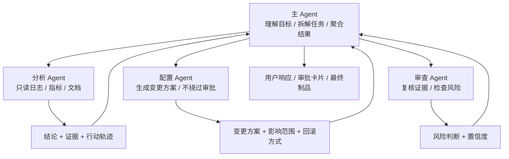

什么时候需要子 Agent？当任务需要大量独立阅读、可以并行调查、涉及不同工具域、上下文会淹没主会话、需要专业复核时，子 Agent 有价值。什么时候不需要？当任务很短、下一步强依赖上一步、权限很高、目标还不清楚时，主 Agent 自己处理更稳。

子 Agent 不应默认继承主 Agent 权限。分析 Agent 可以读日志但不能改配置；配置 Agent 可以生成变更方案但不能绕过审批；审查 Agent 可以读取 diff 和测试结果但不能写生产系统。

Claude Code 的 subagents 值得学习的地方，也不是“多 Agent 数量越多越强”，而是专业化上下文。一个 code-reviewer 子代理可以只关注质量、安全和可维护性，一个 test-runner 子代理可以只关注失败测试和修复路径，一个 debugger 子代理可以只关注复现、日志和根因。它们的价值在于把上下文窗口、工具权限和输出格式都收窄。

```text
Subagent 的正确边界

主 Agent
  │
  ├─ 委托 code-reviewer
  │    ├─ 上下文：diff / 相关文件 / 项目规范
  │    ├─ 工具：只读文件 / 静态检查 / 测试结果
  │    └─ 输出：问题列表 / 证据 / 风险等级
  │
  ├─ 委托 test-runner
  │    ├─ 上下文：测试命令 / 失败日志 / 最近改动
  │    ├─ 工具：运行测试 / 读取日志
  │    └─ 输出：失败原因 / 复现步骤 / 建议修复
  │
  └─ 委托 domain-analyst
       ├─ 上下文：业务规则 / RAG 证据 / 只读数据
       ├─ 工具：查询 / 分析 / 引用
       └─ 输出：结论 / 证据 / 置信度
```

这类设计迁移到企业 Agent 时，子 Agent 的输入应包含任务说明、允许工具、最大工具调用次数、超时、信任上限和输出 schema。输出不应是长篇自由文本，而应是结论、证据、行动轨迹、风险和建议下一步。主 Agent 聚合的是结构化结果，不是子 Agent 的完整对话。

### 8.2 经验固化：让 Agent 越用越便宜

Agent 的早期价值来自灵活推理，但长期价值来自经验固化。高频、稳定、可验证的任务不应该永远靠 LLM 每次重新推理。系统应该从行动轨迹中识别重复模式，把稳定路径提炼成工作流、规则、工具组合或子 Agent 定义，经过验证和审批后成为结构化制品。

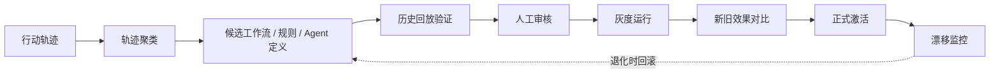

制品不是任意代码，而是受 schema 约束的对象。常见制品包括工具契约、业务规则、工作流 DAG、Agent 定义、提示模板、检索配置、呈现组件配置。Schema 的意义是限制 AI 生成空间，让生成物可以自动校验、回放验证、灰度发布和回滚。

### 8.3 Schema Registry 与制品生命周期

企业级 Agent 的“自我进化”不能理解成模型自由改系统。更稳的做法是把可生成对象收敛成有限类型的结构化制品，并用 Schema Registry 管理这些制品的形状、版本和生命周期。

```text
Schema Registry 管理什么

工具契约 Schema
  - 工具名、输入输出、风险等级、scope、审计策略

业务规则 Schema
  - 条件、动作、适用范围、优先级、回滚方式

工作流 Schema
  - 节点、依赖、条件分支、失败回退、人工审批点

Agent 定义 Schema
  - 角色、允许工具、信任上限、上下文范围、输出格式

呈现组件 Schema
  - 表格、图表、时间线、审批卡片、报告片段
```

制品生命周期必须比“生成后保存”严格得多。

```text
draft -> validated -> approved -> canary -> active -> deprecated
  │          │            │          │          │
  │          │            │          │          └─ 下线但保留审计与回滚记录
  │          │            │          └─ 灰度运行，新旧效果对比
  │          │            └─ 人工审批，不能由模型自行跳过
  │          └─ Schema 校验、静态检查、历史回放
  └─ 模型生成或人工创建的候选制品
```

| 阶段 | 系统要做什么 | 不能做什么 |
|---|---|---|
| draft | 保存候选制品、记录来源和生成 trace | 直接进入线上执行 |
| validated | 做 schema 校验、依赖检查、历史样本回放 | 只校验 JSON 合法性就放行 |
| approved | 让有权限的人确认影响范围和回滚方式 | 让模型自批自用 |
| canary | 在小范围或影子流量中对比新旧效果 | 全量替换旧策略 |
| active | 正式生效并持续监控 | 忘记版本、来源和效果指标 |
| deprecated | 保留历史版本和审计记录 | 物理删除导致无法复盘 |

这个体系的核心价值，是把“AI 生成能力”从开放空间压缩到受控空间。模型可以提出候选工具、规则、工作流或子 Agent 定义，但上线权属于校验、审批、灰度和评估链路。这样既能利用模型发现模式和提炼经验，也不会让一次错误经验直接污染未来系统。

### 8.4 Hermes 样板：封闭学习闭环

Hermes 最值得学习的地方，是把“Agent 会成长”做成系统一等公民。它不是只把历史对话放进检索库，而是把片段记忆、用户画像、会话搜索、技能自创建组合成一个封闭学习闭环：Agent 使用越多，越了解用户，也越会处理重复任务。

```text
Hermes 式封闭学习闭环

用户对话
   │
   ▼
┌─────────────────────────────────────────────────────────────┐
│ 运行时轨迹                                                    │
│  · 用户目标                                                   │
│  · 工具调用                                                   │
│  · 中间结论                                                   │
│  · 成功 / 失败 / 用户纠正                                     │
└───────────────┬─────────────────────────────────────────────┘
                │
      ┌─────────┼─────────┬─────────────────┬────────────────┐
      ▼         ▼         ▼                 ▼                ▼
  片段记忆   用户画像   会话搜索          技能候选         轨迹数据
  facts      profile    retrieval         skill draft       eval/RL
      │         │         │                 │                │
      └─────────┴─────────┴─────────────────┴────────────────┘
                                │
                                ▼
                       下一次任务更少从零开始
```

这个闭环比普通 RAG 更进一步。RAG 解决“我能不能找到相关信息”，学习闭环解决“系统是否能把经验变成未来行为的一部分”。这也是长期 Agent 和一次性 Agent 的分水岭。

但学习闭环不能放任自流。每一次自动写入记忆、生成技能、更新用户画像，都会改变未来系统行为。成长型 Agent 的关键问题不是“能不能记住”，而是“记住之后是否可解释、可纠错、可回滚、可评估”。

### 8.5 Skill：程序性记忆，不是工具

Hermes 的 Skills 系统最值得吸收的概念，是把技能理解为**程序性记忆**。Tool 是确定性的能力接口，Skill 是“如何完成某类任务”的过程性知识。前者更像 API，后者更像操作手册。

| 维度 | Tool | Skill |
|---|---|---|
| 本质 | 确定性函数或外部能力接口 | 过程性知识、操作流程、经验手册 |
| 输入输出 | 强 schema，参数和结果可校验 | 文档化指导，依赖模型理解和执行 |
| 适合承载 | 查询、写入、执行、检索、计算 | 任务流程、最佳实践、排障步骤、写作规范 |
| 风险 | 越权、副作用、输出污染 | 错误经验固化、适用范围不清、版本漂移 |
| 治理方式 | 权限、审批、限流、审计、幂等 | 评审、测试、版本、适用条件、退役机制 |

```text
Tool vs Skill

Tool：让 Agent 能做一件事
  例：search_logs(query)、update_policy(id, value)、send_message(to, body)

Skill：让 Agent 知道怎样做好一类事
  例：如何排查线上延迟升高
      1. 先看入口流量和错误率
      2. 再按服务拓扑查 P95
      3. 对比最近发布和配置变更
      4. 输出根因、证据和回滚建议
```

系统手册前面提到的经验固化，可以进一步拆成两层：稳定、低分支、强验证的经验适合固化为工作流或规则；仍然需要模型判断、但有明确操作套路的经验适合固化为 Skill。Skill 不应该直接拥有高风险权限，它只是指导模型如何规划和使用工具。

### 8.6 自我进化系统的风险边界

Hermes 的不足也很值得补进手册，因为它暴露了成长型 Agent 的真实风险：同步主循环会限制并发，技能自动生成会带来质量问题，记忆写入如果依赖模型自觉会出现遗漏和冲突，配置系统长期演进会分裂，工具数量膨胀会增加模型选择负担。

| 风险 | 现象 | 工程边界 |
|---|---|---|
| 同步主循环瓶颈 | 长工具调用阻塞整个 Agent | 服务端 Agent 应考虑异步执行、任务队列和可恢复状态 |
| 技能质量失控 | 低质量 Skill 被反复使用 | Skill 必须有评审、测试、适用范围、版本和退役机制 |
| 记忆一致性不足 | 重要信息漏记、旧记忆和新事实冲突 | 记忆写入要有候选、确认、冲突检测和来源追踪 |
| 配置系统分裂 | 多套配置加载器并存，行为难解释 | 企业 Agent 要尽早统一配置层级和优先级 |
| 工具数量膨胀 | 模型在大量工具中误选 | Toolset 分层、按需暴露、工具搜索和工具质量评估 |

```text
成长型 Agent 的风险链路

一次错误经验
  └─> 写入记忆 / 生成 Skill / 更新用户画像
        └─> 进入后续任务上下文
              └─> 影响工具选择和判断
                    └─> 产生新的错误轨迹

打断这条链路的方法：
  · 记忆候选态
  · Skill 评审和测试
  · 来源追踪
  · 用户可纠错
  · 版本回滚
  · 回归评估
```

因此，Agent 自我进化不是“让模型自己学就行”。工程上要把学习对象结构化，把激活路径治理化，把退化检测自动化。真正成熟的成长型 Agent，不是永远记得更多，而是能证明哪些记忆和技能值得保留，哪些应该修正或删除。

---

## 九、观测与评估

### 9.1 Agent 必须能解释过程

Agent 的可观测性不能只记录最终回答。一次任务至少要能追踪：用户输入、会话 ID、模型选择、输入输出 token、可见工具、模型动作、权限决策、审批状态、工具参数、工具结果、错误、成本、延迟、最终结论。

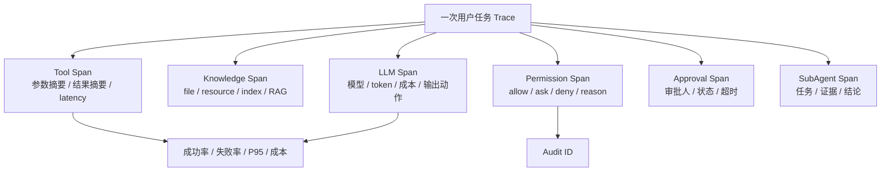

Trace 是 Agent 观测的核心。一次用户任务是一个 trace，模型调用、工具调用、知识读取、权限裁决、审批等待、子 Agent 委托都是 span。知识读取既包括文件、Markdown、MCP resource、全文索引，也包括必要时的 RAG 检索。高风险动作 span 要关联 audit id，审批 span 要关联审批人和审批结果。

Claude Code 和 OpenAI Agents 这类产品都指向同一个趋势：Agent 不能只看最终回答，必须把过程变成 trace，把 trace 变成 eval，把 eval 变成发布门禁。尤其是 coding agent，失败经常不是模型“答错一句话”，而是某一步工具选择、文件修改、命令执行、上下文压缩或权限确认出了问题。

一次可复盘的 Agent trace 至少要能回答这些问题：

| 问题 | 需要记录的事实 |
|---|---|
| 模型为什么这么做 | 输入摘要、可见工具、模型动作、动作 reason |
| 工具为什么能执行 | 用户身份、Agent 身份、权限决策、审批状态 |
| 工具实际做了什么 | 参数摘要、执行环境、输出摘要、错误、耗时 |
| 上下文是否污染 | 注入了哪些文件、资源、索引结果、RAG 片段、记忆、工具结果、压缩摘要 |
| 用户是否接管 | 接管发生在哪一步，原因是什么，后续如何恢复 |
| 成本在哪里消耗 | 每轮 token、工具调用次数、检索次数、子 Agent 扇出 |

### 9.2 Agent 的测试对象是链路

Agent 评估要分层。第一层是意图识别：同一意图的不同表达是否能识别，模糊意图是否会追问，不该执行的请求是否拒绝。第二层是工具选择：给定意图是否选对工具，参数是否正确，默认值是否合理。第三层是权限：L0 是否自动执行，L2 是否审批，缺少 scope 是否拒绝，Prompt Injection 是否无法绕过。第四层是端到端：复杂任务是否按正确顺序执行，失败是否恢复，最终结果是否有证据。

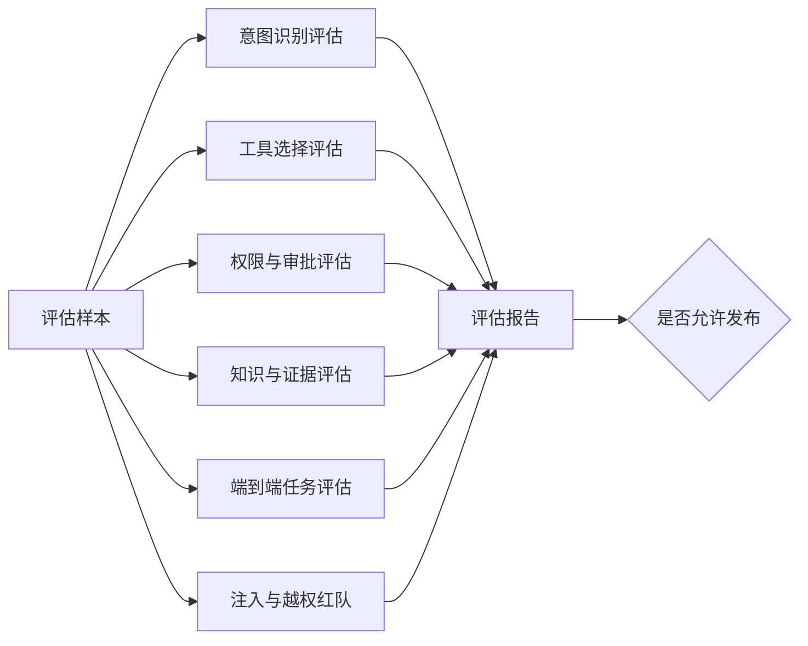

最关键的指标不是“模型回答好不好”，而是任务成功率、工具选择准确率、参数正确率、信任层级正确率、审批漏触发率、事实忠实度、引用准确率、成本/成功任务、人工接管率。

| 指标 | 说明 | 不能妥协的红线 |
|---|---|---|
| 工具选择准确率 | 意图是否映射到正确工具 | 高风险工具误选必须单独统计 |
| 参数正确率 | 工具参数是否完整、合法、符合意图 | 不能靠工具异常兜底 |
| 信任层级正确率 | L0/L1/L2/L3 是否判对 | L2 误判为 L0 是严重事故 |
| 引用准确率 | 文件、资源、索引或 RAG 证据是否支持结论 | 不能引用无关来源 |
| 成本/成功任务 | 成功完成一个任务的平均成本 | 不能用无限 token 换成功率 |
| 人工接管率 | 用户或人工审核者被迫中断 Agent 的比例 | 要能定位接管原因 |

### 9.3 Agent 测试分层

Agent 测试不能只靠“问几个问题，看回答像不像”。测试体系要覆盖从确定性模块到真实模型链路的多个层次。

| 层级 | 测什么 | 典型方式 |
|---|---|---|
| 单元测试 | 工具、权限、索引、状态机、Hook | 纯代码测试，不调用真实模型 |
| 集成测试 | LLM 决策、工具执行、结果回写、停止检查 | stub LLM 或固定决策脚本 |
| Stub LLM 测试 | 关键路径是否稳定、便宜、可重复 | 模拟 tool_call / final / ask_user |
| Real LLM 测试 | 真实模型是否按预期使用工具和证据 | 默认关闭，通过环境变量或专门任务开启 |
| Mission 测试 | 一组真实任务能否端到端完成 | 固定题集、固定验收字段、生成报告 |
| 人工 Review | 答案是否正确，证据是否支撑，风险标注是否合格 | 抽检或全量复核高风险样本 |
| Trace Replay | 失败样本能否复现，修复后是否回归 | 把失败 trace 转成回归 case |

真实模型测试要谨慎进入日常 CI。普通回归应该默认使用 stub LLM，保证稳定、便宜、可重复；真实模型测试适合在模型升级、prompt 改动、工具契约变更、关键版本发布前运行。

Mission 测试比零散问答更有价值。一个合格的 mission case 至少要记录：

```yaml
id: mission-001
input: "用户目标或任务描述"
expected_route: "应该选择的能力模块或子 Agent"
required_tools:
  - index_lookup
  - document_read
expected_evidence:
  - "必须引用的证据类型或证据 ID"
must_not:
  - "不能编造未验证事实"
  - "不能执行高风险动作"
review_points:
  - "结论是否被证据支撑"
  - "是否正确追问缺失信息"
  - "是否正确升级人工"
```

Agent 测试的最终目标不是证明模型“聪明”，而是证明系统在关键决策点上可解释、可复现、可回归。

### 9.4 Dogfood 复盘：架构正确不等于真实可用

内部 dogfood 的价值，是尽早暴露“架构看起来正确，但真实任务跑不通”的问题。真实模型进入闭环后，失败通常不是单点 bug，而是工具反馈、上下文、知识覆盖、模型选择、重试策略和评估门禁共同作用的结果。

复盘时至少看这些指标：

| 指标 | 要回答的问题 |
|---|---|
| 任务成功率 | 最终是否完成真实目标，而不是只输出漂亮文本 |
| 平均耗时 | 时间花在模型推理、工具执行、等待审批还是重试 |
| 工具调用轮次 | 是否存在无意义搜索、重复读取、同工具循环 |
| 证据命中率 | 结论是否真的读取并引用了证据 |
| 无依据回答比例 | 是否出现格式合规但事实无依据的回答 |
| 子 Agent 成功率 | 委托是否真的缩小问题，还是增加延迟 |
| 人工接管率 | 哪些任务必须人工接管，原因是什么 |
| 成本/成功任务 | 成功一次到底消耗多少 token、工具调用和人工时间 |

常见失败模式可以抽象成五类：

| 模式 | 表现 | 根因方向 |
|---|---|---|
| 搜索循环 | Agent 一直改 query，不进入读取或执行阶段 | 工具输出缺少“命中足够，下一步读取”的信号 |
| 参数幻觉 | 模型把标题、路径或摘要改写成不存在的 ID | schema 缺少类型语义和合法值示例 |
| 无目的重试 | 主 Agent 反复派发同一任务或换相近子 Agent | critic / error 信息太抽象，缺少可执行修复建议 |
| 证据缺失兜底 | 最终回答有结构和标签，但没有真实证据 | 停止条件和输出门禁没有强制证据 |
| 延迟失控 | 大量时间花在多轮模型决策而非工具执行 | 模型选择、任务拆分、工具组合和预算策略不匹配 |

这些失败不一定说明架构方向错了。很多时候，问题是反馈环路太薄：工具没有告诉模型下一步，上下文没有暴露能力边界，子 Agent 的失败没有带诊断信息，主 Agent 只能继续猜。

复盘后的改进动作应该落到确定对象上：

| 改进对象 | 可执行动作 |
|---|---|
| 工具契约 | 增加 `next_action_hint`、`retry_hint`、合法值示例和错误语义 |
| 工具结果 | 增加证据引用、已尝试输入、剩余可选路径 |
| 上下文 | 注入能力边界、知识范围和当前 domain inventory |
| 子 Agent 输出 | 返回结构化结论、证据、失败原因和建议下一步 |
| 停止条件 | 无证据不允许 final，高风险必须追问或升级 |
| 测试集 | 把失败 trace 固化成 mission 或 replay case |

Dogfood 的核心判断是：**信息不足下的自主性，不是真自主性**。Agent 自主决策的前提，是每个决策点都有足够清晰的状态、工具反馈、错误语义和下一步提示。

---

## 十、落地路线

### 10.1 从最小系统开始

不要一开始就做多 Agent、长期记忆、插件市场、复杂 RAG、自动工厂和工作流固化。第一版系统的目标是证明一条链路：用户目标进入系统，模型读取结构化上下文和只读工具，工具结果回写上下文，最终回答带证据，trace 可以复盘。

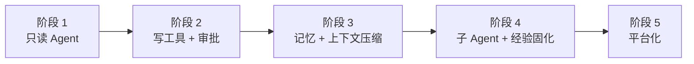

| 阶段 | 建设重点 | 暂缓内容 | 验收标准 |
|---|---|---|---|
| **第一阶段：只读 Agent** | 意图理解、只读工具、Markdown 规则、多层索引、带证据结论、trace | 长期记忆、写工具、多 Agent、复杂 RAG、自动工厂 | 工具选择稳定，文件和资源可引用，trace 可复盘，成本可统计 |
| **第二阶段：写工具和审批** | trust level、PermissionEngine、ApprovalService、AuditLog | L3 自动执行、复杂工作流固化 | L0 自动执行，L2 必须审批，缺 scope 拒绝，审批超时不继续执行 |
| **第三阶段：记忆和压缩** | 候选记忆、上下文压缩、证据保留 | 自动写长期事实、激进压缩 | 记忆可查看、可删除、可追溯；压缩后回归测试不退化 |
| **第四阶段：子 Agent 和固化** | 只读子 Agent、结构化输出、轨迹提炼工作流候选 | 子 Agent 继承主 Agent 全权限 | 子 Agent 不越权，主 Agent 能聚合，固化流程经过回放和灰度 |
| **第五阶段：平台化** | Gateway、模型路由、Schema Registry、评估平台、红队样本、企业配置中心 | 泛化成“万能 Agent” | 系统接近企业 Agent 平台，而不是单点 demo |

### 10.2 企业 Agent Operating Model

Runtime 解决的是 Agent 怎么运行；Operating Model 解决的是组织如何使用 Agent 重构知识、流程和协作。没有 Operating Model，Agent 平台容易变成一组孤立工具：每个团队各自试点，每个场景各自写 prompt，知识和反馈继续分散。

企业 Agent Operating Model 至少要回答五个问题：

| 问题 | 要定义的内容 |
|---|---|
| 哪些领域值得 Agent 化 | 高频、高痛、知识密集、数据可得、风险可控的任务优先 |
| 每个专业域 Agent 承担什么角色 | 角色定位、输入、输出、工具、知识、权限、指标 |
| Agent 如何参与流程 | 只读观察、建议生成、低风险执行、审批后执行、专家裁决 |
| 经验如何沉淀 | 成功案例、人工修正、失败 trace、知识补全、Skill 固化 |
| 价值如何证明 | 解决率、耗时、人工接管率、证据命中率、成本/成功任务 |

可以把企业 Agent 建设抽象成三层：

```text
Runtime Layer
  - 状态机
  - 工具执行
  - 权限审批
  - trace / audit / eval

Capability Layer
  - 专业域 Agent
  - 领域工具组合
  - 领域知识资产
  - 输出契约和评估标准

Operating Layer
  - 业务流程
  - 人机协作等级
  - 责任边界
  - 反馈闭环
  - 组织级指标
```

第一阶段不要追求覆盖所有领域，而应选择一个足够窄、足够真实、可验证闭环的任务打穿。一个好场景通常具备这些特征：

| 特征 | 说明 |
|---|---|
| 高频 | 足够多的任务样本，能持续产生反馈 |
| 高痛 | 人工处理成本高，且知识或流程复杂 |
| 知识密集 | 需要查文档、查历史、看规则、组织证据 |
| 风险可控 | 第一版可以从 A0/A1 开始，不直接执行高风险动作 |
| 可评估 | 有明确的正确性标准、人工复核标准或任务成功信号 |

Operating Model 的核心不是把组织画成 Agent 矩阵，而是让每次任务处理都能留下可复用资产：证据、案例、流程、工具缺口、知识缺口、评估样本和经验规则。

### 10.3 执行环境：从本地到隔离运行

Hermes 的 Run Anywhere 思路提醒我们：Agent 的执行环境也是架构边界。个人 Agent 可以运行在本地终端或移动设备上；开发 Agent 可能需要 Docker、SSH、远程开发环境；企业 Agent 则更需要队列、沙箱、短期凭据、资源隔离和可恢复执行。

| 执行环境 | 适合场景 | 关键边界 |
|---|---|---|
| **Local** | 个人助手、本地开发、低风险自动化 | 本机权限过大，必须控制文件和命令边界 |
| **Docker / Sandbox** | 代码执行、测试、爬取、临时工具运行 | 镜像、网络、卷挂载、资源限制要可控 |
| **SSH / Remote Workspace** | 远程开发机、受控运维环境 | 凭据、命令白名单、审计和回滚 |
| **Serverless / Ephemeral Worker** | 弹性任务、低频后台处理 | 冷启动、状态恢复、外部存储、超时 |
| **Profile / 多实例隔离** | 个人 / 团队 / 环境隔离 | 配置、记忆、技能、凭据不能串用 |

执行环境越接近受控外部系统，越要把“能运行”拆成“能恢复、能审计、能限权、能清理”。这也是个人 Agent 和企业 Agent 的重要分界。

### 10.4 存量系统接入：不要让 Agent 重写业务内核

企业落地通常不是从零做一个 Agent 系统，而是把 Agent 接到已有后台、数据、流程和权限体系上。这里最重要的原则是：**业务内核尽量不动，Agent 层负责重新组织能力边界**。

```text
存量系统接入的推荐分层

用户入口 / 会话入口
        │
        ▼
Agent Runtime
        │
        ▼
Tool Registry + Permission Engine
        │
        ▼
Agent API 层
  - 聚合上下文
  - 计算影响范围
  - 包装幂等与回滚语义
  - 暴露适合模型使用的 schema
        │
        ▼
已有 Service 层
        │
        ▼
数据库 / 消息队列 / 外部系统
```

这条路径有三个好处。第一，传统 UI 和已有 API 可以继续运行，不需要为了 Agent 推倒重来。第二，Agent API 可以按推理步骤重新设计，避免模型被迫连续调用十几个碎片接口。第三，权限、审批、审计和 trace 可以在 Agent 层统一收口，而不是散落到每个业务接口里。

接入时可以按下面的顺序推进：

| 步骤 | 目标 | 验收标准 |
|---|---|---|
| **选择只读核心工具** | 先让 Agent 看懂系统状态 | 只读查询稳定，结果有来源和 trace |
| **设计 Agent API** | 聚合一次推理需要的上下文 | 工具调用次数下降，参数更稳定 |
| **接入权限裁决** | 写操作必须经过 trust level 和 scope | L2 操作无法绕过审批 |
| **加入审批和审计** | 让高风险动作可解释、可追责 | 审批记录能关联用户、Agent、工具和 trace |
| **做会话恢复** | 支持长任务、审批等待、工具超时 | 中断后能恢复到确定性状态 |
| **建立回归样本** | 防止 prompt、模型、工具变更导致退化 | 核心意图、工具、权限和端到端样本可自动跑 |

不要一开始全量包装所有 API。优先选择高频、低风险、可验证的核心能力，把工具描述、schema、输出限制和错误语义打磨稳定。等只读链路、审批链路和 trace 链路都跑通，再逐步扩展写工具、多 Agent 和经验固化。

### 10.5 最小代码骨架

下面的代码不是完整框架，而是把边界钉住：模型只产生动作，运行时推进循环，权限引擎裁决，工具执行器执行，Trace 记录过程。

```python
from dataclasses import dataclass
from enum import Enum
from typing import Any, Literal


class TrustLevel(str, Enum):
    L0 = "L0"
    L1 = "L1"
    L2 = "L2"
    L3 = "L3"


class Decision(str, Enum):
    ALLOW = "allow"
    ASK = "ask"
    DENY = "deny"


@dataclass
class UserContext:
    user_id: str
    tenant_id: str
    scopes: list[str]


@dataclass
class AgentIdentity:
    agent_id: str
    scopes: list[str]
    max_trust_level: TrustLevel
    on_behalf_of: str | None = None


@dataclass
class ToolSpec:
    name: str
    input_schema: dict[str, Any]
    trust_level: TrustLevel
    side_effect: bool
    scopes_required: list[str]


@dataclass
class Action:
    type: Literal["final", "tool_call", "ask_user"]
    content: str | None = None
    tool: str | None = None
    arguments: dict[str, Any] | None = None


class PermissionEngine:
    def decide(self, user: UserContext, agent: AgentIdentity, tool: ToolSpec) -> Decision:
        if not set(tool.scopes_required).issubset(user.scopes):
            return Decision.DENY
        if not set(tool.scopes_required).issubset(agent.scopes):
            return Decision.DENY
        if tool.trust_level in {TrustLevel.L0, TrustLevel.L1}:
            return Decision.ALLOW
        return Decision.ASK
```

只要这几个对象存在，后面接真实模型、真实工具、RAG、审批、审计、观测、评估，都是在清晰边界上扩展。如果一开始没有这些边界，后面补治理会非常痛苦。

### 10.6 最终检查清单

设计 Agent 系统时，可以用下面的问题自检：

| 层面 | 检查问题 |
|---|---|
| **目标层面** | 用户是谁，任务是否高频，错误代价是什么，是否需要代表用户行动，是否能量化价值 |
| **能力层面** | 是否有 Capability Router，领域逻辑是否隔离在能力模块而不是 Runtime Core |
| **运行时层面** | 是否有状态机、预算、停止条件、结构化动作、重复工具断路器、会话恢复 |
| **工具层面** | 是否有 Schema、副作用声明、信任层级、scope、输出限制、错误语义、下一步提示，是否区分存量 API 和 Agent 专属 API |
| **治理层面** | L2 是否强制审批，L3 是否多人审批或禁止执行，Agent 身份和用户身份是否区分，审计是否记录代理关系 |
| **责任层面** | 是否明确 Agent 的角色边界，是否有高风险信号识别、人工接管、专业复核和紧急升级 |
| **上下文层面** | 是否分层，是否支持压缩，是否优先使用 Markdown、显式引用和多层索引，RAG 是否只在必要时引入并做权限过滤 |
| **知识层面** | 知识资产是否有来源、状态、索引、证据路径、适用范围和 reading tests |
| **制品层面** | 工具、规则、工作流、Agent 定义和呈现组件是否有 Schema、生命周期、审批、灰度和回滚 |
| **观测层面** | 是否记录模型调用、工具调用、权限决策、审批、成本和失败 |
| **评估层面** | 是否有意图、工具、权限、端到端、注入攻击、mission、trace replay 和回归样本 |
| **文档层面** | 设计、计划、复盘、知识和测试文档是否有状态和生命周期 |

如果这些问题大部分回答不上来，系统还不应该被称为 Agent 平台。它可能是一个不错的 LLM 应用，但还没有进入 Agent 工程。

---

## 十一、框架选型：从产品形态到生产边界

### 11.1 不要先问“哪个框架最好”

Agent 框架选型最容易被两个问题带偏：第一，把 demo 体验等同于生产可用性；第二，把单点能力对比等同于架构适配。真正的问题不是“哪个框架最好”，而是“这个框架解决哪一层问题，哪些边界可以交给它，哪些边界必须由自己的系统承担”。

框架不是 Agent 系统的起点，而是抽象来源。学习框架时，应该拆三层看：

| 问题 | 关注点 | 错误判断 |
|---|---|---|
| 它的产品形态是什么 | 本地工具、编排库、平台产品，面向的运行环境不同 | 把所有框架放进同一张功能表横向打分 |
| 它的核心抽象是什么 | Agent Loop、状态图、角色团队、消息拓扑、工作流、插件生态 | 只看“有没有 RAG、有没有工具、有没有多 Agent” |
| 它的生产边界在哪里 | 权限、租户、审计、恢复、观测、运维由谁承担 | 把框架文档里的能力默认等同于企业落地能力 |

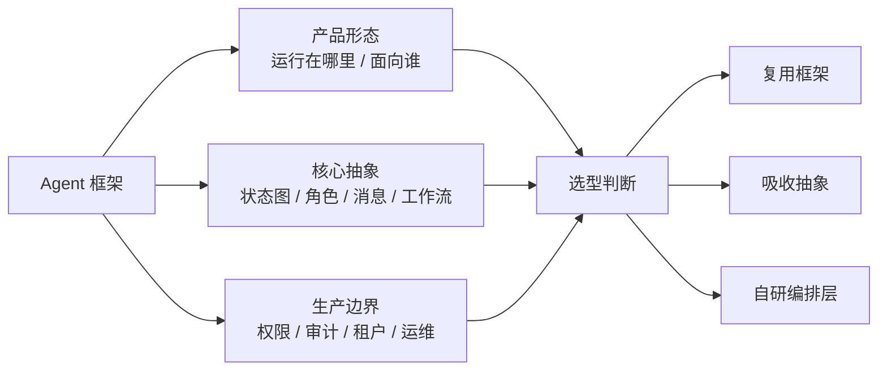

这个判断方式比“功能清单越长越好”更可靠。一个框架可能很适合生产里的工作流编排，但不覆盖多租户、权限、审计、成本控制和灾备；一个工具可能在本地开发体验上非常强，但不能直接拿来做服务端 Agent 后端。

### 11.2 五类 Agent 框架形态

主流 Agent 框架不是同一种东西的多个替代品。更合理的分类，是先按产品形态区分：本地开发者工具、Agent Bridge、自托管个人控制面、通用编排库、平台型产品。

| 类型 | 代表 | 核心形态 | 主要价值 | 主要边界 |
|---|---|---|---|---|
| **本地开发者工具** | Claude Code、OpenAI Codex CLI、Cursor | CLI / IDE / 本地 Agent | 代码上下文、工具调用、权限提示、开发者交互体验 | 通常不是多租户服务端框架 |
| **Agent Bridge / 远程控制总线** | MetaBot | IM / Web 控制面 + 多引擎适配器 | 把 Agent 接入飞书、Telegram、微信、Web 等入口，支持远程调度和后台通知 | 不解决 Agent 本体智能，也不等同于企业治理平台 |
| **自托管个人控制面** | OpenClaw | Gateway / 多渠道 / 本地或个人托管 Agent | 多入口收敛、长期会话、个人运行边界、工具技能插件生态 | 更像个人 Agent 操作系统雏形，不等于企业级多租户平台 |
| **通用编排库** | LangGraph、CrewAI、AutoGen | Python / TypeScript 编排库或多 Agent 框架 | 工作流、状态、消息、角色协作等可嵌入抽象 | 业务权限、租户隔离、审计与治理通常要自己补齐 |
| **平台型产品** | Dify、Coze Studio、Hermes Agent | 可视化平台或完整 Agent 应用 | 应用搭建、知识库、插件、发布、调试等端到端能力 | 嵌入深度、二次开发边界、部署与治理模型需单独评估 |

这个分类的意义在于防止错位比较。Claude Code 的 Hooks 与权限配置很值得学习，但它公开定位是开发者本地工具；MetaBot 的 IM 接入和多引擎桥接很有价值，但它更接近 Agent 远程控制总线；OpenClaw 的 Gateway 理念很重要，但它更接近自托管个人 Agent 控制面；Dify 和 Coze 能快速做 AI 应用，但使用者要接受平台抽象；LangGraph、CrewAI、AutoGen 更适合作为代码层面的编排材料，但不会自动给出企业级治理层。

### 11.3 生产可用性的八个维度

评估 Agent 框架时，不要只问“能不能跑起来”。生产可用性至少要拆成八个维度，每个维度都要明确：框架原生提供、插件提供，还是必须由业务系统自行实现。

| 维度 | 关键问题 | 为什么重要 |
|---|---|---|
| **状态与恢复** | 是否支持长任务状态持久化、断点恢复、失败重试、幂等控制 | Agent 任务经常跨多轮推理和多次工具调用，失败后不能只靠重跑 |
| **人工介入** | 是否支持暂停、审批、修改状态、恢复执行，而不是末尾确认按钮 | 高风险动作需要把 human-in-the-loop 作为正常流程 |
| **权限与安全** | 谁能调用什么工具，危险工具如何审批，输入输出如何脱敏 | 模型不能成为权限主体，工具调用必须有确定性裁决 |
| **多租户与隔离** | 会话、文件、凭据、缓存、向量索引、工具权限是否按租户隔离 | 企业系统不能让上下文、记忆、凭据跨用户污染 |
| **可观测性** | 是否能追踪模型调用、工具调用、状态迁移、错误与成本 | 没有 trace 就无法复盘失败，也无法做回归和成本治理 |
| **上下文治理** | 长上下文如何裁剪、压缩、检索、版本化，错误记忆如何纠正 | 上下文是 Agent 的输入面，也是污染和成本的主要来源 |
| **工具治理** | 工具数量增长后如何发现、选择、限流、回滚、审计 | 工具越多，误选、越权、不可控输出的概率越高 |
| **运维与演进** | 版本升级、API 变更、迁移、监控、灰度、灾备是否有路径 | Agent 系统会随模型、工具和业务策略持续变化 |

很多框架在“能跑一个 Agent”上体验很好，但在这些维度上覆盖程度不同。这个差异不是简单的优劣，而是设计目标不同：通用编排库负责表达控制流，企业系统还要负责组织边界、风险边界和合规边界。

### 11.4 本地开发者工具：工程设计值得借鉴，服务端边界要分清

Claude Code、Codex CLI、Cursor 这类工具的共同点，是把 Agent 放进本地开发环境。它们最有价值的地方，不是作为企业服务端底座，而是展示了“模型如何进入真实工程环境，同时被权限、沙箱、项目上下文和人类确认约束”。

| 工具 | 可吸收的架构抽象 | 适合学习什么 | 不宜直接承担什么 |
|---|---|---|---|
| **Claude Code** | 本地 Agent Loop、工具调用、权限决策、生命周期 Hooks、MCP 扩展 | 如何把“模型想做什么”和“系统允许做什么”拆开 | 多租户 SaaS 后端、中心化租户隔离、跨用户任务调度 |
| **OpenAI Codex CLI** | CLI 驱动的本地 Agent、沙箱、审批策略、项目指令 | 沙箱、审批、项目指令如何影响编码 Agent 行为 | 面向外部用户的多租户 Agent 服务 |
| **Cursor** | IDE 内 Agent、编辑器状态、文件、Git、终端、后台任务 | Agent 如何与具体交互环境深度绑定 | 非代码领域业务 Agent 后端、独立服务端编排层 |

这类工具给企业 Agent 的启发主要有三点。第一，权限提示和执行边界要进入核心交互，而不是事后补一个提示框。第二，项目上下文、规则文件、工具能力和用户意图必须分层进入模型。第三，Agent 与环境结合越深，体验越好，但也越难迁移到通用后端。

如果借鉴这类工具自研服务端，需要重新设计租户隔离、凭据托管、任务队列、审计存储与服务端权限模型。不能把本地 settings、项目规则或开发者确认机制直接等同于企业治理。

Claude Code 可以作为本地工程 Agent 的完整样板来看：它把终端当作执行环境，把文件系统、Git、Shell、测试命令和 MCP 连接纳入工具系统；把项目规则、用户记忆、文件引用和会话恢复纳入上下文系统；把 allow / ask / deny、用户确认、组织策略和 Hooks 纳入治理系统；把监控和 trace 纳入观测系统。它强的地方不是某个单点功能，而是这些模块围绕工程任务形成了闭环。

```text
Claude Code 可吸收的架构骨架

用户目标
  │
  ▼
终端 / CLI 入口
  │
  ▼
Agent Loop
  ├─ 上下文：项目规则 / 用户记忆 / 文件引用 / 会话历史
  ├─ 工具：文件 / Shell / Git / 测试 / MCP / 外部资源
  ├─ 治理：settings / allow-ask-deny / Hooks / 用户确认
  ├─ 协作：subagents / 独立上下文 / 受限工具
  └─ 观测：trace / metrics / 失败复盘 / 成本统计
```

把它迁移到企业 Agent 时，要保留架构思想，替换执行环境：终端换成业务入口，文件系统换成领域对象，Shell 换成受控工具，Git diff 换成业务变更摘要，测试命令换成执行后验证，用户确认换成审批流，项目记忆换成企业规范和租户配置。

### 11.5 Agent Bridge：IM 接入和远程控制总线

MetaBot 这类项目说明，Agent 产品不只有“本地 IDE / CLI”和“Web 平台”两种形态。对长任务 Agent 来说，IM 可以成为很强的控制面：用户在手机上发起任务、审批高风险动作、接收后台进展、补充上下文、查看最终结果。这不是把聊天机器人接到群里，而是把 IM 变成 Agent 的远程控制总线。

它的核心抽象是 Bridge / Adapter：一边适配飞书、Telegram、微信、WebSocket 等入口，一边适配 Claude Code、Codex CLI、Kimi Code 等不同 Agent 引擎。中间层负责消息归一化、会话路由、队列限流、流式输出、卡片渲染、审计和成本记录。

```text
MetaBot 式 Agent Bridge 的可吸收骨架

Transport Layer
  - IM / Web / Webhook / Mobile

Bridge Layer
  - MessageBridge
  - Session Registry
  - Queue / Rate Limit
  - Output Renderer
  - Audit / Cost
  - Background Activity Coalescer

Engine Layer
  - Engine Interface
  - Executor
  - Stream Processor
  - Persistent Executor

Agent Engines
  - Claude Code / Codex CLI / Kimi Code / 其他 coding agent
```

这个形态适合学习三件事。第一，入口和引擎要解耦，否则每接一个 IM 平台或 Agent 引擎都要重写调度。第二，长任务需要跨轮次执行和后台活动聚合，否则用户一离开对话，任务状态就会断掉。第三，多 Bot、多引擎之间可以通过 Agent Bus 做任务委派，但它必须有权限、审计和输出格式约束，不能变成无限制互相调用。

它的边界也要说清楚：Agent Bridge 不等于 Agent 本体。它解决的是“用户如何远程调度 Agent、不同入口如何接入、不同引擎如何统一、后台消息如何回到用户”；它不直接解决模型规划能力、工具权限治理、企业 IAM、长期记忆质量和端到端评估。把 Bridge 当成 Agent 平台，会低估运行时和治理层的复杂度。

### 11.6 自托管个人控制面：理念重要，成熟度要克制

OpenClaw 这类系统不能简单归入“本地开发者工具”或“低代码平台”。它更像一种自托管个人 Agent 控制面：一个长期运行的 Gateway 负责连接多种入口和节点，Agent Runtime 在背后处理会话、上下文、工具、技能、插件和模型 provider。

它的重要性在于产品理念：自主型 Agent 不一定只存在于一个聊天框里，也不一定只是某个 IDE 的辅助功能。它可以成为用户自己控制的常驻系统，把常用消息入口、自动化能力、个人记忆、外部工具和多 Agent 路由接在一起。这个方向更接近“个人 Agent 操作系统”的早期形态。

```text
OpenClaw 式架构可以抽象成三句话

1. 入口统一：多个聊天渠道和客户端不各自运行 Agent，而是接入同一个 Gateway。
2. 能力分层：Tool 负责能做什么，Skill 负责怎么做，Plugin 负责扩展运行时。
3. 边界自控：系统可以自托管，但凭据、插件、网络入口和本机权限也由用户承担风险。
```

学习这类项目时，要把理念和成熟度分开。可以吸收 Gateway 控制面、多入口收敛、能力分层、自托管边界这些设计；不能把它直接写成生产级高可用、多租户安全、插件强沙箱或企业治理完整方案。它的价值是提出一种自主型 Agent 的产品架构想象，而不是替企业系统解决 IAM、审计、租户隔离、任务恢复和合规留存。

### 11.7 通用编排库：解决控制流，不自动解决治理层

LangGraph、CrewAI、AutoGen 这类框架更接近“编排材料”。它们提供状态、角色、任务、消息等抽象，可以帮助工程团队表达控制流和协作模式，但它们通常不直接解决企业权限、租户隔离、合规审计和组织治理。

| 框架 | 核心抽象 | 适合场景 | 谨慎场景 |
|---|---|---|---|
| **LangGraph** | 状态图、节点、边、checkpoint、interrupt / resume | 流程相对明确，但中间需要模型判断或工具调用的业务流程 | 完全开放式、每一步路径高度不确定的推理型 Agent |
| **CrewAI** | 角色化 Agent 团队、任务分派、Crew / Agent / Task / Flow | 多 Agent 协作原型、内容生产、研究汇总、角色分工验证 | 权限、审计、租户隔离、强一致恢复要求很高的生产系统 |
| **AutoGen** | 消息传递、多 Agent 拓扑、AgentChat / Core 分层 | 研究型多 Agent、异步消息、群聊、工具 Agent、复杂实验 | 只需要单进程顺序工作流，或生产时间线很紧的业务自动化 |

LangGraph 的价值在状态图和恢复机制。如果任务流程能被拆成节点、边和状态，它的收益很高；但如果最后大量逻辑都退化为一个节点内部的自由 Agent Loop，图抽象的收益会下降。

CrewAI 的价值在角色模型。它适合快速验证“研究员、分析师、写作者、审查者”这类分工是否提升质量；但角色划分不稳定、权限边界很强、审计要求很高时，不能只依赖框架的角色概念。

AutoGen 的价值在消息拓扑。它适合研究多 Agent 间的异步通信、群聊协作和工具 Agent，但事件驱动会提高系统复杂度。团队如果没有消息持久化、异常传播、观测和 API 演进的掌控能力，生产落地风险会变高。

### 11.8 平台型产品：端到端效率高，嵌入边界要看清

Dify、Coze Studio、Hermes Agent 代表的是平台型或完整产品型路线。它们的优势是端到端效率：知识库、插件、工作流、发布、调试、可视化配置往往已经成体系。代价是平台抽象会成为系统边界。

| 平台 | 核心抽象 | 适合场景 | 上线前重点验证 |
|---|---|---|---|
| **Dify** | 可视化 AI 应用平台、工作流、节点、知识库、工具、发布 | 固定或半固定流程 AI 应用、RAG 问答、客服、内部工具 | 私有化部署成本、插件安全、工作流版本管理、观测数据导出、IAM / 审计集成 |
| **Coze / Coze Studio** | Bot、Workflow、Plugin、Knowledge、API、可视化 Agent 平台 | 多渠道 Bot、低代码应用搭建、插件与知识库生态评估 | 开源版与商业版差异、插件安全模型、日志与 Trace 导出、私有化升级路径 |
| **Hermes Agent** | 个人 Agent 应用、长期记忆、技能增长、跨平台连接 | 个人助手、跨渠道 Agent、记忆与技能机制研究 | 多用户隔离、任务模型、记忆纠错、敏感数据处理、技能执行审计 |

平台型产品的正确使用方式，是先确认它的抽象是否正好覆盖你的业务边界。如果你的目标是快速搭建内部问答、客服、固定流程自动化，平台能显著提高效率；如果你的目标是把 Agent Loop 深度嵌入现有后端领域模型，并接受统一 IAM、审批、审计、观测治理，就要非常谨慎。

平台越完整，替你做的决定越多。它能帮你省掉大量通用工程，也可能限制你对运行时、权限、状态和工具治理的控制权。

Hermes 这类产品尤其适合作为“长期个人 Agent”的样板，而不是企业多租户后端底座。它的价值在于完整产品形态：跨平台入口、模型无关、工具注册中心、长期记忆、技能生态和学习闭环。它告诉我们，Agent 产品不一定只追求一次任务完成率，还可以追求跨会话成长。

```text
Hermes 可吸收的架构骨架

多入口 Gateway
  ├─ CLI / TUI
  ├─ Telegram / Discord / Slack / Email / Webhook
  └─ 统一命令系统
        │
        ▼
Agent Core
  ├─ Model Adapter：模型无关
  ├─ Prompt Builder：persona + memory + skills + tools
  ├─ Agent Loop：工具调用 + 压缩 + 预算 + 打断
  └─ Trajectory Recorder：轨迹沉淀
        │
        ▼
Learning Layer
  ├─ Memory：片段事实
  ├─ User Profile：用户画像
  ├─ Session Search：历史召回
  └─ Skills：程序性记忆
```

把这个骨架迁移到企业场景时，必须补上 Hermes 相对薄弱的部分：并发执行模型、技能质量评审、记忆一致性、统一配置、工具按需暴露、租户隔离和审计。换句话说，Hermes 适合作为“Agent 如何成长”的参考，不适合作为“企业 Agent 如何治理”的完整答案。

### 11.9 为什么企业常需要自研编排层

企业自研编排层的原因通常不是“开源框架不行”，而是开源框架和企业系统要解决的问题不同。通用框架通常提供 Agent、节点、角色、消息、模型调用、工具调用、状态传递和部分恢复机制；企业系统还需要组织、租户、用户、角色与工具权限绑定，还需要凭据托管、密钥轮换、数据脱敏、越权防护、任务队列、限流、熔断、重试、幂等、补偿、审计、成本归因、合规留存和灾备。

```mermaid
flowchart TB
  Framework["通用框架能力"] --> A["编排抽象<br/>Agent / Node / Role / Message"]
  Framework --> B["模型与工具调用"]
  Framework --> C["状态传递 / 部分恢复"]

  Enterprise["企业生产要求"] --> D["IAM / 租户 / 角色 / 工具权限"]
  Enterprise --> E["凭据托管 / 脱敏 / 越权防护"]
  Enterprise --> F["队列 / 限流 / 熔断 / 幂等 / 补偿"]
  Enterprise --> G["审计 / 成本归因 / 合规留存 / 灾备"]

  A --> Runtime["企业 Agent 编排层"]
  B --> Runtime
  C --> Runtime
  D --> Runtime
  E --> Runtime
  F --> Runtime
  G --> Runtime
```

更现实的路线常常是：复用框架思想和部分组件，自研企业编排层。例如用 LangGraph 承担某些状态工作流，用 OpenTelemetry 或平台日志承担观测，用自有 IAM 决定工具权限，用队列系统管理长任务。只有当框架的运行时边界和企业治理边界高度重合时，才适合把框架直接作为核心底座。

自研也不是默认答案。只有在以下情况同时出现时，自研编排层才更有说服力：

| 条件 | 含义 |
|---|---|
| 业务权限、审计或隔离要求已经侵入 Agent 执行路径 | 治理不再是外围插件，而是运行时核心数据结构 |
| 框架扩展点不足，需要频繁修改框架内核 | 继续套框架会把维护成本推高 |
| 上游 API 演进带来的维护成本接近或超过自研成本 | 框架升级本身变成系统风险 |
| 团队能清楚定义最小 Agent Loop、状态模型、工具协议和观测协议 | 自研不是从零乱写，而是有明确边界和验收标准 |

### 11.10 选型检查清单

选型前先回答这些问题，比先做功能矩阵更可靠。

| 边界 | 检查问题 |
|---|---|
| **场景边界** | Agent 是本地开发者工具、内部业务助手，还是外部用户可访问的服务？是固定工作流、半结构化任务，还是开放式推理？是否需要多 Agent？ |
| **运行边界** | 是否需要多租户？租户之间的文件、凭据、记忆、向量索引如何隔离？长任务失败后能否恢复？恢复时如何保证幂等？ |
| **安全边界** | 工具调用前谁做权限判断？危险工具是否有审批、限流、沙箱和审计？工具返回的敏感数据是否会进入模型上下文、日志或长期记忆？ |
| **观测边界** | 是否能追踪一次任务中的所有模型调用、工具调用、状态变化和人工介入？是否能按租户、用户、任务、模型、工具统计成本？ |
| **组织边界** | 谁维护 prompt、工具、工作流和权限？非研发团队是否需要可视化配置？框架升级、模型切换、工具下线是否有回滚方案？ |

选型的最终结论不一定是“用框架”或“自研”。更成熟的结论通常是一个边界表：哪些能力交给框架，哪些能力交给现有基础设施，哪些能力必须由 Agent 平台自己实现。只要这个边界讲清楚，使用开源框架、平台产品或自研编排层都可以是合理选择。

---

## 十二、文档生命周期与知识体系维护

Agent 系统演进很快，文档如果不治理，知识体系本身会成为污染源。早期愿景、当前范围、实现计划、复盘报告、测试结果、产品选型判断会同时存在；如果没有状态标记，后来的人很难判断哪个文档代表当前事实，哪个只是历史判断。

### 12.1 文档类型要分清

| 文档类型 | 作用 | 常见风险 |
|---|---|---|
| Vision | 定义长期方向和边界 | 被误读成当前承诺 |
| Architecture | 定义系统原则和模块边界 | 过早绑定某个实现 |
| Requirements | 定义当前版本要实现什么 | 和历史 MVP 范围混淆 |
| Scope | 明确本阶段做什么、不做什么 | 范围漂移后未更新 |
| Plan | 指导具体执行 | 完成后仍被当成当前事实 |
| Checkpoint | 记录阶段进度和验证结果 | 多个 checkpoint 相互冲突 |
| Review | 复盘问题、风险和改进项 | 只记录结论，不沉淀回归样本 |
| Knowledge | 作为 Agent 可使用的知识资产 | 缺少来源、状态和适用范围 |
| Test / Eval | 保存测试用例、mission 和评估报告 | 和真实生产指标脱节 |

### 12.2 每份文档都要有状态

建议给重要文档增加统一状态：

| 状态 | 含义 |
|---|---|
| `active` | 当前有效，代表最新判断 |
| `draft` | 草案，还没有被确认 |
| `review` | 等待复核或验证 |
| `historical` | 历史记录，不代表当前事实 |
| `superseded` | 已被新文档替代 |
| `archived` | 已归档，不进入默认检索 |

文档状态要写在开头，而不是靠文件名猜。

```markdown
> Status: active
> Scope: Agent Runtime architecture
> Last reviewed: 2026-06-01
> Supersedes: docs/old-runtime-scope.md
```

### 12.3 复盘要回流到系统资产

一次失败复盘至少应该产生四类后续资产：

| 资产 | 作用 |
|---|---|
| 回归样本 | 防止同类失败再次出现 |
| 工具契约改进 | 补充错误语义、下一步提示、合法值示例 |
| 知识缺口任务 | 把“答不上来”转成可补充的知识条目 |
| 设计约束更新 | 把架构教训写入 active 约束文档 |

如果复盘只停留在“这次为什么失败”，它没有进入 Agent 飞轮。真正有价值的复盘要能改变后续系统行为。

### 12.4 手册维护原则

这类系统手册应该保持三条规则：

1. **事实、推断、启发分开**：公开能力和个人抽象不要混写。
2. **通用原则和场景实例分开**：手册保留抽象，具体项目放到脱敏案例或内部档案。
3. **稳定判断和阶段结论分开**：例如“权限不能靠模型自觉”是稳定判断；某个模型、框架或版本的表现是阶段结论。

Agent 知识体系的长期目标不是文档越来越多，而是每份文档都有明确位置：能指导设计，能约束实现，能支持评估，能沉淀复盘。

---

## 总结

### 这篇手册的二十二个核心判断

| # | 判断 | 工程含义 |
|---|---|---|
| 1 | Agent 是受控行动系统 | 评估对象是行动链路，不只是回答文本 |
| 2 | 模型不是系统 | prompt 负责引导，运行时负责强制 |
| 3 | 工具是行动边界 | 每个工具都要有 schema、副作用、scope 和信任层级 |
| 4 | 状态机比 prompt 更重要 | Agent 循环必须能暂停、恢复、失败和停止 |
| 5 | 权限不能靠模型自觉 | L2/L3 必须由 PermissionEngine 和审批服务裁决 |
| 6 | 上下文不是越多越好 | 分层、压缩、引用和外溢比堆窗口更重要 |
| 7 | 记忆是资产也是污染源 | 长期记忆要候选、确认、来源和纠错 |
| 8 | RAG 是证据增强层，不是默认底座 | 优先使用 Markdown、显式引用、多层索引和按需读取，只有复杂语义召回场景才引入 RAG |
| 9 | 多 Agent 的价值是隔离 | 子 Agent 应限制上下文、工具、预算和权限 |
| 10 | 评估要测链路 | 意图、工具、权限、端到端和注入攻击都要回归 |
| 11 | 框架是抽象来源，不是生产边界答案 | 选型要先看产品形态、核心抽象和企业治理缺口 |
| 12 | 成熟产品要拆模块学，不要神化 | 从 Claude Code 这类产品中吸收运行时、权限、Hooks、上下文和观测设计 |
| 13 | 企业级落地要先抽象边界 | 保留运行时、权限、工具、上下文、制品和运维边界，不把某个业务方案写成通用架构 |
| 14 | Agent API 不是 UI API 的简单包装 | 面向推理步骤聚合上下文、风险、基线、回滚和幂等语义 |
| 15 | 高风险行业先定义责任边界 | 医疗、金融、法律、运维等场景要有角色边界、人工接管、专业复核、证据要求和审计链路 |
| 16 | 成长型 Agent 要治理学习闭环 | 记忆、用户画像、会话搜索、Skill 和结构化制品会改变未来行为，必须可解释、可测试、可回滚 |
| 17 | Runtime 要和 Capability 隔离 | Runtime 负责通用执行，领域语义放进能力模块 |
| 18 | 专业域 Agent 不是角色 prompt | 它是角色、工具、知识、权限、输出契约和指标的组合 |
| 19 | 工具结果要提供决策信号 | `next_action_hint`、`retry_hint` 和错误语义能显著减少盲目重试 |
| 20 | 知识资产要有状态 | `verified`、`needs_review`、`experience_only` 决定 Agent 能否用它支撑结论 |
| 21 | Dogfood 是架构验证，不是演示 | 真实任务失败要回流到工具契约、知识资产、测试集和设计约束 |
| 22 | 文档本身也需要治理 | 没有状态和生命周期的文档会变成新的上下文污染源 |

### 最后一句话

Agent 的价值来自模型的灵活性，但可靠性来自工程边界。没有模型，系统缺少理解和泛化；没有边界，系统缺少安全和责任；没有评估，系统缺少进步能力。

真正的 Agent 工程不是把模型放大，而是把模型放进一个可执行、可审批、可审计、可恢复、可评估的系统里。
