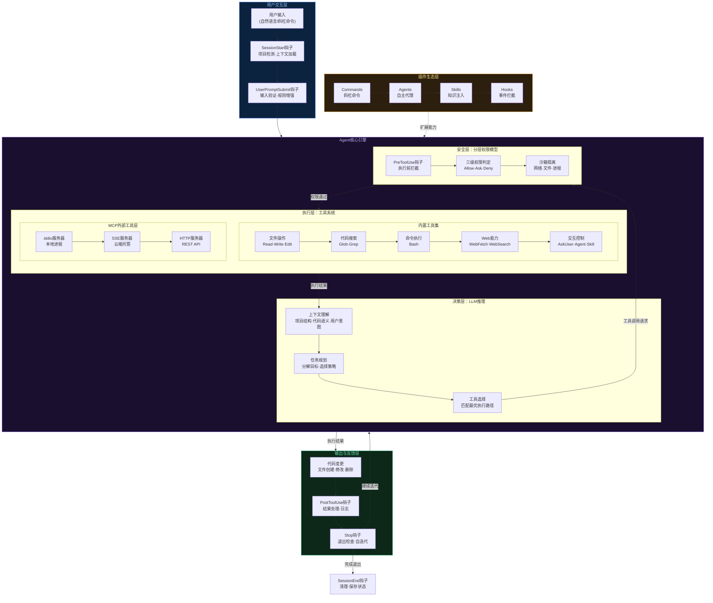

# Claude Code 架构设计理论分析：事件驱动的AI编程Agent系统

> Claude Code不是一个简单的代码生成工具，而是一个完整的**事件驱动、插件化、多层安全防御**的AI Agent操作系统。它的架构设计揭示了下一代AI编程助手的核心范式：从"被动问答"走向"主动感知-决策-执行"的自主系统。

---

## 第一部分：核心系统架构图



---

## 第二部分：六大架构设计原则

### 原则一：事件驱动的Agent循环——从"问答"到"感知-决策-执行"

传统的AI编程助手（如早期Copilot）本质是**请求-响应模式**：用户输入，模型生成，交互结束。Claude Code的核心突破在于引入了**完整的Agent循环**：

**Agent循环的本质**：LLM不再是"一次性回答器"，而是一个持续运行的**决策引擎**。每次工具执行的结果会重新进入LLM的上下文，触发下一轮推理，形成"感知→决策→执行→反馈"的闭环。

这种设计的关键在于**退出条件的控制**。Claude Code通过Stop钩子机制，允许外部逻辑阻止Agent退出循环。Ralph插件正是利用这一点，实现了"自迭代"模式——Agent完成任务后，Stop钩子注入新的反思提示，迫使Agent重新审视自己的输出质量，直到达到满意标准才真正退出。

**架构启示**：Agent循环的设计将AI从"工具"提升为"协作者"。它不再是被动等待指令的执行器，而是能够自主规划、执行、评估、修正的闭环系统。

### 原则二：插件化架构——能力的解耦与组合

Claude Code的插件系统是其架构中最优雅的设计之一。每个插件是一个标准化的能力单元，包含四种可选组件：

| 组件类型 | 职责 | 触发方式 |
|---------|------|---------|
| **Commands** | 用户发起的结构化工作流 | 斜杠命令 `/command` |
| **Agents** | 自主完成特定任务的子代理 | 自动匹配或显式调用 |
| **Skills** | 为Agent注入领域知识 | 条件加载 |
| **Hooks** | 拦截和扩展系统事件 | 事件驱动自动触发 |

**设计精妙之处**在于四种组件的**正交性**：它们各自独立，又可以自由组合。一个代码审查插件可以同时包含：
- 一个 `/review` 命令（用户触发入口）
- 三个并行Agent（分别审查安全、性能、风格）
- 两个Skill（提供项目编码规范和常见反模式知识）
- 一个PreToolUse钩子（阻止向受保护分支推送）

**这种设计遵循了Unix哲学**：每个组件做好一件事，通过标准接口组合成复杂能力。

### 原则三：分层权限模型——从信任到零信任的渐进光谱

AI Agent执行代码操作的核心矛盾是：**自主性越高，风险越大**。Claude Code通过五层纵深防御解决这个问题：

```
┌─────────────────────────────────────────┐
│  Level 5: 企业策略层                      │
│  managed-settings.json                   │
│  → 全局禁用危险模式、强制企业规则            │
├─────────────────────────────────────────┤
│  Level 4: 沙箱隔离层                      │
│  sandbox配置                              │
│  → 网络隔离、文件系统限制、进程约束          │
├─────────────────────────────────────────┤
│  Level 3: 工具权限层                      │
│  allowed-tools规则                        │
│  → 细粒度的工具+参数匹配（如Bash(gh:*)）   │
├─────────────────────────────────────────┤
│  Level 2: 钩子拦截层                      │
│  PreToolUse钩子                           │
│  → 命令检查（快速）或LLM判断（智能）         │
├─────────────────────────────────────────┤
│  Level 1: 用户确认层                      │
│  Ask模式                                  │
│  → 敏感操作提示用户确认                     │
└─────────────────────────────────────────┘
```

**这个模型的关键洞察**：安全不是一个开关（开/关），而是一个光谱。不同场景需要不同级别的信任：个人项目可以更宽松，企业环境需要严格管控，开源项目需要沙箱隔离。五层模型允许在任意层级设置策略，互不干扰，向上覆盖。

**权限规则的匹配语法**值得注意：`Bash(gh issue view:*)` 表示"允许执行以 `gh issue view` 开头的所有Bash命令"。这种**细粒度模式匹配**在保持安全性的同时，避免了"要么全开要么全关"的粗暴方案。

### 原则四：MCP协议——从封闭工具到开放生态的桥梁

MCP（Model Context Protocol）是Claude Code连接外部世界的标准协议。它的设计解决了AI Agent生态中的核心问题：**如何让一个Agent安全、标准化地调用任意外部服务？**

**MCP的三层抽象**：

1. **传输层**：支持stdio（本地进程）、SSE（云端流式）、HTTP（REST API）三种传输协议，覆盖从本地工具到远程SaaS的全场景
2. **工具描述层**：每个MCP服务器暴露一组工具，每个工具带有名称、描述、参数Schema，LLM据此决定何时调用
3. **认证层**：OAuth自动流程、环境变量注入、静态Token——三种认证模式覆盖不同安全需求

**MCP的架构价值**在于它建立了一个**标准化的工具市场协议**。就像HTTP之于Web，MCP之于AI Agent：任何开发者都可以按照标准实现一个MCP服务器，任何Agent都可以即插即用。这打破了AI工具生态的碎片化，使得"一次开发，全平台可用"成为可能。

### 原则五：上下文管理——从无状态到项目感知

传统LLM交互是无状态的。Claude Code通过多层上下文管理，将LLM转变为一个**持续感知项目状态**的系统：

**CLAUDE.md层级加载机制**：

```
~/.claude/CLAUDE.md          → 全局偏好（用户级别）
    ↓ 继承
项目根目录/CLAUDE.md          → 项目规范（团队级别）
    ↓ 覆盖
子目录/CLAUDE.md              → 模块特殊规则
    ↓ 覆盖
.claude/settings.local.json  → 本地个人配置
```

这种**层级覆盖模式**与CSS的级联机制、Docker的层叠镜像异曲同工：每一层都可以继承上层配置并选择性覆盖，既保持了一致性，又提供了灵活性。

**项目检测机制**通过SessionStart钩子自动识别项目类型（检测package.json、Cargo.toml、pyproject.toml等），注入对应的上下文信息。这让Agent在会话开始时就"理解"了项目的技术栈和约束条件。

**上下文压缩**是长会话的关键：当对话超过上下文窗口限制时，PreCompact钩子介入，智能选择保留哪些信息、压缩哪些信息，避免了简单截断导致的上下文丢失。

### 原则六：多Agent协作——从单体到分布式智能

Claude Code的多Agent架构体现了**分治思想**在AI系统中的应用：

**Agent层级结构**：
- **主Agent**：与用户直接交互，负责理解意图和协调工作
- **子Agent（Subagent）**：专注于特定任务的自主工作者，各有独立的系统提示、工具权限和模型配置
- **子Agent之间互相独立**，通过主Agent间接协作

**多模型策略**是一个值得注意的设计决策：

| 场景 | 推荐模型 | 理由 |
|------|---------|------|
| 快速过滤/验证 | Haiku | 低成本、低延迟 |
| 代码审查/生成 | Sonnet | 能力与成本的平衡 |
| 复杂架构决策 | Opus | 最强推理能力 |

这种**异构模型策略**类似于CPU的大小核调度：轻量任务用轻量模型，关键任务用强力模型，在成本和质量之间取得最优平衡。

---

## 第三部分：核心子系统深度分析

### 3.1 钩子系统——事件驱动架构的神经网络

钩子是Claude Code架构中最关键的扩展点。它将整个Agent生命周期抽象为9个标准事件：

| 事件 | 触发时机 | 核心用途 |
|------|---------|---------|
| SessionStart | 会话初始化 | 项目检测、上下文预加载 |
| UserPromptSubmit | 用户输入后 | 输入验证、规则注入 |
| PreToolUse | 工具执行前 | 安全检查、权限验证 |
| PostToolUse | 工具执行后 | 结果处理、日志记录 |
| PreCompact | 上下文压缩前 | 优化信息保留策略 |
| Stop | Agent尝试退出 | 阻止退出、触发自迭代 |
| SubagentStop | 子Agent完成 | 质量检查、继续迭代 |
| Notification | 通知事件 | 事件路由、外部告警 |
| SessionEnd | 会话结束 | 状态保存、资源清理 |

**两种钩子执行模式的设计权衡**：

- **命令钩子（Command）**：运行Shell脚本或外部程序。优势是确定性强、执行快速；劣势是只能做模式匹配级别的检查，缺乏语义理解。
- **提示钩子（Prompt）**：将上下文发送给LLM判断。优势是具备语义理解能力，能做上下文相关的复杂决策；劣势是引入额外的LLM调用成本和延迟。

这两种模式不是互斥的，而是互补的。在安全检查场景中，命令钩子先做快速的正则匹配过滤（拦截明显危险的操作），提示钩子再对模糊情况做深度判断（需要理解代码语义的场景）。

### 3.2 插件发现与加载——约定优于配置

Claude Code的插件系统遵循"约定优于配置"原则。一个标准的插件目录结构：

```
my-plugin/
├── .claude-plugin/
│   └── plugin.json          ← 唯一必需的配置文件
├── commands/                 ← 自动发现为斜杠命令
│   └── deploy.md
├── agents/                   ← 自动发现为子Agent
│   └── code-reviewer.md
├── skills/                   ← 自动发现为知识注入
│   └── react-patterns.md
├── hooks/
│   └── hooks.json            ← 事件钩子配置
└── .mcp.json                 ← MCP服务器声明
```

**自动发现机制**的设计意味着：开发者只需要把文件放到正确的目录，系统自动识别并注册。不需要在中央注册表中声明，不需要编写加载代码。这极大降低了插件开发的门槛。

### 3.3 Agent与Skill的协作模型

Agent和Skill的关系是Claude Code中一个精巧的设计：

- **Agent**：具有独立系统提示、独立工具权限、独立模型配置的自主工作者。它知道"做什么"和"怎么做"。
- **Skill**：没有独立的执行能力，而是作为**知识注入**被Agent在需要时加载。它提供"领域知识"。

**触发机制的设计**：Skill的加载不是静态的"全部加载"，而是基于description字段的**条件匹配**。只有当当前任务与Skill的描述相关时，Skill才会被注入到Agent的上下文中。这避免了上下文窗口的浪费，也避免了不相关知识对推理的干扰。

---

## 第四部分：架构设计的深层洞察

### 4.1 "信任边界"的工程化

Claude Code的架构本质上是在回答一个核心问题：**如何让AI Agent在自主性和安全性之间取得平衡？**

传统软件安全的思路是"最小权限原则"——给予最少的权限。但对于AI Agent，这个思路需要进化：Agent需要足够的权限才能高效工作（读写文件、执行命令、访问网络），而过度限制会让Agent变得"残废"。

Claude Code的解决方案是**动态信任边界**：
- 信任级别根据操作类型动态调整（读文件 vs 删除文件）
- 信任级别根据环境上下文动态调整（个人项目 vs 企业环境）
- 信任级别根据操作历史动态调整（首次操作需确认，后续同类操作自动放行）

### 4.2 "生态飞轮"的构建逻辑

Claude Code的插件+MCP架构构建了一个潜在的生态飞轮：

```
更多插件开发者 → 更丰富的工具生态
        ↓
更强大的Agent能力 → 更多用户采用
        ↓
更大的市场需求 → 吸引更多插件开发者
```

**MCP协议是飞轮的轴承**——它确保了生态的开放性和标准化。没有MCP，每个工具集成都是定制开发；有了MCP，工具市场可以像npm包一样自由组合。

### 4.3 与传统IDE插件体系的对比

| 维度 | 传统IDE插件（VSCode） | Claude Code插件 |
|------|---------------------|----------------|
| **核心交互** | UI组件、菜单、快捷键 | 自然语言、事件钩子 |
| **执行模型** | 确定性代码执行 | LLM推理+工具调用 |
| **能力边界** | 由API表面决定 | 由工具权限+LLM能力决定 |
| **组合方式** | 独立运行，互不感知 | Agent可调度多个插件协作 |
| **扩展协议** | Language Server Protocol | Model Context Protocol |

**关键差异**在于：传统插件是"程序化扩展"——开发者编写确定性代码来响应确定性事件；Claude Code插件是"知识化扩展"——开发者编写Markdown描述来指导LLM的决策和行为。从"编程"到"描述"的转变，本质上是AI时代软件扩展范式的根本变革。

### 4.4 架构的局限性与挑战

**延迟问题**：每次工具调用都经过"LLM推理→权限检查→工具执行→结果回传→LLM再推理"的完整链路。对于简单操作（如读取一个文件），这个链路的延迟远高于直接执行。Agent循环的效率依赖于LLM的推理速度和工具调用的批量化能力。

**上下文窗口限制**：尽管Claude支持大上下文窗口，但在大型项目中，代码库的规模远超任何上下文窗口。如何在有限的上下文中提供最相关的信息，是一个持续的挑战。当前的解决方案（CLAUDE.md层级、Skill条件加载、PreCompact钩子）都是在缓解而非根本解决这个问题。

**安全模型的不完备性**：基于LLM的提示钩子本身依赖LLM的判断能力。如果LLM被精心构造的输入欺骗（prompt injection），安全钩子可能失效。这意味着命令钩子（确定性检查）在关键安全场景中不可或缺，不能完全依赖LLM判断。

---

## 第五部分：架构迁移指南

### 5.1 对AI Agent系统设计者的启示

1. **事件驱动优于命令驱动**：将Agent生命周期抽象为标准事件，每个事件点都开放扩展。这比硬编码的工作流更灵活、更可维护。

2. **安全是分层的，不是二元的**：为不同场景设计不同级别的信任策略。从沙箱隔离（最严格）到自动放行（最宽松），允许用户和组织根据需要调整。

3. **工具标准化是生态的基础**：定义清晰的工具描述协议（如MCP），让工具的"发现"和"调用"标准化，是构建Agent生态的前提。

4. **上下文管理决定Agent质量**：Agent的智能程度不仅取决于底层模型，更取决于"喂给模型什么信息"。层级化的上下文管理（全局→项目→目录→会话）是关键基础设施。

### 5.2 对企业采纳AI Agent的启示

1. **权限模型必须先于功能部署**：在企业环境中引入AI Agent，首先要建立完善的权限控制体系（企业策略层→沙箱层→工具权限层），而不是先部署功能再补安全。

2. **插件治理等同于供应链安全**：插件生态的开放性意味着供应链攻击风险。Claude Code通过`strictKnownMarketplaces`和`allowManagedHooksOnly`等配置提供企业级管控，这是生产环境部署的必要前提。

3. **渐进式信任建立**：不要一步到位地给予Agent完全权限。从只读操作开始，逐步开放写入、执行、网络访问，在每个阶段验证安全性后再推进。

### 5.3 对软件架构发展趋势的思考

Claude Code的架构设计预示了软件系统的一个重要趋势：**从"人操作工具"到"人指导Agent，Agent操作工具"的范式转移**。

在这个新范式中：
- **用户界面**从GUI/CLI转变为自然语言
- **业务逻辑**从硬编码转变为LLM推理
- **系统集成**从API调用转变为MCP协议
- **扩展方式**从编写代码转变为编写描述

这不是一夜之间的革命，而是渐进式的演化。Claude Code的架构设计提供了一个清晰的过渡路径：保留传统的工具执行层（Bash、文件操作），在其上叠加Agent决策层和事件驱动层，用插件化设计保持开放性和可扩展性。

---

## 结语

Claude Code的架构设计价值不仅在于它作为一个产品的技术实现，更在于它展示了AI Agent系统设计的一套成熟方法论：

**事件驱动**确保了可扩展性，**插件化**确保了生态开放性，**分层权限**确保了安全性，**MCP协议**确保了互操作性，**多Agent协作**确保了任务处理能力，**上下文管理**确保了智能质量。

这六个支柱共同构成了一个完整的AI Agent操作系统架构范式。对于任何正在设计AI Agent系统的架构师来说，Claude Code都是一个值得深入研究的参考实现。

**最终，Claude Code的架构设计回答了一个根本问题：AI Agent系统的核心挑战不是模型能力，而是如何在自主性、安全性、可扩展性和用户体验之间取得精确的平衡。**
