# Clawdbot 架构理论指南

## 一、概述

Clawdbot 是一个开源的、本地优先的个人 AI 助手系统，由 Peter Steinberger（PSPDFKit 创始人）开发。它的核心理念是将 AI 能力集成到用户日常使用的消息应用中，同时保持完全的隐私控制和数据主权。

### 核心特点

- **本地优先架构**：所有数据和会话历史存储在用户本地设备
- **消息应用集成**：通过 WhatsApp、Telegram 等熟悉的界面交互
- **自托管模式**：用户完全控制部署环境和数据流向
- **开源透明**：代码开放，可审计和定制
- **跨平台支持**：支持 Windows、macOS、Linux 多平台运行

## 二、系统架构

### 2.1 整体架构设计

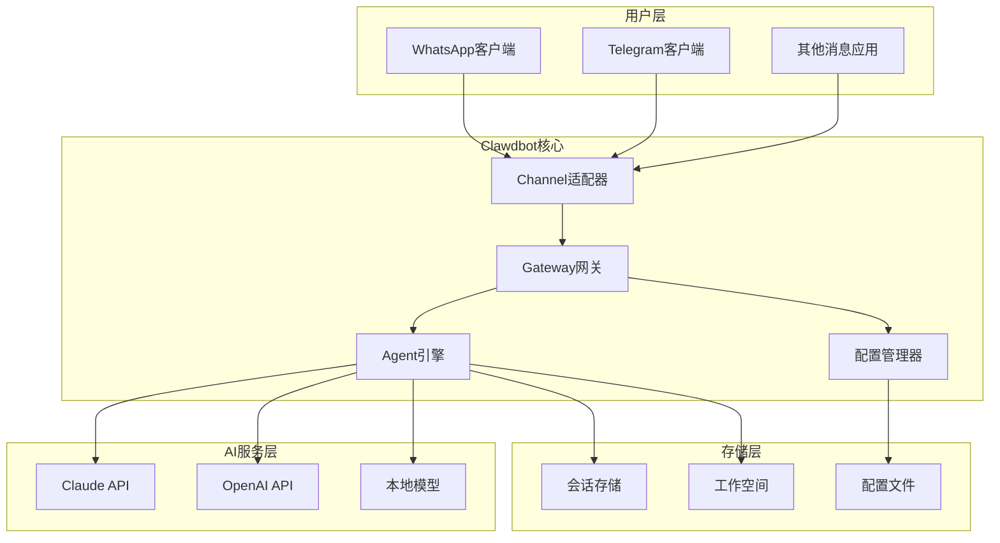

### 2.2 核心组件说明

#### Gateway（网关）
Gateway 是 Clawdbot 的中枢神经系统，负责：
- **连接管理**：维护与各个消息渠道的 WebSocket 连接
- **请求路由**：将用户消息路由到对应的 Agent 实例
- **状态同步**：管理系统运行状态和健康检查
- **设备配对**：处理多设备间的身份验证和授权

#### Agent 引擎
Agent 是实际执行 AI 任务的核心组件：
- **上下文管理**：维护对话历史和会话状态
- **模型调度**：根据任务类型选择合适的 AI 模型
- **工具调用**：执行文件操作、系统命令等扩展功能
- **响应生成**：处理 AI 模型输出并格式化返回

#### Channel 适配器
Channel 层提供统一的消息接口抽象：
- **协议适配**：将不同消息平台的协议转换为统一格式
- **认证处理**：管理各平台的登录凭证和会话
- **消息转换**：处理文本、图片、文件等多媒体内容
- **事件监听**：实时接收和处理用户消息

## 三、工作原理

### 3.1 消息处理流程

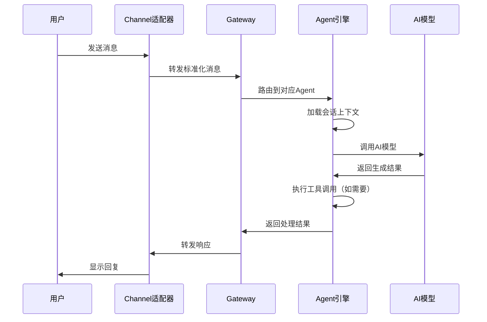

### 3.2 会话管理机制

Clawdbot 采用分层的会话管理策略：

**会话隔离**
- 每个对话渠道（用户/群组）维护独立的会话上下文
- 会话数据存储在本地 JSON 文件中
- 支持会话的持久化和恢复

**上下文窗口管理**
- 动态调整上下文长度以适应模型限制
- 智能摘要历史对话以保留关键信息
- 支持长期记忆和短期记忆的分层存储

**多 Agent 协作**
- 支持创建多个独立的 Agent 实例
- 每个 Agent 可配置不同的模型和行为
- Agent 间可通过 ACP（Agent Control Protocol）通信

### 3.3 安全与隐私设计

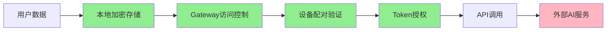

**隐私保护措施**：
- **本地优先**：所有会话历史默认存储在本地
- **端到端控制**：用户完全掌控数据流向
- **可选云端**：仅在需要时才调用外部 AI 服务
- **凭证隔离**：API 密钥和认证信息本地加密存储
- **审计日志**：完整记录所有 API 调用和数据访问

## 四、应用场景

### 4.1 个人知识助手

**场景描述**：通过消息应用随时访问个人 AI 助手

**典型用例**：
- 快速查询和信息检索
- 文档摘要和内容分析
- 日程管理和提醒设置
- 学习辅导和知识问答

**优势**：
- 无需切换应用，在熟悉的界面中使用
- 对话历史完整保存，便于回溯
- 支持多模态输入（文本、图片、文件）

### 4.2 开发者工具集成

**场景描述**：将 AI 能力集成到开发工作流

**典型用例**：
- 代码审查和优化建议
- 文档生成和注释补充
- Bug 分析和调试辅助
- 技术方案讨论和架构设计

**优势**：
- 本地运行，保护代码隐私
- 可访问本地文件系统和工具
- 支持自定义技能和插件扩展

### 4.3 团队协作增强

**场景描述**：在团队沟通中引入 AI 辅助

**典型用例**：
- 会议纪要自动生成
- 任务分配和进度跟踪
- 知识库问答和文档检索
- 多语言翻译和沟通桥梁

**优势**：
- 群组对话中直接调用 AI
- 团队成员共享 AI 能力
- 保持沟通上下文的连贯性

### 4.4 自动化工作流

**场景描述**：构建智能自动化任务

**典型用例**：
- 定时任务和提醒
- 数据监控和异常告警
- 文件处理和格式转换
- 系统管理和运维辅助

**优势**：
- 支持 Cron 定时调度
- 可执行系统命令和脚本
- 灵活的 Webhook 集成

## 五、技术架构深度解析

### 5.1 Gateway 架构设计

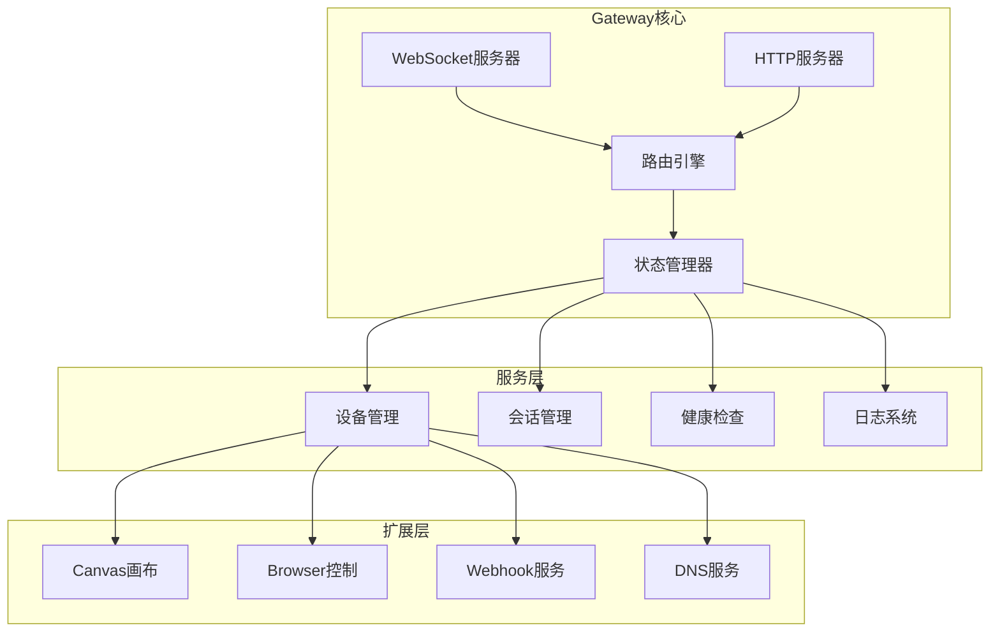

**Gateway 核心职责**：

1. **连接管理**
   - 维护 WebSocket 长连接池
   - 处理连接断开和重连逻辑
   - 支持多设备同时连接

2. **请求路由**
   - 根据消息来源路由到对应 Agent
   - 支持负载均衡和故障转移
   - 实现请求优先级调度

3. **状态同步**
   - 实时心跳检测
   - 系统健康状态监控
   - 跨设备状态同步

### 5.2 Agent 执行模型

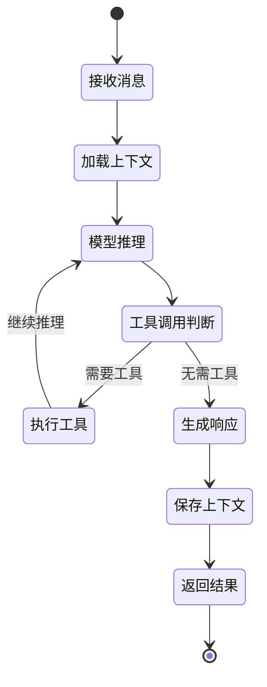

**Agent 执行流程**：

1. **消息接收**：从 Gateway 接收标准化消息
2. **上下文加载**：读取历史对话和会话状态
3. **模型推理**：调用 AI 模型生成响应
4. **工具调用**：根据需要执行系统工具
5. **响应生成**：格式化输出并返回
6. **状态保存**：更新会话上下文到存储

### 5.3 Channel 适配层设计

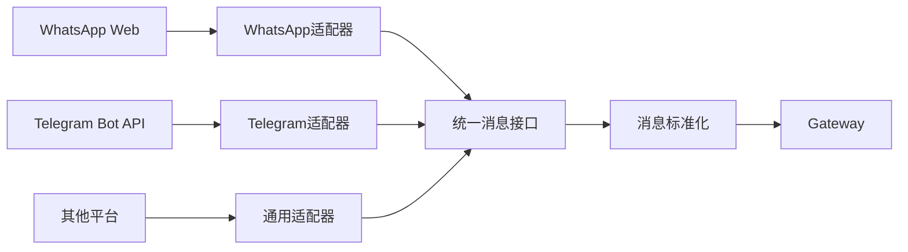

**适配器设计原则**：

1. **协议抽象**
   - 定义统一的消息格式
   - 封装平台特定的 API 调用
   - 处理认证和会话管理

2. **事件驱动**
   - 监听平台消息事件
   - 异步处理消息队列
   - 支持消息重试和错误恢复

3. **扩展性**
   - 插件化架构，易于添加新平台
   - 配置驱动，无需修改核心代码
   - 支持自定义消息处理逻辑

## 六、数据流与存储

### 6.1 数据流向图

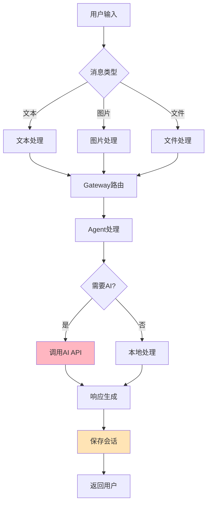

### 6.2 存储架构

**配置存储**：
- 位置：`~/.clawdbot/clawdbot.json`
- 内容：系统配置、Agent 设置、API 凭证
- 格式：JSON 格式，支持热重载

**会话存储**：
- 位置：`~/.clawdbot/agents/{agent_name}/sessions/`
- 内容：对话历史、上下文状态、用户偏好
- 格式：JSON 文件，按会话 ID 组织

**工作空间**：
- 位置：`~/clawd/`
- 内容：Agent 可访问的文件和资源
- 权限：受沙箱限制，保护系统安全

**日志系统**：
- 位置：`/tmp/clawdbot/`
- 内容：运行日志、错误追踪、审计记录
- 轮转：按日期自动轮转，可配置保留期限

## 七、扩展与定制

### 7.1 插件系统

Clawdbot 支持通过插件扩展功能：

**插件类型**：
- **技能插件**：扩展 Agent 的能力（如天气查询、日历管理）
- **Channel 插件**：支持新的消息平台
- **工具插件**：添加新的系统工具和命令
- **模型插件**：集成新的 AI 模型提供商

**插件机制**：
- 基于 Node.js 模块系统
- 声明式配置和注册
- 沙箱隔离，保证安全性
- 热加载，无需重启服务

### 7.2 自定义 Agent

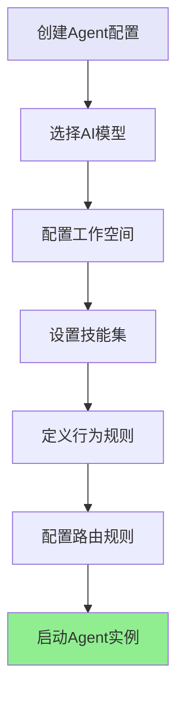

**Agent 定制选项**：

1. **模型选择**
   - 支持 Claude、GPT、本地模型
   - 可配置模型参数（温度、最大长度等）
   - 支持模型切换和降级策略

2. **行为定制**
   - 自定义系统提示词
   - 设置响应风格和语气
   - 配置工具使用权限

3. **路由规则**
   - 基于关键词的路由
   - 基于用户/群组的路由
   - 基于时间和条件的路由

### 7.3 Webhook 集成

Clawdbot 支持双向 Webhook 集成：

**入站 Webhook**：
- 接收外部系统的事件通知
- 触发 Agent 执行特定任务
- 支持认证和签名验证

**出站 Webhook**：
- 将 Agent 响应推送到外部系统
- 支持自定义 HTTP 请求格式
- 实现与第三方服务的集成

## 八、部署模式

### 8.1 本地模式

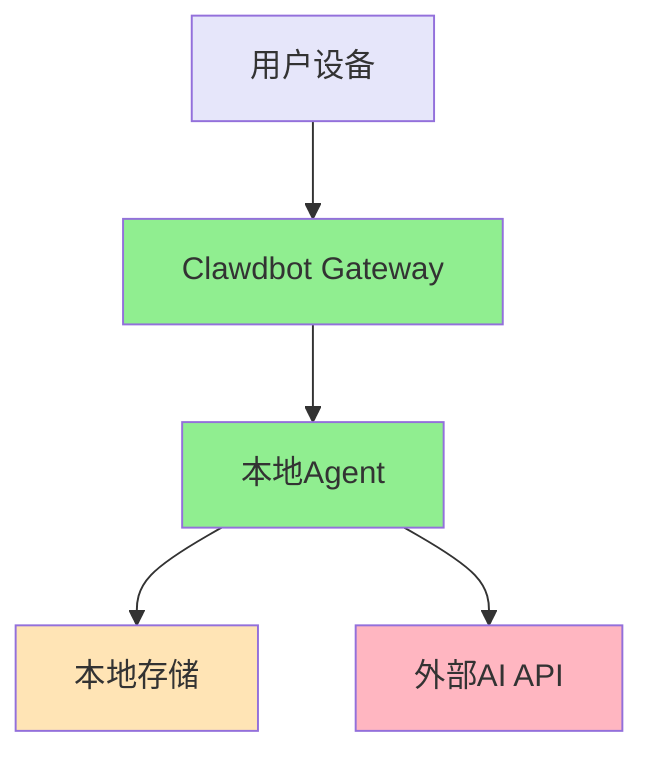

**特点**：
- 完全在用户设备上运行
- 数据不离开本地环境
- 适合个人使用和隐私敏感场景
- 需要设备保持在线

### 8.2 服务器模式

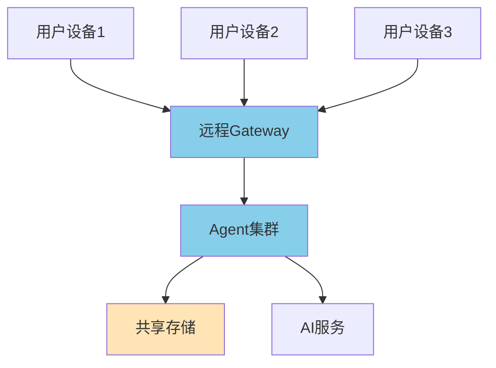

**特点**：
- 部署在云服务器或 VPS
- 支持多设备访问
- 更好的可用性和性能
- 适合团队使用

### 8.3 混合模式

**特点**：
- Gateway 运行在服务器
- Agent 可在本地或远程运行
- 灵活的数据存储策略
- 平衡性能、隐私和可用性

## 九、性能与优化

### 9.1 性能优化策略

**连接优化**：
- WebSocket 长连接复用
- 消息批处理和压缩
- 连接池管理

**缓存策略**：
- 会话上下文缓存
- 模型响应缓存
- 静态资源缓存

**并发控制**：
- 请求队列管理
- 并发限流
- 优先级调度

### 9.2 资源管理

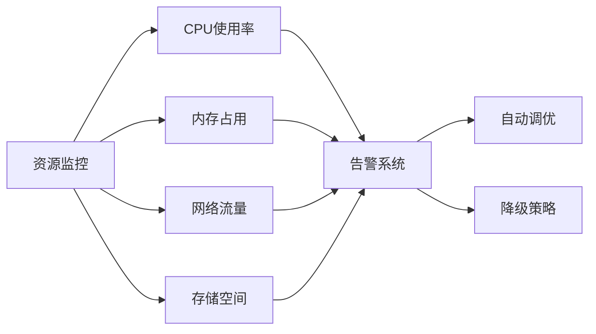

**资源限制**：
- 会话数量限制
- 上下文长度限制
- 并发请求限制
- 存储空间配额

## 十、安全考虑

### 10.1 威胁模型

**潜在威胁**：
- 未授权访问
- 数据泄露
- API 密钥泄露
- 恶意命令注入
- 资源耗尽攻击

### 10.2 安全措施

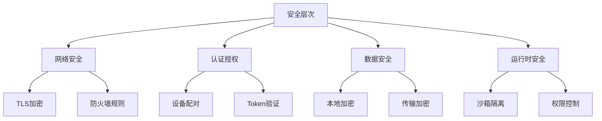

**安全实践**：

1. **认证与授权**
   - 设备配对机制
   - Token 过期和轮转
   - 细粒度权限控制

2. **数据保护**
   - 敏感数据加密存储
   - 传输层 TLS 加密
   - 定期安全审计

3. **运行时安全**
   - 沙箱环境隔离
   - 命令白名单机制
   - 资源使用限制

4. **审计与监控**
   - 完整的操作日志
   - 异常行为检测
   - 安全事件告警

## 十一、与传统 AI 助手的对比

### 11.1 架构对比

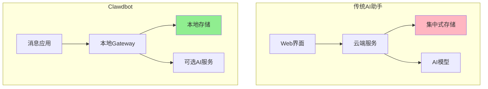

### 11.2 特性对比

| 维度 | 传统 AI 助手 | Clawdbot |
|------|-------------|----------|
| **部署方式** | 云端 SaaS | 自托管 |
| **数据存储** | 云端集中存储 | 本地优先 |
| **隐私控制** | 有限 | 完全控制 |
| **访问方式** | Web/App | 消息应用 |
| **定制能力** | 受限 | 高度可定制 |
| **离线能力** | 不支持 | 部分支持 |
| **成本模式** | 订阅制 | 自主控制 |

## 十二、未来发展方向

### 12.1 技术演进

**本地模型支持**：
- 集成更多开源模型
- 支持模型量化和优化
- 降低对外部 API 的依赖

**多模态能力**：
- 增强图像理解和生成
- 支持语音输入输出
- 视频内容分析

**协作增强**：
- 多 Agent 协同工作
- 分布式任务执行
- 知识共享机制

### 12.2 生态建设

**社区驱动**：
- 插件市场和分享平台
- 最佳实践和案例库
- 开发者工具和 SDK

**企业应用**：
- 团队版功能增强
- 企业级安全和合规
- 私有化部署方案

## 十三、总结

Clawdbot 代表了个人 AI 助手的新范式：

**核心价值**：
- **隐私优先**：用户完全掌控数据和隐私
- **开放透明**：开源架构，可审计和定制
- **无缝集成**：融入日常使用的消息应用
- **灵活部署**：支持本地、云端、混合模式

**技术创新**：
- 本地优先的架构设计
- 统一的消息接口抽象
- 可扩展的插件系统
- 灵活的 Agent 编排机制

**应用前景**：
- 个人知识管理和生产力提升
- 开发者工具链集成
- 团队协作增强
- 企业智能化转型

Clawdbot 不仅是一个技术工具，更是对 AI 助手应该如何服务用户的一次深刻思考。它证明了在保护隐私和用户控制的前提下，AI 助手同样可以提供强大而便捷的服务。随着技术的不断演进和社区的持续贡献，Clawdbot 有望成为个人 AI 助手领域的重要参考实现。