# Kubernetes与容器编排理论指南

**学习深度**: ⭐⭐⭐⭐⭐

---

## 第一部分:Kubernetes 架构与核心概念

### 1.1 Kubernetes 整体架构

Kubernetes 是一个用于自动部署、扩展和管理容器化应用程序的开源平台。

**架构全景图**:

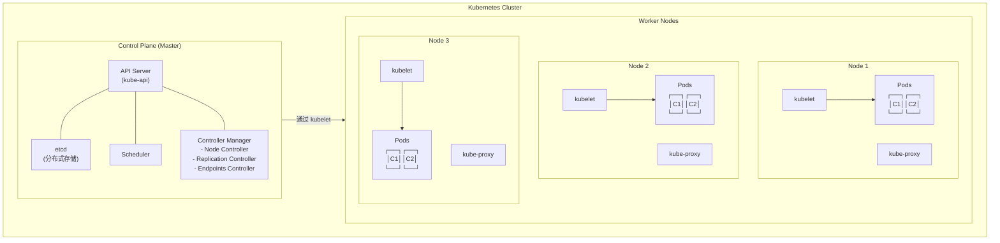

**设计理念**:
- **声明式API**: 描述期望状态,而非执行步骤
- **控制循环**: 持续监控并调整实际状态趋向期望状态
- **松耦合**: 组件通过API Server通信
- **可扩展**: 通过CRD和Operator扩展功能

### 1.2 Control Plane 组件

#### API Server (kube-apiserver)

**职责**:
- Kubernetes的前端,所有组件都通过它通信
- 提供RESTful API接口
- 负责认证、授权、准入控制
- 唯一直接访问etcd的组件

**请求处理流程**:

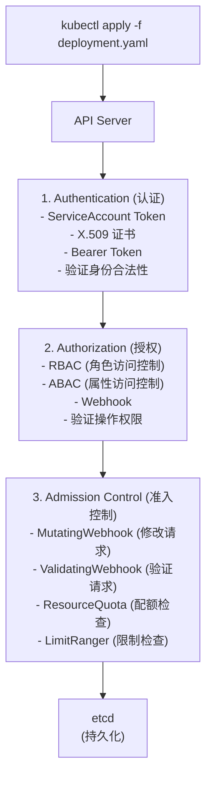

**准入控制器类型**:

**Mutating Admission (变更准入)**:
- 可以修改请求对象
- 例如:自动注入 sidecar 容器
- 在 Validating 之前执行

**Validating Admission (验证准入)**:
- 只能验证,不能修改
- 例如:检查资源是否符合策略
- 在 Mutating 之后执行

**执行顺序**:

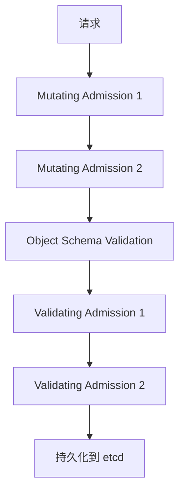

#### etcd

**职责**:
- 分布式键值存储
- 保存集群所有状态信息
- 提供watch机制,通知数据变更
- 保证数据一致性

**数据组织**:
```
etcd 数据存储层次结构:

/registry
├── pods
│   └── <namespace>
│       └── <pod-name>
│           └── {pod-spec-json}
├── services
│   └── <namespace>
│       └── <service-name>
│           └── {service-spec-json}
├── deployments
│   └── <namespace>
│       └── <deployment-name>
│           └── {deployment-spec-json}
├── replicasets
├── configmaps
├── secrets (加密存储)
└── events
```

**一致性保证**:
- 使用Raft协议
- 强一致性
- 多数派写入确认
- Leader选举机制

**Watch机制**:

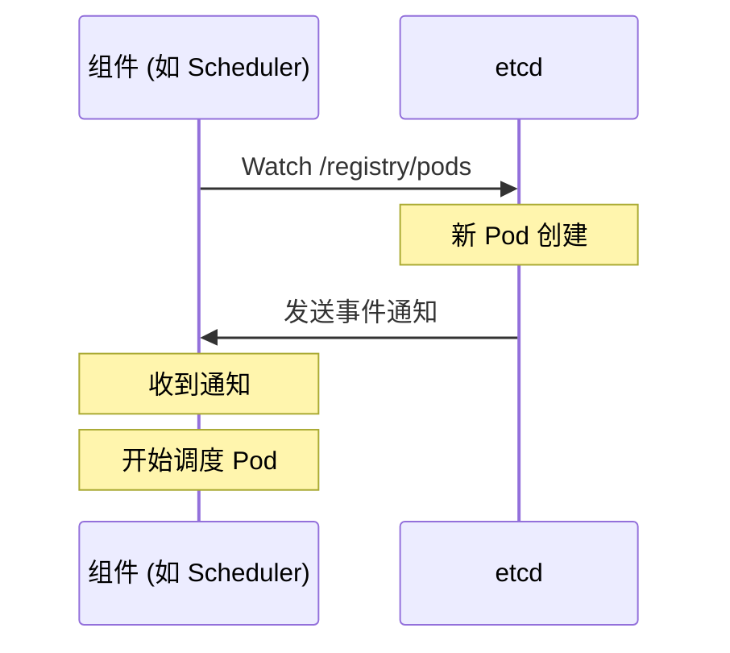

#### Scheduler (kube-scheduler)

**职责**:
- 监听未调度的Pod
- 为Pod选择最优节点
- 考虑资源需求、亲和性、污点容忍等约束

**调度流程**:

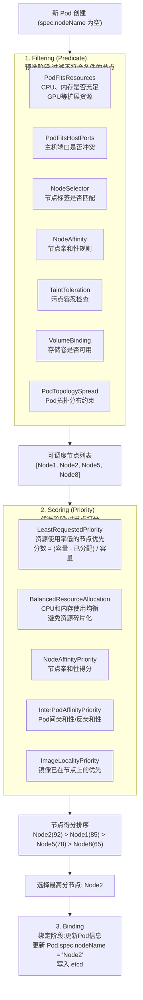

**调度策略**:

**资源调度**:
```
节点资源:
┌─────────────────────────────┐
│  Node: 8 CPU, 16Gi Memory   │
├─────────────────────────────┤
│  Allocated:                 │
│  - Pod1: 2 CPU, 4Gi        │
│  - Pod2: 1 CPU, 2Gi        │
├─────────────────────────────┤
│  Available:                 │
│  - 5 CPU, 10Gi             │
└─────────────────────────────┘

新 Pod 请求: 3 CPU, 6Gi
✓ 可以调度 (5 >= 3, 10 >= 6)
```

**亲和性调度**:
```
Pod Affinity (亲和):
希望 Pod 调度到某些节点

podAffinity:
  requiredDuringScheduling (硬性要求):
    - 必须满足条件
    - 不满足则调度失败

  preferredDuringScheduling (软性要求):
    - 优先满足
    - 不满足也可以调度
    - 影响打分

Pod Anti-Affinity (反亲和):
避免 Pod 调度到某些节点

用途:
- 高可用:不同副本分散到不同节点
- 隔离:避免资源竞争
```

**污点和容忍**:

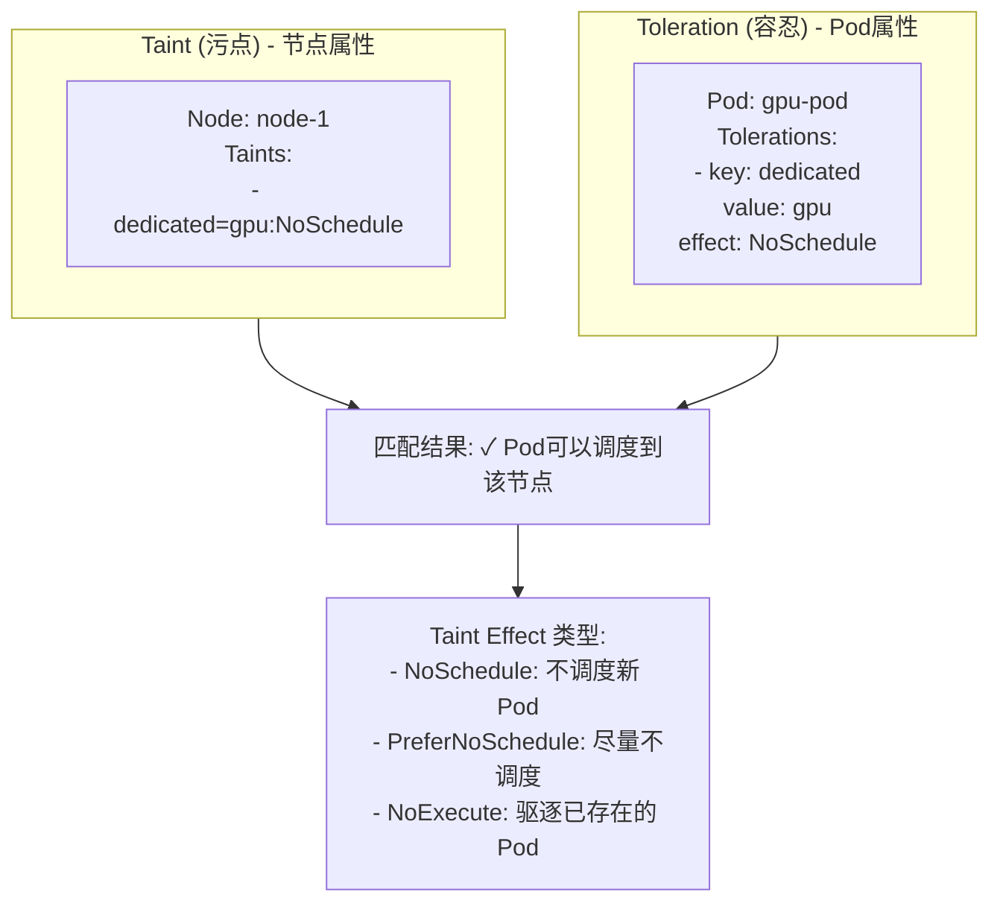

#### Controller Manager

**职责**:
- 运行各种控制器
- 监控资源状态
- 确保实际状态趋向期望状态

**控制循环模式**:

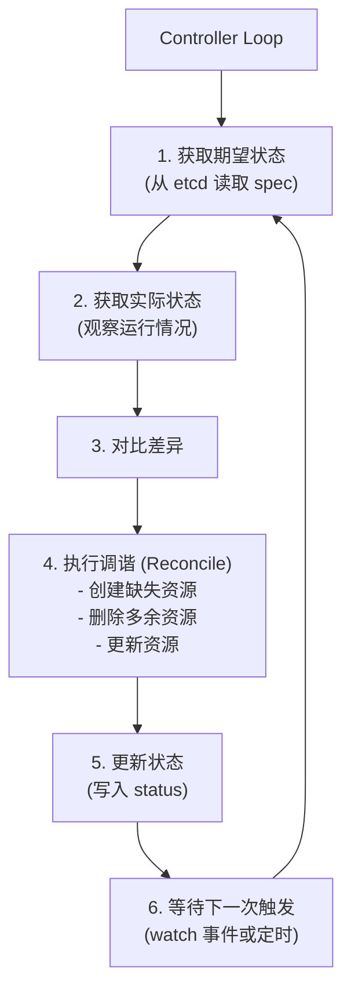

**核心控制器**:

**1. Deployment Controller**

**工作原理**:

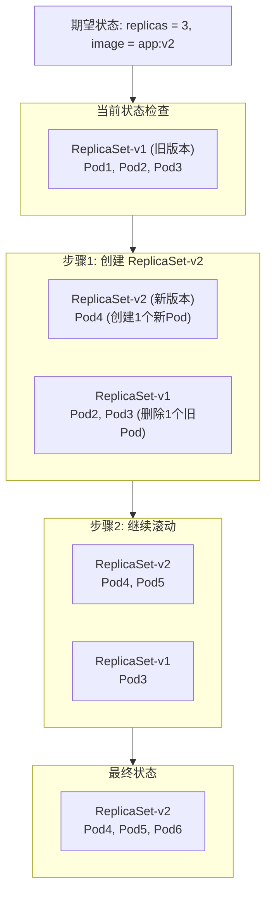

**滚动更新策略**:
- **maxSurge**: 最多超出期望副本数的数量
- **maxUnavailable**: 最多不可用副本数

```
示例: replicas=10, maxSurge=2, maxUnavailable=2

更新过程:
1. 可以创建最多 12 个 Pod (10 + 2)
2. 至少保持 8 个 Pod 可用 (10 - 2)
3. 逐步替换旧 Pod 为新 Pod
```

**2. ReplicaSet Controller**

**职责**: 维持指定数量的Pod副本

```
期望副本数: 3
实际运行: 2 (一个Pod故障)

ReplicaSet Controller 行动:
1. 检测到副本不足
2. 创建一个新 Pod
3. 等待 Pod 就绪
4. 更新 ReplicaSet 状态
```

**3. Node Controller**

**职责**: 监控节点健康状态

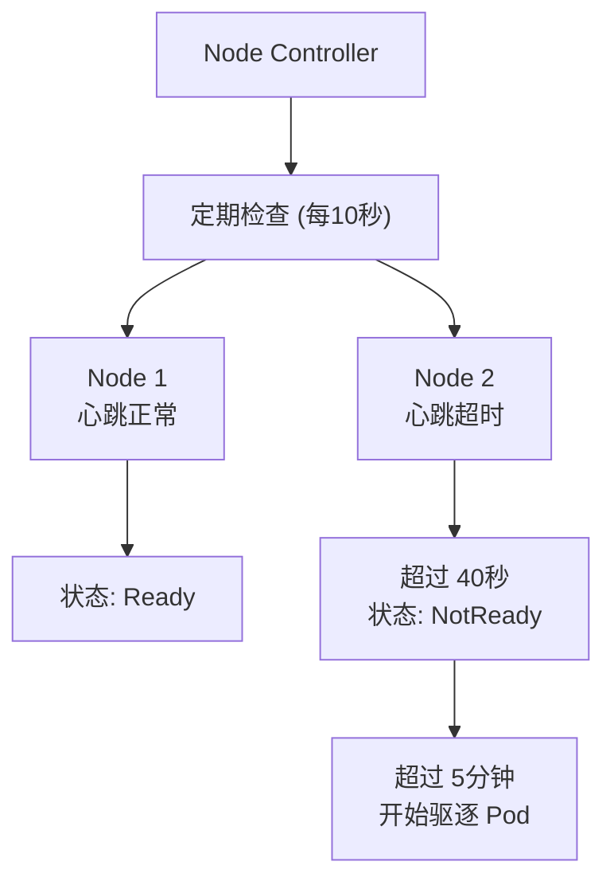

**节点状态转换**:

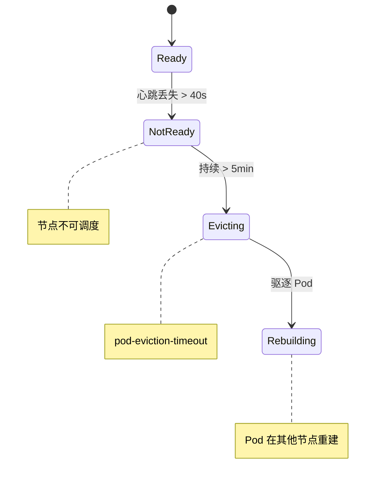

### 1.3 Node 组件

#### kubelet

**职责**:
- 节点上的 Agent
- 管理 Pod 生命周期
- 上报节点和 Pod 状态
- 执行健康检查

**Pod 生命周期管理**:

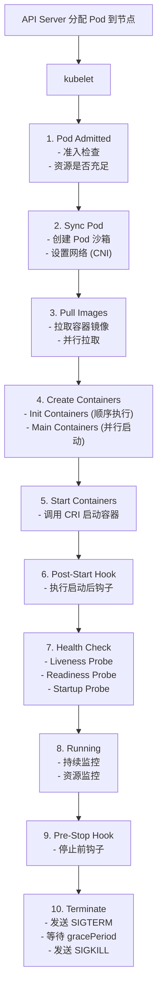

**健康检查类型**:

**Liveness Probe (存活探针)**:
```
用途: 检测容器是否存活
失败动作: 重启容器

检查方式:
1. HTTP GET
   - 访问指定端点
   - 返回 200-399 为成功

2. TCP Socket
   - 尝试建立 TCP 连接
   - 连接成功为成功

3. Exec Command
   - 执行命令
   - 退出码 0 为成功
```

**Readiness Probe (就绪探针)**:

```mermaid
stateDiagram-v2
    [*] --> Starting: Pod 启动
    Starting --> NotReady: Readiness: False<br/>不接收流量
    NotReady --> Ready: 探针成功
    Ready --> NotReady: 探针失败

    note right of Ready: Readiness: True<br/>开始接收流量
    note right of NotReady: 停止接收流量
```

**Startup Probe (启动探针)**:
```
用途: 检测慢启动容器
特点: 在成功前,禁用 Liveness 和 Readiness

时间线:
T0: 容器启动
    │
    ▼
T1-T30: Startup Probe 检查
    │   - 允许较长的启动时间
    │   - failureThreshold 可以设置很大
    │
    ▼
T30: Startup Probe 成功
    │
    ▼
T31+: Liveness/Readiness 开始工作
```

#### kube-proxy

**职责**:
- 实现 Service 的网络代理
- 维护网络规则
- 实现负载均衡

**Service 工作原理**:

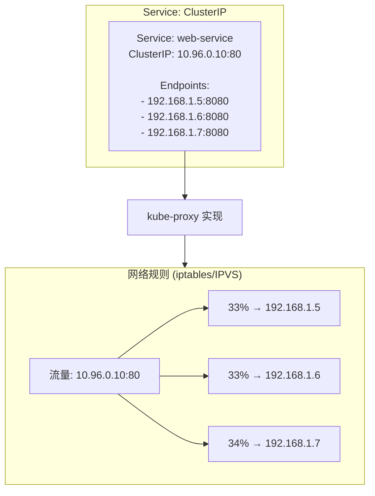

**代理模式对比**:

**1. userspace 模式 (已废弃)**

```mermaid
graph TB
    Client[客户端]
    iptables[iptables 规则]
    kubeproxy[kube-proxy<br/>(用户空间)]
    Pod[后端 Pod]

    Cons[缺点: 性能差<br/>(内核态 ↔ 用户态切换)]

    Client --> iptables
    iptables --> kubeproxy
    kubeproxy --> Pod
    kubeproxy -.-> Cons
```

**2. iptables 模式 (默认)**

```mermaid
graph TB
    Client[客户端]
    iptables[iptables 规则<br/>(直接转发)]
    Pod[后端 Pod]

    Pros[优点: 性能好]
    Cons[缺点: 规则数量多时性能下降 O(n)]

    Client --> iptables
    iptables --> Pod
    iptables -.-> Pros
    iptables -.-> Cons
```

**3. IPVS 模式 (推荐)**

```mermaid
graph TB
    Client[客户端]
    IPVS[IPVS 负载均衡]
    Pod[后端 Pod]

    subgraph Advantages["优点"]
        Perf[更好的性能 O(1)]
        Algo[更多负载均衡算法]
        Scale[支持更大规模]
    end

    subgraph Algorithms["负载均衡算法"]
        rr[rr (轮询)]
        lc[lc (最少连接)]
        dh[dh (目标地址哈希)]
        sh[sh (源地址哈希)]
        sed[sed (最短期望延迟)]
        nq[nq (永不排队)]
    end

    Client --> IPVS
    IPVS --> Pod
    IPVS -.-> Advantages
    IPVS -.-> Algorithms
```

---

## 第二部分:GPU 资源调度

### 2.1 GPU 调度基础

**GPU 节点架构**:

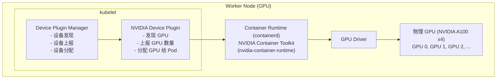

**Device Plugin Framework**:

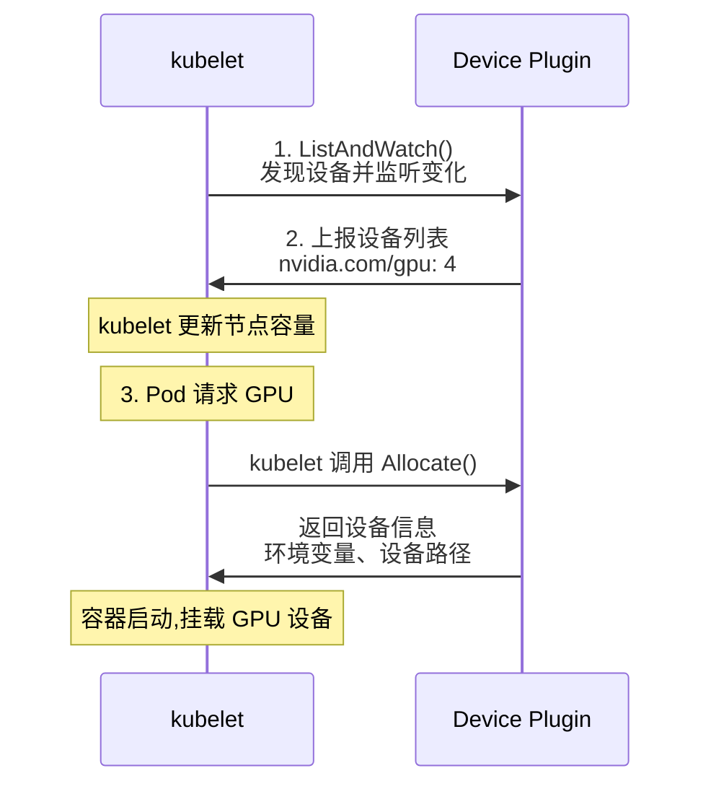

### 2.2 GPU 共享技术

**传统独占模式问题**:

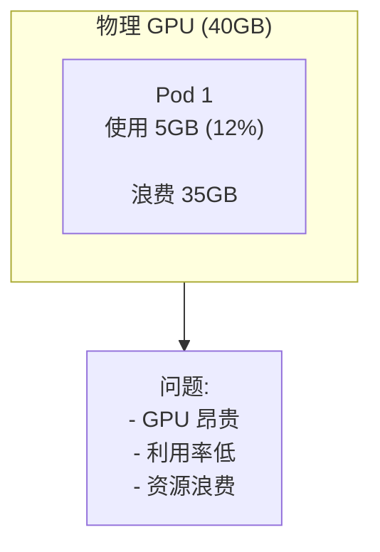

#### 时间片共享 (Time-Slicing)

**原理**: 多个进程分时复用同一块 GPU

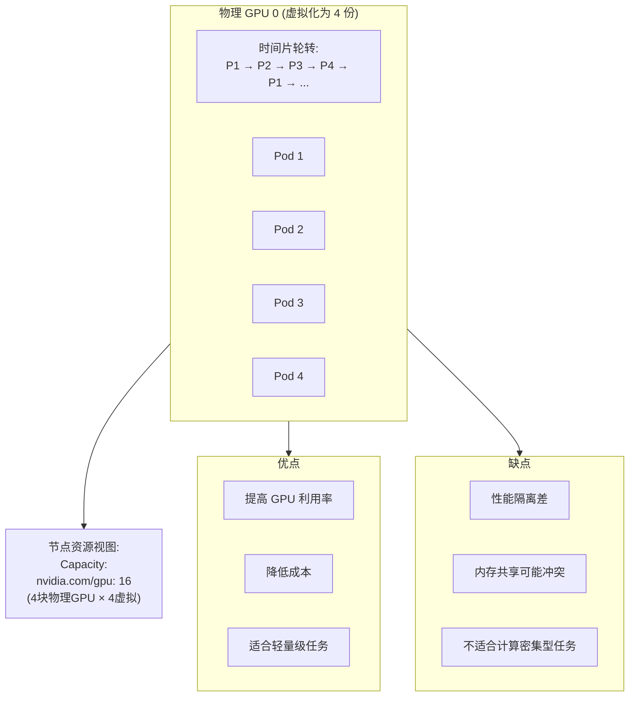

#### MIG (Multi-Instance GPU)

**原理**: 硬件级别将 GPU 分割为多个独立实例

```mermaid
graph TB
    subgraph A100["NVIDIA A100 (40GB) MIG 分区"]
        MIG1["MIG 1<br/>20GB<br/>3g.20gb<br/><br/>独立计算<br/>独立内存<br/>独立SM"]
        MIG2["MIG 2<br/>10GB<br/>2g.10gb<br/><br/>独立计算<br/>独立SM"]
        MIG3["MIG 3<br/>10GB<br/>2g.10gb<br/><br/>独立内存<br/>独立SM"]
    end

    Config["MIG 配置选项:<br/>A100-40GB 支持:<br/>- 1x 3g.20gb + 1x 2g.10gb + 1x 2g.10gb<br/>- 2x 3g.20gb<br/>- 4x 2g.10gb<br/>- 7x 1g.5gb"]

    subgraph Pros["优点"]
        Pro1[硬件隔离,性能保证]
        Pro2[独立内存空间]
        Pro3[故障隔离]
    end

    subgraph Cons["缺点"]
        Con1[只有 A100/A30 支持]
        Con2[配置不够灵活]
        Con3[需要重启更改配置]
    end

    A100 --> Config
    A100 --> Pros
    A100 --> Cons
```

#### vGPU (虚拟 GPU)

**原理**: 通过虚拟化层将物理 GPU 虚拟化

```mermaid
graph TB
    subgraph Host["宿主机架构"]
        vGPUMgr["NVIDIA vGPU Manager (Hypervisor)"]

        subgraph PhysicalGPU["物理 GPU (A100)"]
            vGPU1["vGPU 1<br/>8GB"]
            vGPU2["vGPU 2<br/>8GB"]
            vGPU3["vGPU 3<br/>8GB"]
        end

        vGPUMgr --> PhysicalGPU
    end

    VM1["VM 1<br/>(Pod/容器)"]
    VM2["VM 2<br/>(Pod/容器)"]
    VM3["VM 3<br/>(Pod/容器)"]

    vGPU1 --> VM1
    vGPU2 --> VM2
    vGPU3 --> VM3

    Features["特点:<br/>- 支持多种 GPU 型号<br/>- 内存、计算资源可配置<br/>- 适合虚拟化环境<br/><br/>许可:<br/>- 需要 vGPU 许可证 (商业产品)"]
```

### 2.3 GPU 拓扑感知

**GPU 互联拓扑**:

```mermaid
graph TB
    Topology["多 GPU 系统拓扑示例:<br/><br/>        GPU0    GPU1    GPU2    GPU3    NIC<br/>GPU0     X      NV12    NV12    NV12    NODE<br/>GPU1    NV12     X      NV12    NV12    NODE<br/>GPU2    NV12    NV12     X      NV12    SYS<br/>GPU3    NV12    NV12    NV12     X      SYS"]

    Legend["图例:<br/>X    = 自己<br/>NV12 = NVLink 12 lanes (高速互联, 600 GB/s)<br/>NODE = 同一 NUMA 节点 (较快)<br/>SYS  = 跨 NUMA 节点通过 PCIe (较慢)"]

    Performance["性能影响:<br/>NVLink > NUMA > PCIe<br/><br/>分布式训练考虑:<br/>- 尽量使用 NVLink 连接的 GPU<br/>- 避免跨 NUMA 节点<br/>- Ring-AllReduce 拓扑优化"]

    Topology --> Legend
    Legend --> Performance
```

**拓扑感知调度策略**:

```mermaid
graph TB
    Request["Pod 请求 4 块 GPU 用于分布式训练"]

    Strategy1["策略 1: 拓扑最优<br/>选择 GPU 0-3<br/>全部 NVLink 互联<br/>通信性能最佳"]

    Strategy2["策略 2: 同 NUMA 节点<br/>选择 GPU 0-1<br/>同 NUMA, PCIe 互联<br/>性能次优"]

    Strategy3["策略 3: 跨节点 (避免)<br/>GPU 0, 1 (NUMA 0)<br/>GPU 2, 3 (NUMA 1)<br/>跨 NUMA 通信慢"]

    Request --> Strategy1
    Request --> Strategy2
    Request --> Strategy3
```

---

## 第三部分:多租户隔离

### 3.1 隔离层次

**多租户隔离金字塔**:

```mermaid
graph TB
    Physical["物理隔离 (独立集群)<br/>- 完全独立的集群<br/>- 无资源共享<br/><br/>最强"]

    Virtual["虚拟集群 (vCluster)<br/>- 独立的 Control Plane<br/>- 共享 Worker Nodes"]

    Namespace["命名空间隔离 (Namespace)<br/>- 逻辑隔离<br/>- 资源配额<br/>- RBAC 权限<br/><br/>常用"]

    Labels["标签隔离 (Labels)<br/>- 软隔离<br/>- 依赖自律<br/><br/>最弱"]

    Physical --> Virtual
    Virtual --> Namespace
    Namespace --> Labels
```

### 3.2 Namespace 隔离

**Namespace 边界**:

```mermaid
graph TB
    subgraph Cluster["Kubernetes Cluster"]
        subgraph NSA["Namespace A (租户 A)"]
            PodsA["Pods<br/>Services<br/>ConfigMap"]
            QuotaA["ResourceQuota<br/>NetworkPolicy<br/>RBAC Rules"]
        end

        subgraph NSB["Namespace B (租户 B)"]
            PodsB["Pods<br/>Services<br/>ConfigMap"]
            QuotaB["ResourceQuota<br/>NetworkPolicy<br/>RBAC Rules"]
        end
    end

    Isolated["Namespace 隔离的资源:<br/>- Pods<br/>- Services<br/>- Deployments<br/>- ConfigMaps<br/>- Secrets<br/>- ServiceAccounts<br/>- ResourceQuotas<br/>- LimitRanges"]

    ClusterLevel["集群级别资源 (不隔离):<br/>- Nodes<br/>- PersistentVolumes<br/>- StorageClasses<br/>- ClusterRoles"]

    Cluster --> Isolated
    Cluster --> ClusterLevel
```

### 3.3 资源配额 (ResourceQuota)

**配额类型**:

**计算资源配额**:

```mermaid
graph TB
    subgraph Namespace["Namespace: tenant-a"]
        Quota["ResourceQuota:<br/>CPU Requests: 100 核<br/>CPU Limits: 200 核<br/>Memory Requests: 200Gi<br/>Memory Limits: 400Gi<br/>GPU: 4 块"]

        Used["已使用:<br/>CPU Requests: 60/100<br/>Memory Requests: 120/200Gi<br/>GPU: 2/4"]

        Available["可用:<br/>CPU Requests: 40<br/>Memory Requests: 80Gi<br/>GPU: 2"]

        Quota --> Used
        Used --> Available
    end

    Exceed["超配额请求:<br/>Pod 请求: CPU 50 核<br/>结果: ✗ 拒绝 (超出剩余 40 核)"]

    Namespace --> Exceed
```

**对象数量配额**:
```
┌───────────────────────────────┐
│  对象数量限制:                │
│  ┌─────────────────────────┐  │
│  │ pods:              100  │  │
│  │ services:          50   │  │
│  │ secrets:           100  │  │
│  │ configmaps:        100  │  │
│  │ persistentvolumeclaims: │  │
│  │                    20   │  │
│  └─────────────────────────┘  │
└───────────────────────────────┘

用途:
- 防止资源滥用
- 限制 API 对象数量
- 保护 etcd 存储
```

**存储配额**:
```
┌───────────────────────────────┐
│  存储资源配额:                │
│  ┌─────────────────────────┐  │
│  │ requests.storage: 1Ti   │  │
│  │                         │  │
│  │ 按 StorageClass 配额:   │  │
│  │ ssd.storageclass:500Gi │  │
│  │ hdd.storageclass:1Ti   │  │
│  └─────────────────────────┘  │
└───────────────────────────────┘
```

### 3.4 LimitRange (资源限制)

**作用**: 设置单个资源的默认值和限制

```mermaid
graph TB
    subgraph LimitRangeLevels["LimitRange 约束层次"]
        PodLevel["Pod 级别限制<br/>- Pod 总资源上下限"]
        ContainerLevel["Container 级别限制<br/>- 单容器资源上下限<br/>- 默认 requests/limits<br/>- requests/limits 比例"]
        PVCLevel["PVC 级别限制<br/>- 存储容量上下限"]

        PodLevel --> ContainerLevel
        ContainerLevel --> PVCLevel
    end

    subgraph Example["示例配置效果"]
        Config["LimitRange: tenant-limits<br/><br/>Container:<br/>- max: CPU 8, Memory 16Gi<br/>- min: CPU 100m, Memory 128Mi<br/>- default: CPU 1, Memory 1Gi<br/>- defaultRequest: CPU 500m, 512Mi<br/><br/>PVC:<br/>- max: 100Gi<br/>- min: 1Gi"]
    end

    subgraph Scenarios["Pod 创建场景"]
        S1["场景 1: 未指定 resources<br/>结果: 自动设置<br/>requests: CPU 500m, Memory 512Mi<br/>limits: CPU 1, Memory 1Gi"]

        S2["场景 2: 请求 CPU 10<br/>结果: ✗ 拒绝 (超过 max 8)"]

        S3["场景 3: 请求 CPU 50m<br/>结果: ✗ 拒绝 (低于 min 100m)"]
    end

    LimitRangeLevels --> Example
    Example --> Scenarios
```

### 3.5 网络隔离 (NetworkPolicy)

**网络策略模型**:

```mermaid
graph TB
    subgraph Default["默认行为 (无 NetworkPolicy)"]
        PodA1[Pod A<br/>NS: A]
        PodB1[Pod B<br/>NS: B]
        PodA1 -->|✓ 允许| PodB1
    end

    subgraph WithPolicy["应用 NetworkPolicy 后"]
        PodA2[Pod A<br/>NS: A]
        PodB2[Pod B<br/>NS: B]
        PodA2 -.->|✗ 拒绝<br/>(明确允许才放行)| PodB2
    end
```

**流量方向**:

```mermaid
graph LR
    Ingress[Ingress<br/>(入站)]
    Pod[Pod/Service]
    Egress[Egress<br/>(出站)]

    Ingress --> Pod
    Pod --> Egress
```

**策略示例**:

**1. 默认拒绝所有流量**

```mermaid
graph TB
    subgraph NS["Namespace: production"]
        NP["NetworkPolicy:<br/>- 拒绝所有 Ingress<br/>- 拒绝所有 Egress<br/><br/>效果: 完全隔离"]
    end
```

**2. 允许同命名空间通信**

```mermaid
graph TB
    subgraph TeamA["Namespace: team-a"]
        Pod1A[Pod1]
        Pod2A[Pod2]
        Pod3A[Pod3]

        Pod1A -->|✓| Pod2A
        Pod2A -->|✓| Pod3A
    end

    subgraph TeamB["Namespace: team-b"]
        Pod4B[Pod4]
    end

    Pod3A -.->|✗ 拒绝| Pod4B
```

**3. 三层应用架构**

```mermaid
graph TB
    Internet[Internet]
    Ingress[Ingress]

    Frontend["Frontend Pods<br/>允许来自:<br/>- Ingress<br/>允许去往:<br/>- Backend"]

    Backend["Backend Pods<br/>允许来自:<br/>- Frontend<br/>允许去往:<br/>- Database"]

    Database["Database Pods<br/>允许来自:<br/>- Backend only<br/>拒绝出站"]

    Internet --> Ingress
    Ingress --> Frontend
    Frontend --> Backend
    Backend --> Database
```

### 3.6 RBAC (基于角色的访问控制)

**RBAC 模型**:

```mermaid
graph LR
    Subject["User/<br/>Group/<br/>Service<br/>Account"]

    Role["Role<br/>(权限集)"]

    Resource["Resource<br/>(资源)"]

    Subject -->|绑定| Role
    Role -->|授权| Resource

    Components["组件:<br/>1. Subject (主体): 谁要访问?<br/>   - User (用户)<br/>   - Group (组)<br/>   - ServiceAccount (服务账户)<br/><br/>2. Role/ClusterRole (角色): 允许做什么?<br/>   - Role: 命名空间级别<br/>   - ClusterRole: 集群级别<br/>   - 定义权限 (verbs + resources)<br/><br/>3. RoleBinding/ClusterRoleBinding (绑定): 谁拥有什么权限?<br/>   - RoleBinding: 命名空间级别<br/>   - ClusterRoleBinding: 集群级别"]
```

**权限粒度**:
```
Verbs (操作):
- get        (读取单个资源)
- list       (列出资源)
- watch      (监听资源变化)
- create     (创建)
- update     (更新)
- patch      (部分更新)
- delete     (删除)
- deletecollection (批量删除)

Resources (资源):
- pods
- services
- deployments
- configmaps
- secrets
- nodes
- ...

API Groups:
- ""         (core API)
- apps       (Deployment, StatefulSet)
- batch      (Job, CronJob)
- networking.k8s.io
- rbac.authorization.k8s.io
```

**角色示例**:

**租户管理员 (高权限)**

```mermaid
graph TB
    subgraph Admin["Role: tenant-admin<br/>Namespace: tenant-a"]
        Perms["Permissions:<br/>- pods/*<br/>- services/*<br/>- deployments/*<br/>- configmaps/*<br/>- secrets/*<br/><br/>除外:<br/>- resourcequotas (只读)<br/>- networkpolicies (只读)"]
    end
```

**租户开发者 (受限权限)**

```mermaid
graph TB
    subgraph Developer["Role: tenant-developer<br/>Namespace: tenant-a"]
        Perms["Permissions:<br/>- pods: get, list, create<br/>- pods/log: get<br/>- deployments: *<br/>- services: get, list<br/>- configmaps: get, list<br/>- secrets: get, list<br/><br/>禁止:<br/>- 删除 Pod<br/>- 修改 Service"]
    end
```

**只读用户**

```mermaid
graph TB
    subgraph Viewer["Role: viewer<br/>Namespace: tenant-a"]
        Perms["Permissions:<br/>- 所有资源: get, list<br/>- pods/log: get<br/><br/>禁止:<br/>- 任何修改操作"]
    end
```

### 3.7 节点池隔离

**污点和容忍机制**:

```mermaid
graph TB
    subgraph TenantANodes["租户 A 节点池"]
        Node1["Node 1<br/>Taint:<br/>tenant=A:NoSchedule"]
        Node2["Node 2<br/>Taint:<br/>tenant=A:NoSchedule"]
    end

    PodA["租户 A 的 Pod<br/>Tolerations:<br/>- key: tenant<br/>  value: A<br/>  effect: NoSchedule<br/><br/>✓ 可以调度到租户 A 节点"]

    PodB["租户 B 的 Pod<br/>无此容忍<br/>✗ 无法调度到租户 A 节点"]

    PodA -->|只有容忍此污点的 Pod 可调度| TenantANodes
    PodB -.->|拒绝| TenantANodes
```

**Taint Effect 类型**:
```
1. NoSchedule (不调度)
   - 新 Pod 不会调度到该节点
   - 已存在的 Pod 不受影响

2. PreferNoSchedule (尽量不调度)
   - 尽量避免调度
   - 无其他节点时仍会调度

3. NoExecute (驱逐)
   - 新 Pod 不会调度
   - 已存在的 Pod 会被驱逐
   - 除非 Pod 容忍此污点
```

**节点亲和性 (软隔离)**:

```mermaid
graph TB
    subgraph Affinity["Pod Affinity"]
        Required["Required (必须):<br/>- 硬性要求<br/>- 不满足则调度失败"]

        Preferred["Preferred (优先):<br/>- 软性要求<br/>- 不满足也可调度<br/>- 权重影响优先级"]

        Required -.-> Preferred
    end

    subgraph Example["示例"]
        PodB["租户 B Pod<br/>NodeAffinity:<br/>- Preferred:<br/>  weight: 100<br/>  matchExpressions:<br/>  - key: tenant<br/>    operator: In<br/>    values: [B]<br/><br/>- Required:<br/>  matchExpressions:<br/>  - key: tenant<br/>    operator: NotIn<br/>    values: [A]  (禁止调度到A)"]
    end

    Affinity --> Example
```

---

## 第四部分:Helm Charts 与 GitOps

### 4.1 Helm 概念

**Helm 是什么?**
- Kubernetes 的包管理器
- 类似于 apt/yum/npm
- 管理复杂应用的部署

**核心概念**:

```mermaid
graph TB
    Chart["Chart (图表)<br/>- Kubernetes 资源的打包<br/>- 包含模板和默认值<br/>- 可版本化"]

    Release["Release (发布)<br/>- Chart 的运行实例<br/>- 有独立的名称<br/>- 可回滚"]

    K8s["Kubernetes Cluster<br/>- Deployment<br/>- Service<br/>- ConfigMap<br/>- ..."]

    Chart -->|helm install| Release
    Release -->|应用到| K8s
```

**Chart 结构**:
```
my-app/
├── Chart.yaml           # Chart 元数据
│   - name
│   - version
│   - appVersion
│   - dependencies
│
├── values.yaml          # 默认配置值
│   - image: nginx:1.21
│   - replicas: 3
│   - service.port: 80
│
├── templates/           # Kubernetes 资源模板
│   ├── deployment.yaml  # 使用 Go 模板语法
│   ├── service.yaml     # 引用 values.yaml 中的值
│   ├── ingress.yaml
│   ├── _helpers.tpl     # 模板辅助函数
│   └── NOTES.txt        # 安装后的提示信息
│
├── charts/              # 依赖的子 Chart
│   ├── mysql/
│   └── redis/
│
└── .helmignore          # 忽略的文件
```

**模板引擎**:
```
values.yaml:
replicaCount: 3
image:
  repository: nginx
  tag: 1.21

templates/deployment.yaml:
apiVersion: apps/v1
kind: Deployment
metadata:
  name: {{ .Release.Name }}-nginx
spec:
  replicas: {{ .Values.replicaCount }}
  template:
    spec:
      containers:
      - name: nginx
        image: {{ .Values.image.repository }}:{{ .Values.image.tag }}

渲染后:
apiVersion: apps/v1
kind: Deployment
metadata:
  name: my-release-nginx
spec:
  replicas: 3
  template:
    spec:
      containers:
      - name: nginx
        image: nginx:1.21
```

**依赖管理**:

```mermaid
graph TB
    MyApp["my-app"]
    MySQL["MySQL<br/>version: 8.x.x"]
    Redis["Redis<br/>version: 15.x.x"]

    MyApp --> MySQL
    MyApp --> Redis

    Config["Chart.yaml:<br/>dependencies:<br/>- name: mysql<br/>  version: 8.x.x<br/>  repository: https://charts.bitnami.com/bitnami<br/>  condition: mysql.enabled<br/><br/>- name: redis<br/>  version: 15.x.x<br/>  repository: https://charts.bitnami.com/bitnami<br/>  condition: redis.enabled"]
```

### 4.2 Helm Hooks

**Hook 生命周期**:

```mermaid
graph TB
    Start[helm install/upgrade 流程]

    LoadChart["1. 加载 Chart"]
    Render["2. 渲染模板"]
    PreHook["3. pre-install/pre-upgrade hooks<br/>(例如: 数据库迁移准备)"]
    Install["4. 安装/升级资源"]
    Wait["5. 等待资源就绪"]
    PostHook["6. post-install/post-upgrade hooks<br/>(例如: 数据库迁移执行)"]
    Complete["7. 完成"]

    Start --> LoadChart
    LoadChart --> Render
    Render --> PreHook
    PreHook --> Install
    Install --> Wait
    Wait --> PostHook
    PostHook --> Complete

    DeleteStart[helm delete 流程]
    PreDelete["1. pre-delete hooks<br/>(例如: 备份数据)"]
    Delete["2. 删除资源"]
    PostDelete["3. post-delete hooks<br/>(例如: 清理外部资源)"]
    DeleteComplete["4. 完成"]

    DeleteStart --> PreDelete
    PreDelete --> Delete
    Delete --> PostDelete
    PostDelete --> DeleteComplete
```

**Hook 类型**:
```
生命周期 Hooks:
- pre-install     (安装前)
- post-install    (安装后)
- pre-upgrade     (升级前)
- post-upgrade    (升级后)
- pre-delete      (删除前)
- post-delete     (删除后)
- pre-rollback    (回滚前)
- post-rollback   (回滚后)

测试 Hooks:
- test            (helm test 执行)
```

**Hook 权重和删除策略**:

```mermaid
graph TB
    Hook1["Hook 1: weight=-5<br/>先执行"]
    Hook2["Hook 2: weight=0<br/>其次"]
    Hook3["Hook 3: weight=5<br/>最后"]

    Hook1 --> Hook2
    Hook2 --> Hook3

    Deletion["删除策略:<br/>- before-hook-creation (创建新 Hook 前删除旧的)<br/>- hook-succeeded (成功后删除)<br/>- hook-failed (失败后删除)"]
```

### 4.3 GitOps 概念

**什么是 GitOps?**
- Git 作为单一事实来源 (Single Source of Truth)
- 声明式基础设施和应用
- 自动化同步和部署

**GitOps 原则**:
```
1. 声明式 (Declarative)
   - 使用声明式配置
   - 描述期望状态而非执行步骤

2. 版本化和不可变 (Versioned & Immutable)
   - 所有配置存储在 Git
   - Git 提供版本历史
   - 配置不可变

3. 自动拉取 (Pulled Automatically)
   - Agent 自动从 Git 拉取
   - 而非推送到集群

4. 持续调谐 (Continuously Reconciled)
   - 自动检测漂移 (drift)
   - 自动修复到期望状态
```

**GitOps 工作流**:

```mermaid
sequenceDiagram
    participant Developer
    participant Git as Git Repository
    participant ArgoCD
    participant K8s as Kubernetes Cluster

    Developer->>Developer: 1. 修改配置
    Developer->>Git: 2. git push
    Note over Git: k8s/<br/>├─ app.yaml<br/>├─ svc.yaml<br/>└─ ing.yaml

    ArgoCD->>Git: 3. ArgoCD 监听<br/>(每 3 分钟轮询)
    Note over ArgoCD: 4. 检测到变化
    Note over ArgoCD: 5. 对比差异
    ArgoCD->>K8s: 6. 同步到集群
    Note over K8s: Pods 部署
```

### 4.4 ArgoCD 架构

**组件架构**:

```mermaid
graph TB
    subgraph ArgoCD["ArgoCD Architecture"]
        APIServer["API Server<br/>- 提供 API 和 Web UI<br/>- 认证和授权"]

        RepoServer["Repository Server<br/>- 克隆 Git 仓库<br/>- 渲染 Helm/Kustomize"]

        AppController["Application Controller<br/>- 监控应用状态<br/>- 检测配置漂移<br/>- 执行同步"]

        APIServer --> RepoServer
        RepoServer --> AppController
    end

    K8sAPI["Kubernetes API"]

    AppController --> K8sAPI
```

**同步策略**:

**手动同步**:

```mermaid
graph TB
    GitChange["Git 变更"]
    DetectDiff["ArgoCD 检测到差异<br/>状态: OutOfSync"]
    WaitManual["等待人工触发同步"]
    UserSync["用户点击 'Sync'"]
    Apply["应用变更到集群"]

    GitChange --> DetectDiff
    DetectDiff --> WaitManual
    WaitManual --> UserSync
    UserSync --> Apply
```

**自动同步**:

```mermaid
graph TB
    GitChange["Git 变更"]
    DetectDiff["ArgoCD 检测到差异"]
    AutoSync["自动触发同步"]
    Apply["应用变更到集群"]
    SelfHeal["Self-Heal (可选)<br/>检测到手动修改<br/>自动恢复到 Git 状态"]

    GitChange --> DetectDiff
    DetectDiff --> AutoSync
    AutoSync --> Apply
    Apply --> SelfHeal
```

**同步选项**:
```
┌───────────────────────────────┐
│  Sync Options                 │
│                               │
│  Prune:                       │
│  - 删除 Git 中不存在的资源    │
│  - 防止资源孤立               │
│                               │
│  Self-Heal:                   │
│  - 自动修复漂移               │
│  - 恢复到 Git 定义的状态      │
│                               │
│  Auto-Create Namespace:       │
│  - 自动创建命名空间           │
│                               │
│  Retry:                       │
│  - 失败时自动重试             │
│  - 指数退避                   │
└───────────────────────────────┘
```

### 4.5 Progressive Delivery (渐进式交付)

**蓝绿部署 (Blue-Green)**:

```mermaid
graph TB
    subgraph Phase1["阶段 1: 蓝色版本服务中"]
        Blue1["Blue (v1)<br/>┌──┐ ┌──┐<br/>│  │ │  │<br/>└──┘ └──┘<br/>← 100% 流量"]
        Green1["Green (v2)<br/>┌──┐ ┌──┐<br/>│  │ │  │<br/>└──┘ └──┘<br/>0% 流量 (预部署)"]
    end

    subgraph Phase2["阶段 2: 切换流量"]
        Blue2["Blue (v1)<br/>┌──┐ ┌──┐<br/>│  │ │  │<br/>└──┘ └──┘<br/>0% 流量 (待删除)"]
        Green2["Green (v2)<br/>┌──┐ ┌──┐<br/>│  │ │  │<br/>└──┘ └──┘<br/>← 100% 流量"]
    end

    Pros["优点:<br/>- 快速切换<br/>- 易于回滚<br/>- 零停机"]

    Cons["缺点:<br/>- 需要 2倍 资源<br/>- 数据库迁移复杂"]

    Phase1 --> Phase2
    Phase2 --> Pros
    Phase2 --> Cons
```

**金丝雀发布 (Canary)**:

```mermaid
graph TB
    subgraph Phase1["阶段 1: 10% 流量到新版本"]
        v1_1["v1<br/>┌──┐┌──┐┌──┐<br/>│  ││  ││  │<br/>└──┘└──┘└──┘<br/>← 90% 流量"]
        v2_1["v2 (Canary)<br/>┌──┐<br/>│  │<br/>└──┘<br/>← 10% 流量<br/>(观察指标)"]
    end

    subgraph Phase2["阶段 2: 逐步增加 (50%)"]
        v1_2["v1<br/>┌──┐┌──┐<br/>│  ││  │<br/>└──┘└──┘<br/>← 50% 流量"]
        v2_2["v2<br/>┌──┐┌──┐<br/>│  ││  │<br/>└──┘└──┘<br/>← 50% 流量"]
    end

    subgraph Phase3["阶段 3: 完全切换"]
        v2_3["v2<br/>┌──┐┌──┐┌──┐<br/>│  ││  ││  │<br/>└──┘└──┘└──┘<br/>← 100% 流量"]
    end

    Pros["优点:<br/>- 渐进式验证<br/>- 风险可控<br/>- 自动化分析"]

    Cons["缺点:<br/>- 部署时间长<br/>- 需要流量分割<br/>- 需要指标监控"]

    Phase1 --> Phase2
    Phase2 --> Phase3
    Phase3 --> Pros
    Phase3 --> Cons
```

**自动分析**:

```mermaid
graph TB
    Deploy["部署 Canary (10% 流量)"]
    Collect["收集指标 (5 分钟)"]

    Check1{错误率 < 1%?}
    Check2{P95 延迟 < 200ms?}
    Check3{成功率 > 99.9%?}

    Rollback[自动回滚]
    Increase[增加流量]

    Deploy --> Collect
    Collect --> Check1
    Check1 -->|✓ 通过| Check2
    Check1 -->|✗ 失败| Rollback
    Check2 -->|✓ 通过| Check3
    Check2 -->|✗ 失败| Rollback
    Check3 -->|✓ 通过| Increase
    Check3 -->|✗ 失败| Rollback
```

---

## 第五部分:高级概念

### 5.1 自定义资源 (CRD)

**扩展 Kubernetes API**:

```mermaid
graph TB
    subgraph Builtin["Kubernetes 内置资源"]
        Pod
        Service
        Deployment
    end

    subgraph Custom["自定义资源 (CRD)"]
        GPUJob["GPUJob<br/>apiVersion: ml.example.com/v1<br/>kind: GPUJob<br/>metadata:<br/>  name: training-job<br/>spec:<br/>  image: pytorch:1.9<br/>  gpuCount: 4<br/>  script: train.py"]
    end

    Extend["扩展 API<br/>定义新的资源类型<br/>像内置资源一样使用"]

    Builtin --> Extend
    Extend --> Custom
```

**CRD 定义结构**:

```mermaid
graph TB
    subgraph CRD["CustomResourceDefinition"]
        Meta["Group: ml.example.com<br/>Version: v1<br/>Kind: GPUJob"]

        SpecSchema["Spec Schema:<br/>- image: string<br/>- gpuCount: integer<br/>- script: string"]

        StatusSchema["Status Schema:<br/>- phase: string<br/>- startTime: timestamp"]

        Meta --> SpecSchema
        Meta --> StatusSchema
    end
```

### 5.2 Operator 模式

**Operator = CRD + Controller**

**概念**:

```mermaid
graph TB
    Traditional["传统方式部署应用:<br/>1. 编写 Deployment<br/>2. 编写 Service<br/>3. 编写 ConfigMap<br/>4. 手动运维(备份、恢复、扩容...)"]

    OperatorWay["Operator 方式:<br/>1. 定义 CRD<br/>2. Operator 自动管理所有资源<br/>3. 自动化运维操作"]

    subgraph Example["示例: MySQL Operator"]
        CR["MySQL CR<br/>spec:<br/>  version: 8.0<br/>  replicas: 3<br/>  storage: 100Gi"]

        Operator["MySQL Operator<br/>(Controller)<br/><br/>自动创建:<br/>- StatefulSet<br/>- Service<br/>- ConfigMap<br/>- PVC<br/><br/>自动运维:<br/>- 备份<br/>- 恢复<br/>- 升级<br/>- 扩容"]

        CR --> Operator
    end

    Traditional -.改进.-> OperatorWay
    OperatorWay --> Example
```

**控制循环**:

```mermaid
graph TB
    Loop["Operator Controller Loop"]

    Watch["1. Watch MySQL CR 变化"]
    Desired["2. 获取期望状态 (spec)<br/>- 版本: 8.0<br/>- 副本数: 3"]
    Actual["3. 获取实际状态<br/>- 当前版本: 8.0<br/>- 当前副本数: 2"]
    Compare["4. 对比差异<br/>- 副本数不足 1 个"]
    Reconcile["5. 调谐 (Reconcile)<br/>- 创建新的 StatefulSet Pod<br/>- 等待 Pod 就绪<br/>- 加入副本集"]
    UpdateStatus["6. 更新 Status<br/>- 副本数: 3<br/>- 状态: Running"]
    Wait["7. 等待下一次触发"]

    Loop --> Watch
    Watch --> Desired
    Desired --> Actual
    Actual --> Compare
    Compare --> Reconcile
    Reconcile --> UpdateStatus
    UpdateStatus --> Wait
    Wait --> Watch
```

### 5.3 调度器扩展

**调度框架 (Scheduling Framework)**:

```mermaid
graph TB
    PreFilter["PreFilter<br/>预处理 Pod 信息"]
    Filter["Filter (Predicate)<br/>过滤不符合条件的节点"]
    PostFilter["PostFilter<br/>处理过滤后的结果"]
    PreScore["PreScore<br/>预打分准备"]
    Score["Score (Priority)<br/>为节点打分"]
    NormalizeScore["NormalizeScore<br/>归一化分数"]
    Reserve["Reserve<br/>预留资源"]
    Permit["Permit<br/>允许/拒绝/等待"]
    PreBind["PreBind<br/>绑定前操作"]
    Bind["Bind<br/>绑定 Pod 到节点"]
    PostBind["PostBind<br/>绑定后操作"]

    PreFilter --> Filter
    Filter --> PostFilter
    PostFilter --> PreScore
    PreScore --> Score
    Score --> NormalizeScore
    NormalizeScore --> Reserve
    Reserve --> Permit
    Permit --> PreBind
    PreBind --> Bind
    Bind --> PostBind
```

**自定义调度策略**:

```mermaid
graph TB
    GPU["GPU 拓扑感知调度"]

    FilterStage["Filter 阶段:<br/>- 检查 GPU 数量<br/>- 检查 GPU 型号<br/>- 检查节点污点"]

    ScoreStage["Score 阶段:<br/>- NVLink 互联的 GPU: +100 分<br/>- 同 NUMA 节点: +50 分<br/>- 跨 NUMA: +0 分"]

    Select["选择最高分节点"]

    GPU --> FilterStage
    FilterStage --> ScoreStage
    ScoreStage --> Select
```

---

## 总结

### Kubernetes 核心要点

1. **声明式 API**: 描述期望状态,系统自动调谐
2. **控制循环**: 持续监控并修正偏差
3. **松耦合**: 组件通过 API Server 通信
4. **可扩展**: CRD、Operator、Admission Webhook

### GPU 调度策略

1. **独占模式**: 简单但利用率低
2. **时间片**: 提高利用率,性能隔离差
3. **MIG**: 硬件隔离,性能保证
4. **拓扑感知**: 优化多 GPU 通信性能

### 多租户隔离层次

1. **物理隔离**: 独立集群 (最强)
2. **虚拟集群**: 独立 Control Plane
3. **命名空间**: 资源配额 + RBAC (常用)
4. **节点池**: 污点/容忍 + 亲和性

### GitOps 原则

1. **Git 为单一事实来源**
2. **声明式配置**
3. **自动化同步**
4. **持续调谐和自我修复**

---

## 参考资源

- **Kubernetes 官方文档**: https://kubernetes.io/docs/
- **NVIDIA GPU Operator**: https://docs.nvidia.com/datacenter/cloud-native/gpu-operator/
- **Istio 服务网格**: https://istio.io/latest/docs/
- **Helm 文档**: https://helm.sh/docs/
- **ArgoCD 文档**: https://argo-cd.readthedocs.io/
- **CNCF Landscape**: https://landscape.cncf.io/
