draft: true
# 星舰 STARSHIP

## AI时代程序员的财富自由操作系统

> 从地球到火星的5年跃迁 · 不是乘客，而是飞行员
>
> 整合《快车道》《纳瓦尔宝典》《芒格之道》《原则》《原子习惯》《思考快与慢》的智慧
>
> **5年抵达 vs 40年漂流 — 这是你的星舰操作手册**

---
draft: true

```
         ✦
        ✦ ✦
       ✦   ✦
   ━━━━━━━━━━━━━━━
   ║   星  舰   ║
   ║  STARSHIP  ║
   ━━━━━━━━━━━━━━━
        🚀
     /     \
    /       \
🌍 ─────────→ 🔴
地球         火星
(打工)   5年跃迁   (自由)
```

---
draft: true

**星舰系统架构**：

- **🚀 推进系统**：Naval的4种杠杆（代码+媒体核心引擎）
- **🧭 导航系统**：芒格的多元思维模型工具箱
- **⚡ 燃料系统**：复利+原子习惯（1.01^365 = 37.8倍）
- **🎯 飞控系统**：Dalio的原则+检查清单
- **📊 轨道修正**：NECST 5大戒律验证框架
- **📖 操作手册**：90天倒计时行动计划
- **🛡️ 故障预案**：逆向思维+反脆弱策略

## 目录

**星舰系统模块索引**：

1. [发射台检查：慢车道vs快车道](#慢车道vs快车道财富思维的革命) 🚦
2. [推进系统：纳瓦尔的4种杠杆](#纳瓦尔的4种杠杆指数级财富创造) 🚀
3. [导航系统：芒格的多元思维模型工具箱](#芒格的多元思维模型工具箱) 🧭
4. [燃料舱：专长知识堆栈](#专长知识堆栈你的不可复制优势) ⚡
5. [轨道修正：快车道5大戒律验证](#快车道5大戒律验证) 📊
6. [飞控系统：从打工者到创造者的路径](#从打工者到创造者的路径) 🎯
7. [故障预案：逆向思维检查清单](#逆向思维避免失败的检查清单) 🛡️
8. [倒计时：90天行动计划](#可执行的90天行动计划) ⏱️
9. [系统集成：终极智慧](#终极智慧集成) 💎
10. [操作手册：立即行动](#最后的话) 📖

---
draft: true

## 慢车道vs快车道：财富思维的革命

### 核心理论：MJ DeMarco的财富路径革命

在《百万富翁快车道》中，MJ DeMarco揭示了一个残酷的真相：**大多数人走在错误的财富道路上**。

#### 三条路径的本质区别

**人行道（The Sidewalk）**：
- **思维模式**：活在当下，月光族，"YOLO"（You Only Live Once）
- **财富公式**：财富 = 收入 - 支出（永远为0或负数）
- **时间成本**：永远无法实现财富自由
- **典型特征**：买最新iPhone、豪车、奢侈品，但存款为0
- **风险**：一旦失业或生病，立即陷入财务危机

**慢车道（The Slowlane）**：
- **思维模式**：牺牲现在，换取40年后的退休生活
- **财富公式**：财富 = 工作 + 储蓄 + 投资复利
- **时间成本**：40-50年（从25岁工作到65岁退休）
- **典型特征**：节俭、存钱、买指数基金、等待复利
- **陷阱**：用最宝贵的青春年华，换取年老时的自由

**快车道（The Fastlane）**：
- **思维模式**：建立系统，让系统为你工作
- **财富公式**：财富 = 净利润 + 资产价值
- **时间成本**：5-10年
- **典型特征**：创造可规模化的价值，建立资产
- **优势**：在年轻时实现财富自由，享受人生最好的时光

#### 为什么慢车道是个谎言？

让我们用数学来揭示慢车道的真相：

**慢车道的复利神话**：
- 假设你25岁开始工作，年薪10万
- 每年存20%（2万），投资年化收益10%
- 40年后（65岁）：约 **973万**
- 听起来不错？但问题是：
  - ✗ 你牺牲了40年最宝贵的青春
  - ✗ 65岁时，健康可能已经不允许你享受财富
  - ✗ 通货膨胀会侵蚀购买力
  - ✗ 你的收入增长是线性的，受时间限制

**快车道的系统思维**：
- 假设你用5年建立一个SaaS产品
- 第1年：投入时间，MRR $0 → $3K
- 第2年：优化增长，MRR $3K → $20K
- 第3年：规模化，MRR $20K → $50K
- 第4-5年：MRR $50K → $100K
- 5年后：月收入$100K，年收入$120万
- 资产价值：$600万-$1200万（按5-10倍年收入估值）
- 关键：你才30岁，拥有时间、健康、财富

#### 你的现状诊断

**反思练习1：你在哪条路上？**

请诚实回答以下问题：

1. 你的主要收入来源是什么？
   - [ ] 工资/时薪（慢车道）
   - [ ] 自由职业/咨询（慢车道+）
   - [ ] 产品/服务的被动收入（快车道）
   - [ ] 资产增值（快车道）

2. 如果你停止工作3个月，会发生什么？
   - [ ] 立即陷入财务危机（人行道）
   - [ ] 可以支撑，但会焦虑（慢车道）
   - [ ] 收入不受影响（快车道）

3. 你的收入增长模式是？
   - [ ] 线性增长（每年涨薪5-10%）（慢车道）
   - [ ] 指数增长（系统规模化）（快车道）

4. 你的时间价值是？
   - [ ] 固定时薪/日薪（慢车道）
   - [ ] 可以无限复制（快车道）

**诊断结果**：
- 如果3个以上选择"慢车道"：你正在用40年青春换退休
- 如果2个以上选择"快车道"：你在正确的道路上
- 如果混合：你处于转型期，需要明确方向

### 1.1 三条财富之路对比

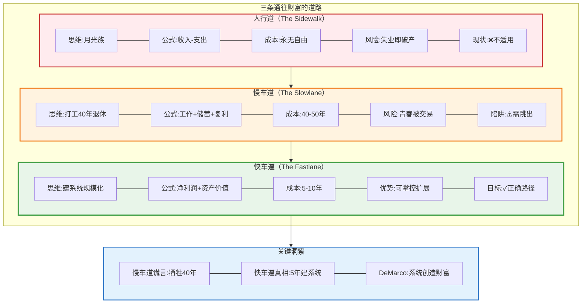

### 1.2 你的愿景：快车道验证

#### 你的"造物主权"愿景分析

你的愿景是：**5年内实现财富自由 + 创造巨大价值**。这是一个典型的快车道目标，但需要验证是否真正符合快车道原则。

**愿景拆解**：

1. **时间维度**：5年（✓ 符合快车道5-10年时间框架）
2. **价值维度**：创造价值，而非仅仅赚钱（✓ 符合快车道以用户为中心）
3. **系统维度**：建立数字生命体/系统（✓ 符合快车道系统化思维）

**当前状态评估**：

作为一名云原生架构师/AI应用开发者，你具备：
- ✓ **技术杠杆**：代码能力（可无限复制）
- ✓ **领域知识**：云原生 + AI（高价值领域）
- ✓ **系统思维**：架构师思维（可规模化）

但也存在慢车道陷阱：
- ⚠️ **主业依赖**：30%时间在主业，仍依赖老板
- ⚠️ **被动等待**：等待AI提效，而非主动创造
- ⚠️ **跨界分散**：多领域尝试，缺乏深度聚焦

#### 快车道验证清单

**反思练习2：你的愿景是快车道还是慢车道？**

请对照以下标准，诚实评估你的计划：

| 维度 | 慢车道特征 | 快车道特征 | 你的现状 |
|------|-----------|-----------|---------|
| **收入模式** | 时间换钱 | 系统赚钱 | [ ] 慢 [ ] 快 |
| **价值创造** | 为老板创造 | 为市场创造 | [ ] 慢 [ ] 快 |
| **可控性** | 依赖公司/平台 | 自主掌控 | [ ] 慢 [ ] 快 |
| **规模化** | 线性增长 | 指数增长 | [ ] 慢 [ ] 快 |
| **时间解耦** | 停工即停收入 | 睡觉也赚钱 | [ ] 慢 [ ] 快 |

**优化建议**：

如果你有3个以上"慢车道"特征，需要立即调整：

1. **从兼职到全力**：
   - 错误：主业70% + 副业30%
   - 正确：主业30%（维持现金流）+ 创业70%（全力以赴）
   - 行动：与老板谈判，减少工作时间或转为兼职

2. **从工具到产品**：
   - 错误：开发AI工具给自己用
   - 正确：开发AI产品解决他人痛点
   - 行动：找到10个愿意付费的用户，验证需求

3. **从跨界到专长**：
   - 错误：AI + 云原生 + 区块链 + ...（样样通，样样松）
   - 正确：AI × 云原生 = AI驱动的云原生基础设施（独特定位）
   - 行动：选择一个交叉领域，成为前5%

4. **从计划到验证**：
   - 错误：花3个月写完美计划
   - 正确：花2周做MVP，立即验证
   - 行动：今天就列出10个痛点，明天开始访谈

#### 你的快车道路线图

**阶段0：准备期（0-3个月）**
- **目标**：从慢车道思维切换到快车道思维
- **关键任务**：
  - [ ] 完成本文档的所有反思练习
  - [ ] 建立第二大脑系统（Notion/Obsidian）
  - [ ] 找到你的专长知识交叉点
  - [ ] 列出50个潜在痛点
  - [ ] 访谈30个目标用户
- **里程碑**：找到1个强痛点，至少5人愿意付费

**阶段1：验证期（3-12个月）**
- **目标**：验证PMF（Product-Market Fit）
- **关键任务**：
  - [ ] 2周内完成MVP
  - [ ] 获得前10个付费用户
  - [ ] MRR达到$3K-5K
  - [ ] 建立用户反馈循环
- **里程碑**：用户留存率>60%，NPS>40

**阶段2：增长期（12-24个月）**
- **目标**：规模化增长
- **关键任务**：
  - [ ] 优化产品，降低流失率
  - [ ] 找到可复制的获客渠道
  - [ ] MRR达到$20K
  - [ ] 被动收入占比>50%
- **里程碑**：可以辞职全职创业

**阶段3：规模期（24-36个月）**
- **目标**：建立系统，实现自动化
- **关键任务**：
  - [ ] 产品矩阵（多产品/多版本）
  - [ ] 建立团队（外包/兼职）
  - [ ] MRR达到$50K
  - [ ] 自动化运营
- **里程碑**：财富自由（被动收入>支出）

**阶段4：自由期（36-60个月）**
- **目标**：享受自由，追求意义
- **关键任务**：
  - [ ] 优化生活方式
  - [ ] 投资其他项目
  - [ ] 帮助他人（导师/投资人）
  - [ ] 追求更大的使命
- **里程碑**：MRR>$100K，影响1000+人

### 1.2 你的愿景：快车道验证（可视化）

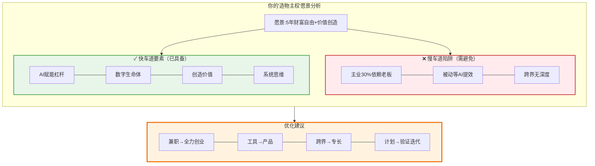

---
draft: true

## 纳瓦尔的4种杠杆：指数级财富创造

### 核心理论：Naval Ravikant的财富创造公式

Naval Ravikant（AngelList创始人）在《纳瓦尔宝典》中揭示了一个革命性的财富创造公式：

**财富 = 专长知识 × 杠杆 × 判断力**

这个公式的核心洞察是：**真正的财富来自于用杠杆放大你的判断力**。

#### 什么是杠杆？

杠杆是一种工具，让你的单位时间产出可以被无限放大。传统社会只有两种杠杆：
1. **劳动力**：雇佣员工为你工作
2. **资本**：用钱生钱

但这两种杠杆都需要"许可"：
- 劳动力需要管理能力和资金
- 资本需要初始资金和信任

**新时代的革命**：代码和媒体是**无需许可的杠杆**！

#### 为什么代码和媒体是最强杠杆？

**代码杠杆的威力**：
- ✓ **零边际成本**：写一次，复制无限次
- ✓ **24/7运行**：你睡觉时，代码在工作
- ✓ **全球分发**：互联网让你触达全球用户
- ✓ **无需许可**：不需要老板批准，不需要投资人同意

**案例**：
- WhatsApp：55名员工，服务9亿用户，被Facebook以190亿美元收购
- Instagram：13名员工，服务3000万用户，被Facebook以10亿美元收购
- 你的SaaS：1个人，服务1000个用户，年收入$120万

**媒体杠杆的威力**：
- ✓ **零成本传播**：一篇文章/视频可以被无限次观看
- ✓ **建立信任**：持续输出建立个人品牌
- ✓ **复利效应**：内容会持续带来流量和客户
- ✓ **无需许可**：任何人都可以开始创作

**案例**：
- Tim Ferriss：通过博客和播客，建立个人品牌，书籍销售数百万册
- Naval自己：通过Twitter和播客，影响数百万人，无需传统媒体
- 你的技术博客：通过持续输出，建立专家形象，吸引客户

#### 四种杠杆的对比分析

| 杠杆类型 | 边际成本 | 需要许可 | 启动门槛 | 规模上限 | 适合阶段 |
|---------|---------|---------|---------|---------|---------|
| **劳动力** | 高（工资） | 是（管理能力） | 中（资金） | 中（管理瓶颈） | 成熟期 |
| **资本** | 中（利息） | 是（信任/资金） | 高（初始资本） | 高（复利） | 第2-3年 |
| **代码** | 零 | 否 | 低（技能） | 极高 | ✓ 立即开始 |
| **媒体** | 零 | 否 | 极低（时间） | 极高 | ✓ 立即开始 |

**关键洞察**：
- 代码和媒体是程序员的**不公平优势**
- 你不需要等待资本积累，不需要等待团队建立
- 你可以**今天就开始**用代码和媒体创造财富

#### 反思练习3：你的杠杆现状

请诚实评估你当前使用的杠杆：

1. **你主要使用哪种杠杆？**
   - [ ] 劳动力（管理团队）
   - [ ] 资本（投资理财）
   - [ ] 代码（开发产品）
   - [ ] 媒体（内容创作）
   - [ ] 无杠杆（纯时间换钱）

2. **你的代码杠杆使用情况**：
   - [ ] 为公司写代码（老板获得杠杆）
   - [ ] 为自己写工具（自己使用，无杠杆）
   - [ ] 开发产品/服务（✓ 正确使用杠杆）
   - [ ] 开源项目商业化（✓ 正确使用杠杆）

3. **你的媒体杠杆使用情况**：
   - [ ] 不创作内容（0杠杆）
   - [ ] 偶尔写文章（低杠杆）
   - [ ] 持续输出内容（✓ 中杠杆）
   - [ ] 建立个人品牌（✓ 高杠杆）

4. **你的杠杆组合策略**：
   - [ ] 单一杠杆（风险高）
   - [ ] 代码+媒体（✓ 最佳组合）
   - [ ] 代码+媒体+资本（✓ 理想状态）
   - [ ] 四种杠杆全用（✓ 终极状态）

**诊断结果**：
- 如果你主要使用"劳动力"或"无杠杆"：你在慢车道，需要立即转型
- 如果你使用"代码"但为公司工作：你在为老板创造杠杆，需要为自己建立杠杆
- 如果你使用"代码+媒体"：你在正确的道路上，继续优化
- 如果你使用"代码+媒体+资本"：你已经掌握了财富创造的秘密

### 2.1 Naval的财富杠杆理论（可视化）

```mermaid
graph TB
    subgraph Leverage["Naval的4种财富杠杆"]
        direction TB

        subgraph Labor["1. 劳动力杠杆（最古老）"]
            direction LR
            L1[雇员管理] --- L2[优势:易用] --- L3[劣势:线性成本高] --- L4[适用:非首选]
        end

        subgraph Capital["2. 资本杠杆（传统）"]
            direction LR
            C1[用钱生钱] --- C2[优势:复利规模化] --- C3[劣势:需初始资本] --- C4[适用:第2-3年]
        end

        subgraph Code["3. 代码杠杆（新时代）★"]
            direction LR
            CO1[软件/AI无限复制] --- CO2[优势:零成本24/7] --- CO3[劣势:需技术能力] --- CO4[适用:✓核心优势]
        end

        subgraph Media["4. 媒体杠杆（新时代）★"]
            direction LR
            M1[内容品牌持续传播] --- M2[优势:零成本建信任] --- M3[劣势:需时间积累] --- M4[适用:✓立即开始]
        end
    end

    subgraph NavalQuote["Naval的核心观点"]
        direction LR
        Q1[秘诀:杠杆放大判断力] --- Q2[代码媒体:无需许可] --- Q3[劳动资本:需要许可] --- Q4[新财富:代码+媒体]
    end

    Labor --> NavalQuote
    Capital --> NavalQuote
    Code --> NavalQuote
    Media --> NavalQuote

    style Code fill:#4caf50,stroke:#2e7d32,stroke-width:3px
    style Media fill:#2196f3,stroke:#1565c0,stroke-width:3px
    style Labor fill:#9e9e9e,stroke:#616161,stroke-width:1px
    style Capital fill:#ff9800,stroke:#e65100,stroke-width:2px
```

### 2.2 你的杠杆策略

#### 程序员的杠杆组合策略

作为程序员，你天生拥有代码杠杆的能力。但关键是：**如何系统化地使用杠杆，而不是随机尝试**。

**Naval的核心建议**：
> "学会用代码和媒体创造财富。这是21世纪最强大的组合。"

#### 你的杠杆发展路径

**阶段1：代码杠杆为主（0-12个月）**

**核心目标**：从"为老板写代码"转变为"为自己建立资产"

**具体策略**：

1. **AI驱动的SaaS产品**
   - 痛点：找到开发者/企业的真实痛点
   - 方案：用AI+代码构建10倍好的解决方案
   - 例子：AI代码审查工具、AI文档生成器、AI测试工具
   - 验证：2周MVP，10个付费用户，MRR $3K-5K

2. **开源项目商业化**
   - 痛点：开源项目缺乏企业级功能/支持
   - 方案：核心开源，企业版收费
   - 例子：云原生工具的企业版、AI模型的托管服务
   - 验证：1000+ GitHub stars，50个企业客户试用

3. **自动化服务**
   - 痛点：企业需要自动化但缺乏技术能力
   - 方案：将你的专长打包成自动化服务
   - 例子：CI/CD自动化、基础设施自动化、AI工作流自动化
   - 验证：10个客户，月收入$5K+

**关键指标**：
- MRR：$3K-5K
- 用户数：100-500
- 时间投入：主业30% + 创业70%
- 被动收入占比：30%

**阶段2：代码+媒体（12-24个月）**

**核心目标**：建立个人品牌，实现产品和内容的正向循环

**具体策略**：

1. **产品优化+内容营销**
   - 产品：基于用户反馈，持续优化核心功能
   - 内容：每周发布2-3篇深度技术文章/视频
   - 主题：你的产品解决的问题、技术深度分析、行业洞察
   - 渠道：技术博客、YouTube、Twitter、LinkedIn

2. **技术博客/视频系列**
   - 格式：教程、案例研究、技术深度分析
   - 频率：每周2-3篇（文章）或1-2个视频
   - SEO：针对高价值关键词优化
   - 目标：每月10K+访问量，转化率3-5%

3. **社区/Newsletter运营**
   - 建立Discord/Slack社区
   - 每周发送Newsletter，提供价值
   - 举办线上Workshop/Webinar
   - 目标：5000+订阅者，10%付费转化

**关键指标**：
- MRR：$20K
- 用户数：1000-2000
- 内容输出：每周2-3篇
- 被动收入占比：50%
- 有机流量：60%+

**阶段3：全杠杆组合（24-36个月）**

**核心目标**：财富自由，系统自动化运行

**具体策略**：

1. **产品矩阵**
   - 核心产品：持续优化，占收入70%
   - 第二产品：针对不同细分市场
   - 企业版：高价格，定制化服务
   - 课程/咨询：知识变现

2. **品牌课程/付费社区**
   - 在线课程：$500-2000/人
   - 付费社区：$50-200/月
   - 1对1咨询：$500-1000/小时
   - 企业培训：$5K-20K/次

3. **小团队/外包**
   - 雇佣1-3个兼职/全职
   - 外包非核心工作
   - 你专注于：战略、产品、内容、销售
   - 释放80%时间

4. **盈利再投资**
   - 投资其他SaaS产品（资本杠杆）
   - 投资指数基金（被动收入）
   - 天使投资（帮助他人+财务回报）

**关键指标**：
- MRR：$50K-100K
- 用户数：5000-10000
- 团队：2-5人
- 被动收入占比：70%+
- 你的时间投入：每周<20小时

#### 实践练习4：制定你的杠杆计划

**第1步：评估当前状态**

在Notion/Obsidian中创建"杠杆仪表板"，记录：

| 杠杆类型 | 当前使用情况 | 每周时间投入 | 产出/回报 | 优化方向 |
|---------|------------|------------|---------|---------|
| 代码 | | | | |
| 媒体 | | | | |
| 资本 | | | | |
| 劳动力 | | | | |

**第2步：设计杠杆组合**

基于你所处的阶段，制定计划：

```
我目前在阶段：[ ] 0-12月 [ ] 12-24月 [ ] 24-36月

我的主要杠杆策略：
1. 代码杠杆：____________（具体项目）
2. 媒体杠杆：____________（内容类型/频率）
3. 资本杠杆：____________（投资计划）
4. 劳动力杠杆：____________（团队计划）

我的90天目标：
- 代码：____________
- 媒体：____________
- 收入：MRR $______
- 用户：______人
```

**第3步：立即行动清单**

今天（2小时）：
- [ ] 确定你的第一个代码杠杆项目
- [ ] 注册一个域名/GitHub组织
- [ ] 写下你的第一篇内容大纲

本周（10小时）：
- [ ] 完成MVP的核心功能设计
- [ ] 发布第一篇技术文章/视频
- [ ] 访谈10个潜在用户

本月（40小时）：
- [ ] 发布MVP
- [ ] 发布8-12篇内容
- [ ] 获得前3个付费用户
- [ ] 建立内容发布系统

**第4步：杠杆效率追踪**

每周复盘，计算你的"杠杆效率"：

```
杠杆效率 = 产出价值 / 时间投入

例如：
- 写代码为公司：$50/小时（线性，无杠杆）
- 开发SaaS产品：第1月$10/小时，第12月$500/小时（指数增长）
- 创作内容：第1篇$5/小时，第100篇$200/小时（复利效应）
```

目标：每季度杠杆效率提升2-3倍

### 2.2 你的杠杆策略（可视化）

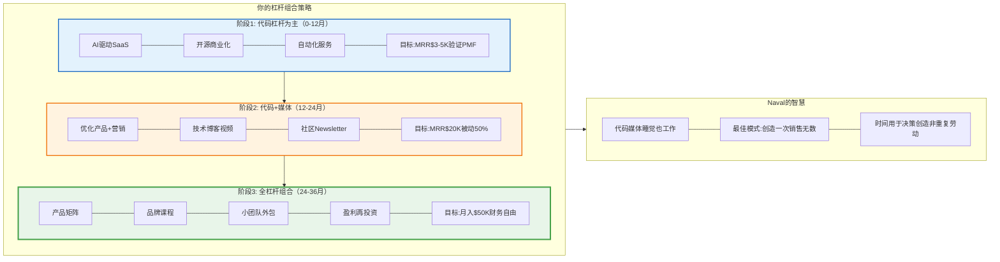

---
draft: true

## 芒格的多元思维模型工具箱

### 核心理论：查理·芒格的格栅思维

查理·芒格（Charlie Munger）是沃伦·巴菲特的黄金搭档，伯克希尔·哈撒韦的副主席。他最著名的理论是：**多元思维模型**。

**芒格的核心洞察**：
> "在手里拿着铁锤的人看来，每个问题都像钉子。"

这句话揭示了单一思维模型的危险：**如果你只掌握一种思维方式，你会试图用它解决所有问题，即使它不适用**。

#### 什么是多元思维模型？

**定义**：从不同学科（数学、物理、生物、心理、经济）中提取核心原理，形成一个跨学科的思维工具箱。

**为什么需要多元思维模型？**

1. **避免单一视角的盲区**
   - 工程师倾向于技术解决方案
   - 商业人倾向于市场解决方案
   - 真正的解决方案往往需要跨学科思考

2. **找到问题的根本原因**
   - 表面问题：用户流失率高
   - 心理学视角：产品缺乏"习惯钩子"
   - 经济学视角：转换成本太低
   - 生物学视角：缺乏"网络效应"生态

3. **预测二阶、三阶效应**
   - 一阶效应：降价 → 销量增加
   - 二阶效应：销量增加 → 品牌价值下降
   - 三阶效应：品牌价值下降 → 高端客户流失

#### 程序员必须掌握的10大思维模型

**1. 数学模型：复利**
- **原理**：1.01^365 = 37.8，0.99^365 = 0.03
- **应用**：
  - 每天进步1%，一年后你是现在的37.8倍
  - 每天退步1%，一年后你几乎归零
  - 专注于可积累的技能和资产
- **实践**：选择有复利效应的工作（代码、内容、网络）

**2. 物理模型：临界质量**
- **原理**：核反应需要临界质量才能引爆
- **应用**：
  - 产品需要达到临界用户量才能产生网络效应
  - 内容需要达到临界数量才能产生SEO效果
  - 技能需要达到临界深度才能变现
- **实践**：专注一个领域，达到临界质量后再扩展

**3. 生物模型：进化论**
- **原理**：适者生存，物竞天择
- **应用**：
  - 市场会淘汰不适应的产品/公司
  - 快速迭代 > 完美计划
  - 多样性 > 单一押注
- **实践**：快速发布，快速迭代，A/B测试

**4. 心理模型：激励机制**
- **原理**：人们响应激励，而非你的期望
- **应用**：
  - 用户不会因为"应该"而使用产品
  - 员工不会因为"责任"而努力工作
  - 设计正确的激励，行为自然改变
- **实践**：产品设计要有明确的用户激励（奖励、成就、社交认同）

**5. 经济模型：机会成本**
- **原理**：选择A意味着放弃B
- **应用**：
  - 做这个项目的成本 = 放弃的其他项目的价值
  - 在公司工作的成本 = 放弃创业的机会
  - 免费的代价往往最高（时间、注意力）
- **实践**：每个决策都要问："我放弃了什么？"

**6. 数学模型：概率思维**
- **原理**：世界是概率的，不是确定的
- **应用**：
  - 创业成功率<5%，但10次尝试，成功概率40%
  - 不要因为一次失败就放弃
  - 增加"抽奖次数"，而不是寄希望于单次成功
- **实践**：同时尝试多个小项目，找到PMF后all-in

**7. 物理模型：杠杆原理**
- **原理**：给我一个支点，我能撬动地球
- **应用**：
  - 代码是杠杆（1份工作，无限次复制）
  - 媒体是杠杆（1篇文章，无限次阅读）
  - 找到你的支点（专长知识）和杠杆（代码/媒体）
- **实践**：专注于高杠杆活动，外包低杠杆活动

**8. 生物模型：生态位**
- **原理**：每个物种都有独特的生态位
- **应用**：
  - 不要在红海竞争，找到蓝海生态位
  - 交叉领域 = 独特生态位（AI × 云原生）
  - 小市场的第一 > 大市场的第N
- **实践**：找到你的独特定位，成为细分领域第一

**9. 心理模型：损失厌恶**
- **原理**：人们对损失的痛苦 > 获得的快乐（2:1）
- **应用**：
  - 免费试用 + 取消麻烦 = 高转化
  - "不要错过" > "赶紧获得"
  - "保护你的数据" > "提升效率"
- **实践**：产品营销强调"避免损失"而非"获得收益"

**10. 经济模型：规模效应**
- **原理**：规模越大，边际成本越低
- **应用**：
  - SaaS：第1个用户成本$10K，第10000个用户成本$0.1
  - 内容：第1篇文章回报低，第100篇文章回报高
  - 网络：第1个用户价值0，第10000个用户价值巨大
- **实践**：选择有规模效应的业务模型

#### 如何建立你的思维模型工具箱？

**步骤1：学习基础模型**（3个月）
- 阅读《穷查理宝典》
- 学习每个学科的3-5个核心模型
- 建立思维模型清单

**步骤2：刻意应用**（6个月）
- 每周选择1个模型，应用到实际问题
- 记录：问题 → 模型 → 解决方案 → 结果
- 建立你的案例库

**步骤3：组合使用**（持续）
- 遇到复杂问题，从多个角度分析
- 用3-5个模型交叉验证
- 找到最优解决方案

#### 反思练习5：用多元思维模型分析你的项目

选择你正在做/计划做的一个项目，用至少5个思维模型分析：

| 思维模型 | 分析角度 | 洞察/发现 | 行动建议 |
|---------|---------|----------|---------|
| 复利 | 这个项目有复利效应吗？ | | |
| 临界质量 | 需要多少用户才能引爆？ | | |
| 进化论 | 如何快速迭代验证？ | | |
| 激励机制 | 用户为什么要用？ | | |
| 生态位 | 我的独特定位是什么？ | | |
| 规模效应 | 边际成本会递减吗？ | | |
| 网络效应 | 用户越多越有价值吗？ | | |

**案例分析**：

假设你要做一个"AI代码审查工具"：

- **复利**：代码库越大，历史数据越多，AI越准确（✓ 有复利）
- **临界质量**：需要100个团队使用才能训练出好模型
- **进化论**：2周MVP，快速迭代，基于用户反馈优化
- **激励机制**：开发者讨厌代码审查，AI自动化 = 节省时间
- **生态位**：专注云原生应用的代码审查（独特定位）
- **规模效应**：第1个客户成本高，第1000个客户成本接近0
- **网络效应**：所有用户的代码数据改进整个系统（✓ 强网络效应）

**结论**：这是一个好项目，具备多个快车道特征！

### 3.1 查理·芒格的思维模型框架（可视化）

```mermaid
graph TB
    subgraph Munger["芒格的多元思维模型"]
        direction TB

        Core[核心:在手里拿着铁锤的人看来每个问题都像钉子]

        subgraph Models["跨学科思维模型网格"]
            direction TB

            subgraph Math["数学模型"]
                direction LR
                M1[复利:最强大力量] --- M2[排列组合:可能性] --- M3[决策树:概率] --- M4[贝叶斯:更新信念]
            end

            subgraph Physics["物理学模型"]
                direction LR
                P1[临界质量:引爆点] --- P2[杠杆:支点力臂] --- P3[熵:系统退化] --- P4[能量守恒:无免费午餐]
            end

            subgraph Biology["生物学模型"]
                direction LR
                B1[进化:适者生存] --- B2[生态位:差异化] --- B3[红皇后:必须奔跑] --- B4[复制:病毒传播]
            end

            subgraph Psychology["心理学模型"]
                direction LR
                PS1[激励机制] --- PS2[社会认同] --- PS3[互惠] --- PS4[损失厌恶] --- PS5[承诺一致]
            end

            subgraph Economics["经济学模型"]
                direction LR
                E1[供需:价格机制] --- E2[边际效用递减] --- E3[机会成本] --- E4[规模效应]
            end
        end

        Core --> Models
    end

    subgraph Application["应用到你的创业"]
        direction LR
        A1[复利:日1%年37.8倍] --- A2[生态位:独特定位] --- A3[网络效应:指数增长] --- A4[损失厌恶:免费试用] --- A5[规模效应:边际递减]
    end

    Munger --> Application

    style Math fill:#e3f2fd,stroke:#1565c0,stroke-width:2px
    style Psychology fill:#ffebee,stroke:#c62828,stroke-width:2px
    style Economics fill:#e8f5e9,stroke:#43a047,stroke-width:2px
    style Application fill:#fff3e0,stroke:#ef6c00,stroke-width:3px
```

### 3.2 芒格的逆向思维：避免失败

#### 逆向思维的威力

芒格最著名的一句话：
> "告诉我我会死在哪里，这样我就永远不去那里。"

这句话来自一个德国数学家的笑话，但芒格将它变成了一个强大的思维工具：**逆向思维（Inversion）**。

**核心原理**：
- **正向思考**：我怎样才能成功？
- **逆向思考**：我怎样才能失败？然后避免它！

**为什么逆向思维更有效？**

1. **失败模式是有限的，成功路径是无限的**
   - 创业失败的原因：10-20种常见模式
   - 创业成功的路径：千万种独特方式
   - 避免失败模式 > 追求成功模式

2. **人类更擅长识别风险**
   - 进化让我们善于识别危险（生存本能）
   - 识别机会需要理性思考（慢思考）
   - 利用本能，而非对抗本能

3. **避免愚蠢比追求聪明更容易**
   - 聪明很难定义和复制
   - 愚蠢很容易识别和避免
   - 不犯大错，自然会有好结果

#### 创业的8大失败模式

基于数千个创业失败案例的总结：

**失败模式1：伪需求（解决不存在的问题）**
- **表现**：产品很酷，但没人愿意付费
- **原因**：自我中心，没有真实用户验证
- **避免**：10人付费验证法则（至少10人愿意预付费）
- **案例**：无数"AI工具"项目，开发者自嗨，用户不买单

**失败模式2：定价错误（价格与价值不匹配）**
- **表现**：定价太低（赚不到钱）或太高（无人问津）
- **原因**：不了解目标市场的支付意愿
- **避免**：访谈用户，测试不同价格点
- **案例**：SaaS定价$9/月，获客成本$100，永远不盈利

**失败模式3：过早扩张（还没PMF就扩张）**
- **表现**：招聘团队、融资、营销，但产品还没验证
- **原因**：被媒体/VC压力驱动，而非用户需求
- **避免**：PMF前只做最小化团队（1-3人）
- **案例**：融资后迅速招聘20人，6个月后裁员，项目夭折

**失败模式4：忽视反馈（闭门造车）**
- **表现**：用户说不需要，但你认为他们"不懂"
- **原因**：确认偏见，只看支持自己的证据
- **避免**：每周至少5个用户访谈，数据驱动决策
- **案例**：花6个月开发完美产品，发布后无人使用

**失败模式5：合伙人冲突（分赃不均/理念不合）**
- **表现**：合伙人因股权/决策权/方向争吵，分道扬镳
- **原因**：没有事先明确责权利
- **避免**：签署合伙人协议，明确决策机制和退出条款
- **案例**：50/50股权，两人意见不合，公司僵局

**失败模式6：无差异化（做me-too产品）**
- **表现**：市场已有10个竞品，你是第11个
- **原因**：看到别人成功就模仿，没有独特优势
- **避免**：找到10倍好的差异化点，或放弃
- **案例**：又一个任务管理工具，与Notion/Asana无差异

**失败模式7：完美主义（永远不发布）**
- **表现**：一直在"优化"，迟迟不发布
- **原因**：害怕失败，追求完美
- **避免**：2周MVP，先发布再优化
- **案例**：开发2年，竞品已占领市场

**失败模式8：过度乐观（低估时间和资源）**
- **表现**：计划3个月完成，实际需要2年
- **原因**：计划谬误，只看最优情况
- **避免**：时间×3法则，资源×2法则
- **案例**：预算10万，实际花费50万，中途资金链断裂

#### 避免失败检查清单

**项目启动前检查清单**：

在开始任何项目前，必须通过所有检查：

- [ ] **伪需求检查**：至少10个人愿意预付费？
- [ ] **LTV/CAC检查**：LTV > 3×CAC？（否则不可持续）
- [ ] **储备检查**：有6-12个月生活费储备？
- [ ] **反馈机制**：建立了每周用户反馈渠道？
- [ ] **合伙协议**：责权利明确，有退出条款？
- [ ] **差异化检查**：比现有方案10倍好？
- [ ] **MVP计划**：2周内能发布MVP？
- [ ] **最坏打算**：失败了能接受吗？学到了什么？

**每月检查清单**：

项目进行中，每月必须检查：

- [ ] **增长检查**：MRR/用户数在增长吗？
- [ ] **留存检查**：用户留存率>50%？
- [ ] **单位经济**：CAC < LTV/3？
- [ ] **推荐检查**：用户主动推荐吗？（NPS>40）
- [ ] **现金检查**：现金储备>6个月？
- [ ] **健康检查**：身体/心理状态良好吗？
- [ ] **激情检查**：还有激情继续吗？

**每季度检查清单**：

每季度进行战略复盘：

- [ ] **方向检查**：方向还正确吗？
- [ ] **目标检查**：达到季度目标了吗？
- [ ] **竞争检查**：有新竞争对手吗？我们还有优势吗？
- [ ] **假设检查**：核心假设被验证了吗？
- [ ] **转向检查**：需要pivot吗？
- [ ] **决策检查**：加倍投入 or 及时止损？

#### 实践练习6：前置验尸（Pre-Mortem）

**什么是前置验尸？**

想象现在是1年后，你的项目彻底失败了。你在项目验尸会上，需要分析失败原因。

**练习步骤**：

1. **设定场景**：假设1年后，你的项目完全失败，MRR为0，你放弃了

2. **头脑风暴失败原因**：列出所有可能的失败原因（至少20个）

3. **概率排序**：给每个原因打分（1-10），按可能性排序

4. **制定预防措施**：针对前5个最可能的失败原因，设计预防措施

**示例**：

| 失败原因 | 概率(1-10) | 预防措施 |
|---------|-----------|---------|
| 没有真实需求 | 9 | 10人付费预验证 |
| 竞品抄袭 | 7 | 快速迭代，建立品牌护城河 |
| 定价太低 | 8 | 测试$50-200价格点 |
| 个人倦怠 | 6 | 每周运动3次，保持健康 |
| 技术债务 | 5 | 代码质量>速度 |

**关键洞察**：

很多人认为"前置验尸"很消极，但芒格说：
> "这是最乐观的做法——因为你在提前解决问题，而不是等问题发生后才应对。"

### 3.2 芒格的逆向思维（可视化）

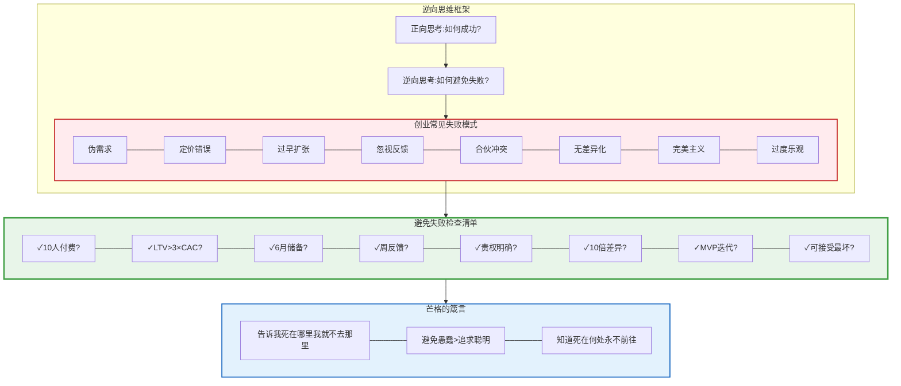

---
draft: true

## 专长知识堆栈：你的不可复制优势

### 核心理论：Naval的专长知识革命

在《纳瓦尔宝典》中，Naval提出了一个颠覆性的概念：**专长知识（Specific Knowledge）**。这是财富创造公式中最容易被忽视，却最关键的要素。

#### 什么是专长知识？

**Naval的定义**：
> "专长知识是无法通过培训学会的知识。如果社会可以培训你，那么它也可以培训别人来取代你。"

**关键特征**：

1. **无法系统化教授**
   - 只能通过实践、经验、兴趣驱动的探索获得
   - 培训班教不了，大学学不到
   - 例子：审美品味、产品直觉、技术洞察力

2. **高度个性化**
   - 源于你独特的基因、成长背景、兴趣组合
   - 别人无法轻易复制
   - 例子：你对AI应用的独特洞察 + 云原生架构经验

3. **往往"玩"出来的**
   - 对你像玩，对别人像工作
   - 你愿意免费做，因为你享受过程
   - 例子：你周末研究新技术，别人在看剧

4. **在边缘地带产生**
   - 不在热门中心，而在交叉领域
   - A × B > A + B
   - 例子：AI × 云原生 × 开发者工具

#### 为什么专长知识如此重要？

**财富创造公式再解读**：
```
财富 = 专长知识 × 杠杆 × 判断力
```

- **专长知识**：决定你的不可替代性（护城河）
- **杠杆**：决定你的规模化能力（天花板）
- **判断力**：决定你的决策质量（成功率）

**案例分析**：

**案例1：纯技术人（无专长知识）**
- 技能：熟练掌握React、Node.js、AWS
- 杠杆：可以开发产品
- 问题：10万个开发者都会这些
- 结果：时薪$50-100，可替代性高

**案例2：有专长知识的技术人**
- 技能：React + Node.js + AWS（基础）
- 专长：深度理解AI模型部署优化 + 5年云原生架构经验
- 独特洞察：知道如何让AI应用在生产环境中降低90%成本
- 杠杆：将洞察打包成产品/服务
- 结果：时薪$500+，或产品月收入$10K+

**关键差异**：专长知识让你从"可替代的程序员"变成"不可替代的问题解决者"。

#### 如何发现你的专长知识？

**Naval的三个问题**：

1. **什么事情对你像玩，对别人像工作？**
   - 你的回答：_________________
   - 提示：你周末愿意做什么？你无聊时研究什么？

2. **什么事情你做起来毫不费力，别人却觉得很难？**
   - 你的回答：_________________
   - 提示：同事经常向你请教什么？你觉得"显而易见"但别人不懂？

3. **如果你有10个亿，你会研究什么问题？**
   - 你的回答：_________________
   - 提示：去掉金钱压力，你真正好奇什么？

**专长知识的4个来源**：

1. **深度技术技能**（垂直深度）
   - 例子：对Kubernetes网络层的深度理解
   - 如何获得：5年+实战经验，读源码，解决复杂问题

2. **跨领域组合**（水平广度）
   - 例子：云原生 × AI × 开发者工具
   - 如何获得：刻意寻找交叉领域，成为"T型人才"

3. **用户洞察**（同理心）
   - 例子：深度理解开发者的痛点和工作流
   - 如何获得：自己是用户，访谈100+用户，长期观察

4. **审美/直觉**（品味）
   - 例子：知道什么产品设计会让开发者喜欢
   - 如何获得：大量使用优秀产品，培养品味

#### 构建你的专长知识堆栈

**T型人才模型**：

```
           深度（Depth）
              ↓
    云原生架构  ■■■■■■■■■■ (10年深度)
              │
─────────────────────────── ← 广度（Breadth）
AI应用开发    ■■■■■■     (5年经验)
DevOps工具    ■■■■■       (3年经验)
分布式系统    ■■■■■■■    (7年经验)
技术写作      ■■■■         (2年经验)
```

**你的专长知识堆栈设计**：

| 层级 | 知识类型 | 你的具体内容 | 深度（年） | 稀缺性（1-10） | 可变现性 |
|------|---------|------------|-----------|--------------|---------|
| **深度** | 核心技术 | 云原生架构/网关/IAM | ___ | ___ | ___ |
| **广度** | 新兴技术 | AI应用开发/RAG | ___ | ___ | ___ |
| **广度** | 工具能力 | 开发者工具/自动化 | ___ | ___ | ___ |
| **交叉** | 独特组合 | AI×云原生 | ___ | ___ | ___ |
| **软技能** | 沟通/写作 | 技术博客/文档 | ___ | ___ | ___ |

**评分标准**：
- 深度：1-2年=初级，3-5年=中级，5-10年=高级，10年+=专家
- 稀缺性：1=人人都会，10=全球<1000人
- 可变现性：能否直接用来赚钱？

#### 专长知识的三个陷阱

**陷阱1：追逐热点（FOMO驱动）**
- **表现**：今天学Web3，明天学AI，后天学量子计算
- **问题**：样样通，样样松，没有深度优势
- **解决**：选择1-2个领域，深耕5-10年
- **Naval的建议**："不要追逐热点，追逐你的好奇心。"

**陷阱2：只学可培训的技能**
- **表现**：只学框架、工具、语言
- **问题**：这些都可以被培训，替代性高
- **解决**：学习底层原理、领域洞察、系统思维
- **例子**：不只学React，要理解前端架构演进逻辑

**陷阱3：忽视沟通和销售**
- **表现**：技术很强，但不会表达，不会销售
- **问题**：价值无法传递，杠杆无法放大
- **解决**：学会写作、演讲、营销
- **Naval的公式**：建造 + 销售 = 无敌

#### 实践练习7：绘制你的专长知识地图

**第1步：技能盘点**（30分钟）

在Notion/Obsidian中创建"专长知识地图"，列出：

1. **硬技能**：
   - 编程语言：_________________（精通程度1-10）
   - 技术框架：_________________（精通程度1-10）
   - 领域知识：_________________（精通程度1-10）
   - 工具平台：_________________（精通程度1-10）

2. **软技能**：
   - 沟通能力：_________________（1-10）
   - 写作能力：_________________（1-10）
   - 销售能力：_________________（1-10）
   - 管理能力：_________________（1-10）

3. **独特经验**：
   - 解决过的独特问题：_________________
   - 踩过的坑（教训）：_________________
   - 获得的洞察：_________________

**第2步：找到交叉点**（30分钟）

用维恩图找到你的独特定位：

```
        [你擅长的]
            ∩
        [市场需要的]
            ∩
        [你热爱的]
        ───────────
         = 你的
         专长知识
         金矿
```

填写：
- 我擅长：_________________
- 市场需要：_________________
- 我热爱：_________________
- 交叉点（你的金矿）：_________________

**第3步：验证稀缺性**（30分钟）

用以下方法验证你的专长知识是否稀缺：

1. **Google搜索测试**：
   - 搜索"[你的技能组合]"，结果<10万条 = 稀缺
   - 例："AI驱动的云原生基础设施优化"

2. **竞争对手分析**：
   - 找到5个竞争对手
   - 分析他们的差异化
   - 你的差异化是什么？

3. **付费意愿测试**：
   - 至少5个人愿意为你的专长知识付费？
   - 他们愿意付多少？（$50? $500? $5000?）

**第4步：制定深化计划**（30分钟）

基于你的专长知识地图，制定12个月深化计划：

| 季度 | 深化目标 | 具体行动 | 验证标准 |
|------|---------|---------|---------|
| Q1 | 深化核心技术 | 读10篇论文，做5个实验 | 写3篇深度文章 |
| Q2 | 扩展交叉领域 | 学习新工具，结合现有知识 | 开发1个demo产品 |
| Q3 | 建立个人品牌 | 每周发布内容，建立影响力 | 1000+关注者 |
| Q4 | 商业化验证 | 将专长打包成产品/服务 | 首个$1000收入 |

#### 从专长知识到财富的路径

**路径1：咨询/培训**（最快变现）
- 时间：1-3个月
- 方式：提供专业咨询服务
- 收入：$100-500/小时
- 缺点：时间换钱，难以规模化

**路径2：产品化**（中期目标）
- 时间：6-12个月
- 方式：将专长知识打包成SaaS/工具
- 收入：MRR $1K-10K
- 优点：可规模化，被动收入

**路径3：内容/社区**（长期资产）
- 时间：12-24个月
- 方式：建立个人品牌，运营付费社区/课程
- 收入：$5K-50K/月
- 优点：复利效应，影响力资产

**路径4：平台/生态**（终极目标）
- 时间：24-60个月
- 方式：建立平台，让别人在你的生态中创造价值
- 收入：$100K+/月
- 优点：网络效应，指数增长

**你的路径选择**：

基于你当前的专长知识水平，你应该：
- [ ] 先走路径1，快速变现，验证需求
- [ ] 边做路径1，边开发路径2（产品化）
- [ ] 同时建立路径3（内容品牌）
- [ ] 路径4留到第3-5年

### 4.1 Naval的Specific Knowledge理论

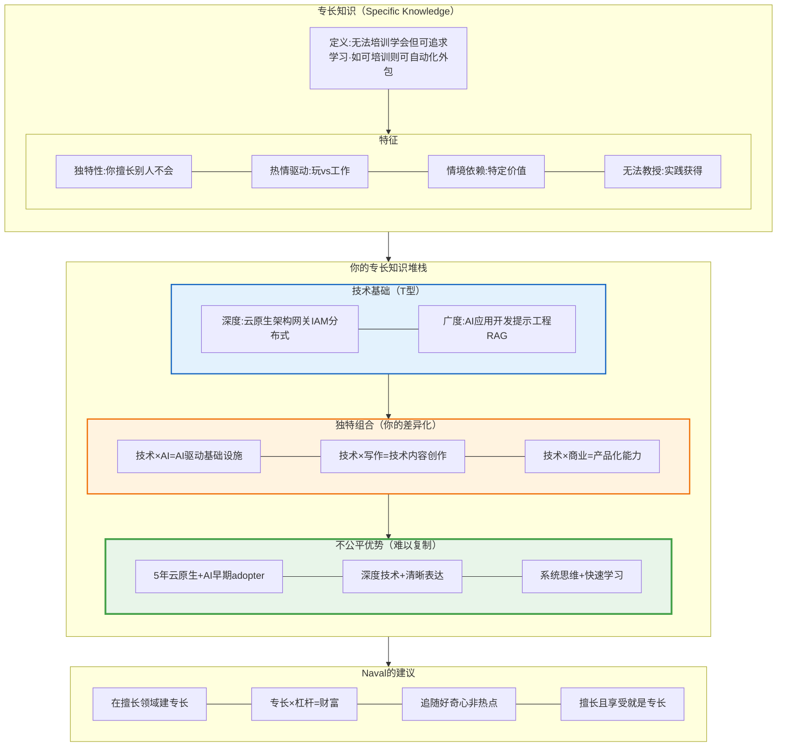

### 4.2 学会销售 + 学会建造 = 无敌

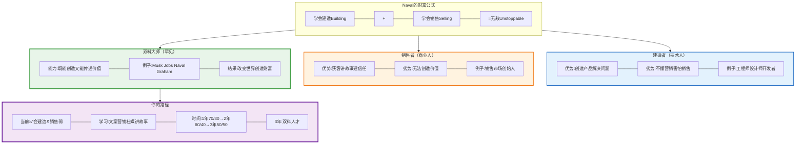

---
draft: true

## 快车道5大戒律验证

### 核心理论：MJ DeMarco的NECST框架

在《百万富翁快车道》中，MJ DeMarco提出了快车道商业的**5大戒律（NECST）**。这不是"成功的建议"，而是**必要条件**——缺少任何一条，你的项目都无法实现快车道财富。

#### 为什么需要NECST验证？

**残酷的真相**：
- 95%的创业项目失败
- 大部分失败不是执行问题，而是**方向错误**
- 很多人在错误的赛道上努力奔跑

**NECST的价值**：
- 在投入大量时间前，用5个维度验证项目
- 避免在慢车道项目上浪费青春
- 识别真正的快车道机会

#### NECST五大戒律详解

---
draft: true

### N - Need（需求戒律）：以市场为中心

**核心原则**：
> "不要追逐金钱，追逐需求。金钱会追着需求跑。"

**错误思维**：
- "这个AI工具很酷，我要做一个！"（以技术为中心）
- "区块链很火，我要做一个DApp！"（以热点为中心）
- "我想月入10万！"（以金钱为中心）

**正确思维**：
- "开发者每天花2小时写重复代码，我能帮他们节省90%时间吗？"（以痛点为中心）
- "企业每年在云成本上浪费30%预算，我能帮他们优化吗？"（以价值为中心）

**验证标准**：

| 问题 | 标准答案 | 你的回答 |
|------|---------|---------|
| **谁有这个需求？** | 明确的目标群体（开发者/企业） | _________ |
| **痛点有多强？** | 10人中至少5人说"我太需要了！" | _________ |
| **频率多高？** | 每天/每周遇到（高频>低频） | _________ |
| **当前方案？** | 现有方案效果差/昂贵/复杂 | _________ |
| **付费意愿？** | 至少10人愿意预付费 | _________ |

**需求戒律检查清单**：

- [ ] 我是目标用户之一（自己有这个痛点）
- [ ] 至少访谈了20个目标用户
- [ ] 至少10人说"如果有这个产品，我立即购买"
- [ ] 用户愿意付的价格 > 我的成本×3
- [ ] 痛点是高频的（每天/每周遇到）
- [ ] 现有解决方案不够好（有10倍改进空间）
- [ ] 市场足够大（至少10万潜在用户）

**反面案例**：
- ❌ 开发一个"AI写诗工具"（低频需求，娱乐性质）
- ❌ 开发一个"区块链投票系统"（伪需求，现有方案够用）
- ❌ 开发一个"更好的任务管理工具"（市场过度饱和）

**正面案例**：
- ✓ AI代码审查工具（高频、强痛点、愿意付费）
- ✓ 云成本优化SaaS（省钱=强需求）
- ✓ API监控告警工具（防止损失=强需求）

---
draft: true

### E - Entry（进入壁垒戒律）：建立护城河

**核心原则**：
> "如果进入很容易，那么竞争会很激烈，利润会很低。"

**经济学原理**：
- 进入壁垒低 → 竞争者多 → 价格战 → 利润薄 → 难以为继
- 进入壁垒高 → 竞争者少 → 定价权 → 利润高 → 可持续

**4种进入壁垒**：

1. **技术壁垒**（最适合程序员）
   - 需要深度技术专长
   - 例子：AI模型优化、分布式系统、安全加密
   - 你的优势：5年云原生 + AI经验

2. **资本壁垒**
   - 需要大量初始投资
   - 例子：芯片制造、数据中心
   - 注意：对个人创业者不利

3. **品牌壁垒**
   - 需要长期积累信任
   - 例子：Stripe、GitHub、Cloudflare
   - 你的策略：通过内容建立品牌

4. **网络效应壁垒**
   - 用户越多，价值越大
   - 例子：社交网络、市场平台
   - 最强护城河

**验证标准**：

| 壁垒类型 | 你的项目 | 强度（1-10） | 如何加强？ |
|---------|---------|-------------|----------|
| 技术壁垒 | _______ | ___ | _______ |
| 专长知识 | _______ | ___ | _______ |
| 网络效应 | _______ | ___ | _______ |
| 品牌信任 | _______ | ___ | _______ |
| 数据积累 | _______ | ___ | _______ |

**进入壁垒检查清单**：

- [ ] 需要至少1年专业知识才能复制
- [ ] 涉及专有技术/算法/数据
- [ ] 有网络效应（用户越多越强）
- [ ] 需要深度行业理解
- [ ] 不是"任何人都能做的"项目
- [ ] 竞争对手<5个（蓝海>红海）

**警告信号**（避免低壁垒项目）：
- ❌ 一个周末就能复制
- ❌ 主要依赖第三方平台（随时被卡脖子）
- ❌ 没有技术含量（拼价格）
- ❌ 市场已有10个以上竞品

**案例分析**：

低壁垒项目：
- ❌ 又一个Chrome插件（几天就能复制）
- ❌ 简单的CRUD应用（无技术含量）
- ❌ 基于OpenAI API的简单封装（人人都能做）

高壁垒项目：
- ✓ AI驱动的云成本优化（需要深度云原生知识）
- ✓ 企业级IAM系统（需要安全专长+合规知识）
- ✓ 高性能API网关（需要分布式系统经验）

---
draft: true

### C - Control（控制戒律）：掌握命运

**核心原则**：
> "如果你不掌控业务，别人就掌控你的命运。"

**什么是控制权？**

你能控制：
- ✓ 产品开发方向
- ✓ 定价策略
- ✓ 用户数据
- ✓ 分发渠道
- ✓ 品牌形象

**三种控制陷阱**：

**陷阱1：平台依赖**
- **表现**：收入100%依赖某个平台
- **风险**：平台改规则，你立即归零
- **案例**：
  - iOS开发者（苹果30%抽成，随时下架）
  - 亚马逊卖家（平台竞争，利润压缩）
  - YouTube创作者（算法改变，收入暴跌）
- **解决**：拥有用户邮件列表，建立直接联系

**陷阱2：代理模式**
- **表现**：你在为别人的产品打工
- **风险**：你创造价值，别人获得利润
- **案例**：
  - 外包开发（时间换钱）
  - 联盟营销（赚佣金，无定价权）
  - 平台讲师（平台拿大头）
- **解决**：创造自己的产品

**陷阱3：加盟/授权**
- **表现**：付费获得"机会"
- **风险**：你买的是别人的快车道入场券
- **案例**：
  - 加盟奶茶店（利润给总部）
  - MLM传销（金字塔顶层赚钱）
- **解决**：建立自己的品牌

**控制戒律检查清单**：

- [ ] 拥有产品的源代码/知识产权
- [ ] 拥有用户数据（邮件/联系方式）
- [ ] 可以自主定价（不被平台限制）
- [ ] 不依赖单一流量来源（>3个渠道）
- [ ] 可以直接与用户沟通
- [ ] 品牌归你所有（不是代理）
- [ ] 可以随时转移平台（数据可导出）

**如何获得控制权？**

1. **拥有分发渠道**：
   - 邮件列表（最重要！）
   - 自有网站/博客
   - 社交媒体粉丝
   - Discord/Slack社区

2. **拥有客户关系**：
   - 直接收款（不通过平台）
   - 1对1沟通渠道
   - 客户数据库

3. **拥有品牌**：
   - 独立域名
   - 品牌商标
   - 内容版权

---
draft: true

### S - Scale（规模戒律）：指数增长

**核心原则**：
> "财富需要规模。时间有限，价值必须可复制。"

**线性 vs 指数**：

| 业务类型 | 增长模式 | 时间投入 | 收入上限 | 举例 |
|---------|---------|---------|---------|------|
| **线性业务** | 收入 ∝ 时间 | 每小时 | 24小时×时薪 | 咨询、外包 |
| **指数业务** | 收入 ∝ 用户数² | 固定 | 接近无限 | SaaS、产品 |

**规模化的三个维度**：

**1. 边际成本接近零**

- **定义**：新增一个客户的成本≈$0
- **案例**：
  - ✓ SaaS软件：第1个用户成本$10K，第10000个用户成本$0.1
  - ✓ 数字产品：复制成本为0
  - ✗ 咨询服务：每个客户需要同等时间
  - ✗ 实体产品：每个产品有制造成本

**2. 不需要线性增加人力**

- **定义**：100个客户和10000个客户，团队规模差不多
- **案例**：
  - ✓ 自动化SaaS：系统自动运行
  - ✓ 内容产品：一次创作，无限传播
  - ✗ 外包公司：客户↑ → 员工↑
  - ✗ 餐厅：客户↑ → 厨师↑

**3. 可以服务全球市场**

- **定义**：不受地理限制
- **案例**：
  - ✓ 在线产品：服务全球
  - ✓ API服务：24/7自动运行
  - ✗ 本地服务：受地理限制
  - ✗ 需要现场的业务

**规模戒律检查清单**：

- [ ] 边际成本<总成本的10%
- [ ] 可以服务100万用户而不需100倍人力
- [ ] 不受地理位置限制
- [ ] 自动化程度>70%
- [ ] 可以在睡觉时产生收入
- [ ] 收入增长>时间投入增长
- [ ] 3年内可以做到月收入$50K+

**如何提升规模化？**

1. **自动化一切可自动化的**：
   - 注册/支付流程
   - 客户服务（FAQ、文档）
   - 监控/运维
   - 营销/内容分发

2. **标准化产品**：
   - 避免定制化
   - 自助服务>人工服务
   - 产品化>项目化

3. **建立网络效应**：
   - 用户邀请用户
   - 数据改进产品
   - 社区自治

---
draft: true

### T - Time（时间解耦戒律）：被动收入

**核心原则**：
> "真正的财富自由是：你不工作，收入也不停。"

**时间绑定 vs 时间解耦**：

| 业务类型 | 停工3个月后 | 收入模式 | 自由度 |
|---------|------------|---------|-------|
| **时间绑定** | 收入归零 | 时间换钱 | 低 |
| **时间解耦** | 收入不变或微降 | 系统赚钱 | 高 |

**时间解耦的4个层次**：

**层次1：部分自动化（30%被动）**
- 产品自动运行
- 但需要客户服务、BUG修复
- 例子：早期SaaS产品

**层次2：大部分自动化（70%被动）**
- 产品 + 支付 + 基础支持自动化
- 只需要每周检查
- 例子：成熟SaaS产品

**层次3：完全自动化（90%被动）**
- 全流程自动化
- 雇佣团队处理例外
- 例子：成熟产品 + 小团队

**层次4：资产增值（100%被动）**
- 产品可以出售
- 或产生持续现金流
- 例子：卖掉公司或上市

**时间解耦检查清单**：

- [ ] 停工1周，收入不受影响
- [ ] 停工1月，收入降低<30%
- [ ] 停工3月，收入降低<50%
- [ ] 可以休假2周不看邮件
- [ ] 产品24/7自动运行
- [ ] 支付/注册全自动
- [ ] 客户可以自助解决80%问题
- [ ] 有应急预案（监控+告警）

**如何实现时间解耦？**

1. **第1阶段：产品自动化**（0-6个月）
   - 自动化支付流程
   - 自动化用户注册
   - 自动化基础运维

2. **第2阶段：服务自动化**（6-12个月）
   - 完善文档和FAQ
   - 建立用户社区（互助）
   - 邮件自动回复

3. **第3阶段：营销自动化**（12-24个月）
   - SEO自动带来流量
   - 内容持续产生价值
   - 推荐系统自动获客

4. **第4阶段：团队接管**（24个月+）
   - 雇佣1-3人处理日常
   - 你只负责战略决策
   - 实现真正自由

---
draft: true

### NECST综合评估工作表

**你的项目验证**：

| 戒律 | 权重 | 你的得分(1-10) | 通过标准 | 是否通过？ |
|------|------|---------------|---------|----------|
| **N - 需求** | 30% | ___ | ≥7 | [ ] |
| **E - 壁垒** | 20% | ___ | ≥6 | [ ] |
| **C - 控制** | 20% | ___ | ≥7 | [ ] |
| **S - 规模** | 20% | ___ | ≥7 | [ ] |
| **T - 时间** | 10% | ___ | ≥6 | [ ] |
| **加权总分** | 100% | ___ | ≥7 | [ ] |

**评分指南**：
- **10分**：完美符合，无可挑剔
- **7-9分**：符合，有优化空间
- **4-6分**：勉强符合，需要重大改进
- **1-3分**：不符合，建议放弃或pivot

**决策矩阵**：

- **总分≥8**：✅ 优秀的快车道项目，全力推进
- **总分7-8**：✅ 合格的快车道项目，优化弱项
- **总分5-7**：⚠️ 需要重大调整或转向
- **总分<5**：❌ 不符合快车道，建议放弃

**常见失败模式**：

1. **需求低（<5分）**：伪需求，市场不存在
   - 解决：重新寻找痛点，验证需求

2. **壁垒低（<5分）**：竞争激烈，利润薄
   - 解决：找到差异化，或选择另一个领域

3. **控制低（<5分）**：被平台绑架
   - 解决：建立直接用户渠道，减少依赖

4. **规模低（<5分）**：线性增长，天花板低
   - 解决：重新设计商业模式，实现指数增长

5. **时间绑定（<5分）**：时间换钱
   - 解决：产品化，自动化，建立系统

### 5.1 NECST框架：快车道的必要条件

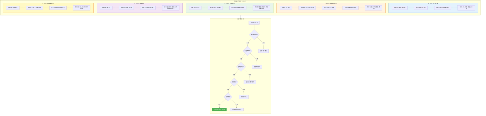

### 5.2 快车道财富方程式

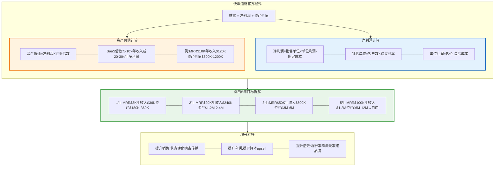

---
draft: true

## 从打工者到创造者的路径

### 核心理论：身份认同的转变

这是整个财富自由旅程中最关键的转变：**从打工者思维到创造者思维**。这不仅仅是换一份工作，而是彻底重塑你的身份认同。

#### 打工者 vs 创造者的本质区别

| 维度 | 打工者思维 | 创造者思维 |
|------|-----------|-----------|
| **时间观** | 出卖时间换工资 | 投资时间建资产 |
| **收入观** | 线性增长（涨薪5-10%/年） | 指数增长（10倍/年） |
| **安全观** | 稳定工作=安全 | 多元化收入=安全 |
| **成长观** | 学公司需要的技能 | 学市场需要的能力 |
| **决策观** | 听老板的 | 用数据验证假设 |
| **风险观** | 避免失败 | 快速试错，拥抱失败 |
| **价值观** | 为老板创造价值 | 为用户创造价值 |
| **身份观** | "我是XX公司的工程师" | "我是解决XX问题的创造者" |

**为什么身份认同如此重要？**

James Clear在《原子习惯》中说：
> "真正的行为改变是身份改变。你的行为是你身份的体现。"

- 你认为自己是"打工者" → 你会做打工者做的事（找好老板，涨工资）
- 你认为自己是"创造者" → 你会做创造者做的事（找痛点，做产品）

**身份转变的3个层次**：

1. **结果层**（表面）
   - 目标：赚$100万
   - 问题：目标会结束，动力不持久

2. **过程层**（中间）
   - 系统：每周发布1个功能
   - 好处：系统会持续

3. **身份层**（核心）
   - 身份：我是一个创造者
   - 威力：身份驱动所有行为

**身份转变的实践**：

每一个行为都是对你身份的一次投票：
- 今天写代码 → "我是创造者"的一票
- 今天学新技术 → "我是创造者"的一票
- 今天访谈用户 → "我是创造者"的一票

积累足够多的"票数"，身份就会改变。

---
draft: true

### 认知陷阱：快思考 vs 慢思考

**Daniel Kahneman的双系统理论**：

我们的大脑有两个系统：

**系统1：快思考（直觉）**
- 特点：自动、快速、情绪化
- 优势：节省能量，应对常规
- 劣势：容易产生认知偏差

**系统2：慢思考（理性）**
- 特点：需要努力、缓慢、逻辑化
- 优势：准确、理性、深度思考
- 劣势：消耗能量，需要刻意启动

#### 创业中的8大认知陷阱

**陷阱1：可得性偏差**
- **表现**：看到别人AI创业成功，觉得"我也能"
- **问题**：忽略了幸存者偏差（失败的99%你看不到）
- **对策**：看基础率（成功率<5%），问"我的优势在哪？"

**陷阱2：锚定效应**
- **表现**：被"5年财富自由"锚定，低估困难
- **问题**：第一印象影响所有后续判断
- **对策**：从多个角度估算，用外部视角

**陷阱3：过度乐观**
- **表现**：觉得3个月就能做出产品
- **问题**：计划谬误，只看最优情况
- **对策**：时间×3法则，资源×2法则

**陷阱4：计划谬误**
- **表现**：低估时间和资源需求
- **问题**：只关注成功，忽略障碍
- **对策**：参考类预测（其他人平均用多久？）

**陷阱5：确认偏见**
- **表现**：只看支持自己想法的证据
- **问题**：忽略反面证据，自我欺骗
- **对策**：主动寻找反面证据，设置"反对者"

**陷阱6：沉没成本谬误**
- **表现**："已经投入3个月了，不能放弃"
- **问题**：过去的投入不影响未来的决策
- **对策**：只看未来，设置退出条件

**陷阱7：损失厌恶**
- **表现**：害怕失败，迟迟不发布
- **问题**：损失的痛苦>获得的快乐（2:1）
- **对策**：限制下行（小额试错），保留上行

**陷阱8：群体思维**
- **表现**：看到所有人都做AI，我也要做
- **问题**：从众心理，失去独立判断
- **对策**：找到差异化，逆向思考

#### 如何启动系统2（理性思考）

**触发机制**：

在以下情况下，强制启动系统2：

1. **重大决策前**
   - 触发：涉及>1个月时间或>$1000资金
   - 行动：24小时冷静期，不立即决策

2. **假设验证前**
   - 触发：任何"我觉得..."的假设
   - 行动：设计实验，用数据验证

3. **投入大量资源前**
   - 触发：投入>100小时或>$5000
   - 行动：NECST验证，前置验尸

4. **情绪波动时**
   - 触发：感到兴奋、恐惧、愤怒
   - 行动：等待情绪平静，再做决策

**理性决策检查清单**：

项目启动前：
- [ ] 我的假设是什么？（明确列出）
- [ ] 如何验证假设？（设计实验）
- [ ] 基础率是多少？（成功率/平均时间）
- [ ] 我的优势是什么？（为什么我能成功？）
- [ ] 最坏情况是什么？（能接受吗？）
- [ ] 退出条件是什么？（何时止损？）

每月复盘时：
- [ ] 核心假设被验证了吗？
- [ ] 数据支持继续吗？
- [ ] 是否需要pivot？
- [ ] 我在自我欺骗吗？

---
draft: true

### 原子习惯：从目标到系统

**James Clear的核心洞察**：
> "你不会上升到目标的高度，而会下降到系统的水平。"

#### 为什么系统 > 目标？

**目标的问题**：
- ✗ 目标达成后，动力消失
- ✗ 目标未达成，感觉失败
- ✗ 目标关注结果，忽略过程
- ✗ 目标与目标之间有空白期

**系统的优势**：
- ✓ 系统持续运行，无论目标如何
- ✓ 系统关注过程，享受当下
- ✓ 系统产生复利效应
- ✓ 系统创造身份认同

#### 建立你的创造者系统

**每日系统（不可协商）**：

**早晨（6:00-9:00）**：创造者时间
- 6:00-6:30：阅读AI/云原生最新论文（保持前沿）
- 6:30-7:00：晨间笔记（规划今天的优先级）
- 7:00-9:00：深度工作（核心创造，无打扰）

**上午（9:00-12:00）**：主业工作
- 高效完成主业任务
- 拒绝低价值会议
- 目标：30%时间，70%绩效

**下午（12:00-18:00）**：主业+学习
- 12:00-14:00：主业工作
- 14:00-15:00：午休+运动（保持精力）
- 15:00-18:00：主业或学习

**晚上（18:00-22:00）**：创造者时间
- 18:00-19:00：晚餐+放松
- 19:00-21:00：产品开发/内容创作
- 21:00-22:00：用户访谈/社区运营
- 22:00-22:30：日复盘（今天进步了1%吗？）

**周末（专注创业）**：
- 周六：产品开发（8小时）
- 周日：内容创作（4小时）+ 战略规划（2小时）

**每周系统**：

| 任务 | 频率 | 时间 | 目标 |
|------|------|------|------|
| 深度工作 | 每天 | 2小时 | 核心功能开发 |
| 用户访谈 | 每周 | 5次×30分钟 | 收集反馈 |
| 内容创作 | 每周 | 2-3篇 | 建立品牌 |
| 数据复盘 | 周日 | 2小时 | 数据驱动决策 |

**每月系统**：

- 月初：设定OKR（Objectives and Key Results）
- 月中：中期检查，必要时调整
- 月末：全面复盘，更新系统

**每季度系统**：

- 战略复盘：方向还正确吗？
- 竞争分析：新竞争对手？我们还有优势吗？
- 财务健康：现金流？盈利能力？
- 个人健康：身体？心理？家庭？

#### 习惯堆叠：建立不可抗拒的系统

**James Clear的习惯公式**：

1. **提示显而易见**
   - 把书放在枕头旁（提示阅读）
   - 把代码编辑器设为开机启动（提示编码）

2. **有吸引力**
   - 捆绑喜欢的事：边听音乐边编码
   - 加入社群：和其他创业者一起

3. **轻而易举**
   - 2分钟原则：每个习惯从2分钟开始
   - 环境设计：减少阻力

4. **奖励令人满足**
   - 习惯追踪器：打卡每天的进步
   - 庆祝小胜利：完成功能→吃顿好的

**你的习惯堆叠**：

设计一个早晨习惯链：
1. 闹钟响 → 立即起床（不赖床）
2. 起床 → 喝一杯水（激活身体）
3. 喝水 → 阅读20分钟（激活大脑）
4. 阅读 → 晨间笔记（规划一天）
5. 笔记 → 深度工作2小时（核心创造）

每一个行为触发下一个，形成链条。

#### 1%改进的复利效应

**数学**：
- 每天进步1%：1.01^365 = 37.8
- 每天退步1%：0.99^365 = 0.03

**实践**：

不要追求一次性巨大改变，追求每天1%的微小改进：

- 代码质量：每天重构1个函数
- 技术写作：每天写100字
- 用户理解：每天访谈1个用户
- 产品功能：每天改进1个细节
- 个人品牌：每天发1条有价值的推文

365天后，你会变成完全不同的人。

---
draft: true

### Ray Dalio的原则：极度求真

**核心理念**：
> "我不在乎你怎么想，我只在乎什么是真的。"

#### 极度求真的3个层次

**层次1：承认不知道**
- 打工者："我知道怎么做"（自欺）
- 创造者："我不知道，但我会验证"（求真）

**层次2：找最可信的人**
- 打工者：听最大声的人
- 创造者：听最有可信度的人（加权决策）

**层次3：欢迎批评**
- 打工者：防御，保护ego
- 创造者：感谢，寻找盲点

#### 痛苦 + 反思 = 进步

**Dalio的成长公式**：

```
遇到问题 → 痛苦 → 反思 → 找到原则 → 避免重复错误 → 进化
```

**实践**：

每次遇到问题/失败，执行以下流程：

1. **记录痛苦**：
   - 发生了什么？
   - 我的感受是什么？

2. **深度反思**：
   - 根本原因是什么？（5个为什么）
   - 我的假设错在哪里？
   - 我可以避免吗？

3. **提炼原则**：
   - 这个问题的本质是什么？
   - 以后遇到类似问题，我的原则是？

4. **记录原则**：
   - 写入你的"原则清单"
   - 形成决策算法

#### 你的创业原则清单

建立你自己的原则清单（不断更新）：

**需求验证原则**：
- 原则1：10人付费法则 - 至少10人愿意预付费才继续
- 原则2：自己是用户 - 解决自己的痛点成功率最高
- 原则3：高频强痛点 - 只做每天/每周遇到的问题

**产品开发原则**：
- 原则4：2周MVP法则 - 必须在2周内发布最小可行产品
- 原则5：100用户前不优化 - 达到100付费用户前只做核心功能
- 原则6：用户驱动 - 每个功能必须有用户明确要求

**财务原则**：
- 原则7：6月储备法则 - 永远保持6个月生活费储备
- 原则8：单位经济法则 - LTV必须>3×CAC
- 原则9：现金流法则 - 现金流>利润>收入

**时间管理原则**：
- 原则10：深度工作法则 - 每天至少2小时深度工作
- 原则11：高价值优先 - 80%时间用于20%高价值工作
- 原则12：拒绝低价值 - 学会说"不"

**健康原则**：
- 原则13：身体第一法则 - 不舒服立即停工休息
- 原则14：运动法则 - 每周至少3次运动
- 原则15：睡眠法则 - 每天7-8小时睡眠，不透支

**决策原则**：
- 原则16：24小时法则 - 重大决策必须冷静24小时
- 原则17：数据驱动法则 - 没有数据不做决策
- 原则18：退出条件法则 - 每个项目设置明确的退出条件

#### 极度求真的实践工具

**1. 决策日志**

每个重大决策，记录：
- 日期：_______
- 决策：_______
- 假设：_______（列出所有假设）
- 预期结果：_______
- 实际结果：_______（3个月后填写）
- 反思：_______（哪里对了？哪里错了？）

**2. 假设测试表**

| 假设 | 如何验证 | 验证期限 | 结果 | 下一步 |
|------|---------|---------|------|-------|
| 开发者愿意为AI工具付费 | 访谈20人，10人愿付 | 2周 | | |
| $50/月价格合理 | 测试3个价格点 | 1个月 | | |
| SEO能带来50%流量 | 发布20篇文章 | 3个月 | | |

**3. 每周反思**

周日晚上，问自己：
- [ ] 本周最大的进步是什么？
- [ ] 本周最大的失败是什么？
- [ ] 我学到了什么原则？
- [ ] 下周要改进什么？

**4. 红队测试**（Devil's Advocate）

每个重大决策，问：
- 为什么这个决策可能是错的？
- 我忽略了什么风险？
- 反对者会怎么说？
- 如果我是竞争对手，我会怎么攻击？

---
draft: true

### 实践练习8：你的转变计划

**第1步：重新定义身份**（30分钟）

完成以下句子：
- 我不再是：_______________（旧身份）
- 我现在是：_______________（新身份）
- 作为_______________，我每天会：_______________
- 作为_______________，我绝不会：_______________

**第2步：设计你的系统**（1小时）

创建"系统仪表板"：

1. **每日不可协商的习惯**（至少3个）：
   - [ ] _________________（时间：____）
   - [ ] _________________（时间：____）
   - [ ] _________________（时间：____）

2. **每周系统**：
   - [ ] _________________（频率：____）
   - [ ] _________________（频率：____）
   - [ ] _________________（频率：____）

3. **每月复盘**：
   - 复盘日期：每月____号
   - 复盘模板：（创建Notion模板）

**第3步：建立原则清单**（30分钟）

基于你过去的经验教训，写下前10条原则：

1. _____________________________
2. _____________________________
3. _____________________________
（...）
10. _____________________________

**第4步：设置触发机制**（30分钟）

为每个认知陷阱设置触发提醒：

- 重大决策前 → 提醒：24小时冷静期
- 投入>100小时前 → 提醒：NECST验证
- 感到兴奋/恐惧时 → 提醒：这是系统1，启动系统2
- 每周日晚上 → 提醒：周复盘
- 每月最后一天 → 提醒：月复盘

**第5步：第一个30天计划**（1小时）

设计你的第一个30天转变计划：

| 周 | 身份投票 | 系统建立 | 验证结果 |
|-----|---------|---------|---------|
| Week 1 | 每天2小时深度工作 | 建立晨间习惯 | 完成7次深度工作 |
| Week 2 | 访谈10个用户 | 建立周复盘系统 | 找到1个强痛点 |
| Week 3 | 每天写100字 | 建立内容系统 | 发布3篇文章 |
| Week 4 | 开发MVP核心功能 | 建立月复盘系统 | MVP可演示 |

30天后，你会发现：
- ✓ 你的身份已经开始转变
- ✓ 你的系统已经在运行
- ✓ 你已经不再是原来的你

### 6.1 认知陷阱：《思考，快与慢》的应用

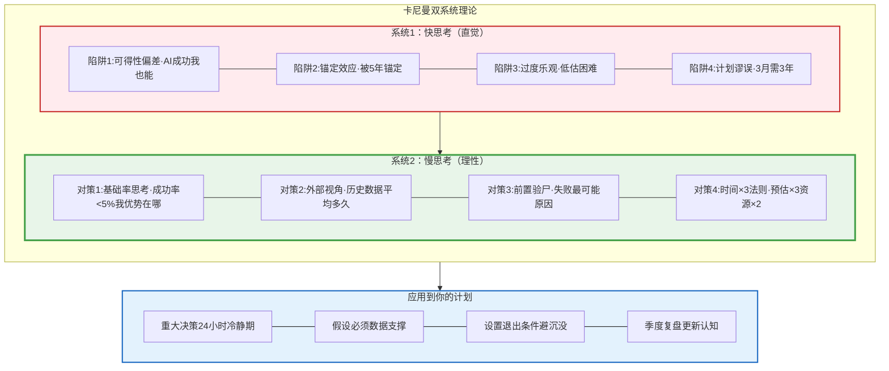

### 6.2 原子习惯：从身份到系统

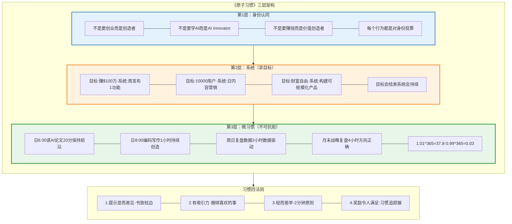

### 6.3 Ray Dalio的原则：极度求真

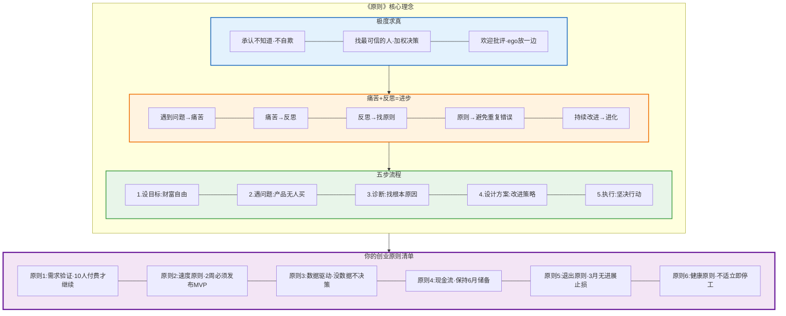

---
draft: true

## 逆向思维:避免失败的检查清单

### 核心理论：芒格的逆向思维哲学

查理·芒格最著名的一句话：
> "告诉我我会死在哪里，这样我就永远不去那里。"

这句话揭示了一个深刻的智慧：**避免愚蠢比追求聪明更容易，也更有效**。

#### 为什么逆向思维如此强大？

**1. 失败模式是有限的，成功路径是无限的**

- 创业失败的原因：10-20种常见模式
- 创业成功的方式：千万种独特路径
- 结论：避免已知失败模式 > 追求未知成功模式

**2. 人类更擅长识别风险**

- 进化让我们善于识别危险（生存本能）
- 识别机会需要理性思考（需要训练）
- 策略：利用本能，而非对抗本能

**3. 预防 > 治疗**

- 预防失败的成本 << 失败后补救的成本
- 例子：
  - 预防：访谈20个用户（10小时）
  - 治疗：开发6个月无人买单后pivot（1000小时）

#### 创业的12大致命错误

基于数千个创业失败案例的总结：

**错误1：伪需求（42%失败原因）**
- **表现**：产品很酷，但没人愿意付费
- **根本原因**：自我中心，没有真实用户验证
- **预防**：
  - [ ] 10人付费预验证法则
  - [ ] 自己是目标用户之一
  - [ ] 高频强痛点（每天/每周遇到）
- **案例**：无数"AI工具"，开发者自嗨，用户不买单

**错误2：定价错误（23%失败原因）**
- **表现**：定价太低赚不到钱，或太高无人问津
- **根本原因**：不了解目标市场的支付意愿
- **预防**：
  - [ ] 测试3个价格点
  - [ ] LTV > 3×CAC
  - [ ] 对标竞品定价
- **案例**：SaaS定价$9/月，获客成本$100，永远不盈利

**错误3：过早扩张（18%失败原因）**
- **表现**：还没PMF就招聘、融资、营销
- **根本原因**：被媒体/VC压力驱动，而非用户需求
- **预防**：
  - [ ] PMF前只做最小化团队（1-3人）
  - [ ] MRR>$10K前不招聘
  - [ ] 用户留存率>60%前不扩张
- **案例**：融资后迅速招聘20人，6个月后裁员倒闭

**错误4：忽视反馈（14%失败原因）**
- **表现**：用户说不需要，但你认为他们"不懂"
- **根本原因**：确认偏见，只看支持自己的证据
- **预防**：
  - [ ] 每周至少5个用户访谈
  - [ ] 数据驱动决策
  - [ ] 快速迭代，2周一版
- **案例**：花6个月开发完美产品，发布后无人使用

**错误5：合伙人冲突（13%失败原因）**
- **表现**：因股权/决策权/方向争吵，分道扬镳
- **根本原因**：没有事先明确责权利
- **预防**：
  - [ ] 签署合伙人协议
  - [ ] 明确决策机制
  - [ ] 设置退出条款（vesting）
- **案例**：50/50股权，两人意见不合，公司僵局

**错误6：无差异化（12%失败原因）**
- **表现**：市场已有10个竞品，你是第11个
- **根本原因**：看到别人成功就模仿，没有独特优势
- **预防**：
  - [ ] 找到10倍好的差异化点
  - [ ] 或选择蓝海市场
  - [ ] 专注细分领域第一
- **案例**：又一个任务管理工具，与Notion/Asana无差异

**错误7：完美主义（11%失败原因）**
- **表现**：一直在"优化"，迟迟不发布
- **根本原因**：害怕失败，追求完美
- **预防**：
  - [ ] 2周MVP法则
  - [ ] 先发布再优化
  - [ ] 80%完成度即发布
- **案例**：开发2年，竞品已占领市场

**错误8：过度乐观（10%失败原因）**
- **表现**：计划3个月完成，实际需要2年
- **根本原因**：计划谬误，只看最优情况
- **预防**：
  - [ ] 时间×3法则
  - [ ] 资源×2法则
  - [ ] 参考类预测
- **案例**：预算10万，实际花费50万，资金链断裂

**错误9：单一流量来源（8%失败原因）**
- **表现**：100%依赖某个平台/渠道
- **根本原因**：缺乏控制权意识
- **预防**：
  - [ ] 至少3个流量渠道
  - [ ] 拥有邮件列表
  - [ ] 不依赖单一平台
- **案例**：iOS应用100%依赖App Store，被下架即归零

**错误10：烧钱获客（7%失败原因）**
- **表现**：LTV < CAC，越卖越亏
- **根本原因**：不理解单位经济
- **预防**：
  - [ ] CAC < LTV/3
  - [ ] 优先免费/低成本渠道
  - [ ] 优化留存>优化获客
- **案例**：付费广告获客，LTV $100，CAC $150

**错误11：功能过载（6%失败原因）**
- **表现**：产品功能太多太复杂
- **根本原因**：想满足所有人
- **预防**：
  - [ ] 只做1个核心功能
  - [ ] 100用户前不加新功能
  - [ ] 删除>添加
- **案例**：100个功能，用户只用3个，其余成为维护负担

**错误12：个人倦怠（5%失败原因）**
- **表现**：创始人身心俱疲，放弃项目
- **根本原因**：忽视健康，过度透支
- **预防**：
  - [ ] 每周至少3次运动
  - [ ] 每天7-8小时睡眠
  - [ ] 设置工作边界
- **案例**：连续工作6个月，抑郁症发作，被迫停止

---
draft: true

### 检查清单系统：飞行员式决策

**为什么需要检查清单？**

Atul Gawande在《检查清单宣言》中证明：
- 外科医生使用检查清单 → 手术死亡率降低47%
- 飞行员使用检查清单 → 事故率接近0

创业比外科手术和飞行更复杂，更需要检查清单。

#### 项目启动前检查清单（必须100%通过）

**需求验证**：
- [ ] 我是目标用户之一（自己有这个痛点）
- [ ] 至少访谈了20个目标用户
- [ ] 至少10人明确说"愿意付费"
- [ ] 痛点是高频的（每天或每周遇到）
- [ ] 现有解决方案不够好（有10倍改进空间）

**商业模式验证**：
- [ ] 清晰的变现模式（不是"先做大再变现"）
- [ ] 单位经济健康（LTV > 3×CAC）
- [ ] 边际成本接近0（可规模化）
- [ ] 不依赖单一流量来源

**可行性验证**：
- [ ] 我有能力在2周内完成MVP
- [ ] 有6-12个月生活费储备
- [ ] 家人支持（如果有）
- [ ] 最坏情况可接受（失败了能承受吗？）

**竞争分析**：
- [ ] 有明确的差异化（10倍好，或细分第一）
- [ ] 进入壁垒足够高（技术/网络效应/品牌）
- [ ] 竞争对手<5个（蓝海>红海）

**退出策略**：
- [ ] 设置了明确的退出条件（3个月无进展即止损）
- [ ] 设置了里程碑（1个月、3个月、6个月）
- [ ] 有Plan B（失败后做什么？）

**通过标准**：必须全部打勾才能启动项目。

---
draft: true

#### 每周检查清单

**周日晚上复盘**（30分钟）：

**数据检查**：
- [ ] MRR/ARR增长率：_____% (目标：>10%/月)
- [ ] 用户数增长：_____ (目标：每周+10用户)
- [ ] 用户留存率：_____% (目标：>60%)
- [ ] NPS评分：_____ (目标：>40)

**执行检查**：
- [ ] 完成了本周OKR吗？（完成率：_____%）
- [ ] 深度工作时间：_____小时 (目标：>10小时)
- [ ] 用户访谈次数：_____ (目标：>5次)
- [ ] 内容发布：_____ (目标：2-3篇)

**健康检查**：
- [ ] 运动次数：_____ (目标：≥3次)
- [ ] 睡眠时间：_____小时/天 (目标：7-8小时)
- [ ] 压力水平：_____ (1-10分，>7需要调整)
- [ ] 还有激情吗？（是/否）

**下周计划**：
- [ ] 最重要的3件事：1._____ 2._____ 3._____
- [ ] 本周学到的教训：_________________
- [ ] 需要调整的地方：_________________

---
draft: true

#### 每月检查清单

**月末复盘**（2小时）：

**战略检查**：
- [ ] 方向还正确吗？（是/否）
- [ ] 核心假设被验证了吗？（是/否/部分）
- [ ] 达到月度OKR了吗？（完成率：_____%）
- [ ] 需要pivot吗？（是/否）

**财务健康**：
- [ ] MRR：$_____ (环比增长：____%)
- [ ] 现金储备：$_____ (可支撑____个月)
- [ ] CAC：$_____ , LTV：$_____ (LTV/CAC比：____)
- [ ] 盈利了吗？（是/否）

**产品健康**：
- [ ] 用户留存率：_____% (月留存)
- [ ] DAU/MAU：_____ (目标：>20%)
- [ ] NPS：_____ (目标：>40)
- [ ] 用户推荐率：_____% (目标：>30%)

**竞争态势**：
- [ ] 有新竞争对手吗？_______________
- [ ] 我们还有优势吗？_______________
- [ ] 需要调整策略吗？_______________

**个人状态**：
- [ ] 身体健康：_____ (1-10分)
- [ ] 心理健康：_____ (1-10分)
- [ ] 家庭关系：_____ (1-10分)
- [ ] 激情水平：_____ (1-10分)

**决策点**：
- [ ] 加倍投入 or 及时止损 or 保持现状？
- [ ] 理由：_____________________________

---
draft: true

#### 每季度检查清单

**季度战略复盘**（4小时）：

**NECST重新验证**：

| 戒律 | 当前得分(1-10) | 3个月前得分 | 趋势 | 改进措施 |
|------|--------------|-----------|------|---------|
| Need (需求) | ___ | ___ | ↑/↓/→ | _______ |
| Entry (壁垒) | ___ | ___ | ↑/↓/→ | _______ |
| Control (控制) | ___ | ___ | ↑/↓/→ | _______ |
| Scale (规模) | ___ | ___ | ↑/↓/→ | _______ |
| Time (解耦) | ___ | ___ | ↑/↓/→ | _______ |

**季度OKR复盘**：
- [ ] Q目标1：_______ (完成率：____%)
- [ ] Q目标2：_______ (完成率：____%)
- [ ] Q目标3：_______ (完成率：____%)
- [ ] 下季度重点：__________________

**前置验尸（Pre-Mortem）**：

假设3个月后项目失败，最可能的原因是：
1. _____________________________
2. _____________________________
3. _____________________________

针对每个原因的预防措施：
1. _____________________________
2. _____________________________
3. _____________________________

**重大决策**：
- [ ] 继续当前方向 or pivot？
- [ ] 主业比例调整：____% (当前) → ____% (下季度)
- [ ] 是否全职创业？（是/否）
- [ ] 是否需要融资/贷款？（是/否）

---
draft: true

### 反脆弱：塔勒布的杠铃策略

**核心理念**：
> "限制下行，保留上行。"

#### 什么是杠铃策略？

**传统策略（脆弱）**：
- 50%风险资产 + 50%安全资产
- 问题：中等风险，中等回报，遇到黑天鹅崩盘

**杠铃策略（反脆弱）**：
- 90%极度安全 + 10%极度冒险
- 优势：最大损失有限（10%），最大收益无限（10倍回报）

#### 你的创业杠铃策略

**安全端（90%）**：保护下行

1. **主业收入**（70%）
   - 策略：前30%时间，保持70%绩效
   - 目的：稳定现金流，覆盖生活成本
   - 退出条件：创业收入>主业收入×3个月

2. **应急基金**（15%）
   - 金额：6-12个月生活费
   - 位置：高流动性账户（随时可取）
   - 规则：绝不动用（除非真正紧急）

3. **指数基金**（5%）
   - 策略：每月定投
   - 目的：长期复利，对冲风险
   - 规则：10年不动

**冒险端（10%）**：保留上行

1. **主项目**（7%）
   - 投入：时间70%，资金最多$5K
   - 目标：5年内10倍回报
   - 止损：3个月无进展

2. **内容/社区**（2%）
   - 投入：时间20%
   - 目标：建立长期影响力资产
   - 复利：持续积累

3. **探索/实验**（1%）
   - 投入：时间10%
   - 目标：寻找下一个机会
   - 规则：只投时间，不投钱

**再平衡机制**：

每季度检查：
- [ ] 安全端比例是否≥90%？
- [ ] 冒险端损失是否≤10%？
- [ ] 如果失衡，立即调整

---
draft: true

### 实践练习9：建立你的检查清单系统

**第1步：创建检查清单仪表板**（1小时）

在Notion/Obsidian中创建3个模板：
1. 项目启动前检查清单
2. 每周检查清单
3. 每月检查清单
4. 每季度检查清单

**第2步：设置自动提醒**（30分钟）

- 每周日晚上8点 → 提醒"周复盘"
- 每月最后一天 → 提醒"月复盘"
- 每季度最后一周 → 提醒"季度战略复盘"
- 重大决策前 → 提醒"24小时冷静期"

**第3步：执行第一次检查**（1小时）

用你当前的项目，执行一次完整的检查清单验证：
- [ ] 项目启动前检查清单（如果还没启动）
- [ ] 或每周/每月检查清单（如果已启动）

**第4步：设计你的杠铃策略**（30分钟）

填写你的资产配置表：

| 类型 | 当前比例 | 目标比例 | 调整行动 |
|------|---------|---------|---------|
| 主业收入 | ___% | 70% | _______ |
| 应急基金 | ___% | 15% | _______ |
| 指数基金 | ___% | 5% | _______ |
| 主项目 | ___% | 7% | _______ |
| 内容/社区 | ___% | 2% | _______ |
| 探索 | ___% | 1% | _______ |

**第5步：识别你的失败模式**（30分钟）

基于你的性格和历史，你最可能犯哪3个错误？

1. ___________________ (预防措施：_________________)
2. ___________________ (预防措施：_________________)
3. ___________________ (预防措施：_________________)

将预防措施加入你的检查清单。

---
draft: true

### 芒格的临终智慧

芒格在99岁时说：
> "我的成功不是因为我多聪明，而是因为我避免了大部分愚蠢的决策。"

**你的逆向清单**：

**绝不做的事**（写下来，贴在墙上）：

1. 绝不在没有10人付费验证前开发产品
2. 绝不在情绪激动时做重大决策
3. 绝不投入超过10%资产到单一项目
4. 绝不为了创业透支健康
5. 绝不因为沉没成本而继续错误方向
6. _________________________________
7. _________________________________
8. _________________________________

**记住**：
- 避免失败 ≠ 避免冒险
- 避免失败 = 避免**愚蠢的**失败
- 聪明的冒险 = 限制下行 + 保留上行

### 7.1 芒格式检查清单系统

```mermaid
graph TB
    subgraph ChecklistSystem["决策检查清单系统"]
        direction TB

        subgraph PreLaunch["项目启动前检查清单"]
            direction LR
            PL1[□我是目标用户?] --- PL2[□10人愿预付?] --- PL3[□2周做出MVP?] --- PL4[□边际成本≈0?] --- PL5[□清晰差异化?] --- PL6[□控制分发?] --- PL7[□最坏可接受?]
        end

        subgraph Monthly["每月检查清单"]
            direction LR
            M1[□MRR增长?] --- M2[□留存率>50%?] --- M3[□CAC<LTV/3?] --- M4[□用户主动推荐?] --- M5[□现金>6月?] --- M6[□健康良好?] --- M7[□还有激情?]
        end

        subgraph Quarterly["每季度检查清单"]
            direction LR
            Q1[□方向正确?] --- Q2[□达季度目标?] --- Q3[□有新竞争对手?] --- Q4[□核心假设成立?] --- Q5[□需要转向?] --- Q6[□加倍还是退出?]
        end
    end

    subgraph FailurePatterns["常见失败模式（避免清单）"]
        direction LR
        F1[❌闭门造车→周5访谈] --- F2[❌完美主义→2周发布] --- F3[❌过早优化→100付费用户前不优化] --- F4[❌功能过载→只做1核心功能] --- F5[❌免费策略→第1天定价] --- F6[❌忽视销售→50%时间获客] --- F7[❌孤军奋战→加入社群找导师] --- F8[❌沉没成本→3月无进展止损]
    end

    ChecklistSystem --> FailurePatterns

    style PreLaunch fill:#e3f2fd,stroke:#1565c0,stroke-width:2px
    style Monthly fill:#fff3e0,stroke:#ef6c00,stroke-width:2px
    style Quarterly fill:#e8f5e9,stroke:#43a047,stroke-width:2px
    style FailurePatterns fill:#ffebee,stroke:#c62828,stroke-width:2px
```

### 7.2 反脆弱的项目组合策略

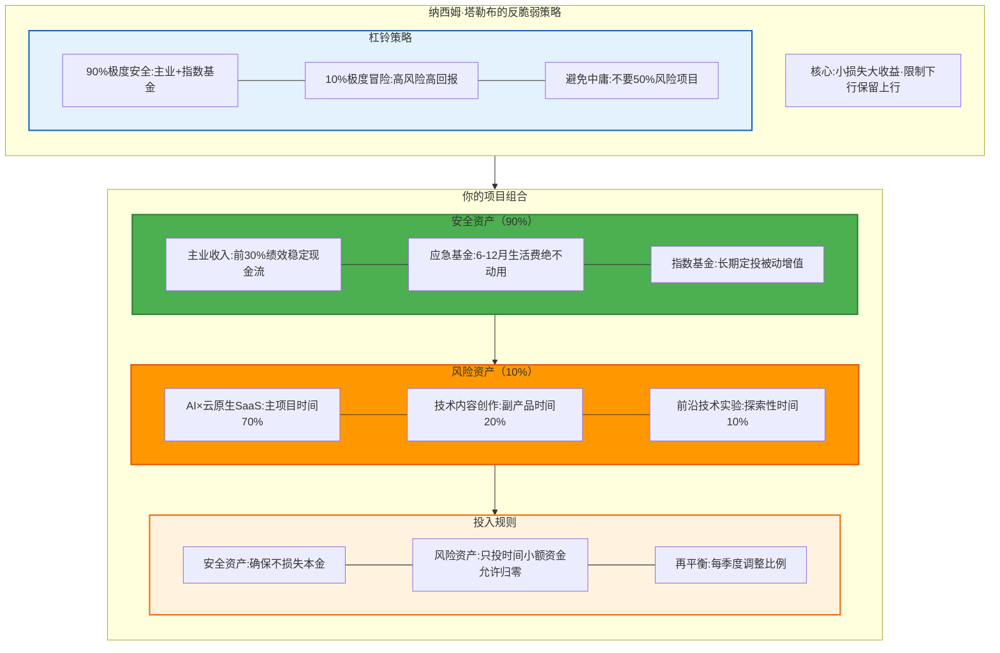

---
draft: true

## 可执行的90天行动计划

### 核心理论：MVP验证的黄金周期

为什么是90天？

1. **足够长**：可以完成MVP验证到产品-市场匹配（PMF）
2. **足够短**：保持紧迫感，避免拖延
3. **季度周期**：符合商业规划节奏
4. **心理临界**：超过3个月容易倦怠，需要新刺激

**90天目标**：
- 验证需求是否真实
- 开发并发布MVP
- 获得前10-20个付费用户
- MRR达到$1K-3K
- 决定是否全职投入

---
draft: true

### 第一个30天：快速验证（0-30天）

**核心任务**：验证痛点，开发MVP，获得首个付费用户

#### Week 1：痛点挖掘与验证

**目标**：从10个痛点中选出1个最强痛点

**Day 1-2：头脑风暴痛点**
- [ ] 列出10个你观察到的痛点
- [ ] 每个痛点回答：谁有？多强？多频繁？愿意付多少？
- [ ] 初步筛选出3个最有潜力的

**模板**：

| 痛点 | 目标用户 | 痛点强度(1-10) | 频率 | 愿付价格 | 竞品数量 |
|------|---------|-------------|------|---------|---------|
| 1. AI代码审查太慢 | 开发者 | 8 | 每天 | $50/月 | 3个 |
| 2. 云成本无法优化 | DevOps | 9 | 每周 | $200/月 | 2个 |
| 3. API监控告警延迟 | SRE | 7 | 每天 | $100/月 | 5个 |

**Day 3-5：深度用户访谈**
- [ ] 找到20个目标用户（LinkedIn/Twitter/社区）
- [ ] 每个访谈30分钟，问以下问题：
  - 你目前如何解决这个问题？
  - 现有方案有什么不满？
  - 如果有更好的解决方案，你愿意付费吗？
  - 愿意付多少？
  - 什么功能最重要？

**访谈记录模板**：

```
用户#1: [姓名/公司]
痛点确认: ✓是 □否
愿意付费: ✓是 □否
价格期望: $_____/月
最需要的功能: _________________
现有方案: _________________
不满之处: _________________
```

**Day 6-7：选择最强痛点**
- [ ] 统计访谈结果
- [ ] 计算"痛点得分"：(痛点强度 × 频率 × 愿付价格) / 竞品数量
- [ ] 选择得分最高的1个痛点
- [ ] 确认至少5人愿意预付费

**Week 1成功标准**：
- ✓ 完成20个用户访谈
- ✓ 找到1个强痛点（至少5人愿付费）
- ✓ 明确MVP核心功能（1-3个）

---
draft: true

#### Week 2：MVP设计与技术准备

**目标**：设计MVP方案，搭建技术架构

**Day 8-9：MVP功能设计**
- [ ] 定义MVP的"最小可行"范围
- [ ] 列出核心功能（最多3个）
- [ ] 设计用户流程（从注册到核心价值）
- [ ] 绘制原型图（Figma/手绘）

**MVP设计原则**：
- 只做1个核心功能（能解决核心痛点的最小功能）
- 去掉所有"Nice to have"
- 可以手动代替自动化（先验证需求，后优化效率）
- 2周内可完成

**示例：AI代码审查工具MVP**
- 核心功能：提交PR → AI审查 → 返回建议
- 不包括：
  - ✗ 多语言支持（先只支持Python）
  - ✗ 自定义规则（用默认规则）
  - ✗ 团队协作（先个人版）
  - ✗ 历史记录（只保留最新10条）

**Day 10-11：技术选型**
- [ ] 选择技术栈（优先熟悉的技术）
- [ ] 搭建开发环境
- [ ] 设置CI/CD流程
- [ ] 注册域名、云服务

**技术选型原则**：
- 优先使用熟悉的技术（不要在MVP阶段学新技术）
- 选择快速开发的技术（Rails>Java，Next.js>原生React）
- 使用托管服务（Vercel/Railway/Supabase）减少运维
- 选择可扩展的架构（但不过度设计）

**Day 12-14：MVP开发（第1版）**
- [ ] 开发核心功能（最小可演示版本）
- [ ] 测试基本流程可用
- [ ] 部署到测试环境
- [ ] 自己试用，修复关键bug

**开发时间分配**：
- 50%：核心功能
- 20%：用户认证/支付
- 20%：基础UI
- 10%：测试/部署

**Week 2成功标准**：
- ✓ MVP可以演示核心功能
- ✓ 自己可以完整走完流程
- ✓ 部署到可访问的URL

---
draft: true

#### Week 3：用户测试与快速迭代

**目标**：找10个用户测试，收集反馈，快速迭代

**Day 15-16：找到10个测试用户**
- [ ] 回到Week 1访谈的用户，邀请测试
- [ ] 目标：至少10人同意试用
- [ ] 给每人发送测试链接+使用指南
- [ ] 设置反馈渠道（表单/Slack/email）

**测试用户邀请话术**：
```
Hi [Name],

上周和你聊了[痛点]的问题，我做了一个初版解决方案。
虽然还很简陋，但核心功能可用。

能否帮忙试用10分钟，给我反馈？
作为回报，我会给你3个月免费使用权。

测试链接：[URL]
任何问题随时联系我：[联系方式]

感谢！
```

**Day 17-19：收集反馈**
- [ ] 每天至少与5个测试用户沟通
- [ ] 记录他们的使用体验
- [ ] 识别最大的障碍/bug
- [ ] 询问"你愿意为此付费吗？多少？"

**反馈记录表**：

| 用户 | 能否完成流程 | 最大障碍 | 愿付费？ | 价格期望 | 最需要改进 |
|------|------------|---------|---------|---------|----------|
| #1 | ✓是 □否 | _____ | ✓是 □否 | $__/月 | _______ |
| #2 | ✓是 □否 | _____ | ✓是 □否 | $__/月 | _______ |
| ... | | | | | |

**Day 20-21：快速迭代**
- [ ] 修复阻碍用户使用的关键bug
- [ ] 优化最不清楚的流程
- [ ] 重新测试
- [ ] 确认至少3个用户可以顺利完成流程

**迭代原则**：
- 只修复关键问题（不完美主义）
- 优先修复影响付费意愿的问题
- 不添加新功能
- 目标：让用户可以顺利完成核心流程

**Week 3成功标准**：
- ✓ 10个用户试用
- ✓ 至少3人表示愿意付费
- ✓ 明确了需要改进的方向

---
draft: true

#### Week 4：定价、首销、复盘

**目标**：设置定价，获得前5个付费用户，完成第1月复盘

**Day 22-23：设计定价策略**
- [ ] 基于用户反馈，设置价格点
- [ ] 设计定价层级（Free/Basic/Pro）
- [ ] 集成支付系统（Stripe/Paddle）
- [ ] 设置试用期（7-14天）

**定价策略**：

| 层级 | 价格 | 功能 | 目标用户 |
|------|------|------|---------|
| Free | $0 | 核心功能（有限制） | 体验用户 |
| Basic | $29/月 | 核心功能（无限制） | 个人开发者 |
| Pro | $99/月 | 高级功能+优先支持 | 团队/企业 |

**定价心理学**：
- 锚定效应：先展示Pro价格（$99），再展示Basic（$29），让用户觉得Basic便宜
- 9尾定价：$29 比 $30 更容易接受
- 年付折扣：年付$290（相当于$24.17/月），节省$58

**Day 24-26：首次销售**
- [ ] 回到测试用户，邀请付费
- [ ] 目标：至少5个付费用户
- [ ] 记录每个用户的付费理由和期望
- [ ] 感谢early adopters，建立紧密联系

**销售话术**：
```
Hi [Name],

感谢你试用了[产品]！

基于你的反馈，我做了改进：
- [改进1]
- [改进2]

现在正式上线了，早期用户价格$__/月（正式价格$__/月）。
因为你是第一批用户，这个价格永久锁定。

支付链接：[URL]
任何问题随时找我。

期待继续为你创造价值！
```

**Day 27-30：深度复盘**
- [ ] 统计第1个月数据
- [ ] 分析哪些有效，哪些无效
- [ ] 更新第2个月计划
- [ ] 庆祝第一个里程碑！

**第1月复盘模板**：

```
## 第1个月复盘（Day 1-30）

### 数据
- 访谈用户数：_____
- 测试用户数：_____
- 付费用户数：_____
- MRR：$_____
- 核心假设验证：✓是 □否

### 学到的教训
1. _____________________________
2. _____________________________
3. _____________________________

### 最大的障碍
1. _____________________________
2. _____________________________

### 下个月重点
1. _____________________________
2. _____________________________
3. _____________________________

### 是否继续？
□ 是，数据支持（MRR>$100，至少5个付费用户）
□ 是，但需要pivot（方向调整：________）
□ 否，止损（原因：________）
```

**Month 1成功标准**：
- ✓ 发布MVP
- ✓ 10个测试用户
- ✓ 5个付费用户
- ✓ 首个$100收入
- ✓ 验证了商业模式可行性

---
draft: true

### 第二个30天：增长与优化（31-60天）

**核心任务**：优化产品，建立获客渠道，MRR达到$1K

#### Week 5：产品优化

**目标**：基于用户反馈，提升留存率

**关键指标**：
- 用户留存率>60%（7天留存）
- NPS>40
- 核心功能使用率>80%

**行动清单**：
- [ ] 分析用户流失原因（访谈流失用户）
- [ ] 优化onboarding流程（减少摩擦）
- [ ] 修复最常见的bug
- [ ] 增加关键的缺失功能（用户最强烈要求的1-2个）
- [ ] 设置产品内引导（tooltips/walkthrough）

#### Week 6：获客渠道测试

**目标**：测试3个获客渠道，找到CAC<LTV/3的渠道

**渠道测试**：

1. **内容营销**（最适合技术产品）
   - 每周发布2-3篇深度技术文章
   - 发布到Medium/Dev.to/自有博客
   - SEO优化（关键词研究）
   - 目标：每周10个organic注册

2. **社区运营**（Reddit/Hacker News/Discord）
   - 加入5个目标用户社区
   - 提供价值（不直接推销）
   - 分享使用案例/教程
   - 目标：每周5个社区注册

3. **社交媒体**（Twitter/LinkedIn）
   - 每天发布1-2条有价值的内容
   - 与目标用户互动
   - 分享产品进展（build in public）
   - 目标：每周5个社交注册

**渠道评估表**：

| 渠道 | 投入时间 | 获得用户 | CAC | 转化率 | 继续？ |
|------|---------|---------|-----|-------|-------|
| 内容营销 | 10小时 | ___ | $__ | __% | ✓□ |
| 社区运营 | 5小时 | ___ | $__ | __% | ✓□ |
| 社交媒体 | 5小时 | ___ | $__ | __% | ✓□ |

#### Week 7：自动化

**目标**：减少手动工作50%，提升效率

**自动化清单**：
- [ ] 注册/登录流程全自动
- [ ] 支付/订阅管理自动化（Stripe webhook）
- [ ] 邮件自动化（欢迎邮件/功能介绍/续费提醒）
- [ ] 监控/告警自动化（Sentry/DataDog）
- [ ] 客户支持自助化（FAQ/文档/视频教程）

#### Week 8：扩张准备

**目标**：为规模化增长做准备

**行动清单**：
- [ ] 优化定价（基于数据调整）
- [ ] 设计upsell路径（Free→Basic→Pro）
- [ ] 建立用户社区（Discord/Slack）
- [ ] 设置推荐系统（推荐奖励）
- [ ] 月末复盘

**Month 2成功标准**：
- ✓ 用户留存率>60%
- ✓ 找到1个CAC<LTV/3的渠道
- ✓ MRR达到$1K
- ✓ 自动化程度>50%

---
draft: true

### 第三个30天：规模化（61-90天）

**核心任务**：规模化增长，MRR达到$3K，决定是否全职

#### Week 9：内容引擎

**目标**：建立持续的内容生产系统

**内容日历**：
- 周一：技术深度文章（2000字+）
- 周三：产品更新/使用案例（1000字）
- 周五：行业洞察/趋势分析（1500字）

**SEO策略**：
- 关键词研究（Ahrefs/Semrush）
- 长尾关键词优化
- 内部链接建设
- 外部链接获取（guest post）

**目标**：
- 发布12篇深度内容
- organic流量占比达到30%

#### Week 10：产品矩阵

**目标**：增加收入来源

**策略**：

1. **企业版**（高价值）
   - 定价：$299-999/月
   - 功能：团队协作、SSO、优先支持
   - 目标：1-2个企业客户

2. **付费插件**（补充收入）
   - 高级功能作为付费插件
   - 价格：$9-29一次性
   - 目标：提升ARPU

3. **咨询/培训**（短期变现）
   - 提供实施咨询服务
   - 价格：$200-500/小时
   - 目标：补充现金流

#### Week 11：团队/外包评估

**目标**：评估是否需要帮助

**考虑外包的任务**：
- 内容写作（$50-100/篇）
- UI/UX设计（$500-1000/项目）
- 客户支持（$15-25/小时）

**招聘第1人的标准**：
- MRR>$10K
- 持续3个月
- 有明确的角色需求（不是泛泛找"帮手"）

#### Week 12：90天战略复盘

**全面复盘**（4小时）：

```
## 90天复盘

### 数据
- MRR：$_____ (目标：$3000)
- 付费用户：_____ (目标：20-30)
- 留存率：_____%  (目标：>60%)
- CAC：$_____ , LTV：$_____ (LTV/CAC>3?)
- 主要渠道：_____________

### 核心假设验证
- [ ] 需求真实？
- [ ] 愿意付费？
- [ ] 可规模化？
- [ ] 我能坚持？

### 重大决策

**是否全职创业？**

满足以下条件考虑全职：
- [ ] MRR>月薪 or MRR>$3000
- [ ] 持续增长3个月
- [ ] 6个月生活费储备
- [ ] 家人支持
- [ ] 有激情继续

**决定**：
□ 全职创业（离职时间：______)
□ 继续兼职（主业调整为___%）
□ Pivot（新方向：_______）
□ 止损（原因：_______）

### 下季度OKR
1. _____________________________
2. _____________________________
3. _____________________________
```

**Day 90庆祝**：
- 无论结果如何，庆祝这90天的努力
- 你已经比95%的人走得更远
- 总结经验教训
- 规划下一个90天

---
draft: true

### 90天行动计划总结

| 阶段 | 时间 | 核心任务 | 里程碑 |
|------|------|---------|-------|
| **验证期** | Day 1-30 | 痛点验证、MVP开发、首次销售 | 5个付费用户、$100收入 |
| **增长期** | Day 31-60 | 产品优化、渠道测试、自动化 | $1K MRR、找到获客渠道 |
| **规模期** | Day 61-90 | 内容引擎、产品矩阵、团队 | $3K MRR、决定全职 |

**成功标准**（90天后）：
- ✓ 验证了PMF（Product-Market Fit）
- ✓ MRR $1K-3K
- ✓ 20-30个付费用户
- ✓ 用户留存率>60%
- ✓ 找到可复制的获客渠道
- ✓ 明确下一步方向（全职/兼职/pivot/止损）

**失败也是成功**：
- 如果数据不支持继续，及时止损也是成功
- 你验证了假设，避免了更大的时间浪费
- 你获得了创业经验
- 你可以用学到的经验开始下一个项目

**记住Naval的话**：
> "不要害怕失败。每一次尝试都是学习。只要不停下来，你最终会找到你的专长知识×杠杆的交叉点。"

### 8.1 第一个30天：快速验证

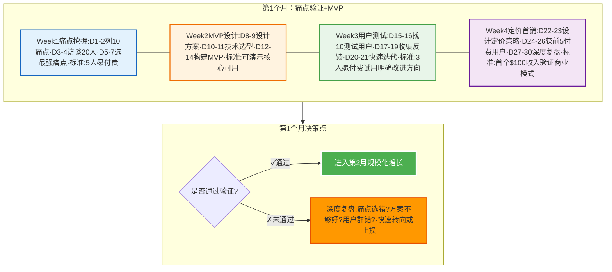

### 8.2 第二个30天：增长引擎

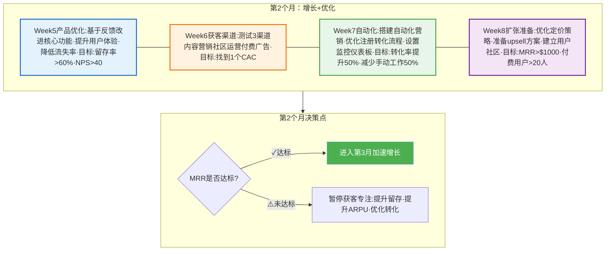

### 8.3 第三个30天：系统化

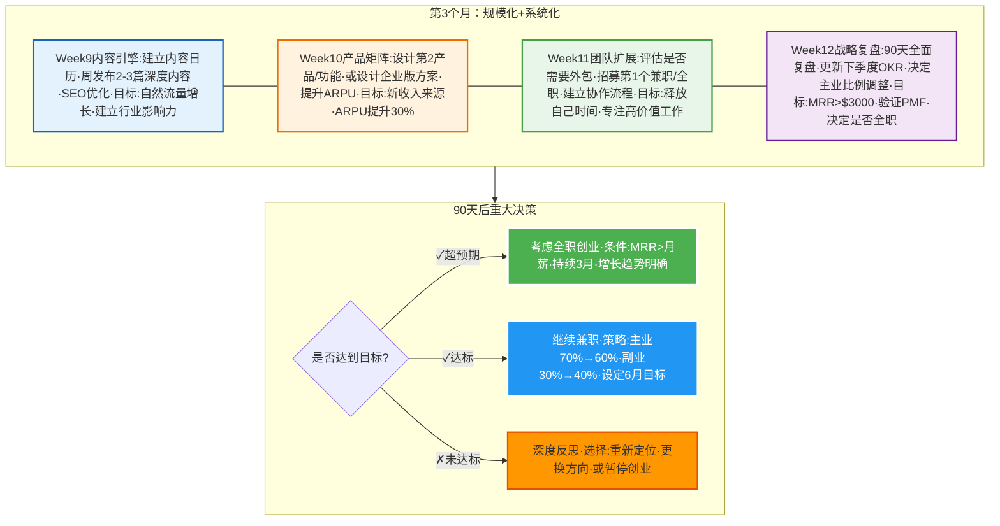

---
draft: true

## 终极智慧集成

### 核心理论：大师们的共识

我们学习了6位大师的智慧：
1. **MJ DeMarco** -《百万富翁快车道》
2. **Naval Ravikant** -《纳瓦尔宝典》
3. **Charlie Munger** - 多元思维模型
4. **Ray Dalio** -《原则》
5. **James Clear** -《原子习惯》
6. **Daniel Kahneman** -《思考，快与慢》

虽然他们来自不同领域，但核心智慧惊人一致：

---
draft: true

### 四大共识

#### 共识1：复利思维

**所有大师都强调复利的威力**：

- **James Clear**：1.01^365 = 37.8 （每天进步1%）
- **Charlie Munger**：复利是世界第8大奇迹
- **Ray Dalio**：痛苦+反思=进步（成长的复利）
- **Naval**：专长知识需要长期积累

**核心**：
- 微小改进 + 长期坚持 = 指数增长
- 关注过程，享受复利
- 耐心是最稀缺的资源

**你的行动**：
- [ ] 每天进步1%（量化追踪）
- [ ] 至少坚持90天不中断
- [ ] 建立复利思维习惯

---
draft: true

#### 共识2：长期主义

**所有大师都是长期主义者**：

- **MJ DeMarco**：5-10年快车道 > 40年慢车道
- **Naval**：与长期主义的人合作，玩长期游戏
- **Ray Dalio**：用长期视角看待短期波动
- **Charlie Munger**：延迟满足，长期复利

**核心**：
- 短期牺牲，长期收益
- 避免短视决策
- 与时间做朋友

**你的行动**：
- [ ] 设定5年目标
- [ ] 拒绝短期诱惑
- [ ] 每个决策问"5年后如何？"

---
draft: true

#### 共识3：价值创造

**所有大师都强调价值创造**：

- **MJ DeMarco**：追逐需求，金钱会跟随
- **Naval**：用专长知识×杠杆创造价值
- **Kahneman**：理性决策，避免偏差
- **Ray Dalio**：极度求真，解决真问题

**核心**：
- 以用户为中心
- 解决真实问题
- 可规模化价值

**你的行动**：
- [ ] 10人付费验证
- [ ] 高频强痛点
- [ ] 10倍好的解决方案

---
draft: true

#### 共识4：系统思维

**所有大师都建立系统**：

- **James Clear**：系统>目标
- **Ray Dalio**：算法化决策
- **Charlie Munger**：多元思维模型工具箱
- **MJ DeMarco**：快车道系统

**核心**：
- 建立系统，自动运行
- 持续优化系统
- 系统会持续，目标会结束

**你的行动**：
- [ ] 建立每日系统
- [ ] 建立决策系统
- [ ] 建立复盘系统

---
draft: true

### 你的财富自由操作系统

整合所有智慧，形成你的完整系统：

#### 1. 思维系统（大脑）

**快车道思维**（MJ DeMarco）：
- ✓ 5-10年财富自由（非40年慢车道）
- ✓ 建立系统（非时间换钱）
- ✓ 规模化价值（非线性增长）

**理性决策**（Kahneman）：
- ✓ 启动系统2（重大决策前24小时冷静期）
- ✓ 避免认知偏差（确认偏见、沉没成本）
- ✓ 用数据验证假设

**多元思维**（Munger）：
- ✓ 从多个角度分析问题
- ✓ 逆向思维（避免失败）
- ✓ 跨学科思考

#### 2. 能力系统（引擎）

**专长知识**（Naval）：
- ✓ 找到你的独特技能组合
- ✓ AI × 云原生 × 开发者工具
- ✓ 无法培训，只能通过实践获得

**杠杆**（Naval）：
- ✓ 代码杠杆（产品24/7运行）
- ✓ 媒体杠杆（内容持续传播）
- ✓ 资本杠杆（第2-3年）
- ✓ 劳动力杠杆（第3-5年）

**建造+销售**（Naval）：
- ✓ 会建造（技术能力）
- ✓ 会销售（写作/营销）
- ✓ 双料人才=无敌

#### 3. 行动系统（执行）

**原子习惯**（James Clear）：
- ✓ 每日系统（6:00-9:00深度工作）
- ✓ 每周系统（5次用户访谈、2-3篇内容）
- ✓ 每月系统（OKR + 复盘）
- ✓ 每季度系统（战略复盘）

**原则清单**（Ray Dalio）：
- ✓ 10人付费法则
- ✓ 2周MVP法则
- ✓ 6月储备法则
- ✓ LTV>3×CAC法则

**检查清单**（Munger）：
- ✓ 项目启动前检查清单
- ✓ 每周检查清单
- ✓ 每月检查清单
- ✓ 每季度检查清单

#### 4. 验证系统（轨道）

**NECST验证**（MJ DeMarco）：
- ✓ Need：真实需求
- ✓ Entry：进入壁垒
- ✓ Control：掌控权
- ✓ Scale：可规模化
- ✓ Time：时间解耦

**快速迭代**（精益创业）：
- ✓ 2周MVP
- ✓ 快速验证
- ✓ 数据驱动
- ✓ 及时pivot

#### 5. 风险管理系统（防护）

**杠铃策略**（Taleb）：
- ✓ 90%安全（主业+储备+指数基金）
- ✓ 10%冒险（创业项目）
- ✓ 限制下行，保留上行

**逆向思维**（Munger）：
- ✓ 避免12大致命错误
- ✓ 前置验尸
- ✓ 退出条件

---
draft: true

### 你的使命宣言

基于6位大师的智慧，制定你的使命宣言：

```
我的使命：

我致力于用AI赋能的代码和内容
解决开发者和企业的真实痛点
建立可规模化的系统
在5-10年内实现财富自由
同时帮助1000+人提升效率创造价值

我相信：
- 价值创造是财富的唯一来源
- 系统化是成功的关键
- 长期主义是最大的竞争优势
- 持续学习是唯一的护城河

我的原则：
- 需求第一（10人付费验证）
- 快速迭代（2周MVP）
- 数据驱动（无数据不决策）
- 健康第一（不透支身体）
- 极度求真（不自欺欺人）

我的系统：
- 每天深度工作2小时
- 每周用户访谈5次
- 每周内容创作2-3篇
- 每月复盘更新系统

我的杠杆：
- 代码（产品化专长知识）
- 媒体（建立个人品牌）
- 资本（盈利再投资）
- 团队（第3年开始）

我承诺：
- 每天进步1%
- 拥抱痛苦和反思
- 避免愚蠢的失败
- 与长期主义者合作
- 享受创造的过程

签名：_______________
日期：_______________
```

**打印这份使命宣言，贴在墙上，每天阅读一遍。**

---
draft: true

### 实践练习10：整合你的系统

**第1步：绘制你的系统架构图**（1小时）

在Notion/白板上，绘制你的完整系统：

```
            [你的目标]
                ↓
        ┌───────────────┐
        │  思维系统     │
        │ (大脑/决策)  │
        └───────┬───────┘
                ↓
        ┌───────────────┐
        │  能力系统     │
        │ (专长×杠杆)  │
        └───────┬───────┘
                ↓
        ┌───────────────┐
        │  行动系统     │
        │ (每日/周/月)  │
        └───────┬───────┘
                ↓
        ┌───────────────┐
        │  验证系统     │
        │ (NECST/迭代) │
        └───────┬───────┘
                ↓
        ┌───────────────┐
        │ 风险管理系统  │
        │ (杠铃/逆向)  │
        └───────┬───────┘
                ↓
           [财富自由]
```

**第2步：制定你的使命宣言**（30分钟）

填写上面的使命宣言模板，打印出来。

**第3步：建立你的第二大脑**（2小时）

在Notion/Obsidian中创建完整的知识管理系统：

```
📁 STARSHIP系统
├── 📄 使命宣言
├── 📊 检查清单系统
│   ├── 项目启动前
│   ├── 每周检查
│   ├── 每月检查
│   └── 每季度检查
├── 📖 原则清单
│   ├── 需求验证原则
│   ├── 产品开发原则
│   ├── 财务原则
│   ├── 时间管理原则
│   └── 健康原则
├── 🎯 OKR系统
│   ├── 2024 Q1
│   ├── 2024 Q2
│   ├── 2024 Q3
│   └── 2024 Q4
├── 📈 数据仪表板
│   ├── MRR追踪
│   ├── 用户增长
│   ├── 留存率
│   └── CAC/LTV
├── 💡 思维模型工具箱
│   ├── 数学模型
│   ├── 物理模型
│   ├── 生物模型
│   ├── 心理模型
│   └── 经济模型
├── ✅ 每日/周/月复盘
│   ├── 日志模板
│   ├── 周复盘模板
│   ├── 月复盘模板
│   └── 季度复盘模板
└── 📚 学习资源
    ├── 书单
    ├── 课程
    ├── 播客
    └── 社区
```

**第4步：立即行动清单**（今天开始）

今天（2小时）：
- [ ] 制定使命宣言
- [ ] 创建Notion/Obsidian系统
- [ ] 列出10个痛点
- [ ] 记录当前基线数据

本周（10小时）：
- [ ] 访谈20个用户
- [ ] 选择1个最强痛点
- [ ] 设计MVP方案
- [ ] 列出所需资源

本月（40小时）：
- [ ] 完成并发布MVP
- [ ] 获得前5个付费用户
- [ ] 首个$100收入
- [ ] 建立每周/月复盘系统

本季度（90天）：
- [ ] 验证PMF
- [ ] MRR达到$1K-3K
- [ ] 找到可复制获客渠道
- [ ] 决定是否全职创业

---
draft: true

### 终极建议：立即行动

所有的知识、理论、系统，如果不行动，都是0。

**James Clear说**：
> "你不会上升到目标的高度，而会下降到系统的水平。"

**Ray Dalio说**：
> "痛苦+反思=进步。拥抱痛苦，它是成长的信号。"

**Charlie Munger说**：
> "告诉我我会死在哪里，这样我就永远不去那里。"

**Naval说**：
> "专长知识×杠杆=财富。找到你的交叉点。"

**MJ DeMarco说**：
> "慢车道让你在65岁自由，快车道让你在35岁自由。区别是40年青春。"

**Daniel Kahneman说**：
> "慢思考。重大决策前，给自己24小时。"

---
draft: true

**现在，立即行动**：

1. 打开Notion/Obsidian
2. 创建"STARSHIP系统"
3. 列出10个痛点
4. 今天就开始第一个用户访谈

**5年后，在火星等你。**

### 9.1 大师们的共识

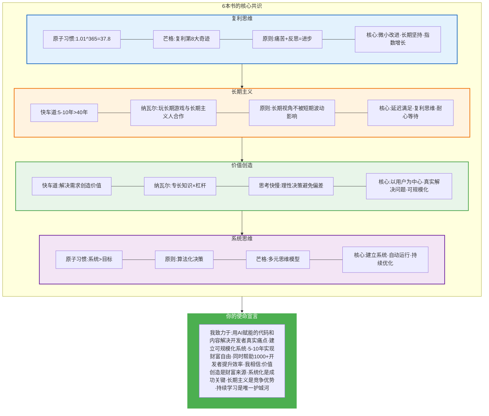

### 9.2 立即行动清单

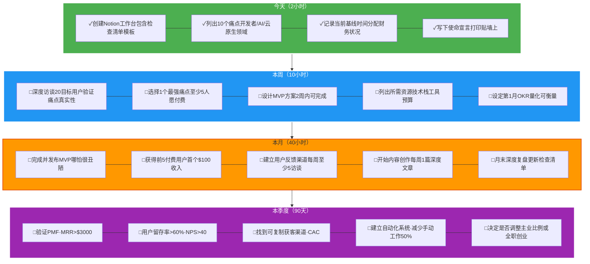

---
draft: true

## 终极建议

### 10.1 大师们的警告

```mermaid
graph TB
    subgraph Warnings["关键警告"]
        direction TB

        W1["MJ DeMarco:<br/>❌ 不要走慢车道<br/>不要用40年青春换退休"]

        W2["Naval:<br/>❌ 不要追逐金钱<br/>要追逐专长知识和杠杆"]

        W3["芒格:<br/>❌ 不要做自己不懂的事<br/>待在能力圈内"]

        W4["Ray Dalio:<br/>❌ 不要自欺欺人<br/>极度求真"]

        W5["James Clear:<br/>❌ 不要设定目标而忽略系统<br/>系统才会持续"]

        W6["Kahneman:<br/>❌ 不要相信直觉<br/>启动系统2思考"]
    end

    subgraph Advice["关键建议"]
        direction TB

        A1["✓ 建立快车道系统<br/>5-10年财富自由"]

        A2["✓ 用代码+媒体杠杆<br/>规模化价值创造"]

        A3["✓ 专注一个领域<br/>成为前5%"]

        A4["✓ 每个假设都要验证<br/>用数据说话"]

        A5["✓ 建立每日系统<br/>1%持续改进"]

        A6["✓ 重大决策前<br/>强制24小时冷静"]
    end

    Warnings --> Advice

    style Warnings fill:#ffebee,stroke:#c62828,stroke-width:2px
    style Advice fill:#e8f5e9,stroke:#43a047,stroke-width:3px
```

### 10.2 最重要的话

**MJ DeMarco的快车道启示**：
> "慢车道让你在65岁时自由，快车道让你在35岁时自由。区别是40年青春。"

**Naval的财富真相**：
> "不靠运气致富的秘诀：找到你的专长知识，用杠杆放大它，创造可规模化的价值。"

**芒格的智慧**：
> "我只想知道我将来会死在什么地方，这样我就永远不去那里。" （逆向思维）

**Ray Dalio的原则**：
> "痛苦+反思=进步。拥抱痛苦，它是成长的信号。"

**James Clear的系统**：
> "你不会上升到目标的高度，而会下降到系统的水平。"

**Kahneman的警醒**：
> "我们的直觉经常错误，学会不相信第一反应。"

---
draft: true

## 推荐书单（完整版）

### 必读经典（按阅读顺序）

1. **《思考，快与慢》** - Daniel Kahneman
   - 为什么读：理解你的认知偏差，避免系统1陷阱

2. **《原子习惯》** - James Clear
   - 为什么读：建立每日系统，1%持续改进

3. **《原则》** - Ray Dalio
   - 为什么读：学会极度求真，建立决策原则

4. **《百万富翁快车道》** - MJ DeMarco
   - 为什么读：理解慢车道vs快车道，选择正确的财富路径

5. **《纳瓦尔宝典》** - Eric Jorgenson
   - 为什么读：理解杠杆、专长知识、财富创造

6. **《穷查理宝典》** - 查理·芒格
   - 为什么读：多元思维模型，逆向思维，避免愚蠢

### 补充阅读

7. **《从0到1》** - Peter Thiel
8. **《精益创业》** - Eric Ries
9. **《深度工作》** - Cal Newport
10. **《黑天鹅》** - 纳西姆·塔勒布
11. **《反脆弱》** - 纳西姆·塔勒布
12. **《影响力》** - Robert Cialdini

---
draft: true

## 最后的话

你的愿景是宏大的，但现在你有了：

✓ **正确的思维模型**（快车道 vs 慢车道）
✓ **强大的杠杆工具**（代码 + 媒体）
✓ **清晰的验证框架**（NECST 5大戒律）
✓ **系统化的习惯**（每日1%改进）
✓ **风险管理策略**（杠铃策略 + 检查清单）
✓ **可执行的90天计划**（立即开始）

记住这些大师的核心智慧：

**不要走慢车道** - 用5-10年而非40年实现自由
**用杠杆放大价值** - 代码和媒体是你的武器
**建立系统而非目标** - 系统会持续，目标会结束
**极度求真** - 每个假设都要验证
**逆向思维** - 避免失败比追求成功更重要
**长期主义** - 与时间做朋友

---
draft: true

## 🚀 星舰即将发射

**你的星舰已经准备就绪。**

所有系统已完成检查：
- ✅ 推进系统（代码+媒体杠杆）
- ✅ 导航系统（多元思维模型）
- ✅ 燃料系统（复利+习惯）
- ✅ 飞控系统（原则+检查清单）
- ✅ 操作手册（90天行动计划）

**倒计时开始：**

```
T-0天：列出10个痛点
T+7天：选择最强痛点
T+14天：完成MVP
T+30天：首个$100收入
T+90天：MRR $3000，验证PMF
T+365天：财富自由的地平线已可见
```

**记住：**

- 不要做乘客（慢车道），要做飞行员（快车道）
- 不是40年漂流，而是5年跃迁
- 离开地球重力（打工），飞向火星自由（造物主权）

---
draft: true

```
                    ✦
                   ✦ ✦
                  ✦   ✦
            ━━━━━━━━━━━━━━━
            ║   星  舰   ║
            ║  STARSHIP  ║
            ━━━━━━━━━━━━━━━
                 🚀
                 ║
                 ║  "行动治愈一切焦虑"
                 ║
                 ↓
              火星基地
           (财富自由+价值创造)
```

---
draft: true

**现在，点火启动你的星舰。**

**第一步永远是最难的，但也是最关键的。**

**今天就列出10个痛点。明天就开始验证。**

**5年后，在火星等你。** 🔴

---
draft: true

*The Starship is ready. Are you?*

🚀 祝你旅途顺利，飞行员！
