# 分布式系统架构理论指南

**学习深度**: ⭐⭐⭐⭐⭐

---

## 第一部分：微服务架构设计模式

### 1.1 微服务架构基础理论

#### 什么是微服务？

微服务是一种架构风格，将单一应用程序开发为一组小型服务，每个服务运行在自己的进程中，使用轻量级机制（通常是HTTP RESTful API）进行通信。

**核心特征**:
- **独立部署**: 每个服务可以独立部署，不影响其他服务
- **业务能力**: 围绕业务能力组织服务
- **去中心化**: 数据管理去中心化，每个服务管理自己的数据
- **容错设计**: 服务必须能够容忍其他服务的失败

#### 单体架构 vs 微服务架构

**单体架构:**
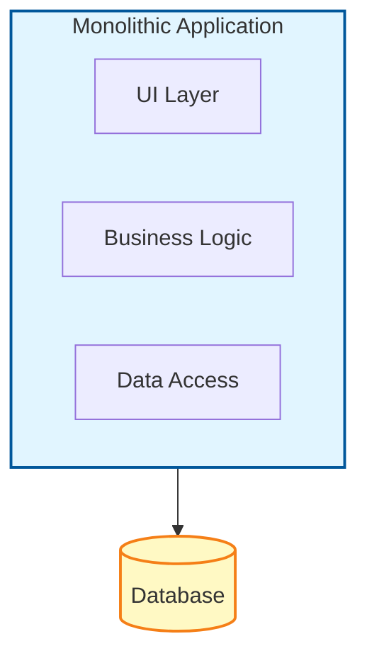
```mermaid
graph TB
    subgraph Monolithic["Monolithic Application"]
        UI["UI Layer"]
        BL["Business Logic"]
        DA["Data Access"]
    end
    Monolithic --> DB[(Database)]

    style Monolithic fill:#e1f5ff,stroke:#01579b,stroke-width:2px
    style DB fill:#fff9c4,stroke:#f57f17,stroke-width:2px
```

**微服务架构:**
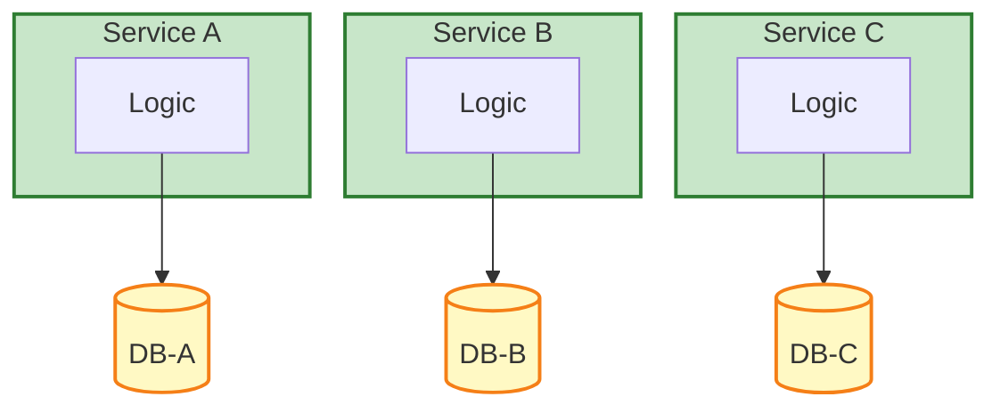
```mermaid
graph TB
    subgraph ServiceA["Service A"]
        LogicA["Logic"]
    end
    subgraph ServiceB["Service B"]
        LogicB["Logic"]
    end
    subgraph ServiceC["Service C"]
        LogicC["Logic"]
    end

    LogicA --> DBA[(DB-A)]
    LogicB --> DBB[(DB-B)]
    LogicC --> DBC[(DB-C)]

    style ServiceA fill:#c8e6c9,stroke:#2e7d32,stroke-width:2px
    style ServiceB fill:#c8e6c9,stroke:#2e7d32,stroke-width:2px
    style ServiceC fill:#c8e6c9,stroke:#2e7d32,stroke-width:2px
    style DBA fill:#fff9c4,stroke:#f57f17,stroke-width:2px
    style DBB fill:#fff9c4,stroke:#f57f17,stroke-width:2px
    style DBC fill:#fff9c4,stroke:#f57f17,stroke-width:2px
```

**架构对比**:

| 维度 | 单体架构 | 微服务架构 |
|------|---------|-----------|
| 部署 | 整体部署，一个改动需要重新部署全部 | 独立部署，只部署变更的服务 |
| 扩展性 | 垂直扩展，整个应用一起扩展 | 水平扩展，按需扩展特定服务 |
| 技术栈 | 统一技术栈 | 可以使用不同技术栈 |
| 开发速度 | 初期快，后期变慢 | 初期慢，后期保持稳定 |
| 复杂度 | 代码复杂度高 | 分布式系统复杂度高 |
| 故障影响 | 一个bug可能影响全局 | 故障隔离，影响范围小 |

### 1.2 服务拆分理论

#### 领域驱动设计 (DDD) 拆分原则

**限界上下文 (Bounded Context)**:
- 每个微服务代表一个限界上下文
- 上下文内有自己的领域模型和通用语言
- 不同上下文之间通过明确的接口通信

**电商系统拆分示例**:
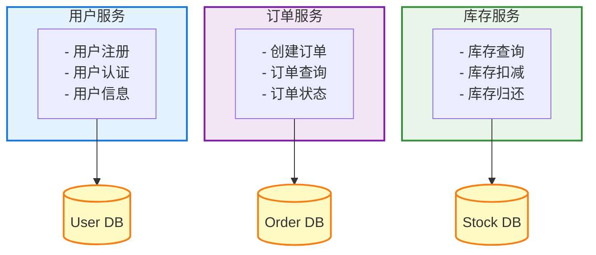
```mermaid
graph TB
    subgraph UserService["用户服务"]
        UserOps["- 用户注册<br/>- 用户认证<br/>- 用户信息"]
    end

    subgraph OrderService["订单服务"]
        OrderOps["- 创建订单<br/>- 订单查询<br/>- 订单状态"]
    end

    subgraph InventoryService["库存服务"]
        InvOps["- 库存查询<br/>- 库存扣减<br/>- 库存归还"]
    end

    UserOps --> UserDB[(User DB)]
    OrderOps --> OrderDB[(Order DB)]
    InvOps --> StockDB[(Stock DB)]

    style UserService fill:#e3f2fd,stroke:#1976d2,stroke-width:2px
    style OrderService fill:#f3e5f5,stroke:#7b1fa2,stroke-width:2px
    style InventoryService fill:#e8f5e9,stroke:#388e3c,stroke-width:2px
    style UserDB fill:#fff9c4,stroke:#f57f17,stroke-width:2px
    style OrderDB fill:#fff9c4,stroke:#f57f17,stroke-width:2px
    style StockDB fill:#fff9c4,stroke:#f57f17,stroke-width:2px
```

**服务拆分的四大原则**:

1. **单一职责原则 (Single Responsibility Principle)**
   - 一个服务只负责一个业务领域
   - 变更的原因应该只有一个
   - 避免职责混合导致的耦合

2. **高内聚低耦合 (High Cohesion, Low Coupling)**
   - 相关功能应该聚集在同一个服务中
   - 服务之间的依赖应该最小化
   - 通过事件或API进行松耦合通信

3. **数据独立性 (Data Independence)**
   - 每个服务拥有独立的数据库
   - 避免跨服务的直接数据库访问
   - 通过API共享数据

4. **业务能力对齐 (Business Capability Alignment)**
   - 按业务能力而非技术层次拆分
   - 每个服务对应一个业务能力
   - 服务边界与组织结构对齐

### 1.3 核心设计模式

#### Pattern 1: API Gateway 模式

**问题**: 客户端需要调用多个微服务，导致：
- 客户端复杂度增加
- 多次网络往返
- 横切关注点分散（认证、日志、限流）

**解决方案**: 提供单一入口点，路由请求到对应的微服务

**架构**:
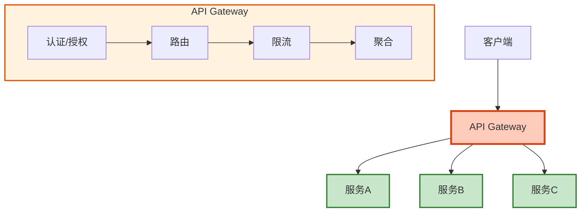
```mermaid
graph TB
    Client[客户端] --> Gateway

    subgraph APIGateway["API Gateway"]
        Auth["认证/授权"]
        Route["路由"]
        RateLimit["限流"]
        Aggregate["聚合"]
        Auth --> Route
        Route --> RateLimit
        RateLimit --> Aggregate
    end

    Gateway[API Gateway] --> ServiceA[服务A]
    Gateway --> ServiceB[服务B]
    Gateway --> ServiceC[服务C]

    style Gateway fill:#ffccbc,stroke:#d84315,stroke-width:3px
    style ServiceA fill:#c8e6c9,stroke:#2e7d32,stroke-width:2px
    style ServiceB fill:#c8e6c9,stroke:#2e7d32,stroke-width:2px
    style ServiceC fill:#c8e6c9,stroke:#2e7d32,stroke-width:2px
    style APIGateway fill:#fff3e0,stroke:#e65100,stroke-width:2px
```

**职责**:
- **路由**: 根据请求路径将请求转发到后端服务
- **认证授权**: 统一处理身份验证和权限控制
- **协议转换**: 外部HTTP转内部gRPC
- **请求聚合**: 合并多个服务的响应
- **限流熔断**: 保护后端服务
- **日志监控**: 统一收集请求日志

**优势**:
- 简化客户端调用
- 减少网络往返次数
- 集中处理横切关注点

**劣势**:
- 可能成为单点故障
- 增加额外延迟
- 需要额外维护

#### Pattern 2: 断路器模式 (Circuit Breaker)

**问题**:
- 服务故障可能导致级联失败
- 大量请求堆积导致资源耗尽
- 无法快速失败，影响用户体验

**核心思想**: 类似电路断路器，当错误率超过阈值时自动切断请求，防止故障扩散

**状态机**:
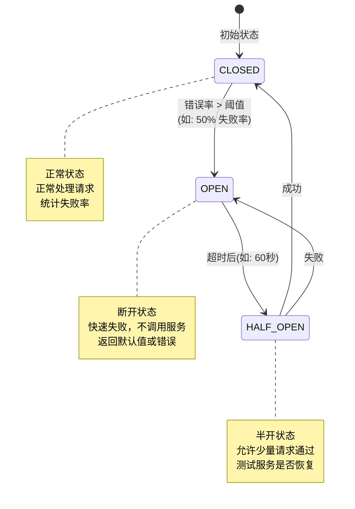
```mermaid
stateDiagram-v2
    [*] --> CLOSED: 初始状态
    CLOSED --> OPEN: 错误率 > 阈值<br/>(如: 50% 失败率)
    OPEN --> HALF_OPEN: 超时后(如: 60秒)
    HALF_OPEN --> CLOSED: 成功
    HALF_OPEN --> OPEN: 失败

    note right of CLOSED
        正常状态
        正常处理请求
        统计失败率
    end note

    note right of OPEN
        断开状态
        快速失败，不调用服务
        返回默认值或错误
    end note

    note right of HALF_OPEN
        半开状态
        允许少量请求通过
        测试服务是否恢复
    end note
```

**关键参数**:
- **失败阈值 (Failure Threshold)**: 触发断路的失败次数或比例
- **超时时间 (Timeout)**: OPEN状态持续时间
- **成功阈值 (Success Threshold)**: HALF_OPEN转CLOSED需要的成功次数
- **统计窗口 (Rolling Window)**: 计算失败率的时间窗口

**工作原理**:
1. **CLOSED 状态**: 正常请求，统计失败率
2. **触发条件**: 失败率超过阈值 → 转为 OPEN
3. **OPEN 状态**: 快速失败，减少资源消耗
4. **冷却期**: 等待一段时间 → 转为 HALF_OPEN
5. **HALF_OPEN 状态**: 试探性请求，检测服务状态
6. **恢复或继续断开**: 根据试探结果决定下一个状态

#### Pattern 3: 服务发现 (Service Discovery)

**问题**:
- 微服务实例动态变化（自动扩缩容）
- 如何找到服务的网络地址？
- 负载均衡如何知道可用实例？

**服务发现模式**:

**1. 客户端发现模式 (Client-Side Discovery)**
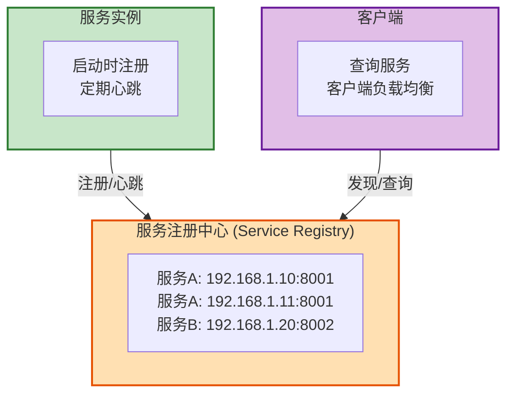
```mermaid
graph TB
    subgraph Registry["服务注册中心 (Service Registry)"]
        ServiceList["服务A: 192.168.1.10:8001<br/>服务A: 192.168.1.11:8001<br/>服务B: 192.168.1.20:8002"]
    end

    subgraph ServiceInstance["服务实例"]
        Actions1["启动时注册<br/>定期心跳"]
    end

    subgraph Client["客户端"]
        Actions2["查询服务<br/>客户端负载均衡"]
    end

    ServiceInstance -->|注册/心跳| Registry
    Client -->|发现/查询| Registry

    style Registry fill:#ffe0b2,stroke:#e65100,stroke-width:2px
    style ServiceInstance fill:#c8e6c9,stroke:#2e7d32,stroke-width:2px
    style Client fill:#e1bee7,stroke:#6a1b9a,stroke-width:2px
```

**特点**:
- 客户端直接查询注册中心
- 客户端实现负载均衡
- 较低延迟
- 客户端逻辑复杂

**2. 服务端发现模式 (Server-Side Discovery)**
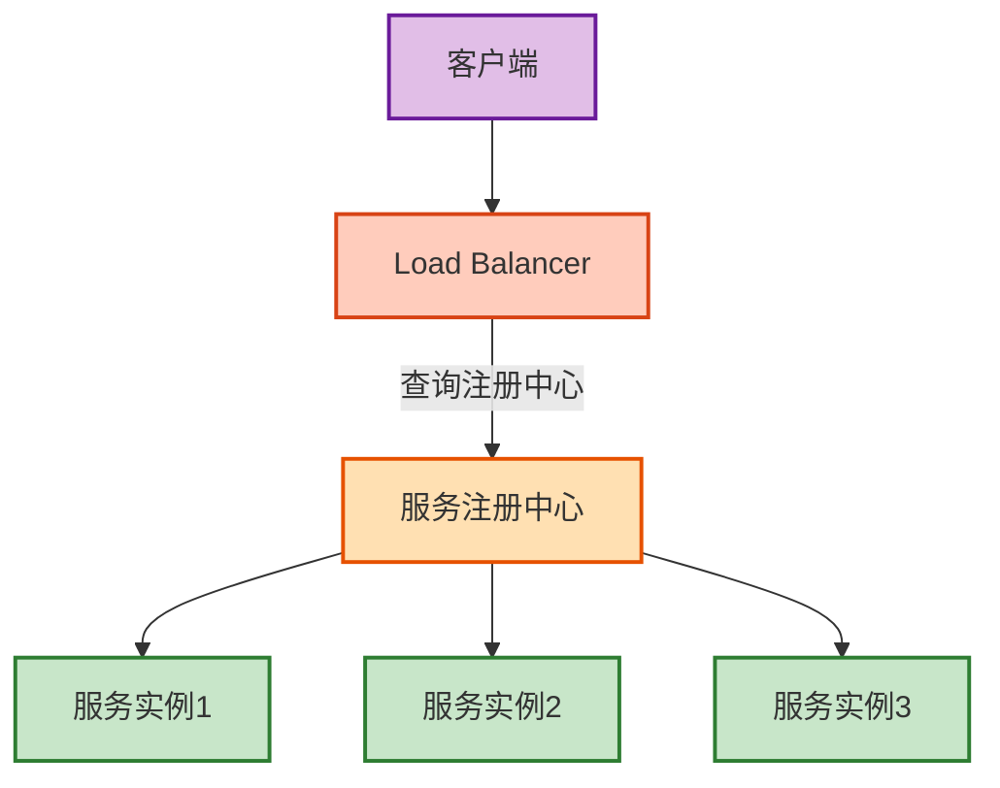
```mermaid
graph TB
    Client[客户端] --> LB[Load Balancer]
    LB -->|查询注册中心| Registry[服务注册中心]
    Registry --> Instance1[服务实例1]
    Registry --> Instance2[服务实例2]
    Registry --> Instance3[服务实例3]

    style Client fill:#e1bee7,stroke:#6a1b9a,stroke-width:2px
    style LB fill:#ffccbc,stroke:#d84315,stroke-width:2px
    style Registry fill:#ffe0b2,stroke:#e65100,stroke-width:2px
    style Instance1 fill:#c8e6c9,stroke:#2e7d32,stroke-width:2px
    style Instance2 fill:#c8e6c9,stroke:#2e7d32,stroke-width:2px
    style Instance3 fill:#c8e6c9,stroke:#2e7d32,stroke-width:2px
```

**特点**:
- 负载均衡器查询注册中心
- 客户端逻辑简单
- 额外的网络跳转
- 负载均衡器可能成为瓶颈

**健康检查机制**:
- **心跳检查 (Heartbeat)**: 服务定期发送心跳
- **主动探测 (Active Probing)**: 注册中心主动检查服务
- **被动检测 (Passive Detection)**: 根据实际请求判断健康状态

#### Pattern 4: 服务间通信模式

**同步通信 vs 异步通信**:

**同步通信 (HTTP/gRPC):**
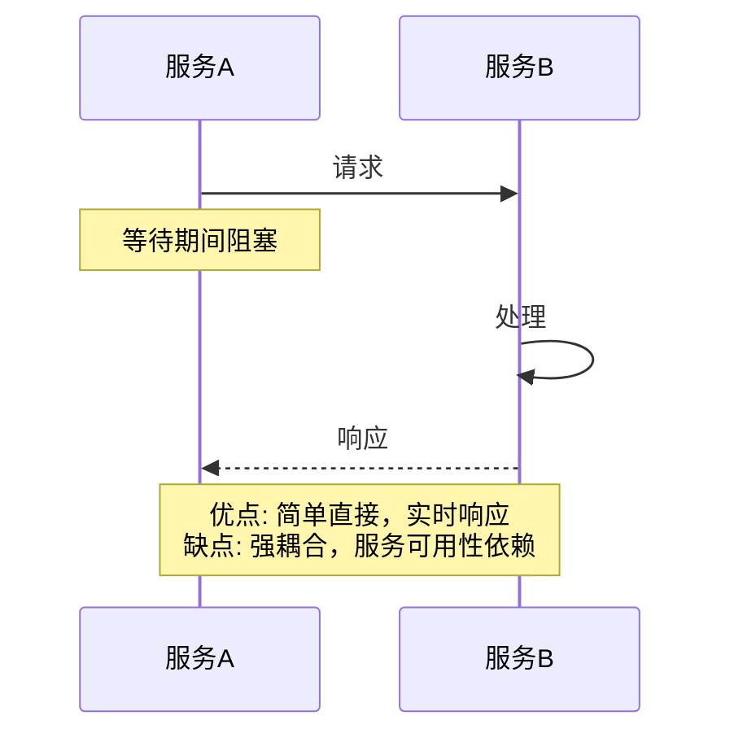
```mermaid
sequenceDiagram
    participant ServiceA as 服务A
    participant ServiceB as 服务B

    ServiceA->>ServiceB: 请求
    Note over ServiceA: 等待期间阻塞
    ServiceB->>ServiceB: 处理
    ServiceB-->>ServiceA: 响应

    Note over ServiceA,ServiceB: 优点: 简单直接，实时响应<br/>缺点: 强耦合，服务可用性依赖
```

**异步通信 (消息队列):**
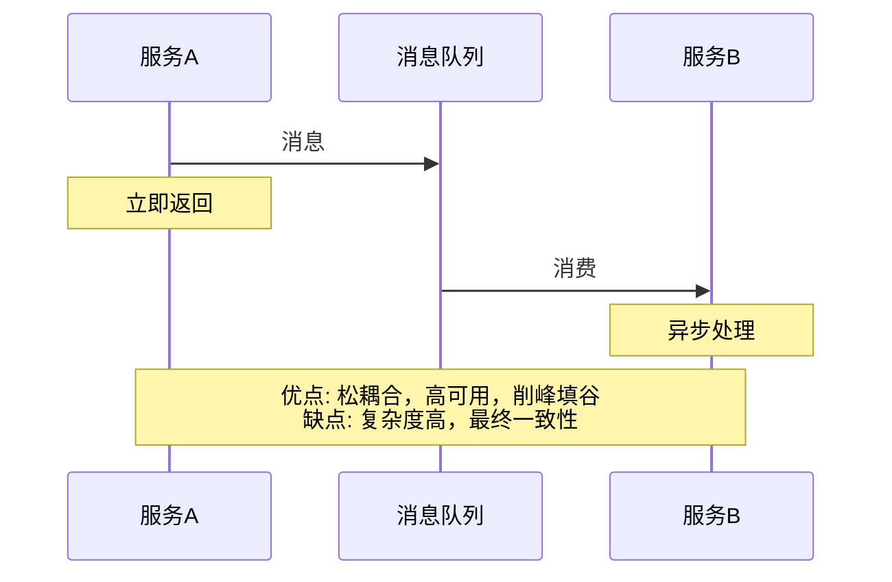
```mermaid
sequenceDiagram
    participant ServiceA as 服务A
    participant MQ as 消息队列
    participant ServiceB as 服务B

    ServiceA->>MQ: 消息
    Note over ServiceA: 立即返回
    MQ->>ServiceB: 消费
    Note over ServiceB: 异步处理

    Note over ServiceA,ServiceB: 优点: 松耦合，高可用，削峰填谷<br/>缺点: 复杂度高，最终一致性
```

**通信协议选择**:

| 协议 | 场景 | 优势 | 劣势 |
|------|------|------|------|
| REST/HTTP | 公共API、前后端通信 | 简单、通用、可调试 | 性能较低、文本协议 |
| gRPC | 内部微服务通信 | 高性能、强类型、流式 | 学习曲线、调试困难 |
| 消息队列 | 异步处理、事件驱动 | 解耦、削峰、可靠 | 复杂度高、调试难 |
| GraphQL | 灵活查询、移动端 | 按需获取、减少请求 | 缓存复杂、查询优化 |

---

## 第二部分：服务网格 (Service Mesh)

### 2.1 服务网格概念

**什么是服务网格？**

服务网格是一个专用的基础设施层，用于处理服务间通信。它将网络功能（负载均衡、服务发现、故障恢复、指标收集）从应用代码中抽离出来。

**架构演进**:

**传统微服务:**
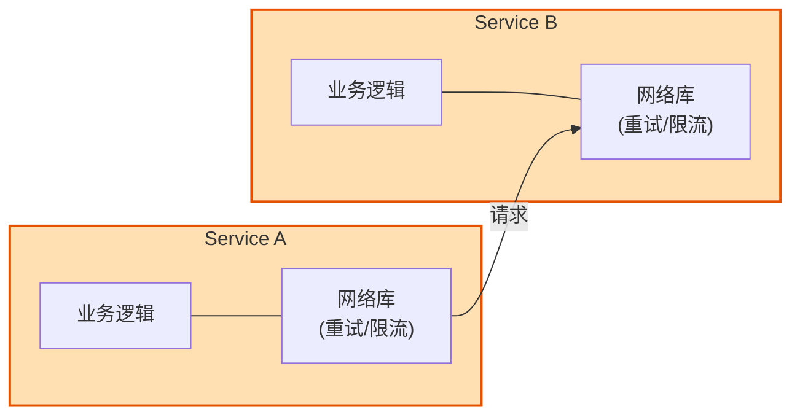
```mermaid
graph LR
    subgraph ServiceA["Service A"]
        BizA["业务逻辑"]
        NetA["网络库<br/>(重试/限流)"]
        BizA --- NetA
    end

    subgraph ServiceB["Service B"]
        BizB["业务逻辑"]
        NetB["网络库<br/>(重试/限流)"]
        BizB --- NetB
    end

    NetA -->|请求| NetB

    style ServiceA fill:#ffe0b2,stroke:#e65100,stroke-width:2px
    style ServiceB fill:#ffe0b2,stroke:#e65100,stroke-width:2px
```

**问题:**
- 每个服务都要实现重试、超时、熔断等逻辑
- 多语言实现不一致
- 升级困难,需要修改每个服务

**服务网格:**
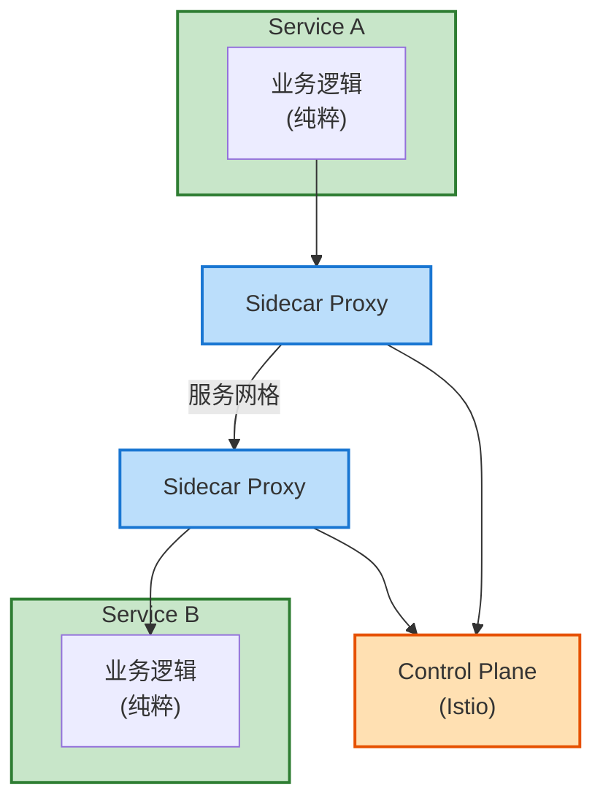
```mermaid
graph TB
    subgraph ServiceA["Service A"]
        BizLogicA["业务逻辑<br/>(纯粹)"]
    end

    subgraph ServiceB["Service B"]
        BizLogicB["业务逻辑<br/>(纯粹)"]
    end

    BizLogicA --> SidecarA[Sidecar Proxy]
    SidecarA -->|服务网格| SidecarB[Sidecar Proxy]
    SidecarB --> BizLogicB

    SidecarA --> ControlPlane["Control Plane<br/>(Istio)"]
    SidecarB --> ControlPlane

    style ServiceA fill:#c8e6c9,stroke:#2e7d32,stroke-width:2px
    style ServiceB fill:#c8e6c9,stroke:#2e7d32,stroke-width:2px
    style SidecarA fill:#bbdefb,stroke:#1976d2,stroke-width:2px
    style SidecarB fill:#bbdefb,stroke:#1976d2,stroke-width:2px
    style ControlPlane fill:#ffe0b2,stroke:#e65100,stroke-width:2px
```

**优势:**
- 业务逻辑与网络逻辑分离
- 统一的策略和配置
- 多语言透明支持
- 集中式管理

### 2.2 Istio 架构

**整体架构**:
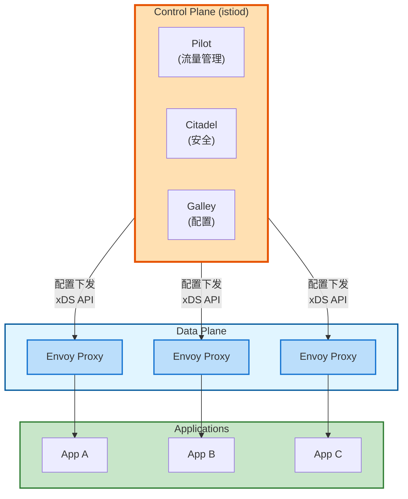
```mermaid
graph TB
    subgraph ControlPlane["Control Plane (istiod)"]
        Pilot["Pilot<br/>(流量管理)"]
        Citadel["Citadel<br/>(安全)"]
        Galley["Galley<br/>(配置)"]
    end

    subgraph DataPlane["Data Plane"]
        Envoy1["Envoy Proxy"]
        Envoy2["Envoy Proxy"]
        Envoy3["Envoy Proxy"]
    end

    subgraph Apps["Applications"]
        AppA[App A]
        AppB[App B]
        AppC[App C]
    end

    ControlPlane -->|配置下发<br/>xDS API| Envoy1
    ControlPlane -->|配置下发<br/>xDS API| Envoy2
    ControlPlane -->|配置下发<br/>xDS API| Envoy3

    Envoy1 --> AppA
    Envoy2 --> AppB
    Envoy3 --> AppC

    style ControlPlane fill:#ffe0b2,stroke:#e65100,stroke-width:3px
    style DataPlane fill:#e1f5ff,stroke:#01579b,stroke-width:2px
    style Apps fill:#c8e6c9,stroke:#2e7d32,stroke-width:2px
    style Envoy1 fill:#bbdefb,stroke:#1976d2,stroke-width:2px
    style Envoy2 fill:#bbdefb,stroke:#1976d2,stroke-width:2px
    style Envoy3 fill:#bbdefb,stroke:#1976d2,stroke-width:2px
```

**核心组件职责**:

**Control Plane (控制平面)**:
- **Pilot (飞行员)**
  - 服务发现：从Kubernetes等平台获取服务信息
  - 流量管理：配置路由规则、负载均衡策略
  - 弹性能力：超时、重试、熔断配置
  - 配置分发：通过xDS API推送配置到Envoy

- **Citadel (城堡)**
  - 证书管理：自动生成、分发、轮换证书
  - mTLS：服务间双向TLS加密
  - 身份认证：基于SPIFFE的服务身份
  - 授权策略：细粒度的访问控制

- **Galley (厨房)**
  - 配置验证：验证用户配置的正确性
  - 配置处理：转换配置为Istio内部格式
  - 配置分发：向其他组件分发配置

**Data Plane (数据平面)**:
- **Envoy Proxy (特使代理)**
  - 高性能C++编写的代理
  - 负责实际的流量转发
  - 实现所有网络功能（LB、重试、超时等）
  - 收集遥测数据

### 2.3 流量管理

#### 虚拟服务 (Virtual Service)

**概念**: 定义流量如何路由到具体的服务版本

**流量管理能力**:
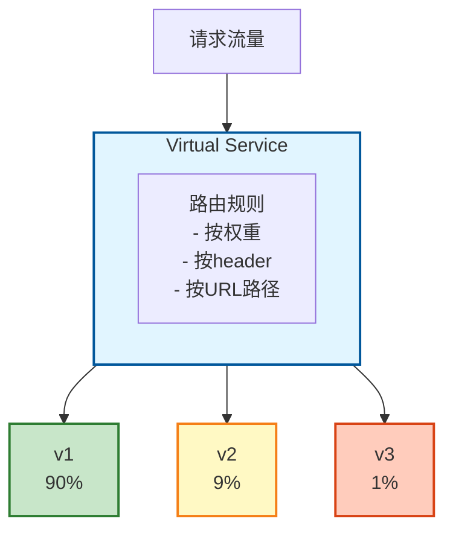
```mermaid
graph TB
    Traffic[请求流量] --> VS

    subgraph VS["Virtual Service"]
        Rules["路由规则<br/>- 按权重<br/>- 按header<br/>- 按URL路径"]
    end

    VS --> V1["v1<br/>90%"]
    VS --> V2["v2<br/>9%"]
    VS --> V3["v3<br/>1%"]

    style VS fill:#e1f5ff,stroke:#01579b,stroke-width:2px
    style V1 fill:#c8e6c9,stroke:#2e7d32,stroke-width:2px
    style V2 fill:#fff9c4,stroke:#f57f17,stroke-width:2px
    style V3 fill:#ffccbc,stroke:#d84315,stroke-width:2px
```

**金丝雀发布流程**:
```
阶段 1: 初始状态
v1: 100% 流量

阶段 2: 金丝雀开始
v1: 90% 流量
v2: 10% 流量 (观察指标)

阶段 3: 逐步扩大
v1: 50% 流量
v2: 50% 流量

阶段 4: 完全切换
v1: 0% 流量
v2: 100% 流量
```

#### 目标规则 (Destination Rule)

**概念**: 定义路由发生后的流量策略

**功能**:
- **服务子集定义**: 根据标签定义不同版本
- **负载均衡策略**: 轮询、随机、最少请求等
- **连接池管理**: TCP/HTTP连接数限制
- **熔断配置**: 异常检测和驱逐

**负载均衡算法**:

| 算法 | 说明 | 适用场景 |
|------|------|---------|
| ROUND_ROBIN | 轮询 | 实例性能相近 |
| LEAST_REQUEST | 最少请求 | 实例性能不均 |
| RANDOM | 随机 | 简单场景 |
| PASSTHROUGH | 透传 | 外部服务 |
| CONSISTENT_HASH | 一致性哈希 | 会话保持 |

#### 弹性能力

**重试机制**:
```
客户端请求
   │
   ▼
┌──────────────┐
│ Envoy Proxy  │
└──────┬───────┘
       │
       ├─► 尝试 1 ──X─► 服务实例A (失败)
       │
       ├─► 尝试 2 ──X─► 服务实例B (失败)
       │
       └─► 尝试 3 ──✓─► 服务实例C (成功)

重试条件:
- 5xx 错误
- 连接超时
- 连接重置
```

**超时控制**:
```
请求链路超时设置:

API Gateway
 │ timeout: 5s
 ▼
Service A
 │ timeout: 3s
 ▼
Service B
 │ timeout: 1s
 ▼
Service C

原则: 下游超时 < 上游超时
确保: 超时在链路中传播
```

**熔断器 (Circuit Breaker)**:
```
异常检测规则:
- 连续错误次数: 5次
- 检测间隔: 30秒
- 驱逐时间: 30秒
- 最小驱逐百分比: 10%

流程:
1. 服务实例连续失败5次
2. 将该实例从负载均衡池驱逐
3. 等待30秒后重新加入
4. 如果再次失败，继续驱逐
```

### 2.4 可观测性

#### 分布式追踪 (Distributed Tracing)

**追踪上下文传播**:
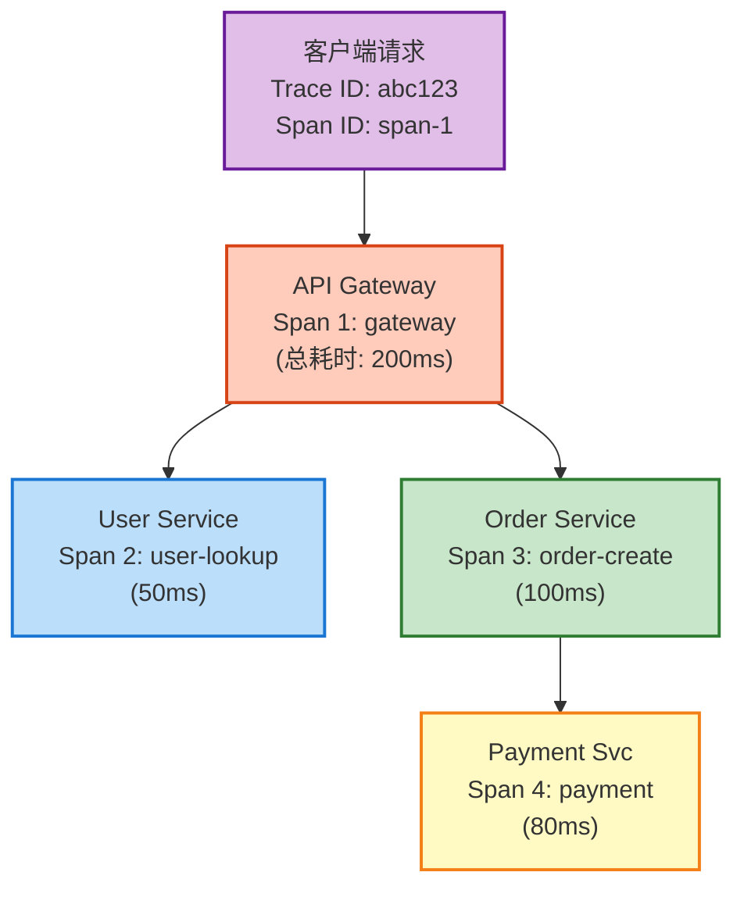
```mermaid
graph TB
    Client[客户端请求<br/>Trace ID: abc123<br/>Span ID: span-1] --> Gateway

    Gateway["API Gateway<br/>Span 1: gateway<br/>(总耗时: 200ms)"]

    Gateway --> UserService["User Service<br/>Span 2: user-lookup<br/>(50ms)"]
    Gateway --> OrderService["Order Service<br/>Span 3: order-create<br/>(100ms)"]

    OrderService --> PaymentService["Payment Svc<br/>Span 4: payment<br/>(80ms)"]

    style Client fill:#e1bee7,stroke:#6a1b9a,stroke-width:2px
    style Gateway fill:#ffccbc,stroke:#d84315,stroke-width:2px
    style UserService fill:#bbdefb,stroke:#1976d2,stroke-width:2px
    style OrderService fill:#c8e6c9,stroke:#2e7d32,stroke-width:2px
    style PaymentService fill:#fff9c4,stroke:#f57f17,stroke-width:2px
```

**Trace 结构:**
```
Trace: abc123
├── Span 1 (gateway): 0-200ms
    ├── Span 2 (user): 0-50ms
    └── Span 3 (order): 50-150ms
        └── Span 4 (payment): 60-140ms
```

**Span 属性**:
- **Trace ID**: 唯一标识一次请求
- **Span ID**: 唯一标识一个操作
- **Parent Span ID**: 父操作ID
- **开始时间**: Span开始时间
- **持续时间**: Span执行时长
- **标签 (Tags)**: 元数据（服务名、HTTP方法等）
- **日志 (Logs)**: Span内的事件

#### Metrics (指标)

**四大黄金信号**:

1. **延迟 (Latency)**
   - 请求响应时间
   - P50, P90, P95, P99百分位
   - 平均延迟 vs 长尾延迟

2. **流量 (Traffic)**
   - 请求速率 (QPS/RPS)
   - 带宽使用
   - 并发连接数

3. **错误 (Errors)**
   - 错误率 (%)
   - 错误类型分布
   - 4xx vs 5xx

4. **饱和度 (Saturation)**
   - CPU使用率
   - 内存使用率
   - 网络I/O
   - 磁盘I/O

**RED方法** (面向请求的服务):
- **Rate**: 请求速率
- **Errors**: 错误率
- **Duration**: 请求持续时间

**USE方法** (面向资源):
- **Utilization**: 资源利用率
- **Saturation**: 资源饱和度
- **Errors**: 错误数

---

## 第三部分：分布式事务与一致性

### 3.1 分布式事务的挑战

**ACID 在分布式系统中的困境**:

| ACID属性 | 单机数据库 | 分布式系统挑战 |
|---------|-----------|---------------|
| Atomicity (原子性) | 事务内所有操作要么全成功要么全失败 | 跨多个服务的原子性难以保证 |
| Consistency (一致性) | 事务前后数据一致 | 不同服务有独立数据库 |
| Isolation (隔离性) | 并发事务互不干扰 | 分布式锁成本高、性能差 |
| Durability (持久性) | 已提交数据永久保存 | 需要复杂的协调机制 |

**典型场景：电商下单**:
```
下单流程涉及多个服务:
1. 订单服务：创建订单记录
2. 库存服务：扣减商品库存
3. 支付服务：从账户扣款
4. 积分服务：增加用户积分

要求：要么全部成功，要么全部失败（回滚）

挑战：
- 如何保证原子性？
- 如何处理部分失败？
- 如何处理网络分区？
- 如何保证性能？
```

### 3.2 两阶段提交 (2PC)

**协议原理**:

两阶段提交通过协调者(Coordinator)和参与者(Participants)完成分布式事务。

**阶段划分**:

**Phase 1: Prepare (准备阶段)**
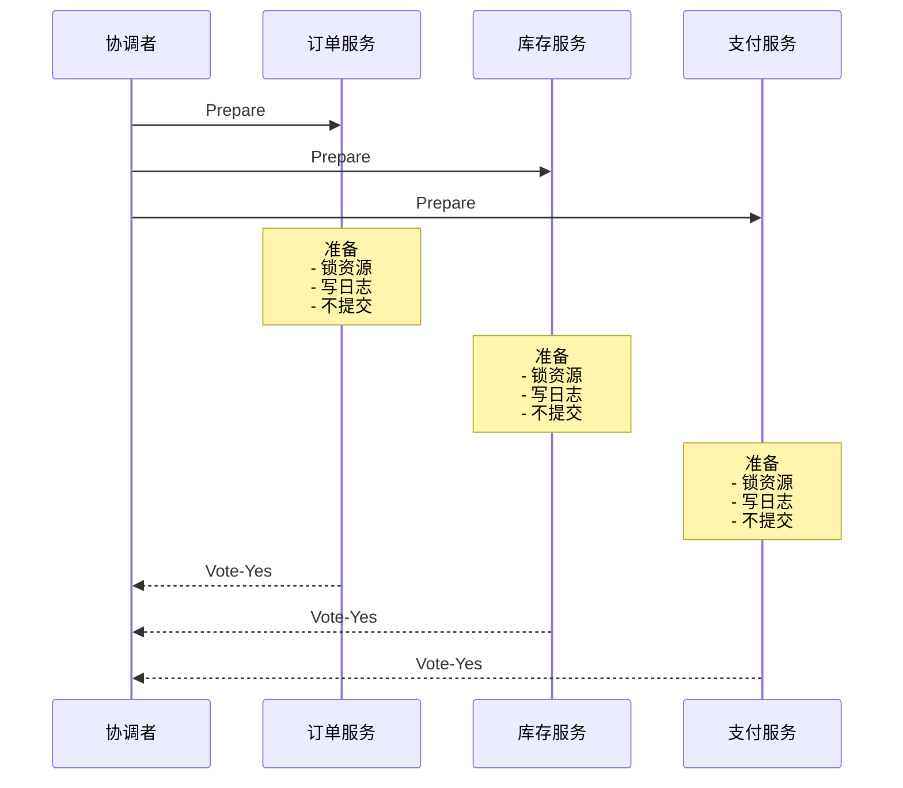
```mermaid
sequenceDiagram
    participant C as 协调者
    participant O as 订单服务
    participant I as 库存服务
    participant P as 支付服务

    C->>O: Prepare
    C->>I: Prepare
    C->>P: Prepare

    Note over O: 准备<br/>- 锁资源<br/>- 写日志<br/>- 不提交
    Note over I: 准备<br/>- 锁资源<br/>- 写日志<br/>- 不提交
    Note over P: 准备<br/>- 锁资源<br/>- 写日志<br/>- 不提交

    O-->>C: Vote-Yes
    I-->>C: Vote-Yes
    P-->>C: Vote-Yes
```

**Phase 2: Commit (提交阶段)**
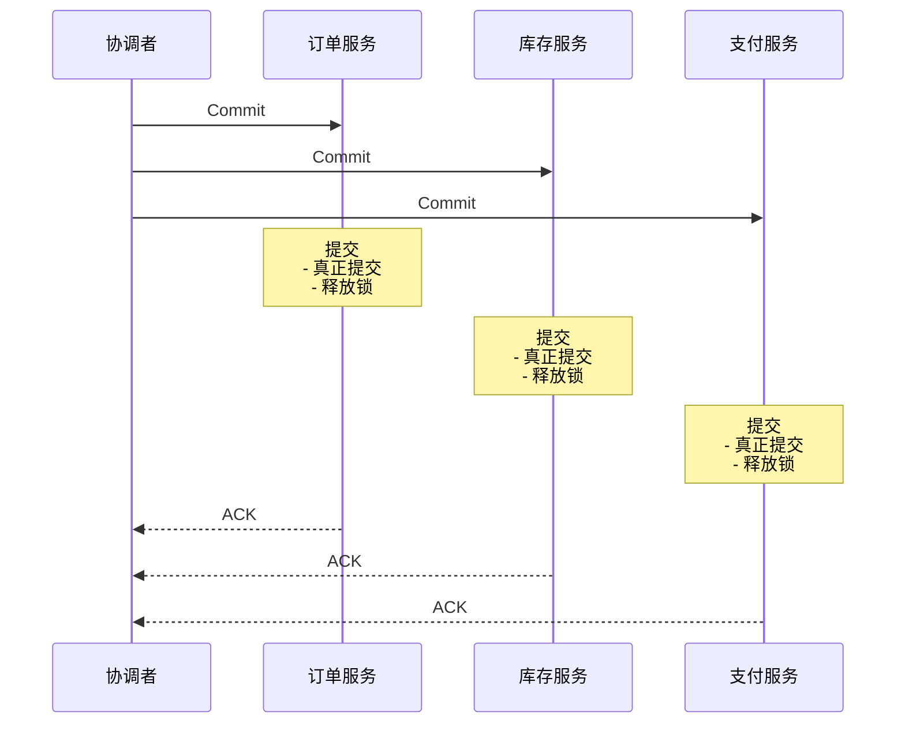
```mermaid
sequenceDiagram
    participant C as 协调者
    participant O as 订单服务
    participant I as 库存服务
    participant P as 支付服务

    C->>O: Commit
    C->>I: Commit
    C->>P: Commit

    Note over O: 提交<br/>- 真正提交<br/>- 释放锁
    Note over I: 提交<br/>- 真正提交<br/>- 释放锁
    Note over P: 提交<br/>- 真正提交<br/>- 释放锁

    O-->>C: ACK
    I-->>C: ACK
    P-->>C: ACK
```

**失败场景处理**:

1. **Prepare阶段有参与者投票No**:
```
协调者收到 Vote-No
    │
    ▼
发送 Abort 给所有参与者
    │
    ▼
所有参与者回滚
    │
    ▼
释放锁和资源
```

2. **Commit阶段部分参与者失败**:
```
这是最危险的情况！

协调者已经决定Commit
    │
    ▼
部分参与者Commit成功
部分参与者失败（网络故障/宕机）
    │
    ▼
数据不一致！

解决方案:
- 持久化Commit决定
- 不断重试失败的参与者
- 人工介入修复
```

**2PC 的问题**:

1. **阻塞问题**
   - 参与者在Prepare后会阻塞等待Commit/Abort
   - 如果协调者故障，参与者无限期等待
   - 锁定的资源无法释放

2. **单点故障**
   - 协调者故障导致整个系统无法工作
   - 需要协调者高可用方案

3. **性能问题**
   - 两个阶段的网络往返
   - 同步阻塞，延迟高
   - 锁持有时间长

4. **数据一致性风险**
   - Commit阶段失败可能导致不一致
   - 需要复杂的恢复机制

### 3.3 Saga 模式

**核心思想**:
将长事务拆分为多个本地事务，每个本地事务有对应的补偿操作。如果某个步骤失败，执行补偿事务回滚之前的操作。

#### 编排式 Saga (Choreography)

**特点**:
- 去中心化，通过事件驱动
- 每个服务监听事件并发布事件
- 无中央协调器

**成功流程**:
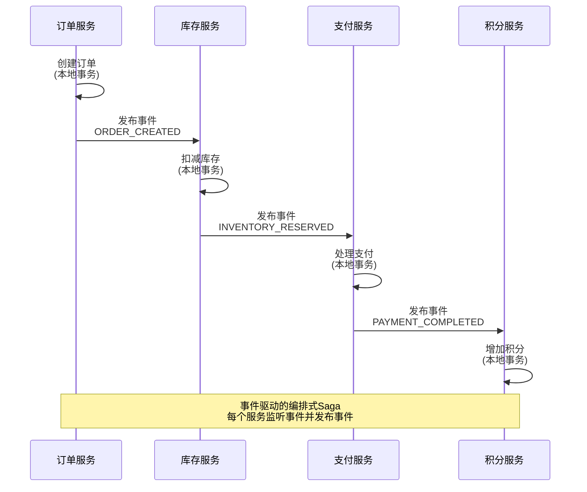
```mermaid
sequenceDiagram
    participant O as 订单服务
    participant I as 库存服务
    participant P as 支付服务
    participant Pt as 积分服务

    O->>O: 创建订单<br/>(本地事务)
    O->>I: 发布事件<br/>ORDER_CREATED
    I->>I: 扣减库存<br/>(本地事务)
    I->>P: 发布事件<br/>INVENTORY_RESERVED
    P->>P: 处理支付<br/>(本地事务)
    P->>Pt: 发布事件<br/>PAYMENT_COMPLETED
    Pt->>Pt: 增加积分<br/>(本地事务)

    Note over O,Pt: 事件驱动的编排式Saga<br/>每个服务监听事件并发布事件
```

**失败补偿流程**:
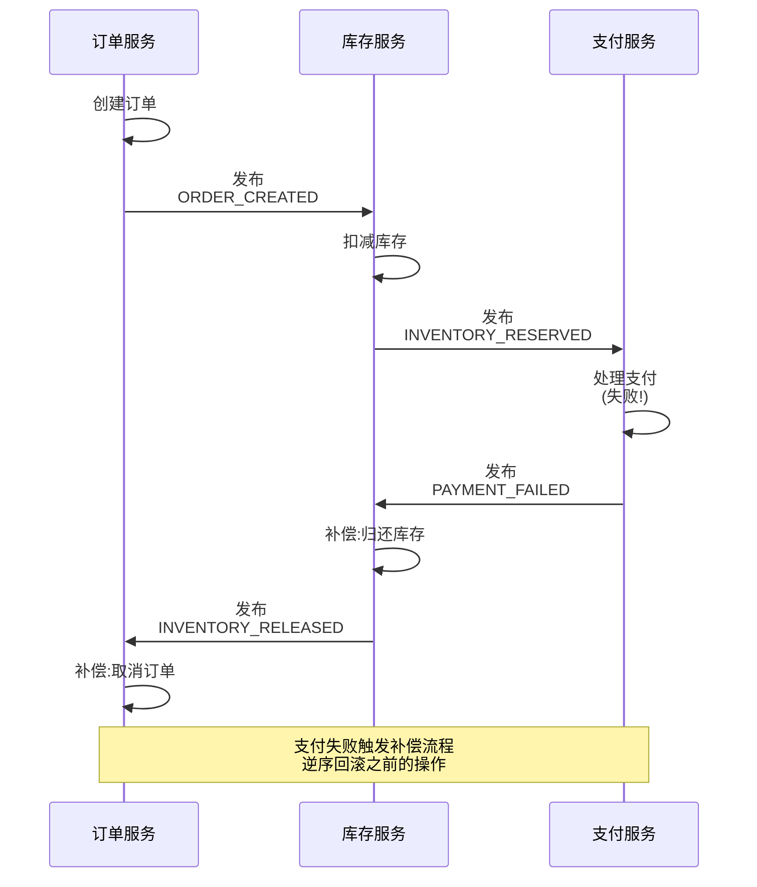
```mermaid
sequenceDiagram
    participant O as 订单服务
    participant I as 库存服务
    participant P as 支付服务

    O->>O: 创建订单
    O->>I: 发布<br/>ORDER_CREATED
    I->>I: 扣减库存
    I->>P: 发布<br/>INVENTORY_RESERVED
    P->>P: 处理支付<br/>(失败!)
    P->>I: 发布<br/>PAYMENT_FAILED
    I->>I: 补偿:归还库存
    I->>O: 发布<br/>INVENTORY_RELEASED
    O->>O: 补偿:取消订单

    Note over O,P: 支付失败触发补偿流程<br/>逆序回滚之前的操作
```

**优势**:
- 松耦合，服务独立性强
- 无单点故障
- 易于扩展新服务

**劣势**:
- 难以理解和调试
- 无全局视图
- 事件链追踪困难
- 循环依赖风险

#### 编排式 Saga (Orchestration)

**特点**:
- 中心化，有协调器
- 协调器管理整个流程
- 顺序执行，逻辑清晰

**架构**:
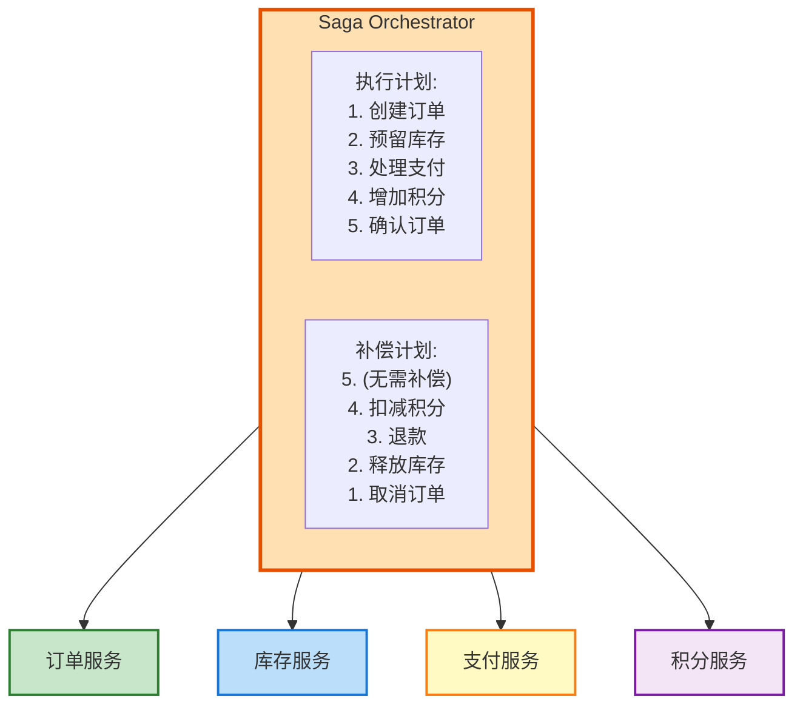
```mermaid
graph TB
    subgraph Orchestrator["Saga Orchestrator"]
        ExecPlan["执行计划:<br/>1. 创建订单<br/>2. 预留库存<br/>3. 处理支付<br/>4. 增加积分<br/>5. 确认订单"]
        CompPlan["补偿计划:<br/>5. (无需补偿)<br/>4. 扣减积分<br/>3. 退款<br/>2. 释放库存<br/>1. 取消订单"]
    end

    Orchestrator --> OrderSvc[订单服务]
    Orchestrator --> InvSvc[库存服务]
    Orchestrator --> PaySvc[支付服务]
    Orchestrator --> PointSvc[积分服务]

    style Orchestrator fill:#ffe0b2,stroke:#e65100,stroke-width:3px
    style OrderSvc fill:#c8e6c9,stroke:#2e7d32,stroke-width:2px
    style InvSvc fill:#bbdefb,stroke:#1976d2,stroke-width:2px
    style PaySvc fill:#fff9c4,stroke:#f57f17,stroke-width:2px
    style PointSvc fill:#f3e5f5,stroke:#7b1fa2,stroke-width:2px
```

**执行流程**:
```
正常流程:
Orchestrator
    │
    ├─► Step 1: 创建订单 ✓
    │
    ├─► Step 2: 预留库存 ✓
    │
    ├─► Step 3: 处理支付 ✓
    │
    ├─► Step 4: 增加积分 ✓
    │
    └─► Step 5: 确认订单 ✓

失败补偿流程:
Orchestrator
    │
    ├─► Step 1: 创建订单 ✓
    │
    ├─► Step 2: 预留库存 ✓
    │
    ├─► Step 3: 处理支付 ✗ (失败!)
    │
    │   开始补偿...
    │
    ├─► Compensation 2: 释放库存 ✓
    │
    └─► Compensation 1: 取消订单 ✓
```

**优势**:
- 集中控制，易于理解
- 全局视图，便于监控
- 易于实现复杂逻辑
- 状态管理集中

**劣势**:
- 协调器是单点（需高可用）
- 服务耦合到协调器
- 协调器可能成为瓶颈

**两种模式对比**:

| 维度 | 编排式 (Choreography) | 编排式 (Orchestration) |
|------|----------------------|------------------------|
| 耦合度 | 低 - 事件驱动 | 高 - 依赖协调器 |
| 复杂度 | 高 - 逻辑分散 | 低 - 集中管理 |
| 可观测性 | 难 - 需追踪事件链 | 易 - 协调器掌握全局 |
| 单点故障 | 无 | 协调器是单点 |
| 扩展性 | 易于添加新服务 | 需修改协调器 |
| 适用场景 | 简单流程、松耦合系统 | 复杂流程、需要集中控制 |

### 3.4 其他分布式事务模式

#### TCC (Try-Confirm-Cancel)

**三阶段操作**:
```
Try阶段: 预留资源
    │
    ├─► 订单服务: 创建临时订单
    ├─► 库存服务: 预留库存（不实际扣减）
    └─► 支付服务: 冻结金额（不实际扣款）

Confirm阶段: 确认提交
    │
    ├─► 订单服务: 确认订单
    ├─► 库存服务: 确认扣减库存
    └─► 支付服务: 确认扣款

Cancel阶段: 取消回滚
    │
    ├─► 订单服务: 删除临时订单
    ├─► 库存服务: 释放预留库存
    └─► 支付服务: 解冻金额
```

**特点**:
- 业务侵入性强，需要实现三个接口
- 资源预留，性能开销大
- 强一致性保证

#### 本地消息表

**原理**: 利用本地事务保证消息发送

```
服务A事务:
┌─────────────────────────┐
│  1. 更新业务数据        │
│  2. 插入消息表          │
│  (在同一个本地事务中)    │
└────────┬────────────────┘
         │
         ▼
     定时任务扫描
         │
         ▼
   发送消息到MQ
         │
         ▼
     服务B消费

特点:
- 最终一致性
- 实现简单
- 需要定时任务
- 消息表需要维护
```

---

## 第四部分：CAP 理论与最终一致性

### 4.1 CAP 定理

**定理内容**:
分布式系统最多只能同时满足以下三项中的两项:

```mermaid
graph TB
    C[Consistency<br/>一致性]
    A[Availability<br/>可用性]
    P[Partition Tolerance<br/>分区容错性]

    C -.->|CA<br/>(不存在)| A
    C -->|CP<br/>牺牲可用性| P
    A -->|AP<br/>牺牲一致性| P

    style C fill:#e3f2fd,stroke:#1976d2,stroke-width:3px
    style A fill:#f3e5f5,stroke:#7b1fa2,stroke-width:3px
    style P fill:#e8f5e9,stroke:#388e3c,stroke-width:3px

    Note1["CP系统: 一致性 + 分区容错性 (牺牲可用性)"]
    Note2["AP系统: 可用性 + 分区容错性 (牺牲一致性)"]
    Note3["CA系统: 不能容忍分区，实际不存在于分布式环境"]
```

**详细解释**:

**1. Consistency (一致性)**
```
定义: 所有节点在同一时间看到相同的数据

写入 A=1
┌────┐    ┌────┐    ┌────┐
│ N1 │───▶│ N2 │───▶│ N3 │
│A=1 │    │A=1 │    │A=1 │
└────┘    └────┘    └────┘

任何读操作都返回最新写入的值

强一致性要求:
- 写操作完成后，所有读操作立即看到新值
- 需要同步复制
- 性能开销大
```

**2. Availability (可用性)**
```
定义: 每个请求都能得到响应（成功或失败）

即使某些节点故障，系统仍能响应请求

┌────┐    ┌────┐    ┌────┐
│ N1 │    │ N2 │    │ N3 │
│可用│    │故障│    │可用│
└────┘    └────┘    └────┘
   ╲                  ╱
    ╲                ╱
     ▼              ▼
     仍能处理请求

可用性要求:
- 非故障节点必须响应请求
- 不能无限期等待
- 响应时间有界
```

**3. Partition Tolerance (分区容错性)**
```
定义: 系统在网络分区时仍能继续运行

网络分区场景:
┌────────────┐    ╱╱╱╱╱    ┌────────────┐
│ 分区 1     │    断开      │ 分区 2     │
│  ┌────┐    │             │  ┌────┐    │
│  │ N1 │    │             │  │ N2 │    │
│  │A=1 │    │             │  │A=? │    │
│  └────┘    │             │  └────┘    │
└────────────┘             └────────────┘

分区容错要求:
- 网络分区时系统继续工作
- 分区愈合后能够恢复
- 是分布式系统的必然要求
```

### 4.2 权衡与选择

**为什么CA不存在？**
```
在分布式系统中，网络分区是必然发生的:
- 交换机故障
- 网线断开
- 拥塞丢包
- 光纤中断

因此分布式系统必须选择P
剩下的选择是:
- CP: 牺牲可用性保证一致性
- AP: 牺牲一致性保证可用性
```

**CP系统: 一致性 + 分区容错**

```
代表系统: ZooKeeper, HBase, MongoDB(强一致性配置)

网络分区场景:
┌────────────┐         ┌────────────┐
│ 主分区     │  断开   │ 少数分区   │
│(3个节点)   │ ╱╱╱╱╱  │(2个节点)   │
│ 继续服务   │         │ 拒绝服务   │
└────────────┘         └────────────┘

策略:
- 少数派拒绝服务（牺牲可用性）
- 保证多数派数据一致
- 分区愈合后数据同步

优势:
- 数据强一致
- 无数据丢失风险

劣势:
- 分区时部分节点不可用
- 整体可用性下降
```

**AP系统: 可用性 + 分区容错**

```
代表系统: Cassandra, DynamoDB, Riak

网络分区场景:
┌────────────┐         ┌────────────┐
│ 分区 1     │  断开   │ 分区 2     │
│(3个节点)   │ ╱╱╱╱╱  │(2个节点)   │
│ 继续服务   │         │ 继续服务   │
│ 接受写入   │         │ 接受写入   │
└────────────┘         └────────────┘

策略:
- 所有节点继续服务
- 接受可能的数据不一致
- 分区愈合后解决冲突

优势:
- 高可用性
- 低延迟

劣势:
- 可能读到旧数据
- 需要冲突解决机制
- 最终一致性
```

### 4.3 一致性模型

**一致性强度光谱**:
```
强                                         弱
│                                          │
▼                                          ▼
线性一致性 (Linearizability)
   │
   ▼
顺序一致性 (Sequential Consistency)
   │
   ▼
因果一致性 (Causal Consistency)
   │
   ▼
会话一致性 (Session Consistency)
   │
   ▼
最终一致性 (Eventual Consistency)
```

**1. 线性一致性 (Linearizability)**
```
最强的一致性保证

特点:
- 操作看起来是瞬间完成的
- 有一个全局时钟
- 所有操作有全局顺序

时间线:
Client 1: Write(x=1)  ────✓────
Client 2:              Read(x) → 必须返回1

一旦写操作完成，所有读操作立即看到新值
```

**2. 顺序一致性 (Sequential Consistency)**
```
放宽了实时性要求

特点:
- 所有操作有全局顺序
- 但不要求与实际时间对应
- 单个进程的操作顺序保持

Client 1: Write(x=1) Write(x=2)
Client 2: Read(x)=2  Read(x)=1  (可能!)

全局顺序可能是:
W(x=2) → W(x=1) → R(x)=1 → R(x)=2
```

**3. 因果一致性 (Causal Consistency)**
```
只保证因果相关的操作顺序

有因果关系:
Write(x=1) → Read(x)=1 → Write(y=2)
             (基于x的值写y)

无因果关系:
Thread 1: Write(x=1)
Thread 2: Write(y=2)
(可以以任意顺序观察到)

特点:
- 因果相关操作保持顺序
- 并发操作可以任意顺序
- 性能较好
```

**4. 最终一致性 (Eventual Consistency)**
```
最弱的一致性保证

特点:
- 如果没有新的更新，最终所有副本一致
- 不保证何时达到一致
- 允许中间状态不一致

时间线:
T0: Write(x=1) on Node A
T1: Read(x) on Node B → 可能返回旧值
T2: Read(x) on Node C → 可能返回旧值
...
Tn: 所有节点最终都是 x=1

适用场景:
- DNS
- 社交媒体点赞数
- 购物车
```

### 4.4 向量时钟 (Vector Clock)

**用途**: 检测并发写入和解决冲突

**原理**:
```
每个节点维护一个向量时钟
向量时钟: {NodeA: 版本号, NodeB: 版本号, NodeC: 版本号}

操作:
1. 本地写入时，增加自己的版本号
2. 接收远程更新时，合并向量时钟
```

**示例**:
```
初始状态: x = null
向量时钟: {A:0, B:0, C:0}

操作序列:

1. Node A 写入 x=1
   向量时钟: {A:1, B:0, C:0}

2. Node B 写入 x=2 (基于A的更新)
   向量时钟: {A:1, B:1, C:0}

3. Node C 写入 x=3 (基于初始状态)
   向量时钟: {A:0, B:0, C:1}

检测冲突:
比较 {A:1, B:1, C:0} 和 {A:0, B:0, C:1}
- 既不是 前者 ≥ 后者
- 也不是 后者 ≥ 前者
- 结论: 并发冲突！

解决冲突:
1. Last-Write-Wins: 选择时间戳最新的
2. 应用层合并: 如购物车合并所有商品
3. 保留多个版本: 让用户选择
```

**向量时钟比较**:
```
V1 = {A:2, B:1, C:3}
V2 = {A:1, B:1, C:3}

比较规则:
- V1 > V2: V1的所有分量 ≥ V2，且至少一个 >
  结论: V1发生在V2之后

V1 = {A:2, B:1, C:3}
V2 = {A:1, B:2, C:3}

比较规则:
- 既不是 V1 > V2，也不是 V2 > V1
  结论: V1和V2并发
```

### 4.5 Quorum (法定人数) 机制

**核心思想**: 通过读写重叠保证一致性

**公式**: W + R > N
- **N**: 副本总数
- **W**: 写入时需要确认的副本数
- **R**: 读取时需要查询的副本数

**原理**:
```
N = 5 (5个副本)
W = 3 (写入需要3个确认)
R = 3 (读取需要查询3个)

W + R = 6 > 5 = N (保证重叠)

写入流程:
┌────┐ ┌────┐ ┌────┐ ┌────┐ ┌────┐
│ N1 │ │ N2 │ │ N3 │ │ N4 │ │ N5 │
└─┬──┘ └─┬──┘ └─┬──┘ └────┘ └────┘
  │      │      │
  ✓      ✓      ✓  (3个确认，写入成功)

读取流程:
┌────┐ ┌────┐ ┌────┐ ┌────┐ ┌────┐
│ N1 │ │ N2 │ │ N3 │ │ N4 │ │ N5 │
└─┬──┘ └────┘ └─┬──┘ └────┘ └─┬──┘
  │              │              │
  读              读             读

至少有一个节点同时参与了写和读
保证能读到最新数据
```

**不同配置的权衡**:

| 配置 | W | R | 一致性 | 可用性 | 性能 | 场景 |
|------|---|---|--------|--------|------|------|
| 强一致读 | N | 1 | 强 | 低(写) | 写慢读快 | 读多写少 |
| 强一致写 | 1 | N | 弱 | 高(写) | 写快读慢 | 写多读少 |
| Quorum | N/2+1 | N/2+1 | 强 | 中 | 平衡 | 通用 |
| 最终一致 | 1 | 1 | 弱 | 高 | 快 | 可容忍不一致 |

**Read Repair (读修复)**:
```
读取时发现副本不一致

Client发起读请求 (R=3)
   │
   ├─► N1: {value: X, version: 5}
   ├─► N2: {value: X, version: 5}
   └─► N3: {value: Y, version: 3} (旧数据!)

处理:
1. 返回最新版本 (version 5)
2. 异步修复 N3 的数据
3. 后续读取将看到一致的数据
```

### 4.6 BASE 理论

**BASE** 是 AP 系统的设计原则：

**B**asically **A**vailable (基本可用)
```
定义: 允许部分功能不可用，但核心功能可用

例子:
- 双11高峰期关闭评论功能
- 降级非核心服务
- 限制部分用户访问
```

**S**oft state (软状态)
```
定义: 允许系统中的数据存在中间状态

例子:
- 订单状态: 待支付 → 支付中 → 已支付
- 数据副本: 正在同步中
- 缓存: 可能过期
```

**E**ventually consistent (最终一致性)
```
定义: 系统最终会达到一致状态

例子:
- 微博粉丝数最终一致
- 电商库存最终一致
- DNS记录最终一致
```

**ACID vs BASE**:

| 维度 | ACID | BASE |
|------|------|------|
| 一致性 | 强一致性 | 最终一致性 |
| 可用性 | 较低 | 高 |
| 性能 | 较低 | 高 |
| 复杂度 | 低(数据库保证) | 高(应用层处理) |
| 适用场景 | 金融、账务 | 社交、电商 |

---

## 总结

### 微服务架构关键要点

1. **合理拆分**: 基于业务领域，遵循DDD原则
2. **容错设计**: 断路器、超时、重试
3. **服务发现**: 动态感知服务实例变化
4. **API网关**: 统一入口，横切关注点

### 服务网格价值

1. **业务与基础设施分离**: 开发专注业务逻辑
2. **统一管理**: 流量、安全、可观测性
3. **多语言支持**: 透明代理，语言无关
4. **渐进式演进**: 不侵入现有系统

### 分布式事务选择

| 场景 | 推荐方案 | 理由 |
|------|---------|------|
| 强一致性要求 | TCC | 严格的ACID保证 |
| 已知流程 | Saga(Orchestration) | 易于管理和监控 |
| 松耦合系统 | Saga(Choreography) | 事件驱动，灵活 |
| 简单场景 | 本地消息表 | 实现简单 |
| 避免使用 | 2PC | 性能差，阻塞严重 |

### CAP权衡

1. **关键数据选CP**: 库存、支付、账户余额
2. **非关键数据选AP**: 点赞数、浏览历史、推荐
3. **使用Quorum**: 灵活调整一致性级别
4. **接受最终一致性**: 大多数场景可接受

---

## 参考资源

- **《Designing Data-Intensive Applications》** - Martin Kleppmann
  https://dataintensive.net/

- **微软云设计模式**
  https://learn.microsoft.com/azure/architecture/patterns/

- **CNCF Landscape**
  https://landscape.cncf.io/

- **Istio官方文档**
  https://istio.io/docs/

- **CAP定理论文** - Eric Brewer
  https://www.infoq.com/articles/cap-twelve-years-later-how-the-rules-have-changed/

- **Saga模式**
  https://microservices.io/patterns/data/saga.html
