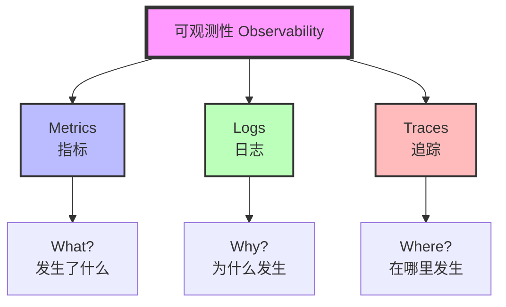
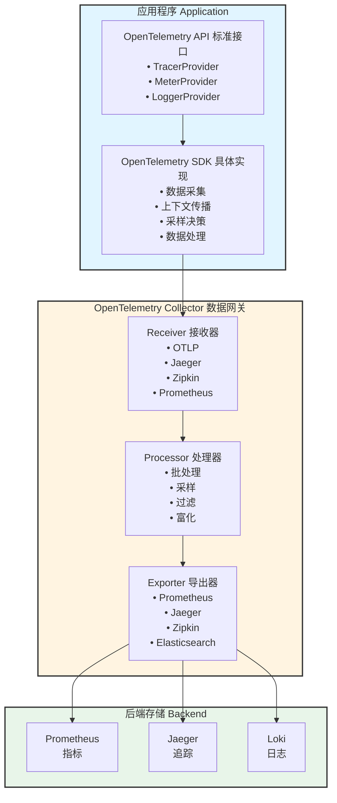

# 可观测性与监控深度理论知识

> **学习深度**: ⭐⭐⭐⭐
> **文档类型**: 纯理论知识（无代码实践）
> **权威参考**: OpenTelemetry、Prometheus、Grafana、Google SRE

---

## 目录

1. [可观测性基础理论](#可观测性基础理论)
2. [OpenTelemetry 标准](#opentelemetry-标准)
3. [分布式追踪 (Distributed Tracing)](#分布式追踪)
4. [日志聚合与分析](#日志聚合与分析)
5. [指标监控与告警](#指标监控与告警)
6. [可观测性架构设计](#可观测性架构设计)

---

## 可观测性基础理论

### 1.1 可观测性 vs 监控

#### 核心区别

**监控 (Monitoring)**:
- **定义**: 通过预定义的指标和规则检测**已知问题**
- **问题模型**: "我知道会出什么问题，让我监控它"
- **方法**: 仪表盘、阈值告警、健康检查
- **局限性**: 只能发现预期的故障模式

**可观测性 (Observability)**:
- **定义**: 通过系统外部输出推断**内部状态**的能力
- **问题模型**: "发生了什么？为什么发生？"
- **方法**: 任意维度查询、关联分析、根因定位
- **能力**: 可以调查**未知的未知问题** (Unknown Unknowns)

#### 理论基础：控制论中的可观测性

源自控制理论的数学定义：

```
系统状态方程:
x(t+1) = A·x(t) + B·u(t)  (状态转移)
y(t) = C·x(t)             (观测输出)

可观测性定义:
系统可观测 ⟺ 通过观测 y(t) 可唯一确定初始状态 x(0)

可观测矩阵:
O = [C; CA; CA²; ...; CA^(n-1)]
系统可观测 ⟺ rank(O) = n
```

**映射到软件系统**:
- **状态 x(t)**: 系统内部状态（变量、队列、连接）
- **输出 y(t)**: 日志、指标、追踪数据
- **可观测性**: 能否从输出推断内部状态

---

### 1.2 可观测性的三大支柱



#### 三大支柱详解

| 维度 | Metrics (指标) | Logs (日志) | Traces (追踪) |
|-----|---------------|------------|--------------|
| **数据类型** | 数值型时间序列 | 离散事件记录 | 分布式调用链 |
| **粒度** | 聚合（秒/分钟） | 单个事件 | 单次请求 |
| **存储成本** | 低（高压缩比） | 高 | 中 |
| **查询速度** | 快 | 慢 | 中 |
| **回答问题** | "现在流量多大？" | "这个错误的详细信息？" | "慢在哪个服务？" |
| **典型用途** | 实时监控、告警 | 问题调试、审计 | 性能分析、依赖分析 |
| **数据保留** | 长期（年） | 中期（月） | 短期（周） |
| **采样** | 通常不采样 | 可能采样 | 通常采样 |

#### 三者关联关系

```
关联模型：

指标异常 → 触发告警
    ↓
查看日志 → 发现错误信息
    ↓
查看追踪 → 定位具体服务
    ↓
深入指标 → 确认根因

示例流程：
1. Metrics: "API 延迟 P99 从 100ms → 5000ms"
2. Logs: "Database connection timeout 错误 50 次/分钟"
3. Traces: "慢请求都卡在 Payment 服务调用 DB"
4. Metrics: "Payment 服务的 DB 连接池满"
```

---

### 1.3 可观测性成熟度模型

```
Level 0 - 无监控:
  • 依赖用户报告问题
  • 手动登录服务器查日志
  • 无法预测故障

Level 1 - 基础监控:
  ✓ 服务器 CPU/内存监控
  ✓ 简单健康检查
  ✓ 基础告警（阈值触发）
  ✗ 无法定位分布式问题

Level 2 - 结构化监控:
  ✓ 应用级指标（QPS、延迟、错误率）
  ✓ 结构化日志（JSON）
  ✓ 基础追踪（单体应用内）
  ✗ 缺乏统一标准

Level 3 - 完整可观测性:
  ✓ 三大支柱完整覆盖
  ✓ 统一标准（OpenTelemetry）
  ✓ 分布式追踪
  ✓ 关联查询（Metrics ↔ Logs ↔ Traces）
  ✗ 依赖人工分析

Level 4 - 智能可观测性:
  ✓ AI 异常检测
  ✓ 自动根因分析
  ✓ 预测性告警
  ✓ 自愈系统
```

---

## OpenTelemetry 标准

### 2.1 OpenTelemetry 概述

#### 定义与目标

**OpenTelemetry (OTel)** 是云原生计算基金会 (CNCF) 的可观测性标准框架。

**核心目标**:
1. **统一标准**: 一套 API/SDK 覆盖 Metrics、Logs、Traces
2. **厂商中立**: 避免供应商锁定
3. **自动化**: 自动插桩，减少手动埋点
4. **互操作性**: 与现有工具（Prometheus、Jaeger）兼容

#### 历史演进

```
时间线:
2016      2017        2019           2021          2024
  ↓         ↓           ↓              ↓             ↓
OpenTracing → OpenCensus → OpenTelemetry → OTel 1.0 → 稳定
(CNCF)     (Google)      (合并)         (GA)        (广泛采用)

合并原因:
• OpenTracing: 专注 Tracing API 标准
• OpenCensus: 统一 Metrics + Tracing 但碎片化
→ 合并为 OpenTelemetry 统一三大支柱
```

---

### 2.2 OpenTelemetry 架构



#### 核心组件详解

**1. OpenTelemetry API**:
- **职责**: 定义标准接口，应用代码依赖
- **特性**: 无操作实现 (No-op)，不导入 SDK 也能编译
- **好处**: 库开发者可安全使用，不强制最终用户

**2. OpenTelemetry SDK**:
- **职责**: API 的具体实现
- **功能**:
  - 上下文传播 (Context Propagation)
  - 采样决策 (Sampling)
  - 资源检测 (Resource Detection)
  - 批量导出

**3. OpenTelemetry Collector**:
- **定位**: 可观测性数据网关
- **架构**: Receiver → Processor → Exporter 管道
- **价值**:
  - 解耦应用与后端
  - 统一数据处理（过滤、采样、脱敏）
  - 多后端路由
  - 降低应用负载

---

### 2.3 OpenTelemetry 数据模型

#### Trace 数据模型

```
Trace (一次完整请求的调用链)
  └── Span (单个操作)
       ├── Span ID
       ├── Trace ID (所属 Trace)
       ├── Parent Span ID (父 Span)
       ├── 操作名称 (Operation Name)
       ├── 开始时间 / 结束时间
       ├── 状态 (Status: OK/Error)
       ├── Attributes (属性)
       │    ├── http.method = "GET"
       │    ├── http.url = "/api/users"
       │    └── db.system = "postgresql"
       ├── Events (事件)
       │    └── { timestamp, name, attributes }
       └── Links (关联其他 Span)
```

**Span 关系类型**:
```
ChildOf (父子关系):
Parent Span
  └── Child Span (同步调用)

FollowsFrom (因果关系):
Span A → Span B (异步调用，如消息队列)
```

#### Metrics 数据模型

**指标类型**:

| 类型 | 描述 | 聚合方式 | 示例 |
|-----|------|---------|------|
| **Counter** | 单调递增计数器 | Sum | 请求总数、错误总数 |
| **UpDownCounter** | 可增可减计数器 | Sum | 当前连接数、队列长度 |
| **Histogram** | 值分布直方图 | Bucket 统计 | 请求延迟、响应大小 |
| **Gauge** | 瞬时值 | Last Value | CPU 使用率、内存占用 |
| **Summary** | 分位数统计 | Quantile | P50/P95/P99 延迟 |

**Histogram vs Summary**:

| 维度 | Histogram | Summary |
|-----|-----------|---------|
| **计算位置** | 服务端聚合 | 客户端计算 |
| **灵活性** | 可后续计算任意分位数 | 固定分位数 |
| **性能** | 低开销 | 高开销（客户端） |
| **聚合** | 可跨实例聚合 | 不可聚合 |
| **推荐** | 优先使用 | 仅特殊场景 |

#### Logs 数据模型

**结构化日志字段**:
```
LogRecord
  ├── Timestamp (时间戳)
  ├── Severity (级别: DEBUG/INFO/WARN/ERROR/FATAL)
  ├── Body (日志内容)
  ├── TraceId (关联 Trace)
  ├── SpanId (关联 Span)
  ├── Resource (资源属性)
  │    ├── service.name
  │    ├── service.version
  │    └── host.name
  └── Attributes (自定义属性)
       ├── user.id
       ├── request.id
       └── error.type
```

**日志与追踪关联**:
```
场景: 查看某次慢请求的详细日志

1. 从 Trace 获取 TraceId = "abc123"
2. 查询日志系统: WHERE trace_id = "abc123"
3. 返回该请求产生的所有日志
4. 按时间排序，重现完整过程
```

---

### 2.4 上下文传播 (Context Propagation)

#### 核心问题

分布式系统中，如何跨服务、跨进程传递追踪上下文？

```
客户端  →  API网关  →  服务A  →  服务B  →  数据库
  |          |          |         |         |
如何保证同一个 TraceId 贯穿整个调用链？
```

#### W3C Trace Context 标准

**HTTP 头传播**:
```
请求头:
traceparent: 00-{trace-id}-{parent-span-id}-{trace-flags}
tracestate: vendor1=value1,vendor2=value2

字段解析:
• version: 00 (当前版本)
• trace-id: 128-bit 全局唯一 Trace ID
• parent-span-id: 64-bit 父 Span ID
• trace-flags: 采样标志 (01=采样, 00=不采样)
```

**传播流程**:
```
服务 A:
1. 生成 TraceId = "abc123"
2. 生成 SpanId = "span-a"
3. 发起 HTTP 请求，注入头:
   traceparent: 00-abc123-span-a-01

服务 B:
1. 提取 traceparent 头
2. 继承 TraceId = "abc123"
3. 生成新 SpanId = "span-b"
4. 设置 ParentSpanId = "span-a"
5. 继续传播...
```

#### 跨边界传播

**消息队列传播**:
```
Producer (生产者):
1. 将 TraceContext 编码到消息属性
2. 发送消息 + 元数据

Consumer (消费者):
1. 提取消息属性
2. 恢复 TraceContext
3. 创建新 Span (类型: FollowsFrom)
```

**数据库传播**:
```
SQL 注释注入:
/* traceparent=00-abc123-span-x-01 */
SELECT * FROM users WHERE id = 1;

好处:
• 数据库慢查询日志包含 TraceId
• 可关联应用层请求
```

---

### 2.5 采样策略 (Sampling)

#### 为什么需要采样

**挑战**:
- 高流量系统每秒数万次请求
- 100% 追踪会产生海量数据
- 存储成本 $$$、性能影响

**解决方案**: 采样 - 只记录部分请求

#### 采样类型

**1. 头部采样 (Head-based Sampling)**

在请求**开始时**决定是否采样。

```
决策点: 请求入口
算法:
  random() < sample_rate → 采样

示例: sample_rate = 0.1 (10%)
  → 每 10 个请求采样 1 个

优点:
  • 简单高效
  • 低性能开销

缺点:
  • 可能丢失重要请求（错误/慢请求）
  • 无法根据结果调整
```

**2. 尾部采样 (Tail-based Sampling)**

在请求**结束后**根据特征决定是否保留。

```
决策点: 请求完成
算法:
  if (duration > 1s OR status == ERROR):
      保留
  else if (random() < 0.01):
      保留  (低采样率保留正常请求)
  else:
      丢弃

优点:
  • 保留所有重要请求
  • 智能采样

缺点:
  • 需缓冲完整 Trace (内存开销)
  • 实现复杂（需 Collector 汇聚）
```

**3. 自适应采样 (Adaptive Sampling)**

根据流量动态调整采样率。

```
算法:
1. 目标: 每秒采集 1000 条 Trace
2. 当前 QPS = 10000
3. 采样率 = 1000 / 10000 = 10%
4. 每分钟重新计算

优点: 恒定成本，流量波动不影响
```

#### 采样策略对比

| 策略 | 决策时机 | 性能开销 | 数据完整性 | 实现复杂度 |
|-----|---------|---------|-----------|-----------|
| **头部采样** | 请求开始 | 低 | 低（随机丢失） | 低 |
| **尾部采样** | 请求结束 | 高（需缓冲） | 高（保留关键） | 高 |
| **自适应采样** | 动态调整 | 中 | 中 | 中 |
| **混合采样** | 多阶段 | 中 | 高 | 高 |

**推荐策略**:
```
流量 < 1000 QPS:
  → 100% 采样

流量 1000-10000 QPS:
  → 头部采样 10%
  → 尾部采样保留错误/慢请求

流量 > 10000 QPS:
  → 自适应采样
  → 关键服务单独提高采样率
```

---

## 分布式追踪 (Distributed Tracing)

### 3.1 分布式追踪原理

#### 核心问题

传统单体应用：一个调用栈即可分析性能瓶颈

分布式系统：
```
用户请求 → 网关 → 服务A → 服务B → 服务C → 数据库
              ↓      ↓       ↓
             缓存   队列   外部API

问题: 端到端延迟 5 秒，慢在哪里？
```

**分布式追踪解决方案**:
1. 为每个请求生成唯一 TraceId
2. 记录每个服务的处理时间 (Span)
3. 通过父子关系重建完整调用链
4. 可视化分析瓶颈

---

### 3.2 Trace 结构深度解析

#### Span 的生命周期

```
Span 创建流程:

1. Start Span:
   ┌─────────────────────────────────┐
   │ SpanId: span-001                │
   │ TraceId: trace-abc              │
   │ ParentSpanId: null              │
   │ StartTime: 2024-01-21 10:00:00  │
   │ Status: Unset                   │
   └─────────────────────────────────┘

2. 添加事件 (Events):
   ┌─────────────────────────────────┐
   │ Event: "验证用户权限"            │
   │ Timestamp: 10:00:00.100         │
   │ Attributes: {user_id: 123}      │
   └─────────────────────────────────┘

3. 设置属性 (Attributes):
   ┌─────────────────────────────────┐
   │ http.method = "POST"            │
   │ http.url = "/api/payment"       │
   │ http.status_code = 200          │
   └─────────────────────────────────┘

4. End Span:
   ┌─────────────────────────────────┐
   │ EndTime: 2024-01-21 10:00:01    │
   │ Duration: 1000ms                │
   │ Status: OK                      │
   └─────────────────────────────────┘
```

#### Span 关系图示

```
完整 Trace 示例: 用户下单请求

Trace ID: order-trace-123
Duration: 1200ms

┌──────────────────────────────────────────────────────┐
│ Span: HTTP GET /order (1200ms)                       │ Root Span
│ ┌────────────────────────────────────────────────┐  │
│ │ Span: AuthService.validate (50ms)              │  │ Child 1
│ └────────────────────────────────────────────────┘  │
│ ┌────────────────────────────────────────────────┐  │
│ │ Span: InventoryService.check (200ms)           │  │ Child 2
│ │ ┌──────────────────────────────────────────┐  │  │
│ │ │ Span: DB Query (150ms)                   │  │  │ Grandchild 2.1
│ │ └──────────────────────────────────────────┘  │  │
│ └────────────────────────────────────────────────┘  │
│ ┌────────────────────────────────────────────────┐  │
│ │ Span: PaymentService.charge (800ms) ← 瓶颈!   │  │ Child 3
│ │ ┌──────────────────────────────────────────┐  │  │
│ │ │ Span: ThirdPartyAPI (750ms) ← 根因!      │  │  │ Grandchild 3.1
│ │ └──────────────────────────────────────────┘  │  │
│ └────────────────────────────────────────────────┘  │
│ ┌────────────────────────────────────────────────┐  │
│ │ Span: NotificationService.send (100ms)         │  │ Child 4 (异步)
│ └────────────────────────────────────────────────┘  │
└──────────────────────────────────────────────────────┘

分析结论:
• 总延迟 1200ms
• 瓶颈在 PaymentService (800ms, 占 66%)
• 根因: ThirdPartyAPI 慢 (750ms)
• 优化方向: 缓存支付结果 / 换更快的支付网关
```

---

### 3.3 分布式追踪实现模式

#### 模式1: 日志关联模式 (Log Correlation)

**原理**: 在日志中打印 TraceId，事后关联

```
流程:
1. 生成 TraceId = "req-001"
2. 所有日志包含 TraceId
   [INFO] [trace=req-001] 用户登录
   [ERROR] [trace=req-001] 数据库连接失败
3. 日志系统查询: trace=req-001

优点: 简单，无需额外基础设施
缺点: 无调用关系，难以可视化
```

#### 模式2: 黑盒追踪模式 (Black-box Tracing)

**原理**: 从网络流量推断调用关系（无需修改应用）

```
实现:
• 网络层抓包（eBPF、Service Mesh）
• 分析请求/响应时序
• 推断调用关系

代表: Istio + Envoy

优点: 零侵入，自动生成追踪
缺点: 无业务上下文，推断可能不准确
```

#### 模式3: 基于标注的追踪 (Annotation-based Tracing)

**原理**: 显式标注需要追踪的代码

```
概念示例 (伪代码):
@Traced(operationName="processPayment")
function processPayment(orderId) {
  // 自动创建 Span
  // 自动记录参数
  // 自动捕获异常
}

代表: Java Spring Sleuth

优点: 业务上下文丰富
缺点: 需修改代码，侵入性
```

#### 模式4: 中间件劫持模式 (Middleware Interception)

**原理**: 在框架层自动插桩

```
流程:
1. HTTP 中间件自动创建 Span
2. 数据库驱动自动记录查询
3. RPC 框架自动传播上下文

代表: OpenTelemetry 自动插桩

优点: 零代码修改
缺点: 仅限标准框架
```

---

### 3.4 追踪数据存储与查询

#### 存储挑战

**数据特点**:
- **写入密集**: 高 QPS 系统每秒数千个 Span
- **时序性**: 按时间范围查询
- **宽表**: Span 包含大量属性
- **关系性**: 需要重建父子关系

**存储选型**:

| 存储类型 | 代表产品 | 优势 | 劣势 | 适用规模 |
|---------|---------|------|------|---------|
| **关系数据库** | PostgreSQL | 查询灵活 | 写入慢、扩展难 | 小规模 |
| **列式存储** | ClickHouse | 压缩比高、聚合快 | 更新慢 | 中大规模 |
| **文档数据库** | Elasticsearch | 全文搜索强 | 成本高 | 中规模 |
| **时序数据库** | TimescaleDB | 时间范围查询优化 | 功能受限 | 特定场景 |
| **专用追踪存储** | Jaeger (Cassandra) | 专为追踪优化 | 需维护 | 大规模 |

#### 查询模式

**典型查询类型**:

1. **根据 TraceId 查询**:
```
输入: trace_id = "abc123"
输出: 完整调用链（所有 Span）
索引: trace_id (主键)
性能: 快（点查询）
```

2. **根据服务+时间查询**:
```
输入: service_name = "payment" AND timestamp > "2024-01-21"
输出: 该服务的所有 Trace
索引: (service_name, timestamp)
性能: 中
```

3. **根据标签查询**:
```
输入: http.status_code = 500 AND duration > 1s
输出: 慢+错误的 Trace
索引: 标签倒排索引
性能: 慢（全表扫描风险）
```

**查询优化技术**:
- **Bloom Filter**: 快速判断 TraceId 是否存在
- **分区**: 按时间/服务分区
- **TTL**: 自动过期旧数据（通常保留 7-30 天）
- **采样**: 仅索引采样后的 Trace

---

### 3.5 追踪可视化分析

#### Gantt Chart (甘特图)

```
时间轴视图:

服务         |  0ms   200ms  400ms  600ms  800ms  1000ms
──────────────┼─────────────────────────────────────────
API Gateway  │ ████████████████████████████████████████
             │   ├─ Auth     ██
             │   ├─ Inventory    ████
             │   ├─ Payment              ████████████
             │   └─ Notify                            ██

分析:
• 横轴: 时间
• 每个条形: 一个 Span
• 嵌套: 父子关系
• 长度: 持续时间
```

**可视化信息**:
- 并行 vs 串行调用
- 阻塞点（空白处）
- 异步调用（独立的条）

#### Service Dependency Graph (服务依赖图)

```
依赖关系:

           ┌─────────┐
           │   Web   │
           └────┬────┘
                │
        ┌───────┴───────┐
        ↓               ↓
    ┌────────┐      ┌────────┐
    │  Auth  │      │Catalog │
    └────────┘      └───┬────┘
                        │
                ┌───────┴────────┐
                ↓                ↓
           ┌─────────┐      ┌─────────┐
           │   DB    │      │ Cache   │
           └─────────┘      └─────────┘

边的属性:
• 调用频率（箭头粗细）
• 平均延迟（颜色：绿/黄/红）
• 错误率（虚线 = 高错误率）
```

#### Critical Path Analysis (关键路径分析)

**定义**: 从根 Span 到叶子 Span 的最长路径

```
示例:
Root → Auth (50ms) → Inventory (200ms) → Payment (800ms)
                                            ↑
                                     关键路径瓶颈

优化优先级:
1. Payment (800ms) ← 最高优先级
2. Inventory (200ms)
3. Auth (50ms) ← 优化收益小
```

---

## 日志聚合与分析

### 4.1 日志演进史

```
演进路径:

1. 本地文件日志:
   /var/log/app.log
   问题: 分布式环境难以查询

2. 集中式日志:
   所有节点 → 中心日志服务器
   问题: 单点故障

3. 日志聚合平台:
   ELK (Elasticsearch + Logstash + Kibana)
   改进: 分布式存储 + 全文搜索

4. 云原生日志:
   Loki + Promtail + Grafana
   创新: 仅索引标签，降低成本

5. 可观测性平台:
   日志 + 指标 + 追踪统一
   未来: AI 驱动的日志分析
```

---

### 4.2 结构化日志 vs 非结构化日志

| 维度 | 非结构化日志 | 结构化日志 (推荐) |
|-----|-------------|------------------|
| **格式** | 纯文本 | JSON/键值对 |
| **示例** | `User alice logged in` | `{"event":"login", "user":"alice", "ts":...}` |
| **可解析性** | 需正则表达式 | 直接解析 |
| **查询** | 全文搜索 | 字段过滤 |
| **聚合** | 困难 | 简单 |
| **性能** | 慢 | 快 |
| **存储** | 大 | 可压缩 |

**结构化日志最佳实践**:
```
{
  "timestamp": "2024-01-21T10:00:00Z",
  "level": "ERROR",
  "service": "payment-service",
  "trace_id": "abc123",
  "span_id": "span-456",
  "message": "Payment processing failed",
  "error": {
    "type": "TimeoutError",
    "message": "Gateway timeout after 30s",
    "stack": "..."
  },
  "context": {
    "user_id": "u-789",
    "order_id": "o-101112",
    "amount": 99.99,
    "currency": "USD"
  }
}
```

---

### 4.3 日志级别设计

#### 标准日志级别

| 级别 | 语义 | 使用场景 | 生产环境 | 开发环境 |
|-----|------|---------|---------|---------|
| **FATAL** | 致命错误 | 系统崩溃 | 记录 | 记录 |
| **ERROR** | 错误 | 业务失败、异常 | 记录 | 记录 |
| **WARN** | 警告 | 潜在问题、降级 | 记录 | 记录 |
| **INFO** | 信息 | 关键业务事件 | 记录 | 记录 |
| **DEBUG** | 调试 | 详细执行流程 | 不记录 | 记录 |
| **TRACE** | 追踪 | 变量值、循环 | 不记录 | 按需 |

#### 日志级别最佳实践

**ERROR vs WARN 判断**:
```
使用 ERROR:
• 影响用户体验（请求失败）
• 数据不一致
• 需要立即修复

使用 WARN:
• 可自动恢复的错误（重试成功）
• 性能下降但仍可用
• 配置问题但有默认值
```

**示例**:
```
✓ ERROR: "支付失败: 余额不足"
✗ WARN: "支付失败: 余额不足"  (错误，应该是 ERROR)

✓ WARN: "数据库连接重试 3次后成功"
✗ ERROR: "数据库连接重试 3次后成功"  (错误，已恢复)

✓ INFO: "订单创建成功, order_id=123"
✗ DEBUG: "订单创建成功, order_id=123"  (错误，业务事件应INFO)
```

---

### 4.4 日志采集架构

#### Agent 模式 vs Sidecar 模式

**Agent 模式** (每个节点一个采集器):
```
节点1:
  ├─ App Container 1 → 写入 stdout
  ├─ App Container 2 → 写入 stdout
  └─ Log Agent (DaemonSet)
      └─ 采集所有容器日志 → 发送到中心

优点:
  • 资源共享（每节点一个 Agent）
  • 统一配置

缺点:
  • 单点故障影响所有容器
  • 权限管理复杂
```

**Sidecar 模式** (每个应用一个采集器):
```
Pod:
  ├─ App Container → 写入共享卷
  └─ Log Sidecar
      └─ 读取日志文件 → 发送到中心

优点:
  • 隔离性好
  • 可自定义处理逻辑

缺点:
  • 资源开销大（每 Pod 一个）
  • 管理复杂
```

#### 推送 vs 拉取模式

| 模式 | 原理 | 代表 | 优势 | 劣势 |
|-----|------|-----|------|------|
| **推送 (Push)** | Agent 主动发送日志 | Fluentd → ES | 实时性好 | 中心压力大 |
| **拉取 (Pull)** | 中心定期抓取日志 | Prometheus | 中心可控速率 | 延迟高 |

---

### 4.5 日志存储优化

#### 成本优化策略

**日志分层存储**:
```
热数据 (0-7天):
  • 存储: SSD
  • 索引: 全文索引
  • 查询: 秒级
  • 用途: 实时调试

温数据 (8-30天):
  • 存储: HDD
  • 索引: 仅时间+服务
  • 查询: 分钟级
  • 用途: 问题回溯

冷数据 (31-365天):
  • 存储: 对象存储 (S3)
  • 索引: 无
  • 查询: 小时级（需恢复）
  • 用途: 合规审计
```

**压缩技术**:

| 技术 | 压缩比 | 性能 | 适用场景 |
|-----|-------|------|---------|
| **Gzip** | 10:1 | 中 | 通用 |
| **LZ4** | 3:1 | 快 | 实时日志 |
| **Zstd** | 15:1 | 快 | 推荐 |
| **列式压缩** | 50:1 | 快（查询） | 结构化日志 |

**采样策略**:
```
规则:
1. ERROR/FATAL 日志: 100% 保留
2. WARN 日志: 100% 保留
3. INFO 日志: 10% 采样
4. DEBUG 日志: 1% 采样（生产环境）

动态采样:
if (error_rate > 1%):
    sample_rate = 100%  # 错误高发时全量采集
else:
    sample_rate = 10%
```

---

### 4.6 日志查询优化

#### 索引策略

**全文索引 vs 字段索引**:

```
全文索引 (Elasticsearch):
• 索引内容: 日志消息全文
• 查询: message CONTAINS "timeout"
• 性能: 慢（需扫描倒排索引）
• 成本: 高（索引大小 = 原始数据 50%+）

字段索引 (Loki):
• 索引内容: 仅标签 (service, level, host)
• 查询: {service="payment", level="error"}
• 性能: 快（小索引）
• 成本: 低（索引大小 < 1%）
```

**Loki 设计哲学**:
```
核心思想: "像 Prometheus 一样查询日志"

存储:
  • 标签索引（倒排索引）
  • 日志内容（压缩块）

查询流程:
1. 通过标签过滤找到相关日志块
2. 解压日志块
3. 正则/全文搜索（内存中）

权衡:
  ✓ 降低存储成本 90%+
  ✗ 查询需要解压（略慢）
```

#### 查询模式优化

**低效查询** (避免):
```
❌ 无标签过滤:
   SELECT * FROM logs WHERE message LIKE '%error%'
   → 全表扫描，极慢

❌ 宽时间范围:
   时间范围: 最近 30 天
   → 数据量巨大
```

**高效查询** (推荐):
```
✓ 标签优先:
  {service="payment", env="prod"} |= "error"
  → 先通过标签定位，再搜索内容

✓ 窄时间范围:
  时间范围: 最近 1 小时
  → 减少扫描量

✓ 预聚合:
  sum(rate({service="payment"}[5m])) by (level)
  → 统计每分钟各级别日志数
```

---

## 指标监控与告警

### 5.1 指标设计原则

#### USE 方法 (资源监控)

**定义**: Utilization (使用率) + Saturation (饱和度) + Errors (错误)

```
应用场景: 硬件资源监控

CPU:
  • Utilization: CPU 使用率 %
  • Saturation: Load Average (队列长度)
  • Errors: 上下文切换过多

内存:
  • Utilization: 内存使用率 %
  • Saturation: Swap 使用量
  • Errors: OOM Kill 次数

磁盘:
  • Utilization: 磁盘使用率 %
  • Saturation: IO 等待时间
  • Errors: 磁盘错误计数
```

#### RED 方法 (服务监控)

**定义**: Rate (请求速率) + Errors (错误率) + Duration (延迟)

```
应用场景: 微服务监控

Rate (请求速率):
  • http_requests_total (Counter)
  • 单位: requests/second

Errors (错误率):
  • http_requests_error_total / http_requests_total
  • 单位: %

Duration (延迟):
  • http_request_duration_seconds (Histogram)
  • 分位数: P50, P95, P99
```

**为什么 RED 优于传统监控**:
```
传统: 监控 CPU/内存/磁盘
问题: CPU 低不代表服务健康（可能在排队）

RED: 监控用户体验
优势: 直接反映服务质量
```

#### 四大黄金信号 (Google SRE)

```
1. Latency (延迟):
   • 请求处理时间
   • 区分成功/失败请求的延迟

2. Traffic (流量):
   • QPS / RPS
   • 带宽

3. Errors (错误):
   • 错误率
   • 错误类型分布

4. Saturation (饱和度):
   • 资源使用接近上限的程度
   • 例: 队列长度 / 连接池占用率
```

---

### 5.2 Prometheus 数据模型

#### 时间序列结构

```
时间序列 = 指标名 + 标签集 + 时间戳值对

示例:
http_requests_total{method="GET", endpoint="/api", status="200"}
  @1642761600 → 1523
  @1642761615 → 1678
  @1642761630 → 1845

组成:
• 指标名: http_requests_total
• 标签: {method="GET", endpoint="/api", status="200"}
• 数据点: (timestamp, value)
```

#### 指标命名规范

```
格式: <namespace>_<subsystem>_<name>_<unit>

示例:
✓ http_request_duration_seconds
✓ node_cpu_usage_ratio
✓ database_connection_pool_size

命名规则:
• 使用小写+下划线
• 基础单位（seconds 而非 milliseconds）
• Counter 以 _total 结尾
• Gauge 描述当前状态
```

#### 标签设计最佳实践

**高基数 vs 低基数**:

```
低基数标签 (推荐):
  • method: GET/POST/PUT/DELETE (4 个值)
  • status: 2xx/4xx/5xx (3 个类别)
  • endpoint: /api/users, /api/orders (有限个)

高基数标签 (避免):
  • user_id: 百万级用户
  • request_id: 每个请求唯一
  • timestamp: 无限值

问题:
  高基数 → 时间序列爆炸 → 内存耗尽 → Prometheus 崩溃
```

**计算时间序列数**:
```
指标: http_requests_total
标签:
  • method: 4 个值
  • endpoint: 100 个值
  • status: 10 个值

时间序列数 = 4 × 100 × 10 = 4000

如果添加 user_id (100万用户):
  → 4000 × 1,000,000 = 40 亿时间序列 ❌
```

**解决方案**:
- 使用聚合标签（如 user_tier 代替 user_id）
- 高基数数据放日志/追踪
- 动态采样

---

### 5.3 PromQL 查询语言

#### 基础查询

**即时查询 (Instant Query)**:
```
http_requests_total
→ 返回当前时刻所有时间序列的最新值

http_requests_total{method="GET"}
→ 过滤 method=GET 的时间序列
```

**范围查询 (Range Query)**:
```
http_requests_total[5m]
→ 返回最近 5 分钟的所有数据点
```

#### 聚合函数

```
sum(http_requests_total)
→ 所有时间序列的值求和

sum(http_requests_total) by (method)
→ 按 method 分组求和

avg(http_request_duration_seconds)
→ 平均延迟

quantile(0.95, http_request_duration_seconds)
→ P95 延迟

count(http_requests_total)
→ 时间序列数量
```

#### 速率计算

**rate() - 平均速率**:
```
rate(http_requests_total[5m])
→ 计算每秒平均请求数（最近 5 分钟）

算法:
(最后一个值 - 第一个值) / 时间窗口秒数

适用: Counter 类型指标
```

**irate() - 瞬时速率**:
```
irate(http_requests_total[5m])
→ 计算瞬时速率（仅用最后两个数据点）

算法:
(最后一个值 - 倒数第二个值) / 时间间隔

优点: 更敏感，适合告警
缺点: 噪声大
```

#### 复杂查询示例

**错误率计算**:
```
rate(http_requests_total{status=~"5.."}[5m])
/
rate(http_requests_total[5m])

→ 5xx 错误率
```

**P95 延迟**:
```
histogram_quantile(0.95,
  sum(rate(http_request_duration_seconds_bucket[5m])) by (le)
)

→ 95% 的请求延迟 < X 秒
```

**预测磁盘满时间**:
```
predict_linear(node_filesystem_free_bytes[1h], 4*3600)

→ 基于最近 1 小时趋势，预测 4 小时后磁盘剩余空间
```

---

### 5.4 告警设计哲学

#### 告警疲劳问题

**现象**:
- 每天收到上百条告警
- 大部分误报
- 关键告警被淹没
- 团队开始忽略告警

**根本原因**:
```
❌ 为每个指标设置告警
   → CPU > 80% 告警（可能正常高峰）

❌ 静态阈值
   → 流量从 100 QPS 涨到 200 QPS 触发告警（实际是业务增长）

❌ 无优先级
   → 测试环境告警和生产环境告警同等级
```

#### 告警设计原则

**原则1: 仅为症状告警，不为原因告警**

```
❌ 错误示例:
   "CPU 使用率 > 80%"
   → 这是原因，不是症状

✓ 正确示例:
   "API 延迟 P95 > 1s 持续 5 分钟"
   → 这是用户体验的症状
```

**原则2: 告警必须可操作**

```
❌ 无法操作的告警:
   "网络流量异常"
   → 然后呢？我该做什么？

✓ 可操作的告警:
   "数据库连接池耗尽，当前连接数 100/100，请扩容或检查慢查询"
   → 明确的行动指南
```

**原则3: 使用多窗口、多条件减少误报**

```
❌ 单阈值告警:
   error_rate > 1%
   → 瞬时抖动触发

✓ 多条件告警:
   error_rate > 1% 持续 5 分钟
   AND
   请求量 > 100 QPS (排除低流量)
   → 减少误报
```

---

### 5.5 告警分级

#### 优先级分级

| 级别 | 定义 | 响应时间 | 示例 | 通知方式 |
|-----|------|---------|------|---------|
| **P0 (Critical)** | 服务完全不可用 | 立即（5分钟） | 所有请求 500 错误 | 电话 + 短信 + Slack |
| **P1 (High)** | 核心功能受影响 | 30 分钟 | 支付成功率 < 95% | 短信 + Slack |
| **P2 (Medium)** | 部分功能降级 | 2 小时 | 搜索延迟 > 3s | Slack + 邮件 |
| **P3 (Low)** | 潜在风险 | 工作时间处理 | 磁盘使用 > 70% | 邮件 |

#### 告警规则示例

**P0 告警: 服务不可用**
```
alert: ServiceDown
expr: up{job="api-server"} == 0
for: 1m
labels:
  severity: critical
annotations:
  summary: "API 服务器宕机"
  description: "{{ $labels.instance }} 已宕机超过 1 分钟"
  runbook: "https://wiki.company.com/runbook/service-down"
```

**P1 告警: 高错误率**
```
alert: HighErrorRate
expr: |
  sum(rate(http_requests_total{status=~"5.."}[5m]))
  /
  sum(rate(http_requests_total[5m]))
  > 0.05
for: 5m
labels:
  severity: high
annotations:
  summary: "错误率超过 5%"
  description: "当前错误率: {{ $value | humanizePercentage }}"
```

**P2 告警: 慢请求**
```
alert: HighLatency
expr: |
  histogram_quantile(0.95,
    sum(rate(http_request_duration_seconds_bucket[5m])) by (le)
  ) > 1
for: 10m
labels:
  severity: medium
```

---

### 5.6 SLO/SLI/SLA 理论

#### 定义

**SLI (Service Level Indicator)** - 服务水平指标:
- 量化的服务质量指标
- 示例: 可用性、延迟、吞吐量

**SLO (Service Level Objective)** - 服务水平目标:
- SLI 的目标值
- 示例: "可用性 ≥ 99.9%"

**SLA (Service Level Agreement)** - 服务水平协议:
- 与客户的合同承诺
- 违反有经济后果

#### 关系

```
SLA (合同)
  ↓ (通常更宽松)
SLO (内部目标)
  ↓ (定义)
SLI (实际测量)

示例:
• SLA: 99.5% 可用性（合同保证，违反赔偿）
• SLO: 99.9% 可用性（内部目标，留有缓冲）
• SLI: 99.95% 可用性（实际测量值）
```

#### SLI 选择

**好的 SLI 特征**:
1. **用户可感知**: 反映用户体验
2. **可测量**: 能准确采集数据
3. **可控制**: 团队能影响该指标

**常见 SLI**:

| 服务类型 | 典型 SLI |
|---------|---------|
| **HTTP API** | 可用性、延迟、吞吐量 |
| **存储系统** | 持久性、可用性、延迟 |
| **流处理** | 吞吐量、数据新鲜度、正确性 |
| **批处理** | 完成时间、正确性 |

#### 错误预算 (Error Budget)

**定义**: 允许的故障时间

```
计算:
SLO = 99.9% 可用性
→ 允许不可用 = 1 - 99.9% = 0.1%

每月错误预算:
30 天 × 24 小时 × 60 分钟 × 0.1% = 43.2 分钟

含义:
• 每月可宕机 43 分钟
• 超出后暂停新功能发布，专注稳定性
```

**错误预算策略**:
```
剩余预算 > 50%:
  → 加速创新，发布新功能

剩余预算 < 20%:
  → 冻结发布，专注修复

预算耗尽:
  → 完全冻结，强制稳定性优先
```

---

## 可观测性架构设计

### 6.1 集中式 vs 分布式架构

#### 集中式架构

```
┌───────┐  ┌───────┐  ┌───────┐
│服务 A │  │服务 B │  │服务 C │
└───┬───┘  └───┬───┘  └───┬───┘
    │          │          │
    └──────────┼──────────┘
               ↓
      ┌─────────────────┐
      │  中心存储集群    │
      │ (Elasticsearch) │
      └─────────────────┘
               ↓
      ┌─────────────────┐
      │  查询界面 (Kibana)│
      └─────────────────┘

优点:
  • 统一查询入口
  • 数据关联简单

缺点:
  • 单点故障风险
  • 扩展性受限
  • 跨区域延迟高
```

#### 分布式架构 (联邦模式)

```
┌──────────────┐        ┌──────────────┐
│  区域 A      │        │  区域 B      │
│ ┌──────────┐ │        │ ┌──────────┐ │
│ │ 服务 A1  │ │        │ │ 服务 B1  │ │
│ └────┬─────┘ │        │ └────┬─────┘ │
│      ↓       │        │      ↓       │
│ ┌──────────┐ │        │ ┌──────────┐ │
│ │本地存储  │ │        │ │本地存储  │ │
│ └──────────┘ │        │ └──────────┘ │
└──────┬───────┘        └──────┬───────┘
       │                       │
       └───────────┬───────────┘
                   ↓
          ┌─────────────────┐
          │  全局查询层      │
          │ (联邦查询)       │
          └─────────────────┘

优点:
  • 本地优先，低延迟
  • 容错性好
  • 可扩展

缺点:
  • 跨区域查询复杂
  • 数据一致性挑战
```

---

### 6.2 采样与聚合策略

#### 指标聚合金字塔

```
原始数据 (10s 粒度):
  ↓ 保留 1 周
中等聚合 (1min 平均):
  ↓ 保留 1 个月
粗粒度聚合 (1h 平均):
  ↓ 保留 1 年
归档数据 (1day 平均):
  ↓ 永久保留

存储优化:
  原始: 1TB
  1min: 100GB (压缩 10x)
  1h: 2GB (压缩 500x)
  1day: 50MB (压缩 20000x)
```

#### 降采样算法

**平均值保留**:
```
原始: [10, 12, 11, 13]
1min 聚合: (10+12+11+13)/4 = 11.5

问题: 丢失峰值信息
```

**最大值保留**:
```
原始: [10, 12, 98, 13]  (有尖峰)
1min 聚合: max = 98

用途: 保留告警级别的峰值
```

**分位数保留** (推荐):
```
原始: [10, 12, 11, 98, 13]
1min 聚合:
  min: 10
  p50: 12
  p95: 98
  p99: 98
  max: 98

优点: 保留分布信息
```

---

### 6.3 成本优化架构

#### 分层存储策略

```
数据流:

高频查询层 (热数据):
  • 时间: 0-7 天
  • 存储: 内存 + SSD
  • 成本: 高
  • 查询: 毫秒级

中频查询层 (温数据):
  • 时间: 8-90 天
  • 存储: HDD
  • 成本: 中
  • 查询: 秒级

低频查询层 (冷数据):
  • 时间: 91-365 天
  • 存储: 对象存储 (S3)
  • 成本: 低
  • 查询: 分钟级（需恢复）

成本节省: 80%+
```

#### 智能采样

**基于重要性采样**:
```
规则:
1. 错误请求: 100% 采样
2. 慢请求 (>1s): 100% 采样
3. 关键端点 (/payment): 50% 采样
4. 普通请求: 1% 采样

结果:
• 重要数据全保留
• 成本降低 90%
```

---

### 6.4 可观测性统一平台

#### Grafana 统一视图

```
Grafana 仪表盘:
┌─────────────────────────────────────────┐
│  服务: Payment Service                   │
├─────────────────────────────────────────┤
│  📊 Metrics (来自 Prometheus)            │
│  • QPS: 1500 req/s                      │
│  • P95 延迟: 250ms                       │
│  • 错误率: 0.5%                          │
├─────────────────────────────────────────┤
│  📝 Logs (来自 Loki)                     │
│  [ERROR] Payment timeout after 30s      │
│  [WARN] Retry attempt 3/3               │
│   → 点击查看完整日志                     │
├─────────────────────────────────────────┤
│  🔍 Traces (来自 Tempo/Jaeger)           │
│  慢请求 Top 5:                           │
│  • trace-abc: 5.2s                      │
│   → 点击查看调用链                       │
└─────────────────────────────────────────┘
```

#### 统一查询语言

**LogQL (Loki)**:
```
{service="payment"} |= "error" | json | duration > 1s
```

**PromQL (Prometheus)**:
```
rate(http_requests_total{service="payment"}[5m])
```

**TraceQL (Tempo)**:
```
{ span.service.name = "payment" && duration > 1s }
```

**趋势: 统一查询接口**
```
Grafana 正在开发统一查询语言，一次查询关联三大支柱数据。
```

---

### 6.5 可观测性最佳实践总结

#### 实施路线图

```
阶段 1 - 基础设施 (1-2 周):
  ✓ 部署 Prometheus + Grafana
  ✓ 采集系统指标 (CPU/内存/磁盘)
  ✓ 配置基础告警

阶段 2 - 应用监控 (2-4 周):
  ✓ 集成 OpenTelemetry SDK
  ✓ 采集 RED 指标
  ✓ 设置 SLO 告警

阶段 3 - 分布式追踪 (4-6 周):
  ✓ 部署 Jaeger/Tempo
  ✓ 自动插桩
  ✓ 追踪与指标关联

阶段 4 - 日志聚合 (2-4 周):
  ✓ 部署 Loki
  ✓ 结构化日志改造
  ✓ 日志与追踪关联

阶段 5 - 优化与自动化 (持续):
  ✓ 采样优化
  ✓ 成本控制
  ✓ AI 异常检测
```

#### 关键决策对比

| 决策点 | 选项 A | 选项 B | 推荐 |
|-------|--------|--------|------|
| **指标存储** | Prometheus | VictoriaMetrics | VictoriaMetrics (更好扩展性) |
| **日志存储** | Elasticsearch | Loki | Loki (成本低) |
| **追踪存储** | Jaeger | Tempo | Tempo (云原生) |
| **可视化** | Grafana | Kibana | Grafana (统一平台) |
| **采样策略** | 头部采样 | 尾部采样 | 混合采样 |

---

## 附录: 可观测性工具生态

### OpenTelemetry 生态

```
数据采集:
  • OpenTelemetry SDK (多语言)
  • OpenTelemetry Collector
  • 自动插桩库 (Java/Python/.NET/Go/Node.js)

指标后端:
  • Prometheus (开源)
  • VictoriaMetrics (高性能)
  • Thanos (长期存储)
  • Mimir (Grafana)

日志后端:
  • Loki (Grafana)
  • Elasticsearch
  • ClickHouse

追踪后端:
  • Jaeger (CNCF)
  • Tempo (Grafana)
  • Zipkin
  • Lightstep (商业)

可视化:
  • Grafana (开源)
  • Kibana (Elastic)
  • Datadog (商业)
  • New Relic (商业)
```

---

## 权威资源索引

### 官方文档
- **OpenTelemetry 官方文档**
  https://opentelemetry.io/docs/

- **Prometheus 文档**
  https://prometheus.io/docs/

- **Grafana 可观测性指南**
  https://grafana.com/docs/

### 标准与规范
- **W3C Trace Context**
  https://www.w3.org/TR/trace-context/

- **OpenMetrics 规范**
  https://github.com/OpenObservability/OpenMetrics

### 书籍与论文
- **《Site Reliability Engineering》 (Google SRE Book)**
  https://sre.google/sre-book/table-of-contents/

- **《Distributed Tracing in Practice》 (O'Reilly)**
  https://www.oreilly.com/library/view/distributed-tracing-in/9781492056621/

- **《Observability Engineering》 (O'Reilly)**
  https://www.oreilly.com/library/view/observability-engineering/9781492076438/

### 最佳实践
- **Prometheus 最佳实践**
  https://prometheus.io/docs/practices/naming/

- **Google SRE Workbook - Monitoring**
  https://sre.google/workbook/monitoring/

- **CNCF Observability Whitepaper**
  https://github.com/cncf/tag-observability/blob/main/whitepaper.md

---

**文档版本**: v1.0
**最后更新**: 2025-01-21
**适用深度**: ⭐⭐⭐⭐ (高级理论知识)
