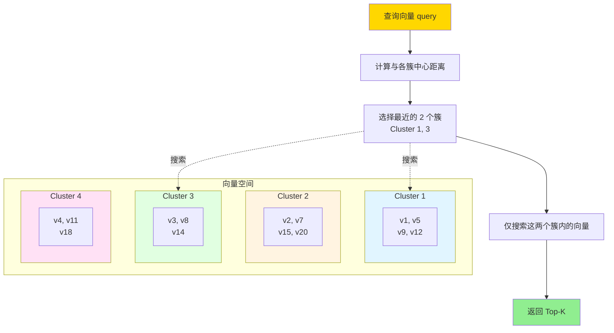
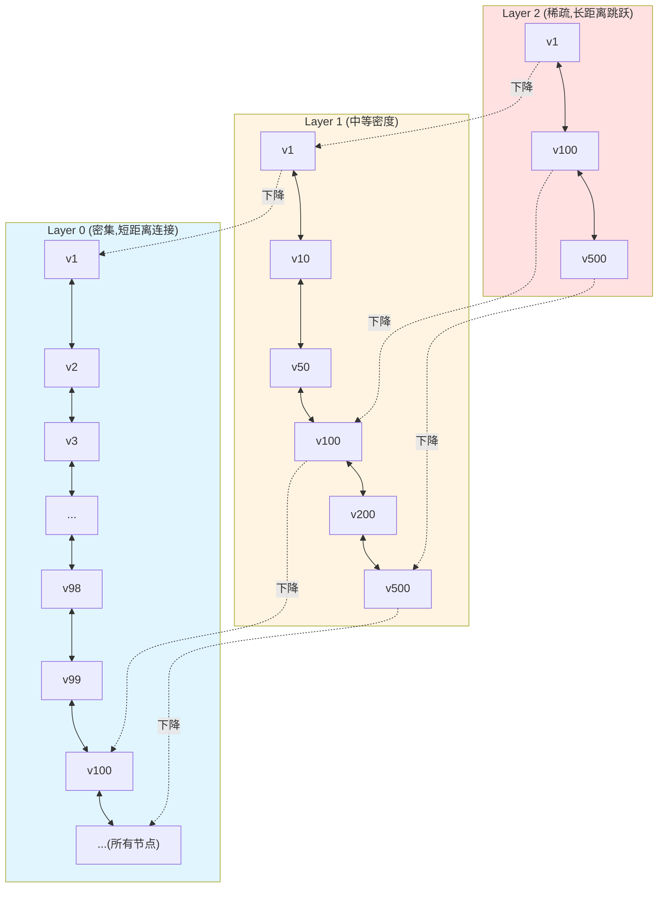
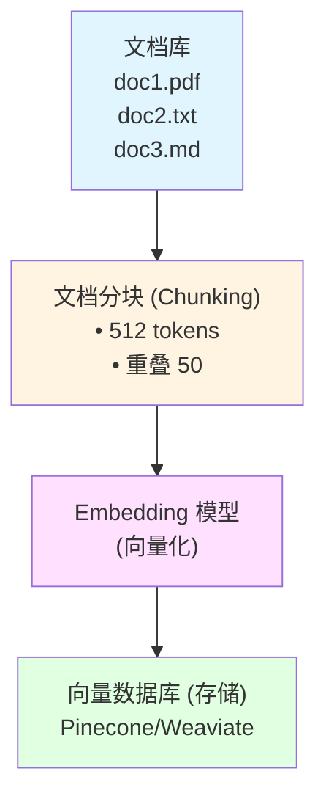
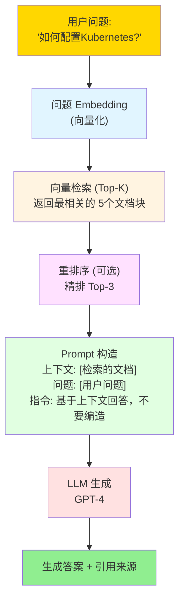
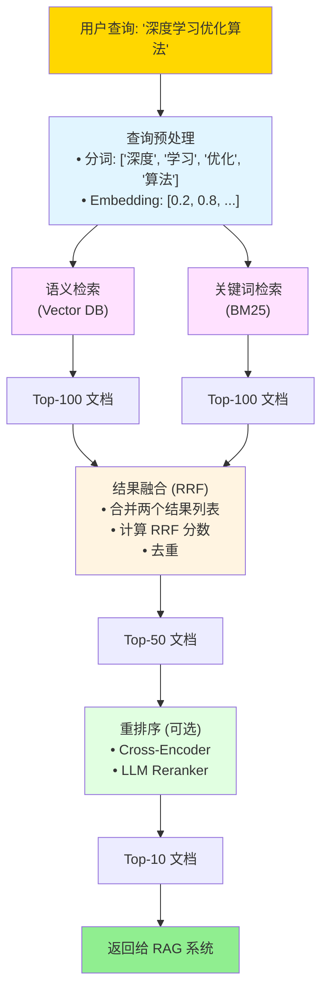
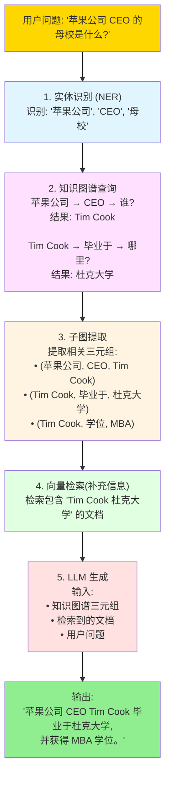
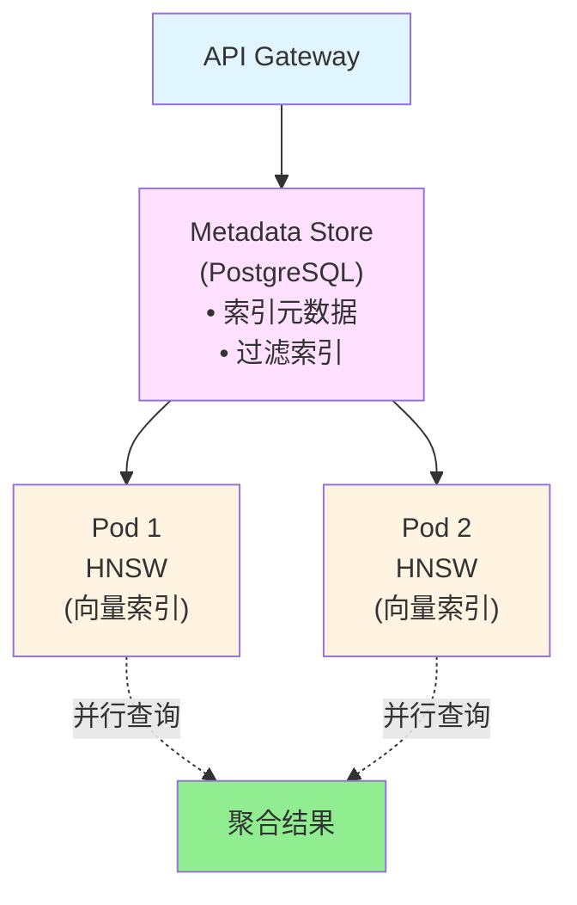

# 向量数据库与RAG深度理论知识

> **学习深度**: ⭐⭐⭐⭐
> **文档类型**: 纯理论知识（无代码实践）
> **权威参考**: Pinecone、Weaviate、Meta FAISS、RAG Survey

---

## 目录

1. [向量数据库基础理论](#向量数据库基础理论)
2. [向量检索算法](#向量检索算法)
3. [Embedding 技术](#embedding-技术)
4. [RAG 架构与原理](#rag-架构与原理)
5. [混合检索技术](#混合检索技术)
6. [知识图谱集成](#知识图谱集成)
7. [向量数据库架构设计](#向量数据库架构设计)

---

## 向量数据库基础理论

### 1.1 为什么需要向量数据库

#### 传统数据库的局限性

**传统关系数据库 (SQL)**:
```
查询模式: 精确匹配

示例:
SELECT * FROM products WHERE name = 'iPhone 15'

局限性:
• 无法理解语义相似性
• "iPhone 15" ≠ "苹果手机最新款"
• 无法处理模糊查询
• 无法跨模态检索（文本搜图片）
```

**传统全文搜索 (Elasticsearch)**:
```
查询模式: 关键词匹配 + TF-IDF

示例:
"机器学习算法" → 包含"机器"+"学习"+"算法"的文档

局限性:
• 基于词频，不理解语义
• "机器学习" 和 "深度学习" 无法关联
• 同义词、多语言支持弱
```

#### 向量数据库的革命性突破

**核心思想**: 将数据转为高维向量（Embedding），在向量空间中进行相似度搜索。

```
查询流程:

1. 传统数据库:
   用户查询 "苹果手机" → 精确匹配 → 仅返回包含"苹果手机"的结果

2. 向量数据库:
   用户查询 "苹果手机"
   → 转为向量 [0.2, 0.8, 0.1, ...] (1536维)
   → 计算与所有商品向量的相似度
   → 返回最相似的结果:
      • "iPhone 15 Pro Max" (相似度 0.95)
      • "Apple 手机最新款" (相似度 0.93)
      • "iOS 智能手机" (相似度 0.88)
```

**优势**:
- **语义理解**: 理解"iPhone" = "苹果手机"
- **跨语言**: "apple phone" 和 "苹果手机" 语义相近
- **跨模态**: 文本查询图片、图片查图片
- **模糊匹配**: 无需精确关键词

---

### 1.2 向量空间的数学基础

#### 向量表示

**定义**: 将对象映射到 n 维空间的点

```
文本示例:
"猫" → [0.2, 0.8, 0.1, 0.3, ...] (768维)
"狗" → [0.3, 0.7, 0.2, 0.4, ...]

图片示例:
cat.jpg → [0.1, 0.9, 0.05, ...] (2048维)
dog.jpg → [0.15, 0.85, 0.1, ...]
```

#### 相似度度量

**1. 欧几里得距离 (L2 Distance)**:
```
定义: d(a, b) = √(Σ(aᵢ - bᵢ)²)

几何含义: 两点间的直线距离

特点:
• 距离越小，越相似
• 受向量模长影响
• 适用: 位置敏感的场景
```

**2. 余弦相似度 (Cosine Similarity)**:
```
定义: cos(θ) = (a · b) / (||a|| × ||b||)

取值范围: [-1, 1]
• 1: 完全相同
• 0: 正交（无关）
• -1: 完全相反

特点:
• 只关注方向，不关注模长
• 归一化后等价于内积
• 适用: 文本、语义搜索（最常用）
```

**3. 内积 (Dot Product)**:
```
定义: a · b = Σ(aᵢ × bᵢ)

特点:
• 同时考虑方向和模长
• 计算最快
• 适用: 预先归一化的向量
```

**4. 曼哈顿距离 (L1 Distance)**:
```
定义: d(a, b) = Σ|aᵢ - bᵢ|

特点:
• 对异常值鲁棒
• 适用: 高维稀疏向量
```

#### 相似度度量对比

| 度量方式 | 计算复杂度 | 归一化敏感 | 典型应用 | 推荐指数 |
|---------|-----------|-----------|---------|---------|
| **余弦相似度** | O(n) | 不敏感 | 文本、语义搜索 | ⭐⭐⭐⭐⭐ |
| **欧几里得距离** | O(n) | 敏感 | 图像、聚类 | ⭐⭐⭐⭐ |
| **内积** | O(n) | 敏感 | 推荐系统 | ⭐⭐⭐⭐ |
| **曼哈顿距离** | O(n) | 敏感 | 稀疏向量 | ⭐⭐⭐ |

---

### 1.3 维度灾难 (Curse of Dimensionality)

#### 问题本质

**现象**: 高维空间中，所有点之间的距离趋于相等。

```
实验:
随机生成 1000 个点，计算最近邻和最远邻的距离比

维度    最近/最远距离比
2维     0.05  (区分度高)
10维    0.30
100维   0.80  (区分度低)
1000维  0.95  (几乎无法区分)
```

**数学解释**:
```
高维空间中，球体体积集中在表面附近

n 维单位球体积:
V_n = π^(n/2) / Γ(n/2 + 1)

当 n → ∞，几乎所有体积都在外壳 (1-ε) 到 1 之间
→ 所有点都在超球表面附近
→ 距离趋于相等
```

#### 解决方案

**1. 降维 (Dimensionality Reduction)**:
```
技术:
• PCA (主成分分析)
• t-SNE (可视化)
• UMAP (保持拓扑结构)

目标: 1536维 → 256维 (保留 95%+ 信息)
```

**2. 量化 (Quantization)**:
```
• Product Quantization (PQ): 向量分段，码本压缩
• Scalar Quantization (SQ): float32 → int8
```

**3. 近似搜索**:
```
放弃精确搜索，使用近似算法:
• HNSW (Hierarchical Navigable Small World)
• IVF (Inverted File Index)
• Annoy (Approximate Nearest Neighbors Oh Yeah)
```

---

## 向量检索算法

### 2.1 暴力搜索 (Brute Force)

#### 原理

```
算法:
1. 计算查询向量与所有向量的相似度
2. 排序
3. 返回 Top-K

伪代码:
for each vector in database:
    similarity = cosine_similarity(query, vector)
    results.add(vector, similarity)
return top_k(results)
```

**时间复杂度**: O(n × d)
- n: 数据库大小
- d: 向量维度

**优缺点**:

| 维度 | 评价 |
|-----|------|
| **精度** | 100% (精确搜索) |
| **速度** | 极慢（百万级数据不可用） |
| **内存** | 需加载所有向量 |
| **适用规模** | < 10,000 条 |

---

### 2.2 局部敏感哈希 (LSH - Locality Sensitive Hashing)

#### 核心思想

**目标**: 将相似向量哈希到同一个桶中。

```
传统哈希: 完全不同的输入 → 完全不同的哈希值
LSH:      相似的输入 → 相似的哈希值

原理:
1. 设计特殊哈希函数 h(x)
2. P(h(a) = h(b)) = similarity(a, b)
3. 只在同一桶内搜索
```

#### 随机投影 LSH

```
原理: 使用随机超平面划分空间

算法:
1. 生成随机向量 r₁, r₂, ..., rₖ
2. 计算哈希:
   h₁(v) = sign(v · r₁)  (1 或 -1)
   h₂(v) = sign(v · r₂)
   ...
3. 组合哈希: hash(v) = [h₁, h₂, ..., hₖ]

示例:
v₁ · r₁ = 0.5  → h₁ = 1
v₁ · r₂ = -0.2 → h₂ = -1
hash(v₁) = [1, -1, 1, -1] → 桶编号 "1011"
```

**性能**:
- **时间复杂度**: O(k × d) (k 个哈希函数)
- **召回率**: 70-90% (参数可调)
- **适用场景**: 海量数据初筛

**权衡**:
```
哈希函数数量 k:
• k 太小 → 假阳性高（不相似的也在同一桶）
• k 太大 → 假阴性高（相似的分到不同桶）

解决方案: 多表 LSH (Multi-probe LSH)
使用 L 个独立哈希表，提高召回率
```

---

### 2.3 倒排索引 (IVF - Inverted File Index)

#### 核心思想

**类比**: 图书馆分类法 - 先找类别，再在类别内精确搜索。

```
步骤:
1. 训练阶段: 将向量空间聚类为 n 个簇
2. 索引阶段: 每个向量分配到最近的簇
3. 查询阶段:
   a. 找到查询向量最近的 m 个簇 (m << n)
   b. 仅在这 m 个簇内暴力搜索
```

#### IVF 架构



#### IVF 变体

**IVF-Flat**:
- 簇内暴力搜索
- 精度高，速度中等

**IVF-PQ (Product Quantization)**:
- 簇内使用量化压缩
- 精度中等，速度快，内存小

**IVF-HNSW**:
- 簇查找使用 HNSW
- 精度高，速度最快

**性能分析**:

| 参数 | 影响 |
|-----|------|
| **簇数量 (nlist)** | 越多 → 查询越快，但召回率下降 |
| **探测簇数 (nprobe)** | 越多 → 召回率越高，但查询越慢 |

**推荐配置**:
```
数据量 100万:
  nlist = 1000 (√n 经验值)
  nprobe = 10-50

数据量 1亿:
  nlist = 10000
  nprobe = 100-200
```

---

### 2.4 HNSW (Hierarchical Navigable Small World)

#### 小世界网络理论

**六度分隔理论**: 任意两人通过平均 6 个人即可连接。

**小世界网络特性**:
1. **短路径**: 平均路径长度 ~ log(n)
2. **高聚类**: 朋友的朋友也是朋友

**HNSW 创新**: 将小世界网络应用于向量检索。

---

#### HNSW 多层图结构



**特点:**
- 上层: 少量节点，长距离边 → 快速定位区域
- 下层: 全部节点，短距离边 → 精确搜索

#### 搜索算法

```
查询流程:

1. 从最高层的入口点开始
2. 贪心搜索: 每次移动到最近的邻居
3. 到达当前层局部最优 → 下降到下一层
4. 重复直到 Layer 0
5. 在 Layer 0 做精细搜索

示例:
query = "苹果手机"

Layer 2: 入口 v1 → v100 (跳跃 99 步)
Layer 1: v100 → v105 → v120 (精细导航)
Layer 0: v120 → v121 → v122 (最终搜索)
返回: v122, v121, v119 (Top-3)
```

#### 构建算法

```
插入新向量 v:

1. 随机分配层数 l (指数分布)
   P(l) = e^(-l/ln(M))  (M=16 典型值)

2. 从顶层开始搜索，找到 v 的最近邻
3. 在 l 层及以下，建立双向边
4. 每层保留最多 M 个邻居 (M=16-32)
5. 使用启发式选择"多样性"的邻居
```

**邻居选择启发式**:
```
目标: 选择既近又多样的邻居

算法:
1. 候选集 C = 当前节点的所有潜在邻居
2. while |结果集| < M:
     选择 c ∈ C，最小化:
       distance(v, c) + α × max_{r ∈ 结果集} distance(c, r)
       ↑ 距离越近越好    ↑ 与已选邻居距离越远越好
3. 避免所有邻居都在一个方向
```

#### HNSW 性能分析

**时间复杂度**:
- 构建: O(n × log(n) × d)
- 查询: O(log(n) × d)

**空间复杂度**: O(n × M)

**性能对比** (100万向量，768维):

| 算法 | 查询速度 (QPS) | 召回率 | 内存 |
|-----|--------------|-------|------|
| **暴力搜索** | 10 | 100% | 3GB |
| **IVF** | 1000 | 95% | 3.5GB |
| **LSH** | 2000 | 85% | 1GB |
| **HNSW** | 5000 | 98% | 12GB |

**HNSW 特点**:
- ✅ 查询极快
- ✅ 召回率高（95-99%）
- ✅ 增量更新友好
- ❌ 内存占用大（需全部加载）
- ❌ 构建时间长

---

### 2.5 向量检索算法对比总结

| 算法 | 原理 | 时间复杂度 | 召回率 | 内存 | 适用场景 |
|-----|------|-----------|-------|------|---------|
| **暴力搜索** | 全量计算 | O(n×d) | 100% | 低 | < 1万数据 |
| **LSH** | 随机投影哈希 | O(k×d) | 70-90% | 低 | 海量数据粗排 |
| **IVF** | 聚类 + 倒排 | O(m×d) | 85-95% | 中 | 通用场景 |
| **HNSW** | 多层图导航 | O(log n×d) | 95-99% | 高 | 低延迟需求 |
| **PQ** | 向量量化 | O(n×d/c) | 80-90% | 极低 | 内存受限 |

**选型建议**:
```
数据量 < 1万:
  → 暴力搜索

数据量 1万-100万:
  → IVF (平衡性能和成本)

数据量 > 100万 + 低延迟:
  → HNSW

数据量 > 1亿 + 内存受限:
  → IVF-PQ

数据量 > 10亿:
  → 分片 + HNSW
```

---

## Embedding 技术

### 3.1 Embedding 的本质

#### 什么是 Embedding

**定义**: 将离散对象映射到连续向量空间的过程。

```
映射:
"猫" → [0.2, 0.8, 0.1, 0.3, ...] (768维)

目标:
语义相似的对象 → 向量空间中距离近

示例:
distance("猫", "狗") < distance("猫", "汽车")
```

**历史演进**:
```
时间线:
2003  →  2013   →   2017    →    2018     →    2022
Word2Vec  GloVe   Transformer   BERT       GPT-3     OpenAI Ada
(词向量) (全局统计) (注意力机制) (双向编码) (大规模) (专用Embedding)
```

---

### 3.2 Embedding 模型分类

#### 文本 Embedding

**Word Embedding (词向量)**:
```
模型: Word2Vec, GloVe
原理: 词的上下文决定词义

局限性:
• 一词多义无法区分
  "银行"(river bank) vs "银行"(financial bank)
• 无法处理 OOV (Out of Vocabulary)
```

**Sentence Embedding (句子向量)**:
```
模型: Sentence-BERT, Universal Sentence Encoder
原理: 编码整个句子的语义

优势:
• 上下文感知
• 长文本理解
```

**Document Embedding (文档向量)**:
```
模型: Doc2Vec, LDA
原理: 编码文档主题

适用: 长文档相似度、主题建模
```

#### 多模态 Embedding

**CLIP (Contrastive Language-Image Pretraining)**:
```
原理: 文本和图像映射到同一向量空间

能力:
• 文本查图片: "一只橘猫" → [图片]
• 图片查文本: [图片] → "orange cat"
• 零样本分类: 无需训练即可识别新类别

架构:
文本编码器 (Transformer) → 文本向量
图像编码器 (Vision Transformer) → 图像向量
对比学习: 最大化配对文本-图像的相似度
```

**其他多模态模型**:
- **ALIGN**: Google 的文本-图像模型
- **ImageBind**: Meta 的 6 模态统一模型（文本/图像/音频/视频/3D/IMU）
- **BEiT-3**: 微软的视觉-语言预训练

---

### 3.3 Embedding 模型选择

#### 关键维度

**1. 向量维度**:
```
维度越高 → 表达能力越强，但计算/存储成本越高

常见维度:
• 384: 轻量级（Sentence-BERT Mini）
• 768: 标准（BERT Base）
• 1536: 高性能（OpenAI Ada-002）
• 4096: 超大（GPT-4 Embedding）

经验法则:
• 简单任务（FAQ 匹配）: 384 维
• 通用任务（文档检索）: 768-1536 维
• 复杂任务（多语言、跨模态）: 1536+ 维
```

**2. 训练语料**:
```
通用模型 vs 领域模型:

通用模型 (OpenAI Ada-002):
  • 训练数据: 海量互联网文本
  • 优势: 广泛适用
  • 劣势: 专业领域表现一般

领域模型 (BioBERT, LegalBERT):
  • 训练数据: 特定领域语料
  • 优势: 领域任务表现优异
  • 劣势: 泛化能力弱

选择:
• 通用场景 → 通用模型
• 垂直领域（医疗/法律/金融）→ 领域模型
```

**3. 多语言支持**:
```
单语言 vs 多语言:

单语言 (BERT English):
  • 仅英语训练
  • 性能最佳

多语言 (mBERT, XLM-R):
  • 100+ 语言
  • 跨语言检索: 中文查询 → 英文文档
  • 性能略低于单语言

选择:
• 单一语言 → 单语言模型
• 跨语言需求 → 多语言模型
```

#### Embedding 模型对比

| 模型 | 维度 | 语言 | 场景 | 推荐指数 |
|-----|------|------|------|---------|
| **OpenAI Ada-002** | 1536 | 多语言 | 通用、高质量 | ⭐⭐⭐⭐⭐ |
| **Sentence-BERT** | 768 | 多语言 | 开源、通用 | ⭐⭐⭐⭐ |
| **Cohere Embed** | 4096 | 多语言 | 高性能、商业 | ⭐⭐⭐⭐ |
| **BGE (BAAI)** | 1024 | 多语言 | 中文优化 | ⭐⭐⭐⭐ |
| **MiniLM** | 384 | 英语 | 轻量、快速 | ⭐⭐⭐ |

---

### 3.4 Embedding 质量评估

#### 评估指标

**1. 检索准确率**:
```
Recall@K:
前 K 个结果中相关文档的比例

示例:
查询: "Python 编程入门"
前 10 个结果中，8 个相关 → Recall@10 = 0.8
```

**2. 平均倒数排名 (MRR - Mean Reciprocal Rank)**:
```
MRR = (1/|Q|) × Σ(1/rank_i)

示例:
查询 1: 第1个结果相关 → 1/1 = 1.0
查询 2: 第3个结果相关 → 1/3 = 0.33
查询 3: 第2个结果相关 → 1/2 = 0.5
MRR = (1.0 + 0.33 + 0.5) / 3 = 0.61
```

**3. NDCG (Normalized Discounted Cumulative Gain)**:
```
考虑排名位置的加权指标

DCG@K = Σ(rel_i / log₂(i+1))

优点: 排名越靠前权重越大
```

#### Benchmark 数据集

```
MTEB (Massive Text Embedding Benchmark):
• 56 个数据集
• 8 种任务类型
• 112 种语言

BEIR (Benchmark for Information Retrieval):
• 18 个异质数据集
• 测试泛化能力

MS MARCO:
• 微软搜索查询数据集
• 100 万查询，880 万文档
```

---

### 3.5 Embedding 微调 (Fine-tuning)

#### 为什么需要微调

```
通用模型问题:
查询: "如何治疗糖尿病？"
通用模型可能返回:
  ✗ "糖尿病的定义"
  ✗ "糖尿病统计数据"
而非:
  ✓ "糖�对病治疗方案"

原因: 通用模型未针对特定任务优化
```

#### 微调策略

**1. 对比学习 (Contrastive Learning)**:
```
目标: 拉近正样本，推远负样本

训练数据:
(查询, 正文档, 负文档₁, 负文档₂, ...)

损失函数:
L = -log(exp(sim(q, d+)) / Σexp(sim(q, d-)))

正样本: 人工标注或点击日志
负样本: 随机采样或难负例挖掘
```

**2. 三元组损失 (Triplet Loss)**:
```
训练数据:
(锚点 a, 正样本 p, 负样本 n)

目标:
distance(a, p) + margin < distance(a, n)

示例:
锚点: "Python 教程"
正样本: "Python 入门指南"
负样本: "Java 编程"
```

**3. 知识蒸馏**:
```
教师模型: 大型高性能模型 (GPT-4)
学生模型: 小型快速模型 (MiniLM)

训练: 学生模型学习教师模型的输出
好处: 保持性能，降低成本
```

---

## RAG 架构与原理

### 4.1 RAG 的诞生背景

#### LLM 的局限性

**问题 1: 知识截止日期**
```
GPT-4 训练数据截止 2023年4月

用户: "2024年美国大选结果是什么？"
LLM: "我不知道，我的知识截止到 2023年4月"
```

**问题 2: 幻觉 (Hallucination)**
```
用户: "我们公司2023年Q4营收是多少？"
LLM: "根据我的了解，贵公司 Q4 营收为 500 万美元"
           ↑ 完全编造的数字

原因: LLM 倾向于生成"听起来合理"的内容
```

**问题 3: 无法访问私有数据**
```
企业内部文档、数据库、API → LLM 无法访问
```

#### RAG 解决方案

**RAG (Retrieval-Augmented Generation)** = 检索增强生成

**核心思想**: 先检索相关文档，再基于文档生成回答。

```
传统 LLM:
用户问题 → LLM → 直接生成答案 (可能错误)

RAG:
用户问题 → 检索相关文档 → 将文档作为上下文 → LLM → 答案

优势:
✓ 知识实时更新（检索最新文档）
✓ 减少幻觉（基于真实文档）
✓ 可访问私有数据
✓ 可追溯来源（引用文档）
```

---

### 4.2 RAG 基础架构

**RAG 完整流程:**

#### 1. 离线索引阶段 (Indexing)



#### 2. 在线查询阶段 (Query)



---

### 4.3 文档分块策略 (Chunking)

#### 为什么需要分块

```
问题:
• 整个文档 Embedding → 信息密度低，检索不精确
• LLM 上下文窗口有限（GPT-4: 128K tokens）

解决方案: 将长文档切分为小块
```

#### 分块方法

**1. 固定大小分块 (Fixed-size Chunking)**:
```
参数:
• chunk_size: 512 tokens
• overlap: 50 tokens (避免关键信息被截断)

示例:
文档: "...ABCDEFGHIJK..."
Chunk 1: "ABCDEF" (token 0-512)
Chunk 2: "EFGHIJ" (token 462-974, 重叠 50)
Chunk 3: "IJK..."

优点: 简单、可控
缺点: 可能切断语义
```

**2. 语义分块 (Semantic Chunking)**:
```
原理: 根据语义边界切分

方法:
• 句子边界: 以句号、问号、感叹号为界
• 段落边界: 以换行符为界
• 章节边界: 根据标题层级

优点: 保持语义完整性
缺点: 块大小不均匀
```

**3. 滑动窗口 (Sliding Window)**:
```
方法: 固定大小 + 固定步长

参数:
• window_size: 512 tokens
• stride: 256 tokens (50% 重叠)

优点: 信息覆盖全面
缺点: 存储量大（2倍）
```

**4. 层次分块 (Hierarchical Chunking)**:
```
结构:
文档 → 章节 → 段落 → 句子

索引策略:
• 粗粒度块（章节）: 用于初筛
• 细粒度块（段落）: 用于精确匹配

查询: 先匹配章节，再匹配段落
```

#### 分块大小选择

| Chunk Size | 优势 | 劣势 | 适用场景 |
|-----------|------|------|---------|
| **128 tokens** | 精确匹配 | 上下文不足 | FAQ、短问答 |
| **512 tokens** | 平衡 | 通用 | 大多数场景 |
| **1024 tokens** | 上下文丰富 | 检索不精确 | 长文档理解 |
| **2048+ tokens** | 最大上下文 | 噪声大 | 书籍、报告 |

---

### 4.4 RAG 提示工程 (Prompt Engineering)

#### 基础 Prompt 模板

```
系统提示:
"你是一个问答助手。请根据以下上下文回答用户问题。
如果上下文中没有相关信息，请明确说明'根据提供的信息无法回答'。
不要编造信息。"

上下文:
[检索到的文档 1]
[检索到的文档 2]
[检索到的文档 3]

用户问题:
{user_query}

请回答:
```

#### 高级 Prompt 技巧

**1. 引用要求**:
```
指令: "请在回答中标注信息来源，格式为 [1], [2]"

示例回答:
"Kubernetes 通过控制平面管理容器化应用 [1]。
主要组件包括 API Server、Scheduler 和 Controller Manager [2]。"

参考文献:
[1] 文档: kubernetes-overview.pdf, 第3页
[2] 文档: k8s-architecture.md, 第12行
```

**2. 答案结构化**:
```
指令: "请按以下格式回答：
1. 简短总结（1-2句话）
2. 详细说明
3. 相关链接或参考"

好处: 答案更易读、可操作
```

**3. 思维链 (Chain-of-Thought)**:
```
指令: "请先分析上下文，再给出答案。格式为：
分析: [推理过程]
答案: [最终答案]"

示例:
分析: 根据上下文，文档1提到X，文档2提到Y，综合判断...
答案: 基于以上分析，答案是Z。
```

---

### 4.5 RAG 性能优化

#### 检索优化

**1. 查询改写 (Query Rewriting)**:
```
问题: 用户查询往往不完整或不准确

示例:
原始查询: "k8s 配置"
改写后: "Kubernetes 集群配置方法 YAML 文件"

方法:
• LLM 扩展: 用 LLM 生成更详细的查询
• 同义词扩展: "k8s" → "Kubernetes"
• 查询分解: 复杂问题 → 多个子问题
```

**2. 假设性文档嵌入 (HyDE - Hypothetical Document Embeddings)**:
```
原理: 让 LLM 先生成"假设的答案文档"，再检索

流程:
1. 用户问题: "如何优化数据库查询？"
2. LLM 生成假设答案:
   "优化数据库查询可以通过索引、查询重写、缓存..."
3. 将假设答案向量化并检索
4. 检索到的真实文档往往更相关

原因: 文档-文档相似度 > 问题-文档相似度
```

**3. 多查询融合 (Multi-Query Fusion)**:
```
方法: 生成多个相关查询，合并结果

示例:
原始: "Python 异步编程"
生成:
  • "Python asyncio 库使用方法"
  • "Python 协程和事件循环"
  • "Python async/await 语法"

检索: 每个查询 Top-5，合并后去重 → Top-10
好处: 提高召回率
```

#### 重排序 (Re-ranking)

```
问题: 向量检索基于语义相似度，可能不符合业务需求

解决方案: 两阶段检索

阶段 1: 向量检索 (粗排)
  → 快速召回 Top-100

阶段 2: 重排序 (精排)
  → 使用更复杂的模型 → Top-10

重排序模型:
• Cross-Encoder: BERT 式模型，将查询和文档拼接
• LLM-based Reranker: 用 LLM 评分
• 规则 based: 关键词匹配、新鲜度、权威性
```

**重排序因子**:
```
1. 语义相关性 (Embedding 相似度)
2. 关键词匹配 (BM25 分数)
3. 文档新鲜度 (发布时间)
4. 文档权威性 (来源、引用次数)
5. 用户反馈 (点击率、停留时间)

最终得分 = 加权组合
```

---

### 4.6 RAG 评估指标

#### 检索质量指标

**1. 上下文精确率 (Context Precision)**:
```
定义: 检索到的文档中，相关文档的比例

计算:
Context Precision = 相关文档数 / 检索到的总文档数

示例:
检索 10 个文档，7 个相关 → 0.7
```

**2. 上下文召回率 (Context Recall)**:
```
定义: 所有相关文档中，被检索到的比例

计算:
Context Recall = 检索到的相关文档数 / 所有相关文档数

示例:
共 20 个相关文档，检索到 15 个 → 0.75
```

#### 生成质量指标

**3. 答案相关性 (Answer Relevance)**:
```
定义: 生成的答案是否回答了用户问题

评估方法:
• 人工标注
• LLM 评分: 让 GPT-4 评估答案质量
```

**4. 忠实度 (Faithfulness)**:
```
定义: 答案是否忠实于上下文，没有幻觉

评估:
• 统计答案中的陈述
• 检查每个陈述是否能在上下文中找到依据

示例:
答案: "Kubernetes 使用 Docker 运行容器"
上下文: "Kubernetes 支持多种容器运行时"
→ 忠实度低（上下文未提及 Docker）
```

**5. 答案正确性 (Answer Correctness)**:
```
定义: 答案在事实层面是否正确

评估: 与标准答案对比（需要黄金标准）
```

#### RAG 综合评估框架

```
RAGAS (Retrieval-Augmented Generation Assessment):

指标:
1. Context Precision (上下文精确率)
2. Context Recall (上下文召回率)
3. Faithfulness (忠实度)
4. Answer Relevancy (答案相关性)

最终得分 = 调和平均数
```

---

## 混合检索技术 (Hybrid Search)

### 5.1 混合检索的必要性

#### 语义检索的局限

```
场景 1: 精确匹配需求
用户查询: "iPhone 15 Pro Max 512GB"
语义检索可能返回:
  • "iPhone 15 Pro 256GB" (语义相近，但容量不符)
  • "iPhone 14 Pro Max 512GB" (容量对，但型号不符)

问题: 语义相似 ≠ 符合需求
```

```
场景 2: 专业术语
用户查询: "TCP/IP 协议"
语义检索可能返回:
  • "网络通信协议" (泛化)
  • "互联网协议" (模糊)

期望: 精确匹配 "TCP/IP"
```

#### 关键词检索的局限

```
场景: 同义词/改写
用户查询: "机器学习算法"
关键词检索:
  • 仅匹配包含"机器学习算法"的文档
  • 错过 "ML algorithms", "深度学习", "神经网络"

问题: 无法理解语义等价
```

#### 混合检索解决方案

**核心思想**: 结合语义检索和关键词检索的优势。

```
混合检索 = 语义检索 (Embedding) + 关键词检索 (BM25)
           ↓                        ↓
        理解语义                  精确匹配
        ↓                        ↓
        合并结果 (融合算法)
        ↓
      最终排序
```

---

### 5.2 BM25 算法原理

#### BM25 (Best Matching 25)

**定位**: TF-IDF 的改进版，文本检索的黄金标准。

**核心公式**:
```
BM25(q, d) = Σ IDF(qᵢ) × [TF(qᵢ,d) × (k₁+1)] / [TF(qᵢ,d) + k₁×(1 - b + b×|d|/avgdl)]

其中:
• q: 查询
• d: 文档
• TF(qᵢ,d): 词 qᵢ 在文档 d 中的词频
• IDF(qᵢ): 逆文档频率 = log((N - df(qᵢ) + 0.5) / (df(qᵢ) + 0.5))
• |d|: 文档长度
• avgdl: 平均文档长度
• k₁, b: 调节参数 (典型值: k₁=1.5, b=0.75)
```

**关键改进**:
1. **饱和函数**: 词频增加的边际收益递减
   - TF=1 vs TF=2: 显著差异
   - TF=100 vs TF=101: 几乎无差异

2. **长度归一化**: 惩罚过长文档
   - 避免长文档因包含更多词而得分虚高

---

### 5.3 混合检索融合算法

#### 1. 倒数排名融合 (RRF - Reciprocal Rank Fusion)

```
原理: 将排名转为分数，而非直接使用相似度分数

公式:
RRF(d) = Σ [1 / (k + rank_s(d))]

其中:
• rank_s(d): 文档 d 在检索系统 s 中的排名
• k: 常数 (典型值 60)

示例:
文档 A:
  • 语义检索排名: 1 → 分数 1/(60+1) = 0.0164
  • BM25 排名: 5 → 分数 1/(60+5) = 0.0154
  • RRF 总分: 0.0318

文档 B:
  • 语义检索排名: 3 → 0.0159
  • BM25 排名: 2 → 0.0161
  • RRF 总分: 0.0320

结果: B > A (尽管 A 在语义检索中排名更高)
```

**优点**:
- 无需归一化不同检索系统的分数
- 对排名靠前的文档更敏感
- 简单有效

#### 2. 加权融合 (Weighted Fusion)

```
公式:
Score(d) = α × Score_semantic(d) + (1-α) × Score_keyword(d)

其中:
• α: 权重因子 (0 到 1)
• Score 需要归一化到相同范围

α 选择:
• α = 0.7: 偏重语义（通用场景）
• α = 0.5: 平衡
• α = 0.3: 偏重关键词（专业术语场景）
```

#### 3. 分布式融合 (Distribution-based Fusion)

```
原理: 将两个检索结果的分数归一化到标准分布

步骤:
1. 计算语义分数的均值 μ₁ 和标准差 σ₁
2. 计算关键词分数的均值 μ₂ 和标准差 σ₂
3. 归一化:
   z₁ = (score₁ - μ₁) / σ₁
   z₂ = (score₂ - μ₂) / σ₂
4. 融合: z_final = (z₁ + z₂) / 2

优点: 消除不同检索系统的分数差异
```

---

### 5.4 混合检索架构

**混合检索完整架构:**



---

### 5.5 混合检索性能对比

| 检索方式 | 精确匹配 | 语义理解 | 召回率 | 精确率 | 推荐场景 |
|---------|---------|---------|-------|-------|---------|
| **纯语义** | 弱 | 强 | 高 | 中 | 通用对话 |
| **纯关键词** | 强 | 弱 | 中 | 高 | 专业文档 |
| **混合检索** | 强 | 强 | 最高 | 高 | 生产推荐 |

**实验数据** (BEIR Benchmark):
```
任务: 跨领域文档检索

纯语义 (DPR):      NDCG@10 = 0.452
纯关键词 (BM25):   NDCG@10 = 0.438
混合检索 (RRF):    NDCG@10 = 0.521 ← 提升 15%+
```

---

## 知识图谱集成

### 6.1 知识图谱基础

#### 什么是知识图谱

**定义**: 以图结构存储实体及其关系的知识库。

```
图结构:
    (人物)          (关系)        (人物)
     Alice ─────── 是朋友 ─────── Bob
       │                           │
       │ 工作于                    │ 毕业于
       ↓                           ↓
    Google                      MIT
    (公司)                      (大学)

三元组表示:
• (Alice, 是朋友, Bob)
• (Alice, 工作于, Google)
• (Bob, 毕业于, MIT)
```

#### 知识图谱 vs 向量数据库

| 维度 | 知识图谱 | 向量数据库 |
|-----|---------|-----------|
| **表示方式** | 符号（实体+关系） | 向量（连续空间） |
| **查询方式** | 图遍历、SPARQL | 相似度搜索 |
| **优势** | 可解释、推理能力 | 语义相似、跨模态 |
| **劣势** | 覆盖不全、构建成本高 | 黑盒、无推理 |
| **适用场景** | 结构化知识 | 非结构化文本 |

---

### 6.2 知识图谱增强 RAG

#### 为什么需要知识图谱

```
场景: 多跳推理

用户问题: "Alice 的同事毕业于哪所大学？"

纯向量检索:
  → 找到包含 "Alice" 和 "大学" 的文档
  → 无法推理 "Alice → 同事 → 大学" 的多跳关系

知识图谱:
  → Alice → 同事 → Bob → 毕业于 → MIT
  → 答案: MIT
```

#### KG-RAG 架构

**知识图谱增强 RAG (KG-RAG):**



---

### 6.3 GraphRAG (Microsoft 研究)

#### 核心创新

**传统 RAG 问题**: 难以回答需要全局理解的问题。

```
问题: "这个数据集的主要主题是什么？"

传统 RAG:
  → 检索到几个局部文档
  → 无法概括全局

GraphRAG:
  → 从整个文档集构建知识图谱
  → 识别社区/主题
  → 全局总结
```

#### GraphRAG 架构

```
1. 知识图谱构建:

文档集
  ↓
LLM 提取实体和关系
  ↓
构建全局图谱
  ↓
社区检测 (Leiden 算法)
  ↓
为每个社区生成总结

示例社区:
Community 1: 机器学习 (10 个实体, 25 条关系)
  总结: "讨论深度学习、神经网络、训练算法..."

Community 2: 数据工程 (8 个实体, 15 条关系)
  总结: "涉及数据管道、ETL、数据仓库..."

2. 查询阶段:

用户问题: "主要讨论什么？"
  ↓
检索相关社区总结
  ↓
LLM 综合总结
  ↓
答案: "数据集主要讨论机器学习和数据工程两大主题..."
```

#### GraphRAG vs 传统 RAG

| 维度 | 传统 RAG | GraphRAG |
|-----|---------|---------|
| **问题类型** | 局部、具体问题 | 全局、抽象问题 |
| **检索粒度** | 文档块 | 社区/主题 |
| **推理能力** | 单跳 | 多跳、结构化 |
| **成本** | 低 | 高（需构建图谱） |
| **适用场景** | FAQ、文档问答 | 复杂分析、总结 |

---

### 6.4 知识图谱嵌入 (Knowledge Graph Embedding)

#### 目标

将知识图谱的实体和关系映射到向量空间，同时保留图结构。

```
三元组: (Alice, 朋友, Bob)
→
向量表示:
  E(Alice) = [0.2, 0.8, ...]
  E(Bob) = [0.3, 0.7, ...]
  R(朋友) = [0.1, 0.9, ...]

约束:
  E(Alice) + R(朋友) ≈ E(Bob)
```

#### 经典模型

**1. TransE (Translational Embedding)**:
```
假设: h + r ≈ t
其中:
  h: 头实体向量
  r: 关系向量
  t: 尾实体向量

损失函数:
  L = ||h + r - t||²

示例:
(Alice, 朋友, Bob)
→ E(Alice) + R(朋友) ≈ E(Bob)

优点: 简单、有效
缺点: 无法处理复杂关系（1-N, N-N）
```

**2. RotatE (Rotational Embedding)**:
```
假设: t = h ◦ r
其中:
  ◦ 表示复数乘法（旋转）

关系建模为旋转:
  r = e^(iθ)  (复平面上的旋转)

优点: 可处理对称/反对称/组合关系
```

**3. ComplEx (Complex Embeddings)**:
```
使用复数向量表示实体

评分函数:
  φ(h,r,t) = Re(⟨h, r, conj(t)⟩)

优点: 表达能力强
```

#### 应用: 混合检索

```
向量数据库 + 知识图谱嵌入:

1. 文本 Embedding: "苹果公司"
   → 语义向量 [0.2, 0.8, ...]

2. 实体 Embedding: Apple_Inc
   → 图谱向量 [0.25, 0.75, ...]

3. 混合检索:
   • 语义相似: "苹果公司" ≈ "Apple", "AAPL"
   • 图谱相似: Apple_Inc ≈ Microsoft, Google (同类实体)

4. 融合结果 → 更全面的检索
```

---

## 向量数据库架构设计

### 7.1 向量数据库技术栈对比

| 数据库 | 索引算法 | 分布式 | 过滤能力 | 特点 | 推荐场景 |
|-------|---------|-------|---------|------|---------|
| **Pinecone** | 专有算法 | 是 | 强 | 托管、易用 | 生产首选 |
| **Weaviate** | HNSW | 是 | 强 | 开源、混合检索 | 自建推荐 |
| **Milvus** | HNSW/IVF | 是 | 中 | 高性能、云原生 | 大规模部署 |
| **Qdrant** | HNSW | 是 | 强 | Rust、高效 | 性能敏感 |
| **Chroma** | HNSW | 否 | 弱 | 轻量、嵌入式 | 原型开发 |
| **FAISS** | 多种 | 否 | 无 | Meta、库 | 研究、本地 |

---

### 7.2 分布式架构模式

#### 1. 分片 (Sharding)

```
原理: 将向量数据水平分片到多个节点

策略:
• 哈希分片: hash(id) % N
• 范围分片: 按 ID 范围
• 一致性哈希: 动态扩缩容

示例:
100万向量, 10 个节点
→ 每个节点 10万向量

查询:
→ 并行查询所有节点
→ 聚合 Top-K
```

#### 2. 复制 (Replication)

```
目的: 高可用 + 读扩展

架构:
Primary (主节点): 处理写入
Replicas (副本): 处理读取

写流程:
Write → Primary → 异步复制 → Replicas

读流程:
Read → 负载均衡 → 任一 Replica
```

#### 3. 混合架构

**Pinecone 架构 (推测):**



**查询流程:**
1. API Gateway → Metadata Store (过滤)
2. 确定相关 Pods
3. 并行查询 Pods
4. 聚合结果

---

### 7.3 过滤与元数据

#### 问题: 向量检索 + 业务过滤

```
场景: 电商搜索

需求:
"找相似商品，但必须是:
  • 价格 < $100
  • 品牌 = Nike
  • 库存 > 0"

挑战: 向量索引不支持复杂过滤
```

#### 解决方案

**1. 预过滤 (Pre-filtering)**:
```
流程:
1. 先用元数据过滤: price < 100 AND brand = 'Nike'
   → 候选集: 10万个商品
2. 在候选集中向量检索
   → Top-10

优点: 精确
缺点: 候选集过小时召回不足
```

**2. 后过滤 (Post-filtering)**:
```
流程:
1. 向量检索 Top-100
2. 应用过滤条件
   → 过滤后剩余 8 个
3. 如果不足，继续检索 Top-200

优点: 召回充分
缺点: 可能需要多次查询
```

**3. 混合索引 (Hybrid Indexing)**:
```
Weaviate 方案:
• 向量索引 (HNSW)
• 元数据倒排索引

查询:
同时利用两个索引 → 高效过滤
```

---

### 7.4 成本优化策略

#### 1. 维度降低

```
方法:
• PCA: 1536维 → 512维
• Matryoshka Embedding: 渐进式维度（可裁剪）

权衡:
维度 | 存储 | 查询速度 | 精度损失
-----|------|----------|----------
1536 | 1x   | 1x       | 0%
768  | 0.5x | 2x       | 1-2%
384  | 0.25x| 4x       | 3-5%
```

#### 2. 量化 (Quantization)

```
类型:
• Scalar Quantization: float32 → int8
  → 4x 压缩
• Product Quantization: 分段编码
  → 8-16x 压缩

精度损失: 2-5% (可接受)
成本节省: 75%+
```

#### 3. 分层存储

```
热数据 (< 7天):
  • SSD + 全精度
  • 低延迟 (<10ms)

温数据 (8-90天):
  • HDD + 量化
  • 中延迟 (50ms)

冷数据 (> 90天):
  • 对象存储 + 高压缩
  • 按需加载 (秒级)
```

---

## 附录: 最佳实践总结

### 向量数据库选型决策树

```
开始
  ↓
数据量 < 10万?
  ├─ 是 → Chroma / FAISS (嵌入式)
  └─ 否 ↓
需要托管服务?
  ├─ 是 → Pinecone (商业) / Zilliz Cloud (开源托管)
  └─ 否 ↓
需要混合检索?
  ├─ 是 → Weaviate (开源最佳)
  └─ 否 ↓
追求极致性能?
  ├─ 是 → Qdrant (Rust 实现)
  └─ 否 → Milvus (社区活跃)
```

### RAG 优化 Checklist

```
✅ 文档预处理:
  □ 分块大小: 512 tokens
  □ 重叠: 50 tokens
  □ 移除噪声 (页眉、页脚)

✅ Embedding 选择:
  □ 维度: 768-1536
  □ 领域适配性
  □ 多语言支持

✅ 检索优化:
  □ 混合检索 (Embedding + BM25)
  □ 查询改写
  □ 重排序

✅ Prompt 工程:
  □ 引用要求
  □ 结构化输出
  □ 防止幻觉

✅ 评估:
  □ Context Precision > 0.8
  □ Faithfulness > 0.9
  □ Answer Relevancy > 0.85
```

---

## 权威资源索引

### 学习资源
- **Pinecone 学习中心**
  https://www.pinecone.io/learn/

- **Weaviate 文档**
  https://weaviate.io/developers/weaviate

- **RAG Survey (GitHub)**
  https://github.com/hymie122/RAG-Survey

### 论文
- **RAG 原始论文** (Facebook AI, 2020)
  "Retrieval-Augmented Generation for Knowledge-Intensive NLP Tasks"

- **HNSW 论文** (Malkov & Yashunin, 2018)
  "Efficient and robust approximate nearest neighbor search using Hierarchical Navigable Small World graphs"

- **GraphRAG** (Microsoft, 2024)
  "From Local to Global: A Graph RAG Approach"

### 工具与框架
- **LangChain**: RAG 应用框架
  https://python.langchain.com/

- **LlamaIndex**: 数据框架for LLM
  https://www.llamaindex.ai/

- **FAISS**: Meta 向量检索库
  https://github.com/facebookresearch/faiss

---

**文档版本**: v1.0
**最后更新**: 2025-01-21
**适用深度**: ⭐⭐⭐⭐ (高级理论知识)
