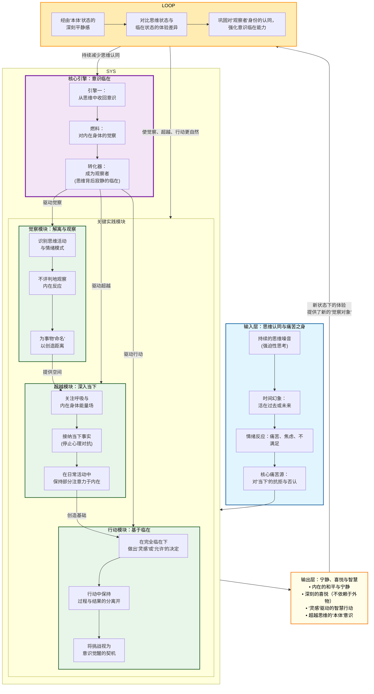

# 【人生好书】《当下的力量》知识体系全解析

> "时间不是宝贵的，因为它是一种幻象。你认为宝贵的不是时间，而是那个不在时间之内的单独的一点：当下。" —— 埃克哈特·托利

---

## 第一部分：核心系统架构图

---
## 第二部分：TOP 15 核心观点

1. **你不是你的思维**：思维只是一个工具，而思维背后那个"观察者"或"意识"才是你更本质的身份。

2. **痛苦源于对当下的抗拒**：所有的情绪痛苦，如焦虑、压力、愤怒，都源于思维对"本然如是"的当下时刻的心理评判和抗拒。

3. **时间是最大的幻象**：真正的现实只存在于当下这一刻。过去和未来是思维的概念，活在它们之中就是活在幻象里，会引发痛苦。

4. **开悟是超越思维的意识状态**：它不是获得什么，而是从对思维形式和内容的认同中解脱出来，认识到你作为"本体"或"意识"的存在。

5. **进入当下的方法是关注内在身体**：将注意力从思维转移到身体的内在能量场（内在身体），是进入当下最直接、最有效的大门。

6. **接纳是力量，而非软弱**：对当下现实（包括内在感受和外在情境）的完全接纳，会立刻将你从受害者心态中解放出来，并开启真正的改变。

7. **"心理时间"是痛苦的放大器**：当思维利用"过去"来定义身份、利用"未来"作为救赎时，就创造了心理时间，这是痛苦的核心结构。

8. **情绪是思维在身体上的反映**：强烈的、反复出现的负面情绪模式（痛苦之身）是固化了的思维能量，它会间歇性地"进食"（激活）以维持自身。

9. **"观察者"的临在能转化痛苦**：当你以纯粹的、不评判的"观察者"身份去觉知情绪或思维时，它们的能量就会被意识转化和消融。

10. **停止为"快乐"寻求心理标签**：思维会为"快乐"贴上原因（比如"因为某事我才快乐"），这反而将你与当下的喜悦分离。喜悦就在当下，无需理由。

11. **外显的失败可能蕴含内在的胜利**：当你在外在层面"失败"时，如果能完全接纳并保持意识临在，这本身就是一次深刻的内在觉醒和胜利。

12. **人际关系是意识的试金石**：与他人的互动，尤其是冲突，是检验和练习临在、接纳和观察的最佳机会。

13. **行动分为两种：基于临在的灵感与基于思维的反映**：前者高效、充满创造力；后者充满挣扎、源于恐惧或欲望。

14. **"等待"也可以成为当下的状态**：如果你能把等待的"未来导向"转化为对当下环境、呼吸、身体的纯粹觉知，等待就不再是一种煎熬。

15. **真正的爱超越情感与占有**：爱是"本体"的一种状态，当思维和痛苦之身平静时，爱会自然流露，它不依赖于特定对象。

---
## 第三部分：详细知识体系

### 1. 核心理念基础（世界观与前提假设）

**时间的本质**

唯一真实存在的是永恒的"当下"。过去是储存的记忆，未来是投射的想象，二者都是思维在当前时刻的活动。

**自我的结构**

人类普遍的"自我感"由两部分构成：
- 表层"小我"：由思维、情绪、记忆、角色定义构成
- 深层"本体"：思维无法触及的、更深层的"意识"

**痛苦的根源**

"小我"的生存依赖于思维和时间，它通过否定当下、制造问题与冲突来强化自己的存在感，这是所有痛苦的终极来源。

**开悟的路径**

解脱之路不在于改变思维内容，而在于意识维度的转变：将自我认同从"思维"转移到"观察思维的意识"。

---

### 2. 核心方法/原则层

#### 方法一：观察思维——成为"思维的观察者"

**核心定义**

在日常生活中，刻意地倾听自己脑中的声音，并意识到有一个独立于这些声音的"你"在倾听。这个"你"就是观察者。

**为何重要**

这是打破"思维认同"的第一步。通过观察，你创造了思维和意识之间的空间，从而不再被思维无意识地裹挟。

**关键步骤/要素**

1. 有意识地在思维流中按下"暂停键"
2. 倾听脑中的声音（评论、回忆、计划），不做评判，不参与辩论
3. 在命名思维模式时使用"我注意到我有一个想法……"的句式
4. 将注意力从思维内容转移到"正在觉知"这个感觉本身

**常见误区/障碍**

- **误区一**：试图停止所有思考。目标不是消灭思维，而是与它解离。
- **误区二**：观察变成分析。分析仍是思维活动。观察是纯粹的注意。
- **障碍**：初期，思维的噪音可能会因为被关注而暂时变得更响，这是正常过程。

**实践案例/比喻**

将思维想象成广播电台，而你是有选择收听权的听众。大部分时间你无意识地认同了广播内容，而现在，你只是坐在那里，听着它播放，知道"我不是那个广播"。

---

#### 方法二：超越思维——深入"内在身体"

**核心定义**

将注意力从头脑的思考，完全沉入到对身体内部的生命力或能量场的感知中。这是锚定于当下的最强大工具。

**为何重要**

内在身体是通往"本体"和当下时刻的直接门户。思维在身体觉知面前会安静下来。这也是瓦解"痛苦之身"（情绪积垢）的关键。

**关键步骤/要素**

1. 闭上眼睛，将注意力依次扫描身体各部位，感知其存在
2. 聚焦于双手或双脚的细微能量感（麻、刺、脉动等）
3. 将整个身体作为一个单一的能量场来感受
4. 在日常生活中，保持一部分注意力在身体内部

**常见误区/障碍**

- **误区一**：用力过猛导致紧张。应是放松而专注的觉察。
- **误区二**：寻找某种特殊的"感觉"。任何细微的、甚至看似"无感"的觉知都是有效的起点。

**实践案例/比喻**

内在身体就像你脚下永恒稳固的大地，而思维是空中变幻莫测的云彩。当你感到被情绪或思绪风暴席卷时，将注意力"下沉"到脚下这片大地上，立刻就能获得稳定。

---
#### 方法三：完全接纳当下事实

**核心定义**

对此刻的实际情况——无论是外部情境还是内在情绪体验——说"是的"，放弃所有心理层面的抗拒和评判。

**为何重要**

抗拒是心理与现实的冲突，它消耗巨大能量并制造痛苦。接纳则终结了这场内在战争，让你与当下的力量结盟，从而能清醒、有创造力地行动。

**关键步骤/要素**

1. 承认现实："此刻的情况就是这样。"
2. 放下对"事情应该不同"的执着
3. 如果情绪升起，同样去接纳这份情绪的存在（如"我允许自己此刻感到愤怒"）
4. 区分"接纳"与"屈从"：接纳是内在姿态，不意味着外在不作为；它恰恰是为明智行动扫清心理障碍

**常见误区/障碍**

- **误区一**：认为接纳等于认同或喜欢
- **误区二**：认为在行动前必须先"感觉良好"。接纳发生在行动之前，它关注的是事实本身

**实践案例/比喻**

你被大雨困在路上。抗拒的心态是"真倒霉，雨快停！"，这带来烦躁。接纳的心态是"是的，现在在下雨"，然后平静地决定：是继续等待，还是享受雨中漫步，或寻找避雨处。接纳让你与真实的力量（当下）共处。

---

#### 方法四：在行动中保持"过程"与"结果"的分离

**核心定义**

将全部注意力投入行动的当下过程，同时将最终结果完全交托给生命本身。即：临在地行动，臣服地等待。

**为何重要**

思维的"小我"执着于结果作为其身份认同的一部分（成功或失败）。这种执着会污染行动过程，产生焦虑、压力，并削弱效能。分离能让你专注、高效且平和。

**关键步骤/要素**

1. 设定清晰的目标（结果）
2. 将目标储存在思维中，然后将全部注意力投入到当前步骤
3. 接受所有可能的结果范围，在心理上对"失败"也保持开放
4. 从过程中寻找乐趣和意义，而不只是将其视为达到目的的手段

**常见误区/障碍**

- **误区一**：误解为"不设定目标"或"不努力"
- **误区二**：过程中不断用想象中的结果来评判当下的表现

**实践案例/比喻**

像一名弓箭手。他精心校准弓箭（设定目标），但在放箭的瞬间，他的注意力完全在姿势、呼吸和目标上（过程）。箭离弦后，结果（是否命中）已与他无关，他平静地接受。下一次，他仍会全力以赴。

---
### 3. 实践与整合应用层

#### 整合路线图

**第一阶段：认识与觉察（1-4周）**

每日多次练习"观察思维"和"感受内在身体"，每次1-2分钟。建立对"小我"运作模式的初步觉察。

**第二阶段：深度练习与转化（1-3个月）**

选择一天中的常规活动（如刷牙、上下班通勤、排队）作为"触发器"，在这些时刻练习完全临在。主动在情绪升起时实践"接纳"。

**第三阶段：生活整合（持续）**

将临在意识带入工作挑战、人际关系冲突等复杂场景。练习在行动中保持过程与结果的分离。将生活本身视为一个持续的冥想。

---

#### 自我诊断清单

- 我是否经常"活在脑海中"，为过去后悔或为未来担忧？
- 我的快乐是否总是依赖于未来的某个事件（如假期、成功）？
- 我是否容易对他人或环境产生强烈的情绪反应？
- 我是否发现自己在做一件事时，总想着另一件事？
- 我能否在无事可做时，内心依然感到宁静和满足？
- 我的行动是出于恐惧（怕失去）和欲望（想得到），还是出于当下的清晰与灵感？

---

#### 日常生活整合示例

**交通堵塞时**

停止心理抱怨，转而感受方向盘、座椅，观察呼吸，完全接纳"此刻我被堵在路上"的事实。

**与人争论时**

倾听对方说话的同时，保持一部分注意力在内在身体或呼吸上。这能防止你被自己的情绪反应完全控制，从而做出更有意识的回应。

**执行任务时**

专注于手头动作的每一个细节（如写邮件时感受键盘敲击，洗碗时感受水流），将任务本身作为修炼临在的道场。

---
## 第四部分：总结与迁移指南

### 1. 体系精要

《当下的力量》知识体系的精髓在于：通过将自我认同从永不满足的"思维"转移到永恒的"意识"，从而终结心理时间，全然地接纳并安住于当下这一刻，以此化解一切痛苦，生发出内在的宁静、喜悦与真正的创造力。

---

### 2. 应用起点

建议从最简单的"呼吸觉察"开始。每天数次，停下手中一切，只是专注地感受三到五次完整的呼吸（一吸一呼为一次）。在这个过程中，不做任何思考，只是纯粹地感觉空气的进出、腹部的起伏。

这个微小的动作，就是将自己从思维流中拉回当下、接触"本体"的最直接入口。

---

### 3. 迁移思考

#### 分析人际关系质量

我与他人的冲突，有多少是源于我对过去事件的耿耿于怀（心理时间），或对未来互动的恐惧（心理时间）？如果我完全立足于当下，只回应眼前这个人、这句话，冲突的模式是否会改变？

#### 评估工作状态

我是在"临在地行动"，还是在"挣扎地达成"？我对工作的焦虑和压力，是来自任务本身，还是来自我对失败后果的思维投射（心理时间）？

#### 审视个人目标与成长

我的学习或成长计划，是出于对"未来更好自我"的执着（小我强化），还是出于当下对某事纯粹的热爱和好奇（临在的灵感）？如何能将目标与当下过程更好地结合？

---

## 写在最后

《当下的力量》不是一本需要"读完"的书，而是一个需要"活出来"的实践。

当你真正开始观察思维、感受内在身体、接纳当下时，你会发现：

**痛苦不是来自生活本身，而是来自思维对生活的评判。**

**快乐不在未来的某个时刻，而在此刻的完全临在。**

**你不是你的思维，你是那个能够观察思维的意识。**

从现在开始，从下一次呼吸开始。
