# 数据存储架构深度理论知识

> **学习深度**: ⭐⭐⭐⭐
> **文档类型**: 纯理论知识（无代码实践）
> **权威参考**: PostgreSQL、Redis、MinIO、AWS、Martin Kleppmann

---

## 目录

1. [数据存储架构基础](#数据存储架构基础)
2. [多模数据库选型](#多模数据库选型)
3. [对象存储架构](#对象存储架构)
4. [缓存架构设计](#缓存架构设计)
5. [数据血缘与治理](#数据血缘与治理)
6. [存储架构综合设计](#存储架构综合设计)

---

## 数据存储架构基础

### 1.1 CAP 定理

#### 理论基础

**CAP 定理**: 分布式系统最多只能同时满足三个特性中的两个。

```
CAP 三要素:

C - Consistency (一致性):
  • 所有节点在同一时间看到相同的数据
  • 读操作返回最新写入的值

A - Availability (可用性):
  • 每个请求都能得到响应（成功或失败）
  • 系统持续可用，无停机

P - Partition Tolerance (分区容错性):
  • 网络分区时系统仍能继续运行
  • 节点间通信失败不影响系统整体
```

#### CAP 权衡

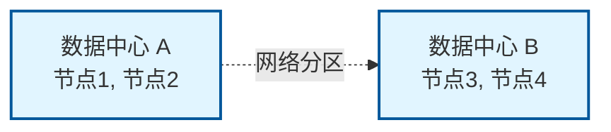

**选择1: CP (牺牲可用性)**:
- A侧写入 → 等待与B同步
- 同步失败 → 拒绝写入 (保证一致性)
- 结果: 一致性✓, 可用性✗

**选择2: AP (牺牲一致性)**:
- A侧写入 → 立即返回成功
- B侧继续独立运行
- 网络恢复后合并冲突
- 结果: 可用性✓, 一致性✗

**CAP 分类**:

| 类型 | 示例 | 特点 | 适用场景 |
|-----|------|------|---------|
| **CP** | HBase, MongoDB (默认), Redis Sentinel | 强一致性，可能阻塞 | 金融交易、库存管理 |
| **AP** | Cassandra, DynamoDB, Riak | 最终一致性，高可用 | 社交网络、日志系统 |
| **CA** | 单体数据库 (MySQL 单机) | 不考虑分区容错 | 非分布式场景 |

**现实世界的权衡**:
```
实际上不是二选一，而是一个连续光谱:

强一致性 ←──────────────────────────→ 最终一致性
 (CP倾向)                              (AP倾向)
    ↓                                      ↓
 牺牲性能                               牺牲一致性
 牺牲可用性                             获得高可用

可调一致性 (Tunable Consistency):
• Cassandra: 读写可指定一致性级别
  - ONE: 单节点响应 (快，弱一致性)
  - QUORUM: 多数节点 (平衡)
  - ALL: 所有节点 (慢，强一致性)
```

---

### 1.2 BASE 模型

**定义**: AP 系统的设计哲学，与 ACID 相对。

```
BASE:

BA - Basically Available (基本可用):
  • 系统大部分时间可用
  • 允许部分功能降级

S - Soft State (软状态):
  • 系统状态可能在一段时间内不一致
  • 不需要实时强一致

E - Eventually Consistent (最终一致性):
  • 经过一段时间后，数据最终会一致
  • 没有写入时，读取最终返回相同值

示例:
1. 用户A发布微博
2. 用户B立即查看可能看不到（软状态）
3. 几秒后传播到所有节点（最终一致）
```

---

### 1.3 一致性模型

```
一致性强度排序（从强到弱）:

1. 线性一致性 (Linearizability):
   • 最强保证
   • 操作瞬间完成且全局可见
   • 如同单机操作

2. 顺序一致性 (Sequential Consistency):
   • 所有进程看到相同的操作顺序
   • 但不保证实时性

3. 因果一致性 (Causal Consistency):
   • 有因果关系的操作按顺序
   • 无关操作可乱序

4. 最终一致性 (Eventual Consistency):
   • 最弱保证
   • 只保证最终收敛

示例:
线性一致性:
  写(x=1) → 读(x)必返回1 → 写(x=2) → 读(x)必返回2

最终一致性:
  写(x=1) → 读(x)可能返回旧值 → 等待 → 最终返回1
```

---

## 多模数据库选型

### 2.1 数据库分类

```mermaid
graph TB
    subgraph "关系型数据库 (RDBMS)"
        A["MySQL, PostgreSQL, Oracle<br/>• 表格结构,SQL查询<br/>• ACID事务"]
    end

    subgraph "文档数据库 (Document DB)"
        B["MongoDB, CouchDB<br/>• JSON/BSON 文档<br/>• 灵活 Schema"]
    end

    subgraph "键值数据库 (Key-Value DB)"
        C["Redis, DynamoDB, Riak<br/>• 简单 get/set<br/>• 极高性能"]
    end

    subgraph "列式数据库 (Columnar DB)"
        D["Cassandra, HBase, ClickHouse<br/>• 列存储,高压缩比<br/>• 分析查询优化"]
    end

    subgraph "图数据库 (Graph DB)"
        E["Neo4j, JanusGraph<br/>• 节点+边,关系查询<br/>• 社交网络、知识图谱"]
    end

    subgraph "时序数据库 (Time-Series DB)"
        F["InfluxDB, TimescaleDB, Prometheus<br/>• 时间戳数据<br/>• 监控、IoT"]
    end

    style A fill:#e3f2fd,stroke:#1976d2,stroke-width:2px
    style B fill:#f3e5f5,stroke:#7b1fa2,stroke-width:2px
    style C fill:#fff3e0,stroke:#f57c00,stroke-width:2px
    style D fill:#e8f5e9,stroke:#388e3c,stroke-width:2px
    style E fill:#fce4ec,stroke:#c2185b,stroke-width:2px
    style F fill:#e0f2f1,stroke:#00796b,stroke-width:2px
```

---

### 2.2 关系型数据库深度

#### PostgreSQL 架构

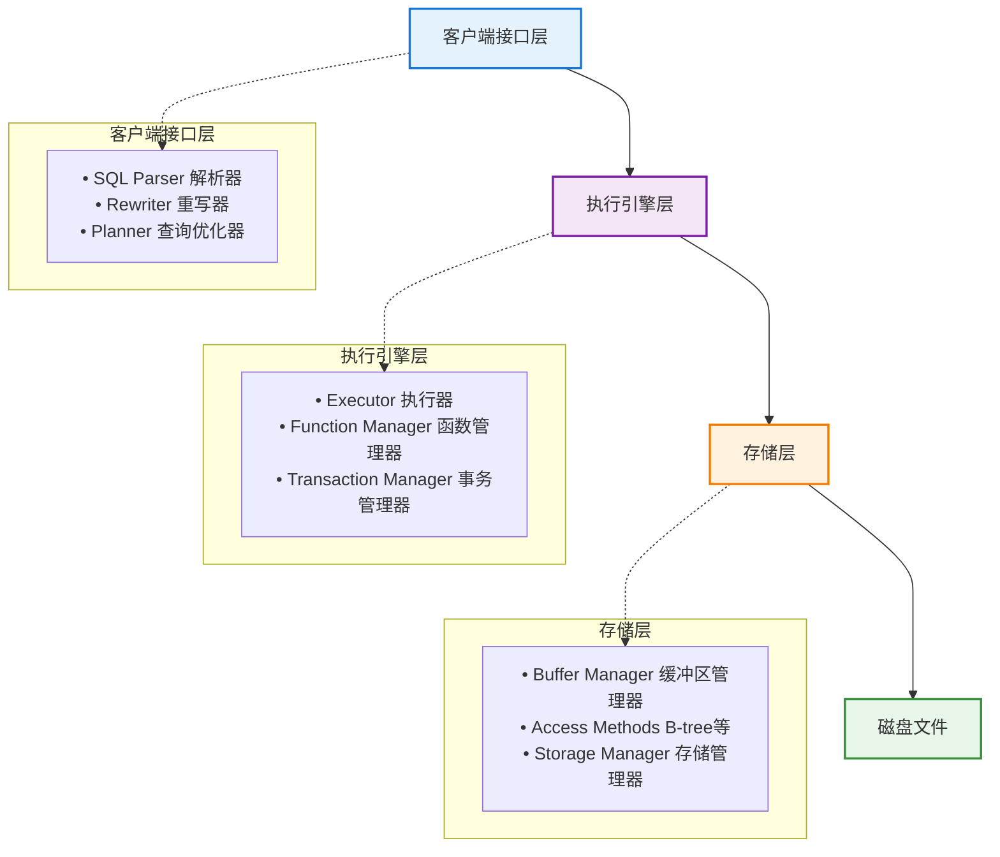

#### MVCC (多版本并发控制)

**核心思想**: 读不阻塞写，写不阻塞读。

```
原理:
• 每行数据保留多个版本
• 每个事务看到一致性快照
• 无需加读锁

示例:
初始: account_balance = 1000

时间线:
T1开始 (事务1读取)
  → 看到版本1: 1000
T2开始 (事务2写入: +100)
  → 创建版本2: 1100
  → T1仍看到版本1: 1000 (快照隔离)
T2提交
  → 版本2可见
T3开始 (事务3读取)
  → 看到版本2: 1100

数据结构:
┌─────────┬────────┬────────┬────────┐
│ 数据行  │ xmin   │ xmax   │ 值     │
├─────────┼────────┼────────┼────────┤
│ version1│  100   │  200   │ 1000   │ ← T1 看到
│ version2│  200   │  NULL  │ 1100   │ ← T3 看到
└─────────┴────────┴────────┴────────┘

xmin: 创建该版本的事务ID
xmax: 删除该版本的事务ID (NULL表示当前版本)

可见性规则:
if (xmin < 当前事务ID AND (xmax > 当前事务ID OR xmax = NULL)):
    版本可见
else:
    版本不可见
```

#### 事务隔离级别

| 级别 | 脏读 | 不可重复读 | 幻读 | 实现方式 | 性能 |
|-----|------|-----------|------|---------|------|
| **Read Uncommitted** | 可能 | 可能 | 可能 | 无锁 | 最高 |
| **Read Committed** | 避免 | 可能 | 可能 | 读时获取快照 | 高 |
| **Repeatable Read** | 避免 | 避免 | 可能 | 事务开始时快照 | 中 |
| **Serializable** | 避免 | 避免 | 避免 | 串行化检测 | 低 |

**问题示例**:

```
脏读 (Dirty Read):
T1: UPDATE account SET balance = 1100
T2: SELECT balance → 1100 (读到未提交数据)
T1: ROLLBACK
T2: 读到的1100是"脏数据"

不可重复读 (Non-Repeatable Read):
T1: SELECT balance → 1000
T2: UPDATE balance = 1100; COMMIT
T1: SELECT balance → 1100 (两次读不一致)

幻读 (Phantom Read):
T1: SELECT COUNT(*) WHERE age > 18 → 10
T2: INSERT new_user (age=20); COMMIT
T1: SELECT COUNT(*) WHERE age > 18 → 11 (出现幻影行)
```

---

### 2.3 文档数据库 (MongoDB)

#### 数据模型

```
文档结构 (JSON-like):

{
  "_id": ObjectId("507f1f77bcf86cd799439011"),
  "name": "Alice",
  "age": 30,
  "address": {
    "street": "123 Main St",
    "city": "New York"
  },
  "hobbies": ["reading", "coding"],
  "orders": [
    {"order_id": 1, "amount": 99.99},
    {"order_id": 2, "amount": 149.99}
  ]
}

优势:
✓ 嵌套结构 (避免 JOIN)
✓ 灵活 Schema (无需 ALTER TABLE)
✓ 自然映射对象模型

劣势:
❌ 数据冗余
❌ 更新复杂
❌ 无法保证强 ACID (跨文档)
```

#### MongoDB vs PostgreSQL 选型

| 维度 | PostgreSQL | MongoDB |
|-----|-----------|---------|
| **数据模型** | 关系表格 | 灵活文档 |
| **Schema** | 严格定义 | 动态变化 |
| **事务** | 强ACID | 单文档ACID, 跨文档弱 |
| **查询** | SQL (强大) | MongoDB Query Language |
| **JOIN** | 高效 | 不支持/低效 |
| **扩展性** | 垂直扩展为主 | 水平分片 |
| **写入性能** | 中 | 高 |
| **一致性** | 强 | 可调 |
| **适用场景** | 关系数据、复杂查询 | 半结构化、高写入 |

**选型指南**:
```
使用 PostgreSQL:
• 数据有明确关系（用户-订单-商品）
• 需要复杂 JOIN
• 需要强一致性事务
• 数据分析需求

使用 MongoDB:
• Schema 频繁变化（产品迭代快）
• 读写分离场景
• 日志、事件存储
• 地理位置查询
```

---

### 2.4 键值数据库 (Redis)

#### Redis 数据结构

```
5 种基础数据结构:

1. String (字符串):
   • 存储: 文本、数字、二进制
   • 用途: 缓存、计数器、分布式锁
   • 命令: GET, SET, INCR

2. Hash (哈希表):
   • 存储: 对象属性
   • 用途: 用户信息、配置
   • 命令: HGET, HSET, HGETALL

3. List (列表):
   • 存储: 有序元素
   • 用途: 消息队列、时间线
   • 命令: LPUSH, RPOP, LRANGE

4. Set (集合):
   • 存储: 唯一元素
   • 用途: 标签、好友关系
   • 命令: SADD, SMEMBERS, SINTER

5. Sorted Set (有序集合):
   • 存储: 带分数的元素
   • 用途: 排行榜、延迟队列
   • 命令: ZADD, ZRANGE, ZRANK

高级数据结构:
• Bitmap: 位图，用于布隆过滤器
• HyperLogLog: 基数统计（去重计数）
• Geospatial: 地理位置
• Streams: 消息流
```

#### Redis 持久化

**1. RDB (Redis Database Backup)**:
```
原理: 定期快照整个数据集

流程:
1. fork() 创建子进程
2. 子进程将内存数据写入临时RDB文件
3. 完成后替换旧RDB文件

优点:
✓ 紧凑单文件
✓ 恢复速度快
✓ 对性能影响小（fork时使用COW）

缺点:
❌ 丢失最后一次快照之后的数据
❌ fork()可能耗时（大数据集）

配置:
save 900 1    # 900秒内至少1个key变化
save 300 10   # 300秒内至少10个key变化
save 60 10000 # 60秒内至少10000个key变化
```

**2. AOF (Append Only File)**:
```
原理: 记录每个写命令

流程:
1. 客户端写命令 → 追加到AOF缓冲区
2. 根据策略同步到磁盘:
   • always: 每个命令立即同步（慢但安全）
   • everysec: 每秒同步一次（推荐）
   • no: 由OS决定（快但不安全）
3. AOF文件过大时重写（压缩）

优点:
✓ 数据完整性好
✓ 易读（文本格式）
✓ 自动重写

缺点:
❌ 文件大
❌ 恢复慢
❌ 写入性能影响大

重写机制:
旧AOF: SET key1 1; SET key1 2; SET key1 3
重写后: SET key1 3 (合并为最终状态)
```

**3. 混合持久化 (RDB + AOF)**:
```
Redis 4.0+ 推荐方案:

• AOF文件 = RDB快照 + AOF增量
• 兼具快速恢复和完整性

文件结构:
[RDB快照] + [AOF增量命令]
```

---

### 2.5 列式数据库 (ClickHouse)

#### 列存储 vs 行存储

```
行存储 (Row-Oriented):

磁盘布局:
| Row1: id=1, name=Alice, age=30    |
| Row2: id=2, name=Bob,   age=25    |
| Row3: id=3, name=Carol, age=35    |

特点:
• 一行数据连续存储
• 适合事务处理（OLTP）
• 适合写入、更新

查询 SELECT age:
→ 需要读取整行，丢弃name

列存储 (Column-Oriented):

磁盘布局:
| Column id:   1, 2, 3              |
| Column name: Alice, Bob, Carol    |
| Column age:  30, 25, 35           |

特点:
• 一列数据连续存储
• 适合分析查询（OLAP）
• 高压缩比（相同类型数据）

查询 SELECT age:
→ 只读取age列，极快
```

**性能对比**:

| 操作 | 行存储 | 列存储 |
|-----|-------|-------|
| **全表扫描（少量列）** | 慢 | 快（10-100x） |
| **聚合查询** | 慢 | 快 |
| **单行查询** | 快 | 慢 |
| **更新/删除** | 快 | 慢 |
| **压缩比** | 低 | 高（5-10x） |

**使用场景**:
```
ClickHouse (列存储):
• 日志分析
• 实时报表
• 数据仓库
• 时序数据

示例查询:
SELECT date, COUNT(*), AVG(response_time)
FROM logs
WHERE service = 'api'
GROUP BY date

→ 只读取 date, response_time, service 三列
→ 性能提升 50x+
```

---

### 2.6 多模数据库选型决策树

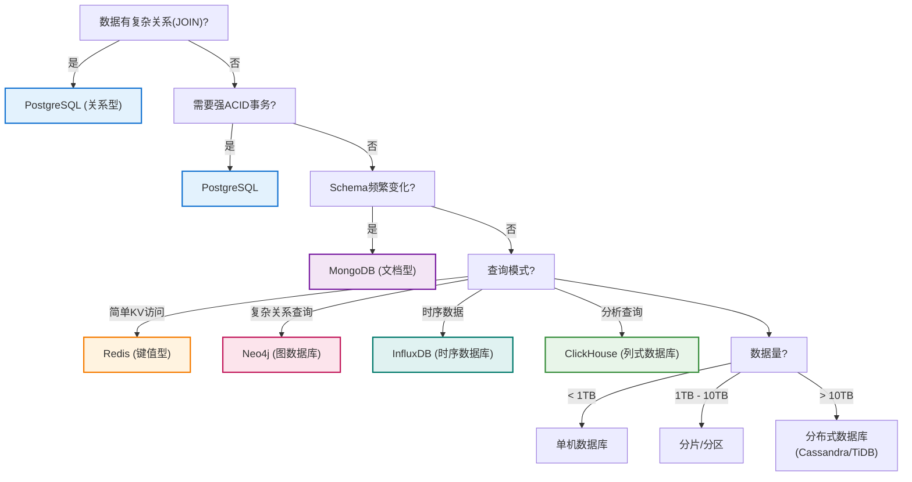

---

## 对象存储架构

### 3.1 对象存储原理

#### 对象存储 vs 文件存储 vs 块存储

```
块存储 (Block Storage):
• 原理: 固定大小块（如4KB）
• 接口: 块设备（/dev/sdb）
• 适用: 数据库、虚拟机磁盘
• 示例: AWS EBS, Azure Disk

文件存储 (File Storage):
• 原理: 文件+目录树
• 接口: POSIX (open/read/write)
• 适用: 共享文件、NAS
• 示例: NFS, SMB

对象存储 (Object Storage):
• 原理: 对象（数据+元数据）+ 全局唯一ID
• 接口: HTTP REST API
• 适用: 非结构化数据、备份、静态资产
• 示例: AWS S3, MinIO
```

**对比表**:

| 维度 | 块存储 | 文件存储 | 对象存储 |
|-----|-------|---------|---------|
| **访问方式** | 块级别 | 文件级别 | HTTP API |
| **元数据** | 无 | 文件属性 | 丰富元数据 |
| **扩展性** | 有限 | 中等 | 无限（PB级） |
| **性能** | 最高 | 中 | 较低 |
| **成本** | 高 | 中 | 低 |
| **一致性** | 强 | 强 | 最终一致 |
| **适用场景** | 数据库 | 文件共享 | 静态资产、备份 |

---

### 3.2 S3 API 标准

#### 核心概念

```
术语:

Bucket (桶):
• 顶层容器
• 全局唯一名称
• 示例: my-app-uploads

Object (对象):
• 存储的数据实体
• Key: 对象唯一标识（路径）
• 示例: users/123/avatar.jpg

元数据 (Metadata):
• Content-Type: image/jpeg
• Content-Length: 1024000
• 自定义: x-amz-meta-user-id: 123

版本控制 (Versioning):
• 保留对象的多个版本
• 防止误删除
```

#### S3 API 操作

```
桶操作:
• CreateBucket: 创建桶
• DeleteBucket: 删除桶
• ListBuckets: 列出所有桶

对象操作:
• PutObject: 上传对象
• GetObject: 下载对象
• DeleteObject: 删除对象
• CopyObject: 复制对象
• ListObjects: 列出对象

多部分上传 (Multipart Upload):
1. InitiateMultipartUpload
2. UploadPart (并行上传多个部分)
3. CompleteMultipartUpload (合并)

用途: 大文件上传（>100MB）
好处: 断点续传、并行上传
```

---

### 3.3 MinIO 架构

#### 分布式架构

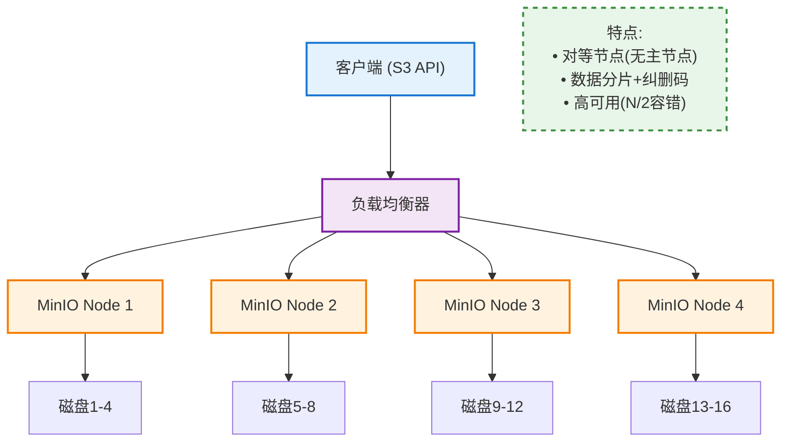

#### 纠删码 (Erasure Coding)

**原理**: 数据分片 + 冗余校验，比副本更节省空间。

```
示例: EC 4+2 (4个数据块 + 2个校验块)

原始文件: 4MB
    ↓ 分片
┌────┬────┬────┬────┐
│ D1 │ D2 │ D3 │ D4 │ (各1MB)
└────┴────┴────┴────┘
    ↓ 生成校验块
┌────┬────┬────┬────┬────┬────┐
│ D1 │ D2 │ D3 │ D4 │ P1 │ P2 │
└────┴────┴────┴────┴────┴────┘

存储: 6MB (1.5x 冗余)
容错: 任意2块损坏可恢复

对比副本:
3副本: 12MB (3x 冗余)
EC 4+2: 6MB (1.5x 冗余)
→ 节省 50% 存储

恢复过程:
假设 D2, D3 损坏:
D2 = f(D1, D4, P1, P2)  # 数学计算恢复
D3 = f(D1, D4, P1, P2)
```

**EC 配置选择**:

| 配置 | 冗余度 | 容错能力 | 存储效率 | 性能 |
|-----|-------|---------|---------|------|
| **EC 2+2** | 2x | 2块 | 50% | 高 |
| **EC 4+2** | 1.5x | 2块 | 67% | 中 |
| **EC 8+4** | 1.5x | 4块 | 67% | 中 |
| **EC 16+4** | 1.25x | 4块 | 80% | 低 |

**推荐**:
- 小集群（4-8节点）: EC 4+2
- 大集群（16+节点）: EC 8+4 或 EC 16+4

---

### 3.4 对象存储优化

#### 1. 分层存储 (Storage Tiering)

```
生命周期管理:

热数据 (0-30天):
  • SSD 存储
  • 低延迟访问
  • 成本: $$$

温数据 (31-90天):
  • HDD 存储
  • 中等延迟
  • 成本: $$

冷数据 (91-365天):
  • 对象存储标准层
  • 高延迟
  • 成本: $

归档数据 (>365天):
  • Glacier/深度归档
  • 小时级恢复
  • 成本: ¢

规则示例:
• 30天后 → 转为温存储
• 90天后 → 转为冷存储
• 365天后 → 转为归档
• 7年后 → 删除（合规要求）
```

#### 2. CDN 加速

```
架构:

用户 (中国)
  ↓
CDN 边缘节点 (上海)
  ↓ 缓存未命中
源站 MinIO (美国)

流程:
1. 用户请求 image.jpg
2. CDN检查本地缓存
3. 命中 → 直接返回 (延迟 5ms)
4. 未命中 → 回源获取 (延迟 200ms) → 缓存 → 返回用户
5. 后续请求命中缓存 (延迟 5ms)

优化:
• 缓存命中率 > 95%
• 用户延迟降低 40x
• 源站负载降低 95%
```

#### 3. 预签名URL (Presigned URL)

```
问题: 如何让用户直接上传到对象存储，而不经过应用服务器？

方案: 预签名URL

流程:
1. 客户端请求应用服务器: "我要上传头像"
2. 应用服务器生成预签名URL:
   PUT https://bucket.s3.com/users/123/avatar.jpg?
       X-Amz-Signature=xxx&
       X-Amz-Expires=3600
3. 客户端直接上传到对象存储
4. 上传成功 → 通知应用服务器

好处:
✓ 应用服务器不处理文件（节省带宽）
✓ 可扩展（对象存储扛高并发）
✓ 安全（签名有效期，防盗链）

实现:
signature = HMAC-SHA256(
  secret_key,
  "PUT\n/users/123/avatar.jpg\nexpires=1234567890"
)
```

---

## 缓存架构设计

### 4.1 缓存模式

#### 1. Cache-Aside (旁路缓存)

```
读流程:
1. 应用查询缓存
2. 缓存命中 → 返回
3. 缓存未命中:
   a. 查询数据库
   b. 写入缓存
   c. 返回数据

写流程:
1. 应用更新数据库
2. 删除缓存（或更新缓存）

伪代码:
def get_user(user_id):
    # 读缓存
    user = cache.get(f"user:{user_id}")
    if user:
        return user

    # 未命中，读数据库
    user = db.query("SELECT * FROM users WHERE id = ?", user_id)

    # 写缓存
    cache.set(f"user:{user_id}", user, ttl=3600)
    return user

def update_user(user_id, data):
    # 更新数据库
    db.execute("UPDATE users SET ... WHERE id = ?", user_id)

    # 删除缓存
    cache.delete(f"user:{user_id}")

优点:
✓ 应用完全控制
✓ 缓存故障不影响系统

缺点:
❌ 首次访问慢（缓存冷启动）
❌ 缓存和数据库可能不一致
```

#### 2. Read-Through (读穿透)

```
原理: 缓存层自动加载数据

流程:
1. 应用查询缓存
2. 缓存命中 → 返回
3. 缓存未命中:
   → 缓存层自动从数据库加载
   → 返回数据

对比Cache-Aside:
• 应用不感知数据库
• 缓存层封装加载逻辑

适用: 缓存中间件支持（如DynamoDB DAX）
```

#### 3. Write-Through (写穿透)

```
原理: 写缓存时同步写数据库

流程:
1. 应用写缓存
2. 缓存层同步写数据库
3. 返回成功

优点:
✓ 缓存和数据库强一致

缺点:
❌ 写入延迟高（同步写两次）
❌ 浪费写入（可能未读取）
```

#### 4. Write-Behind (写回)

```
原理: 异步批量写入数据库

流程:
1. 应用写缓存
2. 立即返回成功
3. 缓存层异步批量写数据库

优点:
✓ 写入极快
✓ 批量写入（高吞吐）

缺点:
❌ 数据可能丢失（缓存故障）
❌ 最终一致性

适用: 写密集场景（日志、计数器）
```

---

### 4.2 Redis Cluster 架构

#### 集群拓扑

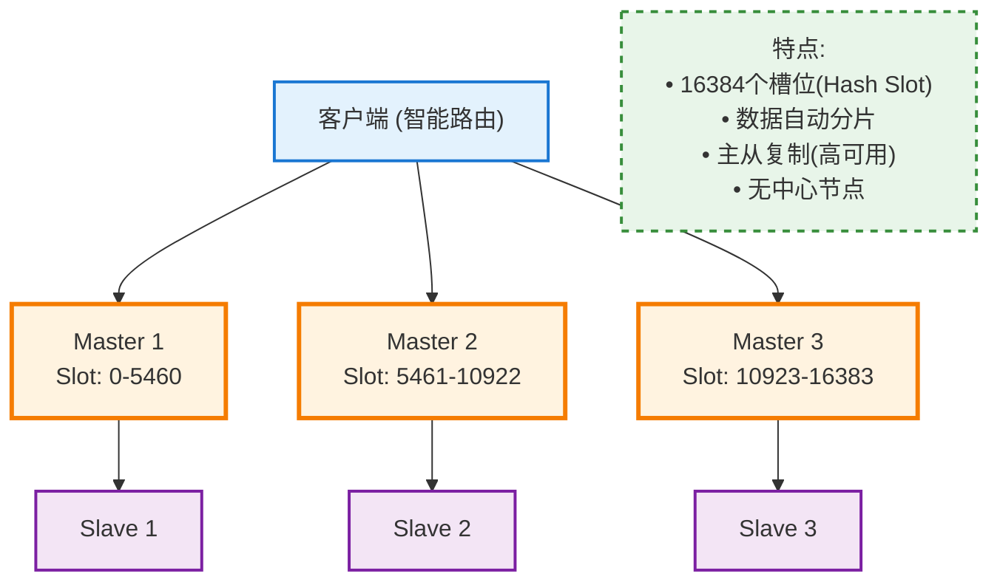

#### 一致性哈希槽

```
槽位分配算法:

slot = CRC16(key) mod 16384

示例:
key = "user:123"
slot = CRC16("user:123") mod 16384 = 5000
→ 路由到 Master 1 (0-5460)

key = "order:456"
slot = CRC16("order:456") mod 16384 = 12000
→ 路由到 Master 3 (10923-16383)

优势:
• 节点增减只影响邻近槽位
• 数据迁移量最小

哈希标签 (Hash Tag):
key = "user:{123}:profile"
key = "user:{123}:orders"
→ 都路由到同一槽位（基于{123}）
→ 支持多键操作（MGET）
```

#### 故障转移

```
场景: Master 1 故障

1. 检测:
   • Slave 1 检测到 Master 1 无响应
   • 其他节点投票确认故障

2. 选举:
   • Slave 1 成为新 Master
   • 接管 Slot 0-5460

3. 通知:
   • 集群广播拓扑变化
   • 客户端更新路由表

4. 恢复:
   • 原 Master 1 重启后成为 Slave

自动故障转移时间: < 1秒
```

---

### 4.3 缓存一致性

#### 问题场景

```
经典不一致场景:

时间线:
T1: 线程A 读数据库 (user.name = "Alice")
T2: 线程B 更新数据库 (user.name = "Bob")
T3: 线程B 删除缓存
T4: 线程A 写入缓存 (user.name = "Alice") ← 脏数据！
T5: 后续读取都是 "Alice" (错误)

根本原因: 读写并发
```

#### 解决方案

**1. 延迟双删 (Delayed Double Delete)**:
```
写流程:
1. 删除缓存
2. 更新数据库
3. 等待 100ms（数据库主从延迟 + 读取时间）
4. 再次删除缓存

目的: 清除并发读写的脏数据

缺点: 仍有小概率不一致
```

**2. 基于订阅的缓存更新**:
```
架构:

数据库 → Binlog → Canal (订阅) → 消息队列 → 缓存更新服务 → 删除缓存

优点:
✓ 最终一致性保证
✓ 解耦

工具:
• MySQL: Canal, Maxwell
• PostgreSQL: Debezium
```

**3. 分布式锁**:
```
读流程:
1. 尝试获取锁 (SET key NX EX 10)
2. 获取成功:
   a. 查数据库
   b. 写缓存
   c. 释放锁
3. 获取失败:
   → 等待后重试

好处: 防止缓存击穿（大量并发读未命中）
```

---

### 4.4 缓存常见问题

#### 1. 缓存穿透 (Cache Penetration)

```
问题: 查询不存在的数据，绕过缓存，直击数据库

示例:
while True:
    query("user:99999999")  # 不存在
    → 缓存未命中
    → 查数据库（空）
    → 不写缓存
    → 恶意重复 → 数据库崩溃

解决方案:

1. 缓存空值:
   cache.set("user:99999999", NULL, ttl=60)
   → 短期缓存"不存在"

2. 布隆过滤器 (Bloom Filter):
   if bloom_filter.exists("user:99999999"):
       查询缓存/数据库
   else:
       直接返回"不存在"

   特点:
   • 空间极小（1亿key仅需12MB）
   • 无误判不存在（假阴性）
   • 可能误判存在（假阳性 < 1%）
```

#### 2. 缓存击穿 (Cache Breakdown)

```
问题: 热点key过期，瞬间大量请求打到数据库

示例:
热门商品缓存过期
→ 1000个并发请求同时未命中
→ 1000个查询打到数据库
→ 数据库过载

解决方案:

1. 互斥锁 (Mutex):
   lock = cache.set("lock:product:123", "1", NX, EX, 5)
   if lock:
       data = db.query()
       cache.set("product:123", data)
       cache.delete("lock:product:123")
   else:
       wait_and_retry()

2. 热点数据永不过期:
   cache.set("product:123", data, ttl=NEVER)
   后台定时刷新

3. 逻辑过期:
   {
     "data": {...},
     "expire_time": 1234567890
   }
   → 缓存永不过期
   → 应用层判断过期后异步更新
```

#### 3. 缓存雪崩 (Cache Avalanche)

```
问题: 大量key同时过期，数据库瞬间过载

示例:
凌晨2点批量导入数据，设置1小时过期
→ 凌晨3点，所有key同时失效
→ 数据库崩溃

解决方案:

1. 过期时间加随机值:
   ttl = base_ttl + random(0, 300)  # ±5分钟
   → 分散过期时间

2. 多级缓存:
   L1: Redis (1小时)
   L2: 本地缓存 (10分钟)
   → L1失效时L2仍可用

3. 限流降级:
   if cache_miss_rate > 50%:
       启动降级（返回默认值）
       限流保护数据库
```

---

## 数据血缘与治理

### 5.1 数据血缘 (Data Lineage)

#### 定义与价值

**数据血缘**: 追踪数据从源头到终点的完整生命周期。

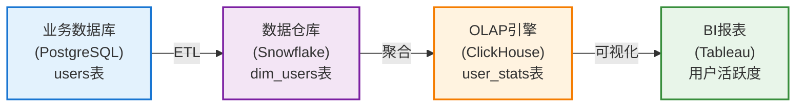

**问题场景**:
报表显示异常 → 需要追溯:
- 数据来自哪个表?
- 经过哪些转换?
- 哪个ETL任务处理?
- 上游数据何时更新?

**血缘解决**:
- 快速定位问题根源
- 评估变更影响范围
- 合规审计

#### 血缘采集方式

**1. 被动采集 (Passive)**:
```
原理: 解析SQL日志

示例:
INSERT INTO target_table
SELECT id, name, COUNT(*) as cnt
FROM source_table
GROUP BY id, name

解析血缘:
source_table (id, name) → target_table (id, name, cnt)

工具:
• Apache Atlas
• Marquez
• Amundsen
```

**2. 主动注册 (Active)**:
```
原理: ETL代码显式声明血缘

示例:
@lineage(
    inputs=["source_table"],
    outputs=["target_table"]
)
def etl_job():
    ...

工具:
• Airflow (DAG元数据)
• DBT (YAML配置)
```

---

### 5.2 数据质量 (Data Quality)

#### 质量维度

```
6个维度:

1. 完整性 (Completeness):
   • 数据是否缺失？
   • 检查: NOT NULL 字段是否有NULL

2. 准确性 (Accuracy):
   • 数据是否正确？
   • 检查: email 格式、年龄范围

3. 一致性 (Consistency):
   • 不同表数据是否一致？
   • 检查: users.age = orders.user_age

4. 时效性 (Timeliness):
   • 数据是否最新？
   • 检查: update_time < 现在 - 1小时

5. 唯一性 (Uniqueness):
   • 是否有重复？
   • 检查: PRIMARY KEY 约束

6. 有效性 (Validity):
   • 数据是否符合业务规则？
   • 检查: status IN ('active', 'inactive')
```

#### 质量监控

```
Great Expectations 框架:

expect_column_values_to_not_be_null("user_id")
expect_column_values_to_be_between("age", 0, 120)
expect_column_values_to_be_in_set("status", ['active', 'inactive'])
expect_table_row_count_to_be_between(1000, 10000)

监控流程:
1. 定义期望规则
2. 数据管道运行后验证
3. 失败 → 告警 + 阻止下游任务
4. 成功 → 继续流程

好处:
• 数据问题早发现
• 防止脏数据传播
```

---

### 5.3 数据目录 (Data Catalog)

#### 元数据管理

```
元数据类型:

技术元数据:
• 表结构: 列名、数据类型、约束
• 存储信息: 表大小、分区、索引
• 血缘关系: 上下游依赖

业务元数据:
• 业务含义: "user_id 是用户唯一标识"
• 负责人: "数据Owner: Alice"
• 标签: #PII, #金融数据

操作元数据:
• 访问日志: 谁在何时查询了什么
• 变更历史: Schema 演进
• 使用频率: 热点表
```

**数据目录架构**:
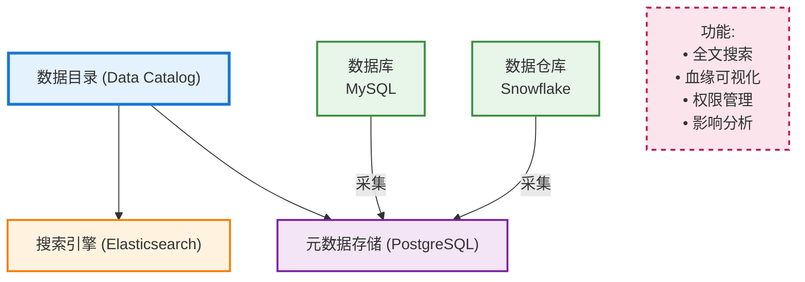

---

### 5.4 数据隐私与合规

#### GDPR 合规

```
核心要求:

1. 数据最小化 (Data Minimization):
   • 仅收集必要数据
   • 实现: 删除不必要的列

2. 被遗忘权 (Right to be Forgotten):
   • 用户可要求删除数据
   • 实现:
     - 软删除 (标记deleted_at)
     - 数据脱敏（替换为匿名ID）
     - 物理删除（彻底清除）

3. 数据可携带权 (Data Portability):
   • 用户可导出自己的数据
   • 实现: 提供CSV/JSON导出API

4. 设计隐私 (Privacy by Design):
   • 默认开启最高隐私保护
   • 实现: 敏感字段加密存储

5. 数据保护影响评估 (DPIA):
   • 评估隐私风险
   • 记录处理活动
```

#### 敏感数据处理

```
分级保护:

Public (公开):
  • 数据: 产品信息
  • 访问: 所有人
  • 加密: 否

Internal (内部):
  • 数据: 员工通讯录
  • 访问: 公司员工
  • 加密: 传输加密

Confidential (机密):
  • 数据: 用户邮箱、手机
  • 访问: 特定团队 + 审批
  • 加密: 传输+存储加密

Restricted (限制):
  • 数据: 信用卡号、身份证
  • 访问: 极少数人 + MFA
  • 加密: 字段级加密 + 脱敏展示

处理策略:
• Restricted数据脱敏:
  信用卡: 1234-5678-9012-3456 → ****-****-****-3456
  身份证: 110101199001011234 → 110101****1234
```

---

### 5.5 数据治理框架

#### Apache Atlas 架构

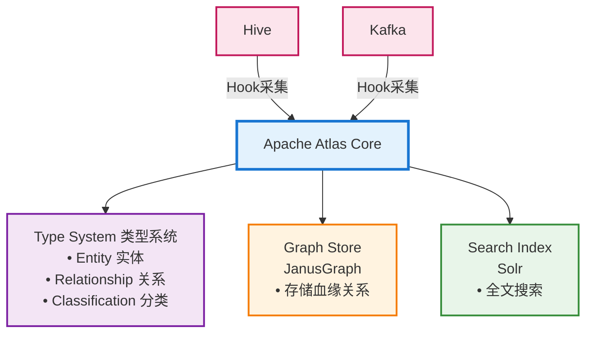

**实体模型**:
```
Table 实体:
{
  "typeName": "hive_table",
  "attributes": {
    "name": "users",
    "owner": "alice",
    "createTime": 1234567890,
    "columns": [
      {"name": "id", "type": "int"},
      {"name": "email", "type": "string"}
    ],
    "classifications": ["PII", "金融数据"]
  }
}

血缘关系:
hive_table.users → spark_process → hive_table.user_stats
```

---

## 存储架构综合设计

### 6.1 多模存储架构

#### Lambda 架构

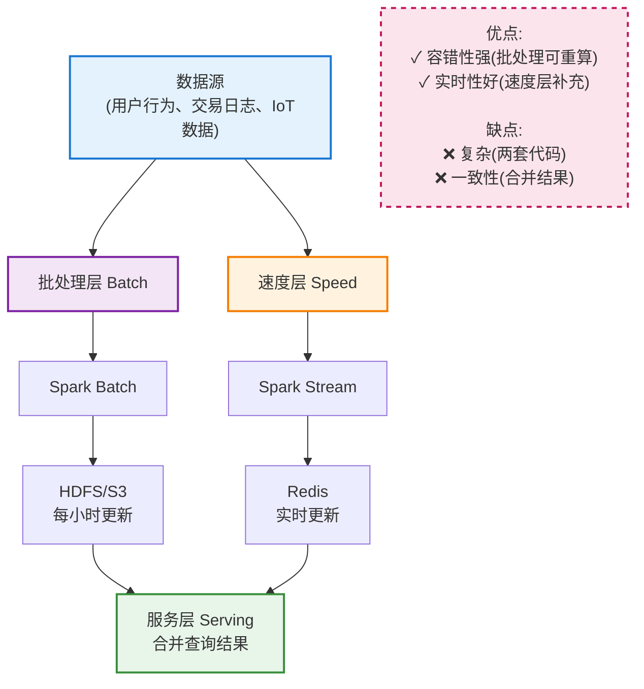

#### Kappa 架构

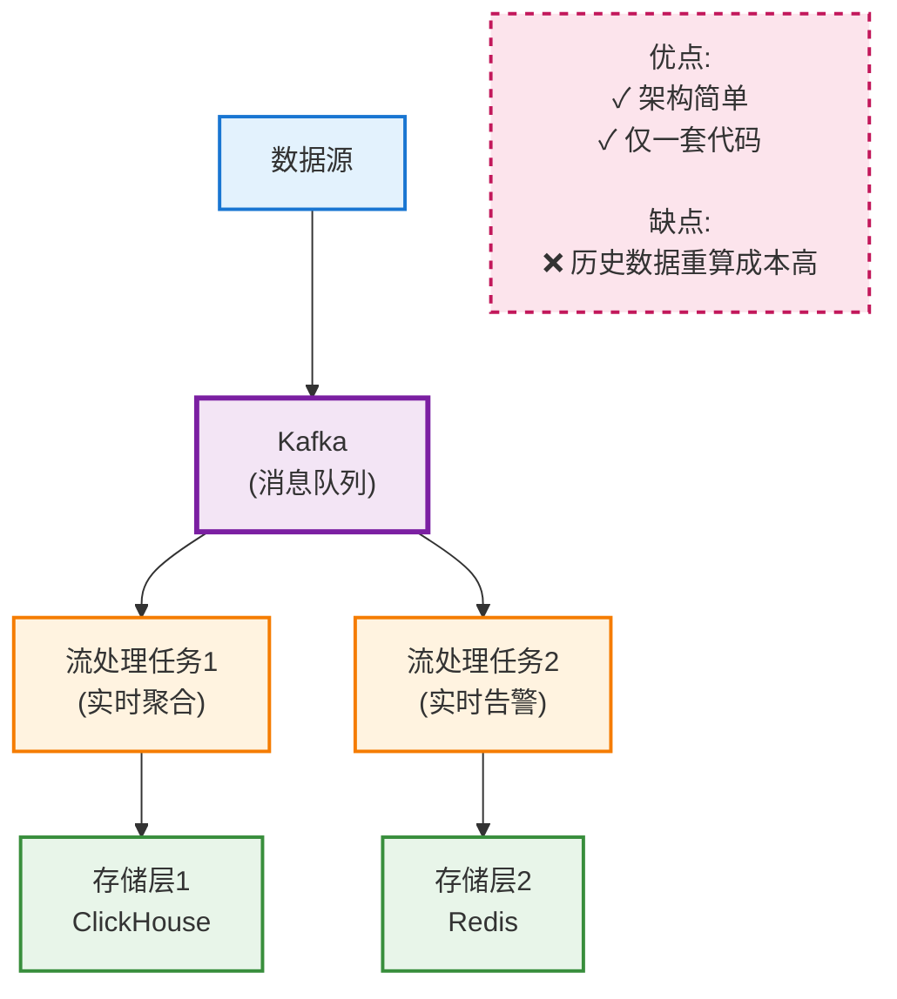

---

### 6.2 存储成本优化

#### 冷热分离

```
策略:

热数据 (频繁访问):
• 存储: SSD / NVMe
• 成本: $0.10/GB/月
• 场景: 最近7天数据

温数据 (偶尔访问):
• 存储: HDD
• 成本: $0.03/GB/月
• 场景: 8-90天数据

冷数据 (很少访问):
• 存储: 对象存储 (S3 Infrequent Access)
• 成本: $0.01/GB/月
• 场景: 91-365天数据

归档数据 (几乎不访问):
• 存储: Glacier
• 成本: $0.004/GB/月
• 场景: 法律要求保留 > 1年

成本对比:
1TB 数据全部热存储: $100/月
冷热分离:
  100GB 热 ($10) + 900GB 冷 ($9) = $19/月
节省: 81%
```

#### 数据压缩

```
压缩算法对比:

| 算法 | 压缩比 | 压缩速度 | 解压速度 | CPU | 适用场景 |
|-----|-------|---------|---------|-----|---------|
| **Gzip** | 3:1 | 慢 | 中 | 高 | 通用 |
| **LZ4** | 2:1 | 极快 | 极快 | 低 | 实时日志 |
| **Zstd** | 3.5:1 | 快 | 快 | 中 | 推荐 |
| **Snappy** | 2:1 | 快 | 快 | 低 | Kafka |
| **Brotli** | 4:1 | 慢 | 中 | 高 | HTTP压缩 |

选择策略:
• 实时流: LZ4 (低CPU)
• 离线存储: Zstd (高压缩比)
• 归档: Gzip (兼容性好)

成本节省:
1TB 原始数据 → 压缩后 300GB
存储成本: $30 → $9 (70% 节省)
```

---

### 6.3 灾备与高可用

#### 备份策略 (3-2-1 规则)

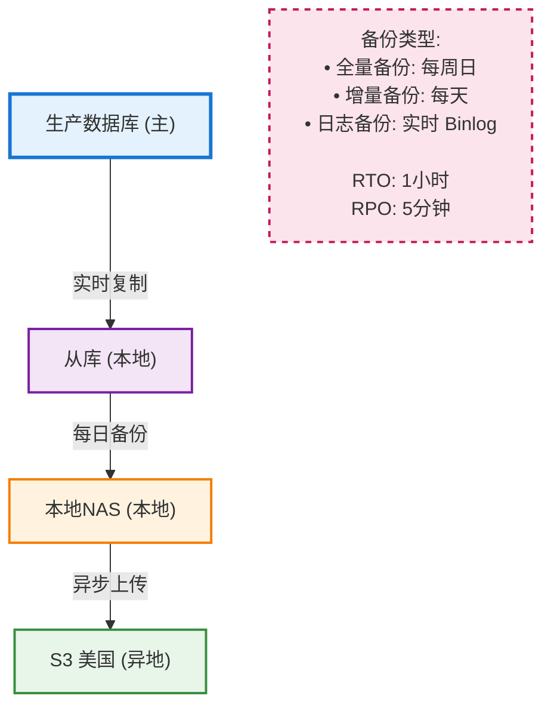

#### 多活架构 (Active-Active)

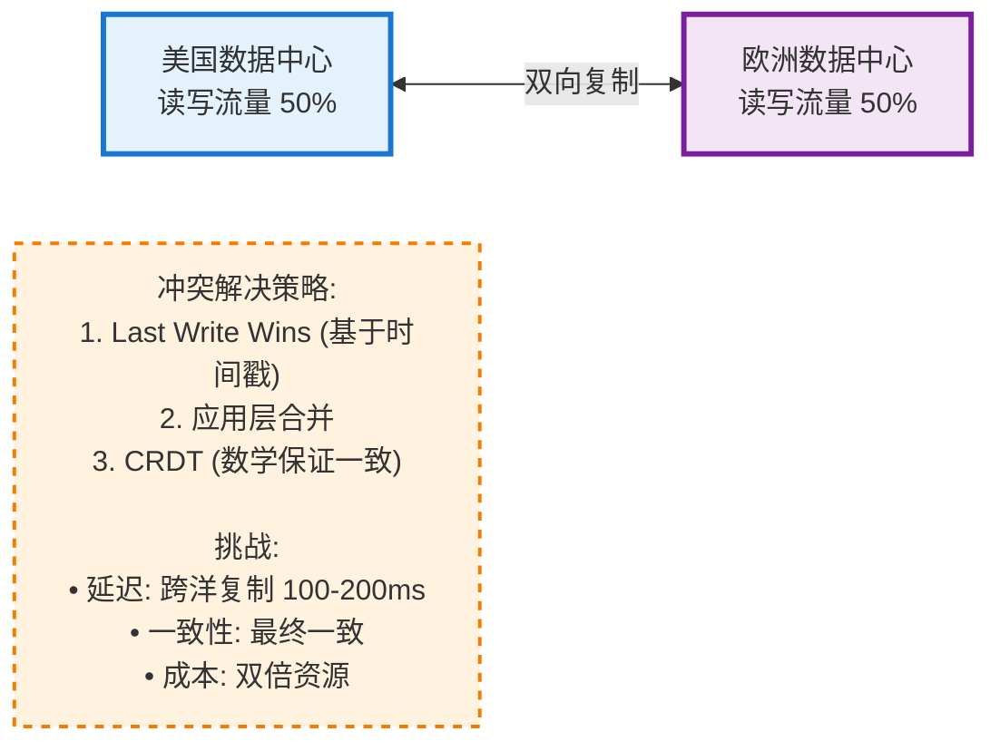

---

### 6.4 存储选型决策矩阵

| 场景 | 推荐方案 | 原因 |
|-----|---------|------|
| **OLTP (在线事务)** | PostgreSQL | ACID、关系型 |
| **OLAP (分析)** | ClickHouse | 列存储、聚合快 |
| **缓存** | Redis Cluster | 内存、高性能 |
| **全文搜索** | Elasticsearch | 倒排索引 |
| **文档存储** | MongoDB | 灵活Schema |
| **时序数据** | InfluxDB / TimescaleDB | 时间优化 |
| **图数据** | Neo4j | 关系查询 |
| **对象存储** | MinIO / S3 | 海量文件 |
| **消息队列** | Kafka | 高吞吐、持久化 |
| **日志存储** | Loki / S3 + Parquet | 成本低 |

---

## 最佳实践清单

```
✅ 数据库选型:
  □ 根据访问模式选择（OLTP vs OLAP）
  □ 考虑一致性需求（强一致 vs 最终一致）
  □ 评估扩展性（垂直 vs 水平）

✅ 缓存设计:
  □ 选择合适模式（Cache-Aside推荐）
  □ 设置合理TTL（业务相关）
  □ 防止常见问题（穿透、击穿、雪崩）

✅ 对象存储:
  □ 分层存储（热温冷）
  □ 生命周期管理
  □ CDN加速

✅ 数据治理:
  □ 建立数据目录
  □ 实施质量监控
  □ 追踪数据血缘

✅ 安全合规:
  □ 敏感数据加密
  □ 访问控制（RBAC）
  □ 审计日志
  □ GDPR合规

✅ 灾备:
  □ 3-2-1 备份策略
  □ 定期恢复演练
  □ 监控备份状态
```

---

## 权威资源索引

### 官方文档
- **PostgreSQL 文档**
  https://www.postgresql.org/docs/

- **Redis 文档**
  https://redis.io/docs/

- **MinIO 文档**
  https://min.io/docs/

### 书籍
- **《Designing Data-Intensive Applications》- Martin Kleppmann**
  数据系统设计圣经

- **《Redis设计与实现》- 黄健宏**
  Redis 内部原理

- **《Database Internals》- Alex Petrov**
  数据库内核深度

### 论文
- **Dynamo: Amazon's Highly Available Key-value Store**
  最终一致性经典论文

- **Bigtable: A Distributed Storage System for Structured Data**
  列式存储奠基

- **The Google File System**
  分布式文件系统

### 工具与框架
- **Apache Atlas**: 数据治理
  https://atlas.apache.org/

- **Great Expectations**: 数据质量
  https://greatexpectations.io/

- **DBT**: 数据转换
  https://www.getdbt.com/

---

**文档版本**: v1.0
**最后更新**: 2025-01-21
**适用深度**: ⭐⭐⭐⭐ (高级理论知识)
