# 混合云与多云架构深度理论知识

> **学习深度**: ⭐⭐⭐⭐
> **文档类型**: 纯理论知识（无代码实践）
> **权威参考**: AWS Well-Architected Framework、Google Cloud架构中心、Azure架构中心、CNCF、NIST

---

## 目录

1. [跨云网络架构](#跨云网络架构)
2. [数据驻留与合规](#数据驻留与合规)
3. [成本优化策略](#成本优化策略)
4. [灾难恢复](#灾难恢复)
5. [权威资源](#权威资源)

---

## 跨云网络架构

### 1.1 定义和背景

跨云网络架构是指在多个云服务提供商（CSP）之间或云与本地数据中心之间建立安全、高性能、可靠的网络连接架构。它是混合云和多云战略的基础设施支柱。

---

### 1.2 核心原理

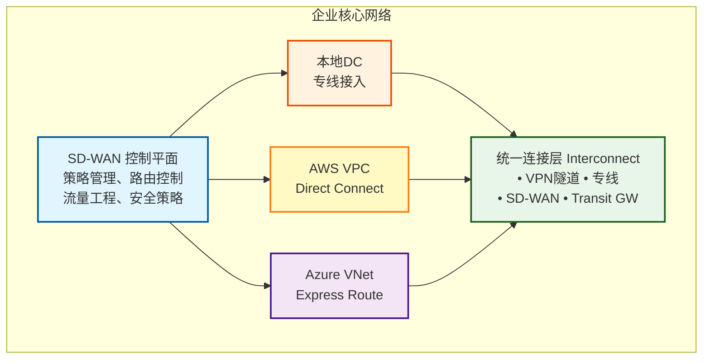

---

### 1.3 网络连接技术对比

| 连接方式 | 带宽 | 延迟 | 成本 | 安全性 | 适用场景 |
|---------|------|------|------|--------|----------|
| **IPsec VPN** | 低-中 (100Mbps-1Gbps) | 较高 (互联网路径) | 低 | 中 (加密隧道) | 临时连接、开发测试 |
| **专线连接** | 高 (1Gbps-100Gbps) | 低 (专用路径) | 高 | 高 (物理隔离) | 生产环境、大数据传输 |
| **SD-WAN** | 中-高 (聚合多链路) | 中 (智能路由) | 中 | 高 (多层加密) | 分布式混合云 |
| **Cloud Interconnect** | 极高 (10Gbps+) | 极低 (骨干网) | 极高 | 极高 | 关键业务、低延迟需求 |

---

### 1.4 架构设计关键要素

#### 1.4.1 网络拓扑模式

- **Hub-Spoke 模型**：中心化管理，流量经过中心节点
- **Mesh 模型**：全互联，点对点直连，低延迟但复杂度高
- **Hybrid 模型**：混合架构，平衡成本与性能

#### 1.4.2 流量工程

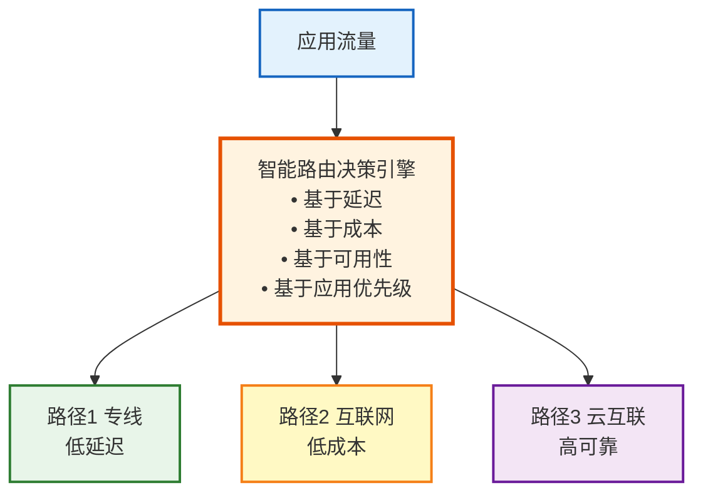

#### 1.4.3 DNS与全局负载均衡

- **全局服务器负载均衡 (GSLB)**：基于地理位置、健康检查、性能的智能DNS
- **Anycast路由**：单一IP地址映射多个地理位置
- **流量分割策略**：按百分比、权重、地域分配流量

---

### 1.5 优劣势对比

**优势：**
- ✅ 灾难恢复能力增强
- ✅ 避免供应商锁定
- ✅ 地理覆盖范围广
- ✅ 弹性与可扩展性

**劣势：**
- ❌ 网络复杂度高
- ❌ 延迟和抖动管理困难
- ❌ 故障排查复杂
- ❌ 运营成本增加

---

## 数据驻留与合规

### 2.1 定义和背景

数据驻留（Data Residency）是指数据必须存储在特定地理位置或司法管辖区的要求。在多云环境中，合规性涉及多个维度的法律、监管和行业标准。

---

### 2.2 核心原理

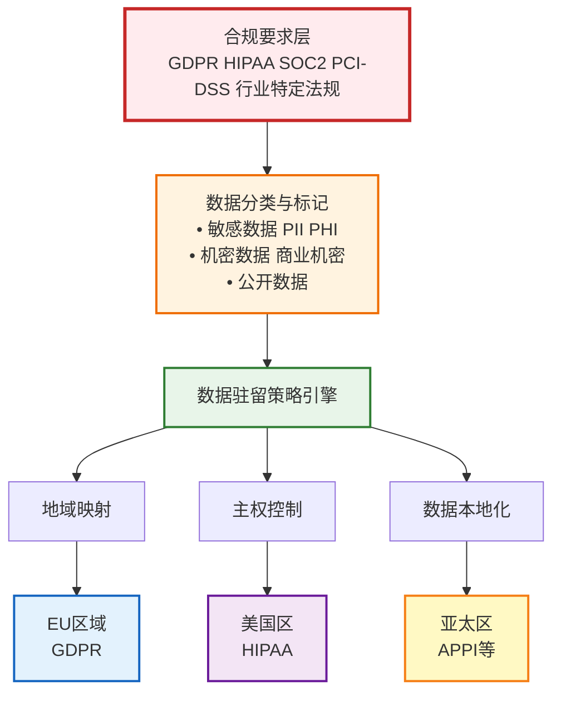

---

### 2.3 关键合规维度

| 合规领域 | 核心要求 | 技术实现 | 挑战 |
|---------|---------|---------|------|
| **数据主权** | 数据必须存储在特定国家/地区 | 区域化存储、地理围栏 | 跨境数据流限制 |
| **加密要求** | 静态和传输加密，密钥管理 | KMS、HSM、端到端加密 | 性能开销、密钥轮换 |
| **访问控制** | 最小权限、身份验证 | IAM、RBAC、ABAC | 多云身份联合 |
| **审计日志** | 完整的操作追踪 | 集中日志、不可变存储 | 日志量大、长期保留 |
| **数据生命周期** | 保留期、删除策略 | 自动化归档、安全删除 | 跨云数据同步 |

---

### 2.4 合规架构设计

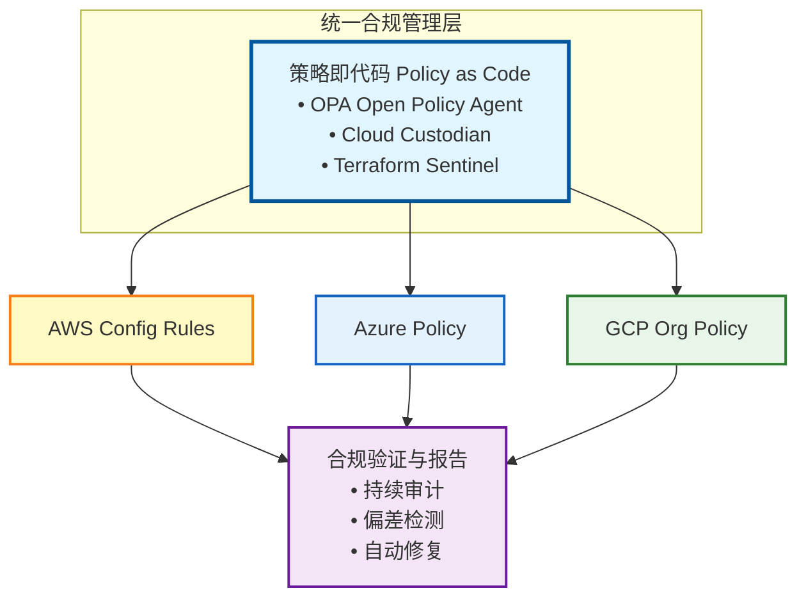

---

### 2.5 数据传输合规机制

#### 2.5.1 跨境数据流管理

- **标准合同条款 (SCC)**：欧盟批准的数据传输协议
- **绑定公司规则 (BCR)**：跨国企业内部数据传输
- **数据本地化处理**：边缘计算，本地处理后传输聚合数据

#### 2.5.2 隐私保护技术

- **数据脱敏**：替换、掩码、泛化敏感信息
- **差分隐私**：添加统计噪声保护个体隐私
- **同态加密**：在加密数据上进行计算
- **安全多方计算**：多方协作计算而不泄露原始数据

---

## 成本优化策略

### 3.1 定义和背景

多云成本优化是指在保证性能和可用性的前提下，通过架构设计、资源配置和采购策略最小化云服务总拥有成本（TCO）的实践。

---

### 3.2 核心原理

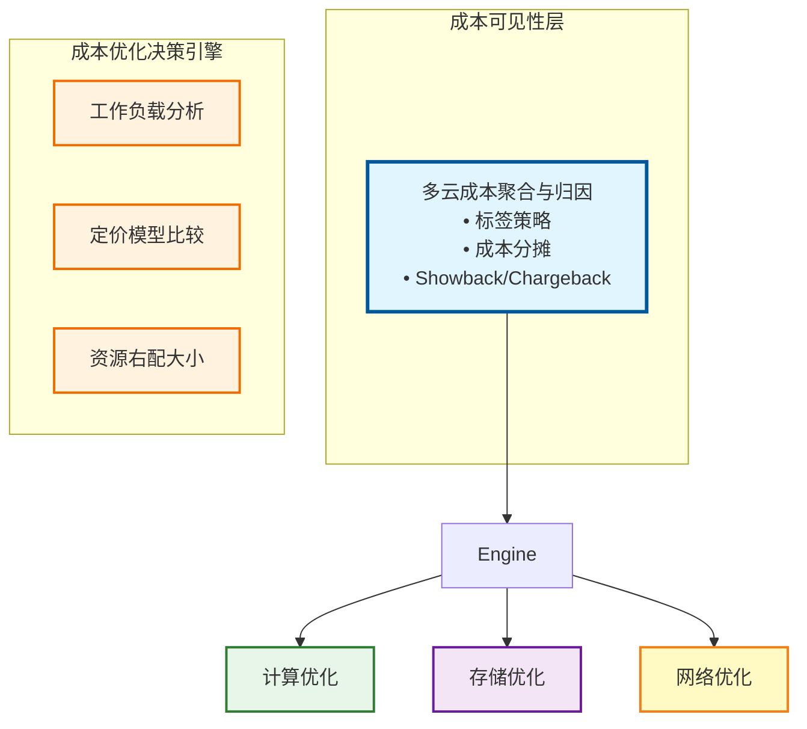

---

### 3.3 成本优化维度对比

| 优化策略 | 节省潜力 | 实施复杂度 | 风险 | 适用场景 |
|---------|---------|-----------|------|----------|
| **RI/SP采购** | 30-75% | 低 | 低 (承诺期) | 稳定可预测工作负载 |
| **Spot实例** | 50-90% | 中-高 | 中-高 (中断) | 容错、批处理任务 |
| **自动扩缩容** | 20-40% | 中 | 低 | 波动性工作负载 |
| **跨云套利** | 10-30% | 高 | 中 (迁移成本) | 大规模、长期部署 |
| **资源右配** | 20-50% | 低-中 | 低 | 过度配置场景 |
| **数据分层** | 30-60% | 中 | 低 | 大量历史数据 |

---

### 3.4 多云定价模型比较

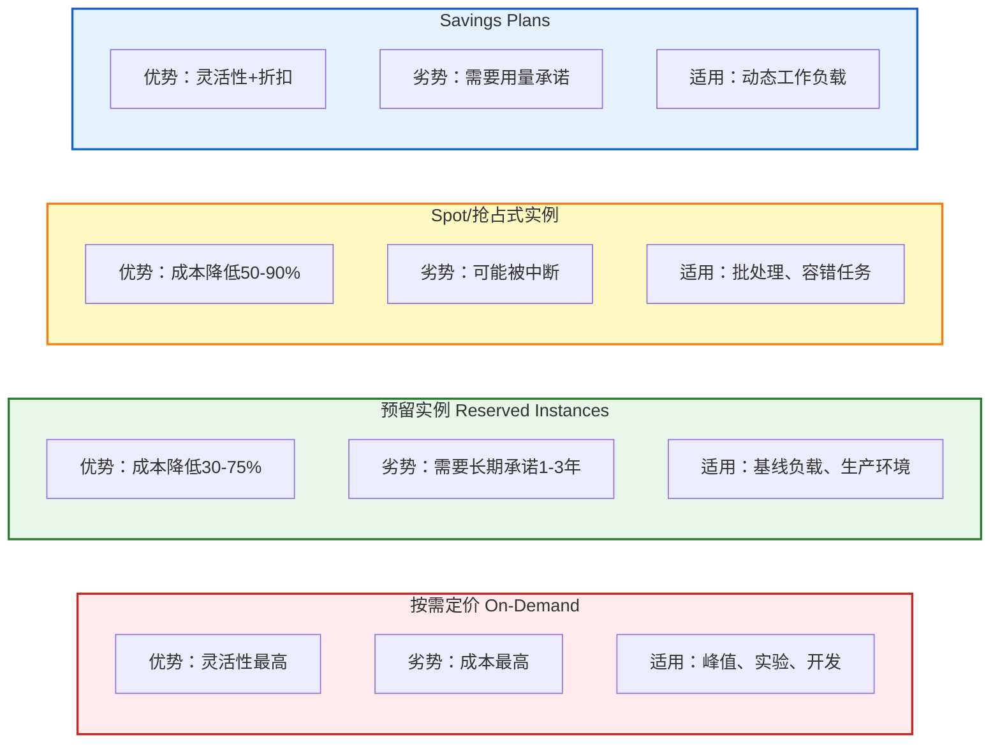

---

### 3.5 成本优化架构模式

#### 3.5.1 工作负载放置策略

**成本感知调度**：根据实时定价选择执行区域

**混合定价组合**：
```
总容量 = 基线容量(RI) + 波动容量(Spot+On-Demand)
```

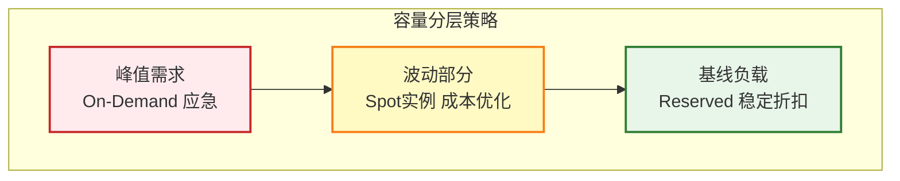

#### 3.5.2 跨云成本套利

**价格比较引擎**：实时比较不同CSP的定价

**工作负载迁移决策**：
```
迁移收益 = (成本差异 × 运行时间) - 迁移成本 - 风险成本
```

| 决策矩阵 | 高迁移性 | 低迁移性 |
|---------|---------|---------|
| **高成本差异** | ✅ 迁移 | ⚠️ 评估 |
| **低成本差异** | ⚖️ 观察 | ❌ 保持 |

#### 3.5.3 存储成本优化

**数据生命周期管理**：

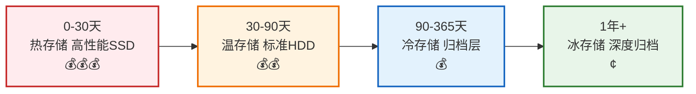

- **智能分层**：自动根据访问模式移动数据
- **重复数据删除与压缩**：减少存储容量

#### 3.5.4 网络成本优化

**数据传输模式**：
- 同区域内传输：通常免费
- 跨区域传输：收费（优化路径）
- 出站流量：最昂贵（CDN、边缘缓存）

**优化策略**：
- **CDN策略**：减少源站出站流量
- **压缩与协议优化**：减少传输数据量

---

## 灾难恢复

### 4.1 定义和背景

灾难恢复（Disaster Recovery, DR）是指在发生重大故障或灾难时恢复业务关键系统和数据的能力。多云架构提供了跨供应商和地理位置的冗余能力。

---

### 4.2 核心原理

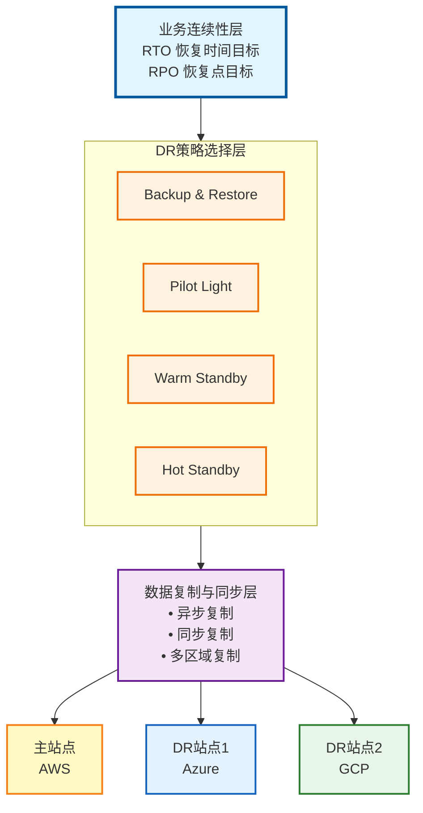

---

### 4.3 DR策略对比

| DR策略 | RTO | RPO | 成本 | 复杂度 | 适用场景 |
|--------|-----|-----|------|--------|----------|
| **备份恢复** | 小时-天 | 小时-天 | 低 | 低 | 非关键系统 |
| **Pilot Light** | 小时 | 分钟-小时 | 低-中 | 中 | 中等关键度 |
| **Warm Standby** | 分钟-小时 | 秒-分钟 | 中-高 | 中-高 | 业务关键系统 |
| **Hot Standby** | 秒-分钟 | 近实时 | 高 | 高 | 任务关键系统 |
| **多活架构** | 0 (无中断) | 0 (无损失) | 极高 | 极高 | 金融、电商核心 |

---

### 4.4 DR架构模式详解

#### 4.4.1 备份与恢复 (Backup & Restore)

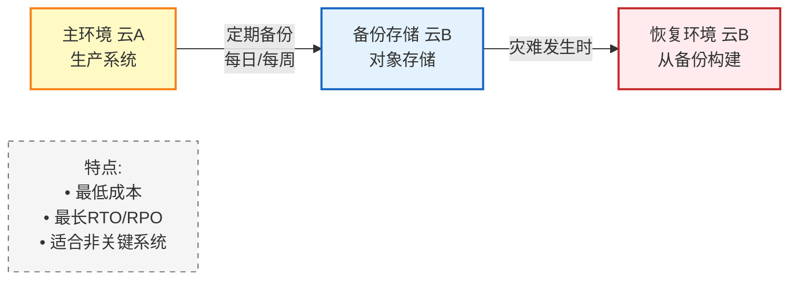

#### 4.4.2 Pilot Light (飞行员灯)

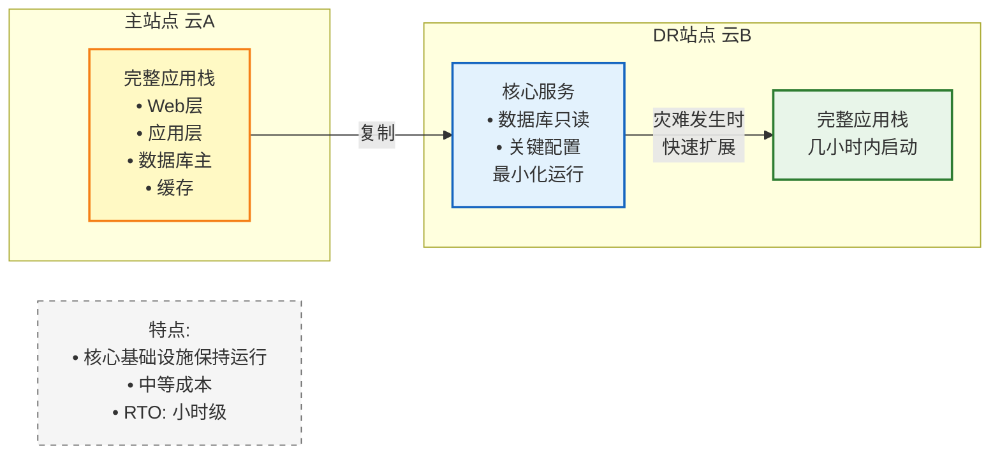

#### 4.4.3 Warm Standby (温备)

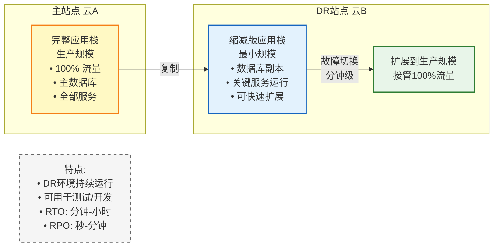

#### 4.4.4 Hot Standby (热备)

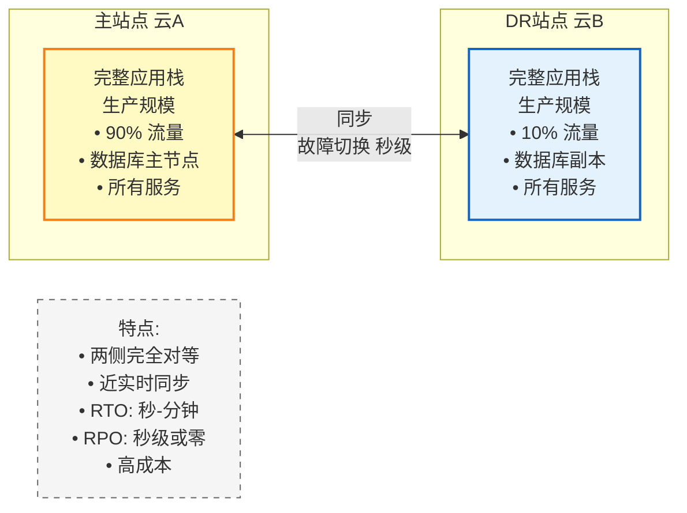

#### 4.4.5 多活架构 (Multi-Active)

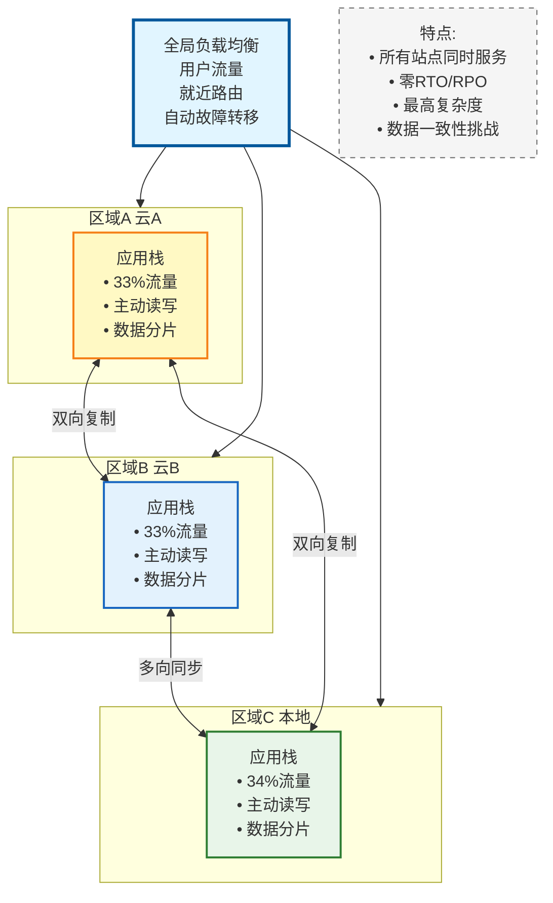

---

### 4.5 数据复制机制

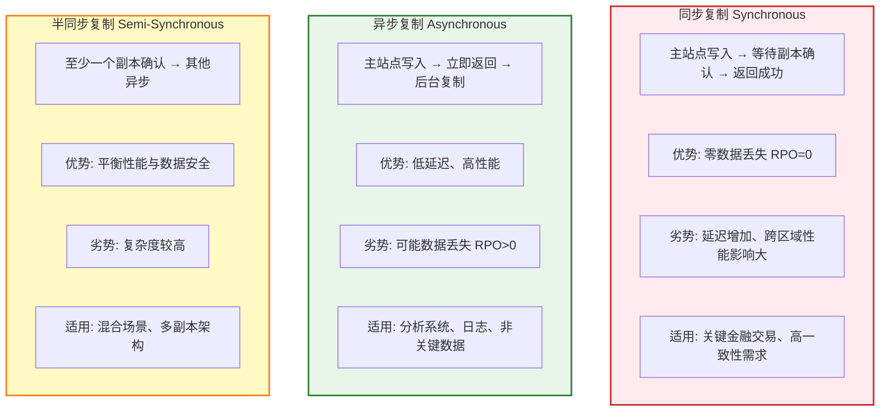

---

### 4.6 故障切换决策流程

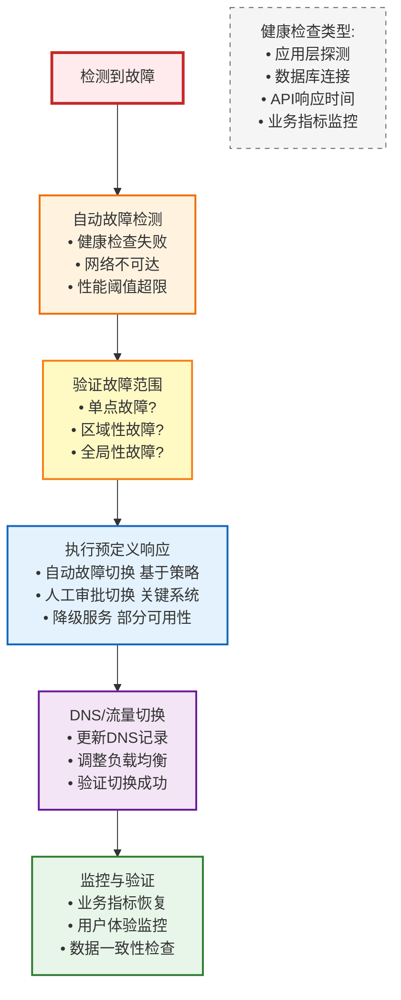

---

### 4.7 RTO/RPO权衡分析

**成本与可用性曲线：**

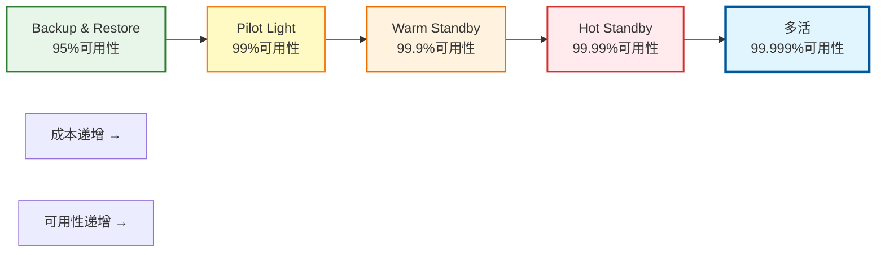

**RTO/RPO 目标选择指南：**

| 业务影响 | RTO | RPO | 策略 |
|---------|-----|-----|------|
| 轻微 | >24小时 | >24小时 | Backup |
| 中等 | 4-24小时 | 1-24小时 | Pilot |
| 严重 | 1-4小时 | <1小时 | Warm |
| 关键 | <1小时 | <15分钟 | Hot |
| 任务关键 | <1分钟 | 0 | 多活 |

---

## 权威资源

### 云服务商架构指南

- **AWS Well-Architected Framework**
  https://aws.amazon.com/architecture/well-architected/
  涵盖可靠性、安全性、性能、成本优化等六大支柱

- **Google Cloud架构中心**
  https://cloud.google.com/architecture
  提供参考架构、最佳实践和设计模式

- **Azure架构中心**
  https://learn.microsoft.com/en-us/azure/architecture/
  包含应用架构指南和设计模式

### 多云与混合云专项

- **CNCF Cloud Native Landscape**
  https://landscape.cncf.io/
  云原生技术生态全景图

- **Kubernetes多集群管理文档**
  https://kubernetes.io/docs/concepts/cluster-administration/federation/

- **Open Policy Agent (合规策略)**
  https://www.openpolicyagent.org/docs/latest/

### 行业标准与合规

- **NIST Cloud Computing Reference Architecture**
  https://www.nist.gov/publications/nist-cloud-computing-reference-architecture

- **ISO/IEC 27017 (云安全标准)**
  云服务信息安全控制实践准则

- **CSA Cloud Controls Matrix**
  https://cloudsecurityalliance.org/research/cloud-controls-matrix/
  云安全控制框架

---

## 技术演进与未来趋势

### 当前挑战

1. **互操作性障碍**：不同云平台API、服务模型差异大
2. **成本可见性**：跨云成本追踪和优化复杂
3. **技能缺口**：需要多云专业知识
4. **安全复杂性**：多个攻击面、身份管理联合

### 新兴技术方向

1. **FinOps实践**：云财务管理成为专门学科
2. **策略即代码**：统一多云治理和合规
3. **服务网格**：跨云服务通信标准化（如Istio）
4. **WebAssembly**：真正的跨平台可移植性
5. **边缘计算集成**：云边端协同架构

---

**文档版本**: v1.0
**最后更新**: 2026-01-21
**适用深度**: ⭐⭐⭐⭐ (高级理论知识)
