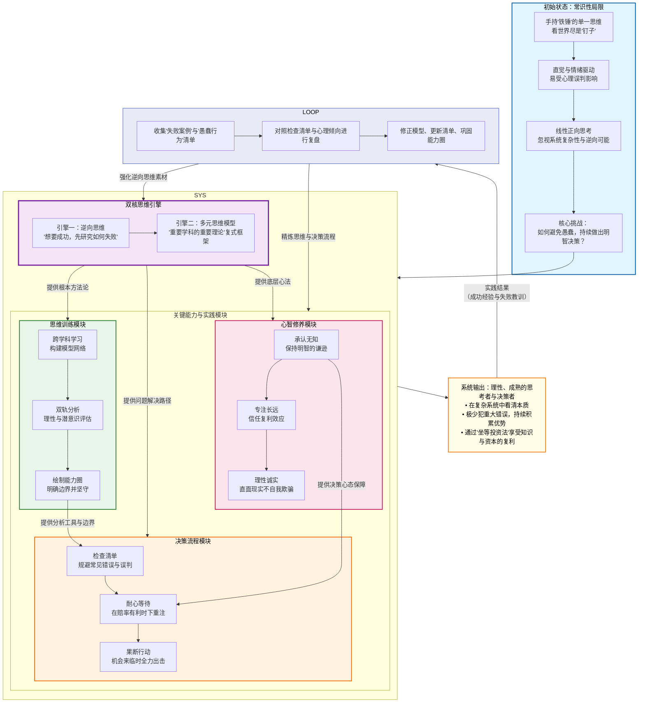

# 【人生好书】《穷查理宝典》多元思维模型与逆向思考：避免愚蠢的理性防御系统

> "我只想知道我将来会死在什么地方，这样我就可以永远不去那里啦。" —— 查理·芒格

---

## 第一部分：核心系统架构图

以下系统架构图描绘了《穷查理宝典》中智慧体系的运作逻辑：从打破单一思维定式开始，通过核心的逆向与多元思维引擎进行信息处理，经由一系列严谨的模块化训练与实践，最终实现理性的决策与持续的进化。

---

## 第二部分：TOP 10 核心观点

1. **多元思维模型是应对复杂世界的终极武器**：你必须掌握重要学科（如数学、物理学、心理学、经济学）的重要理论，并在头脑中形成一个复式框架，才能避免成为"手持铁锤，看什么都像钉子"的人。

2. **逆向思考是解决问题的核心捷径**：要明白人生如何得到幸福，先研究人生如何变得痛苦；要企业强大，先研究企业如何衰败。许多难题反过来想，答案会变得清晰。

3. **投资成功的关键在于避免做傻事，而非做出极聪明的决策**："我只想知道我将来会死在什么地方，这样我就可以永远不去那里啦。"聚焦于规避错误，比追求 brilliance（才华横溢）更有效。

4. **"能力圈"是理性决策的边界**：你必须清楚自己真正懂什么、不懂什么。投资（和决策）有三个选项：可以，不行，太难。对于"太难"的，坚决说"不"。

5. **人类的感知和认知由一系列"心理倾向"驱动，它们常导致误判**：芒格总结了25种人类误判心理学倾向（如激励、喜爱、厌恶损失、社会认同等），它们是系统性的认知缺陷，必须时刻警惕。

6. **检查清单是跨越"知"与"行"鸿沟的桥梁**：无论你多聪明，都无法完全信赖自己的即时判断。将重要原则、常见错误和心理倾向制成检查清单，是避免可预见失败的最佳实践。

7. **耐心既是一种纪律，也是一种策略**：在98%的时间里，对市场（和机会）的态度是保持耐心和"弱者思维"。当赔率对你极端有利时，才下重注。

8. **"坐等投资法"是智慧与复利的体现**：频繁交易是失败之道。像巴菲特和芒格一样，以企业所有者的心态，找到少数几家卓越的公司，然后长期持有，让时间和复利为你工作。

9. **诚实，尤其是对自己诚实，是最高的修行**：永远不要自我欺骗，因为自己是最容易被自己骗的人。承认"我不知道"，比假装知道要强大得多。

10. **终身学习是维持竞争力的唯一方式**：巴菲特和芒格从商业杂志中学到的东西，比从任何地方都多。通过广泛、有目的的阅读，与"已逝的伟人"交朋友，不断更新自己的思维模型。

---

## 第三部分：详细知识体系

### 1. 核心理念基础

芒格智慧体系的"世界观"建立在几个现实且略带"悲观"的前提之上：世界是一个复杂互动的多变量系统；人类的大脑虽强大，却存在固有的、可预测的认知缺陷；市场的波动常常由群体非理性驱动。因此，成功不在于战胜市场，而在于通过持续学习、严格自律和逆向思考，首先避免被自己的愚蠢和市场先生的癫狂所伤害。

### 2. 核心方法/原则层

#### **方法一：多元思维模型构建法**

**核心定义**：从诸如数学、物理学、工程学、心理学、经济学等核心学科中，汲取最根本的原理和思维模型，并在大脑中构建一个可供调用的、相互联系的模型网络，用以分析和解决实际问题。

**为何重要（原理）**：几乎所有复杂的系统都受到多种因素影响。单一学科的视角如同管中窥豹，多元模型则提供了多维度的"透视镜"，能帮助你更全面地理解事物的本质，识别关键变量和它们之间的相互作用，甚至预测可能出现的"lollapalooza效应"（多因素叠加的极端结果）。

**关键步骤/要素**：
1. **识别重要学科**：重点关注那些具有坚实公理和推导过程的硬科学（数学、硬科学）以及研究人类行为的心理学。
2. **掌握核心模型**：例如，数学的复利与排列组合、物理学的临界点与倾覆力矩、工程学的冗余备份与断裂点理论、心理学的误判倾向、生物学的进化论、经济学的规模优势等。
3. **跨学科联系**：不断追问不同模型之间的关联。例如，用心理学的"社会认同倾向"解释经济学的"泡沫"形成。

**常见误区/障碍**：浅尝辄止，将收集模型名称等同于掌握；无法在实际问题中主动调用和连接不同模型；对自己不熟悉的领域盲目自信。

**实践案例/比喻**：评估一家公司时，不仅看财务数据（会计学模型），还要思考其品牌护城河（心理学模型）、规模成本曲线（经济学模型）、技术迭代风险（工程学冗余模型）以及管理层可能出现的误判（心理学模型）。

#### **方法二：逆向思维决策法**

**核心定义**：一种从反面探究问题的方法。要达成目标A，先去研究如何导致非A；想成功，先全面研究失败；想进步，先探寻导致停滞或倒退的原因。

**为何重要（原理）**：许多问题从正面直接攻坚难度极大，而反面的路径往往更清晰、更易定义。这有助于排除大量错误选项，聚焦于关键的危险和障碍，是一种高效的问题简化策略。

**关键步骤/要素**：
1. **定义目标**：明确你希望达成的状态（如"投资成功"、"婚姻幸福"）。
2. **逆向思考**：提问"为了确保**失败/痛苦**，我需要做什么？"或"哪些因素必然导致**不希望出现的结果**？"。
3. **制定"禁止清单"**：将导致失败的行为和因素明确列出，形成不可触碰的红线。
4. **执行与检查**：专注于不做"禁止清单"上的事，并定期检查。

**常见误区/障碍**：仅停留在正向思考，认为逆向思维是消极的；逆向得出的清单不够具体、可执行。

**实践案例/比喻**：芒格在演讲《如何保证过上痛苦的生活》中，通过列举酗酒、怨恨、反复无常等肯定会导致痛苦的因素，逆向论证了幸福人生的原则。在投资中，与其寻找"十年十倍股"，不如先列出"导致本金永久性损失的十大原因"并逐一规避。

#### **方法三：人类误判心理学防御法**

**核心定义**：芒格原创的系统，总结了25种左右导致人类做出错误判断的心理倾向。它不是用于操控他人，而是用于诊断和防御自身可能出现的非理性行为。

**为何重要（原理）**：这些心理倾向是大脑进化的副产品，像预设的"开关"，在特定情境下会自动触发，常常压倒理性分析。了解它们，是为自己的思维安装一个"杀毒软件"和"预警系统"。

**关键步骤/要素**：
1. **学习与记忆**：熟练掌握如**激励倾向**、**避免不一致倾向**、**回馈倾向**、**厌恶损失倾向**、**社会认同倾向**等核心倾向。
2. **双轨分析**：在分析任何问题时，习惯性进行两条轨道思考：第一轨，理性分析的利益因素是什么？第二轨，此刻有哪些心理倾向正在影响我（或他人）的判断？
3. **建立检查点**：在关键决策前，暂停并对照心理倾向清单进行快速扫描。

**常见误区/障碍**：认为这些倾向只适用于"不理性"的他人，自己可以免疫；在情绪激动时，完全忘记启动防御机制。

**实践案例/比喻**：**激励倾向**：联邦快递通过将夜班工人薪酬从时薪制改为按件计酬，并允许完成后即可下班，完美解决了夜班效率问题。这证明了"用激励解决问题，别空谈道理"。在自我管理中，你可以为自己设置完成重要任务后的"奖励"，利用自己的心理倾向。

#### **方法四：检查清单行动法**

**核心定义**：将重要的原则、步骤、常见错误和心理倾向固化在一张清单上，在关键决策和操作节点进行强制性核对，以保障思维和行为的完整性、正确性，避免可预防的失误。

**为何重要（原理）**：人类的记忆和工作能力有限，在压力或复杂情境下极易遗漏要点。检查清单是将"隐性知识"和"分散经验"转化为"显性程序"和"集体智慧"的工具，是纪律的外化。

**关键步骤/要素**：
1. **定义关键决策点**：确定在什么情况下必须使用清单（如重大投资前、项目启动时、定期复盘时）。
2. **编制清单**：清单应简短、精准、可操作。芒格的清单涵盖风险、独立、准备、谦逊、分析、配置、耐心、果断、变化、专注十大方面。
3. **严格执行与复核**：清单不是摆设，必须逐项核对。可以采用"执行-核对"模式或"边读边做"模式。
4. **迭代更新**：根据实践反馈和新的失败案例，不断修订和完善清单。

**常见误区/障碍**：清单过于冗长复杂，导致使用者厌烦和跳过；把清单当作僵化的教条，丧失了清单背后的思考；编制后从不更新。

**实践案例/比喻**：飞行员起飞前的检查清单，确保了极端复杂操作下的安全。芒格通过持续研究各领域失败案例，将失败原因排列成决策检查清单，这是他几乎不犯重大错误的核心原因。

### 3. 实践与整合应用层

#### **从"知道"到"做到"的路线图**

1. **认知启动（第1个月）**：精读《穷查理宝典》，重点理解多元思维模型和逆向思维。开始制作你的第一份"愚蠢行为观察日记"，记录自己和他人因心理倾向导致的错误。

2. **工具建设（第2-3个月）**：选择你专业领域或兴趣领域的一个核心问题，尝试用至少三个不同学科的模型去分析它。编制一份适用于自己日常关键决策的"简易检查清单"（不超过10项）。

3. **心智训练（第4-6个月）**：在每次做重要决定前，强制进行"双轨分析"并核对清单。开始有目的地进行跨学科阅读，每月学习一个核心思维模型（如复利、临界点、冗余备份），并思考其应用场景。

4. **系统整合（长期）**：将逆向思维变为本能，在设定任何目标时，都先定义"要避免的陷阱"。定期（如每季度）复盘"愚蠢日记"和检查清单的效果，更新你的模型库和清单。最终，这些原则将内化为你的思维习惯。

#### **自我诊断问题**

- 我最近一次重大错误决策，主要是哪个心理倾向导致的？（如过度自信、厌恶损失）
- 在我的专业领域，我是否过度依赖单一的分析框架？我能否引入一个其他学科的模型来提供新视角？
- 当市场狂热或悲观时，我是否清楚地知道自己"能力圈"的边界在哪里？我是在坚守，还是在被情绪推出圈外？
- 对于我最想达成的年度目标，我是否已经列出了"确保其失败的行动清单"？

---

## 第四部分：总结与迁移指南

### 1. 体系精要

查理·芒格的智慧体系，本质上是一套 **"基于逆向思考与多元模型的理性防御系统"**。它不追求瞬间的妙手，而是通过系统性地不犯错、不做傻事，利用时间和复利，最终赢得比赛。

### 2. 应用起点

从实践 **"逆向思维"** 开始最为简单有效。无论是规划职业发展、管理团队，还是管理个人财务，都不要先问"我怎样才能成功？"，而是坚持问自己 **"什么样的行动肯定会导致失败或糟糕的结果？"** 把答案写下来，然后坚决避免去做这些事。这个简单的练习能立刻提升你的决策质量。

### 3. 迁移思考

引导你将此框架应用于其他领域：

#### **分析一个历史事件或当前社会趋势**
如果运用"多元思维模型"，除了政治和经济视角，心理学（群体狂热）、生物学（竞争生态）、统计学（概率分布）能提供什么新解释？

#### **评估一家你感兴趣的非上市公司（或你所在的团队）**
如果为其制作一份"避免衰败的检查清单"，你认为最重要的三条会是什么？其中涉及了哪些人类误判心理学？

#### **规划个人学习路径**
如何用"能力圈"理论划定你当前的核心技能？为了拓展这个圈的边界，你应该优先学习哪个学科的哪个核心模型？为什么？

---

## 结语

查理·芒格的智慧不在于告诉你如何一夜暴富，而在于教会你如何在漫长的人生中持续做出明智的决策，避免愚蠢的错误。

这是一种"负面艺术"——通过不断排除错误选项，剩下的自然是正确的道路。这是一种"复利思维"——每天进步一点点，长期积累产生惊人的效果。

**最终，芒格留给我们的核心问题是：在一个充满不确定性和认知陷阱的世界中，如何保持理性、保持谦逊、持续学习，并最终成为一个更明智的决策者？**

答案就在你手中的检查清单里，在你每一次逆向思考的练习中，在你不断扩展的多元思维模型网络中。

---
