# 第一性原理：通往财富自由与自我实现的思维系统

> 融合《原则》《原子习惯》《思考，快与慢》的智慧，构建你的人生操作系统

## 目录

1. [第一性原理核心理论](#第一性原理核心理论)
2. [认知系统与思维模型](#认知系统与思维模型)
3. [原则体系构建](#原则体系构建)
4. [习惯与复利系统](#习惯与复利系统)
5. [财富创造路径](#财富创造路径)
6. [职业发展架构](#职业发展架构)
7. [创业决策框架](#创业决策框架)
8. [人生操作系统](#人生操作系统)

---

## 第一性原理核心理论

### 1.1 什么是第一性原理

#### 核心理论：从基本真理出发的思维方式

**第一性原理**（First Principles Thinking）是一种古老而强大的思维方式，最早由亚里士多德提出，近年来被埃隆·马斯克（Elon Musk）发扬光大。

**定义**：
> "第一性原理是指将事物分解到最基本的真理，然后从这些真理出发重新推理。"

**核心三步骤**：

1. **剥离表象，找到本质**
   - 识别问题：清晰定义你要解决的问题
   - 去除假设：质疑所有"约定俗成"的观念
   - 寻找真理：找到不可再分的基本事实

2. **从零推理，非经验类比**
   - 避免类比：不要简单地模仿别人
   - 独立思考：基于基本真理进行推理
   - 创新方案：构建全新的解决方案

3. **质疑假设，保留事实**
   - 挑战常识：大多数"常识"其实是假设
   - 验证事实：用数据和逻辑验证
   - 更新认知：不断迭代你的理解

**为什么第一性原理如此重要？**

在我们的日常生活和工作中，大多数人使用的是**类比思维**：
- 看别人怎么做，我就怎么做
- 这个问题像那个问题，所以用同样的方法
- 这是行业惯例，所以必须遵守

**问题在于**：
- 类比思维只能带来渐进式改进
- 无法产生颠覆性创新
- 容易陷入思维定势
- 可能一直在做错误的事情

**案例分析：马斯克的火箭革命**

**传统思维（类比）**：
- 火箭很贵，因为制造火箭就是很贵
- NASA和波音都花费数亿美元
- 所以我们也需要数亿美元

**第一性原理思维**：
马斯克问："火箭的本质是什么？"
- 分解：火箭 = 铝合金 + 钛合金 + 铜 + 碳纤维 + 燃料
- 计算：这些原材料成本 ≈ 火箭价格的2%
- 洞察：98%的成本是制造和组装过程

**解决方案**：
- SpaceX重新设计制造流程
- 实现火箭回收重复使用
- 将发射成本降低到原来的1/10

**关键启示**：通过第一性原理思维，马斯克在一个"不可能"的领域实现了革命性突破。

#### 哲学基础：站在巨人的肩膀上

**亚里士多德的贡献**：
> "每个系统都有第一性原理，这是系统的基本命题或假设，不能被省略或删除，也不能被违反。"

亚里士多德认为，所有知识都可以追溯到一些不可再分的基本真理。这些真理是自明的，不需要证明。

**笛卡尔的"我思故我在"**：
笛卡尔用第一性原理重建了整个哲学体系：
- 怀疑一切：包括自己的感官和存在
- 找到确定性："我正在思考"这个事实不可怀疑
- 从这个确定性出发，重建知识体系

**现代实践者**：

**埃隆·马斯克**：
- 特斯拉：电池很贵吗？分解到原材料成本很低
- SpaceX：火箭必须一次性吗？可以回收再用
- Neuralink：大脑和电脑能连接吗？从神经元原理出发

**杰夫·贝索斯（Jeff Bezos）**：
- "Day 1"思维：每天都像创业第一天一样思考
- 不问"竞争对手在做什么"，而问"顾客真正需要什么"
- 从"低价、快速、便利"的本质需求出发，创建亚马逊

**史蒂夫·乔布斯（Steve Jobs）**：
- 不问"用户想要什么功能"，而问"用户想达到什么目的"
- 从人性本质出发：人们想要简单、美、直觉的体验
- 创造iPhone：重新定义手机的本质

#### 第一性原理 vs 传统经验

让我们对比两种思维方式如何解决同一个问题：

**问题**：如何增加收入？

**传统思维路径**：
1. 观察他人：看看同行都在做什么
2. 模仿微调：学习他们的方法，稍作改进
3. 渐进改进：努力做得比别人好一点点
4. 停留在舒适区：不敢尝试完全不同的方法
5. **结果**：平庸 - 因为你在做和别人一样的事

**第一性原理路径**：
1. 忘记现有方法：不看别人怎么做
2. 分解到基本真理：
   - 收入 = 价值创造 × 传递效率 × 规模
   - 价值 = 解决问题的能力
   - 规模 = 触达人数 × 单价
3. 重新构建：
   - 提升价值：学习高价值技能
   - 提升效率：用代码/内容杠杆
   - 扩大规模：互联网全球分发
4. 创新突破：创建在线课程/SaaS/自动化服务
5. **结果**：卓越或失败 - 但即使失败也学到了独特经验

**核心差异**：

| 维度 | 传统思维 | 第一性原理 |
|------|---------|-----------|
| **视角** | 他人的做法 | 问题的本质 |
| **方案** | 渐进改良 | 颠覆创新 |
| **风险** | 低风险低回报 | 高风险高回报 |
| **竞争** | 红海竞争 | 蓝海创造 |
| **结果** | 平均水平 | 极端结果 |

#### 实践练习1：用第一性原理重新思考你的问题

**步骤1：选择一个问题**（5分钟）

选择一个你正面临的问题，写下来：
- 我的问题：_________________

**步骤2：识别假设**（10分钟）

列出你对这个问题的所有假设：
1. 我假设：_________________
2. 我假设：_________________
3. 我假设：_________________
4. 我假设：_________________
5. 我假设：_________________

**步骤3：寻找基本真理**（15分钟）

对每个假设问："这是真的吗？还是只是传统观念？"

| 假设 | 是真理还是假设？ | 基本真理是什么？ |
|------|---------------|----------------|
| 例：我需要很多钱才能创业 | 假设 | 真理：我只需要验证需求和MVP |
| 1. | | |
| 2. | | |
| 3. | | |

**步骤4：从零推理**（20分钟）

基于基本真理，重新设计解决方案：
- 如果忘掉所有现有方法，从零开始，我会怎么做？
- 我的新方案：_________________

**示例**：

**问题**：我想学习AI，但培训班太贵了（5万元）

**传统思维**：
- 假设：学AI必须报培训班
- 方案：存钱，等有5万再学习
- 结果：等了1年，AI已经更新两代

**第一性原理**：
- 质疑：学AI必须报班吗？
- 分解：学AI = 理解原理 + 实践项目 + 解决问题
- 真理：
  - 知识在互联网上免费
  - 实践不需要许可
  - 最好的学习是解决真实问题
- 新方案：
  - 看免费课程（Stanford CS229）
  - 做Kaggle项目
  - 解决自己工作中的问题
- 结果：0成本，3个月掌握，还做出了作品

#### 关键要点

**记住这些**：

1. **第一性原理不是万能的**
   - 适用于重要决策和创新
   - 日常小事用经验更高效
   - 关键是知道何时使用

2. **需要勇气和耐心**
   - 质疑常识需要勇气
   - 从零推理需要时间
   - 可能会犯错，但会学到更多

3. **与其他思维结合**
   - 第一性原理找方向
   - 快速迭代找路径
   - 数据驱动做优化

**下一步行动**：
- [ ] 完成上面的实践练习
- [ ] 找到一个你想要重新思考的重大问题
- [ ] 用第一性原理分析一周，记录洞察

**马斯克的建议**：
> "我认为很重要的一点是，要用第一性原理而非类比来思考问题。我们在生活中总是倾向于比较——别人已经做过了或者正在做这件事，我们就也去做。这样的结果只能产生细小的迭代发展。"

**你的第一性原理宣言**：

今天开始，我承诺：
- ✓ 不再盲目模仿，而是独立思考
- ✓ 不再接受"这就是规矩"，而是质疑假设
- ✓ 不再追求平庸的安全，而是追求卓越的可能

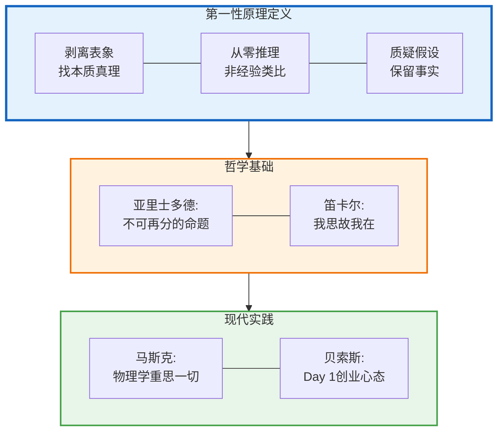

### 1.2 第一性原理 vs 传统思维

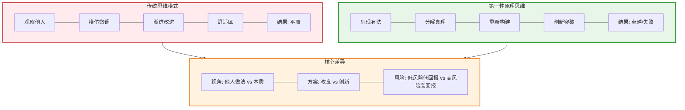

### 1.3 第一性原理的四个层次

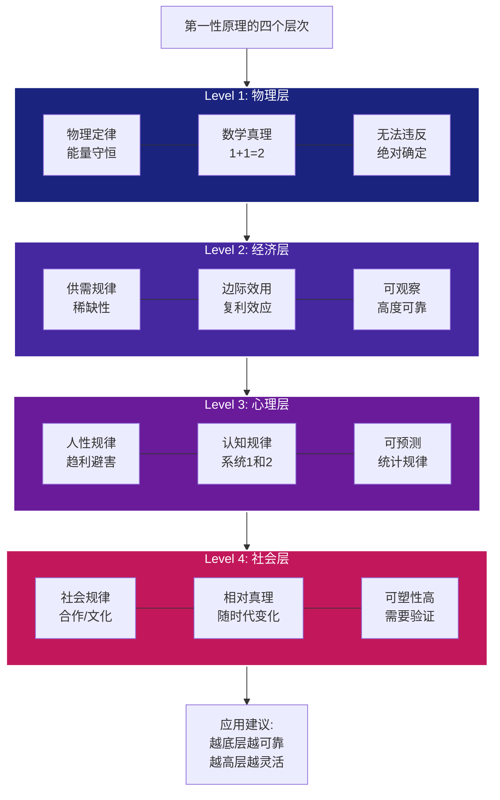

---

## 认知系统与思维模型

### 2.1 双系统理论（《思考，快与慢》）

#### 核心理论：理解你的两个大脑

诺贝尔经济学奖得主Daniel Kahneman在《思考，快与慢》中提出了革命性的**双系统理论**，揭示了我们的大脑实际上有两套思维系统，它们以不同的方式运作。

**为什么理解双系统如此重要？**

想象你正在做一个重大决策——是否辞职创业。你可能会有两种声音：
- 一个声音说："太冒险了！你会失去稳定的收入！"（快速、情绪化）
- 另一个声音说："让我算算财务数据，分析成功概率..."（缓慢、理性）

这不是你的优柔寡断，而是两个系统在运作。理解它们的特点，你才能做出更好的决策。

#### 系统1：快思考（The Fast Brain）

**特点**：
- **自动化**：无需意识控制，瞬间反应
- **省力**：几乎不消耗认知资源
- **情绪化**：基于感觉和直觉
- **快速**：毫秒级响应

**功能**：
- **模式识别**：看到2+2=？，立即知道答案是4
- **印象形成**：见到一个人，瞬间判断好恶
- **经验判断**：开车时自动刹车避险
- **情绪反应**：看到蛇的图片，立即感到恐惧

**优势**：
- ✓ 高效：让我们能够快速应对环境
- ✓ 省力：不需要主动思考就能运作
- ✓ 经验：利用过去的经验快速判断
- ✓ 直觉：在熟悉领域提供准确的第一反应

**劣势**（认知偏差的来源）**：
- ✗ 冲动：容易做出情绪化决策
- ✗ 偏见：受首因效应、锚定效应影响
- ✗ 过度自信：觉得自己的直觉总是对的
- ✗ 启发式陷阱：用简单规则处理复杂问题

**案例：系统1的失败**

**问题**：一支球拍和一个球总共1.10美元，球拍比球贵1美元，球多少钱？

**系统1的答案**：0.10美元（错误！）
- 为什么？因为系统1看到"1.10"和"1"，自动计算1.10-1=0.10

**正确答案**：0.05美元
- 球拍：1.05美元
- 球：0.05美元
- 总计：1.10美元
- 差价：1.00美元

这个例子说明：**系统1会给出看似合理但错误的答案，我们需要系统2来纠正。**

#### 系统2：慢思考（The Slow Brain）

**特点**：
- **有意识**：需要主动启动和控制
- **费力**：消耗大量认知资源
- **理性**：基于逻辑和计算
- **慢速**：需要时间思考

**功能**：
- **逻辑分析**：解数学题、分析复杂问题
- **规划未来**：制定长期计划和策略
- **克制冲动**：抵抗系统1的自动反应
- **深度思考**：哲学思考、创造性问题解决

**优势**：
- ✓ 理性：能够进行逻辑推理和分析
- ✓ 深度：处理复杂、陌生的问题
- ✓ 创造性：产生创新解决方案
- ✓ 纠错：纠正系统1的偏见和错误

**劣势**：
- ✗ 缓慢：需要时间，不适合紧急情况
- ✗ 费力：容易疲劳，一天只能深度工作几小时
- ✗ 懒惰：倾向于让系统1主导（省力）
- ✗ 容量有限：只能同时处理几个变量

**案例：系统2的力量**

**问题**：你该不该创业？

**系统1的反应**：
- "创业太危险了！"（恐惧）
- "我朋友创业失败了！"（可得性偏差）
- "我不够聪明！"（冒名顶替综合症）

**系统2的分析**：
1. **数据收集**：
   - 创业成功率：10-20%（不是0%）
   - 我的优势：技术能力、行业经验、初始客户
   - 风险缓冲：6个月生活费、副业模式

2. **理性计算**：
   - 最坏情况：损失6个月时间，学到经验
   - 最好情况：财务自由，掌控人生
   - 期望值：(10% × 巨大收益) + (90% × 学习经验) > 继续打工的线性增长

3. **决策**：基于数据和逻辑，而非恐惧

#### 两个系统如何协作？

**理想状态**：
1. **系统1负责日常**：开车、走路、简单对话
2. **系统2负责重大决策**：职业选择、创业、投资

**现实问题**：
- 系统2懒惰：容易让系统1主导一切
- 结果：用直觉做重大决策 → 经常出错

**如何激活系统2？**

**触发机制**：
1. **设置决策检查点**：
   - 重大决策前，强制24小时冷静期
   - 用清单提醒自己启动系统2

2. **识别高风险情境**：
   - 情绪激动时（愤怒、兴奋、恐惧）
   - 时间压力下
   - 涉及大额金钱时
   - 不可逆的决策时

3. **使用思考工具**：
   - 写下来：强制系统2参与
   - 列清单：系统化思考
   - 做计算：用数字代替感觉

#### 第一性原理与双系统的结合

**第一性原理是系统2的工具**：

当你用第一性原理思考时，你实际上是：
1. **暂停系统1**：停止自动反应和假设
2. **激活系统2**：进行有意识的分析
3. **从基本真理出发**：避免认知偏差
4. **构建新方案**：创造性思考

**系统1执行第一性原理的结果**：

一旦通过系统2用第一性原理找到了答案，将其变成原则和习惯：
1. **原则化**：将分析结果转化为if-then规则
2. **习惯化**：通过重复让系统1学会
3. **自动化**：让正确的行为变成直觉

**示例**：

**场景**：你看到一个投资机会，对方说"保证月回报10%"

**系统1的反应**：
- "太好了！赶紧投！"（贪婪）
- "大家都在投，我也投！"（从众）

**用第一性原理激活系统2**：
1. **质疑**："月回报10%"是真实的吗？
2. **分解**：
   - 年回报 = (1+10%)^12 = 214%
   - 巴菲特年化回报 ≈ 20%
   - 这个项目比巴菲特厉害10倍？
3. **基本真理**：
   - 高回报必然伴随高风险
   - 保证回报 = 骗局的标志
4. **决策**：拒绝投资

**原则化**（让系统1记住）：
- 原则：任何"保证回报"的投资都不碰
- 下次再遇到，系统1自动说"不"

#### 实践练习2：训练你的系统2

**练习A：识别你的系统1陷阱**（20分钟）

回顾过去一年，列出3个你因为系统1而做出的糟糕决策：

| 决策 | 系统1的反应 | 正确的系统2分析应该是什么？ | 代价 | 学到的原则 |
|------|-----------|------------------------|------|----------|
| 例：冲动买了某课程 | 看到广告焦虑，怕落后 | 真的需要吗？有替代方案吗？ | 3000元 + 时间 | 原则：任何超过500元的非刚需购买，等24小时 |
| 1. | | | | |
| 2. | | | | |
| 3. | | | | |

**练习B：建立系统2决策清单**（30分钟）

针对你生活中的重大决策类型，建立检查清单：

**财务决策清单**（>1000元的支出）：
- [ ] 我真的需要这个吗？（需求验证）
- [ ] 有更便宜的替代方案吗？（成本优化）
- [ ] 我能负担得起吗？（财务能力）
- [ ] 3个月后我还会觉得这个决策是对的吗？（时间检验）
- [ ] 我有没有被情绪或营销影响？（认知偏差检查）

**职业决策清单**（跳槽/创业）：
- [ ] 我的动机是什么？逃避还是追求？
- [ ] 新机会符合我的长期目标吗？
- [ ] 我有足够的信息吗？（数据收集）
- [ ] 最坏情况我能接受吗？（风险评估）
- [ ] 我咨询过3个信任的人吗？（外部视角）

**投资决策清单**：
- [ ] 我真的理解这个投资吗？（能力圈）
- [ ] 回报率是否realistic？（现实检验）
- [ ] 我能承受全部损失吗？（风险承受力）
- [ ] 这符合我的投资原则吗？（原则一致性）

#### 关键技巧：如何强制启动系统2

**技巧1：物理暂停**
- 重大决策前，离开现场
- 散步10分钟，让大脑冷静
- 睡一觉，第二天再决定

**技巧2：写下来**
- 将想法写在纸上
- 写作强制系统2参与
- 看到文字能发现逻辑漏洞

**技巧3：假设倒推**
- 假设你已经做了这个决定，一年后回顾
- "如果失败了，原因会是什么？"（前置验尸）
- "如果成功了，关键因素是什么？"

**技巧4：10-10-10法则**
- 这个决策在10分钟后会怎样？
- 10个月后会怎样？
- 10年后会怎样？

**技巧5：外部视角**
- 如果你的朋友面临同样的问题，你会给他什么建议？
- 去掉情绪，用第三者视角

#### 行动清单：立即开始

**今天**（30分钟）：
- [ ] 完成"识别系统1陷阱"练习
- [ ] 确定你最常面临的3类重大决策
- [ ] 为每类决策建立检查清单

**本周**（2小时）：
- [ ] 阅读《思考，快与慢》核心章节
- [ ] 在手机设置提醒："重大决策前，启动系统2"
- [ ] 实践：用清单做一次实际决策

**本月**（持续）：
- [ ] 每次重大决策后，记录：用了系统1还是系统2？
- [ ] 月末复盘：哪些决策是冲动的？哪些是理性的？
- [ ] 更新你的决策清单

**记住Kahneman的警告**：
> "我们对自己的信念和偏好的信心，通常不能作为其正确性的可靠指标。主观自信不能作为判断准确性的可靠指标。"

**关键洞察**：

1. **系统1不是敌人**：它让我们高效生活
2. **系统2不是万能**：它容易疲劳，需要保护
3. **关键是配合**：日常用系统1，重大决策用系统2
4. **训练系统1**：用系统2建立原则，让系统1执行

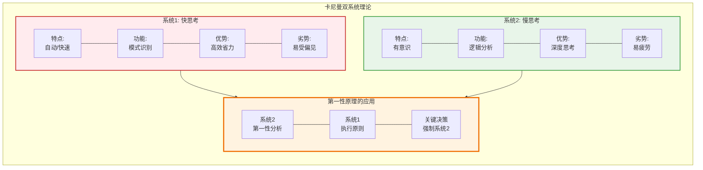

### 2.2 认知偏差地图

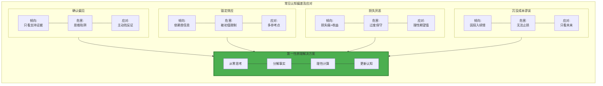

### 2.3 思维模型工具箱

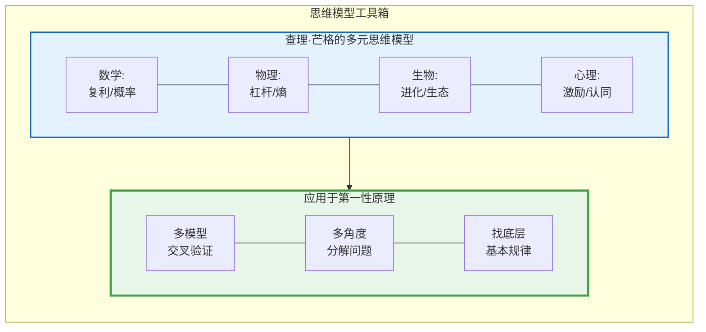

---

## 原则体系构建

### 3.1 Ray Dalio的原则框架

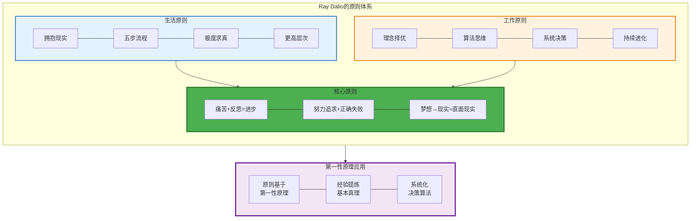

### 3.2 你的个人原则体系

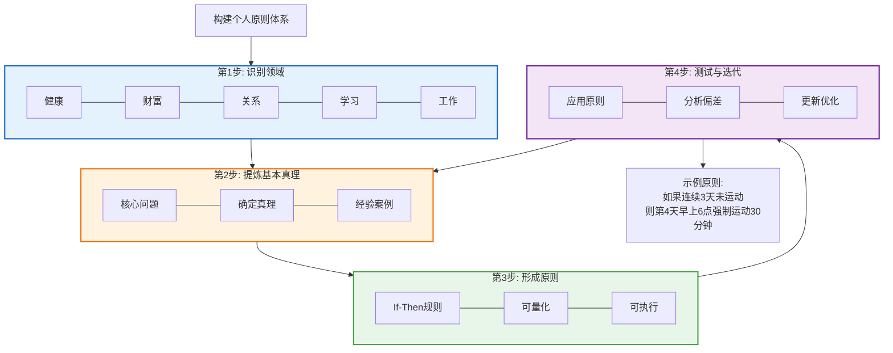

### 3.3 原则的优先级矩阵

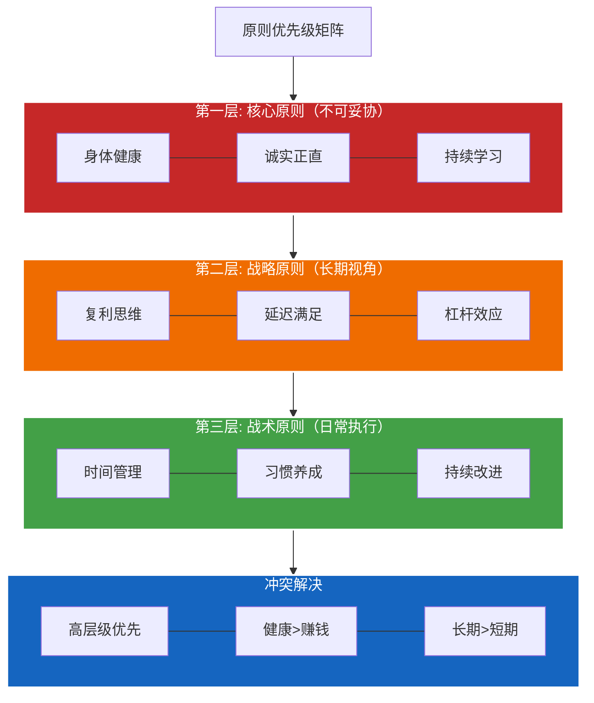

---

## 习惯与复利系统

### 4.1 原子习惯的核心理论

#### 核心理论：微小改变的巨大力量

James Clear在《原子习惯》中提出了一个革命性的观点：**你不需要大的改变，你需要的是1%的持续改进。**

**为什么叫"原子"习惯？**

就像原子是构成物质的最小单位，原子习惯是构成人生成就的最小单位。单个原子微不足道，但无数原子组合起来，能创造出整个宇宙。

**复利公式的震撼**：

```
每天进步1%：(1.01)^365 = 37.78
每天退步1%：(0.99)^365 = 0.03
```

**这意味着什么？**
- 如果你每天进步1%，一年后你是现在的37倍
- 如果你每天退步1%，一年后你几乎归零
- **差距不是1% vs -1% = 2%，而是37.78 vs 0.03 = 1259倍！**

**案例：英国自行车队的逆袭**

2003年前的100年间，英国自行车队：
- 从未赢得过环法自行车赛
- 奥运会金牌屈指可数
- 制造商拒绝卖自行车给他们（怕影响品牌）

2003年，Dave Brailsford担任教练，提出"1%边际改进"策略：
- 重新设计座椅（更舒适1%）
- 改进轮胎抓地力（更好1%）
- 优化车手按摩方式（恢复快1%）
- 测试不同枕头（睡眠质量好1%）
- 甚至教车手正确洗手（少生病1%）

**结果**：
- 2007年：统治田径自行车赛
- 2008-2012年：60%的奥运自行车金牌
- 2012年：首次赢得环法自行车赛
- 之后：连续5年环法冠军

**启示**：不是某一个1%的改进起作用，而是数百个1%的叠加，产生了质变。

#### 习惯的三层架构

James Clear揭示了习惯的三层结构，大多数人从最外层开始（结果），但应该从最内层开始（身份认同）。

**第1层：结果层（Outcomes）**

这是大多数人设定目标的层面：
- "我要减重10公斤"
- "我要赚100万"
- "我要学会Python"

**问题**：
- 目标是短暂的：达成后，动力消失
- 容易复胖、回到原点
- 没有持续的内在驱动力

**第2层：过程层（Process）**

这是关于你做什么：
- "我每天跑步30分钟"
- "我每周编码10小时"
- "我每月存款30%"

**改进**：
- 比结果层好，因为关注行为
- 但仍然缺乏深层动力
- 需要意志力维持

**第3层：身份认同层（Identity）**

这是关于你相信自己是谁：
- "我是一个健康的人"
- "我是一个创造者"
- "我是一个长期主义者"

**威力**：
- **每个行为都是对身份的投票**
- 当行为与身份一致，不需要意志力
- 身份改变，行为自然改变

**案例对比**：

**场景**：有人请你抽烟

**结果导向的人**：
- "不了，我在戒烟"（暗示：我想抽，但为了目标不得不拒绝）
- **问题**：暗示你仍然认同吸烟者身份，只是在忍耐

**身份导向的人**：
- "不了，我不抽烟"（我根本不是吸烟者）
- **威力**：拒绝毫不费力，因为与身份不符

**如何改变身份？**

不是先改变身份再改变行为，而是相反：
1. **小行为** → 2. **证据积累** → 3. **身份转变** → 4. **行为强化**

**示例**：

**目标**：成为"程序员"身份 → "创造者"身份

| 行为 | 对身份的投票 |
|------|------------|
| 写了第一行代码 | "我是在编程的人" |
| 完成了第一个项目 | "我是能完成项目的人" |
| 开源了代码 | "我是愿意分享的人" |
| 解决了用户问题 | "我是创造价值的人" |
| 每天坚持coding | "我是自律的创造者" |

**关键洞察**：不要等到"成为"了某种人再去做某事，而是通过做某事来"成为"某种人。

#### 习惯四法则：让好习惯不可抗拒

James Clear提出了建立习惯的四个法则，以及打破坏习惯的反向法则。

**建立好习惯的四法则**：

**法则1：让提示显而易见（Make it Obvious）**

**原理**：你看不到的习惯，不会去做。

**策略**：
- **环境设计**：
  - 想锻炼？把运动鞋放在床边
  - 想阅读？把书放在枕头上
  - 想喝水？桌上放个水杯

- **执行意图**（Implementation Intention）：
  - 不说："我要锻炼"
  - 而说："每天早上6点，闹钟响后，我立即穿上床边的运动服锻炼30分钟"
  - 格式：**在[时间]，在[地点]，我将[行动]**

- **习惯堆叠**（Habit Stacking）：
  - 公式：**在[当前习惯]之后，我将[新习惯]**
  - 例子：
    - 喝完早上第一杯咖啡后，我冥想5分钟
    - 关闭电脑后，我写3条感恩日记
    - 上床后，我阅读10页书

**法则2：让习惯有吸引力（Make it Attractive）**

**原理**：大脑追求多巴胺，让习惯与奖励关联。

**策略**：
- **诱惑捆绑**（Temptation Bundling）：
  - 把想做的事（诱惑）和应该做的事（习惯）捆绑
  - 例子：
    - 只有在跑步机上时才看Netflix（诱惑）
    - 只有在咖啡店才能刷社交媒体（诱惑）
  - 公式：**在[需要的习惯]之后，我将[想要的奖励]**

- **加入文化**：
  - 和有相同习惯的人在一起
  - 加入跑步俱乐部 → 跑步变得正常
  - 加入编程社区 → 编码变得有趣

- **重新定义**：
  - 不说："我必须锻炼"（负担）
  - 而说："我可以锻炼"（特权）
  - 不说："我必须早起"（痛苦）
  - 而说："我有机会看日出"（美好）

**法则3：让行动轻而易举（Make it Easy）**

**原理**：摩擦力越小，越容易开始。

**策略**：
- **两分钟法则**：
  - 新习惯不应超过2分钟
  - 不说："每天跑5公里"
  - 而说："每天穿上跑鞋"（2分钟）
  - 一旦穿上，通常就会去跑

- **降低摩擦力**：
  - 想健身？加入离家最近的健身房（不是最好的）
  - 想看书？把手机放在另一个房间
  - 想编码？打开电脑就看到IDE

- **增加坏习惯的摩擦力**：
  - 想戒社交媒体？删除App，只保留网页版
  - 想少看视频？注销账号，每次都要重新登录
  - 想控制购物？删除支付信息

**法则4：让奖励令人满足（Make it Satisfying）**

**原理**：我们重复让我们感觉良好的行为。

**策略**：
- **即时奖励**：
  - 完成习惯后，立即给自己一个小奖励
  - 例子：跑步后，喝一杯美味的蛋白奶昔

- **习惯追踪**（Habit Tracking）：
  - 每完成一次，打一个勾 ✓
  - 看到连续的勾会产生满足感
  - 不要打破连续记录的欲望会驱动你

- **永不错过两次**：
  - 错过一次可以原谅
  - 错过两次是建立新习惯
  - 保持弹性，但不放弃

**打破坏习惯的反向法则**：

| 好习惯 | 坏习惯 |
|--------|--------|
| 1. 让提示显而易见 | **让提示隐形** |
| 2. 让习惯有吸引力 | **让习惯没吸引力** |
| 3. 让行动轻而易举 | **让行动困难** |
| 4. 让奖励令人满足 | **让奖励令人不满** |

**示例：戒掉睡前刷手机**

1. **让提示隐形**：睡前把手机放在另一个房间
2. **让习惯没吸引力**：设置手机为黑白模式（不吸引人）
3. **让行动困难**：删除社交App，只保留网页版
4. **让奖励不满**：每次刷手机超过10分钟，第二天必须做100个俯卧撑

#### 复利的三个维度

复利不仅存在于金融领域，它是宇宙的基本规律，适用于所有可积累的事物。

**维度1：财务复利**

**公式**：
```
终值 = 本金 × (1 + 年化收益率)^年数
```

**示例**：
- 25岁，每月投资2000元
- 年化收益率10%
- 投资到65岁（40年）

**结果**：
- 本金投入：2000 × 12 × 40 = 96万
- 最终价值：≈ 1265万
- **复利创造的财富：1169万（92%来自复利）**

**关键洞察**：
1. **时间>收益率**：从25岁开始投10%，胜过35岁开始投15%
2. **永不中断**：即使市场下跌也要坚持
3. **再投资**：股息再投入，加速复利

**维度2：知识复利**

**公式**：
```
知识价值 = 学习质量 × 应用次数 × 传播范围
```

**学习循环**：
1. **学习**：每天1小时深度学习
2. **应用**：立即应用到实际项目
3. **教学**：写博客/做视频，教给别人
4. **反馈**：获得反馈，发现盲点
5. **改进**：优化理解，回到步骤1

**示例：程序员的知识复利**

**第1年**：
- 学习Python（基础）
- 做了3个小项目
- 写了10篇博客
- **价值**：掌握基础，有200个读者

**第2年**：
- 学习高级Python + AI（在基础上叠加）
- 做了5个AI项目（复用第1年代码）
- 写了20篇进阶博客（利用第1年读者）
- **价值**：有1000个读者，开始有咨询收入

**第3年**：
- 掌握完整AI工程栈（前两年积累）
- 做了2个商业项目（前两年客户推荐）
- 出了一门课程（基于前两年内容）
- **价值**：月收入5万，行业影响力

**关键**：
- 第1年的博客持续带来流量
- 第1年的项目成为第2年的基础
- 第2年的读者成为第3年的客户
- **每一步都在之前的基础上复利增长**

**维度3：人脉复利**

**公式**：
```
人脉价值 = 连接数量 × 连接深度 × 价值交换频率
```

**网络效应**：
- 10个强连接 > 1000个弱连接
- 每个强连接又有他们的网络
- 你的网络 = 你的net worth

**建立人脉复利**：

**阶段1：价值输出**（0-2年）
- 不求回报地帮助他人
- 分享你的知识和经验
- 解决别人的问题
- **结果**：建立"有价值"的身份

**阶段2：信任积累**（2-5年）
- 持续输出，建立信任
- 做你说过要做的事
- 长期主义，不急功近利
- **结果**：人们开始主动找你

**阶段3：网络效应**（5-10年）
- 你的联系人互相介绍
- 机会自动找上门
- 你成为连接器（Connector）
- **结果**：指数级增长

**案例：Naval Ravikant**

Naval是如何从普通创业者变成硅谷最有影响力的投资人之一？

1. **早期**（1990s-2000s）：
   - 创业失败，但分享经验
   - 在Twitter上分享创业智慧
   - 不求回报地帮助创业者

2. **积累期**（2000s-2010s）：
   - 持续输出高质量内容
   - 投资了50+创业公司
   - 帮助的创业者开始成功

3. **爆发期**（2010s-现在）：
   - 投资的公司成为独角兽（Uber, Twitter等）
   - 他的推文被数百万人转发
   - 创业者排队请他投资
   - 《纳瓦尔宝典》畅销全球

**关键**：20年持续输出价值，最终形成不可思议的复利效应。

#### 实践练习3：设计你的习惯系统

**练习A：身份认同设计**（30分钟）

**步骤1：定义你的目标身份**

5年后，你想成为什么样的人？写出3个身份标签：
1. 我想成为：_________________（例：自律的创造者）
2. 我想成为：_________________（例：健康的长期主义者）
3. 我想成为：_________________（例：有影响力的导师）

**步骤2：反推需要的习惯**

这种身份的人会做什么？

| 目标身份 | 典型行为（日常习惯） | 我现在有吗？ |
|----------|-------------------|------------|
| 自律的创造者 | 每天早起6点创作2小时 | [ ] 是 [ ] 否 |
| 自律的创造者 | 每周发布1个作品 | [ ] 是 [ ] 否 |
| 健康的长期主义者 | 每天运动30分钟 | [ ] 是 [ ] 否 |
| 健康的长期主义者 | 拒绝垃圾食品 | [ ] 是 [ ] 否 |
| 有影响力的导师 | 每周分享知识 | [ ] 是 [ ] 否 |

**练习B：建立原子习惯**（1小时）

选择1个你想建立的习惯，用四法则设计：

**我的新习惯**：_________________（例：每天早上写作）

**法则1：让提示显而易见**
- 时间：_________（例：每天早上6:00-7:00）
- 地点：_________（例：书房，关闭所有干扰）
- 触发器：________（例：喝完第一杯咖啡后）

**法则2：让习惯有吸引力**
- 捆绑的诱惑：_________（例：写完可以看30分钟YouTube）
- 环境：_________（例：加入早起写作群，每天打卡）

**法则3：让行动轻而易举**
- 两分钟版本：_________（例：打开Notion，写一个标题）
- 降低摩擦：_________（例：前一晚准备好大纲）

**法则4：让奖励令人满足**
- 即时奖励：_________（例：完成后喝一杯喜欢的咖啡）
- 追踪方式：_________（例：日历上打勾）

**练习C：计算你的复利**（30分钟）

**财务复利**：
- 我现在每月能投资：_______元
- 预期年化收益：_______% （建议：指数基金8-10%）
- 投资年限：_______年
- 预期终值：_______元（用复利计算器）

**知识复利**：
- 我每天学习：_______小时
- 我的复利循环：学习 → _______ → _______ → 反馈
- 一年后我将掌握：_________________
- 三年后我能创造的价值：_________________

**行动清单：立即开始**

**今天**（1小时）：
- [ ] 完成身份认同设计练习
- [ ] 选择1个习惯，用四法则设计
- [ ] 准备明天开始的环境（降低摩擦）

**本周**（每天30分钟）：
- [ ] 每天执行新习惯，记录在日历上
- [ ] 观察：哪个环节最困难？
- [ ] 调整：如何让它更容易？

**本月**（持续）：
- [ ] 30天后评估：习惯是否成为自动的？
- [ ] 如果成功，添加第2个习惯
- [ ] 如果失败，分析原因，重新设计

**记住James Clear的话**：
> "你不会上升到目标的高度，而会下降到系统的水平。不要只关注目标，而要爱上系统。"

**关键洞察**：

1. **小>大**：1%的改进 × 365天 = 37倍增长
2. **身份>结果**：成为某种人 > 达成某个目标
3. **系统>目标**：建立系统 > 设定目标
4. **复利>线性**：可积累的事 > 时间换钱的事

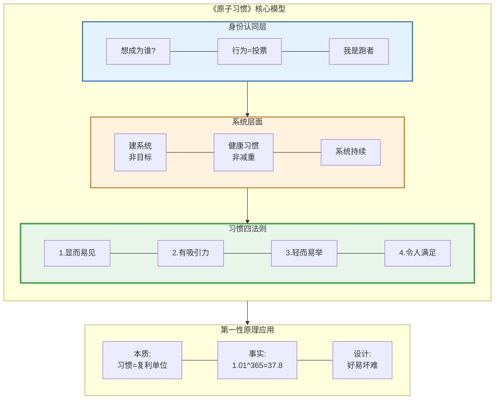

### 4.2 习惯堆栈设计

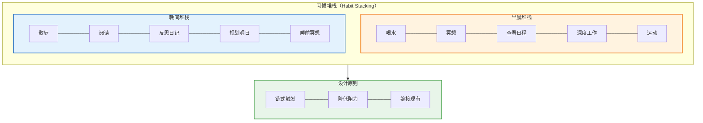

### 4.3 复利的力量

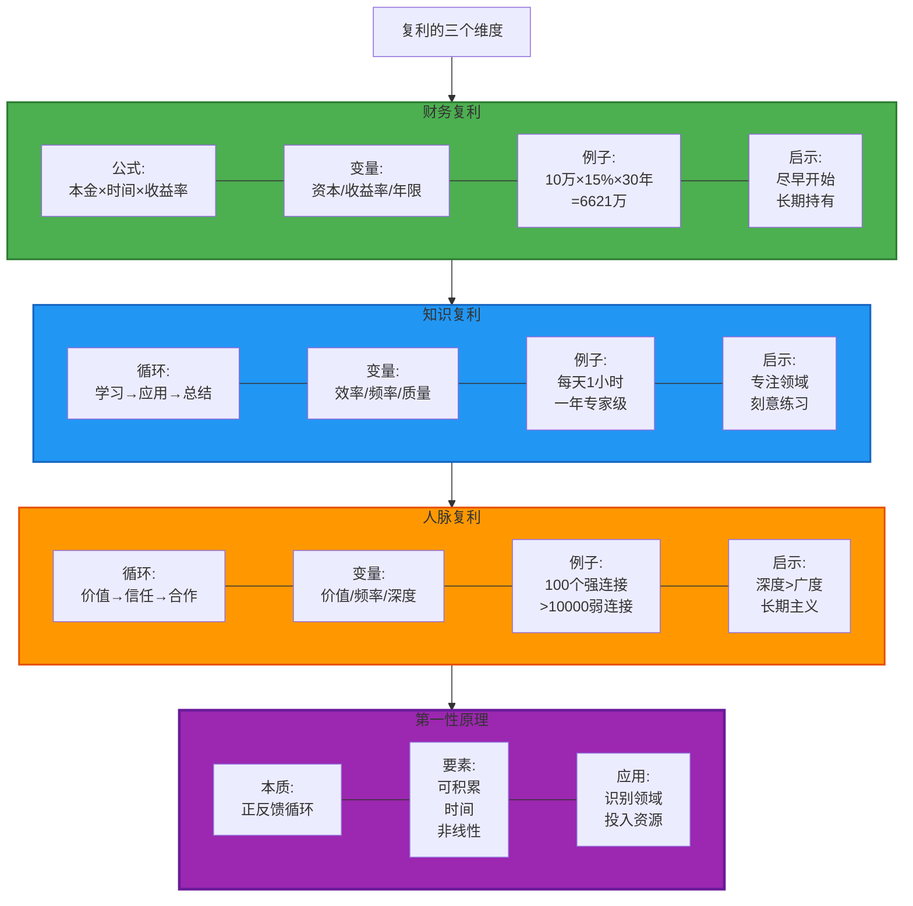

---

## 财富创造路径

### 5.1 财富的本质

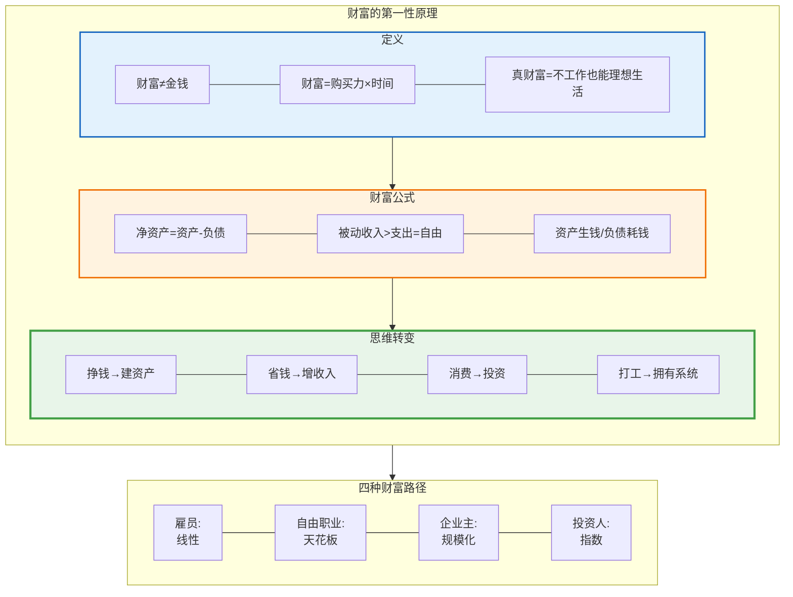

### 5.2 收入来源多元化

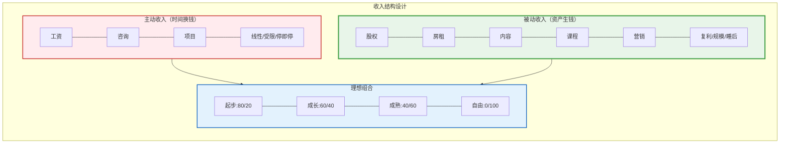

### 5.3 财富积累阶段

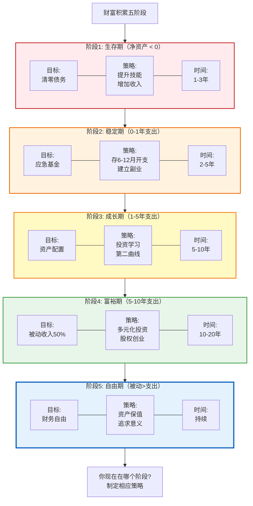

### 5.4 投资决策框架

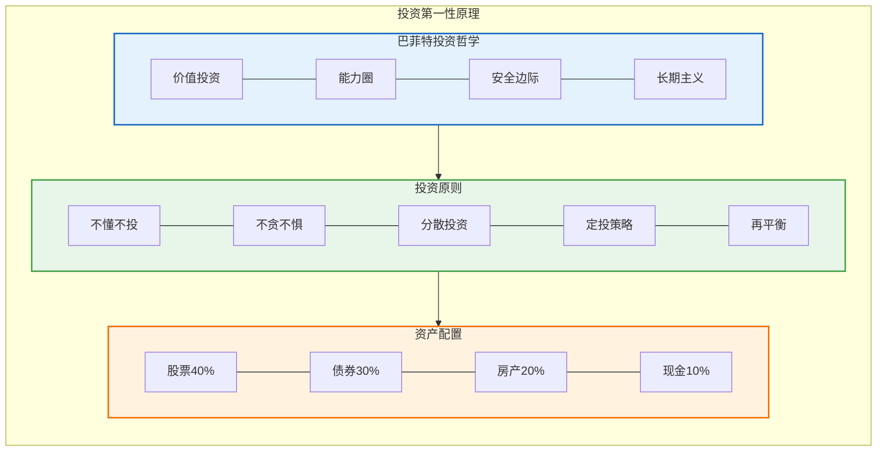

---

## 职业发展架构

### 6.1 职业选择的第一性原理

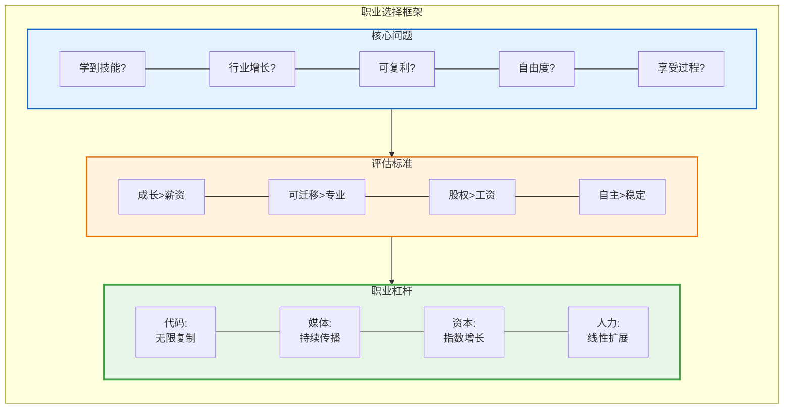

### 6.2 技能树构建

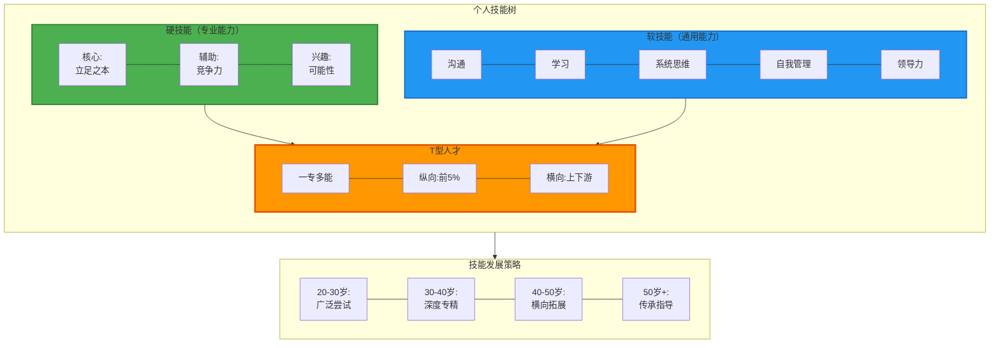

### 6.3 职业发展路径

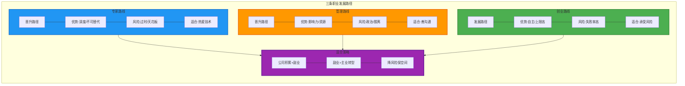

---

## 创业决策框架

### 7.1 是否应该创业？

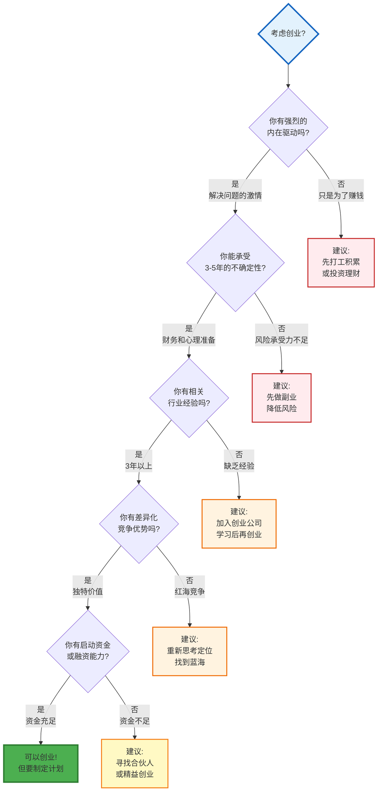

### 7.2 创业方向选择

```mermaid
graph TB
    subgraph Selection["创业方向的第一性原理"]
        direction TB

        subgraph Pain["痛点挖掘"]
            direction LR
            P1[真实痛点]
            P2[高频痛点]
            P3[强痛点]
            P4[大市场]

            P1 --- P2 --- P3 --- P4
        end

        subgraph Solution["解决方案"]
            direction LR
            S1[10倍好]
            S2[更便宜/快/方便]
            S3[竞争壁垒]

            S1 --- S2 --- S3
        end

        subgraph Business["商业模式"]
            direction LR
            B1[盈利路径]
            B2[LTV>3×CAC]
            B3[可规模化]

            B1 --- B2 --- B3
        end

        Pain --> Solution
        Solution --> Business
    end

    style Pain fill:#e3f2fd,stroke:#1565c0,stroke-width:2px
    style Solution fill:#fff3e0,stroke:#ef6c00,stroke-width:2px
    style Business fill:#e8f5e9,stroke:#43a047,stroke-width:3px
```

### 7.3 精益创业方法论

```mermaid
graph TB
    subgraph Lean["精益创业循环"]
        direction LR

        Build[Build<br/>构建MVP]
        Measure[Measure<br/>衡量数据]
        Learn[Learn<br/>学习验证]
        Pivot{转型?}

        Build --- Measure --- Learn --- Pivot
        Pivot -->|否| Build
        Pivot -->|是| Build
    end

    subgraph Principles["关键原则"]
        direction LR
        PR1[快速迭代]
        PR2[小步快跑]
        PR3[数据驱动]
        PR4[专注核心]

        PR1 --- PR2 --- PR3 --- PR4
    end

    subgraph Metrics["核心指标"]
        direction LR
        M1[北极星指标]
        M2[例:DAU/GMV/MRR]
        M3[AARRR模型]

        M1 --- M2 --- M3
    end

    Lean --> Principles
    Lean --> Metrics

    style Lean fill:#4caf50,stroke:#2e7d32,stroke-width:3px
    style Principles fill:#2196f3,stroke:#1565c0,stroke-width:2px
    style Metrics fill:#ff9800,stroke:#e65100,stroke-width:2px
```

### 7.4 创业阶段规划

```mermaid
graph TB
    Start[创业发展四阶段] --> S0

    subgraph S0["0-1阶段: 验证期"]
        direction LR
        S0_1[目标:<br/>PMF验证]
        S0_2[任务:<br/>验证需求<br/>打磨产品]
        S0_3[里程碑:<br/>100个付费用户]
        S0_4[团队:<br/>创始人+核心]
        S0_5[融资:<br/>天使轮]

        S0_1 --- S0_2 --- S0_3 --- S0_4 --- S0_5
    end

    S0 --> S1

    subgraph S1["1-10阶段: 增长期"]
        direction LR
        S1_1[目标:<br/>规模化增长]
        S1_2[任务:<br/>优化转化<br/>增长黑客]
        S1_3[里程碑:<br/>月收入100万]
        S1_4[团队:<br/>搭建核心]
        S1_5[融资:<br/>A轮]

        S1_1 --- S1_2 --- S1_3 --- S1_4 --- S1_5
    end

    S1 --> S2

    subgraph S2["10-100阶段: 扩张期"]
        direction LR
        S2_1[目标:<br/>市场占领]
        S2_2[任务:<br/>多渠道获客<br/>组织建设]
        S2_3[里程碑:<br/>年收入过亿]
        S2_4[团队:<br/>专业管理]
        S2_5[融资:<br/>B/C轮]

        S2_1 --- S2_2 --- S2_3 --- S2_4 --- S2_5
    end

    S2 --> S3

    subgraph S3["100+阶段: 成熟期"]
        direction LR
        S3_1[目标:<br/>行业领导者]
        S3_2[任务:<br/>生态构建<br/>国际化]
        S3_3[里程碑:<br/>IPO/并购]
        S3_4[团队:<br/>企业化运作]

        S3_1 --- S3_2 --- S3_3 --- S3_4
    end

    Death[注意:<br/>90%创业公司死在0-1阶段<br/>原因: 找不到PMF]

    S0 --> Death

    style S0 fill:#e3f2fd,stroke:#1565c0,stroke-width:2px
    style S1 fill:#fff3e0,stroke:#ef6c00,stroke-width:2px
    style S2 fill:#e8f5e9,stroke:#43a047,stroke-width:2px
    style S3 fill:#f3e5f5,stroke:#6a1b9a,stroke-width:2px
    style Death fill:#ffebee,stroke:#c62828,stroke-width:3px
```

---

## 人生操作系统

### 8.1 生命能量管理

```mermaid
graph TB
    subgraph Energy["生命能量的四个维度"]
        direction TB

        subgraph Physical["身体能量"]
            direction LR
            PH1[基础:<br/>睡眠/饮食/运动]
            PH2[原则:<br/>身体第一]
            PH3[习惯:<br/>早睡/训练/体检]

            PH1 --- PH2 --- PH3
        end

        subgraph Emotional["情绪能量"]
            direction LR
            EM1[基础:<br/>积极/稳定/韧性]
            EM2[原则:<br/>管理情绪]
            EM3[习惯:<br/>冥想/感恩/关系]

            EM1 --- EM2 --- EM3
        end

        subgraph Mental["心智能量"]
            direction LR
            ME1[基础:<br/>专注/创造/学习]
            ME2[原则:<br/>深度工作]
            ME3[习惯:<br/>工作/阅读/反思]

            ME1 --- ME2 --- ME3
        end

        subgraph Spiritual["精神能量"]
            direction LR
            SP1[基础:<br/>意义/价值/使命]
            SP2[原则:<br/>超越自我]
            SP3[习惯:<br/>使命/复盘/利他]

            SP1 --- SP2 --- SP3
        end

        Physical --> Emotional
        Emotional --> Mental
        Mental --> Spiritual
    end

    subgraph Priority["能量分配优先级"]
        direction LR
        P1[1.健康40%]
        P2[2.工作30%]
        P3[3.关系20%]
        P4[4.成长10%]

        P1 --- P2 --- P3 --- P4
    end

    Energy --> Priority

    style Physical fill:#4caf50,stroke:#2e7d32,stroke-width:2px
    style Emotional fill:#ff9800,stroke:#e65100,stroke-width:2px
    style Mental fill:#2196f3,stroke:#1565c0,stroke-width:2px
    style Spiritual fill:#9c27b0,stroke:#6a1b9a,stroke-width:2px
```

### 8.2 时间管理矩阵

```mermaid
graph TB
    subgraph Matrix["艾森豪威尔矩阵"]
        direction TB

        subgraph Q1["第一象限：重要且紧急"]
            direction LR
            Q1_1[危机/截止]
            Q1_2[立即处理]
            Q1_3[减少此类]

            Q1_1 --- Q1_2 --- Q1_3
        end

        subgraph Q2["第二象限：重要不紧急"]
            direction LR
            Q2_1[战略/学习/锻炼]
            Q2_2[优先投入]
            Q2_3[高杠杆区]

            Q2_1 --- Q2_2 --- Q2_3
        end

        subgraph Q3["第三象限：不重要但紧急"]
            direction LR
            Q3_1[打扰/会议]
            Q3_2[委派/拒绝]
            Q3_3[他人优先级]

            Q3_1 --- Q3_2 --- Q3_3
        end

        subgraph Q4["第四象限：不重要不紧急"]
            direction LR
            Q4_1[刷手机/闲聊]
            Q4_2[消除]
            Q4_3[高质量休息]

            Q4_1 --- Q4_2 --- Q4_3
        end
    end

    subgraph FirstPrinciple["第一性原理应用"]
        direction LR
        FP1[本质:<br/>时间=生命]
        FP2[真理:<br/>差距在分配]
        FP3[策略:<br/>80%在Q2]

        FP1 --- FP2 --- FP3
    end

    Matrix --> FirstPrinciple

    style Q1 fill:#f44336,color:#ffffff,stroke:#ffffff,stroke-width:2px
    style Q2 fill:#4caf50,color:#ffffff,stroke:#ffffff,stroke-width:3px
    style Q3 fill:#ff9800,color:#ffffff,stroke:#ffffff,stroke-width:2px
    style Q4 fill:#9e9e9e,color:#ffffff,stroke:#ffffff,stroke-width:2px
```

### 8.3 人生平衡轮

```mermaid
graph TB
    subgraph Wheel["生活平衡的八个维度"]
        direction LR

        Health[健康]
        Career[事业]
        Finance[财务]
        Relationship[关系]
        Growth[成长]
        Fun[娱乐]
        Environment[环境]
        Contribution[贡献]

        Health --- Career --- Finance --- Relationship --- Growth --- Fun --- Environment --- Contribution --- Health
    end

    subgraph Exercise["评估练习"]
        direction LR
        E1[1.打分0-10]
        E2[2.画平衡轮]
        E3[3.找最弱项]
        E4[4.季度评估]

        E1 --- E2 --- E3 --- E4
    end

    subgraph Principle["平衡原则"]
        direction LR
        PR1[动态平衡]
        PR2[阶段侧重]
        PR3[整体>局部]
        PR4[定期审视]

        PR1 --- PR2 --- PR3 --- PR4
    end

    Wheel --> Exercise
    Wheel --> Principle

    style Wheel fill:#e3f2fd,stroke:#1565c0,stroke-width:2px
    style Exercise fill:#e8f5e9,stroke:#43a047,stroke-width:2px
    style Principle fill:#fff3e0,stroke:#ef6c00,stroke-width:2px
```

### 8.4 长期主义框架

```mermaid
graph TB
    subgraph LongTerm["长期主义的第一性原理"]
        direction TB

        subgraph Definition["什么是长期主义"]
            direction LR
            D1[时间:<br/>10-20年]
            D2[信念:<br/>时间杠杆]
            D3[行为:<br/>延迟满足]

            D1 --- D2 --- D3
        end

        subgraph Why["为什么要长期主义"]
            direction LR
            W1[复利需时间]
            W2[竞争优势]
            W3[避免焦虑]

            W1 --- W2 --- W3
        end

        subgraph How["如何践行长期主义"]
            direction LR
            H1[长期目标]
            H2[每日系统]
            H3[定期复盘]
            H4[延迟满足]
            H5[持续学习]

            H1 --- H2 --- H3 --- H4 --- H5
        end

        Definition --> Why
        Why --> How
    end

    subgraph Examples["长期主义实践"]
        direction LR
        EX1[巴菲特:<br/>持股几十年]
        EX2[贝索斯:<br/>Day 1思维]
        EX3[芒格:<br/>等待好球]

        EX1 --- EX2 --- EX3
    end

    LongTerm --> Examples

    style Definition fill:#e3f2fd,stroke:#1565c0,stroke-width:2px
    style Why fill:#fff3e0,stroke:#ef6c00,stroke-width:2px
    style How fill:#e8f5e9,stroke:#43a047,stroke-width:3px
```

### 8.5 终极人生问题

```mermaid
graph TB
    subgraph Ultimate["人生的终极问题"]
        direction LR

        Q1[我是谁?]
        Q2[从哪来?]
        Q3[到哪去?]
        Q4[为何活?]
        Q5[留什么?]

        Q1 --- Q2 --- Q3 --- Q4 --- Q5
    end

    subgraph Answers["第一性原理的答案"]
        direction LR

        A1[独特个体]
        A2[经历塑造]
        A3[更好自己]
        A4[创造价值]
        A5[影响世界]

        A1 --- A2 --- A3 --- A4 --- A5
    end

    subgraph Actions["转化为行动"]
        direction LR
        AC1[使命宣言]
        AC2[10年愿景]
        AC3[1年目标]
        AC4[每日行动]
        AC5[定期复盘]

        AC1 --- AC2 --- AC3 --- AC4 --- AC5
        AC5 -.-> AC1
    end

    Ultimate --> Answers
    Answers --> Actions

    style Ultimate fill:#9c27b0,color:#ffffff,stroke:#ffffff,stroke-width:3px
    style Answers fill:#4caf50,stroke:#2e7d32,stroke-width:2px
    style Actions fill:#ff9800,stroke:#e65100,stroke-width:2px
```

---

## 实践行动计划

### 9.1 立即行动清单

```mermaid
graph TB
    subgraph Today["今天就做"]
        T1[✓ 写下你的人生使命]
        T2[✓ 列出3个最重要的目标]
        T3[✓ 设计第一个微习惯]
        T4[✓ 计算你的净资产]
        T5[✓ 评估生活平衡轮]
    end

    subgraph ThisWeek["本周完成"]
        W1[□ 建立晨间习惯堆栈]
        W2[□ 开始记录时间日志]
        W3[□ 找到一个导师或榜样]
        W4[□ 阅读一本相关书籍]
        W5[□ 制定季度OKR]
    end

    subgraph ThisMonth["本月完成"]
        M1[□ 建立应急基金账户]
        M2[□ 开始一个副业项目]
        M3[□ 建立个人知识管理系统]
        M4[□ 运动习惯已坚持30天]
        M5[□ 第一次深度复盘]
    end

    subgraph ThisYear["今年完成"]
        Y1[□ 收入增长30%以上]
        Y2[□ 掌握一项核心技能]
        Y3[□ 建立被动收入来源]
        Y4[□ 读完52本书]
        Y5[□ 成为某领域前5%]
    end

    Today --> ThisWeek --> ThisMonth --> ThisYear

    style Today fill:#4caf50,color:#ffffff,stroke:#ffffff,stroke-width:3px
    style ThisWeek fill:#2196f3,color:#ffffff,stroke:#ffffff,stroke-width:2px
    style ThisMonth fill:#ff9800,color:#ffffff,stroke:#ffffff,stroke-width:2px
    style ThisYear fill:#9c27b0,color:#ffffff,stroke:#ffffff,stroke-width:2px
```

### 9.2 持续改进系统

```mermaid
graph TB
    subgraph PDCA["PDCA循环"]
        direction LR

        Plan[Plan<br/>计划]
        Do[Do<br/>执行]
        Check[Check<br/>检查]
        Act[Act<br/>调整]

        Plan --- Do --- Check --- Act
        Act -.-> Plan
    end

    subgraph Review["定期复盘"]
        direction LR

        Daily[每日5分钟]
        Weekly[每周30分钟]
        Monthly[每月2小时]
        Quarterly[每季半天]
        Yearly[年度1天]

        Daily --- Weekly --- Monthly --- Quarterly --- Yearly
    end

    PDCA --> Review

    style PDCA fill:#4caf50,stroke:#2e7d32,stroke-width:3px
    style Review fill:#2196f3,stroke:#1565c0,stroke-width:2px
```

---

## 关键总结

### 核心原则

```mermaid
graph TB
    subgraph Core["通往财富自由与自我实现的核心原则"]
        direction LR

        P1[1.第一性原理]
        P2[2.长期主义]
        P3[3.系统>目标]
        P4[4.持续学习]
        P5[5.健康第一]
        P6[6.价值创造]
        P7[7.行动偏好]

        P1 --- P2 --- P3 --- P4 --- P5 --- P6 --- P7
    end

    Quote[记住:<br/>'正确道路上慢走<br/>胜过错误道路快跑'<br/>- 巴菲特]

    Core --> Quote

    style Core fill:#4caf50,stroke:#2e7d32,stroke-width:3px
    style Quote fill:#ff9800,stroke:#e65100,stroke-width:2px
```

### 财富自由公式

```mermaid
graph LR
    subgraph Formula["财富自由 = ?"]
        F1[被动收入<br/>Passive Income]
        F2[>]
        F3[生活开支<br/>Living Expenses]

        F1 --> F2
        F2 --> F3
    end

    subgraph Path["实现路径"]
        direction TB

        Step1[↑ 提升主动收入<br/>技能、职位、创业]
        Step2[↓ 控制生活开支<br/>理性消费、避免负债]
        Step3[→ 建立被动收入<br/>投资、资产、系统]
        Step4[× 复利的时间<br/>耐心、长期、坚持]

        Step1 --> Step2 --> Step3 --> Step4
    end

    Formula --> Path

    style Formula fill:#4caf50,color:#ffffff,stroke:#ffffff,stroke-width:3px
    style Path fill:#2196f3,stroke:#1565c0,stroke-width:2px
```

---

## 推荐书单

1. **思维方法**
   - 《思考，快与慢》- Daniel Kahneman
   - 《穷查理宝典》- 查理·芒格
   - 《原则》- Ray Dalio

2. **习惯与行动**
   - 《原子习惯》- James Clear
   - 《刻意练习》- Anders Ericsson
   - 《深度工作》- Cal Newport

3. **财富与投资**
   - 《富爸爸穷爸爸》- Robert Kiyosaki
   - 《巴菲特致股东的信》- 沃伦·巴菲特
   - 《聪明的投资者》- Benjamin Graham

4. **创业与商业**
   - 《从0到1》- Peter Thiel
   - 《精益创业》- Eric Ries
   - 《创新者的窘境》- Clayton Christensen

5. **个人成长**
   - 《高效能人士的七个习惯》- Stephen Covey
   - 《掌控习惯》- James Clear
   - 《心流》- Mihaly Csikszentmihalyi

---

**最后的话**：

> 这份文档是一个系统，不是教条。
>
> 从今天开始，选择一个最小的改变。
>
> 不要试图一次改变所有，而是：
> - 今天建立一个微习惯
> - 本周确立一个原则
> - 本月设定一个目标
> - 今年实现一个突破
>
> 记住：**行动，才是通往改变的唯一道路。**
>
> 祝你实现财富自由与自我价值！
