# 身份认证与访问控制理论架构设计

> 本文档专注于IAM系统、令牌机制、网关认证鉴权的理论架构与设计思想

## 目录

1. [IAM基础理论](#iam基础理论)
2. [身份令牌机制](#身份令牌机制)
3. [网关认证鉴权架构](#网关认证鉴权架构)
4. [权限控制模型](#权限控制模型)
5. [AI Agent身份管理](#ai-agent身份管理)
6. [主流IAM方案架构](#主流iam方案架构)
7. [架构设计模式](#架构设计模式)

---

## IAM基础理论

### 1.1 核心概念体系

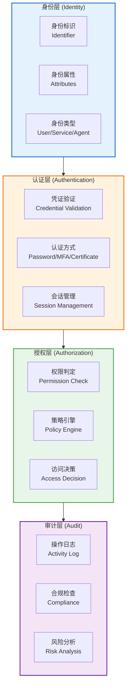

### 1.2 IAM架构的核心问题

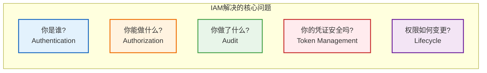

### 1.3 IAM系统的四大职责

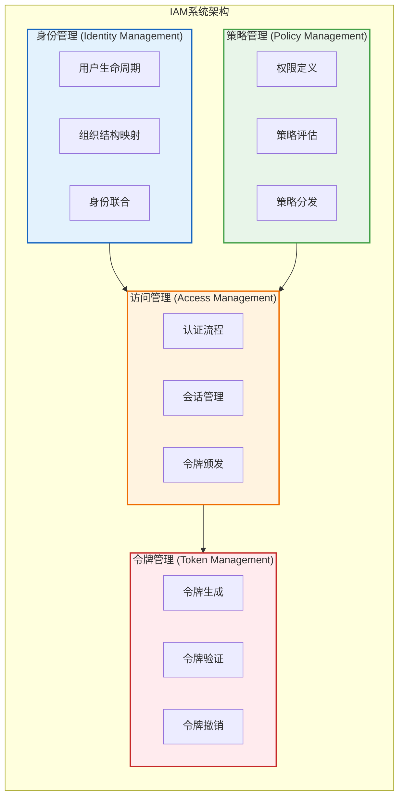

### 1.4 身份、认证、授权的关系

| 层次 | 核心问题 | 输入 | 输出 | 职责边界 |
|------|---------|------|------|---------|
| **身份 (Identity)** | 你声称是谁？ | 用户标识符 | 身份声明 | 标识用户实体 |
| **认证 (Authentication)** | 你真的是这个人？ | 凭证（密码/Token） | 身份确认 | 验证身份真实性 |
| **授权 (Authorization)** | 你可以访问这个资源？ | 身份+资源+动作 | 许可/拒绝 | 判定访问权限 |

---

## 身份令牌机制

### 2.1 令牌类型架构对比

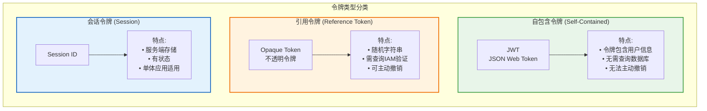

### 2.2 JWT架构设计

#### JWT的三段式结构

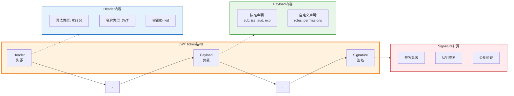

#### JWT签名算法架构

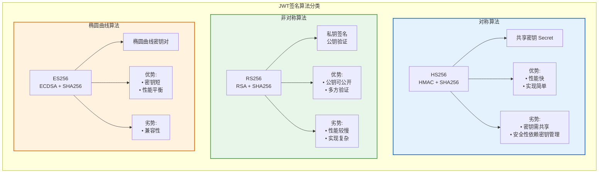

#### JWT标准声明（Claims）

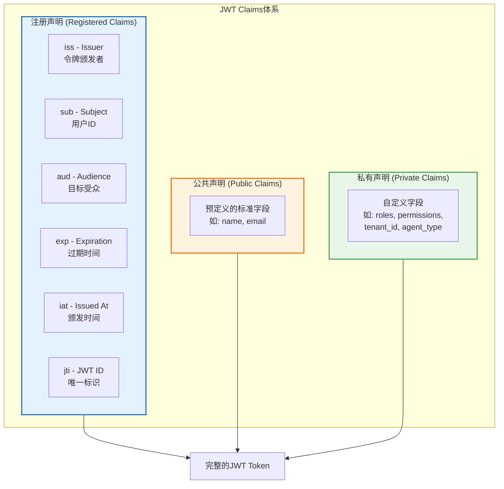

### 2.3 Opaque Token架构

#### Opaque Token验证流程

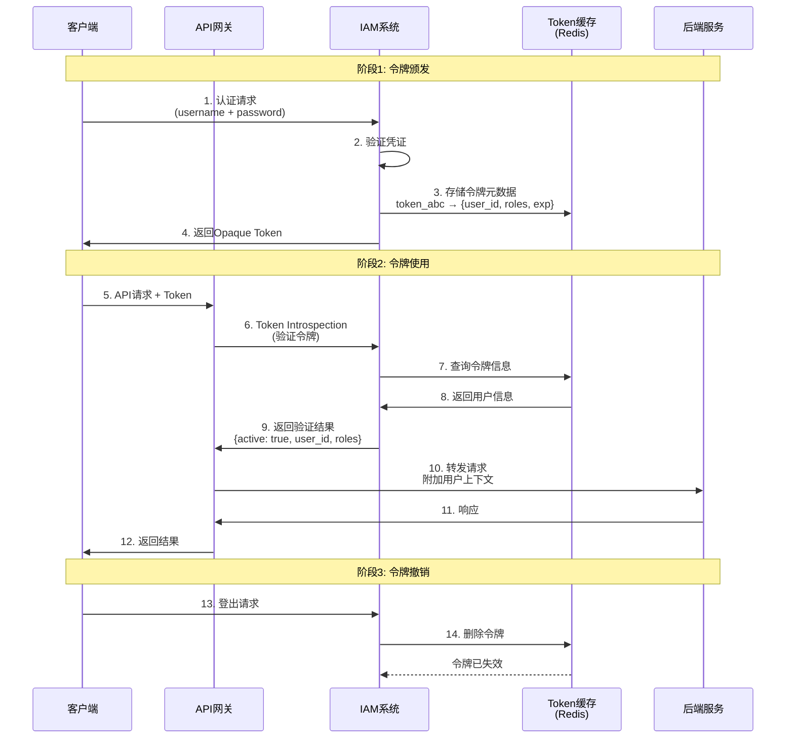

#### Opaque Token的优劣势分析

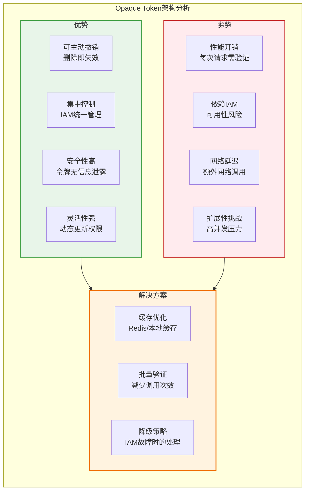

### 2.4 JWT vs Opaque Token决策架构

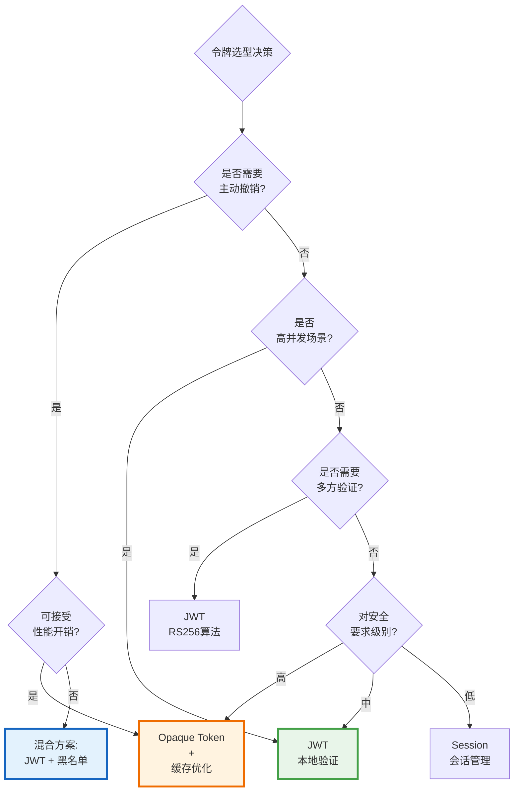

#### 令牌方案对比表

| 维度 | JWT | Opaque Token | Session ID |
|------|-----|-------------|-----------|
| **存储位置** | 客户端（自包含） | 服务端（引用） | 服务端 |
| **验证方式** | 本地验证签名 | 调用IAM Introspection | 查询Session存储 |
| **状态** | 无状态 | 有状态 | 有状态 |
| **撤销能力** | 困难（需黑名单） | 容易（删除即可） | 容易 |
| **性能** | 高（无需查询） | 中（需网络调用） | 中（需查询存储） |
| **可扩展性** | 优（无状态） | 中（依赖IAM） | 差（状态共享） |
| **安全性** | 中（信息可解码） | 高（无信息泄露） | 高 |
| **跨域支持** | 优 | 优 | 差（Cookie限制） |
| **适用场景** | 微服务、API | 金融、高安全 | 单体应用 |

### 2.5 混合令牌架构

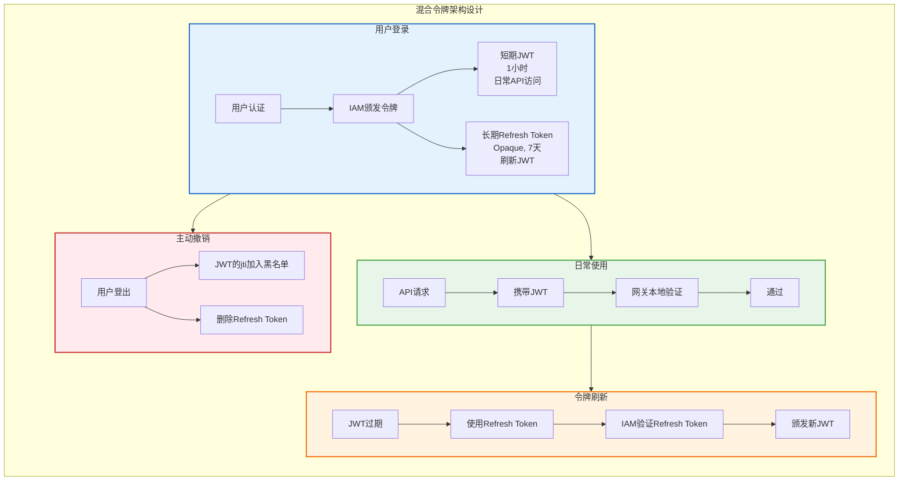

---

## 网关认证鉴权架构

### 3.1 完整认证鉴权流程

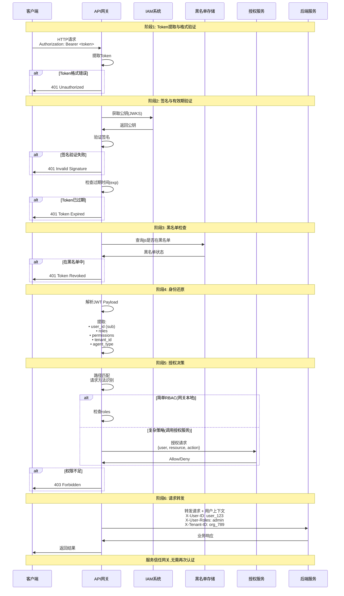

### 3.2 网关身份还原架构

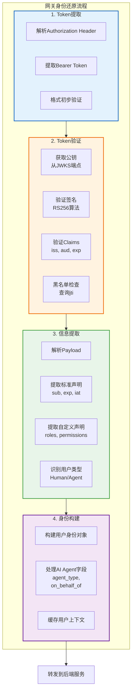

### 3.3 用户上下文传递架构

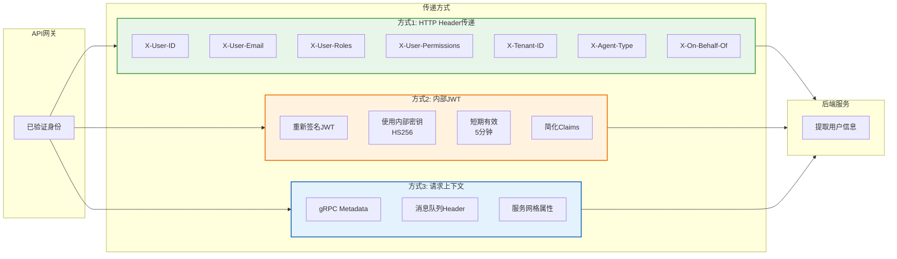

#### 用户上下文传递方式对比

| 传递方式 | 优势 | 劣势 | 适用场景 |
|---------|------|------|---------|
| **HTTP Header** | 简单直接<br/>无需解析<br/>后端易获取 | Header可被篡改<br/>需内部网络信任 | HTTP/REST API<br/>内网服务 |
| **内部JWT** | 防篡改<br/>标准化<br/>可验证 | 需解析Token<br/>性能开销 | 跨服务调用<br/>需验证场景 |
| **gRPC Metadata** | 协议原生支持<br/>类型安全 | 仅限gRPC | 微服务通信 |
| **Service Mesh** | 自动注入<br/>透明传递 | 依赖Mesh基础设施 | Kubernetes环境 |

### 3.4 网关架构模式

#### 单层网关架构

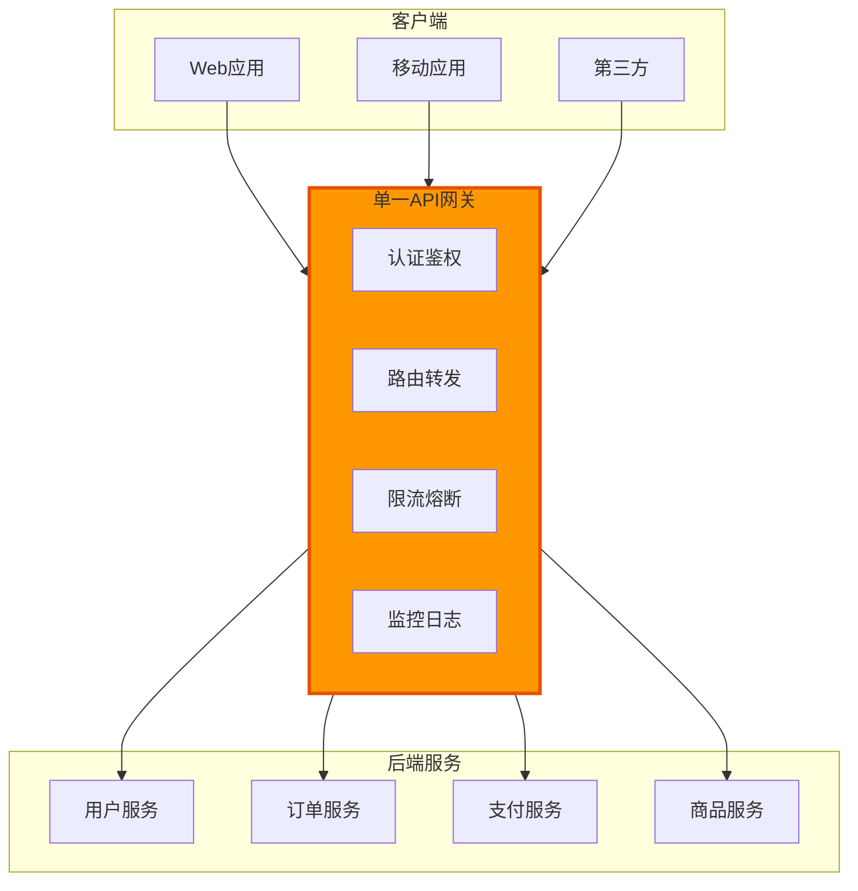

**优势**：
- 架构简单，易于管理
- 统一认证鉴权
- 统一监控和日志

**劣势**：
- 单点故障风险
- 性能瓶颈
- 团队协作困难

---

#### BFF架构（Backend For Frontend）

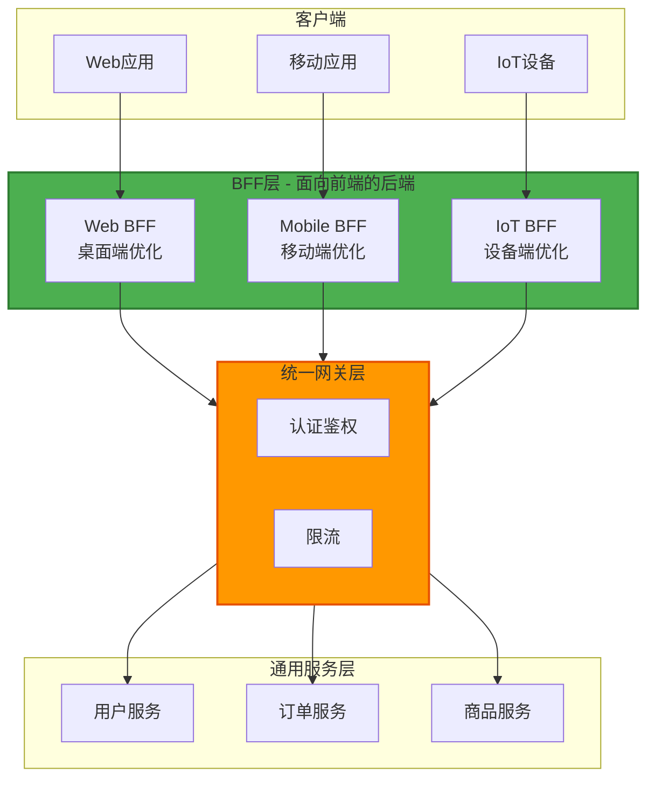

**优势**：
- 按客户端类型定制化
- 减少网络往返
- 团队独立开发

**劣势**：
- 增加维护成本
- 可能代码重复
- 需要更多资源

---

#### 分层网关架构

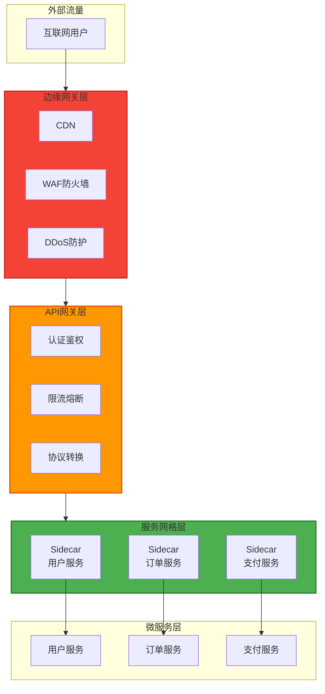

**职责分层**：

| 层次 | 职责 | 关注点 |
|------|------|--------|
| **边缘网关** | 安全防护、流量清洗 | 南北向流量 |
| **API网关** | 认证鉴权、路由、限流 | 应用层逻辑 |
| **服务网格** | 服务发现、负载均衡、熔断 | 东西向流量 |

---

## 权限控制模型

### 4.1 RBAC架构（基于角色的访问控制）

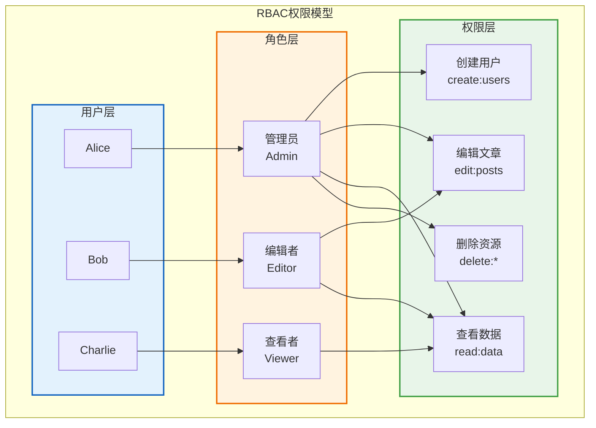

#### RBAC的层级模型

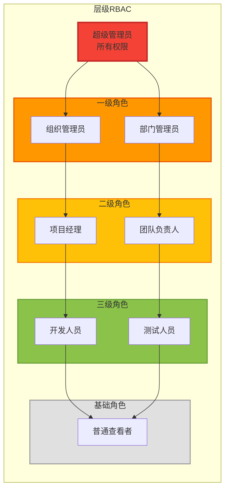

#### RBAC的角色爆炸问题

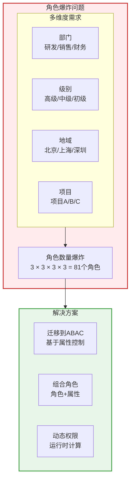

### 4.2 ABAC架构（基于属性的访问控制）

```mermaid
graph TB
    subgraph ABAC["ABAC权限模型"]
        direction TB

        subgraph Subject["主体属性"]
            S1[用户ID]
            S2[部门: 研发]
            S3[级别: 高级]
            S4[地域: 北京]
        end

        subgraph Resource["资源属性"]
            R1[资源类型: 文档]
            R2[分类: 机密]
            R3[所属项目: A]
            R4[创建者: Alice]
        end

        subgraph Action["动作"]
            A1[读取 Read]
            A2[编辑 Edit]
            A3[删除 Delete]
        end

        subgraph Environment["环境属性"]
            E1[时间: 工作时间]
            E2[IP: 内网]
            E3[设备: 公司电脑]
        end

        subgraph Policy["策略引擎"]
            PE[策略评估]
        end

        Subject --> Policy
        Resource --> Policy
        Action --> Policy
        Environment --> Policy

        Policy --> Decision{授权决策}
        Decision -->|允许| Allow[Allow]
        Decision -->|拒绝| Deny[Deny]
    end

    style Subject fill:#e3f2fd,stroke:#1565c0,stroke-width:2px
    style Resource fill:#fff3e0,stroke:#ef6c00,stroke-width:2px
    style Action fill:#e8f5e9,stroke:#43a047,stroke-width:2px
    style Environment fill:#f3e5f5,stroke:#6a1b9a,stroke-width:2px
    style Policy fill:#ffecb3,stroke:#f57f17,stroke-width:3px
```

#### ABAC策略评估流程

```mermaid
sequenceDiagram
    participant User as 用户
    participant App as 应用
    participant PEP as 策略执行点<br/>(PEP)
    participant PDP as 策略决策点<br/>(PDP)
    participant PAP as 策略管理点<br/>(PAP)
    participant PIP as 策略信息点<br/>(PIP)

    User->>App: 访问请求
    App->>PEP: 拦截请求

    Note over PEP: 收集上下文信息
    PEP->>PDP: 授权请求<br/>{subject, resource, action, env}

    Note over PDP: 策略评估开始
    PDP->>PAP: 获取适用策略
    PAP->>PDP: 返回策略规则

    PDP->>PIP: 获取额外属性<br/>(用户部门、资源所有者等)
    PIP->>PDP: 返回属性信息

    Note over PDP: 执行策略计算
    PDP->>PDP: 评估所有策略<br/>结合属性判断

    PDP->>PEP: 授权决策<br/>(Allow/Deny + Obligations)

    alt 决策为Allow
        PEP->>App: 允许访问
        App->>User: 返回结果
    else 决策为Deny
        PEP->>App: 拒绝访问
        App->>User: 403 Forbidden
    end
```

#### RBAC vs ABAC对比

```mermaid
graph TB
    subgraph Comparison["RBAC vs ABAC对比"]
        direction TB

        subgraph RBAC_Char["RBAC特征"]
            RB1[静态权限<br/>基于角色]
            RB2[粗粒度<br/>资源级别]
            RB3[简单直观<br/>易于理解]
            RB4[角色爆炸<br/>维护困难]
        end

        subgraph ABAC_Char["ABAC特征"]
            AB1[动态权限<br/>基于属性]
            AB2[细粒度<br/>实例级别]
            AB3[灵活强大<br/>学习曲线陡]
            AB4[策略复杂<br/>需专业工具]
        end

        subgraph Scenarios["适用场景"]
            SC1[RBAC:<br/>内部管理系统<br/>权限变化少]
            SC2[ABAC:<br/>多租户SaaS<br/>复杂业务规则]
            SC3[混合:<br/>RBAC+ABAC<br/>基础+高级权限]
        end
    end

    RBAC_Char --> Scenarios
    ABAC_Char --> Scenarios

    style RBAC_Char fill:#e3f2fd,stroke:#1565c0,stroke-width:2px
    style ABAC_Char fill:#fff3e0,stroke:#ef6c00,stroke-width:2px
    style Scenarios fill:#e8f5e9,stroke:#43a047,stroke-width:2px
```

| 维度 | RBAC | ABAC |
|------|------|------|
| **粒度** | 粗粒度（资源级） | 细粒度（实例级） |
| **灵活性** | 低（静态角色） | 高（动态属性） |
| **维护成本** | 角色多时高 | 策略复杂时高 |
| **性能** | 快（简单查表） | 慢（策略评估） |
| **学习曲线** | 平缓 | 陡峭 |
| **适用场景** | 传统企业应用 | 多租户、复杂规则 |

### 4.3 ReBAC架构（基于关系的访问控制）

```mermaid
graph TB
    subgraph ReBAC["ReBAC权限模型"]
        direction TB

        subgraph Entities["实体"]
            User[用户: Alice]
            Org[组织: ACME]
            Folder[文件夹: Projects]
            Doc[文档: Design.pdf]
        end

        subgraph Relationships["关系"]
            R1[Alice -member-> ACME]
            R2[Alice -owner-> Folder]
            R3[Folder -parent-> Doc]
            R4[Bob -viewer-> Doc]
        end

        subgraph Permissions["权限推导"]
            P1[Alice是ACME成员<br/>+<br/>ACME拥有Folder<br/>→<br/>Alice可访问Folder]

            P2[Alice拥有Folder<br/>+<br/>Folder是Doc的父级<br/>→<br/>Alice可访问Doc]
        end

        Entities --> Relationships
        Relationships --> Permissions
    end

    style Entities fill:#e3f2fd,stroke:#1565c0,stroke-width:2px
    style Relationships fill:#fff3e0,stroke:#ef6c00,stroke-width:2px
    style Permissions fill:#e8f5e9,stroke:#43a047,stroke-width:2px
```

#### Google Zanzibar模型

```mermaid
graph LR
    subgraph Zanzibar["Google Zanzibar架构"]
        direction LR

        subgraph Tuple["关系元组 (Relation Tuple)"]
            T1[对象<br/>Object]
            T2[关系<br/>Relation]
            T3[主体<br/>Subject]

            Example[示例:<br/>doc:readme#viewer@user:alice]
        end

        subgraph Operations["核心操作"]
            Write[Write<br/>写入关系]
            Read[Read<br/>读取关系]
            Check[Check<br/>检查权限]
            Expand[Expand<br/>展开关系树]
        end

        subgraph Storage["存储层"]
            Spanner[全球分布式存储<br/>Google Spanner]
            Cache[多级缓存<br/>一致性保证]
        end

        Tuple --> Operations
        Operations --> Storage
    end

    style Tuple fill:#e3f2fd,stroke:#1565c0,stroke-width:2px
    style Operations fill:#fff3e0,stroke:#ef6c00,stroke-width:2px
    style Storage fill:#e8f5e9,stroke:#43a047,stroke-width:2px
```

#### 三种权限模型对比

| 维度 | RBAC | ABAC | ReBAC |
|------|------|------|-------|
| **核心机制** | 用户→角色→权限 | 属性评估 | 关系图遍历 |
| **适合场景** | 固定角色体系 | 复杂业务规则 | 层级资源（文档、文件夹） |
| **性能** | 优（快速查表） | 中（策略评估） | 中（图遍历） |
| **表达能力** | 低 | 高 | 中 |
| **维护复杂度** | 角色爆炸风险 | 策略难理解 | 关系图复杂 |
| **典型应用** | 企业内部系统 | 多租户SaaS | Google Drive, GitHub |

---

## AI Agent身份管理

### 5.1 AI Agent身份架构

```mermaid
graph TB
    subgraph Identity["身份类型对比"]
        direction TB

        subgraph Human["人类用户身份"]
            H1[认证方式<br/>密码 + MFA]
            H2[会话周期<br/>短期,1小时]
            H3[权限来源<br/>角色体系]
            H4[审计<br/>直接记录用户]
        end

        subgraph Agent["AI Agent身份"]
            A1[认证方式<br/>API Key / Client Credentials]
            A2[会话周期<br/>长期,7天~永久]
            A3[权限来源<br/>用途限定 + Scope]
            A4[审计<br/>记录Agent + 代理用户]
        end

        subgraph Service["服务账号身份"]
            S1[认证方式<br/>证书 / 密钥对]
            S2[会话周期<br/>按需,15分钟~12小时]
            S3[权限来源<br/>最小权限]
            S4[审计<br/>服务标识]
        end
    end

    style Human fill:#e3f2fd,stroke:#1565c0,stroke-width:2px
    style Agent fill:#fff3e0,stroke:#ef6c00,stroke-width:2px
    style Service fill:#e8f5e9,stroke:#43a047,stroke-width:2px
```

### 5.2 AI Agent令牌设计

```mermaid
graph TB
    subgraph AgentToken["AI Agent JWT设计"]
        direction TB

        subgraph Identity["身份标识"]
            I1[sub: agent_ai_123<br/>Agent唯一ID]
            I2[agent_type: ai_assistant<br/>Agent类型]
            I3[agent_name: Support Bot<br/>Agent名称]
        end

        subgraph Delegation["代理信息"]
            D1[on_behalf_of: user_789<br/>代表哪个用户]
            D2[delegated_by: user_789<br/>由谁授权]
            D3[delegation_scope<br/>授权范围]
        end

        subgraph Permissions["权限控制"]
            P1[roles: ai_agent<br/>角色]
            P2[permissions: [...]<br/>细粒度权限]
            P3[scope: assistant:basic<br/>OAuth Scope]
        end

        subgraph Constraints["约束条件"]
            C1[rate_limit: 1000<br/>速率限制]
            C2[allowed_resources<br/>允许的资源]
            C3[forbidden_actions<br/>禁止的操作]
            C4[time_window<br/>时间窗口]
        end

        Identity --> Delegation
        Delegation --> Permissions
        Permissions --> Constraints
    end

    style Identity fill:#e3f2fd,stroke:#1565c0,stroke-width:2px
    style Delegation fill:#fff3e0,stroke:#ef6c00,stroke-width:2px
    style Permissions fill:#e8f5e9,stroke:#43a047,stroke-width:2px
    style Constraints fill:#ffebee,stroke:#c62828,stroke-width:2px
```

### 5.3 AI Agent授权模式

#### 模式一：自主AI Agent（Client Credentials Flow）

```mermaid
sequenceDiagram
    participant Agent as AI Agent
    participant IAM as IAM系统
    participant Gateway as API网关
    participant Service as 后端服务

    Note over Agent,Service: 适用场景: 完全自主的Agent,无需用户授权

    Agent->>IAM: 1. Token请求<br/>client_id + client_secret<br/>grant_type=client_credentials

    Note over IAM: 验证Agent凭证
    IAM->>IAM: 2. 验证client_id/secret

    Note over IAM: 生成Agent专用Token
    IAM->>Agent: 3. 返回Access Token (JWT)<br/>包含: agent_type, permissions, constraints

    Note over Agent,Service: Agent使用Token访问API

    Agent->>Gateway: 4. API请求 + Access Token

    Note over Gateway: 验证Token并识别Agent身份
    Gateway->>Gateway: 5. 验证JWT<br/>提取: agent_type, permissions

    Note over Gateway: 应用Agent特殊约束
    Gateway->>Gateway: 6. 检查:<br/>• forbidden_actions<br/>• rate_limit<br/>• allowed_resources

    alt 权限检查通过
        Gateway->>Service: 7. 转发请求<br/>X-Agent-Type: ai_assistant<br/>X-Agent-ID: agent_ai_123
        Service->>Gateway: 8. 响应
        Gateway->>Agent: 9. 返回结果
    else 违反约束
        Gateway->>Agent: 403 Forbidden<br/>Agent权限不足
    end
```

**特点**：
- Agent独立身份
- 无用户上下文
- 适合后台任务、数据分析

---

#### 模式二：代理用户的AI Agent（Token Exchange）

```mermaid
sequenceDiagram
    participant User as 用户
    participant App as 应用前端
    participant Agent as AI Agent
    participant IAM as IAM系统
    participant Gateway as API网关
    participant Service as 后端服务

    Note over User,Service: 阶段1: 用户授权Agent

    User->>IAM: 1. 用户登录
    IAM->>User: 2. 返回user_token

    User->>App: 3. 使用AI助手功能
    App->>Agent: 4. 传递user_token

    Note over Agent,IAM: 阶段2: Token Exchange (RFC 8693)

    Agent->>IAM: 5. Token Exchange请求<br/>grant_type=token-exchange<br/>subject_token=user_token<br/>client_id=agent_id<br/>client_secret=agent_secret

    Note over IAM: 验证并交换Token
    IAM->>IAM: 6. 验证user_token
    IAM->>IAM: 7. 验证Agent凭证
    IAM->>IAM: 8. 生成代理Token

    IAM->>Agent: 9. 返回delegated_token<br/>包含:<br/>• agent_type<br/>• on_behalf_of: user_id<br/>• delegated_by: user_id<br/>• 用户的部分权限

    Note over Agent,Service: 阶段3: Agent代表用户访问API

    Agent->>Gateway: 10. API请求 + delegated_token

    Note over Gateway: 验证并识别代理关系
    Gateway->>Gateway: 11. 验证JWT<br/>识别: agent_type + on_behalf_of

    Note over Gateway: 权限检查 - 两层验证
    Gateway->>Gateway: 12. 检查:<br/>① Agent自身权限<br/>② 被代理用户权限<br/>③ 取交集

    alt 权限检查通过
        Gateway->>Service: 13. 转发请求<br/>X-Agent-Type: ai_assistant<br/>X-Agent-ID: agent_123<br/>X-On-Behalf-Of: user_789<br/>X-Original-User-ID: user_789

        Note over Service: 业务逻辑可区分<br/>直接用户访问 vs Agent代理访问
        Service->>Gateway: 14. 响应
        Gateway->>Agent: 15. 返回结果
        Agent->>App: 16. AI处理后的结果
        App->>User: 17. 展示给用户
    else 权限不足
        Gateway->>Agent: 403 Forbidden<br/>Agent无代理权限 或 用户权限不足
    end

    Note over User,Service: 审计日志记录:<br/>操作者: AI Agent (agent_123)<br/>代表用户: user_789<br/>操作: read:documents
```

**特点**：
- Agent拥有用户授权
- 权限不超过用户权限
- 适合聊天助手、个人AI

---

### 5.4 AI Agent权限控制架构

```mermaid
graph TB
    subgraph AuthZ["AI Agent授权决策流程"]
        direction TB

        subgraph Input["输入"]
            I1[Agent Token]
            I2[请求资源]
            I3[请求动作]
        end

        subgraph Identify["1. 身份识别"]
            ID1{是否AI Agent?}
            ID2[提取agent_type]
            ID3[提取on_behalf_of]
        end

        subgraph CheckAgent["2. Agent约束检查"]
            CA1[检查forbidden_actions]
            CA2[检查allowed_resources]
            CA3[检查rate_limit]
        end

        subgraph CheckDelegation["3. 代理权限检查"]
            CD1{是否代理用户?}
            CD2[查询原始用户权限]
            CD3[Agent权限 ∩ 用户权限]
        end

        subgraph Decision["4. 授权决策"]
            Dec{所有检查通过?}
            Allow[Allow]
            Deny[Deny]
        end

        Input --> Identify
        Identify --> ID1
        ID1 -->|是| CheckAgent
        ID1 -->|否| NormalUser[普通用户权限检查]

        CheckAgent --> CA1
        CA1 --> CA2
        CA2 --> CA3
        CA3 --> CheckDelegation

        CheckDelegation --> CD1
        CD1 -->|是| CD2
        CD1 -->|否| DirectAgent[Agent自主权限]
        CD2 --> CD3
        CD3 --> Decision
        DirectAgent --> Decision

        Decision --> Dec
        Dec -->|是| Allow
        Dec -->|否| Deny
    end

    style Identify fill:#e3f2fd,stroke:#1565c0,stroke-width:2px
    style CheckAgent fill:#fff3e0,stroke:#ef6c00,stroke-width:2px
    style CheckDelegation fill:#e8f5e9,stroke:#43a047,stroke-width:2px
    style Decision fill:#ffebee,stroke:#c62828,stroke-width:2px
```

#### AI Agent权限继承模型

```mermaid
graph TB
    subgraph Inheritance["权限继承层次"]
        direction TB

        User[用户权限<br/>roles: [admin, editor]<br/>permissions: [read:*, write:posts]]

        Delegation[授权约束<br/>scope: assistant:basic<br/>只授权基础能力]

        AgentConstraints[Agent约束<br/>forbidden_actions: [delete, admin]<br/>allowed_resources: [posts, comments]]

        FinalPermissions[最终权限<br/>= 用户权限 ∩ 授权范围 ∩ Agent约束<br/><br/>结果:<br/>✓ read:posts<br/>✓ write:posts<br/>✗ delete:posts (forbidden)<br/>✗ read:users (not in allowed_resources)]

        User --> Delegation
        Delegation --> AgentConstraints
        AgentConstraints --> FinalPermissions
    end

    style User fill:#e3f2fd,stroke:#1565c0,stroke-width:2px
    style Delegation fill:#fff3e0,stroke:#ef6c00,stroke-width:2px
    style AgentConstraints fill:#ffebee,stroke:#c62828,stroke-width:2px
    style FinalPermissions fill:#e8f5e9,stroke:#43a047,stroke-width:3px
```

---

## 主流IAM方案架构

### 6.1 云厂商IAM架构对比

#### AWS IAM架构

```mermaid
graph TB
    subgraph AWS["AWS IAM架构"]
        direction TB

        subgraph Identity["身份类型"]
            User[IAM User<br/>长期凭证]
            Role[IAM Role<br/>临时凭证]
            Group[IAM Group<br/>用户分组]
        end

        subgraph Policy["策略类型"]
            Identity_Policy[身份策略<br/>Identity-based]
            Resource_Policy[资源策略<br/>Resource-based]
            Permission_Boundary[权限边界<br/>Permissions Boundary]
            SCP[服务控制策略<br/>SCP]
        end

        subgraph STS["临时凭证"]
            AssumeRole[AssumeRole<br/>角色扮演]
            Federation[Federation<br/>联合身份]
            WebIdentity[Web Identity<br/>社交登录]
        end

        subgraph Resources["AWS资源"]
            S3[S3存储]
            EC2[EC2计算]
            Lambda[Lambda函数]
        end

        Identity --> Policy
        Policy --> STS
        STS --> Resources
        Policy --> Resources
    end

    style Identity fill:#ff9900,stroke:#232f3e,stroke-width:2px
    style Policy fill:#146eb4,stroke:#232f3e,stroke-width:2px
    style STS fill:#759c3e,stroke:#232f3e,stroke-width:2px
```

**核心特点**：
- **策略语言**：JSON格式，支持复杂条件
- **临时凭证**：STS最短15分钟，最长12小时
- **跨账号访问**：通过AssumeRole实现
- **局限性**：仅限AWS生态

---

#### Azure AD架构

```mermaid
graph TB
    subgraph Azure["Azure AD / Microsoft Entra ID架构"]
        direction TB

        subgraph Identity["身份"]
            User_AD[用户<br/>User]
            Group_AD[组<br/>Group]
            ServicePrincipal[服务主体<br/>Service Principal]
            ManagedIdentity[托管标识<br/>Managed Identity]
        end

        subgraph Auth["认证"]
            OAuth2[OAuth 2.0]
            OIDC[OpenID Connect]
            SAML[SAML 2.0]
        end

        subgraph Features["高级功能"]
            CA[条件访问<br/>Conditional Access]
            PIM[特权身份管理<br/>PIM]
            IDP[Identity Protection<br/>风险检测]
        end

        subgraph Apps["应用"]
            M365[Microsoft 365]
            Azure_Resources[Azure资源]
            Third_Party[第三方SaaS]
        end

        Identity --> Auth
        Auth --> Features
        Features --> Apps
    end

    style Identity fill:#0078d4,stroke:#ffffff,stroke-width:2px
    style Auth fill:#50e6ff,stroke:#ffffff,stroke-width:2px
    style Features fill:#00a4ef,stroke:#ffffff,stroke-width:2px
```

**核心特点**：
- **企业级SSO**：与Microsoft生态深度集成
- **条件访问**：基于风险、设备、位置的动态策略
- **托管标识**：Azure资源无需管理密钥
- **B2B/B2C**：支持外部用户和客户身份

---

#### Google Cloud IAM架构

```mermaid
graph TB
    subgraph GCP["Google Cloud IAM架构"]
        direction TB

        subgraph Model["权限模型"]
            Member[成员<br/>Member]
            Role[角色<br/>Role]
            Resource[资源<br/>Resource]

            Binding[Policy Binding:<br/>Member + Role → Resource]

            Member --> Binding
            Role --> Binding
            Binding --> Resource
        end

        subgraph Hierarchy["资源层级"]
            Org[Organization<br/>组织]
            Folder[Folder<br/>文件夹]
            Project[Project<br/>项目]
            Res[Resource<br/>资源]

            Org --> Folder
            Folder --> Project
            Project --> Res
        end

        subgraph Features["特色功能"]
            CEL[IAM Conditions<br/>CEL表达式]
            WI[Workload Identity<br/>K8s集成]
            Analyzer[Policy Analyzer<br/>权限分析]
        end

        Model --> Hierarchy
        Hierarchy --> Features
    end

    style Model fill:#4285f4,stroke:#ffffff,stroke-width:2px
    style Hierarchy fill:#34a853,stroke:#ffffff,stroke-width:2px
    style Features fill:#fbbc04,stroke:#ffffff,stroke-width:2px
```

**核心特点**：
- **简洁模型**：Member-Role-Resource三元组
- **层级继承**：策略自动继承（Org→Folder→Project→Resource）
- **条件策略**：基于CEL（Common Expression Language）
- **Workload Identity**：Kubernetes无密钥访问GCP

---

### 6.2 IDaaS方案架构对比

#### Okta架构

```mermaid
graph TB
    subgraph Okta["Okta IDaaS架构"]
        direction TB

        subgraph Core["核心能力"]
            UD[Universal Directory<br/>统一用户目录]
            SSO[Single Sign-On<br/>单点登录]
            MFA[Adaptive MFA<br/>自适应多因素认证]
            LC[Lifecycle Management<br/>生命周期管理]
        end

        subgraph Integrations["应用集成"]
            Pre[5000+ 预集成应用<br/>Salesforce, Slack, AWS等]
            Custom[自定义应用<br/>OIDC/SAML]
            OnPrem[本地应用<br/>AD Connector]
        end

        subgraph Advanced["高级功能"]
            Workflows[Okta Workflows<br/>低代码自动化]
            API_AM[API Access Management<br/>OAuth服务器]
            CIAM[Customer Identity<br/>B2C场景]
        end

        Core --> Integrations
        Integrations --> Advanced
    end

    style Core fill:#007dc1,stroke:#ffffff,stroke-width:2px
    style Integrations fill:#00c1ff,stroke:#ffffff,stroke-width:2px
    style Advanced fill:#00a9e0,stroke:#ffffff,stroke-width:2px
```

**核心特点**：
- **应用市场**：5000+预集成应用，开箱即用
- **自适应MFA**：基于风险的动态认证
- **Workflows**：可视化自动化，无需编码
- **定价**：$2~15/user/month，适合中大型企业

---

#### Auth0架构

```mermaid
graph TB
    subgraph Auth0["Auth0架构"]
        direction TB

        subgraph Login["Universal Login"]
            Hosted[托管登录页<br/>可定制UI]
            Passwordless[无密码登录<br/>邮箱/短信]
            Social[社交登录<br/>30+提供商]
        end

        subgraph Extensibility["可扩展性"]
            Rules[Rules引擎<br/>JavaScript编程]
            Actions[Actions<br/>工作流自动化]
            Hooks[Hooks<br/>生命周期事件]
        end

        subgraph B2B["B2B能力"]
            Org[Organizations<br/>多租户隔离]
            Branding[租户级品牌<br/>独立UI]
            IdP[企业IdP集成<br/>AD/SAML]
        end

        Login --> Extensibility
        Extensibility --> B2B
    end

    style Login fill:#eb5424,stroke:#ffffff,stroke-width:2px
    style Extensibility fill:#d63aff,stroke:#ffffff,stroke-width:2px
    style B2B fill:#16214d,stroke:#ffffff,stroke-width:2px
```

**核心特点**：
- **开发者友好**：丰富的SDK，几小时集成
- **可编程**：Rules/Actions自定义认证流程
- **B2B多租户**：Organizations支持企业客户隔离
- **定价**：免费7000 MAU，付费$35+/month

---

#### 国内方案：玉符(Authing)架构

```mermaid
graph TB
    subgraph Authing["玉符(Authing)架构"]
        direction TB

        subgraph Core["核心"]
            Fast[快速集成<br/>5分钟接入]
            SDK[多语言SDK<br/>20+]
            Hosted[托管页面]
        end

        subgraph China["中国特色"]
            WeChat[微信生态<br/>公众号/小程序/企业微信]
            Alipay[支付宝登录]
            RealName[实名认证<br/>集成第三方]
            SM[国密算法<br/>SM2/SM3/SM4]
        end

        subgraph Features["功能"]
            Pipeline[Pipeline<br/>类似Auth0 Rules]
            RBAC[权限管理]
            Multi[多租户]
            Webhook[Webhooks]
        end

        Core --> China
        China --> Features
    end

    style Core fill:#396aff,stroke:#ffffff,stroke-width:2px
    style China fill:#ff6a00,stroke:#ffffff,stroke-width:2px
    style Features fill:#00b365,stroke:#ffffff,stroke-width:2px
```

**核心特点**：
- **国内优化**：国内网络环境，响应快
- **微信生态**：深度集成微信、小程序
- **合规支持**：国密算法，等保认证
- **定价**：免费7000 MAU，¥3000~30000/year

---

### 6.3 开源IAM方案架构

#### Keycloak架构

```mermaid
graph TB
    subgraph Keycloak["Keycloak架构"]
        direction TB

        subgraph Core["核心概念"]
            Realm[Realm<br/>租户隔离]
            Client[Client<br/>应用注册]
            User[User<br/>用户]
            Role[Role<br/>角色]
        end

        subgraph Federation["用户联合"]
            LDAP[LDAP/AD集成]
            Custom[自定义User Storage SPI]
            Broker[Identity Brokering<br/>OAuth/OIDC/SAML]
        end

        subgraph Protocols["协议支持"]
            OIDC_KC[OpenID Connect]
            SAML_KC[SAML 2.0]
            OAuth_KC[OAuth 2.0]
        end

        subgraph Extend["扩展性"]
            SPI[SPI扩展点<br/>30+扩展接口]
            Theme[自定义主题<br/>Freemarker模板]
            Event[事件监听<br/>审计集成]
        end

        Core --> Federation
        Federation --> Protocols
        Protocols --> Extend
    end

    style Core fill:#4d4d4d,stroke:#00b8e3,stroke-width:2px
    style Federation fill:#70b1e3,stroke:#ffffff,stroke-width:2px
    style Protocols fill:#f0ab00,stroke:#ffffff,stroke-width:2px
```

**核心特点**：
- **完全开源**：Apache 2.0许可，免费使用
- **功能完整**：SSO、MFA、用户联合、审计
- **高度可扩展**：30+SPI扩展点
- **劣势**：Java应用，资源消耗较大

---

### 6.4 方案选型决策树

```mermaid
graph TB
    Start{IAM需求分析}

    Start --> Q1{部署方式?}
    Q1 -->|云服务| Q2{预算?}
    Q1 -->|私有化| Q3{团队技术能力?}

    Q2 -->|充足<br/>企业级| Okta[Okta<br/>企业SSO门户]
    Q2 -->|充足<br/>开发者| Auth0[Auth0<br/>快速集成]
    Q2 -->|有限<br/>国内| Authing[玉符<br/>性价比高]
    Q2 -->|有限<br/>国外| Auth0_Free[Auth0免费版<br/>7000 MAU]

    Q3 -->|强<br/>复杂需求| Keycloak[Keycloak<br/>完整功能]
    Q3 -->|中<br/>快速上线| Casdoor[Casdoor<br/>轻量级]
    Q3 -->|弱| Cloud[重新考虑云服务]

    Start --> Q4{主要场景?}
    Q4 -->|云资源控制| Q5{云厂商?}
    Q4 -->|应用SSO| Q6{应用类型?}
    Q4 -->|客户身份| CIAM{B2B还是B2C?}

    Q5 -->|AWS| AWS_IAM[AWS IAM]
    Q5 -->|Azure| Azure_AD[Azure AD]
    Q5 -->|GCP| GCP_IAM[Google Cloud IAM]
    Q5 -->|阿里云| Alibaba[阿里云RAM]

    Q6 -->|企业内部| Enterprise{已有AD?}
    Q6 -->|SaaS产品| SaaS_Q{目标市场?}

    Enterprise -->|是| AzureAD_Sync[Azure AD<br/>AD同步]
    Enterprise -->|否| Keycloak

    SaaS_Q -->|国际| Auth0
    SaaS_Q -->|国内| Authing

    CIAM -->|B2B<br/>企业客户| Auth0_Org[Auth0<br/>Organizations]
    CIAM -->|B2C<br/>个人用户| Authing_CIAM[玉符<br/>社交登录]

    style Okta fill:#007dc1,stroke:#ffffff,stroke-width:2px
    style Auth0 fill:#eb5424,stroke:#ffffff,stroke-width:2px
    style Keycloak fill:#4d4d4d,stroke:#00b8e3,stroke-width:2px
    style AWS_IAM fill:#ff9900,stroke:#232f3e,stroke-width:2px
    style Authing fill:#396aff,stroke:#ffffff,stroke-width:2px
```

---

## 架构设计模式

### 7.1 从零构建IAM的参考架构

```mermaid
graph TB
    subgraph Phase1["阶段1: MVP (0-1000用户)"]
        Simple[简单方案:<br/>Auth0/玉符<br/>托管服务]

        Features1[核心功能:<br/>• 用户注册登录<br/>• 密码认证<br/>• 基础RBAC<br/>• JWT Token]
    end

    subgraph Phase2["阶段2: 成长期 (1000-10000用户)"]
        Growth[成长方案:<br/>• 增加MFA<br/>• SSO集成<br/>• LDAP对接]

        Features2[扩展功能:<br/>• 社交登录<br/>• 审计日志<br/>• 用户自服务]
    end

    subgraph Phase3["阶段3: 规模化 (10000+用户)"]
        Scale[规模化方案:<br/>自建Keycloak<br/>或混合架构]

        Features3[高级功能:<br/>• ABAC策略<br/>• 多租户<br/>• API网关集成<br/>• 高可用部署]
    end

    subgraph Phase4["阶段4: 企业级"]
        Enterprise[企业方案:<br/>Azure AD +<br/>Keycloak混合]

        Features4[企业功能:<br/>• 条件访问<br/>• 特权管理<br/>• 身份治理<br/>• 合规审计]
    end

    Phase1 --> Phase2
    Phase2 --> Phase3
    Phase3 --> Phase4

    style Phase1 fill:#e3f2fd,stroke:#1565c0,stroke-width:2px
    style Phase2 fill:#fff3e0,stroke:#ef6c00,stroke-width:2px
    style Phase3 fill:#e8f5e9,stroke:#43a047,stroke-width:2px
    style Phase4 fill:#f3e5f5,stroke:#6a1b9a,stroke-width:2px
```

### 7.2 混合云IAM架构

```mermaid
graph TB
    subgraph Users["用户入口"]
        Employee[企业员工]
        Customer[外部客户]
        Partner[合作伙伴]
    end

    subgraph IdP["身份提供商层"]
        AzureAD[Azure AD<br/>企业员工]
        Auth0_CIAM[Auth0/玉符<br/>客户身份]
        Partner_IdP[合作伙伴IdP<br/>SAML联合]
    end

    subgraph Gateway["统一网关层"]
        Edge[边缘网关<br/>认证聚合]
        API_GW[API网关<br/>Token验证]
    end

    subgraph Internal["内部服务层"]
        Keycloak_Internal[Keycloak<br/>内部微服务SSO]
        ServiceMesh[服务网格<br/>mTLS]
    end

    subgraph Resources["资源层"]
        Cloud1[AWS资源]
        Cloud2[Azure资源]
        OnPrem[本地数据中心]
        K8s[Kubernetes集群]
    end

    Employee --> AzureAD
    Customer --> Auth0_CIAM
    Partner --> Partner_IdP

    AzureAD --> Edge
    Auth0_CIAM --> Edge
    Partner_IdP --> Edge

    Edge --> API_GW
    API_GW --> Keycloak_Internal
    Keycloak_Internal --> ServiceMesh

    ServiceMesh --> Cloud1
    ServiceMesh --> Cloud2
    ServiceMesh --> OnPrem
    ServiceMesh --> K8s

    style IdP fill:#4caf50,stroke:#2e7d32,stroke-width:2px
    style Gateway fill:#ff9800,stroke:#e65100,stroke-width:2px
    style Internal fill:#2196f3,stroke:#1565c0,stroke-width:2px
    style Resources fill:#9c27b0,stroke:#6a1b9a,stroke-width:2px
```

### 7.3 零信任架构下的IAM

```mermaid
graph TB
    subgraph ZeroTrust["零信任IAM架构"]
        direction TB

        subgraph Identity["身份验证 - Never Trust"]
            StrongAuth[强认证<br/>MFA必需]
            Device[设备验证<br/>设备指纹/证书]
            Context[上下文感知<br/>IP/时间/地理位置]
        end

        subgraph Continuous["持续验证 - Always Verify"]
            RiskScore[风险评分<br/>实时计算]
            Adaptive[自适应认证<br/>动态调整MFA强度]
            Reauth[定期重认证<br/>会话有效期短]
        end

        subgraph LeastPrivilege["最小权限"]
            JIT[即时授权<br/>Just-In-Time]
            TimeBoxed[时间限制<br/>临时权限]
            Scoped[范围限定<br/>最小化Scope]
        end

        subgraph Audit["审计与监控"]
            RealTime[实时监控<br/>异常行为检测]
            Log[完整日志<br/>不可篡改]
            Alert[智能告警<br/>威胁响应]
        end

        Identity --> Continuous
        Continuous --> LeastPrivilege
        LeastPrivilege --> Audit
    end

    style Identity fill:#e3f2fd,stroke:#1565c0,stroke-width:2px
    style Continuous fill:#fff3e0,stroke:#ef6c00,stroke-width:2px
    style LeastPrivilege fill:#e8f5e9,stroke:#43a047,stroke-width:2px
    style Audit fill:#ffebee,stroke:#c62828,stroke-width:2px
```

### 7.4 微服务架构中的身份传递

```mermaid
sequenceDiagram
    participant User as 用户
    participant EdgeGW as 边缘网关
    participant APIGW as API网关
    participant ServiceA as 服务A
    participant ServiceB as 服务B
    participant ServiceC as 服务C

    Note over User,ServiceC: 阶段1: 边缘认证
    User->>EdgeGW: 请求 + 用户Token (JWT)
    EdgeGW->>EdgeGW: 验证Token<br/>提取用户身份

    Note over User,ServiceC: 阶段2: 网关转换
    EdgeGW->>APIGW: 内部Token (短期JWT)<br/>HS256签名, 5分钟有效
    APIGW->>APIGW: 验证内部Token<br/>提取用户上下文

    Note over User,ServiceC: 阶段3: 服务间调用 - 方案A (Header传递)
    APIGW->>ServiceA: 请求 + Headers:<br/>X-User-ID<br/>X-User-Roles<br/>X-Tenant-ID

    Note over ServiceA,ServiceC: 服务A调用服务B
    ServiceA->>ServiceB: 透传Headers<br/>(原样传递用户上下文)
    ServiceB->>ServiceB: 从Header提取用户信息<br/>进行业务逻辑

    Note over User,ServiceC: 阶段4: 服务间调用 - 方案B (Service Mesh)
    ServiceB->>ServiceC: gRPC请求

    Note over ServiceB,ServiceC: Service Mesh自动注入<br/>用户上下文到Metadata
    ServiceC->>ServiceC: 从gRPC Metadata提取<br/>用户信息

    ServiceC->>ServiceB: 响应
    ServiceB->>ServiceA: 响应
    ServiceA->>APIGW: 响应
    APIGW->>EdgeGW: 响应
    EdgeGW->>User: 最终响应

    Note over User,ServiceC: 全链路保持用户身份<br/>每层可进行权限检查
```

### 7.5 Token生命周期管理架构

```mermaid
graph TB
    subgraph Lifecycle["Token生命周期"]
        direction TB

        subgraph Issue["1. 颁发阶段"]
            Login[用户登录]
            Generate[生成Token对]
            ShortJWT[Access Token<br/>JWT, 1小时]
            LongRefresh[Refresh Token<br/>Opaque, 7天]

            Login --> Generate
            Generate --> ShortJWT
            Generate --> LongRefresh
        end

        subgraph Use["2. 使用阶段"]
            API[API请求]
            Validate[验证Access Token]
            Cache[本地缓存公钥<br/>减少验证开销]

            API --> Validate
            Validate --> Cache
        end

        subgraph Refresh["3. 刷新阶段"]
            Expired[Access Token过期]
            UseRefresh[使用Refresh Token]
            IAMCheck[IAM验证Refresh Token]
            NewAccess[颁发新Access Token]

            Expired --> UseRefresh
            UseRefresh --> IAMCheck
            IAMCheck --> NewAccess
        end

        subgraph Revoke["4. 撤销阶段"]
            Logout[用户登出]
            Suspicious[检测到可疑活动]
            AdminRevoke[管理员强制撤销]

            Blacklist[加入黑名单]
            Delete[删除Refresh Token]
            Notify[通知所有网关]

            Logout --> Blacklist
            Suspicious --> Blacklist
            AdminRevoke --> Blacklist

            Blacklist --> Delete
            Delete --> Notify
        end

        Issue --> Use
        Use --> Refresh
        Refresh --> Use
        Use --> Revoke
    end

    style Issue fill:#e3f2fd,stroke:#1565c0,stroke-width:2px
    style Use fill:#e8f5e9,stroke:#43a047,stroke-width:2px
    style Refresh fill:#fff3e0,stroke:#ef6c00,stroke-width:2px
    style Revoke fill:#ffebee,stroke:#c62828,stroke-width:2px
```

---

## 总结与最佳实践

### 核心设计原则

| 原则 | 说明 | 实施建议 |
|------|------|---------|
| **最小权限** | 只授予完成任务所需的最小权限 | 默认拒绝，显式授权 |
| **职责分离** | 认证、授权、审计分离 | 独立的IAM服务 |
| **深度防御** | 多层安全控制 | 边缘+网关+服务多层验证 |
| **零信任** | 永不信任，始终验证 | 持续验证，短期凭证 |
| **可审计** | 所有操作可追溯 | 完整日志，不可篡改 |

### 方案选型矩阵

| 场景 | 用户规模 | 推荐方案 | 理由 |
|------|---------|---------|------|
| **初创公司** | < 1000 | Auth0/玉符 | 快速集成，免费额度 |
| **成长期** | 1000-10000 | Keycloak自建 | 成本控制，功能完整 |
| **大型企业** | 10000+ | Azure AD + Keycloak | 混合架构，各取所长 |
| **云原生** | 任意 | 云厂商IAM + Keycloak | 云资源用云IAM，应用用Keycloak |
| **多云环境** | 任意 | 统一IDaaS (Okta) | 跨云统一身份 |

### 安全建议

```mermaid
graph TB
    subgraph Security["IAM安全最佳实践"]
        direction TB

        subgraph Token["Token安全"]
            T1[使用非对称算法<br/>RS256/ES256]
            T2[短期Access Token<br/>1小时]
            T3[长期Refresh Token<br/>Opaque格式]
            T4[Token黑名单机制]
        end

        subgraph Transport["传输安全"]
            TR1[强制HTTPS<br/>TLS 1.3]
            TR2[HSTS启用]
            TR3[证书固定<br/>移动应用]
        end

        subgraph Auth["认证安全"]
            A1[强制MFA<br/>管理员必需]
            A2[密码策略<br/>复杂度+历史]
            A3[防暴力破解<br/>账号锁定]
            A4[异常检测<br/>新设备/地理位置]
        end

        subgraph Audit["审计与监控"]
            AU1[完整日志<br/>认证/授权/敏感操作]
            AU2[实时告警<br/>异常登录/权限变更]
            AU3[定期审计<br/>权限回收]
        end
    end

    style Token fill:#e3f2fd,stroke:#1565c0,stroke-width:2px
    style Transport fill:#fff3e0,stroke:#ef6c00,stroke-width:2px
    style Auth fill:#e8f5e9,stroke:#43a047,stroke-width:2px
    style Audit fill:#ffebee,stroke:#c62828,stroke-width:2px
```

---

## 参考资源

### 标准规范
- [RFC 7519: JWT](https://tools.ietf.org/html/rfc7519)
- [RFC 8693: Token Exchange](https://tools.ietf.org/html/rfc8693)
- [RFC 7662: Token Introspection](https://tools.ietf.org/html/rfc7662)
- [OAuth 2.1](https://oauth.net/2.1/)
- [OpenID Connect Core](https://openid.net/specs/openid-connect-core-1_0.html)
- [NIST SP 800-63B: Digital Identity Guidelines](https://pages.nist.gov/800-63-3/sp800-63b.html)

### 云厂商文档
- [AWS IAM Best Practices](https://docs.aws.amazon.com/IAM/latest/UserGuide/best-practices.html)
- [Azure AD Architecture](https://docs.microsoft.com/en-us/azure/active-directory/architecture/architecture)
- [Google Cloud IAM Overview](https://cloud.google.com/iam/docs/overview)
- [Google Zanzibar Paper](https://research.google/pubs/pub48190/)

### 开源项目
- [Keycloak](https://www.keycloak.org/)
- [Casdoor](https://casdoor.org/)
- [ORY Hydra](https://www.ory.sh/hydra/)
- [OpenFGA (Zanzibar实现)](https://openfga.dev/)

### 书籍推荐
- *OAuth 2.0 in Action* by Justin Richer
- *Solving Identity Management in Modern Applications* by Yvonne Wilson
- *Zero Trust Networks* by Evan Gilman
