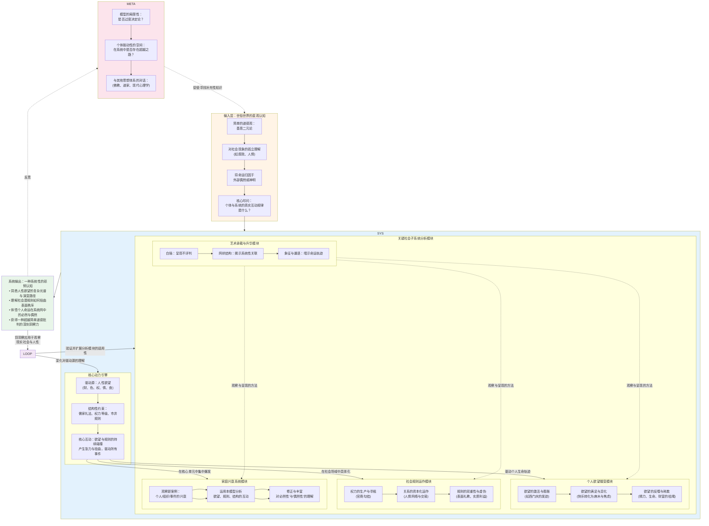

# 【人生好书】《金瓶梅》知识体系全解析

> "好的，作为一名知识体系架构师，我将对《金瓶梅》进行深度解构与重组，超越其作为一部'世情小说'的文学范畴，将其构建为一个关于人性、社会结构与命运因果的复杂系统认知模型。"

---

## 第一部分：核心系统架构图

---

## 第二部分：核心观点与方法论深度解析

### 1. 核心观点层（15个关键洞察）

#### **核心观点1：欲望不是罪恶，而是系统的原始燃料**
- **核心定义**：《金瓶梅》不简单地谴责欲望（财、色、权、食、情），而是将其视为驱动人类行为和社会运转的基础能量。问题不在于欲望本身，而在于欲望如何被激发、满足、异化，以及在何种规则框架下运作。
- **为何重要（原理）**：这打破了传统道德说教的简化逻辑。承认欲望的客观存在，才能真正理解人性与社会的复杂运作机制，而非停留在"应该如何"的空洞说教。
- **关键证据/案例**：西门庆的性欲、财欲并非天生邪恶，而是在特定社会结构（官商勾结、权力寻租、礼教虚伪）中被无限放大和扭曲。潘金莲的欲望（对爱情、尊严、安全感的渴求）在被压抑的环境中转化为极端的占有欲和破坏性。
- **常见误区/障碍**：误以为本书在宣扬纵欲或单纯批判欲望。实际上，它在冷静地解剖欲望在系统中的运作逻辑与后果。
- **实践启示**：在现实中，不要简单地压抑或放纵欲望，而要理解其来源、识别其被社会机制放大或扭曲的方式，并建立健康的满足与调节机制。

#### **核心观点2：规则的双重性——明面礼法与暗面交易的共存**
- **核心定义**：书中社会表面遵循儒家礼法（三纲五常、孝悌忠信），实质运行逻辑却是权力、金钱、人情的暗中交换。规则不是被打破，而是被"双轨制"运行：一套用于表演，一套用于实操。
- **为何重要（原理）**：这揭示了制度与实践的深刻裂痕。当明规则与潜规则长期背离，系统必然走向虚伪、腐败与崩溃。
- **关键证据/案例**：西门庆通过贿赂蔡京获得官职，表面是"朝廷选贤"，实质是权钱交易。家中妻妾表面恪守"妇德"，实则勾心斗角、争宠夺权。葬礼、祭祀等仪式极尽奢华，但无人真正悲伤或敬畏。
- **常见误区/障碍**：认为这只是古代封建社会的特殊现象。实际上，任何社会都可能出现规则的双重化，关键在于监督机制与文化诚信度。
- **实践启示**：在组织或社群中，警惕"说一套做一套"的文化。当潜规则压倒明规则时，系统已进入危险区。

#### **核心观点3：人际关系的"资本化"——一切皆可交换**
- **核心定义**：书中几乎所有人际关系（夫妻、主仆、朋友、官民）都被纳入交换逻辑：性换取安全感，金钱换取权力，忠诚换取庇护，人情换取利益。关系不再是情感连接，而是资源流通的管道。
- **为何重要（原理）**：这是现代"工具理性"对人际关系异化的早期文学呈现。当关系彻底资本化，人失去了作为"目的"的价值，仅剩作为"手段"的功能，导致普遍的孤独、焦虑与不安全感。
- **关键证据/案例**：潘金莲用身体换取西门庆的宠爱与地位；西门庆用金钱收买官员、僧道、帮闲；应伯爵等帮闲用奉承换取饭局与小利；吴月娘的"正妻"地位本质是一种产权与继承权的保障。
- **常见误区/障碍**：认为这种交换是"人性本恶"的体现。实际上，这是特定社会结构（缺乏法治、权力不受制约、精神信仰缺失）的必然产物。
- **实践启示**：反思自己的人际关系：哪些是真正的情感连接？哪些已被功利计算主导？过度的关系资本化会导致精神贫瘠。

#### **核心观点4：权力的核心节点效应——系统围绕个人运转的脆弱性**
- **核心定义**：西门庆家族是一个高度中心化的系统，所有资源、关系、秩序都依赖于他这个核心节点。他的存在维持着整个生态的运转，他的死亡则导致系统瞬间崩解。
- **为何重要（原理）**：这揭示了"强人依赖型"组织的致命缺陷。当系统过度依赖单一节点，其韧性极低，一旦核心崩溃，连锁反应不可避免。
- **关键证据/案例**：西门庆在世时，妻妾、仆人、帮闲、生意伙伴各安其位；他一死，潘金莲被逐、李瓶儿早亡、财产被侵吞、家族迅速衰败。应伯爵等帮闲立即转投他人门下。
- **常见误区/障碍**：将西门庆之死视为个人道德报应。实际上，这更是系统设计缺陷的必然结果——缺乏制度化、去中心化的机制。
- **实践启示**：在组织管理中，避免"一人决策、众人依附"的模式。建立制度化、可持续的运作机制，降低对关键个人的依赖。

#### **核心观点5：欲望满足的"边际递减"与"成瘾螺旋"**
- **核心定义**：西门庆的纵欲历程展示了一个经典的成瘾模型：初期刺激带来快感，随后需要更强刺激才能达到同等快感，最终陷入无法满足的焦虑与空虚，直至身体崩溃。
- **为何重要（原理）**：这是对"享乐适应"（hedonic adaptation）和"多巴胺陷阱"的文学化呈现。揭示了单纯追求感官刺激的自我毁灭性。
- **关键证据/案例**：西门庆从娶妻纳妾，到服用春药，到追求更极端的性体验，最终在与潘金莲的疯狂纵欲中暴毙。每一次满足后的空虚感更强，驱使他寻求更强刺激。
- **常见误区/障碍**：认为这只是性欲的问题。实际上，这一模式适用于所有类型的欲望（消费、权力、名声）。
- **实践启示**：警惕任何形式的"成瘾螺旋"。真正的满足感来自内在意义与平衡，而非外在刺激的不断升级。

#### **核心观点6：女性在父权结构中的"内卷化竞争"**
- **核心定义**：书中女性（尤其是妻妾）被困在一个封闭的竞争场域中，她们无法改变游戏规则（父权制、一夫多妻制），只能在规则内以极端手段争夺有限资源（宠爱、财产、地位）。
- **为何重要（原理）**：这揭示了结构性压迫如何将受害者转化为互相伤害的施暴者。当无法挑战系统本身，人们会将攻击性转向同处弱势的他者。
- **关键证据/案例**：潘金莲与李瓶儿的争宠、潘金莲毒害李瓶儿之子、孙雪娥的告密、春梅的报复。她们的聪明才智与生命能量，全部消耗在内部倾轧中。
- **常见误区/障碍**：简单地批判女性的"恶毒"或"愚昧"。实际上，她们是结构的囚徒，其行为是在极端约束下的理性选择（尽管结果是集体悲剧）。
- **实践启示**：识别"内卷化竞争"的场景（如某些职场、学校）。真正的出路不是在内卷中"卷赢"，而是质疑并改变游戏规则本身。

#### **核心观点7：财富的"熵增"定律——奢靡消费作为系统崩溃的加速器**
- **核心定义**：西门庆家族的财富积累速度远不及其挥霍速度。无节制的宴饮、服饰、房屋装修、宗教仪式、人情开销，使财富如流水般消散，最终导致经济基础的崩塌。
- **为何重要（原理）**：这展示了"消费主义"的自我毁灭性。当消费不再服务于真实需求，而是成为炫耀、麻痹、填补空虚的工具，系统的熵值（混乱度）不断增加，直至崩溃。
- **关键证据/案例**：书中大量篇幅描写奢华宴席、昂贵礼物、豪华葬礼。西门庆死后，吴月娘发现家中债务累累，生意亏空，不得不变卖家产。
- **常见误区/障碍**：认为这只是个人不善理财。实际上，这是整个社会文化（炫耀性消费、面子文化、仪式主义）的必然产物。
- **实践启示**：警惕"消费升级"陷阱。真正的富足不在于拥有多少，而在于需求与资源的平衡，以及消费是否服务于真实的幸福感。

#### **核心观点8：精神真空与"低级替代品"的泛滥**
- **核心定义**：书中人物普遍缺乏真正的精神信仰或人生意义，转而用感官刺激（性、食、娱乐）、迷信（求神拜佛、算命）、虚荣（攀比、炫耀）来填补内在空虚。
- **为何重要（原理）**：当社会缺乏有效的精神资源（真诚的宗教、哲学、艺术、教育），人们会本能地寻找"廉价替代品"，但这些替代品无法提供真正的意义感，反而加剧焦虑与虚无。
- **关键证据/案例**：西门庆频繁请僧道做法事，但从不真正反思；潘金莲在空虚时只能通过性与权力斗争寻求刺激；吴月娘虔诚拜佛，但佛教对她只是心理安慰，未能转化为真正的智慧或慈悲。
- **常见误区/障碍**：认为古人比现代人更有信仰。实际上，书中展示的是信仰的形式化与工具化，与真正的精神生活无关。
- **实践启示**：反思自己用什么填补空虚？是短视频、购物、社交媒体，还是真正的阅读、思考、创造、深度关系？

#### **核心观点9：因果的"延迟性"与"网络性"——报应不是神秘力量，而是系统反馈**
- **核心定义**：书中的"因果报应"不是超自然的神明惩罚，而是行为在复杂社会网络中产生的延迟反馈。恶行种下仇恨、破坏信任、积累风险，最终在系统中形成反噬力量。
- **为何重要（原理）**：这将道德问题转化为系统动力学问题。理解因果的网络性与延迟性，有助于预见行为的长期后果，而非仅关注短期得失。
- **关键证据/案例**：潘金莲毒杀武大郎，短期获得自由与爱情，但种下武松的复仇之因；西门庆的权钱交易带来短期繁荣，但在政治风向变化时（蔡京倒台）失去庇护；家族内部的仇恨积累，在西门庆死后集中爆发。
- **常见误区/障碍**：将因果理解为"做坏事必遭天谴"的简单逻辑。实际上，因果链条复杂、延迟且概率性，但长期趋势是确定的。
- **实践启示**：在决策时，不仅考虑即时后果，更要推演在关系网络中的长期连锁反应。短期的"聪明"可能是长期的愚蠢。

#### **核心观点10：仪式的"空心化"——形式与内容的彻底分离**
- **核心定义**：书中充斥着各种仪式（婚礼、葬礼、祭祀、宴会），但这些仪式已失去原本的精神内核，沦为炫耀财富、维持面子、进行社交交易的空壳。
- **为何重要（原理）**：仪式本应承载共同体的价值观与情感连接，当其空心化，社会失去了凝聚力与意义感的重要来源，人们在形式主义中更加孤独与虚无。
- **关键证据/案例**：李瓶儿的葬礼极尽奢华，但无人真正哀悼；西门庆的生日宴会宾客云集，实为利益交换场；拜佛烧香成为例行公事，与真正的信仰无关。
- **常见误区/障碍**：认为保留仪式就是保留传统。实际上，没有内在精神的仪式只是昂贵的表演。
- **实践启示**：反思自己参与的各种仪式（工作会议、节日庆典、社交活动）：哪些有真实意义？哪些只是形式主义的负担？

#### **核心观点11：信息不对称与"小人物"的生存智慧**
- **核心定义**：书中大量着墨于仆人、帮闲、媒婆等边缘人物。他们通过信息收集、传递、操纵，在权力结构的缝隙中求生存、谋小利，展现了底层的生存智慧与道德困境。
- **为何重要（原理）**：这揭示了信息作为权力资源的重要性，以及弱势者如何通过掌握信息来部分平衡力量对比（尽管往往以出卖他人为代价）。
- **关键证据/案例**：王婆撮合西门庆与潘金莲，从中获利；来旺媳妇通过偷听传递情报；平安儿利用信息差为自己谋利；陈经济在西门庆死后迅速掌握家中秘密并趁机上位。
- **常见误区/障碍**：轻视"小人物"的作用。实际上，他们往往是系统运转的关键润滑剂或破坏者。
- **实践启示**：在组织中，重视信息流动的透明度与公平性。信息垄断与不对称会催生腐败与背叛。

#### **核心观点12：性作为权力、经济、情感的"多功能货币"**
- **核心定义**：书中的性不仅是生理欲望，更是权力争夺的工具、经济交换的筹码、情感操控的手段、社会地位的象征。它被高度"功能化"与"工具化"。
- **为何重要（原理）**：这揭示了在父权制与资源匮乏的社会中，性如何被异化为一种"通用货币"，失去其作为亲密关系与生命创造的本质意义。
- **关键证据/案例**：潘金莲用性控制西门庆；西门庆用性展示权力与征服欲；李瓶儿用性换取婚姻与安全；妓女用性谋生；春药成为权力者的必需品。
- **常见误区/障碍**：认为这只是"色情小说"。实际上，性在此是社会结构与权力关系的隐喻与缩影。
- **实践启示**：反思当代社会中性的商品化、工具化现象（如"性吸引力"被用于营销、职场潜规则）。真正健康的性应基于平等、尊重与真实情感。

#### **核心观点13：时间的"加速度"——从繁荣到崩溃的非线性过程**
- **核心定义**：西门庆家族的兴衰不是匀速的。前期缓慢积累，中期快速膨胀，后期则以惊人速度崩塌。这展示了复杂系统崩溃的"临界点"特征。
- **为何重要（原理）**：系统在接近临界点时，看似稳定实则极度脆弱。微小扰动（如西门庆之死）可引发雪崩式连锁反应。
- **关键证据/案例**：西门庆死后，短短时间内：潘金莲被逐并被杀、财产被侵吞、妻妾离散、生意崩溃、家族名声扫地。崩溃速度远超建立速度。
- **常见误区/障碍**：线性思维，认为衰落会像兴起一样缓慢。实际上，复杂系统的崩溃往往是突然且剧烈的。
- **实践启示**：在个人或组织发展中，警惕"繁荣陷阱"。表面的稳定可能掩盖深层的脆弱性。建立冗余与缓冲机制。

#### **核心观点14：叙事的"去中心化"——网状结构揭示系统性真相**
- **核心定义**：《金瓶梅》不采用单一主角视角或线性叙事，而是通过多线索、多视角的网状结构，展示事件如何在不同人物、场景、时间中相互关联与影响。
- **为何重要（原理）**：这种叙事方式本身就是一种认知方法论。它训练读者从"个体归因"转向"系统思维"，看到表面事件背后的结构性力量。
- **关键证据/案例**：一个事件（如李瓶儿之死）会从多个角度呈现：医学角度（庸医误诊）、情感角度（潘金莲的嫉妒）、经济角度（医疗开销）、宗教角度（做法事）、社会角度（丧葬仪式）。
- **常见误区/障碍**：抱怨小说"琐碎"、"缺乏主线"。实际上，这种"琐碎"正是其深刻之处——真实生活与社会运作本就是网状的，而非简化的线性故事。
- **实践启示**：在分析复杂问题时，避免简单归因（"都是某人的错"）。尝试绘制"关系网络图"，识别多重因果链条。

#### **核心观点15：悲剧的"必然性"与"偶然性"的辩证**
- **核心定义**：书中人物的悲剧结局既有必然性（系统逻辑的必然推演），也有偶然性（具体事件的随机触发）。这种辩证关系构成了命运的复杂性。
- **为何重要（原理）**：这打破了简单的宿命论或自由意志论。命运不是完全预定的，也不是完全自由的，而是在结构约束下的概率性展开。
- **关键证据/案例**：西门庆的死有必然性（纵欲过度必伤身），也有偶然性（恰好在那个冬夜与潘金莲疯狂纵欲）。如果他那晚节制，可能多活几年，但系统的内在矛盾（奢靡、内耗、腐败）仍会以其他方式引发崩溃。
- **常见误区/障碍**：要么认为"一切都是命中注定"（放弃努力），要么认为"人定胜天"（忽视结构约束）。
- **实践启示**：在人生规划中，既要识别"结构性约束"（如时代、阶层、健康），也要把握"偶然性窗口"（如机遇、选择）。在约束中寻找自由度。

---

### 2. 方法论层（核心分析工具）

#### **核心方法论A：欲望的"资本化"运作模型**
- **核心定义**：将人的各种欲望（性、财、权、情感需求）视为可以量化、交换、投资、增值的"资本"。西门庆家族本质上是一个"欲望资本"的生产、流通与消费系统。
- **为何重要（原理）**：这个模型将抽象的道德批判转化为可操作的系统分析。通过追踪"资本"的流动，可以清晰看到权力结构、利益分配、风险积累的动态过程。
- **关键步骤/要素**：
    1. **资本的初始积累**：西门庆通过经商（药材、典当）积累金钱资本，通过纳妾积累性资本，通过贿赂积累权力资本。
    2. **资本的跨界转换**：金钱→权力（贿赂蔡京获官职）；权力→金钱（利用官职垄断生意）；性→权力（潘金莲通过性控制西门庆的决策）。
    3. **资本的增殖与再投资**：西门庆用权力获取更多生意机会，用金钱维持更多妻妾与帮闲，形成正反馈循环。
    4. **资本的贬值与崩盘**：过度消费（奢靡生活）、维护成本高昂（人情开销）、风险事件（政治靠山倒台、身体崩溃）导致资本链断裂。
- **常见误区/障碍**：认为这只是"有钱人的游戏"。实际上，任何社会中都存在类似的资本转换逻辑，只是规模与形式不同。
- **实践案例/比喻**：如同一个高杠杆的金融帝国。短期内通过债务（透支身体、道德、信任）快速扩张，但一旦现金流（健康、政治庇护）断裂，立即破产。

#### **核心方法论B：封闭系统的"内部竞争生态"分析**
- **核心定义**：西门庆的后院（妻妾体系）是一个资源有限、规则固定、无法退出的封闭竞争场。分析这个微型生态系统，可以理解更广泛的组织内部权力斗争逻辑。
- **为何重要（原理）**：封闭系统中的竞争会迅速激化，因为：①资源总量固定（西门庆的宠爱、财产分配权）；②无法通过"做大蛋糕"解决矛盾；③退出成本极高（离开意味着失去一切）。这导致零和博弈与极端手段。
- **关键步骤/要素**：
    1. **初始定位**：吴月娘（正妻，合法性）、李娇儿（早期宠妾）、孟玉楼（富孀，带资进入）、潘金莲（美貌与性技巧）、李瓶儿（财富与生子）、春梅（潘金莲的代理人）。
    2. **竞争策略**：潘金莲用性与心机；李瓶儿用温柔与生子；吴月娘用道德与正统地位；孙雪娥用告密与破坏。
    3. **联盟与背叛**：临时联盟（如共同对付新来者）与迅速背叛（一旦利益冲突）。
    4. **系统崩溃**：核心资源（西门庆）消失后，竞争失去意义，生态瓦解。
- **常见误区/障碍**：认为这只是"女人的嫉妒"。实际上，任何封闭竞争系统（如某些公司内部、学术圈、官僚体系）都会出现类似动态。
- **实践案例/比喻**：类似于一个没有外部市场、无法转岗、晋升名额固定的后宫职场中，一位能力突出但毫无底线的"金牌销售"。她短期内能为"老板"（西门庆）带来极致情绪价值，从而获得资源倾斜，但她的存在严重毒化团队氛围，挤走优秀同事，最终当老板倒下或公司重组时，她是最先被清理的对象。

#### **核心方法论C：系统的"寄生与共谋"生态**
- **核心定义**：围绕在西门庆家族这个欲望核心周围的，是一个由帮闲、僧道、媒婆、妓女、庸医等构成的庞大次级生态。他们不直接创造价值，而是通过提供情绪服务、合法性包装、肮脏交易中介等方式，寄生并加速主系统的腐化。
- **为何重要（原理）**：一个腐败的核心必然催生腐败的周边生态。这个生态既是系统繁荣的证明，也是其深度腐化的标志和加速器。它使得不道德行为被常态化、仪式化。
- **关键步骤/要素**：
    1. **需求创造与满足**：应伯爵等帮闲通过奉承、讲笑话、组织饭局，满足西门庆的虚荣心与社交需求。
    2. **非法交易润滑**：王婆、文嫂等充当拉皮条、情报交易的中间人。
    3. **精神安慰与欺诈**：胡僧提供壮阳药，道士做法事，尼姑讲因果，为众人的罪恶提供暂时的安慰或工具，实质是另一种生意。
    4. **风险分担与信息传递**：这个网络也是小道消息和危机预警系统，但更常用于分赃与自保。
- **常见误区/障碍**：寄生者误以为自己可以永远安全地分食。实际上，他们与宿主是命运共同体。当宿主突然崩溃（西门庆暴亡），生态立即失序，曾经的帮闲（应伯爵）迅速投靠新主并出卖旧主遗产，揭示了寄生关系的极端脆弱与无情。
- **实践案例/比喻**：如同围绕在鲸鱼身边的䲟鱼和寄生蟹。鲸鱼（西门庆体系）活跃时，它们得以饱食遨游；鲸鱼一旦死亡坠落（系统崩解），它们会第一时间啃食其尸体，然后迅速散去寻找下一个宿主。

---

### 3. 实践与整合应用层

#### **从"知道"到"做到"的认知路线图**

1. **诊断阶段（识系统）**：暂停对个别人物的简单道德评判。尝试用"系统思维"观察你所处的环境（家庭、职场、圈子）：是否存在"欲望资本化"的交换逻辑？是否存在扭曲的激励机制？

2. **定位阶段（识自身）**：反思自己在系统中扮演的角色？是"西门庆"（核心驱动者）、"潘金莲"（激进竞争者）、"吴月娘"（无力维持者）还是"应伯爵"（依附寄生者）？你的行为模式是被系统如何塑造的？

3. **洞察阶段（识规律）**：观察系统中是否出现了《金瓶梅》式的征兆：无节制的内耗、短期利益至上、规则让位于人情、核心人物不受制约、精神世界普遍空虚并寻求廉价安慰。

4. **应对阶段（择出路）**：本书未提供光明出路，但提供了黑暗教训。这促使读者思考：如何在欲望与规则间建立平衡？如何避免被系统彻底异化？真正的安全感与价值感应建立在何处？（这可能需从其他思想资源中寻找答案）。

#### **诊断性问题清单**

- 在你所处的环境中，最大的"硬通货"是什么？（金钱、关系、业绩、领导喜好？）
- 系统的奖惩机制，是在鼓励长期建设，还是在奖励短期套利和人际钻营？
- 是否存在一个或几个"不可触碰"的核心人物？系统的健康度是否过度依赖于个别人物的状态？
- 当发生冲突或竞争时，人们更倾向于诉诸明面规则，还是私下交易、人身攻击等"黑暗手段"？
- 人们用以缓解焦虑和空虚的主要方式是什么？（物质消费、低级娱乐、玄学、还是精神成长？）

#### **与现代生活的整合**

- **个人管理**：将"西门庆的纵欲而亡"视为对"精力管理"和"延迟满足"重要性的极端警示。思考个人欲望的边界与健康释放渠道。

- **人际关系**：警惕将所有人际关系"资本化"计算的习惯。区分真正的感情连接与功利性交换。

- **组织观察**：用此框架分析某些迅速崛起又轰然倒塌的商业帝国或腐败网络，理解其内在的相似逻辑。

- **文化批判**：反思当代消费主义、成功学、流量至上的文化，是否在制造新的"欲望幻梦"和系统性扭曲。

---

## 第四部分：总结与迁移指南

### 1. 体系精要

《金瓶梅》知识体系的运作精髓在于：**它构建了一个以"欲望"为原始燃料，以"人情-权力-金钱"交换网络为传动系统，以"因果铁律"为底层运行代码的动态模型，并冷峻地推演了该模型因内在熵增（奢靡、内耗、规则失效）而必然走向崩溃的全过程，最终输出"幻灭"这一终极认知状态。**

### 2. 应用起点

建议读者从 **"观察一次小型的人际利益交换"** 开始尝试应用。例如，在职场中观察一次晋升、一个项目分配或一次责任推诿。暂时搁置"谁对谁错"的判断，转而分析：其中涉及了哪些资源的交换（金钱、人情、信息、忠诚度）？交换的规则是明面的制度还是潜规则？参与者的行为模式是更接近西门庆的"资本化"，潘金莲的"斗争"，还是应伯爵的"依附"？这个微型事件如何反映了更大系统的运作逻辑？

### 3. 迁移思考

#### **分析一个历史王朝的衰落**
能否用"欲望系统熵增"模型来解读？王朝中后期是否出现了类似西门庆家族式的奢靡、内斗、权力寻租和制度空转？

#### **审视一个互联网社群或粉丝文化的异化**
群体内部的"欲望资本"（注意力、流量、认同感）如何流动？是否形成了扭曲的竞争和崇拜机制？社群领袖（大V）是否扮演了类似西门庆的核心节点角色？其崩塌是否会引发生态链的连锁反应？

#### **思考当代科技与消费的"成瘾"设计**
许多产品（如短视频、游戏、社交软件）的设计逻辑，是否在精准利用并放大《金瓶梅》中揭示的"欲望满足-产生更大空虚-追求更强刺激"的循环？我们如何避免成为数字时代的"西门庆"或"潘金莲"，在无尽的感官刺激中耗尽生命？

#### **反思个人目标设定**
你正在追求的目标（财富、地位、影响力），其动力是源于内在的真实需求，还是被外部系统植入的"欲望程序"？这种追求的过程和可能的结果，是否暗含着《金瓶梅》体系所警示的某些风险？

---

## 结语

《金瓶梅》不是一部让人愉悦的书，它是一面冷酷的镜子，映照出人性与社会结构中最幽暗的角落。但正因其冷酷，它才具有穿透时空的认知价值。

当我们学会用系统思维而非简单道德批判来阅读这部作品，我们获得的不仅是对明代社会的理解，更是一套可迁移的分析工具——用以审视任何时代、任何社会中欲望、权力与命运的复杂互动。

这种洞察是痛苦的，因为它剥去了我们对世界的天真幻想；但也是解放的，因为只有真正理解了系统的运作逻辑，我们才有可能在其中找到一条既不被异化、也不自欺欺人的生存之道。

**最终，《金瓶梅》留给我们的核心问题是：在一个充满欲望与权力游戏的世界中，如何保持清醒、保持人性、保持尊严？**

这个问题，每个时代的人都需要用自己的生命去回答。
